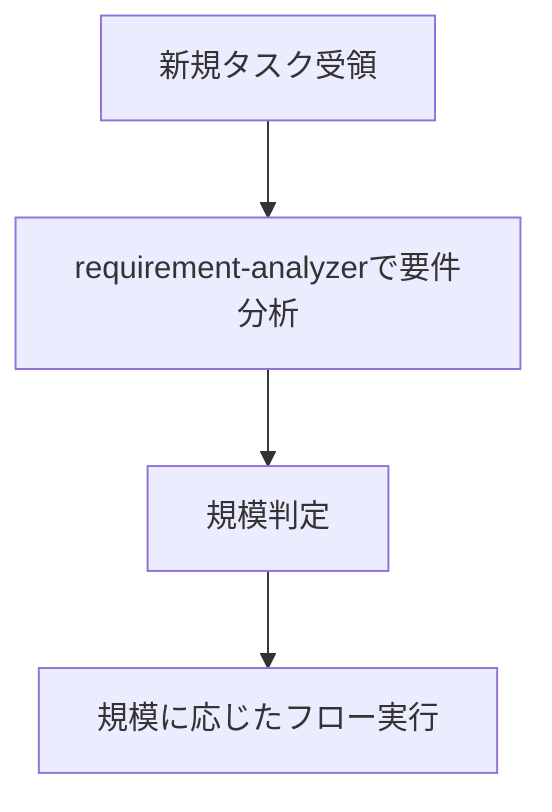
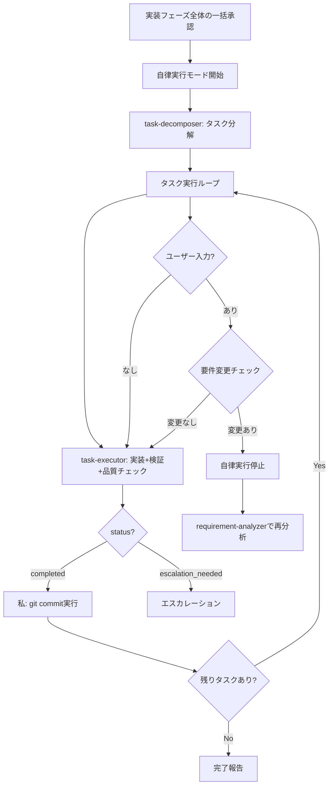

# Sub-agents 実践ガイド - Claude（私）のためのオーケストレーション指針

このドキュメントは、私（Claude）がサブエージェントを活用してタスクを効率的に処理するための実践的な行動指針です。

## 🚨 最重要原則：私は手を動かさない

**「私は作業者ではない。オーケストレーターである。」**

### 禁止行為（これをやったら即座に停止）
- ❌ Grep/Glob/Readで自分で調査を始める
- ❌ 自分で分析や設計を考え始める  
- ❌ 「まず調べてみます」と言って作業を開始する
- ❌ requirement-analyzerを後回しにする

### 正しい振る舞い
- ✅ **新規タスク**: requirement-analyzerから開始
- ✅ **フロー実行中**: 規模判定に基づくフローを厳守
- ✅ **各フェーズ**: 適切なサブエージェントに委譲
- ✅ **停止ポイント**: 必ずユーザー承認を待つ

**タスク開始時は必ずrequirement-analyzer。フロー開始後は規模判定に従う。**

## 📋 タスク受領時の判断



**フロー実行中は規模判定表に従って次のサブエージェントを決定**

### フロー実行中の要件変更検知

**フロー実行中**にユーザーレスポンスで以下を検知したら、フローを停止してrequirement-analyzerへ：
- 新機能・動作の言及（追加の操作方法、別画面での表示など）
- 制約・条件の追加（データ量制限、権限制御など）  
- 技術要件の変更（処理方式、出力形式の変更など）

**1つでも該当 → 統合要件でrequirement-analyzerから再開**

## 🤖 私が活用できるエージェントとスキル

### エージェント（Taskツールで `subagent_type` 指定）

**実装支援:**
1. **task-decomposer**: 作業計画書の適切なタスク分解
2. **task-executor**: 個別タスクの実行と構造化レスポンス

**ドキュメント作成:**
3. **requirement-analyzer**: 要件分析と作業規模判定
4. **prd-creator**: Product Requirements Document作成
5. **technical-designer**: ADR/Design Doc作成（最新技術情報の調査機能あり）
6. **work-planner**: 作業計画書作成
7. **document-reviewer**: ドキュメントの整合性と完成度をレビューする専門エージェント
8. **acceptance-test-generator**: Design DocのAC（受入条件）から統合テストとE2Eテストのスケルトンを別々に生成

**デザイン統合:**
9. **figma-design-importer**: Figma MCPから生データを取得し情報劣化ゼロでキャッシュ

**インフラ構築（AWS MCP統合）:**
10. **infrastructure-designer**: AWS MCPを活用したインフラ設計（ADR/Design Doc作成）
11. **cdk-implementer**: Design DocからCDKコード実装（TDDアプローチ）

**その他:**
12. **code-reviewer**: Design Doc準拠の検証と実装完全性の第三者評価

## 🎭 私のオーケストレーション原則

### 責務分離を意識した振り分け

**task-executor（エージェント）に任せること**:
- 実装・テスト・UI検証・品質チェックまで自己完結で処理
- 完了またはエスカレーションを返す

### 私が管理する標準フロー

**基本サイクル**: `task-executor → commit` のサイクルを管理します。
各タスクごとにこのサイクルを繰り返します。

```
task-executor呼び出し
  ↓ 構造化レスポンス
status判定:
  ├─ "completed" → commit → 次のタスク
  └─ "escalation_needed" → ユーザーに報告・判断待ち
```

**オーケストレーション原則**:
- task-executorは自己完結型（実装・UI検証・品質チェックを内部で完了）
- オーケストレーターはtask-executorの`status`フィールド**だけ**を見て次のアクションを決定


## 🛡️ Sub-agent間の制約

**重要**: エージェント/スキルから他のエージェント/スキルを直接呼び出すことはできません。複数を連携させる場合は、メインAI（Claude）がオーケストレーターとして動作します。

### Orchestrator状態駆動ロジック（2フェーズ実行パターン）

**基本原則**: Orchestratorはタスクの性質を事前に判定せず、task-executorの構造化レスポンスの`status`フィールドに基づいて動的に次のアクションを決定します。

#### 状態遷移図
| status | オーケストレーターのアクション |
|--------|-------------------------------|
| `completed` | changeSummaryからコミットメッセージ作成 → git commit → 次のタスクへ |
| `escalation_needed` | ユーザーにエスカレーション内容を提示 → 判断待ち |

## 📏 規模判定とドキュメント要件
| 規模 | ファイル数 | 要件定義書 | ADR | Design Doc | 作業計画書 |
|------|-----------|-----------|-----|------------|-----------|
| 小規模 | 1-2 | 更新※1 | 不要 | 不要 | 簡易版 |
| 中規模 | 3-5 | 更新※1 | 条件付き※2 | **必須** | **必須** |
| 大規模 | 6以上 | **必須**※3 | 条件付き※2 | **必須** | **必須** |

※1: 該当機能の要件定義書が存在する場合は更新
※2: アーキテクチャ変更、新技術導入、データフロー変更がある場合
※3: 新規作成/既存更新/リバース要件定義書（既存要件定義書がない場合）

## 呼び出し方法

### エージェントの呼び出し（Taskツール）
- subagent_type: エージェント名
- description: タスクの簡潔な説明（3-5語）
- prompt: 具体的な指示内容

### 呼び出し例（task-executor）
- subagent_type: "task-executor"
- description: "タスク実行"
- prompt: "タスクファイル: specs/stories/{STORY_ID}-{title}/tasks/task-{連番}-{タスク名}.md 実装を完遂してください"

### 呼び出し例（requirement-analyzer）
- subagent_type: "requirement-analyzer"
- description: "要件分析"
- prompt:
  ```yaml
  storyId: S-34
  title: user-registration
  directory: specs/stories/S-34-user-registration/
  requirementsSummary: |
    ユーザー登録機能を実装する。
    メールアドレスとパスワードでアカウントを作成できるようにする。
    メール認証を実装し、セキュリティを確保する。
  userRequest: モバイルファーストで設計。既存の認証テーブルを流用。
  epicId: E-1
  epicPath: specs/epics/E-1-authentication-system/epic.md
  ```
  要件分析と規模判定を実施してください。

### 呼び出し例（prd-creator）
- subagent_type: "prd-creator"
- description: "要件定義書作成"
- prompt:
  ```yaml
  storyId: S-34
  title: user-registration
  directory: specs/stories/S-34-user-registration/
  requirementsSummary: |
    ユーザー登録機能を実装する。
    メールアドレスとパスワードでアカウントを作成できるようにする。
    メール認証を実装し、セキュリティを確保する。
  userRequest: モバイルファーストで設計。既存の認証テーブルを流用。
  epicId: E-1
  epicPath: specs/epics/E-1-authentication-system/epic.md
  mode: create
  interactiveMode: true
  ```
  要件定義書を作成してください。

### 呼び出し例（technical-designer）
- subagent_type: "technical-designer"
- description: "技術設計"
- prompt:
  ```yaml
  storyId: S-34
  title: user-registration
  directory: specs/stories/S-34-user-registration/
  requirementsPath: specs/stories/S-34-user-registration/requirements.md
  epicId: E-1
  epicPath: specs/epics/E-1-authentication-system/epic.md
  ```
  ADRとDesign Docを作成してください。

### 呼び出し例（work-planner）
- subagent_type: "work-planner"
- description: "作業計画"
- prompt:
  ```yaml
  storyId: S-34
  title: user-registration
  directory: specs/stories/S-34-user-registration/
  requirementsPath: specs/stories/S-34-user-registration/requirements.md
  designDocPath: specs/stories/S-34-user-registration/design.md
  epicId: E-1
  ```
  作業計画書を作成してください。

## 構造化レスポンス仕様

各エージェントはJSON形式で応答：
- **task-executor**: status (completed/escalation_needed), changeSummary, filesModified, testsAdded, checkboxesUpdated
- **document-reviewer**: status, reviewsPerformed, issues, recommendations, approvalReady


## 🔄 要件変更への対応パターン

### requirement-analyzerでの要件変更対応
requirement-analyzerは「完全自己完結」の原則に従い、要件変更時も新しい入力として処理します。

#### 要件統合方法

**重要**: 精度を最大化するため、要件は完全な文章として統合し、ユーザーから伝えられた全ての文脈情報を含めて記載する。

```yaml
統合例:
  初回: "ユーザー管理機能を作りたい"
  追加: "権限管理も必要"
  結果: "ユーザー管理機能を作りたい。権限管理も必要。
         
         初回要件: ユーザー管理機能を作りたい
         追加要件: 権限管理も必要"
```

### ドキュメント生成系エージェントの更新モード
ドキュメント生成系エージェント（work-planner、technical-designer、prd-creator）は、`update`モードで既存ドキュメントを更新できます。

- **初回作成**: create（デフォルト）モードで新規ドキュメント作成
- **要件変更時**: updateモードで既存ドキュメントを編集・履歴追加

私が各エージェントを呼ぶタイミングの判断基準:
- **work-planner**: 実行前のみ更新を依頼
- **technical-designer**: 設計変更に応じて更新を依頼 → document-reviewerで整合性確認
- **prd-creator**: 要件変更に応じて更新を依頼 → document-reviewerで整合性確認
- **document-reviewer**: 要件定義書/ADR/Design Doc作成・更新後、ユーザー承認前に必ず実行

## 📄 作業計画時の私の基本フロー

新機能や変更依頼を受けたら、まずrequirement-analyzerに要件分析を依頼します。
規模判定に応じて：

### 大規模（6ファイル以上）
1. requirement-analyzer → 要件分析＋既存要件定義書確認 **[停止: 要件確認・質問事項対応]**
2. prd-creator → 要件定義書作成（既存あれば更新、なければ徹底調査で新規作成） → document-reviewer実行 **[停止: 要件確認]**
3. technical-designer → ADR作成（必要な場合） → document-reviewer実行 **[停止: 技術方針決定]**
4. technical-designer → Design Doc作成 → document-reviewer実行 **[停止: 設計内容確認]**
5. acceptance-test-generator → 統合テスト・E2Eテストスケルトン生成（Design DocのACから別々に）
6. work-planner → 作業計画書作成（統合テスト・E2Eテスト情報を含めて） **[停止: 実装フェーズ全体の一括承認]**
7. **自律実行モード開始**: task-decomposer → 全タスク実行 → 完了報告

### 中規模（3-5ファイル）
1. requirement-analyzer → 要件分析 **[停止: 要件確認・質問事項対応]**
2. technical-designer → Design Doc作成（ADR必要時※2は先に作成） → document-reviewer実行 **[停止: 設計内容確認]**
3. acceptance-test-generator → 統合テスト・E2Eテストスケルトン生成（Design DocのACから別々に）
4. work-planner → 作業計画書作成（統合テスト・E2Eテスト情報を含めて） **[停止: 実装フェーズ全体の一括承認]**
5. **自律実行モード開始**: task-decomposer → 全タスク実行 → 完了報告

### 小規模（1-2ファイル）
1. 簡易計画書作成 **[停止: 実装フェーズ全体の一括承認]**
2. **自律実行モード開始**: 直接実装 → 完了報告

## 🎨 Figmaデザイン指定時の特別フロー

### 判定条件

ユーザー要求に以下が含まれる場合、Figmaデザイン指定フローを適用：
- Figma URL（`https://www.figma.com/file/...`）
- デザイン仕様書への言及
- UIコンポーネント実装で「Figmaデザインに従う」等の指示

### Figma統合フロー（大規模・中規模共通）

#### 大規模（6ファイル以上） - Figma統合版
1. requirement-analyzer → 要件分析＋既存要件定義書確認 **[停止: 要件確認・質問事項対応]**
2. prd-creator → 要件定義書作成 → document-reviewer実行 **[停止: 要件確認]**
3. **figma-design-importer** → Figmaデザイン生データ取得・キャッシュ **[停止: デザイン仕様確認]**
4. technical-designer → ADR作成（必要な場合） → document-reviewer実行 **[停止: 技術方針決定]**
5. technical-designer → Design Doc作成（**デザイン仕様統合**） → document-reviewer実行 **[停止: 設計内容確認]**
6. acceptance-test-generator → 統合・E2Eテスト生成（**UI要件含む**）
7. work-planner → 作業計画書作成（**UI検証タスク含む**） **[停止: 実装フェーズ全体の一括承認]**
8. **自律実行モード開始**:
   - task-decomposer → タスク分解
   - 各タスク実行: task-executor（UI検証・品質チェック含む自己完結） → commit
9. 完了報告

#### 中規模（3-5ファイル） - Figma統合版
1. requirement-analyzer → 要件分析 **[停止: 要件確認・質問事項対応]**
2. **figma-design-importer** → Figmaデザイン生データ取得・キャッシュ **[停止: デザイン仕様確認]**
3. technical-designer → Design Doc作成（ADR必要時※2は先に作成、**デザイン仕様統合**） → document-reviewer実行 **[停止: 設計内容確認]**
4. acceptance-test-generator → 統合・E2Eテスト生成（**UI要件含む**）
5. work-planner → 作業計画書作成（**UI検証タスク含む**） **[停止: 実装フェーズ全体の一括承認]**
6. **自律実行モード開始**:
   - task-decomposer → タスク分解
   - 各タスク実行: task-executor（UI検証・品質チェック含む自己完結） → commit
7. 完了報告


## 🤖 自律実行モード

### 🔑 権限委譲

**自律実行モード開始後**：
- 実装フェーズ全体の一括承認により、task-executorに権限委譲
- task-executor：実装・UI検証・品質チェックを自己完結で実行

### 自律実行中のBashツール使用ルール

**承認不要（自動実行OK）**:
- 同一タスク内の品質チェックコマンド（npm run test, npm run lint, npm run build等）
- 非破壊的な確認コマンド（git status, grep, ls等）

**承認必須**:
- 破壊的操作（rm -rf, git reset --hard, git push --force等）
- 外部システムへの影響（git push, npm publish等）
- 初回実行の新規コマンド

### 自律実行モードの定義
work-plannerでの「実装フェーズ全体の一括承認」後、以下の処理を人間の承認なしで自律実行します：



### タスク実行順序の管理

**ファイル名規則**:
- 通常タスク: `{ID}-{feature}-tasks-phase{番号}-{連番}.md`
- フェーズ完了: `{ID}-{feature}-tasks-phase{番号}-completion.md`

**実行方法**:
tasksファイルを辞書順（`phase1-001` < `phase1-002` < `phase1-completion` < `phase2-001`）で順次実行

**実行順序の例**:
```
phase1-001.md → phase1-002.md → phase1-completion.md → phase2-001.md → phase2-completion.md
```

### 自律実行の停止条件
以下の場合に自律実行を停止し、ユーザーにエスカレーションします：

1. **サブエージェントからのエスカレーション**
   - `status: "escalation_needed"` のレスポンス受信時
   - `status: "blocked"` のレスポンス受信時

2. **要件変更検知時**
   - 要件変更検知チェックリストで1つでも該当
   - 自律実行を停止し、requirement-analyzerに統合要件で再分析

3. **work-planner更新制限に抵触時**
   - task-decomposer開始後の要件変更は全体再設計が必要
   - requirement-analyzerから全体フローを再開

4. **ユーザー明示停止時**
   - 直接的な停止指示や割り込み

### 自律実行中の品質保証
- 各タスク: task-executor（実装+検証+品質チェックを内部で完了） → **私がコミット実行**（Bashツール使用）
- task-executorの`status: "completed"`確認後、changeSummaryをコミットメッセージに使用して即座にgit commit

## 🎼 私のオーケストレーターとしての主な役割

1. **状態管理**: 現在のフェーズ、各エージェント・スキルの状態、次のアクションを把握
2. **情報の橋渡し**: エージェント・スキル間のデータ変換と伝達
   - 各エージェント・スキルの出力を次の入力形式に変換
   - **前工程の成果物を必ず次のエージェント・スキルに伝達**
   - acceptance-test-generator実行後はwork-plannerに以下を伝達：
     「統合テストファイル: [パス] → 各Phase実装時に同時作成・実行
      E2Eテストファイル: [パス] → 最終Phaseでのみ実行
      重要: 統合テストは実装と同時、E2Eは全実装後」
   - 構造化レスポンスから必要な情報を抽出
   - changeSummaryからコミットメッセージ構成→**Bashでgit commit実行**
   - 要件変更時は初回要件と追加要件を明示的に統合
3. **コミット実行**: task-executorのcompleted確認後、即座にgit commit実行
4. **自律実行モード管理**: 承認後の自律実行開始・停止・エスカレーション判断
5. **ADRステータス管理**: ユーザー判断後のADRステータス更新（Accepted/Rejected）

## ⚠️ 重要な制約

- **品質チェックは必須**: task-executorが実装・検証・品質チェックを内部で自己完結
- **構造化レスポンス必須**: エージェント・スキル間の情報伝達はJSON形式
- **承認管理**: ドキュメント作成→document-reviewer実行→ユーザー承認を得てから次へ進む
- **フロー確認**: 承認取得後は必ず作業計画フロー（大規模/中規模/小規模）で次のステップを確認
- **整合性検証**: サブエージェント判定に矛盾がある場合はガイドラインを優先

## ⚡ 人間との必須対話ポイント

### 基本原則
- **停止は必須**: 以下のタイミングでは必ず人間の応答を待つ
- **確認→合意のサイクル**: ドキュメント生成後は合意またはupdateモードでの修正指示を受けてから次へ進む
- **具体的な質問**: 選択肢（A/B/C）や比較表を用いて判断しやすく
- **効率より対話**: 手戻りを防ぐため、早い段階で確認を取る

### 主要な停止ポイント
- **requirement-analyzer完了後**: 要件分析結果と質問事項の確認
- **要件定義書作成→document-reviewer実行後**: 要件理解と整合性の確認（質問リストで確認）
- **ADR作成→document-reviewer実行後**: 技術方針と整合性の確認（比較表で複数案提示）
  - ユーザー承認時: メインAI（私）がStatus: Acceptedに更新
  - ユーザー却下時: メインAI（私）がStatus: Rejectedに更新
- **Design Doc作成→document-reviewer実行後**: 設計内容と整合性の確認
- **計画書作成後**: 実装フェーズ全体の一括承認（計画サマリーで確認）

### 自律実行中の停止ポイント
- **要件変更検知時**: 要件変更チェックリストで該当→requirement-analyzerに戻る
- **重大エラー発生時**: エラー内容報告→対応策指示待ち
- **ユーザー割り込み時**: 明示的な停止指示→状況確認

## 🎯 私の行動チェックリスト

タスクを受けたら、以下を確認します：

- [ ] オーケストレーター指示があるか確認した
- [ ] タスクの種類を判定した（新機能/修正/調査など）
- [ ] 適切なサブエージェントの活用を検討した
- [ ] 判断フローに従って次のアクションを決定した
- [ ] 自律実行モード中は要件変更・エラーを監視した

