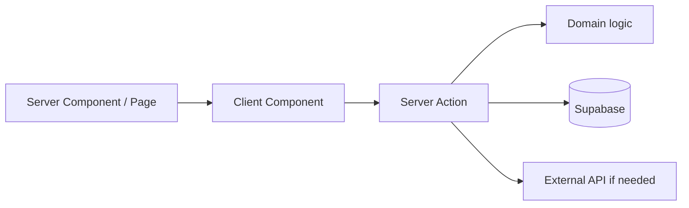

# Design: [機能名]

## 概要

- 目的: [設計で実現すること]
- 実装戦略: Vertical Slice / Horizontal Layering / Hybrid
- 選択理由: [依存関係とリスク]

## 現状調査

- 既存の再利用箇所: [path / symbol]
- 呼び出し関係: [入口から永続化まで]
- 既存テスト: [path]
- 置換対象: [旧実装を削除・更新する範囲]

## アーキテクチャ

### 責務境界

| 層 | 責務 | 配置 |
|---|---|---|
| Page / Server Component | 読み取りと初期表示 | `frontend/app/**` |
| Client Component | 操作と一時的 UI 状態 | `frontend/src/components/**` |
| Server Action | 入力検証、認証、所有権、I/O 調整 | `frontend/src/actions/**` |
| Domain | SRS・日付などの純粋ロジック | `frontend/src/lib/**` |
| Data | schema、RLS、Storage、seed | `supabase/**` |

Server/Client 境界と server-only secret の参照元を明記する。

## データ設計

- 使用 table / column: [一覧]
- constraint / index: [一意性、外部キー、検索根拠]
- `ON CONFLICT` を使う場合の対応 unique / exclusion constraint: [名称]
- migration: [必要性と順序]
- RLS actor matrix: owner / other user / anonymous / service role
- Storage: [bucket、path、signed URL]
- Database 型と seed: [更新内容]

## API・Action 契約

### [actionName]

- 入力: [型と検証]
- 認証・所有権: [失敗時の動作]
- 成功結果: [discriminated union]
- 失敗結果: [UI に安全なエラー]
- 副作用順序・冪等性: [説明]

## UI 設計

- route: [path]
- states: loading / empty / error / disabled / complete / pending
- responsive: mobile / desktop
- accessibility: heading、label、keyboard、focus、48px touch target
- Show Answer 前後の情報境界: [該当時]
- UI 根拠: requirements / design system / 既存 component

## 外部 API

- 送信データ: [個人情報を含まないこと]
- timeout / retry / rate / cost: [方針]
- failure fallback: [ユーザー体験]
- secret: [server-only env]

## 受入条件とテスト

| AC | テストレベル | テスト / 確認場所 | 期待結果 |
|---|---|---|---|
| AC-01 | L1 / L2 / L3 | [path / 手順] | [結果] |

- L1: 純粋関数・静的検査
- L2: Action / Component / RLS 境界
- L3: 実ブラウザのユーザー経路。Playwright 導入済みとは仮定しない

## 移行・ロールバック

- deploy / migration 順序: [説明]
- 既存データ: [backfill / compatibility]
- rollback または forward-fix: [説明]

## リスク・未解決事項

| 項目 | 影響 | 対応 |
|---|---|---|
| [項目] | 高/中/低 | [対応] |
