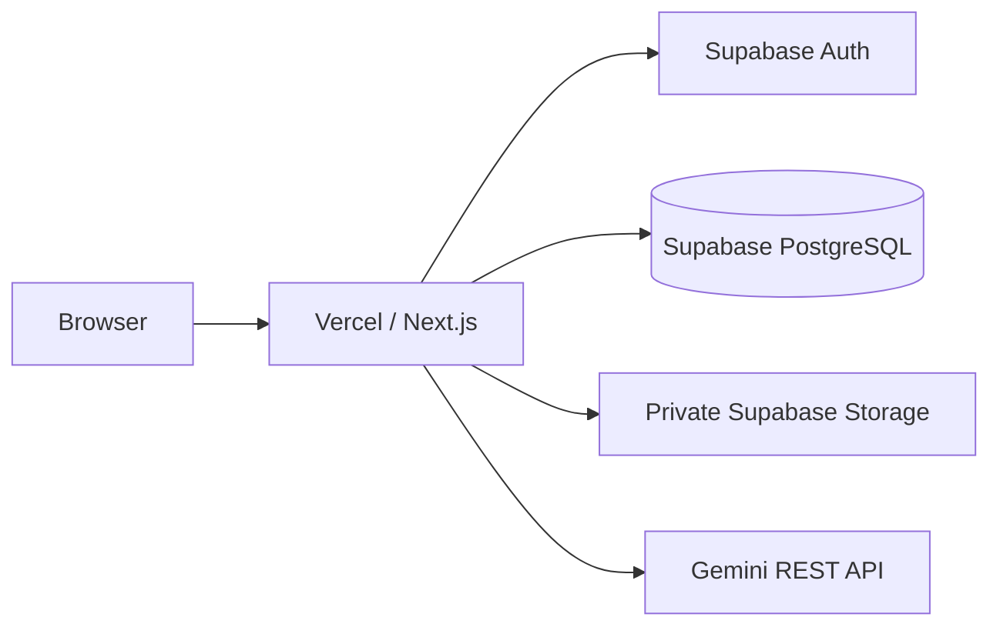

# Infrastructure Design: [機能名]

## 目的とスコープ

- 目的: [変更で実現すること]
- 含む: [Vercel / Supabase / Gemini / environment の対象]
- 含まない: [対象外]
- 対象環境: local / preview / production

## 現行構成

ブラウザから参照できるのは `NEXT_PUBLIC_SUPABASE_URL` と `NEXT_PUBLIC_SUPABASE_ANON_KEY` のみ。service role key と Gemini key は server-only とする。

## 変更後構成

- Component / service: [変更内容]
- Data flow: [リクエストから永続化まで]
- Trust boundary: [browser / Vercel server / Supabase / Gemini]
- Failure boundary: [どこまで劣化可能か]

## Supabase 設計

### Schema / Migration

- migration file: `supabase/migrations/[timestamp]_[description].sql`
- table / column / constraint / index: [一覧]
- `ON CONFLICT` target と対応 constraint: [名称]
- 既存データ backfill: [方法]
- lock / rewrite / destructive risk: [有無]

### RLS actor matrix

| Actor | Select | Insert | Update | Delete |
|---|---|---|---|---|
| owner | [期待] | [期待] | [期待] | [期待] |
| other user | deny | deny | deny | deny |
| anonymous | [public 契約のみ] | deny | deny | deny |
| service role | [限定管理用途] | [限定] | [限定] | [限定] |

### Storage

- bucket / public setting: [private]
- object path: `{user_id}/{illustration_id}.png`
- signed URL: [TTL と発行箇所]
- row / object の整合性と孤児対策: [方針]

## Vercel / Environment

| Variable | Browser | Server | Required | 用途 |
|---|---|---|---|---|
| `NEXT_PUBLIC_SUPABASE_URL` | yes | yes | yes | Supabase URL |
| `NEXT_PUBLIC_SUPABASE_ANON_KEY` | yes | yes | yes | anon client |
| `SUPABASE_SERVICE_ROLE_KEY` | no | yes | service role 利用時 | 限定管理処理 |
| `GEMINI_API_KEY` | no | yes | illustration 利用時 | Gemini |

- local / preview / production の値と Supabase project を混在させない。
- secret を build log、client chunk、スクリーンショットへ含めない。

## Deploy / Migration 順序

1. [互換性のある migration]
2. [preview deploy と smoke]
3. [production migration / deploy]
4. [canary と監視]

rollback または forward-fix: [手順]

## 検証計画

| Level | 検証 | 成功条件 |
|---|---|---|
| Static | SQL review、typecheck、env 境界 | [条件] |
| Local integration | migration apply、constraint、RLS、seed 再実行 | [条件] |
| Preview | auth、Action、Storage、外部 API failure | [条件] |
| Production canary | login、deck、study、ログ | [条件] |

## 可観測性・コスト

- error / audit log: [機密情報を除く]
- alert / dashboard: [必要項目]
- Gemini / Supabase / Vercel cost: [上限と確認]

## リスク

| リスク | 影響 | 緩和策 |
|---|---|---|
| [リスク] | 高/中/低 | [対策] |
