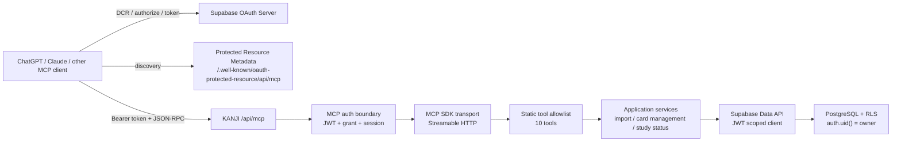
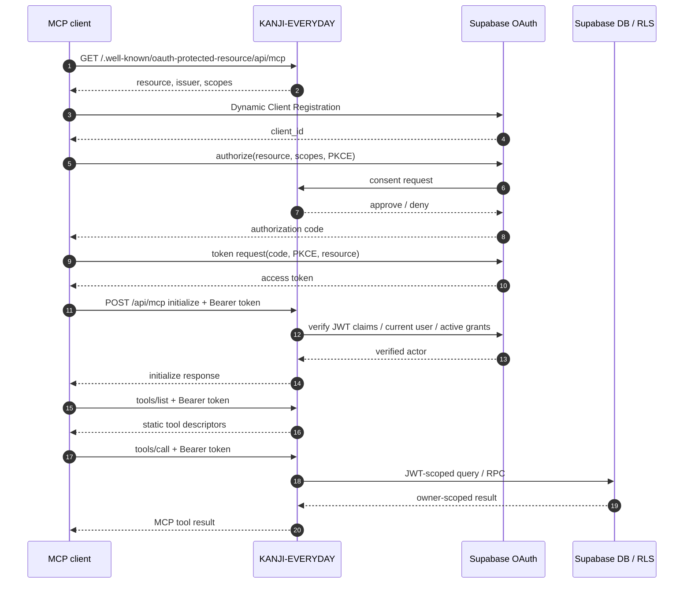
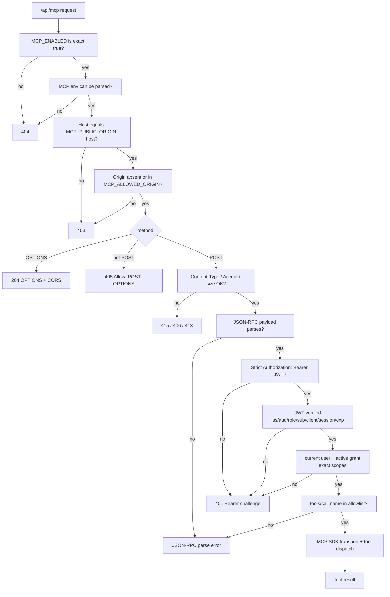
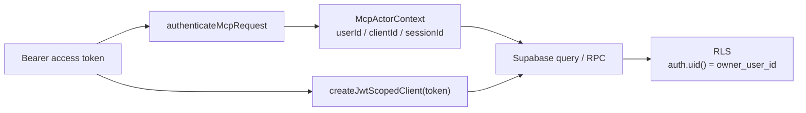
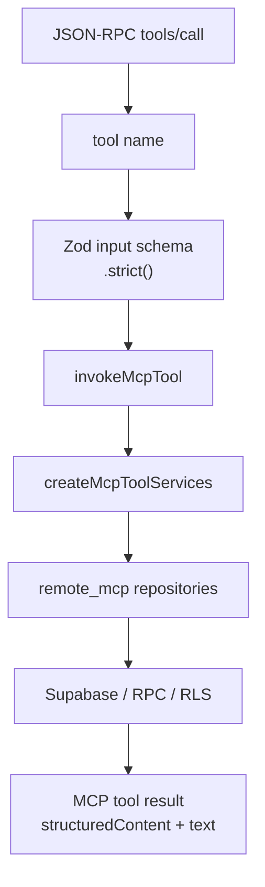
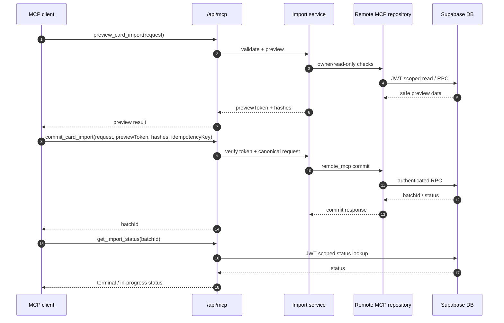

# Remote MCP 連携の仕組み

この資料は、KANJI-EVERYDAY が ChatGPT / Claude などの外部 AI クライアントへ公開している Remote MCP の全体像を説明する。対象は `POST /api/mcp` を入口にした MCP 連携であり、TimeCoin 用の `GET /api/timecoin/daily-study-status` REST API は [TimeCoin API Integration IF](./timecoin-api-integration-if.md) を正本として扱う。

## 1. 何を実現しているか

Remote MCP は、外部 AI クライアントがユーザー本人の権限で KANJI-EVERYDAY のデッキや AI カードを操作するための境界である。

- 外部クライアントは Supabase OAuth でユーザーから許可を得る。
- KANJI-EVERYDAY は Bearer access token を毎リクエスト検証する。
- 検証済み token から JWT-scoped Supabase client を作る。
- DB 操作は `auth.uid()` と RLS の内側で実行する。
- tool input から `ownerId` や `userId` は受け取らない。



## 2. 公開 endpoint

| Endpoint | 役割 | 実装 |
| --- | --- | --- |
| `GET /.well-known/oauth-protected-resource/api/mcp` | MCP protected resource metadata を返す | `frontend/app/.well-known/oauth-protected-resource/api/mcp/route.ts` |
| `POST /api/mcp` | MCP JSON-RPC の本体。`initialize`、`tools/list`、`tools/call` を処理 | `frontend/app/api/mcp/route.ts` |
| `OPTIONS /api/mcp` | 許可済み Origin への CORS preflight | `frontend/src/lib/mcp/route-handler.ts` |
| `GET /api/mcp` / `DELETE /api/mcp` | 現行の stateless 構成では 405 | `frontend/src/lib/mcp/route-handler.ts` |
| `/oauth/consent/*` | Supabase OAuth consent の UI / action | `frontend/app/oauth/*` |

Metadata は次の契約を返す。

```json
{
  "resource": "https://<MCP_PUBLIC_ORIGIN>/api/mcp",
  "authorization_servers": ["https://<project-ref>.supabase.co/auth/v1"],
  "bearer_methods_supported": ["header"],
  "scopes_supported": ["openid", "email", "profile"]
}
```

## 3. OAuth と MCP 接続フロー

OAuth 成功と MCP tool 利用可能は別の段階である。consent で許可して token が発行されても、`/api/mcp` の認証、`initialize`、`tools/list` が失敗すれば外部クライアントからは利用できない。



## 4. `/api/mcp` のリクエスト境界

`/api/mcp` は tool dispatch の前に HTTP / auth / protocol の境界を順に検査する。失敗した場合は DB へ触れない。



### 4.1 Origin 設定

`MCP_ALLOWED_ORIGIN` はカンマ区切りで複数 Origin を持てる。例:

```dotenv
MCP_ALLOWED_ORIGIN=https://chatgpt.com,https://claude.ai,https://timecoin-cloud.vercel.app
```

これは CORS と browser Origin の境界であり、認証の代替ではない。Origin が一致しても、Bearer token、JWT claim、active grant、RLS が通らなければ tool は実行されない。

## 5. 認証・認可の考え方

MCP の認証は `frontend/src/lib/mcp/auth.ts` に集約されている。主な検査は次の通り。

| 検査 | 内容 |
| --- | --- |
| Bearer parse | `Authorization` header が 1 つだけで、`Bearer <JWT>` 形式であること |
| JWT header | `alg` は `RS256` または `ES256`、`kid` があること |
| 署名検証 | Supabase Auth の `getClaims(token)` で検証 |
| claim 検証 | `iss`、`aud`、`role=authenticated`、UUID `sub`、`client_id`、`session_id`、`exp` / `nbf` |
| user liveness | `auth.getUser(token)` の user id が `sub` と一致 |
| grant liveness | `/auth/v1/user/oauth/grants` で同じ `client_id` の active grant が 1 件あること |
| scope | grant scopes が `openid email profile` と完全一致すること |

認証後の actor は次の最小情報だけを持つ。

```ts
type McpActorContext = Readonly<{
  userId: string
  clientId: string
  sessionId: string
  issuer: string
  audience: string
  scopes: readonly ["openid", "email", "profile"]
}>
```

raw token は domain object に保存せず、`createJwtScopedClient(accessToken)` に閉じ込める。



## 6. Tool dispatch

Tool は `frontend/src/lib/mcp/tools.ts` の静的 allowlist からだけ公開される。未知 tool 名や未知 field は application service の前で拒否される。

| Tool | 種別 | 説明 |
| --- | --- | --- |
| `list_decks` | read | 本人所有で `deleted_at IS NULL` のデッキ一覧 |
| `get_daily_study_status` | read | 本日の学習完了ステータス |
| `create_deck` | mutation | 本人所有デッキを作成 |
| `preview_card_import` | read / write-free | AIカード import の事前検証と preview token 発行 |
| `commit_card_import` | mutation | 確認済み preview を非同期登録 |
| `get_import_status` | read | import batch の状態取得 |
| `list_ai_cards` | read | AI private card の一覧 |
| `update_ai_card` | mutation | AI private card の編集 |
| `delete_ai_cards` | destructive | AI private card の削除 |
| `undo_import_batch` | destructive | import batch の取り消し |

全 tool descriptor は OAuth security scheme と `_meta.securitySchemes` を持ち、scope は `openid email profile` のみである。実際の card 操作権限は scope ではなく、tool allowlist、actor、active grant、JWT-scoped client、RLS で制限する。



## 7. AIカード import の流れ

AIカード登録は `preview_card_import` と `commit_card_import` の 2 段階に分かれる。

1. `preview_card_import`
   - request を正規化・検証する。
   - owner deck / upload / duplicate を確認する。
   - DB reservation や batch は作らない。
   - `AI_PREVIEW_HMAC_SECRET` で preview token を発行する。
2. `commit_card_import`
   - preview token、request hash、reservation key、idempotency key を再検証する。
   - source は server 側で `remote_mcp` に固定する。
   - Supabase RPC が actor / hash / reservation / idempotency を再検証する。
   - 非同期 batch を作成し、`get_import_status` で追跡する。



## 8. エラーの分離

| レイヤー | 例 | 返し方 |
| --- | --- | --- |
| HTTP boundary | disabled、invalid host/origin、unsupported media、payload too large | `404`、`403`、`415`、`413` |
| Auth boundary | token なし、JWT 不正、grant revoked、scope 不一致 | `401` + `WWW-Authenticate` |
| MCP protocol | JSON parse error、unknown tool、invalid JSON-RPC shape | JSON-RPC error |
| Domain validation | field 不正、conflict、not found | `isError: true` の tool result |
| Unexpected failure | DB/provider/implementation error | safe `INTERNAL_ERROR`。token、secret、SQL detail は返さない |

## 9. 環境変数 reference

| Key | 例 | 役割 |
| --- | --- | --- |
| `MCP_ENABLED` | `true` | MCP endpoint を有効化。`trim() === "true"` のみ有効 |
| `MCP_PUBLIC_ORIGIN` | `https://kanji-everyday.vercel.app` | canonical resource と Host 検証の正本 |
| `MCP_ALLOWED_ORIGIN` | `https://chatgpt.com,https://claude.ai` | browser Origin allowlist。カンマ区切りで複数指定可能 |
| `MCP_OAUTH_ISSUER` | `https://<project-ref>.supabase.co/auth/v1` | Supabase OAuth issuer |
| `AI_PREVIEW_HMAC_SECRET` | secret | preview token 署名。実値を docs / logs に残さない |
| `AI_CARD_IMPORT_ENABLED` | `true` | import と `image.mode="ai"` の受付 |
| `AI_CARD_MANAGEMENT_ENABLED` | `true` | AIカード管理機能の受付 |
| `OPENAI_API_KEY` | secret | MCP commit 時の自動 mnemonic 生成に必要 |
| `MCP_AUTO_MNEMONIC_MAX_CONCEPTS` | `20` | commit 1 回あたりの自動 mnemonic 生成上限。`0` で停止 |
| `MCP_AUTO_MNEMONIC_BUDGET_MS` | `45000` | 自動 mnemonic 生成の時間予算 |

## 10. 最小確認コマンド

token や secret は shell history / docs / issue に残さない。ここでは未認証境界と metadata だけを確認する。

```bash
curl -i https://kanji-everyday.vercel.app/.well-known/oauth-protected-resource/api/mcp
```

期待値:

- HTTP 200
- `resource` が `https://kanji-everyday.vercel.app/api/mcp`
- `scopes_supported` が `openid`、`email`、`profile`

```bash
curl -i \
  -X POST \
  -H 'Origin: https://chatgpt.com' \
  -H 'Content-Type: application/json' \
  -H 'Accept: application/json' \
  --data '{"jsonrpc":"2.0","id":1,"method":"initialize","params":{"protocolVersion":"2025-11-25","capabilities":{},"clientInfo":{"name":"diagnostic","version":"1"}}}' \
  https://kanji-everyday.vercel.app/api/mcp
```

期待値:

- HTTP 401
- `WWW-Authenticate` に `resource_metadata="https://kanji-everyday.vercel.app/.well-known/oauth-protected-resource/api/mcp"` が含まれる
- scope が `openid email profile`

```bash
curl -i \
  -X OPTIONS \
  -H 'Origin: https://chatgpt.com' \
  -H 'Access-Control-Request-Method: POST' \
  https://kanji-everyday.vercel.app/api/mcp
```

期待値:

- HTTP 204
- `Access-Control-Allow-Origin: https://chatgpt.com`
- `Access-Control-Allow-Methods: POST, OPTIONS`

## 11. TimeCoin REST API との違い

TimeCoin 連携用に追加した `GET /api/timecoin/daily-study-status` は MCP ではない。MCP と同じ Supabase OAuth access token を使うが、IF は JSON-RPC ではなく単一 REST endpoint である。OAuth client 登録値、TimeCoin 側 env、token 保管、error contract、smoke test は [TimeCoin API Integration IF](./timecoin-api-integration-if.md) を参照する。

| 観点 | Remote MCP | TimeCoin REST API |
| --- | --- | --- |
| URL | `/api/mcp` | `/api/timecoin/daily-study-status` |
| 形式 | MCP JSON-RPC / tools | REST GET |
| client | ChatGPT / Claude など tool 実行 client | TimeCoin |
| origin 設定 | `MCP_ALLOWED_ORIGIN` 複数対応 | `TIMECOIN_API_ALLOWED_ORIGIN` 単一 |
| 認証 | Bearer JWT + active grant + exact scopes | Bearer JWT + issuer/role/current user liveness |
| 返却 | tool ごとの structured result | `{ contractVersion, date, state, completed }` |

## 12. Source map

| 領域 | 主なファイル |
| --- | --- |
| env parse | `frontend/src/lib/env.ts` |
| protected resource metadata | `frontend/src/lib/mcp/metadata.ts` |
| auth boundary | `frontend/src/lib/mcp/auth.ts` |
| HTTP boundary | `frontend/src/lib/mcp/route-handler.ts` |
| Next route | `frontend/app/api/mcp/route.ts` |
| MCP SDK transport | `frontend/src/lib/mcp/server.ts` |
| tool schema / descriptor / dispatch | `frontend/src/lib/mcp/tools.ts` |
| tool services | `frontend/src/lib/mcp/services.ts` |
| JWT-scoped Supabase client | `frontend/src/lib/supabase/server.ts` |
| TimeCoin REST API runbook | `docs/runbooks/timecoin-api-integration-if.md` |
| troubleshooting | `docs/runbooks/chatgpt-mcp-troubleshooting.md` |
| release runbook | `docs/runbooks/ai-card-import.md` |
