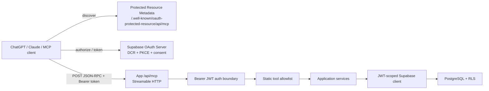
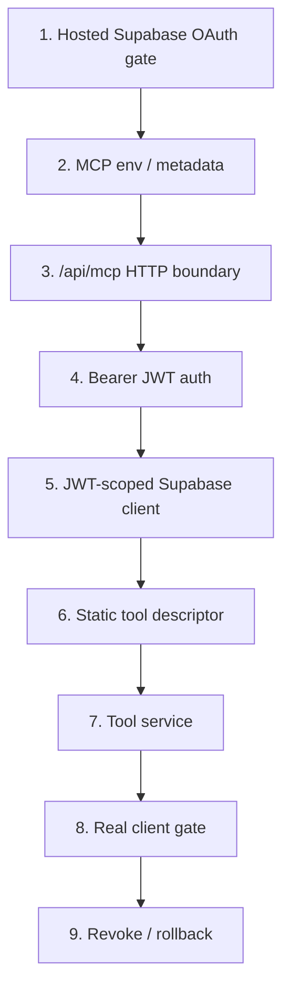
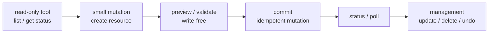

# Remote MCP + Supabase OAuth 横展開ガイド

この資料は、KANJI-EVERYDAY で実装した Remote MCP を別プロジェクトへ移植するときの判断材料をまとめる。前提は KANJI と同じく、Supabase OAuth Server、Authorization Code + PKCE、Dynamic Client Registration、Bearer JWT、JWT-scoped Supabase client、RLS を使う方式である。

## 1. Issue / PR だけ見れば分かるか

Issue / PR だけでも実装の大枠は追える。ただし、つまずきポイントは PR 本文、runbook、ADR、story design、運用ログに分散しているため、別プロジェクトへ横展開する正本としては不足する。

最初に読む順序は次の通り。

| 優先 | 資料 | 何が分かるか |
| --- | --- | --- |
| 1 | [ADR-011](../../specs/adr/ADR-011-supabase-oauth-remote-mcp-security-boundary.md) | Supabase OAuth と Remote MCP をどういう安全境界に置くか |
| 2 | [Remote MCP 連携の仕組み](./mcp-integration-architecture.md) | 現行実装の全体フロー、endpoint、tool dispatch、env |
| 3 | [ChatGPT MCP 接続トラブルシューティング](./chatgpt-mcp-troubleshooting.md) | 実際につまずいた接続失敗と診断順序 |
| 4 | [Issue #11](https://github.com/Ardama18/KANJI-EVERYDAY/issues/11) | 初期要件。Remote MCP + Supabase OAuth の親 Issue |
| 5 | [PR #25](https://github.com/Ardama18/KANJI-EVERYDAY/pull/25) | `/api/mcp`、OAuth consent、JWT/RLS、tool 群の基盤実装 |
| 6 | [Issue #28](https://github.com/Ardama18/KANJI-EVERYDAY/issues/28) / [PR #29](https://github.com/Ardama18/KANJI-EVERYDAY/pull/29) | 初回ユーザーが deck 0 件で詰まったため `create_deck` を追加した経緯 |
| 7 | [Issue #71](https://github.com/Ardama18/KANJI-EVERYDAY/issues/71) / [PR #73](https://github.com/Ardama18/KANJI-EVERYDAY/pull/73) | read-only tool を後から追加するパターン |
| 8 | [Issue #88](https://github.com/Ardama18/KANJI-EVERYDAY/issues/88) / [PR #89](https://github.com/Ardama18/KANJI-EVERYDAY/pull/89) | MCP ではなく REST API に切り出した判断例 |
| 9 | [Issue #90](https://github.com/Ardama18/KANJI-EVERYDAY/issues/90) / [PR #91](https://github.com/Ardama18/KANJI-EVERYDAY/pull/91) | 同じ OAuth consent でも用途ごとに説明文を分ける必要性 |

## 2. 採用した方式



重要な設計判断は次の通り。

- OAuth Server は Supabase を使う。
- custom scope は使わず、scope は `openid email profile` に固定する。
- card / deck 操作の認可は scope ではなく、tool allowlist、actor、active grant、JWT-scoped client、RLS で制御する。
- `userId`、`ownerId`、`date` などの selector を tool input から受け取らない。
- service role でユーザー request を処理しない。
- tool descriptor は静的 allowlist で固定し、未知 tool と未知 field を service 前で拒否する。
- domain validation error は tool result、auth failure は HTTP 401、protocol failure は JSON-RPC error に分ける。

## 3. 実装単位

別プロジェクトへ移植する場合は、次の順で分けるとよい。



各段階の完了条件:

| 段階 | 完了条件 |
| --- | --- |
| Hosted OAuth gate | DCR、login、consent、token、userinfo が Hosted Supabase で通る |
| Metadata | `/.well-known/oauth-protected-resource/api/mcp` が canonical resource と exact scopes を返す |
| HTTP boundary | disabled、Host、Origin、method、Content-Type、Accept、payload size を tool dispatch 前に拒否できる |
| Auth | issuer、audience、role、sub、client_id、session_id、exp、active grant、exact scopes を毎 request 検証する |
| Supabase client | access token を閉じ込めた JWT-scoped client で RLS 内の query / RPC を実行する |
| Tool descriptor | `description`、`inputSchema`、`annotations`、top-level と `_meta` の `securitySchemes` を返す |
| Tool service | input は strict schema、owner は actor 由来、raw error / token / secret を返さない |
| Real client gate | ChatGPT / Claude など実 client で `initialize`、`tools/list`、read tool、mutation tool が通る |
| Revoke / rollback | connection revoke 後の旧 token が拒否され、feature flag で fail closed できる |

## 4. 実際につまずいたポイント

### 4.1 OAuth 成功と MCP 成功は別

login、consent、token exchange が成功しても、その後の `initialize` と `tools/list` が失敗すると ChatGPT / Claude からは接続失敗に見える。最初に OAuth を疑い切らず、次の順で切り分ける。

```text
metadata -> DCR -> login -> consent -> token -> userinfo -> initialize -> tools/list -> tools/call
```

### 4.2 access token と ID token の audience は違う

access token の audience は MCP resource、ID token の audience は OAuth client ID になる。両方を MCP resource に揃えようとすると OIDC と食い違う。

### 4.3 安定した origin が必要

`MCP_PUBLIC_ORIGIN`、metadata の `resource`、Bearer challenge、client に登録する MCP URL は同じ安定 origin に揃える。Vercel の deploy-specific preview URL を正本にすると、次回デプロイで token audience や resource がずれる。

### 4.4 `authorization_id` は opaque identifier

Supabase consent で扱う authorization ID は UUID と決め打ちしない。中身を解釈せず、長さと許可文字種だけを検証する。

### 4.5 consent approve / deny は server-side POST に寄せる

client component から redirect object や response を直接扱うと、consent 後の client-side exception が起きやすい。approve / deny は server-side POST で処理し、Supabase が返した公式 redirect だけへ HTTP 303 で遷移する。

### 4.6 tool descriptor は schema だけでは足りない

実 client 互換では `description`、`inputSchema`、`annotations`、top-level と `_meta` の `securitySchemes` の一致が重要だった。`tools/list` が HTTP 200 でも、descriptor が弱いと「使えるアクションがない」状態になる。

### 4.7 HTTP boundary を狭めすぎない

実 client と SDK は `Content-Type` / `Accept` の出し方に差がある。KANJI では JSON として扱える範囲を許可しつつ、Host、Origin、Bearer token、protocol body は厳格にした。

### 4.8 Hosted Supabase と local Supabase の役割は別

local DB は migration、RLS、RPC の再現性確認に向く。一方、DCR、Hosted OAuth、login、consent、token、userinfo、実 client 接続は Hosted Supabase でしか確認できない。local の成功を Hosted OAuth 成功の証跡にしない。

### 4.9 DCR は client を増やしやすい

接続できないたびに ChatGPT connector を作り直すと、Supabase OAuth client が増える。server contract が壊れている場合は、connector を増やしても同じ場所で失敗する。まず同じ connector で解除・再接続し、server-side gate を確認する。

### 4.10 preview 成功・commit 失敗は secret 不一致を疑う

KANJI では preview token を Next.js 側で HMAC 署名し、commit 時に Supabase 側でも再検証した。そのため Vercel env と Supabase runtime config の secret がずれると、preview は成功するが commit だけ `UNAUTHORIZED` になる。secret 同期後は再デプロイし、古い preview token は破棄して preview からやり直す。

### 4.11 初回ユーザーは tool 不足で詰まる

最初は `list_decks` はあったが `create_deck` がなく、deck 0 件のユーザーが MCP 経由でカード登録できなかった。mutation tool を作るときは、前提リソースを AI client が作れるかも確認する。

### 4.12 MCP にするべきでない IF もある

TimeCoin の日次完了状態取得は、最終的に REST API へ切り出した。単一の read-only 状態を決まった consumer が読むだけなら、MCP tool より REST のほうが契約・監視・consent 文言を単純にできる。

## 5. 別プロジェクトで最初に決めること

| 論点 | 推奨 |
| --- | --- |
| MCP URL | `https://<stable-origin>/api/mcp` |
| OAuth issuer | `https://<project-ref>.supabase.co/auth/v1` |
| scopes | `openid email profile` のみ |
| auth boundary | Bearer access token のみ。cookie / query / body token は使わない |
| owner boundary | tool input ではなく JWT actor + RLS |
| DB access | JWT-scoped Supabase client |
| service role | user request の通常処理には使わない |
| CORS | `MCP_ALLOWED_ORIGIN` を複数 origin 対応にする |
| rollback | `MCP_ENABLED=false`、DCR disable、grant/session revoke |
| destructive tool | 可能なら二段階確認、idempotency、undo / tombstone を検討 |

## 6. 最小構成の tool 設計

最初から多機能にしない。別プロジェクトでは、まず次のように分ける。



推奨順:

1. `list_*` または `get_status` の read-only tool
2. 初回ユーザーが必要な前提リソースを作る `create_*`
3. 副作用なしの `preview_*`
4. idempotency key 付きの `commit_*`
5. 非同期なら `get_*_status`
6. destructive tool は最後に追加する

## 7. 環境変数の型

```dotenv
MCP_ENABLED=true
MCP_PUBLIC_ORIGIN=https://example.com
MCP_OAUTH_ISSUER=https://<project-ref>.supabase.co/auth/v1
MCP_ALLOWED_ORIGIN=https://chatgpt.com,https://claude.ai
```

KANJI と同じ preview / commit 二段階を採用する場合は、署名 secret の正本も決める。

```dotenv
AI_PREVIEW_HMAC_SECRET=<server-only secret>
```

注意:

- `MCP_PUBLIC_ORIGIN` に path を含めない。
- `MCP_ALLOWED_ORIGIN` は認証ではなく browser Origin 境界である。
- env 更新後は再デプロイして、新しい deployment で確認する。
- secret 実値、token、authorization code、PKCE verifier、cookie は issue / PR / docs / logs に残さない。

## 8. 受入テスト checklist

- [ ] metadata が canonical resource と exact scopes を返す。
- [ ] 未認証 `POST /api/mcp initialize` が HTTP 401 と Bearer challenge を返す。
- [ ] invalid Origin が HTTP 403 になる。
- [ ] DCR、login、consent、token、userinfo が Hosted Supabase で成功する。
- [ ] 認証済み `initialize` が成功する。
- [ ] `tools/list` が期待 tool 数と descriptor 必須項目を返す。
- [ ] read-only tool が本人データだけを返す。
- [ ] mutation tool が tool input 由来の owner override を拒否する。
- [ ] revoke 後の旧 token が拒否される。
- [ ] feature flag off で fail closed する。
- [ ] raw error、SQL detail、token、secret、個人情報を response / log に出さない。

## 9. まとめ

Issue / PR は実装履歴を追うには有用だが、別プロジェクトへ同方式を移すには次の 3 点を正本にする。

1. ADR-011 の安全境界
2. `mcp-integration-architecture.md` の現行フロー
3. `chatgpt-mcp-troubleshooting.md` と本資料のつまずきポイント

特に Supabase OAuth を使う場合、MCP 実装そのものより、Hosted OAuth gate、audience、active grant、stable origin、consent UI、JWT/RLS 境界の確認に時間を使うべきである。
