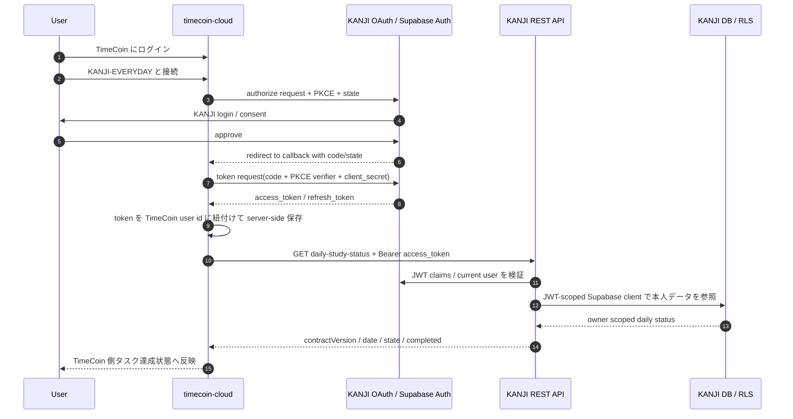

# TimeCoin API Integration IF

この文書は、TimeCoin が KANJI-EVERYDAY の「本日の学習完了状態」を参照するための REST API 連携 IF の正本である。Remote MCP の詳細は [Remote MCP 連携の仕組み](./mcp-integration-architecture.md) を参照する。

secret、access token、refresh token、authorization code、PKCE verifier、cookie は、この文書、issue、PR、ログへ記録しない。

## 1. 現在の状態

| 項目 | 状態 |
| --- | --- |
| KANJI-EVERYDAY REST API | Production 実装済み |
| API endpoint | `GET https://kanji-everyday.vercel.app/api/timecoin/daily-study-status` |
| TimeCoin callback URL | `https://timecoin-cloud.vercel.app/api/external-apps/kanji-everyday/callback` |
| TimeCoin OAuth client | 登録済み |
| TimeCoin client id | `4eaeedb5-f275-43d4-8a97-e00624849443` |
| OAuth issuer | `https://wolwkdvvosfxgxoosgjw.supabase.co/auth/v1` |
| OAuth scopes | `openid email profile` |
| API date boundary | KANJI-EVERYDAY server-side JST |

`client_id` は公開識別子なので TimeCoin 側設定へ入れてよい。`client_secret` は secret なので、KANJI 側で発行された値を timecoin-cloud の server-side env にだけ設定する。

## 2. 役割と責務

| System | Role | 責務 |
| --- | --- | --- |
| KANJI-EVERYDAY | OAuth Authorization Server / REST API Provider | KANJI ユーザー本人の token を検証し、本人の本日学習完了状態だけを返す |
| timecoin-cloud | OAuth Client / REST API Consumer | TimeCoin ユーザーの操作で KANJI OAuth 認可を取り、取得した token を TimeCoin ユーザーに紐付けて保存する |

重要な境界:

- `client_id` / `client_secret` は「TimeCoin アプリ」を識別する。
- `access_token` / `refresh_token` は「KANJI-EVERYDAY のユーザー本人」を識別する。
- TimeCoin が `userId`、`ownerId`、`deckId`、`date` を API に送って特定ユーザーを選ぶ設計ではない。
- TimeCoin 側は「現在ログイン中の TimeCoin ユーザー」と「そのユーザーが認可した KANJI token」を server-side storage で対応付ける。

## 3. 全体フロー



KANJI にログイン済みの場合、接続時に KANJI のログイン画面が表示されないことがある。この場合でも OAuth 認可と callback が完了していれば、TimeCoin は token を保存できる。

## 4. OAuth client 登録値

KANJI-EVERYDAY 側 Supabase OAuth Server には、TimeCoin 用 client を次の値で登録する。

| Item | Value |
| --- | --- |
| client name | `TimeCoin` |
| client id | `4eaeedb5-f275-43d4-8a97-e00624849443` |
| redirect URI | `https://timecoin-cloud.vercel.app/api/external-apps/kanji-everyday/callback` |
| scopes | `openid email profile` |

`client_secret` はこの表に載せない。KANJI 側で発行済みの値を、timecoin-cloud の server-side env に設定する。

## 5. KANJI-EVERYDAY production 設定

KANJI-EVERYDAY production には次を設定する。

```dotenv
TIMECOIN_API_ENABLED=true
TIMECOIN_API_ALLOWED_ORIGIN=https://timecoin-cloud.vercel.app
TIMECOIN_API_OAUTH_ISSUER=https://wolwkdvvosfxgxoosgjw.supabase.co/auth/v1
```

既存の Remote MCP 設定とは別に、TimeCoin REST API 用の feature flag と CORS 設定を持つ。API を止める場合は `TIMECOIN_API_ENABLED=false` にして fail closed する。

## 6. timecoin-cloud 設定

timecoin-cloud 側には、KANJI-EVERYDAY 接続用として次を server-side env に設定する。

```dotenv
KANJI_EVERYDAY_API_URL=https://kanji-everyday.vercel.app/api/timecoin/daily-study-status
KANJI_EVERYDAY_OAUTH_ISSUER=https://wolwkdvvosfxgxoosgjw.supabase.co/auth/v1
KANJI_EVERYDAY_OAUTH_SCOPES=openid email profile
KANJI_EVERYDAY_OAUTH_CLIENT_ID=4eaeedb5-f275-43d4-8a97-e00624849443
KANJI_EVERYDAY_OAUTH_CLIENT_SECRET=<KANJI側Supabase OAuth client_secret>
```

`KANJI_EVERYDAY_OAUTH_CLIENT_ID` と `KANJI_EVERYDAY_OAUTH_CLIENT_SECRET` は KANJI の Vercel に設定する値ではない。TimeCoin が KANJI OAuth でユーザー認可を受けるための TimeCoin 側 server-only 設定である。

## 7. TimeCoin 側 token 管理要件

timecoin-cloud は Authorization Code + PKCE で KANJI OAuth flow を完了する。

要求条件:

- `scope` は `openid email profile` の3つだけにする。
- `state` で callback と TimeCoin 側の接続開始セッションを照合する。
- PKCE verifier は token exchange 完了まで server-side に保持し、完了後は破棄する。
- access token / refresh token は TimeCoin user id に紐付けて server-side に保存する。
- access token が期限切れの場合は refresh token で更新する。
- refresh が `invalid_grant`、revoke、または 401 で失敗した場合は、KANJI 連携を未接続扱いにして再接続へ誘導する。
- token、authorization code、PKCE verifier、raw OAuth error は browser、永続ログ、issue、PR に出さない。

TimeCoin 側で特定ユーザーの結果を取得する方法は、API の query parameter ではなく、TimeCoin 側 token storage の対応付けで実現する。

```text
timecoin_user_id
  -> kanji_access_token / kanji_refresh_token
  -> GET /api/timecoin/daily-study-status
  -> KANJI API が token subject の本人データだけを返す
```

## 8. API request

OAuth 完了後、timecoin-cloud は KANJI-EVERYDAY API endpoint を呼び出す。

```http
GET /api/timecoin/daily-study-status HTTP/1.1
Host: kanji-everyday.vercel.app
Authorization: Bearer <KANJI OAuth access token>
Accept: application/json
Origin: https://timecoin-cloud.vercel.app
```

server-to-server 呼び出しでは `Origin` が付かない場合がある。browser 経由で呼ぶ場合は `TIMECOIN_API_ALLOWED_ORIGIN` と一致している必要がある。

query parameter は受け付けない。次のような selector は送らない。

- `userId`
- `ownerId`
- `date`
- `deckId`
- `cardId`

KANJI-EVERYDAY は対象ユーザーを OAuth access token から決定し、日付は server-side JST 当日で決定する。

## 9. Success response

HTTP `200`:

```json
{
  "contractVersion": 1,
  "date": "YYYY-MM-DD",
  "state": "COMPLETED",
  "completed": true
}
```

response は4 fieldだけである。

| Field | Type | Meaning |
| --- | --- | --- |
| `contractVersion` | `1` | IF version |
| `date` | `YYYY-MM-DD` | KANJI-EVERYDAY server-side JST date |
| `state` | enum | 本日学習ステータス |
| `completed` | boolean | TimeCoin 達成判定用の boolean |

`state` の値:

| state | completed | Meaning |
| --- | ---: | --- |
| `NO_ELIGIBLE_DECKS` | `false` | 対象 deck がない、またはカードがない |
| `IN_PROGRESS` | `false` | 対象 deck に未完了の学習がある |
| `COMPLETED` | `true` | 対象 deck の本日分が完了済み |

TimeCoin 側の達成判定:

```text
contractVersion === 1 && completed === true
```

`state` だけに依存せず、`contractVersion` と `completed` を確認する。

## 10. Error response

現行実装の error response は flat JSON または空 body で返す。

| HTTP status | Body | Handling |
| ---: | --- | --- |
| `400` | `{"error":"bad_request"}` | query parameter 付き request。TimeCoin 実装不備として修正する |
| `401` | `{"error":"unauthorized"}` | 未接続、token expired、invalid token、revoke。再認可へ誘導する |
| `403` | `{"error":"forbidden"}` | Origin 不一致。設定不備として扱う |
| `404` | empty | API disabled または env 不備。達成扱いにしない |
| `405` | empty | `GET` / `OPTIONS` 以外。`Allow: GET, OPTIONS` を確認する |
| `406` | `{"error":"not_acceptable"}` | `Accept` が JSON を許可していない。TimeCoin 実装を修正する |
| `500` | `{"error":"internal_error"}` | 一時失敗として retry または次回同期に回す |

`401` では `WWW-Authenticate: Bearer scope="openid email profile"` を返す。

## 11. Privacy boundary

KANJI-EVERYDAY は TimeCoin に次を返さない。

- deck ID
- deck name
- card ID
- card content
- 学習枚数
- 残り枚数
- review timestamp
- 他 user の情報

TimeCoin は `contractVersion`、`date`、`state`、`completed` を、KANJI 学習タスクの達成判定に必要な範囲で保存する。

KANJI の OAuth consent では、TimeCoin client id の場合に TimeCoin 専用の文言を表示する。共有する値は `contractVersion` / `date` / `state` / `completed` のみで、デッキ名、カード内容、学習枚数は共有しない。

## 12. KANJI-EVERYDAY 実装メモ

KANJI-EVERYDAY 側の REST API は、既存の daily study status 集計を再利用する。

- actor は OAuth access token の `sub` から決定する。
- token は Supabase Auth の `getClaims(token)` と `getUser(token)` で検証する。
- JWT header の `alg` は `RS256` または `ES256`、`kid` は必須。
- claim は `iss`、`role=authenticated`、UUID `sub`、`exp`、`nbf` を検証する。
- DB access は `createJwtScopedClient(accessToken)` を使い、RLS 内で実行する。
- service role は使わない。
- owner/date/deck selector は request から受け取らない。
- DB / unexpected error は raw detail を返さず `internal_error` に縮退する。

## 13. Smoke test

未認証 request:

```bash
curl -i \
  -H 'Accept: application/json' \
  https://kanji-everyday.vercel.app/api/timecoin/daily-study-status
```

期待:

- HTTP `401`
- `WWW-Authenticate: Bearer scope="openid email profile"`
- body は `{"error":"unauthorized"}`

TimeCoin origin の CORS preflight:

```bash
curl -i \
  -X OPTIONS \
  -H 'Origin: https://timecoin-cloud.vercel.app' \
  -H 'Access-Control-Request-Method: GET' \
  https://kanji-everyday.vercel.app/api/timecoin/daily-study-status
```

期待:

- HTTP `204`
- `Access-Control-Allow-Origin: https://timecoin-cloud.vercel.app`
- `Access-Control-Allow-Methods: GET, OPTIONS`

認証済み確認では、実 token を shell history やログに残さない。必要な場合は一時ファイルや secret manager から読み込み、出力には token を含めない。

## 14. Source map

| 領域 | 主なファイル |
| --- | --- |
| Next route | `frontend/app/api/timecoin/daily-study-status/route.ts` |
| HTTP boundary / response contract | `frontend/src/lib/timecoin/daily-study-status-route.ts` |
| OAuth bearer auth | `frontend/src/lib/timecoin/auth.ts` |
| daily status aggregation | `frontend/src/lib/deck/daily-study-status.ts` |
| OAuth consent display | `frontend/src/lib/oauth/client-display.ts` |
| env parse | `frontend/src/lib/env.ts` |
| Remote MCP comparison | `docs/runbooks/mcp-integration-architecture.md` |

## 15. Non-goals

この REST API は TimeCoin 連携の達成判定用であり、次は対象外である。

- デッキ一覧取得
- カード作成・編集・削除
- 学習枚数や残数の同期
- 任意日付の履歴参照
- TimeCoin 側から KANJI user id を指定する server-to-server lookup
