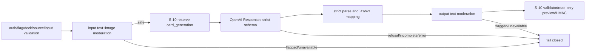

# ADR-009: OpenAIカード生成を同期server adapter・strict output・前後moderationで境界化する

## ステータス

Accepted

## コンテキスト

S-12は、教材テキストまたは画像からR1/W1の編集可能な案を作る。生成結果はcardではなく未承認draftであり、既存S-10のvalidator、quota、preview HMACとS-11の非同期commitへ渡す前に、外部provider出力を安全な内部型へ縮退させる必要がある。

OpenAI公式仕様では、Responses APIのStructured Outputsは`text.format`に`type: "json_schema"`、`strict: true`、JSON Schemaを指定する。画像はResponsesの`input_image`へdata URLまたはfile IDで渡せる。refusalはmessage contentの`refusal` item、未完了はresponseの`status: "incomplete"`と`incomplete_details.reason`で判定する。Moderation APIの`omni-moderation-latest`はtextとimageを受理する。これらは正常JSON本文、HTTP error、refusal、incomplete、schema不一致を別々に扱う必要がある。

現行リポジトリはNext.js 14 Route Handlerと`fetch`を利用し、OpenAI SDKは依存していない。S-11も外部providerをbounded `fetch` adapterで隔離している。S-12だけにSDKと並行エラー体系を導入すると、依存とテスト境界が増える。

## 決定事項

### 1. 同期server adapterを唯一のOpenAI境界とする

- `POST /api/ai/card-drafts/generate`だけが生成workflowを開始する。API key、model、moderation model、timeoutはtyped server configから取得し、client指定を受け付けない。
- OpenAIとの通信は注入可能な`fetch` adapterと`AbortSignal.timeout`相当の明示timeoutで実装する。OpenAI SDKは追加しない。
- Responsesは非stream、`background: false`、`store: false`、toolsなしで1回だけ呼ぶ。自動model fallback、別provider fallback、partial採用は行わない。
- 外部responseは`unknown`としてstrict parseし、raw body、prompt、source bytes、card text、API keyをlogへ出さない。

### 2. 生成modelと入力境界を固定する

- `OPENAI_CARD_GENERATION_MODEL`の既定値は`gpt-5.6-luna`とする。公式model pageがtext/image input、Responses、Structured Outputsを同時に明記し、カード案生成の高頻度・費用制約に合うためである。
- model overrideは空白なしの1〜128文字のallowlisted model identifierとして受ける。ただし公式pageの存在だけから個別project/accountでの利用可否を推定しない。本番有効化前にtext-onlyとimage付きのcontract testでResponses、`text.format` strict schema、画像入力を同時に通す。能力gateを通らないmodelは`OPENAI_PROVIDER_CONFIG`でfail closedとする。
- instructionは正規化後1〜4,000 Unicode scalar、動的user text全体は16,000 Unicode scalar以下とする。画像はS-11検証済み0〜5枚、各10MiB・合計50MiBを維持する。
- sourceはprivate Storageからserverがbounded readし、同じsanitized bytesをModerationとResponsesへbase64 data URLとして渡す。Responsesの`input_image.detail`は`OPENAI_CARD_IMAGE_DETAIL=high`を既定とし、`low | high | auto`だけを許す。公式guideには新しいmodelの`original`もあるが、Responses API referenceの共通入力enumは`low | high | auto`であるため、本設計は互換性の狭い側へ合わせる。
- `OPENAI_CARD_GENERATION_TIMEOUT_MS`は既定60,000、許容5,000〜120,000。`OPENAI_MODERATION_TIMEOUT_MS`は既定10,000、許容1,000〜30,000。生成`max_output_tokens`は32,768に固定する。

### 3. providerにcard/import所有権を与えない

- strict JSON Schemaは`{ concepts: [{ kanjiSide, counterpartSide }] }`だけを返す。rootとitemは`additionalProperties: false`、全field required、concept配列の`minItems/maxItems`は要求concept数と同値、両textは1〜200文字とする。
- `conceptId`、`clientItemId`、pattern、tag、illustration mode、deck IDはserverが決定する。providerはこれらを生成・変更しない。
- serverは`R1`を`kanjiSide -> front`、`W1`を`kanjiSide -> back`へ写像する。`both`は同一concept IDでfront/backを交換した2件を作る。
- Structured Outputs成功でも、展開後件数、Unicode、漢字、pair、重複、text長、tag/image unionをS-10 `validateImportRequest`で再検証する。違反時はpreview tokenを発行しない。
- Responsesの`output`にはreasoning itemが併存し得る。parserはallowlistした非message itemを本文として扱わず、completed assistant messageを正確に1件、そのcontent内の`output_text`を正確に1件だけ要求する。追加message、`refusal`、未知のactive contentは受理しない。

### 4. moderation、quota、generationの順序を固定する

- input instructionは文字列1件として1回、各source画像は単一`image_url` content itemとして1画像1回、`omni-moderation-latest`で別々に判定する。各responseは`results`が正確に1件で`flagged`がboolean、かつ全件`false`のときだけ進む。textと複数画像を1つのmultimodal inputへ束ね、content indexと`results` indexの対応を仮定しない。
- input moderation通過後、Responses呼出し直前にS-10 `reserve_provider_usage(..., kind='card_generation', source='app_ai', units=requestedCardCount)`を呼ぶ。
- quota予約後のrefusal、incomplete、schema不一致、output moderation、provider failureでは予約を返さない。同一reservation key/hash/unitsはS-10の冪等性を使う。
- outputは全card textを境界付きの単一textへ直列化してmoderationし、結果が1件かつ`flagged: false`の場合だけpreviewへ進む。moderation通信・parse不能はfail closedとする。

### 5. error taxonomyをsafe codeで固定する

| 境界 | safe code | HTTP | retry表示 |
|---|---|---:|---|
| input text flagged | `OPENAI_INPUT_TEXT_MODERATION` | 422 | 入力修正 |
| source image flagged | `OPENAI_INPUT_IMAGE_MODERATION` | 422 | 画像変更 |
| output flagged | `OPENAI_OUTPUT_MODERATION` | 422 | 再生成不可を明示 |
| moderation timeout/network/shape不正 | `OPENAI_MODERATION_UNAVAILABLE` | 503 | 再試行可 |
| refusal content | `OPENAI_REFUSAL` | 422 | 拒否として表示 |
| `status=incomplete` | `OPENAI_INCOMPLETE_OUTPUT` | 502 | 再試行可、partial不採用 |
| JSON/schema/count/pair/S-10 mapping不一致 | `OPENAI_OUTPUT_SCHEMA_MISMATCH` | 502 | 再試行可 |
| timeout/network/HTTP 408・429・5xx/response error `rate_limit_exceeded`・`server_error` | `OPENAI_PROVIDER_TRANSIENT` | 503 | 再試行可 |
| API key/model/config、HTTP 401・403 | `OPENAI_PROVIDER_CONFIG` | 503 | 運用者対応 |
| その他4xx、failed response | `OPENAI_PROVIDER_PERMANENT` | 502 | 一般的失敗 |

HTTP non-2xxはbounded body discard後にstatusだけで分類する。2xx responseでは`status`、`error`、`incomplete_details`、output contentを順に検証し、`error.message`やrefusal本文をclient/logへ転送しない。

## 根拠と選択肢

### 選択肢1: BrowserからOpenAIを直接呼ぶ

- 利点: server実装と中継時間が少ない。
- 欠点: API key、owner/quota、source、moderation、token境界をclientへ漏らし、BYOK対象外要件と矛盾する。

### 選択肢2: OpenAI SDKのparse helperとResponses内蔵moderationへ集約する

- 利点: SDK型とhelperで記述量を減らせる。
- 欠点: 現行依存へSDKを追加し、S-11のfetch/strict parse規約と二重化する。独立したtext/image/output moderationの障害分類も不透明になる。

### 選択肢3（採用）: server fetch adapter + 独立moderation + strict parser

- 利点: S-10/S-11の境界を再利用し、provider仕様変更を1 adapterへ閉じ込め、全異常をfixtureで決定的にtestできる。
- 欠点: request/response型ガード、bounded read、error mappingを保守する必要がある。

| 評価軸 | Browser直呼び | SDK集約 | 採用案 |
|---|---:|---:|---:|
| secret/owner境界 | 不可 | 良 | 良 |
| S-10/S-11整合 | 不可 | 中 | 良 |
| error分類の決定性 | 低 | 中 | 高 |
| 依存追加 | なし | あり | なし |
| fixture test容易性 | 低 | 中 | 高 |

## 影響

### ポジティブ

- refusal、incomplete、schema、moderation、provider failureを混同しない。
- model変更はtyped configと能力gateに限定される。
- provider出力がS-10 import契約へ直接侵入しない。

### ネガティブ

- 生成は同期Route Handler内で最大120秒を占有する。
- base64化によりsource bytesより大きいoutbound bodyとなる。
- OpenAI API仕様変更時はstrict fixtureとadapter更新が必要である。

### 中立

- OpenAI incomplete outputをカードの一部成功として扱わない。`partial`はS-11 commit後batchだけの意味を維持する。

## 実装への指針

- adapter、parser、mapping、moderation classifierはpure functionと注入可能transportへ分離する。
- external JSONは常に`unknown`からvalidateし、`any`を使わない。
- model/API切替時は公式model pageとResponses contract testを更新する。
- logはcorrelation ID、stage、safe code、duration、requested count、source count、model identifierだけをallowlistする。

## 参考資料

- https://developers.openai.com/api/docs/guides/structured-outputs — Responsesの`text.format` strict schema、refusal、incomplete処理
- https://developers.openai.com/api/reference/resources/responses/methods/create — Responses request/response、image input、error、incomplete_details
- https://developers.openai.com/api/docs/guides/images-vision — base64 image input、detail、画像制限
- https://developers.openai.com/api/docs/guides/moderation — text/image moderation request
- https://developers.openai.com/api/reference/resources/moderations/methods/create — moderation responseの`results[].flagged`
- https://developers.openai.com/api/docs/models/gpt-5.6-luna — text/image input、Responses、Structured Outputs対応
- https://developers.openai.com/api/docs/models/omni-moderation-latest — text/image対応moderation model

OpenAI Developer Docs MCPおよびOpenAPI spec toolは当セッションに提供されなかったため、上記公式guide/model page/API referenceをfallbackの正本として使用した。

## 関連情報

- `specs/adr/ADR-007-ai-card-import-foundation.md`
- `specs/adr/ADR-008-ai-card-async-queue-image-processing.md`
- `specs/stories/S-12-ai-card-openai-generation-ui/design.md`
- GitHub Issue #13

## 変更履歴

| 日付 | 版 | 変更内容 |
|---|---|---|
| 2026-07-18 | 1.0.0 | 初版 |
| 2026-07-18 | 1.0.1 | 公式API再検証によりinput moderationをtext/画像ごとの独立呼び出しへ修正し、reasoning itemを含むResponses parse契約とmodel availability gateを明確化。第三者document reviewでAccepted |
