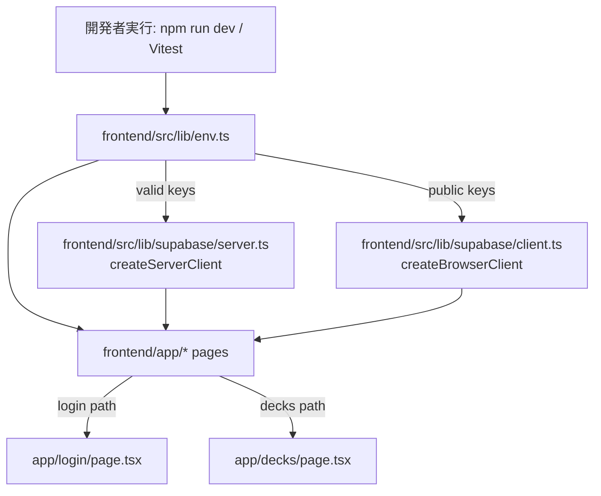

# プロジェクトスキャフォールディング Design Document

## 概要

`frontend/` 配下に Next.js App Router の初期構成を作成し、Supabase 利用を安全に開始できる状態にする。`app/page`, `app/login/page`, `app/decks/page` は次の実装に備えたスタブとして公開し、`SUPABASE_SERVICE_ROLE_KEY` の必須検証を `NODE_ENV=test` を含む環境ですべて有効化する。

## 前提となるADR

- `specs/adr/ADR-001-project-foundation-supabase-clients.md`: `createServerClient` / `createBrowserClient` 分離と環境変数のフェイルファスト方針を採択。
- `.claude/steering/technical-spec.md`: 型安全な環境変数管理。
- `.claude/rules/naming-convention.md`: App Router とフロント命名規則。

## 合意事項チェックリスト

### スコープ
- [x] `frontend/` 配下での基盤初期化（App Router, TypeScript, tsconfig, Biome, Vitest, Tailwind）。
- [x] Supabase 用サーバー/クライアント分離実装。
- [x] `app/page`, `app/login/page`, `app/decks/page` のスタブ作成。
- [x] `.env.local.example` のキー定義のみ整備。
- [x] `SUPABASE_SERVICE_ROLE_KEY` を NODE_ENV=test 含め必須化。

### 非スコープ
- [x] DB スキーマ、Seed、RLS の実装（S-02 以降）。
- [x] 本格的ログインロジック（S-03）。
- [x] 画面デザインの完成（Figma指定なし）。

### 制約
- [x] `.env.local` 内の機密を Git にコミットしない。
- [x] クライアント公開変数は `NEXT_PUBLIC_*` のみ。
- [x] `frontend/.env.local.example` は値を含めない。

## 受入条件（AC）

- 遍在型: システムは `frontend/.env.local.example` に `NEXT_PUBLIC_SUPABASE_URL`, `NEXT_PUBLIC_SUPABASE_ANON_KEY`, `SUPABASE_SERVICE_ROLE_KEY` の 3 キー定義を常時提供すること。
- 複合型: アプリ起動時またはテスト実行時に環境変数検証が走る間、`SUPABASE_SERVICE_ROLE_KEY` が未設定なら **`NODE_ENV` の値に関わらず** 起動を失敗（非 0 終了）させ、欠落キー一覧を出力すること。
- 選択型: もしユーザーが `/` にアクセスした場合、システムは `app/page.tsx` のナビゲーション付きトップページを返すこと。
- 選択型: もしユーザーが `/login` にアクセスした場合、システムは実装予定を明示するスタブページを返すこと。
- 選択型: もしユーザーが `/decks` にアクセスした場合、システムはデッキ一覧の実装予定を明示するスタブページを返すこと。
- 複合型: 開発・サーバー実行中、`frontend/src/lib/supabase/server.ts` は `createServerClient` を、`frontend/src/lib/supabase/client.ts` は `createBrowserClient` をそれぞれ使用する間、`frontend/src/lib/env.ts` の検証済みキーのみを参照すること。
- 不測型: もし環境変数のアクセスが `process.env` へ直接行われた場合、システムは設計上の例外としてレビュー阻止対象にすること。

## 既存コードベース分析

### 実装パスマッピング

| 種別 | パス | 説明 |
|---|---|---|
| 既存 | `specs/stories/S-01-project-scaffolding/requirements.md` | 本ストーリーの要件定義 |
| 既存 | `specs/epics/E-01-project-foundation-auth/epic.md` | プロジェクト基盤と認証方針 |
| 既存 | `frontend/` | なし（今回新設） |
| 新規 | `frontend/app/{layout,page,login/page,decks/page,globals.css}` | App Router とスタブ画面 |
| 新規 | `frontend/src/lib/{env,supabase/server.ts,supabase/client.ts}` | env 管理と Supabase クライアント分離 |
| 新規 | `frontend/tsconfig.json`, `frontend/biome.json`, `frontend/vitest.config.ts` | 開発基盤設定 |
| 新規 | `frontend/package.json`（Tailwind依存を含む） | 実行スクリプトとフロント依存関係の管理 |

### 統合点

- `backend/` との直接 API 統合は現時点では不要。
- 将来統合の観点では、`supabase` クライアントを通じた Auth やデータ取得の入り口を共通化する。

## 変更影響マップ

```yaml
変更対象: frontend基盤
直接影響:
  - frontend/app/page.tsx: トップ導線の追加
  - frontend/app/login/page.tsx: スタブ画面
  - frontend/app/decks/page.tsx: スタブ画面
  - frontend/src/lib/env.ts: env検証の中心化
  - frontend/src/lib/supabase/server.ts: createServerClient 生成
  - frontend/src/lib/supabase/client.ts: createBrowserClient 生成
  - frontend/.env.local.example: キー定義の明文化
  - frontend/vitest.config.ts: テスト対象指定
間接影響:
  - 将来の認証導線（S-03）
  - Supabase Auth の Server Action 実装（S-03 以降）
  - テスト/CI の初期失敗時挙動（早期検知化）
波及なし:
  - backend の既存認証フロー
  - 既存の e2e ルート（未作成領域）
```

## アーキテクチャ概要（frontend 配下）



## データフロー

1. 起動・テスト時: `env.ts` で 3 変数を検証
2. 検証成功: クライアント/サーバークライアント初期化が利用可能
3. ページレンダリング: `app/page`, `/login`, `/decks` は共通スタイルで最低限の導線を描画

## データ契約（環境変数）

```yaml
入力:
  NEXT_PUBLIC_SUPABASE_URL: string (required)
  NEXT_PUBLIC_SUPABASE_ANON_KEY: string (required)
  SUPABASE_SERVICE_ROLE_KEY: string (required, server only)
  NODE_ENV: string (optional)
検証:
  - 未設定/空文字を欠落扱い
  - 欠落時は起動時エラーとして停止
  - 例外時は不足キー名を列挙
出力:
  サーバーコンポーネント向け設定オブジェクト + 公開/非公開キーの分離
```

## API/インターフェース定義

- `frontend/src/lib/env.ts`
  - `getEnvConfig(): { supabaseUrl, supabaseAnonKey, supabaseServiceRoleKey, nodeEnv }`
  - `requireEnv(keys: string[]): void`
- `frontend/src/lib/supabase/server.ts`
  - `createServerClient(): SupabaseClient`
- `frontend/src/lib/supabase/client.ts`
  - `createBrowserClient(): SupabaseClient`

## インターフェース変更マトリクス

| 区分 | インターフェース | 変更種別 | 変換必要性 | 互換性確保 |
|---|---|---|---|---|
| 既存 | なし（`frontend/` は本ストーリーで新設） | N/A | なし | 既存呼び出しへの影響なし |
| 新規 | `getEnvConfig()` / `requireEnv()` | 追加 | なし | 環境変数アクセスを `env.ts` へ集約 |
| 新規 | `createServerClient()` | 追加 | なし | server 専用ファイルに責務固定 |
| 新規 | `createBrowserClient()` | 追加 | なし | browser 専用ファイルに責務固定 |

## 実装計画（実装順序）

1. 共通環境変数レイヤーの作成（`frontend/src/lib/env.ts`）
   - テスト容易性とフェイルファストの土台作り
2. Supabase 初期化レイヤーの分離（`server.ts` / `client.ts`）
   - Server/Browser 用クライアントの責務を固定
3. App Router とスタブページ配置
   - `app/page`, `app/login/page`, `app/decks/page` を追加
4. 設定系整備（`tsconfig`, `biome.json`, `vitest.config.ts`, `.env.local.example`）
5. Tailwind 最小導入（`package.json`, `app/globals.css`）
6. テスト追加（Phase 0/1/2）

## テスト実装順（Phase 0/1/2）

### Phase 0（基盤安定化）
- `frontend/src/lib/env.test.ts`: 欠落キー検出、`NODE_ENV=test` の場合の必須チェック確認。
- `frontend/src/lib/supabase/server.test.ts` 予定: サーバー用クライアント生成条件の単体検証。

### Phase 1（スタブUI）
- `frontend/src/app/page.test.tsx`（実行可能なら）：`app/page` のリンクレンダリングを確認。
- `frontend/src/app/login/page.test.tsx`: ログインスタブ文言が表示されること。
- `frontend/src/app/decks/page.test.tsx`: デッキスタブ文言が表示されること。

### Phase 2（全体統合）
- Vitest 統合実行: `src/**/*.test.ts` と `src/**/*.test.tsx` を通じて起動検証を再現。
- 環境変数未設定時の起動停止シナリオを CI で再現（Node 環境変数設定なし）。
- ストーリーテスト: `specs/stories/S-01-project-scaffolding/tests/project-scaffolding.int.test.tsx` / `project-scaffolding.e2e.test.tsx` で `/`, `/login`, `/decks` と env フェイルファストを確認。

## 統合点でのE2E確認手順

1. 環境変数が揃っている状態で `npm run dev` 相当を起動し、`/` `/login` `/decks` が 200 応答すること。
2. `.env.local` で `SUPABASE_SERVICE_ROLE_KEY` を空にして起動し、即時エラー（非 0）で停止し、欠落キーを出力すること。
3. `NODE_ENV=test` 相当で同様の起動検証を実行し、フェイルファストが有効なこと。

## リスクと軽減策

| リスク | 影響 | 軽減策 |
|---|---|---|
| Figma指定なしのため UI が要件過多になりがち | 実装の迷走 | 最小スタブ方針を採用し、要件以外の UI は後続ストーリーで実施 |
| 環境変数検証が強すぎる | 開発者体験が硬直 | 欠落キーを丁寧に表示し、`.env.local.example` を明示 |
| server/client 分離が不徹底 | 秘密キー露出リスク | ディレクトリ責務を固定し、レビュー時チェック項目として記録 |

## 代替案

- 全部位で `process.env` を直参照する方式（採用しない）: 低工数だが監査困難。
- サーバー/クライアント統一初期化（採用しない）: 早期は簡単だが、実装境界が曖昧になる。
- 分離＋envゲートを採用（採用）: 保守性と安全性を優先。

## 変更履歴

| 日付 | 版 | 変更内容 | 作成者 |
|---|---|---|---|
| 2026-02-23 | 1.0 | 初版作成 | Codex |
