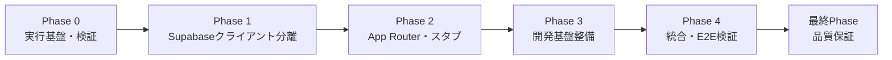
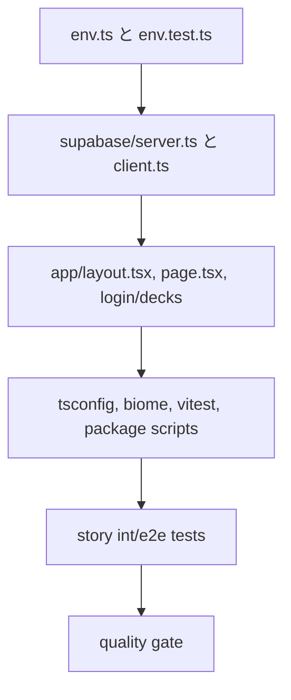

# 作業計画書: project-scaffolding

作成日: 2026-02-23
種別: feature
想定影響範囲: Frontend基盤（frontend配下）+ストーリーテスト
関連Issue/PR: 未設定

## 関連ドキュメント
- ADR: specs/adr/ADR-001-project-foundation-supabase-clients.md
- 要件定義書: specs/stories/S-01-project-scaffolding/requirements.md
- Design Doc: specs/stories/S-01-project-scaffolding/design.md
- 受入テスト: specs/stories/S-01-project-scaffolding/tests/project-scaffolding.int.test.tsx
- E2Eテスト: specs/stories/S-01-project-scaffolding/tests/project-scaffolding.e2e.test.tsx

## 目的
frontend 配下に App Router 基盤を構築し、Supabase 利用前提の環境変数フェイルファストとサーバー/クライアントクライアント分離を安全に成立させる。

## スケジュール見積もり（目安）
- Phase 0: 0.5日（envレイヤーと必須キー検証）
- Phase 1: 0.5日（Supabaseクライアント分離）
- Phase 2: 0.5日（App Routerとスタブ画面）
- Phase 3: 0.5日（TypeScript/Biome/Vitest/Tailwind最小導入）
- Phase 4: 0.5日（統合/E2E観点テスト）
- 最終Phase: 0.5日（品質保証と受入整理）

## 影響範囲
### 対象ファイル
- frontend/app/layout.tsx
- frontend/app/page.tsx
- frontend/app/login/page.tsx
- frontend/app/decks/page.tsx
- frontend/app/globals.css
- frontend/src/lib/env.ts
- frontend/src/lib/supabase/server.ts
- frontend/src/lib/supabase/client.ts
- frontend/.env.local.example
- frontend/tsconfig.json
- frontend/biome.json
- frontend/vitest.config.ts
- frontend/package.json
- frontend/.gitignore

### テストファイル
- frontend/src/lib/env.test.ts
- frontend/src/lib/supabase/client.test.ts
- frontend/src/lib/supabase/server.test.ts
- frontend/src/app/page.test.tsx
- frontend/src/app/login/page.test.tsx
- frontend/src/app/decks/page.test.tsx
- specs/stories/S-01-project-scaffolding/tests/project-scaffolding.int.test.tsx
- specs/stories/S-01-project-scaffolding/tests/project-scaffolding.e2e.test.tsx

## フェーズ構成

### フェーズ構成図

### タスク依存関係図

### Phase 0: 実行基盤・検証レイヤー（想定コミット数: 1）
**目的**: 起動時の必須環境変数検証を中心に、今後の全実装を壊れにくくする

#### タスク
- [ ] 前提作成: frontend配下の最小構成（package.json, src, app）を新規追加
  - 実装: frontend/package.json, frontend/src, frontend/app（初期）
  - テスト: ここでは未実装
- [ ] 環境変数管理層を追加し、3キーを型安全に検証
  - 実装: frontend/src/lib/env.ts
  - テスト: frontend/src/lib/env.test.ts
- [ ] SUPABASE_SERVICE_ROLE_KEY の未設定時に起動時/テスト時の例外を明示
  - 実装: frontend/src/lib/env.ts
  - テスト: frontend/src/lib/env.test.ts
- [ ] .env.local.example と .gitignore を整備
  - 実装: frontend/.env.local.example, frontend/.gitignore
- [ ] ストーリー受入テストに環境検証観点を反映
  - 実装: specs/stories/S-01-project-scaffolding/tests/project-scaffolding.int.test.tsx
  - テスト: 該当it.todoを実装

#### フェーズ完了条件
- [ ] `SUPABASE_SERVICE_ROLE_KEY` が未設定のままでは、起動/テスト時に例外になる
- [ ] `NODE_ENV` が `test` でも上記チェックは有効
- [ ] `.env.local.example` が3キー定義を満たす
- [ ] `env.ts` を経由せず `process.env` を直接参照しない

#### 動作確認手順
1. `frontend/src/lib/env.test.ts` を実行し、未設定時の例外と不足キー一覧を確認
2. `frontend/src/lib/env.ts` の直接参照をコードレビューで確認
3. `.env.local.example` のキー欠落がないことを確認

#### 停止ポイント（品質固定）
- [ ] 上記3条件を満たした時点で task-executor で品質固定（品質報告の保存）

### Phase 1: Supabaseクライアント分離（想定コミット数: 1）
**目的**: サーバー/ブラウザ用クライアントを実装し、キー責務を固定する

#### タスク
- [ ] サーバー用クライアントを実装
  - 実装: frontend/src/lib/supabase/server.ts
  - テスト: frontend/src/lib/supabase/server.test.ts
- [ ] ブラウザ用クライアントを実装
  - 実装: frontend/src/lib/supabase/client.ts
  - テスト: frontend/src/lib/supabase/client.test.ts
- [ ] サーバー/クライアント双方でenv検証結果を参照していることを確認
  - 実装: frontend/src/lib/supabase/server.ts, frontend/src/lib/supabase/client.ts
  - テスト: specs/stories/S-01-project-scaffolding/tests/project-scaffolding.int.test.tsx（AC6）

#### フェーズ完了条件
- [ ] server.ts が `createServerClient` を使用し、cookiesベースで初期化
- [ ] client.ts が `createBrowserClient` を使用し、公開キーのみ参照
- [ ] サーバー/クライアント用途が混在していない

#### 動作確認手順
1. `frontend/src/lib/supabase/server.ts` と `client.ts` の import/関数を確認
2. 意図したクライアント分離がテストで担保されることを確認

#### 停止ポイント（品質固定）
- [ ] AC6の検証を完了後、task-executor で品質固定

### Phase 2: App Router・スタブページ追加（想定コミット数: 1）
**目的**: ルート構成を整え、将来実装前提のスタブ画面を公開する

#### タスク
- [ ] ルートレイアウトとページを追加
  - 実装: frontend/app/layout.tsx, frontend/app/page.tsx
  - テスト: frontend/src/app/page.test.tsx
- [ ] スタブページを追加
  - 実装: frontend/app/login/page.tsx, frontend/app/decks/page.tsx
  - テスト: frontend/src/app/login/page.test.tsx, frontend/src/app/decks/page.test.tsx
- [ ] 共通グローバルスタイルを追加
  - 実装: frontend/app/globals.css
  - テスト: frontend/src/app/page.test.tsx（表示確認）
- [ ] 統合テストを実装して受入観点を接続
  - 実装: specs/stories/S-01-project-scaffolding/tests/project-scaffolding.int.test.tsx（AC3/AC4/AC5）

#### フェーズ完了条件
- [ ] `/` が login/decks 導線付きトップを返す
- [ ] `/login` と `/decks` が壊れないスタブとして表示される
- [ ] layout metadata/Vitest設定が最低限維持される

#### 動作確認手順
1. `frontend/src/app/*` のレンダリングテストを実行
2. ルート導線が見えることを確認

#### 停止ポイント（品質固定）
- [ ] ルーティングと画面表現ACを確認後、品質固定

### Phase 3: 開発基盤整備（想定コミット数: 1）
**目的**: TypeScript strict、Biome、Vitestの基盤をfrontend配下に確立する

#### タスク
- [ ] TypeScript設定を追加し alias を `@/* => ./src/*` にする
  - 実装: frontend/tsconfig.json
  - テスト: 型チェック（frontend）
- [ ] Biome設定を追加
  - 実装: frontend/biome.json
  - テスト: フォーマッタ・静的チェック（frontend）
- [ ] Vitest設定を追加（`src/**/*.test.ts`, `src/**/*.test.tsx`）
  - 実装: frontend/vitest.config.ts
  - テスト: frontend 単体/結合テスト
- [ ] Tailwind CSS の最小導入を実施（要件Must）
  - 実装: frontend/package.json, frontend/app/globals.css
  - テスト: 起動時にスタイル適用が崩れないことを確認
- [ ] scripts と lint/typecheck 実行パスを package.json に明記
  - 実装: frontend/package.json

#### フェーズ完了条件
- [ ] strict true
- [ ] paths alias が `@/*` => `./src/*` となる
- [ ] Vitest が frontend/src 配下のテストを認識する
- [ ] tailwind設定との共存が成立する

#### 動作確認手順
1. `frontend/tsc --noEmit` を想定手順に追加
2. `frontend/biome check .` を想定手順に追加
3. `frontend/vitest run` を想定手順に追加

#### 停止ポイント（品質固定）
- [ ] 基盤設定が整備され、テスト/静的検査を通過した時点で品質固定

### Phase 4: 統合・E2E検証（想定コミット数: 1）
**目的**: 全ACを一気通貫で確認し、受け入れ条件の整合を確定する

#### タスク
- [ ] 統合テストケースを実装完了
  - 実装: specs/stories/S-01-project-scaffolding/tests/project-scaffolding.int.test.tsx
- [ ] E2E観点を実装し、スタブ導線・起動失敗を確認
  - 実装: specs/stories/S-01-project-scaffolding/tests/project-scaffolding.e2e.test.tsx
- [ ] レビュー阻止条件（`process.env` 直接参照）を最終チェック
  - 実装: spec内チェック観点（AC7）+ スキャンメモ

#### フェーズ完了条件
- [ ] 7 AC が実装テストで一貫して満たされる
- [ ] 受け入れの最終評価者向け根拠ログ（期待値・実行結果）が揃う

#### 動作確認手順（Design Doc準拠）
1. `/` `/login` `/decks` の表示確認
2. `SUPABASE_SERVICE_ROLE_KEY` 未設定で起動時停止（非0終了）を確認
3. env 層と supabase クライアント分離の静的確認

---

### 最終Phase: 品質保証（想定コミット数: 1）
**目的**: 全体品質の保証と実装完了宣言

#### タスク
- [ ] すべての統合テストを実行し、PASS を確認
- [ ] すべてのE2Eテストを実行し、PASS を確認
- [ ] 変更ファイルのレビューで要件・ADR・Design Doc整合を確認
- [ ] AC1〜AC7を説明できるテスト根拠を保存し、カバレッジは閾値固定なしで不足領域を明示
- [ ] ドキュメント更新（必要なら story.md / 要件差分メモ）

#### 動作確認手順
- [ ] AC1〜AC7 の受入条件に対し、実行結果とコード根拠を追跡
- [ ] `implementation_bulk` で phase単位の品質ゲート（停止ポイント）に保存

## リスクと対策
- [ ] `frontend/` 未作成状態からの一括導入による初期工数増: 作業をPhase 0→4に分解し、最初に検証を成立させる
- [ ] テスト環境でも未設定キー検証が抜ける: env検証ロジックを env.ts の必須関数化し、Phase 0で先に確定
- [ ] サーバー/クライアント混在: import lintのレビュー観点を Phase 1 で固定
