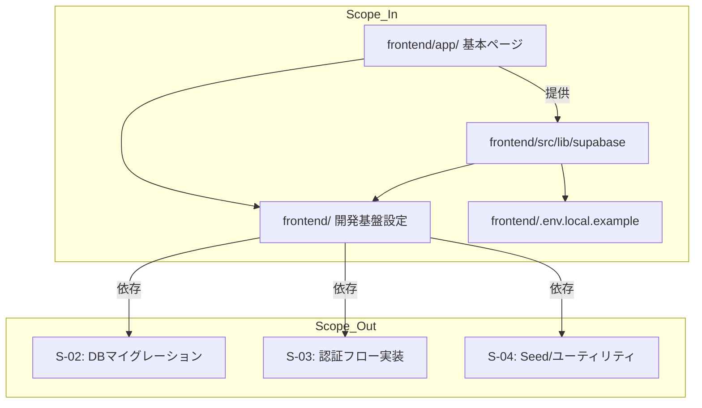
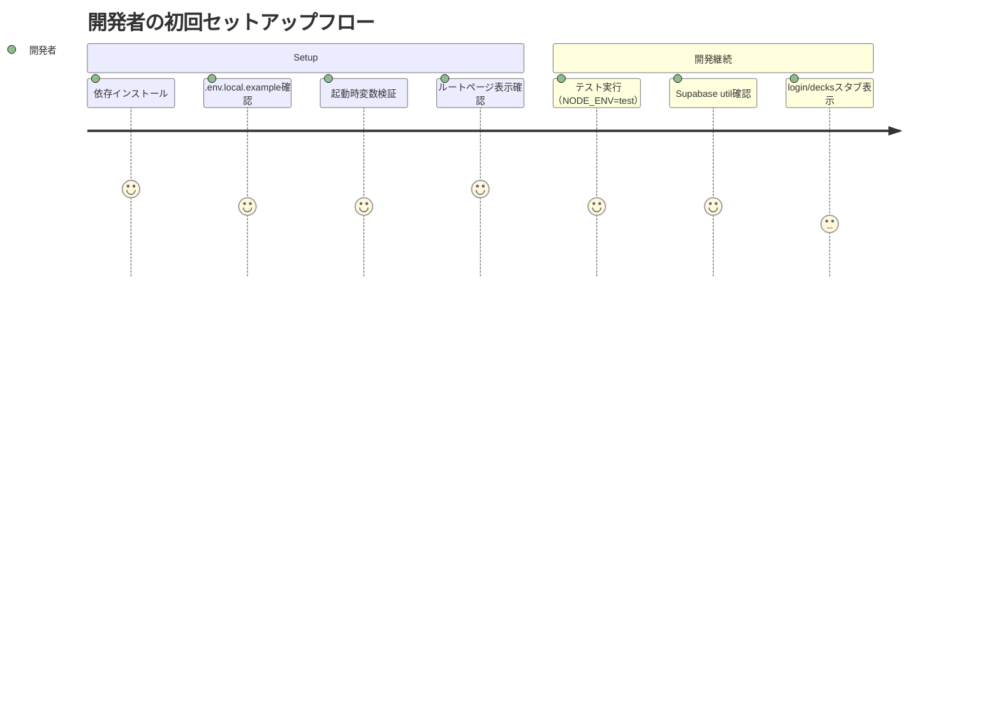

# 要件定義書: project-scaffolding

## 1. 概要

### 1行要約
開発者が `frontend/` 配下で Next.js App Router を安全に起動できる基盤を構築し、Supabase 接続と開発体験を統一する。

### 背景
MVP 開発では、認証・データ設計・学習機能の実装前に共通土台が必要になる。
本ストーリーでは、将来の画面開発と Supabase 利用を前提に、ルート構成、型安全な環境変数管理、検証可能な起動チェックを整備する。

## 2. ユーザーストーリー

### プライマリーユーザー
- 開発者（フロントエンド担当）
- 仕様変更に応じて素早く基盤を再現する必要がある開発メンバー

### ユーザーストーリー
```
As a developer
I want a strict but minimal Next.js frontend scaffold under frontend/
So that I can start feature development immediately with safe Supabase integration and reliable env checks
```

### ユースケース
1. リポジトリ初回セットアップ時に、`frontend/` 配下へ App Router 構成を再現し、最小ページ群が表示できる。
2. 開発・テスト時に `NEXT_PUBLIC_*` と `SUPABASE_SERVICE_ROLE_KEY` の未設定が起動時に早期検出される。
3. `NODE_ENV=test` 環境でも `SUPABASE_SERVICE_ROLE_KEY` の必須チェックが行われ、テスト実行の前提が崩れない。
4. 認証実装前でも `app/login/page.tsx` と `app/decks/page.tsx` をスタブとして表示し、将来実装のためのルートを確保する。

## 3. 要件

### Must（必須）
- `frontend/` 配下に Next.js App Router プロジェクト基盤を作成する。
- `frontend/app/layout.tsx` と `frontend/app/page.tsx`、`frontend/app/login/page.tsx`、`frontend/app/decks/page.tsx` を必須ページとして定義する。
- `frontend/src/lib/supabase/server.ts` と `frontend/src/lib/supabase/client.ts` を分離し、サーバー/ブラウザ用途を明確化する。
- `frontend/src/lib/env.ts`（または同等の設定管理層）を通じて環境変数を参照し、`process.env` の直接参照を回避する。
- `frontend/.env.local.example` に以下を明記する。
  - `NEXT_PUBLIC_SUPABASE_URL`
  - `NEXT_PUBLIC_SUPABASE_ANON_KEY`
  - `SUPABASE_SERVICE_ROLE_KEY`
- `SUPABASE_SERVICE_ROLE_KEY` は未設定時に **起動時エラー** とする。これは `NODE_ENV=test` でも適用する。
- TypeScript strict を有効化し、`tsconfig.json` で `@/*` エイリアスを `frontend/src/*` に設定する。
- Tailwind CSS、Biome、Vitest を `frontend/` 基盤に導入する。
- `frontend/src/**/*.test.ts` / `frontend/src/**/*.test.tsx` で実行できる Vitest 設定を提供する。

### Should（望ましい）
- `.env.local` を誤コミットしないため、`.gitignore` ルールを明確化する。
- 開発者体験向上のため、未設定環境変数エラー時に「不足キー一覧」と対処例を標準出力する。
- `frontend/app/page.tsx` で将来の認証分岐に影響しない簡易導線（例: login/decks へのリンク）を用意する。

### Could（あるとよい）
- 共通レイアウトでメタ情報（`lang`, `viewport`, `title/description`）を明示し、公開ページとの整合性を担保する。
- 設定のバリデーションメッセージを日本語化し、運用保守を補助する。

### Won’t（対象外）
- Supabase の RLS ポリシー実装は本ストーリーでは行わない（S-02）。
- 認証 UI/ロジック（ログイン処理本体）やプロフィール登録は本ストーリーで実装しない（S-03 以降）。
- DB スキーマ定義・シード投入・JST 日付ユーティリティは本ストーリーに含めない（S-02 / S-04）。

## 4. 非機能要件

### セキュリティ
- `NEXT_PUBLIC_*` 変数のみクライアントへ露出し、`SUPABASE_SERVICE_ROLE_KEY` はサーバー専用として分離する。
- `SUPABASE_SERVICE_ROLE_KEY` の値をログへそのまま出力しない。
- サービスロールキーの必須チェックはテスト環境でも一律に適用する。

### 信頼性
- 環境変数不足時は、ランタイム処理が進む前に失敗（起動時）する。
- `frontend/` 起動（`npm run dev` 相当）時に設定不備が 2 分以内に検知できること。

### 保守性
- サーバー/クライアント用途をファイル分離し、責務漏れが起きない構成とする。
- テスト設定と lint/format 設定は `frontend/` 直下で一元管理する。

## 5. 成功指標

### 定量的指標
1. `frontend/` の起動コマンドを実行した際、3 分間隔で 1 回以上のビルド失敗が起きず、`frontend/.env.local.example` のみに必要キーを明示している状態であること。
2. 環境変数不足時（`SUPABASE_SERVICE_ROLE_KEY` 未設定）に、初回起動時エラーが **1 秒以内** に発生すること。
3. `NODE_ENV=test` 下でも 1 回目のテスト起動で、サービスロールキーの未設定を検知できること（例: `pnpm/vitest` 実行時）。

### 定性的指標
1. 開発者が新規ブランチでセットアップを再現する際、追加説明なしで `frontend/app` と Supabase util の意図を理解できること。
2. スタブページ（login/decks）が将来のルーティング実装に干渉せず、初回アクセスで壊れないこと。

## 6. スコープ境界図



## 7. ユーザージャーニー



## 8. 制約・前提
- `frontend/` 配下を基準に要件を満たす。
- `SUPABASE_SERVICE_ROLE_KEY` は `NEXT_PUBLIC_` 接頭辞を付けず、サーバー用途として保護する。
- `NODE_ENV=test` での必須チェック有効化を先に満たすこと。
- プロジェクトの実行環境が `supabase-js` の最新版 API と整合する構成を前提とする。

## 9. リスクと対策

| リスク | 影響度 | 発生確率 | 軽減策 |
|---|---|---|---|
| 環境変数検証仕様を実装者が誤解し、`NODE_ENV=test` 除外実装になってしまう | 高 | 中 | 要件とレビューで「テスト環境でも必須」を明文化し、起動時チェックの共通化を採用 |
| サーバー/クライアントで鍵を混在利用し、`SUPABASE_SERVICE_ROLE_KEY` が露出される | 高 | 低 | `src/lib/supabase/` の責務分離と、レビュー時チェックリストで公開変数利用禁止を確認 |
| Tailwind/Biome/Vitest の導入スコープが膨らみ、他ストーリー準備が遅れる | 中 | 中 | S-01 では最小限の初期設定に限定し、拡張ルールは後続ストーリーで追加 |
