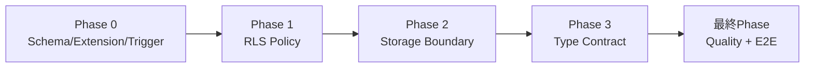
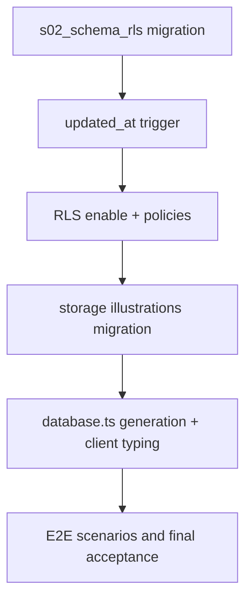

# 作業計画書: database-schema-rls

作成日: 2026-02-23
種別: feature
想定影響範囲: Supabase schema/RLS/storage + frontend型契約 + ストーリーテスト
関連Issue/PR: 未設定

## 関連ドキュメント
- ADR: `specs/adr/ADR-002-database-schema-rls-access-boundary.md`
- 要件定義書: `specs/stories/S-02-database-schema-rls/requirements.md`
- Design Doc: `specs/stories/S-02-database-schema-rls/design.md`
- 統合テスト骨子: `specs/stories/S-02-database-schema-rls/tests/database-schema-rls.int.test.ts`
- E2Eテスト骨子: `specs/stories/S-02-database-schema-rls/tests/database-schema-rls.e2e.test.ts`

## 目的
7テーブルのスキーマ契約、RLS境界、Storage owner-scope、DB型生成を一貫して実装し、後続ストーリーが再設計なしで着手できるDB基盤を確立する。

## 計画ルール（S-02固定）
- [ ] 統合テストは各実装Phaseで `it.todo` を実装し、同じPhase内で実行して合格させる（後回し禁止）
- [ ] E2Eテストは全実装完了後の最終Phaseでのみ実行する

## 影響範囲
### 対象ファイル
- [ ] `supabase/migrations/*_s02_schema_rls.sql`
- [ ] `supabase/migrations/*_s02_storage_illustrations.sql`
- [ ] `frontend/src/types/database.ts`
- [ ] `frontend/src/lib/supabase/server.ts`
- [ ] `frontend/src/lib/supabase/client.ts`

### テストファイル
- [ ] `specs/stories/S-02-database-schema-rls/tests/database-schema-rls.int.test.ts`
- [ ] `specs/stories/S-02-database-schema-rls/tests/database-schema-rls.e2e.test.ts`

## フェーズ構成

### フェーズ構成図

### タスク依存関係図

### フェーズ依存関係
- [ ] Phase 1 着手条件: Phase 0のAC-01/02/03/11検証が完了している
- [ ] Phase 2 着手条件: Phase 1のRLS境界（AC-04〜09）が完了している
- [ ] Phase 3 着手条件: Phase 2のStorage境界（AC-10）が完了している
- [ ] 最終Phase 着手条件: Phase 0〜3の実装・統合テストがすべて完了している

### Phase 0: Schema/Extension/Trigger 実装（想定コミット数: 1）
**目的**: 7テーブル契約とUUID/トリガー前提を確定する。

#### タスク
- [ ] `*_s02_schema_rls.sql` を作成し、`pgcrypto`、7テーブル、PK/FK/NOT NULL/DEFAULT/CHECK/INDEXを実装する
  - 実装: `supabase/migrations/*_s02_schema_rls.sql`
  - 統合テスト: `database-schema-rls.int.test.ts` の AC-01 / AC-02 / AC-11 を実装して実行
- [ ] `update_updated_at_column()` 関数と `users_profile` / `decks` / `illustrations` の3トリガーを実装する
  - 実装: `supabase/migrations/*_s02_schema_rls.sql`
  - 統合テスト: `database-schema-rls.int.test.ts` の AC-03 を実装して実行
- [ ] Phase 0で実装した統合テストを再実行し、DDL/制約/トリガー差分を解消する
  - テスト: `specs/stories/S-02-database-schema-rls/tests/database-schema-rls.int.test.ts`

#### フェーズ完了条件（Design AC由来）
- [ ] AC-01: 7テーブル契約（要件AC#1マトリクス）を満たす
- [ ] AC-02: `pgcrypto` 有効化後に `gen_random_uuid()` 利用列を作成できる
- [ ] AC-03: 3テーブルの `updated_at` 自動更新が成立する
- [ ] AC-11: `illustrations.illustration_key` にUNIQUE制約がない

#### 動作確認手順
1. マイグレーション適用後に `information_schema` / `pg_catalog` で定義差分を確認する。
2. AC-01/02/03/11の統合テストを実行し、失敗ケースを解消する。
3. 3テーブルで `UPDATE ... RETURNING updated_at` を行い時刻前進を確認する。

#### 停止ポイント（品質固定）
- [ ] Phase 0対象ACの統合テストがPASSした状態を保存する

### Phase 1: RLS Policy 実装（想定コミット数: 1）
**目的**: 7テーブルで公開/所有者境界とDELETE allow-listを確定する。

#### タスク
- [ ] 7テーブルすべてでRLSを有効化し、owner scoped基本ポリシーを実装する
  - 実装: `supabase/migrations/*_s02_schema_rls.sql`
  - 統合テスト: AC-04 / AC-07 / AC-08
- [ ] `cards` に public read-only と private owner write/delete を実装する
  - 実装: `supabase/migrations/*_s02_schema_rls.sql`
  - 統合テスト: AC-05 / AC-06
- [ ] `cards private owner DELETE` 以外にDELETEポリシーを追加せず default deny を維持する
  - 実装: `supabase/migrations/*_s02_schema_rls.sql`
  - 統合テスト: AC-09
- [ ] Phase 1対象の統合テストを実装・実行し、owner/non-owner/anonymous挙動を固定する
  - テスト: `specs/stories/S-02-database-schema-rls/tests/database-schema-rls.int.test.ts`

#### フェーズ完了条件（Design AC由来）
- [ ] AC-04: 7/7テーブルでRLS有効化
- [ ] AC-05: `cards public` は全員SELECT可、書き込み不可
- [ ] AC-06: `cards private` は所有者のみINSERT/UPDATE/DELETE可
- [ ] AC-07: `illustrations` はownerのみCRUD可
- [ ] AC-08: `users_profile` / `decks` / `deck_cards` / `review_states` / `study_sessions` がowner-only
- [ ] AC-09: 明示DELETE未定義操作が拒否される

#### 動作確認手順
1. owner/non-owner/anonymousの3セッションでCRUDを検証する。
2. `cards` public/privateの分岐挙動を個別に確認する。
3. DELETE未明示テーブルのDELETE拒否を確認する。

#### 停止ポイント（品質固定）
- [ ] Phase 1対象ACの統合テストがPASSした状態を保存する

### Phase 2: Storage Boundary 実装（想定コミット数: 1）
**目的**: `illustrations` バケットをprivate + owner scopedでDB境界と整合させる。

#### タスク
- [ ] `*_s02_storage_illustrations.sql` を作成し、`illustrations` バケットを `public=false` で作成する
  - 実装: `supabase/migrations/*_s02_storage_illustrations.sql`
  - 統合テスト: AC-10
- [ ] `storage.objects` のowner scoped policyを実装し、non-owner/anonymous拒否を保証する
  - 実装: `supabase/migrations/*_s02_storage_illustrations.sql`
  - 統合テスト: AC-10
- [ ] Phase 2対象の統合テストを実装・実行し、DB行境界とStorage境界の一致を確認する
  - テスト: `specs/stories/S-02-database-schema-rls/tests/database-schema-rls.int.test.ts`

#### フェーズ完了条件（Design AC由来）
- [ ] AC-10: `illustrations` バケットがprivateで、オブジェクトアクセスがowner scoped

#### 動作確認手順
1. バケット属性 `public=false` を確認する。
2. owner/non-owner/anonymousでobject read/write/deleteを検証する。
3. `illustrations` テーブルRLSとStorage policyの境界が一致することを確認する。

#### 停止ポイント（品質固定）
- [ ] Phase 2対象ACの統合テストがPASSした状態を保存する

### Phase 3: Type Contract 統合（想定コミット数: 1）
**目的**: 単一型契約 `frontend/src/types/database.ts` を生成し、フロント実装へ接続する。

#### タスク
- [ ] `supabase gen types` で `frontend/src/types/database.ts` を生成し、7テーブル型を反映する
  - 実装: `frontend/src/types/database.ts`
  - 統合テスト: AC-12
- [ ] `frontend/src/lib/supabase/server.ts` と `frontend/src/lib/supabase/client.ts` に `Database` ジェネリクスを適用する
  - 実装: `frontend/src/lib/supabase/server.ts`, `frontend/src/lib/supabase/client.ts`
  - テスト: 型チェック + AC-12統合テスト
- [ ] Phase 3対象の統合テストを実装・実行し、型出力先固定と参照整合を確認する
  - テスト: `specs/stories/S-02-database-schema-rls/tests/database-schema-rls.int.test.ts`

#### フェーズ完了条件（Design AC由来）
- [ ] AC-12: 型生成結果が `frontend/src/types/database.ts` に出力され7テーブルを含む

#### 動作確認手順
1. 型生成コマンド実行後に `database.ts` の出力先と内容を確認する。
2. Supabaseクライアント実装で `Database` 型参照が通ることを確認する。
3. AC-12の統合テストと型チェックを実行する。

#### 停止ポイント（品質固定）
- [ ] Phase 3対象ACの統合テストがPASSした状態を保存する

---

### 最終Phase: 品質保証・E2E実行（必須）（想定コミット数: 1）
**目的**: 全ACの最終受入を確認し、E2E根拠を確定する。

#### タスク
- [ ] `database-schema-rls.e2e.test.ts` の Scenario 1〜5 を実装する
  - テスト: `specs/stories/S-02-database-schema-rls/tests/database-schema-rls.e2e.test.ts`
- [ ] 全実装完了後にのみE2Eテストを実行し、migration→RLS→storage→type契約の通し検証を行う
  - テスト: `specs/stories/S-02-database-schema-rls/tests/database-schema-rls.e2e.test.ts`
- [ ] 統合テストをフル実行し、Phase 0〜3で実装したAC検証が退行していないことを確認する
  - テスト: `specs/stories/S-02-database-schema-rls/tests/database-schema-rls.int.test.ts`
- [ ] 要件/ADR/Design/実装/テストのトレーサビリティ証跡を整理する

#### フェーズ完了条件（Design AC由来）
- [ ] E2E-01〜E2E-05がPASSする
- [ ] AC-01〜AC-12の検証結果をテストログで追跡できる
- [ ] 計画ルール（統合テスト同時実施、E2E最終実施）が満たされている

#### 動作確認手順
1. ローカルSupabase環境でmigrationを適用し、E2E Scenario 1〜5を順次実行する。
2. 統合テストを全件再実行し、退行がないことを確認する。
3. 受入条件ごとの証跡（対象テスト、実行結果、関連ファイル）を記録する。

## AC別完了チェックリスト
- [ ] AC-01: 7テーブル契約成立（Phase 0 / Integration）
- [ ] AC-02: `pgcrypto` と `gen_random_uuid()` 成立（Phase 0 / Integration）
- [ ] AC-03: `updated_at` 自動更新成立（Phase 0 / Integration）
- [ ] AC-04: 7テーブルRLS有効（Phase 1 / Integration）
- [ ] AC-05: `cards public` read-only（Phase 1 / Integration）
- [ ] AC-06: `cards private` owner write/delete（Phase 1 / Integration）
- [ ] AC-07: `illustrations` owner scoped private（Phase 1 / Integration）
- [ ] AC-08: 5テーブルowner-only境界（Phase 1 / Integration）
- [ ] AC-09: 未明示DELETE default deny（Phase 1 / Integration）
- [ ] AC-10: Storage `illustrations` private + owner scoped（Phase 2 / Integration）
- [ ] AC-11: `illustration_key` 非UNIQUE維持（Phase 0 / Integration）
- [ ] AC-12: 型出力先固定と7テーブル型反映（Phase 3 / Integration）

## リスクと対策
- [ ] `illustrations` をpublic扱いで実装してしまうリスク: ADR-002準拠でowner scoped privateをレビュー観点に固定する
- [ ] DELETEポリシーの過剰許可リスク: `cards private owner` 以外はDELETE policy未定義を維持し、AC-09テストで検出する
- [ ] 型出力先の逸脱リスク: `frontend/src/types/database.ts` 以外への出力を禁止し、AC-12で検証する
- [ ] 統合テスト先送りリスク: 各Phaseの停止ポイントで統合テストPASSを必須化する
