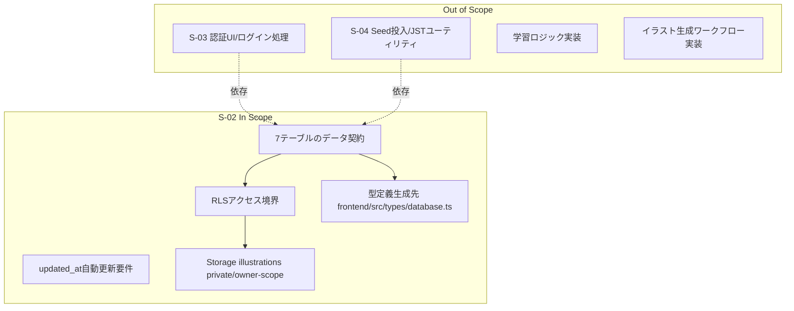
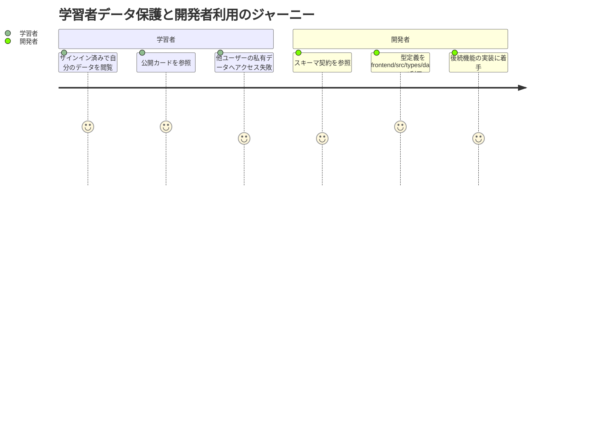

# 要件定義書: database-schema-rls

## 1. 概要

### 1行要約
7つの業務テーブルとRLS、更新トリガー、Storageバケット、型定義を一貫して整備し、後続ストーリーが安全に実装できるDB基盤を確立する。

### 背景
E-01の中核要件として、認証済みユーザーごとのデータ分離と再利用可能なデータ構造が必要である。
本ストーリーは、学習フロー・認証・イラスト機能が依存する永続化基盤を定義し、アクセス境界を要件として明文化する。

## 2. ユーザーストーリー

### プライマリーユーザー
- 学習アプリ利用者（自分の進捗・デッキ・セッションデータを安全に扱いたい）
- 開発者（型安全かつ一貫したDB契約に基づいて機能実装を進めたい）

### ユーザーストーリー
```
As an authenticated learner and application developer
I want a complete schema and row-level access boundary for core study data
So that personal data stays isolated while shared/public cards can be safely reused
```

### ユースケース
1. 認証済みユーザーは自分のプロフィール、デッキ、学習状態、セッション、私有イラストのみを作成・更新・参照できる。
2. すべてのユーザーは公開カードを参照できるが、公開カードの改変はできない。
3. 開発者は生成済みのDB型定義を `frontend/src/types/database.ts` から参照し、DBアクセスの型安全性を維持できる。

## 3. 要件

### Must（必須）
- 以下7テーブルを定義し、主キー・外部キー・必須制約・既定値・CHECK制約・インデックス要件を満たすこと。
  - `users_profile`
  - `decks`
  - `cards`
  - `deck_cards`
  - `review_states`
  - `illustrations`
  - `study_sessions`
- UUID既定値に `gen_random_uuid()` を使う列を持つため、`pgcrypto` が有効化されていること。
- `users_profile`、`decks`、`illustrations` は更新時に `updated_at` が自動更新されること。
- 業務上必要な検索性能を満たすため、以下のインデックス要件を満たすこと。
  - `cards.card_key` は一意制約を持つ。
  - `cards.illustration_key` は参照効率向上のためインデックス対象とする。
  - `review_states(user_id, due_date)`、`deck_cards(card_id)`、`study_sessions(user_id, finished_at)` を検索用途に最適化する。
- 全7テーブルでRLSが有効であること。
- `cards` のRLSは以下を満たすこと。
  - 公開行（`visibility='public'`）は全員が参照可能。
  - 公開行は全員に対して書き込み不可（read-only）。
  - 書き込み（INSERT/UPDATE/DELETE）は私有行（`visibility='private'`）かつ所有者本人のみ許可。
- `illustrations` のアクセスモデルは private + owner scoped とし、本ストーリーで公開行の参照要件を持たないこと。
  - `illustrations` 行は所有者にひもづくデータとして扱い、所有者本人のみ SELECT/INSERT/UPDATE を許可する。
  - `illustrations` の公開共有（public read）は Future 扱いとし、MVPの要件に含めない。
- `illustrations` の `illustration_key` には本ストーリーで一意制約を追加しないこと。
- DELETE を明示許可するのは `cards` の私有行に対する所有者削除のみとすること。
- DELETEポリシーを明示しないテーブル操作は、RLS既定挙動により拒否されること（default deny）。
- Storageバケット `illustrations` は private であり、オブジェクトアクセスは所有者スコープで制御されること。
- DB型定義を生成し、配置先を `frontend/src/types/database.ts` とすること。

### Should（望ましい）
- RLS要件は「所有者」「非所有者」「未認証」の代表ケースで期待結果が再現できること。
- スキーマ命名と列定義は、E-01の後続ストーリー（S-03/S-04）で再解釈を必要としない一貫性を持つこと。
- 公開データ（cards）と私有データ（users/decks/review/session/illustrations）の境界が、ドキュメント読解のみで判断できること。

### Could（あるとよい）
- 主要テーブル間の関係を簡易ER表現で補足し、新規参加メンバーのオンボーディングを短縮できる状態にする。
- RLS境界の意図（公開可/非公開）を運用向けに1ページで説明できる補助資料を用意する。

### Won't（対象外）
- 認証UI/認証フロー本体の実装（S-03対象）。
- Seedデータ投入・JST日付ユーティリティ整備（S-04対象）。
- 学習ロジック（SRS計算、セッション進行アルゴリズム）のアプリケーション実装。
- イラスト生成ジョブや外部生成モデル連携の実装。

### MVP / Future 要件マッピング
| 領域 | MVP（本ストーリーで確定） | Future（本ストーリー対象外） |
|---|---|---|
| データ公開モデル | `cards` のみ public read を提供し、`users_profile` / `decks` / `deck_cards` / `review_states` / `illustrations` / `study_sessions` は owner scoped private とする。 | `cards` 以外の公開・共有モデル追加。 |
| `illustrations` アクセス | DB行・Storageオブジェクトともに private + owner scoped。公開閲覧要件は持たない。 | 公開イラスト配布や共有範囲拡張。 |
| DELETE権限 | `cards` 私有行の所有者DELETEのみ明示許可し、その他のDELETEは default deny。 | 他テーブルでのDELETE許可追加（別ストーリーで明示要件化）。 |
| 型定義配置 | `frontend/src/types/database.ts` への単一配置。 | 複数配置やパッケージ分割。 |
| `illustration_key` 制約 | 非ユニーク運用を維持。 | 一意制約の再評価。 |

## 4. 非機能要件

### セキュリティ
- RLSによりユーザー間データ分離を強制し、非所有データの閲覧・更新を防止する。
- `illustrations` バケットは公開しない（private）。
- 公開カードは読み取り専用として扱い、共有データの改ざんリスクを抑制する。

### 信頼性
- 後続機能が依存する7テーブルの参照整合性が維持されること。
- 更新日時管理対象テーブルでは、更新操作のたびに時刻が自動反映されること。

### 保守性
- 型定義ファイルは単一配置（`frontend/src/types/database.ts`）に統一し、フロントエンド全体で再利用できること。
- テーブル/列/ポリシー命名は意味が一意に解釈できること。

### 拡張性
- MVPでは「公開は `cards` のみ、他は owner scoped private」の境界を維持し、将来の共有範囲追加時にも既存ポリシーを破壊しないこと。
- `illustrations.illustration_key` は将来仕様のため非ユニーク運用を許容する。

## 5. 成功指標

### 定量的指標
1. 7/7テーブルでRLSが有効化され、アクセス境界が定義されていること。
2. `cards` において「公開行は読取可・書込不可」「私有行は所有者のみ書込可」を100%再現できること。
3. `frontend/src/types/database.ts` に7テーブルを含む型定義が生成され、参照可能であること。
4. `users_profile` / `decks` / `illustrations` の更新操作で `updated_at` 自動更新が確認できること。
5. `illustrations` において、非所有者・未認証のSELECT/INSERT/UPDATE/DELETE拒否を100%再現できること。
6. 明示されないDELETE操作が許可されないことを7テーブルで検証できること。

### 定性的指標
1. 開発者が要件書のみで「どのデータが公開で、どのデータが所有者限定か」を説明できること。
2. 後続ストーリー実装時に、DBスキーマ再設計なしで開発に着手できること。

## 6. スコープ境界図



## 7. ユーザージャーニー



## 8. 制約・前提
- 本ストーリーの型定義生成先は `frontend/src/types/database.ts` とする。
- `illustrations` バケットは private かつ owner-scoped アクセスモデルを採用する。
- `illustrations` のDB行は private + owner scoped とし、公開閲覧要件は本ストーリーに含めない。
- `cards` は公開行read-only、書き込みは私有行の所有者のみ許可とする。
- `illustrations.illustration_key` の一意制約は本ストーリーでは追加しない。
- 明示されないDELETE許可は default deny とする。
- `gen_random_uuid()` 利用のため、`pgcrypto` 有効化を前提要件とする。

## 9. リスクと対策

| リスク | 影響度 | 発生確率 | 軽減策 |
|---|---|---|---|
| 公開データと私有データの境界が曖昧になり、誤ったアクセス許可が設定される | 高 | 中 | 「公開はcardsのみ、illustrationsを含む他テーブルはprivate + owner scoped」を要件と受入条件の両方で固定する |
| 生成型の配置先が揺れ、開発者が異なる型ファイルを参照する | 中 | 中 | 生成先を `frontend/src/types/database.ts` に固定し、成功指標に含める |
| DELETE制御を明示しない操作が意図せず許可される誤解が生じる | 高 | 低 | 「未指定DELETEはdefault deny」を前提・受入条件の両方に明記する |
| `illustration_key` の制約追加タイミングを誤り、将来要件を阻害する | 中 | 低 | 本ストーリーでは非ユニーク維持を明示し、後続判断に委譲する |

## 10. 受入条件（測定可能）
1. AC#1（スキーマ契約）として、7テーブル（`users_profile`, `decks`, `cards`, `deck_cards`, `review_states`, `illustrations`, `study_sessions`）が以下の契約を満たす。  

| テーブル | PK | FK | NOT NULL | DEFAULT | CHECK | INDEX要件 |
|---|---|---|---|---|---|---|
| `users_profile` | `user_id` | `user_id -> auth.users(id) ON DELETE CASCADE` | `user_id`, `display_name`, `timezone`, `parent_mode_enabled`, `created_at`, `updated_at` | `timezone='Asia/Tokyo'`, `parent_mode_enabled=false`, `created_at=now()`, `updated_at=now()` | なし | `PK(user_id)` |
| `decks` | `id` | `owner_user_id -> auth.users(id) ON DELETE CASCADE` | `id`, `owner_user_id`, `name`, `new_limit_per_day`, `created_at`, `updated_at` | `id=gen_random_uuid()`, `new_limit_per_day=10`, `created_at=now()`, `updated_at=now()` | なし | `PK(id)` |
| `cards` | `id` | `owner_user_id -> auth.users(id) ON DELETE CASCADE`（`owner_user_id` はNULL可） | `id`, `visibility`, `skill`, `pattern`, `front_text`, `back_text`, `card_key`, `created_at` | `id=gen_random_uuid()`, `visibility='public'`, `owner_user_id=NULL`, `illustration_key=NULL`, `created_at=now()` | `visibility IN ('public','private')`, `skill IN ('reading','writing')`, `pattern IN ('R1','R2','W1','W2')` | `PK(id)`, `UNIQUE(card_key)`, `INDEX(illustration_key)` |
| `deck_cards` | 複合PK `(deck_id, card_id)` | `deck_id -> decks(id) ON DELETE CASCADE`、`card_id -> cards(id) ON DELETE CASCADE` | `deck_id`, `card_id` | なし | なし | `PK(deck_id, card_id)`, `INDEX(card_id)` |
| `review_states` | 複合PK `(user_id, card_id)` | `user_id -> auth.users(id) ON DELETE CASCADE`、`card_id -> cards(id) ON DELETE CASCADE` | `user_id`, `card_id`, `level`, `due_date`, `retry_today_count` | `level=0`, `retry_today_count=0`, `last_rating=NULL`, `last_reviewed_at=NULL` | `last_rating IN ('again','hard','good')` | `PK(user_id, card_id)`, `INDEX(user_id, due_date)` |
| `illustrations` | `id` | `owner_user_id -> auth.users(id) ON DELETE CASCADE` | `id`, `owner_user_id`, `illustration_key`, `status`, `created_at`, `updated_at` | `id=gen_random_uuid()`, `status='pending'`, `storage_path=NULL`, `prompt=NULL`, `model_info=NULL`, `created_at=now()`, `updated_at=now()` | `status IN ('pending','ready','failed')` | `PK(id)`（`illustration_key` に `UNIQUE` を持たない） |
| `study_sessions` | `id` | `user_id -> auth.users(id) ON DELETE CASCADE`、`deck_id -> decks(id) ON DELETE CASCADE`、`current_card_id -> cards(id)` | `id`, `user_id`, `deck_id`, `queue_due`, `queue_learn`, `queue_new`, `queue_retry`, `revealed`, `created_at` | `id=gen_random_uuid()`, `queue_due='[]'`, `queue_learn='[]'`, `queue_new='[]'`, `queue_retry='[]'`, `current_card_id=NULL`, `revealed=false`, `created_at=now()`, `finished_at=NULL` | なし | `PK(id)`, `INDEX(user_id, finished_at)` |

2. `pgcrypto` が有効化され、UUID既定値列で `gen_random_uuid()` が利用可能である。
3. `users_profile`、`decks`、`illustrations` で更新時に `updated_at` が自動更新される。
4. 7/7テーブルでRLSが有効化されている。
5. `cards` で公開行は全員がSELECT可能であり、公開行へのINSERT/UPDATE/DELETEは拒否される。
6. `cards` で私有行は所有者本人のみINSERT/UPDATE/DELETEできる。
7. `illustrations` は private + owner scoped として動作し、非所有者・未認証のSELECT/INSERT/UPDATE/DELETEを拒否する（公開行の閲覧要件を持たない）。
8. `users_profile`、`decks`、`deck_cards`、`review_states`、`study_sessions` は所有者本人（または自分自身）以外のSELECT/INSERT/UPDATEを拒否する。
9. DELETEを明示許可していない操作は許可されない（default deny）。`cards` 私有行の所有者DELETE以外は拒否される。
10. Storage `illustrations` バケットは private として存在し、オブジェクトアクセスは所有者スコープで制御される。
11. `illustrations.illustration_key` に一意制約が存在しない。
12. `frontend/src/types/database.ts` が生成され、7テーブルを含むDB型定義を参照できる。

## 11. 参考資料
- `specs/epics/E-01-project-foundation-auth/epic.md`
- `specs/stories/S-02-database-schema-rls/story.md`

## 12. 変更履歴

| 日付 | 版 | 変更内容 | 作成者 |
|---|---|---|---|
| 2026-02-23 | 1.1.0 | レビュー指摘対応として、`illustrations` の private + owner scoped モデル明確化、DELETE既定拒否の整合化、AC#1スキーマ契約のテーブル別明文化、MVP/Future分離を追加 | Codex |
| 2026-02-23 | 1.0.0 | 初版作成 | Codex |
