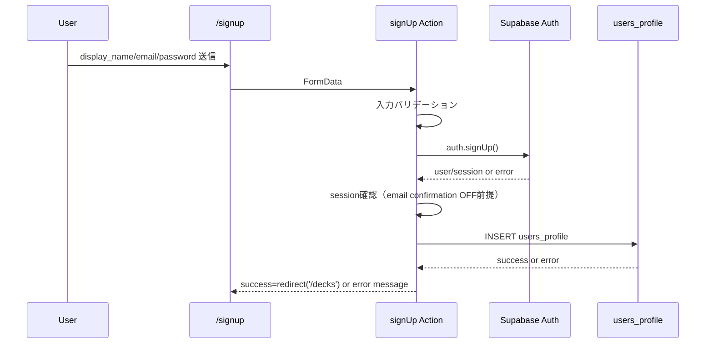
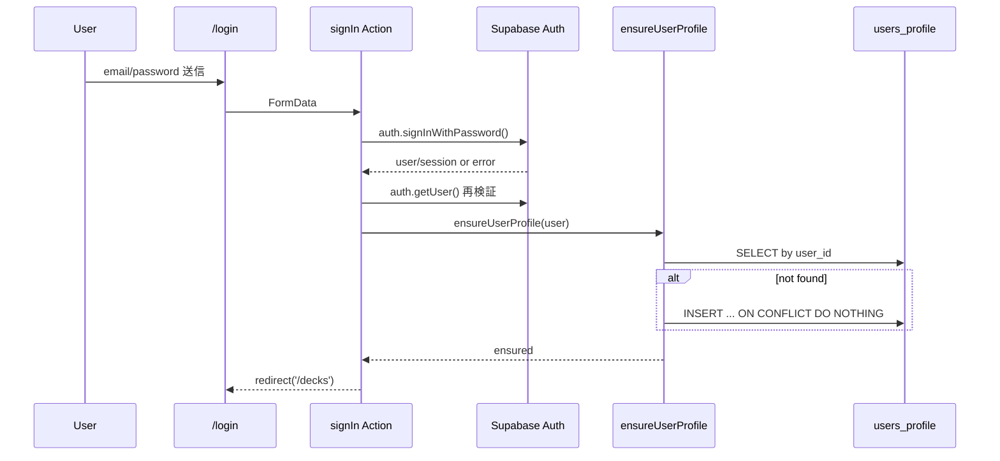

# 認証フロー Design Document

## 概要

S-03 では、Supabase Auth（email/password）を使った `signup` / `signin` / `signout` を Next.js Server Actions で実装し、`/decks` 配下を middleware で保護する。あわせて `users_profile` の作成とログイン時救済を実装し、RLS 前提のデータ境界を安定運用できる状態を定義する。

## 背景とコンテキスト

### 仕様優先順位

- 最優先: `specs/stories/S-03-authentication-flow/requirements.md`（v1.1.0）
- 準拠: `specs/adr/ADR-003-authentication-flow.md`
- 参考: `specs/stories/S-03-authentication-flow/story.md`, `specs/epics/E-01-project-foundation-auth/epic.md`

### 前提となる ADR

- `specs/adr/ADR-001-project-foundation-supabase-clients.md`
  - Supabase クライアント分離（Server/Browser）
- `specs/adr/ADR-002-database-schema-rls-access-boundary.md`
  - `users_profile` を含む owner scoped データ境界
- `specs/adr/ADR-003-authentication-flow.md`
  - middleware 最小責務、`getUser/getClaims` 再検証、`users_profile` 救済の冪等戦略

### 合意事項チェックリスト

#### スコープ
- [x] `signUp` / `signIn` / `signOut` Server Actions 実装
- [x] `/login` `/signup` のフォーム UI 実装（モバイル優先）
- [x] `app/(auth)/layout.tsx` による認証済みレイアウト導入
- [x] `middleware.ts` による `/decks` 境界保護
- [x] signup 作成 + login 救済による `users_profile` 整合性確保

#### 非スコープ
- [x] OAuth、パスワードリセット、メール認証 UI
- [x] `app/(auth)/decks/page.tsx` の本格 UI（E-02）
- [x] `/decks` 以外の保護ルート拡張

#### 制約
- [x] MVP 環境では `Enable email confirmations = OFF` を前提にする
- [x] 認可判定は `auth.getSession()` を根拠にしない
- [x] middleware は DB 書き込みを行わない
- [x] login 救済は冪等（重複作成しない）
- [x] AC#2 はデプロイ前チェック項目として責任者・確認手順を運用に固定する

## 解決する問題

- S-01 時点では `/login` `/decks` がスタブで、認証境界が未実装。
- signup 時の profile 作成失敗を放置すると、Auth ユーザーと業務データの整合性が崩れる。
- 認証判定を Cookie セッション依存にすると、失効・偽装・期限切れトークンの判定が不安定になる。

## 要件

### 機能要件

- Server Actions で `signUp`, `signIn`, `signOut` を提供する。
- signup 成功時に `users_profile(user_id, display_name, timezone='Asia/Tokyo')` を作成する。
- login 成功時に `users_profile` 欠損を検知した場合のみ救済作成する。
- middleware で `/decks` 系の未認証アクセスを `/login` に誘導する。
- 認証済みで `/login` `/signup` に来た場合は `/decks` に誘導する。

### 非機能要件

- **セキュリティ**: 認証再検証は `getUser/getClaims` ベース、`getSession` 単独判定を禁止。
- **信頼性**: profile 救済作成は再実行で壊れない（冪等）。
- **パフォーマンス**: middleware と認証遷移の体感遅延を通常 1 秒以内に収める。
- **保守性**: 認証遷移（actions）と経路保護（middleware）の責務を分離する。

## 受入条件（EARS, 要件 AC#1〜#20 準拠）

- AC-01（選択型）: もしユーザーが `/signup` を入力したなら、システムは `display_name(1-20)`, `email(形式)`, `password(8+)` を検証すること。
- AC-02（遍在型）: システムは MVP 環境で `Enable email confirmations=OFF` を成立前提として扱うこと。
- AC-03（複合型）: `Enable email confirmations=OFF` の間に signup 成功イベントが発生したとき、システムはセッション確立後 `/decks` に遷移すること。
- AC-04（契機型）: signup 成功イベントが発生したとき、システムは Auth 作成後に `users_profile` を作成すること。
- AC-05（不測型）: もし signup 後の `users_profile` 作成が失敗した場合、システムは Auth ユーザーを維持したままエラー表示し、成功遷移しないこと。
- AC-06（選択型）: もし重複メールで signup が失敗した場合、システムは既定文言を表示すること。
- AC-07（選択型）: もしパスワード要件不足で signup が失敗した場合、システムは既定文言を表示すること。
- AC-08（不測型）: もし signup でサーバーエラーが発生した場合、システムは既定文言を表示すること。
- AC-09（契機型）: login 成功イベントが発生したとき、システムは `/decks` へ遷移すること。
- AC-10（選択型）: もし login 認証に失敗した場合、システムは既定文言を表示すること。
- AC-11（不測型）: もし login 処理でサーバーエラーが発生した場合、システムは既定文言を表示すること。
- AC-12（遍在型）: システムは `/login` `/signup` で max-width 28rem・入力/ボタン高さ48px以上・主ボタン全幅を満たすこと。
- AC-13（複合型）: login 成功時に `users_profile` 欠損が検知されたとき、システムは救済作成後 `/decks` に遷移すること。
- AC-14（遍在型）: システムは救済作成を冪等に実行し、同一 `user_id` の profile 行を 1 件に保つこと。
- AC-15（選択型）: もし未認証で `/decks` または `/decks/*` にアクセスした場合、システムは `/login` にリダイレクトすること。
- AC-16（選択型）: もし認証済みで `/login` または `/signup` にアクセスした場合、システムは `/decks` にリダイレクトすること。
- AC-17（状態型）: 公開ルート `/` の間、システムは認証有無に関わらず表示可能であること。
- AC-18（遍在型）: システムは matcher で `/_next/static`, `/_next/image`, `/favicon.ico` を除外すること。
- AC-19（契機型）: ログアウト実行イベントが発生したとき、システムは `app/(auth)/layout.tsx` の導線から `/login` に遷移させること。
- AC-20（遍在型）: システムは `signUp` / `signIn` / `signOut` を Server Actions で提供し、フォーム経由で CSRF 保護を有効にすること。

## 既存コードベース分析

### 実装対象コンポーネント/ファイル一覧

| 種別 | パス | 役割 |
|---|---|---|
| 既存（更新） | `frontend/app/login/page.tsx` | スタブから login フォーム画面へ更新 |
| 既存（移設/更新） | `frontend/app/decks/page.tsx` -> `frontend/app/(auth)/decks/page.tsx` | 保護ルートへ移設（URL は `/decks` を維持） |
| 新規 | `frontend/app/signup/page.tsx` | signup フォーム画面 |
| 新規 | `frontend/app/(auth)/layout.tsx` | 認証済みレイアウト（アプリ名 + signOut 導線） |
| 新規 | `frontend/middleware.ts` | 認証状態によるルート判定とリダイレクト |
| 新規 | `frontend/src/lib/supabase/middleware.ts` | middleware 用 Supabase クライアント生成 |
| 新規 | `frontend/src/actions/auth-actions.ts` | `signUp` / `signIn` / `signOut` Server Actions |
| 新規 | `frontend/src/actions/auth-types.ts` | Action 戻り値・エラー型定義 |
| 新規 | `frontend/src/lib/auth/ensure-user-profile.ts` | login 救済作成（冪等） |
| 新規 | `frontend/src/lib/auth/display-name.ts` | `display_name` 正規化/フォールバック |
| 新規 | `frontend/src/components/auth/login-form.tsx` | login UI コンポーネント |
| 新規 | `frontend/src/components/auth/signup-form.tsx` | signup UI コンポーネント |
| 新規 | `frontend/src/components/auth/auth-error-banner.tsx` | フォーム共通エラー表示 |
| 新規 | `frontend/src/components/auth/submit-button.tsx` | 二重送信防止 + 送信中表示 |
| 新規 | `frontend/src/components/auth/signout-button.tsx` | logout 実行ボタン |
| 新規（テスト） | `frontend/src/actions/auth-actions.test.ts` | Action の正常/異常系検証 |
| 新規（テスト） | `frontend/src/lib/auth/ensure-user-profile.test.ts` | 救済作成の冪等性検証 |
| 新規（テスト） | `specs/stories/S-03-authentication-flow/tests/authentication-flow.int.test.tsx` | 受入条件統合テスト |
| 新規（テスト） | `specs/stories/S-03-authentication-flow/tests/authentication-flow.e2e.test.tsx` | 認証フロー E2E スケルトン |

### 統合点

- **Supabase Auth**: `auth.signUp`, `auth.signInWithPassword`, `auth.signOut`, `auth.getUser`, `auth.getClaims`
- **Supabase DB**: `public.users_profile` への作成/欠損救済
- **Next.js App Router**: Server Actions + route groups + middleware
- **既存基盤**: `frontend/src/lib/supabase/server.ts`（Server Actions 側）

## 設計

### 変更影響マップ

```yaml
変更対象: auth flow (UI / server actions / middleware / users_profile rescue)
直接影響:
  - frontend/app/login/page.tsx
  - frontend/app/signup/page.tsx
  - frontend/app/(auth)/layout.tsx
  - frontend/app/(auth)/decks/page.tsx
  - frontend/middleware.ts
  - frontend/src/actions/auth-actions.ts
  - frontend/src/lib/auth/ensure-user-profile.ts
  - frontend/src/lib/supabase/middleware.ts
間接影響:
  - S-02 RLS境界に依存した users_profile アクセス可否
  - /decks 配下の後続機能（E-02）のセッション前提
  - E2E 実行時のテストユーザー作成フロー
波及なし:
  - public route `/` の表示ロジック
  - S-04 seed / date utilities
```

### アーキテクチャ概要

```mermaid
flowchart TD
  Browser[Browser] --> LoginSignup[/login or /signup]
  LoginSignup -->|form action| Actions[Server Actions auth-actions.ts]
  Actions --> Auth[Supabase Auth]
  Actions --> Profile[(public.users_profile)]
  Actions -->|success| Decks[/decks]

  Browser --> Req[Request]
  Req --> MW[middleware.ts]
  MW -->|auth revalidation| Auth
  MW -->|allow| Route[Route Handler / Page]
  MW -->|redirect unauth| Login[/login]
  MW -->|redirect authed| Decks

  Decks --> AuthLayout[app/(auth)/layout.tsx]
  AuthLayout --> SignOutBtn[signout-button]
  SignOutBtn -->|form action| Actions
```

### データフロー・認証フロー

#### signup フロー



#### signin + 救済フロー



#### signout フロー

1. 認証済みレイアウト上のログアウトボタンが `signOut` を Server Action として送信する。  
2. `auth.signOut()` 成功後、`/login` へリダイレクトする。  
3. middleware は次回リクエストで未認証として `/decks` への再アクセスを遮断する。

### Server Actions API 仕様

#### 共通型

```typescript
type AuthActionState = {
  status: "idle" | "error"
  message?: string
  fieldErrors?: {
    email?: string
    password?: string
    displayName?: string
  }
}
```

#### `signUp`

| 項目 | 仕様 |
|---|---|
| 関数 | `signUp(prevState: AuthActionState, formData: FormData): Promise<AuthActionState>` |
| 入力 | `display_name`, `email`, `password` |
| バリデーション | `display_name: 1-20`, `email: format`, `password: >=8` |
| Supabase 呼び出し | `auth.signUp({ email, password, options: { data: { display_name } } })` |
| 成功条件 | `data.user` と `data.session` が存在し、`users_profile` 作成成功 |
| 成功時 | `redirect('/decks')` |
| 失敗時 | `AuthActionState{status:'error', message}` を返す（遷移しない） |

#### `signIn`

| 項目 | 仕様 |
|---|---|
| 関数 | `signIn(prevState: AuthActionState, formData: FormData): Promise<AuthActionState>` |
| 入力 | `email`, `password` |
| Supabase 呼び出し | `auth.signInWithPassword({ email, password })` |
| 再検証 | `auth.getUser()`（必要時 `auth.getClaims()`） |
| 後処理 | `ensureUserProfile(user)` を実行 |
| 成功時 | `redirect('/decks')` |
| 失敗時 | `AuthActionState{status:'error', message}` |

#### `signOut`

| 項目 | 仕様 |
|---|---|
| 関数 | `signOut(): Promise<void>` |
| 入力 | なし |
| Supabase 呼び出し | `auth.signOut()` |
| 成功時 | `redirect('/login')` |
| 失敗時 | fail-fast（ログ記録後に汎用エラー表示ページへ伝播） |

#### エラーメッセージマッピング

| 条件 | 文言 | 対応 AC |
|---|---|---|
| 重複メール (`user_already_exists` 等) | このメールアドレスは既に登録されています | AC#6 |
| パスワード要件不足 (`weak_password` 等) | パスワードは8文字以上で入力してください | AC#7 |
| signup サーバーエラー | アカウントの作成に失敗しました。もう一度お試しください | AC#8 |
| 認証失敗 (`invalid_credentials` 等) | メールアドレスまたはパスワードが正しくありません | AC#10 |
| login サーバーエラー | ログインに失敗しました。もう一度お試しください | AC#11 |
| signup 後 profile 作成失敗 | アカウントは作成されましたが初期設定に失敗しました。ログインして再試行してください | AC#5 |
| email confirmation 前提不一致（session null） | 環境設定を確認してください。時間をおいて再試行してください | AC#2, AC#3 |

### AC#2 運用担保（Enable email confirmations=OFF）

#### デプロイ前チェック責任

| 項目 | 責任箇所 | 実施タイミング | 記録方法 |
|---|---|---|---|
| 設定確認の実施 | デプロイ実行者（Release Owner） | 本番/ステージングへの deploy 開始前 | デプロイチェックリストに結果を記録 |
| 証跡確認と承認 | レビュアー（PR Approver） | deploy 承認前 | PR 上でスクリーンショット確認 + 承認コメント |
| smoke 検証 | QA またはデプロイ実行者 | deploy 後 10 分以内 | smoke test 結果を PR または Runbook に追記 |

#### 確認手順（検証可能な運用手順）

1. 対象 Supabase プロジェクトを開き、`Authentication > Providers > Email` で `Enable email confirmations` が `OFF` であることを確認する。  
2. 確認時の画面をスクリーンショット保存し、`project ref` と確認日時（JST）を添えてデプロイチェックリストに貼り付ける。  
3. レビュアーが証跡を確認し、`AC#2 pre-deploy check: PASS` を承認コメントとして残す。  
4. deploy 後に signup smoke（新規メールでの signup）を実施し、`session != null` かつ `/decks` 遷移を確認する。  
5. 1〜4のいずれかが満たせない場合、S-03 の deploy を中止し、構成不一致としてエスカレーションする。  

### middleware 判定方針（ADR-003準拠: `getUser` 最終判定 + `getClaims` 補助）

#### 方針

- 認可判定の最終根拠は常に `auth.getUser()` とする。
- `auth.getClaims()` は JWT 状態確認の補助に使ってよいが、成功/失敗いずれでも認可の最終判定は確定しない。
- `auth.getSession()` は Cookie 由来で信頼境界が弱いため、判定根拠に使わない。

#### 判定手順

1. `pathname` を `public` (`/`), `guest-only` (`/login`, `/signup`), `protected` (`/decks`, `/decks/*`) に分類。  
2. `public` は認証呼び出しせず `next()`。  
3. `guest-only` / `protected` のみ認証再検証を実施し、まず `auth.getClaims()` を補助情報として取得する（失敗しても継続）。  
4. `auth.getClaims()` が失敗した場合はログ記録のみ行い、未認証へ短絡しない。  
5. `auth.getUser()` を必ず呼び、`user` の有無を最終判定として採用する。  
6. 最終判定結果に基づきリダイレクト（未認証 + protected -> `/login`、認証済み + guest-only -> `/decks`）を実行する。  
7. `matcher` から `/_next/static`, `/_next/image`, `/favicon.ico` を除外。

#### 判定マトリクス

| 認証状態 | パス分類 | 動作 |
|---|---|---|
| 未認証 | protected | `/login` へ redirect |
| 未認証 | guest-only | 通過 |
| 未認証 | public | 通過 |
| 認証済み | protected | 通過 |
| 認証済み | guest-only | `/decks` へ redirect |
| 認証済み | public | 通過 |

### `users_profile` 救済作成の冪等設計

#### 目的

signup 時の profile 作成失敗、または過去データ不整合により `users_profile` が欠損したユーザーを login 時に復旧する。

#### データ契約

```yaml
入力:
  user.id: UUID (required)
  user.email: string (required)
  user.user_metadata.display_name: string (optional)

作成値:
  user_id: user.id
  display_name: normalize(user_metadata.display_name) || email_local_part
  timezone: Asia/Tokyo

不変条件:
  - users_profile.user_id は常に一意
  - 既存行がある場合は上書きしない
  - 複数回実行しても最終状態は1行
```

#### アルゴリズム

1. `SELECT user_id FROM users_profile WHERE user_id = $1`。  
2. 存在する場合は `already_exists` として成功終了。  
3. 存在しない場合のみ `INSERT ... ON CONFLICT (user_id) DO NOTHING` を実行。  
4. 競合（同時ログイン）発生時も成功扱いで処理継続。  
5. その他 DB エラーのみ失敗として Action 側で汎用 login エラーに変換。

#### 正規化ルール（display_name）

- 優先順: `user_metadata.display_name` -> `email` ローカル部
- 前後空白を trim
- 1 文字未満の場合は `email` ローカル部へフォールバック
- 20 文字超過時は 20 文字に切り詰め

### インターフェース変更マトリクス

| 区分 | インターフェース | 変更種別 | 変換必要性 | 互換性確保 |
|---|---|---|---|---|
| 既存 | `frontend/app/login/page.tsx` | 更新 | なし | URLは維持 (`/login`) |
| 既存 | `frontend/app/decks/page.tsx` | 移設 | なし | route group で URL `/decks` 維持 |
| 新規 | `signUp` / `signIn` / `signOut` Actions | 追加 | なし | Form `action` 経由で呼び出し統一 |
| 新規 | `ensureUserProfile(user)` | 追加 | なし | login 成功後のみ呼び出す |
| 新規 | `frontend/middleware.ts` | 追加 | なし | matcher で対象外パスを固定 |

### 統合点一覧

| 統合点 | 場所 | 旧実装 | 新実装 | 切り替え方法 |
|---|---|---|---|---|
| 認証画面 | `app/login`, `app/signup` | stub / 未実装 | 実フォーム + Server Actions | `form action={signIn/signUp}` |
| 保護レイアウト | `app/(auth)/layout.tsx` | なし | ヘッダー + signout 導線 | route group 追加 |
| ルート保護 | `frontend/middleware.ts` | なし | 認証再検証 + redirect | matcher 有効化 |
| profile 整合 | `ensure-user-profile.ts` | なし | login 救済を冪等実行 | Action 内呼び出し |

## 実装アプローチ

### 選択アプローチ

**ハイブリッド（境界先行 + Action 垂直実装）**

- 先に middleware で経路境界を固定し、未認証アクセスを防止する。  
- 次に `signUp/signIn/signOut` を垂直に実装し、profile 作成/救済を接続する。  
- 最後に UI とエラーメッセージを合わせ込む。

### 技術的依存関係と順序

1. middleware と matcher 実装（境界確立）
2. auth-actions 実装（signup/signin/signout）
3. `ensureUserProfile` 実装（冪等救済）
4. `/login` `/signup` UI 実装 + `app/(auth)/layout.tsx`
5. テスト（unit -> integration -> e2e skeleton）

## 統合点での E2E 確認手順

1. 未認証で `/decks` と `/decks/abc` にアクセスし、`/login` リダイレクトを確認。  
2. 認証済みで `/login` `/signup` にアクセスし、`/decks` リダイレクトを確認。  
3. signup 正常系で profile 作成と `/decks` 遷移を確認。  
4. signup profile 作成失敗系で「Auth 作成済み + 遷移なし + エラー表示」を確認。  
5. login 時 profile 欠損ユーザーで救済作成後 `/decks` 遷移を確認。  
6. 同一ユーザーで login 救済を複数回実行し、`users_profile` が 1 行であることを確認。  
7. `/_next/static/*`, `/_next/image/*`, `/favicon.ico` で認証リダイレクトが発生しないことを確認。

## AC トレーサビリティ（AC#1〜#20）

| AC | 実装成果物 | 検証ポイント |
|---|---|---|
| AC#1 | `frontend/app/signup/page.tsx`, `frontend/src/components/auth/signup-form.tsx`, `frontend/src/actions/auth-actions.ts` | 3項目バリデーションが UI/Action 両方で成立 |
| AC#2 | `frontend/src/actions/auth-actions.ts`, 運用設定（Supabase Auth） | `Enable email confirmations=OFF` 前提チェック |
| AC#3 | `frontend/src/actions/auth-actions.ts` | signup 成功時 `session` あり + `/decks` redirect |
| AC#4 | `frontend/src/actions/auth-actions.ts` | signup 後 `users_profile` 作成（display_name/timezone） |
| AC#5 | `frontend/src/actions/auth-actions.ts`, `frontend/src/components/auth/auth-error-banner.tsx` | profile 作成失敗時の遷移停止とエラー表示 |
| AC#6 | `frontend/src/actions/auth-actions.ts` | 重複メール時の専用文言 |
| AC#7 | `frontend/src/actions/auth-actions.ts` | 弱いパスワード時の専用文言 |
| AC#8 | `frontend/src/actions/auth-actions.ts` | signup サーバーエラー文言 |
| AC#9 | `frontend/src/actions/auth-actions.ts` | login 成功時 `/decks` redirect |
| AC#10 | `frontend/src/actions/auth-actions.ts` | 認証失敗文言 |
| AC#11 | `frontend/src/actions/auth-actions.ts` | login サーバーエラー文言 |
| AC#12 | `frontend/app/login/page.tsx`, `frontend/app/signup/page.tsx` | `max-width:28rem`、高さ48px+、主ボタン全幅 |
| AC#13 | `frontend/src/lib/auth/ensure-user-profile.ts`, `frontend/src/actions/auth-actions.ts` | 欠損検知時の救済作成後 redirect |
| AC#14 | `frontend/src/lib/auth/ensure-user-profile.ts` | `ON CONFLICT DO NOTHING` 相当で 1 行維持 |
| AC#15 | `frontend/middleware.ts` | 未認証 `/decks*` -> `/login` |
| AC#16 | `frontend/middleware.ts` | 認証済み `/login|/signup` -> `/decks` |
| AC#17 | `frontend/middleware.ts`, `frontend/app/page.tsx` | `/` は認証有無に関係なく表示 |
| AC#18 | `frontend/middleware.ts` | matcher 除外パスで redirect なし |
| AC#19 | `frontend/app/(auth)/layout.tsx`, `frontend/src/components/auth/signout-button.tsx`, `frontend/src/actions/auth-actions.ts` | ヘッダー表示 + signout 後 `/login` |
| AC#20 | `frontend/src/actions/auth-actions.ts`, `frontend/app/login/page.tsx`, `frontend/app/signup/page.tsx`, `frontend/app/(auth)/layout.tsx` | Form Action 実行で Server Actions/CSRF 保護利用 |

### AC -> テストケースID マッピング（unit / integration / e2e）

| AC | Unit | Integration | E2E |
|---|---|---|---|
| AC#1 | UT-AC01-SIGNUP-VALIDATION | IT-AC01-SIGNUP-VALIDATION | E2E-AC01-SIGNUP-VALIDATION |
| AC#2 | UT-AC02-CONFIG-MISMATCH-HANDLING | IT-AC02-CONFIG-CHECK-GATE | E2E-AC02-SIGNUP-SESSION-ESTABLISHED |
| AC#3 | UT-AC03-SIGNUP-SESSION-REDIRECT | IT-AC03-SIGNUP-SUCCESS-REDIRECT | E2E-AC03-SIGNUP-TO-DECKS |
| AC#4 | UT-AC04-PROFILE-CREATE-VALUES | IT-AC04-SIGNUP-PROFILE-PERSIST | E2E-AC04-SIGNUP-PROFILE-CREATED |
| AC#5 | UT-AC05-PROFILE-FAIL-NO-REDIRECT | IT-AC05-SIGNUP-PROFILE-ERROR | E2E-AC05-SIGNUP-PROFILE-FAILURE-UX |
| AC#6 | UT-AC06-DUPLICATE-EMAIL-MESSAGE | IT-AC06-DUPLICATE-EMAIL-FLOW | E2E-AC06-DUPLICATE-EMAIL-UX |
| AC#7 | UT-AC07-WEAK-PASSWORD-MESSAGE | IT-AC07-WEAK-PASSWORD-FLOW | E2E-AC07-WEAK-PASSWORD-UX |
| AC#8 | UT-AC08-SIGNUP-SERVER-ERROR-MESSAGE | IT-AC08-SIGNUP-SERVER-ERROR | E2E-AC08-SIGNUP-SERVER-ERROR-UX |
| AC#9 | UT-AC09-LOGIN-SUCCESS-REDIRECT | IT-AC09-LOGIN-SUCCESS-REDIRECT | E2E-AC09-LOGIN-TO-DECKS |
| AC#10 | UT-AC10-INVALID-CREDENTIALS-MESSAGE | IT-AC10-LOGIN-AUTH-FAILURE | E2E-AC10-LOGIN-AUTH-FAILURE-UX |
| AC#11 | UT-AC11-LOGIN-SERVER-ERROR-MESSAGE | IT-AC11-LOGIN-SERVER-ERROR | E2E-AC11-LOGIN-SERVER-ERROR-UX |
| AC#12 | UT-AC12-UI-SIZING-RULES | IT-AC12-FORM-LAYOUT-CONSTRAINTS | E2E-AC12-MOBILE-FORM-LAYOUT |
| AC#13 | UT-AC13-PROFILE-RESCUE-ON-LOGIN | IT-AC13-LOGIN-RESCUE-THEN-REDIRECT | E2E-AC13-LOGIN-RESCUE-FLOW |
| AC#14 | UT-AC14-RESCUE-IDEMPOTENCY | IT-AC14-RESCUE-ON-CONFLICT | E2E-AC14-RESCUE-RETRY-SINGLE-ROW |
| AC#15 | UT-AC15-MW-UNAUTH-PROTECTED | IT-AC15-MW-REDIRECT-TO-LOGIN | E2E-AC15-UNAUTH-DECKS-REDIRECT |
| AC#16 | UT-AC16-MW-AUTH-GUESTONLY | IT-AC16-MW-REDIRECT-TO-DECKS | E2E-AC16-AUTH-LOGIN-SIGNUP-REDIRECT |
| AC#17 | UT-AC17-MW-PUBLIC-PASS | IT-AC17-ROOT-PUBLIC-ACCESS | E2E-AC17-ROOT-ACCESS-WITHOUT-REDIRECT |
| AC#18 | UT-AC18-MW-MATCHER-EXCLUDE | IT-AC18-MW-ASSET-PASS | E2E-AC18-ASSET-NO-AUTH-REDIRECT |
| AC#19 | UT-AC19-SIGNOUT-REDIRECT | IT-AC19-AUTH-LAYOUT-SIGNOUT-FLOW | E2E-AC19-SIGNOUT-TO-LOGIN |
| AC#20 | UT-AC20-SERVER-ACTIONS-FORM-BINDING | IT-AC20-FORM-ACTION-CSRF-PATH | E2E-AC20-FORM-SUBMISSION-VIA-SERVER-ACTION |

## 要件トレーサビリティ補完（Should）

| 要件ID | 要件（requirements.md） | 実装成果物 | テストケースID |
|---|---|---|---|
| SH-01 | 送信中は二重送信防止（ボタン無効化、ローディング表示）を行う | `frontend/src/components/auth/submit-button.tsx` | UT-SH01-SUBMIT-DISABLE, IT-SH01-DOUBLE-SUBMIT-GUARD, E2E-SH01-LOADING-BEHAVIOR |
| SH-02 | ログイン/サインアップ間の導線リンクを常に表示する | `frontend/src/components/auth/login-form.tsx`, `frontend/src/components/auth/signup-form.tsx` | UT-SH02-CROSS-LINK-RENDER, IT-SH02-CROSS-LINK-NAVIGATION, E2E-SH02-LOGIN-SIGNUP-CROSS-NAVIGATION |

## テスト戦略

### 単体テスト

- `auth-actions.test.ts`: 主要エラー分岐、メッセージ変換、redirect 条件（UT-AC01〜UT-AC11, UT-AC19, UT-AC20）
- `ensure-user-profile.test.ts`: 欠損時作成、既存時スキップ、競合時成功扱い（UT-AC13, UT-AC14）
- `middleware` テスト: 判定マトリクスと matcher 除外（UT-AC15〜UT-AC18）
- `auth form component` テスト: UI制約と相互導線（UT-AC12, UT-SH02）

### 統合テスト

- `authentication-flow.int.test.tsx`: signup/login/logout と middleware 判定を結合検証（IT-AC01〜IT-AC20, IT-SH02）

### E2E テスト

- `authentication-flow.e2e.test.tsx`: ブラウザ導線として AC#1-#20 を検証（E2E-AC01〜E2E-AC20）
- `authentication-flow.e2e.test.tsx` には login/signup 相互導線シナリオ（E2E-SH02）を追加する

## リスクと軽減策

| リスク | 影響度 | 発生確率 | 軽減策 |
|---|---|---|---|
| email confirmation 設定不一致で signup 後セッション未確立 | 高 | 中 | session null を構成不一致として検知し遷移停止 |
| middleware で誤って `getSession` 判定を使う | 高 | 中 | `getUser/getClaims` 固定をレビュー観点にする |
| 救済作成の競合で duplicate error が発生 | 中 | 中 | `ON CONFLICT DO NOTHING` 相当 + duplicate を成功扱い |
| エラー文言の不一致で AC 判定不合格 | 中 | 中 | メッセージ定数を Action で一元管理 |

## 参考資料

- `specs/stories/S-03-authentication-flow/requirements.md`
- `specs/adr/ADR-003-authentication-flow.md`
- `specs/adr/ADR-001-project-foundation-supabase-clients.md`
- `specs/adr/ADR-002-database-schema-rls-access-boundary.md`
- Next.js Docs: Server Actions / Middleware
- Supabase Docs: Auth (`signUp`, `signInWithPassword`, `signOut`, `getUser`, `getClaims`)

## 変更履歴

| 日付 | 版 | 変更内容 | 作成者 |
|---|---|---|---|
| 2026-02-23 | 1.1.0 | ADR-003整合化（middleware判定）、AC#2運用担保追加、Should要件トレーサビリティ追加、AC#1〜#20のAC→テストID表を追加 | Codex |
| 2026-02-23 | 1.0.0 | 初版作成（S-03 authentication-flow Design Doc） | Codex |
