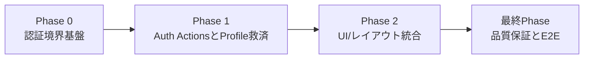
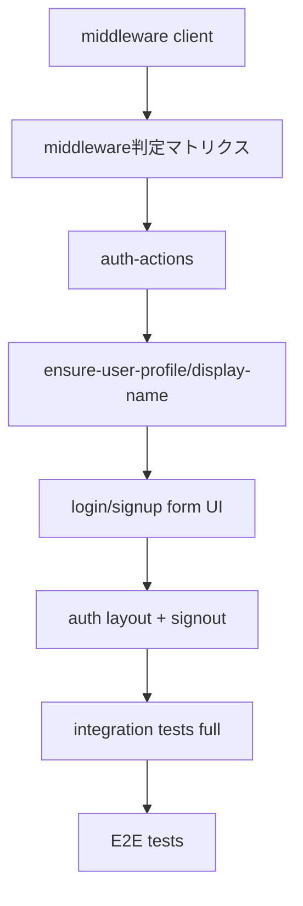

# 作業計画書: authentication-flow

作成日: 2026-02-23  
種別: feature  
想定影響範囲: frontend認証フロー（middleware + Server Actions + UI） + ストーリーテスト  
関連Issue/PR: 未設定

## 関連ドキュメント
- ADR: `specs/adr/ADR-003-authentication-flow.md`
- 要件定義書: `specs/stories/S-03-authentication-flow/requirements.md`
- Design Doc: `specs/stories/S-03-authentication-flow/design.md`
- 統合テスト骨子: `specs/stories/S-03-authentication-flow/tests/authentication-flow.int.test.tsx`
- E2Eテスト骨子: `specs/stories/S-03-authentication-flow/tests/authentication-flow.e2e.test.tsx`

## 目的
Supabase Auth（email/password）による signup/signin/signout と `/decks` 境界保護を実装し、`users_profile` 作成/救済戦略を含む認証基盤を S-03 の受入条件（AC#1〜AC#20）で成立させる。

## 計画ルール（acceptance-test-generator反映）
- [ ] 統合テスト `specs/stories/S-03-authentication-flow/tests/authentication-flow.int.test.tsx` は各Phase実装と同時に `it.todo` を実装し、同じPhase内で実行・合格させる
- [ ] E2Eテスト `specs/stories/S-03-authentication-flow/tests/authentication-flow.e2e.test.tsx` は全実装完了後の最終Phaseでのみ実行する

## 影響範囲
### 対象ファイル
- [x] `frontend/middleware.ts`
- [x] `frontend/src/lib/supabase/middleware.ts`
- [ ] `frontend/src/actions/auth-actions.ts`
- [ ] `frontend/src/actions/auth-types.ts`
- [ ] `frontend/src/lib/auth/ensure-user-profile.ts`
- [ ] `frontend/src/lib/auth/display-name.ts`
- [ ] `frontend/app/login/page.tsx`
- [ ] `frontend/app/signup/page.tsx`
- [ ] `frontend/app/(auth)/layout.tsx`
- [ ] `frontend/app/(auth)/decks/page.tsx`
- [ ] `frontend/src/components/auth/auth-error-banner.tsx`
- [ ] `frontend/src/components/auth/login-form.tsx`
- [ ] `frontend/src/components/auth/signup-form.tsx`
- [ ] `frontend/src/components/auth/submit-button.tsx`
- [ ] `frontend/src/components/auth/signout-button.tsx`
- [x] `frontend/vitest.config.ts`（S-03ストーリーテスト実行パス追加）

### テストファイル
- [ ] `frontend/src/actions/auth-actions.test.ts`
- [ ] `frontend/src/lib/auth/ensure-user-profile.test.ts`
- [ ] `frontend/src/lib/auth/display-name.test.ts`
- [ ] `frontend/src/components/auth/login-form.test.tsx`
- [ ] `frontend/src/components/auth/signup-form.test.tsx`
- [ ] `frontend/src/components/auth/signout-button.test.tsx`
- [x] `frontend/src/middleware.test.ts`
- [x] `specs/stories/S-03-authentication-flow/tests/authentication-flow.int.test.tsx`
- [ ] `specs/stories/S-03-authentication-flow/tests/authentication-flow.e2e.test.tsx`

## フェーズ構成

### フェーズ構成図

### タスク依存関係図

### フェーズ依存関係
- [x] Phase 1 着手条件: Phase 0 で AC#15〜AC#18 の統合テストが合格している
- [ ] Phase 2 着手条件: Phase 1 で AC#1〜AC#11 / AC#13 / AC#14 / AC#20 の統合テストが合格している
- [ ] 最終Phase 着手条件: Phase 0〜2 の実装・単体テスト・統合テストがすべて完了している

### Phase 0: 認証境界基盤（想定コミット数: 1）
**目的**: ADR-003 準拠の middleware 境界とテスト実行基盤を先に固定する。

#### タスク
- [x] middleware 用 Supabase クライアントを実装する（Cookie同期責務のみ）
  - 実装: `frontend/src/lib/supabase/middleware.ts`
  - テスト: `frontend/src/middleware.test.ts`
- [x] `/decks` 保護・guest-onlyリダイレクト・公開ルート許可・matcher除外を実装する
  - 実装: `frontend/middleware.ts`
  - テスト: `frontend/src/middleware.test.ts`
- [x] S-03 ストーリーテストを実行可能にするため Vitest include を更新する
  - 実装: `frontend/vitest.config.ts`
  - テスト: `npm run test --prefix frontend`
- [x] 統合テスト（Phase 0対象）を実装・実行する
  - テスト: `specs/stories/S-03-authentication-flow/tests/authentication-flow.int.test.tsx`
  - 対象: `IT-AC15`, `IT-AC16`, `IT-AC17`, `IT-AC18`

#### フェーズ完了条件（Design AC由来）
- [x] AC#15: 未認証の `/decks` 系アクセスを `/login` へリダイレクトできる
- [x] AC#16: 認証済みの `/login` `/signup` アクセスを `/decks` へリダイレクトできる
- [x] AC#17: 公開ルート `/` は認証有無に関係なく表示できる
- [x] AC#18: matcher 除外パスで認証リダイレクトが発生しない

#### 動作確認手順
1. middleware の判定マトリクスを unit test で検証する。
2. `authentication-flow.int.test.tsx` の Phase 0 対象ケースを実装し実行する。
3. `/_next/static/*`, `/_next/image/*`, `/favicon.ico` へのアクセスで redirect 不発生を確認する。

#### 停止ポイント（品質固定）
- [x] Phase 0 対象統合テストがPASSした状態を保存する

### Phase 1: Auth Actions と Profile救済（想定コミット数: 1-2）
**目的**: signup/signin/signout と `users_profile` 整合性ロジックをサーバー側で成立させる。

#### タスク
- [ ] 認証Actionの state 型・エラーマッピングを定義する
  - 実装: `frontend/src/actions/auth-types.ts`, `frontend/src/actions/auth-actions.ts`
  - テスト: `frontend/src/actions/auth-actions.test.ts`
- [ ] `display_name` 正規化/フォールバックユーティリティを実装する
  - 実装: `frontend/src/lib/auth/display-name.ts`
  - テスト: `frontend/src/lib/auth/display-name.test.ts`
- [ ] login時救済作成（冪等）を実装する
  - 実装: `frontend/src/lib/auth/ensure-user-profile.ts`
  - テスト: `frontend/src/lib/auth/ensure-user-profile.test.ts`
- [ ] `signUp` / `signIn` / `signOut` Server Actions を実装する
  - 実装: `frontend/src/actions/auth-actions.ts`
  - テスト: `frontend/src/actions/auth-actions.test.ts`
- [ ] 統合テスト（Phase 1対象）を実装・実行する
  - テスト: `specs/stories/S-03-authentication-flow/tests/authentication-flow.int.test.tsx`
  - 対象: `IT-AC01`〜`IT-AC11`, `IT-AC13`, `IT-AC14`, `IT-AC20`

#### フェーズ完了条件（Design AC由来）
- [ ] AC#1〜AC#4: signup 入力検証・成功遷移・profile作成が成立する
- [ ] AC#5〜AC#8: signup エラー系（profile失敗/重複メール/弱いパスワード/サーバーエラー）を表示できる
- [ ] AC#9〜AC#11: login 成功/失敗/サーバーエラーの挙動を満たす
- [ ] AC#13〜AC#14: login 救済作成が実行され、冪等性を維持する
- [ ] AC#20: 認証操作が Server Actions 経路として実装される

#### 動作確認手順
1. `auth-actions.test.ts` で正常系/異常系メッセージ変換と redirect 条件を確認する。
2. `ensure-user-profile.test.ts` で欠損時作成・既存時スキップ・競合時成功扱いを確認する。
3. `authentication-flow.int.test.tsx` の Phase 1 対象ケースを実装し実行する。

#### 停止ポイント（品質固定）
- [ ] Phase 1 対象統合テストがPASSした状態を保存する

### Phase 2: UI/レイアウト統合（想定コミット数: 1）
**目的**: モバイル優先フォームと認証済みレイアウトを実装し、ユーザー操作導線を完成させる。

#### タスク
- [x] login/signup フォームUIと共通コンポーネントを実装する
  - 実装: `frontend/src/components/auth/login-form.tsx`, `frontend/src/components/auth/signup-form.tsx`, `frontend/src/components/auth/auth-error-banner.tsx`, `frontend/src/components/auth/submit-button.tsx`
  - テスト: `frontend/src/components/auth/login-form.test.tsx`, `frontend/src/components/auth/signup-form.test.tsx`
- [x] `/login` 更新・`/signup` 新規ページを実装する
  - 実装: `frontend/app/login/page.tsx`, `frontend/app/signup/page.tsx`
  - テスト: `frontend/src/components/auth/login-form.test.tsx`, `frontend/src/components/auth/signup-form.test.tsx`
- [x] 認証済みレイアウトとログアウト導線を実装し、`/decks` を route group 配下へ移設する
  - 実装: `frontend/app/(auth)/layout.tsx`, `frontend/src/components/auth/signout-button.tsx`, `frontend/app/(auth)/decks/page.tsx`
  - テスト: `frontend/src/components/auth/signout-button.test.tsx`
- [x] 統合テスト（Phase 2対象）を実装・実行する
  - テスト: `specs/stories/S-03-authentication-flow/tests/authentication-flow.int.test.tsx`
  - 対象: `IT-AC12`, `IT-AC19`
- [x] Figma仕様は未提供のため、手動UI確認を実施して完了条件に記録する（`ui_design: none`）
  - 確認観点: `max-width 28rem`、入力/ボタン高さ48px以上、主ボタン全幅、ログイン/サインアップ相互導線、送信中二重送信防止

#### フェーズ完了条件（Design AC由来 + Should）
- [x] AC#12: `/login` `/signup` がモバイル優先UI制約を満たす
- [x] AC#19: auth layout にアプリ名とログアウト導線があり、実行後 `/login` へ遷移する
- [x] Should: 送信中の二重送信防止（ボタン無効化/ローディング）を満たす
- [x] Should: login/signup の相互導線リンクを常時表示する
- [x] 手動デザイン確認（UI仕様なし運用）が完了している

#### 動作確認手順
1. モバイル幅（320px〜430px）で `/login` `/signup` を表示し、UI制約を確認する。
2. login/signup 双方向リンクと送信中のボタン状態変化を確認する。
3. `authentication-flow.int.test.tsx` の Phase 2 対象ケースを実装し実行する。

#### 停止ポイント（品質固定）
- [x] Phase 2 対象統合テストがPASSした状態を保存する

---

### 最終Phase: 品質保証・E2E実行（必須）（想定コミット数: 1）
**目的**: 全ACの受入証跡を確定し、S-03 実装を完了判定する。

#### タスク
- [ ] `authentication-flow.e2e.test.tsx` の E2E-AC01〜E2E-AC20 を実装する
  - テスト: `specs/stories/S-03-authentication-flow/tests/authentication-flow.e2e.test.tsx`
- [ ] 全実装完了後にのみ E2E を実行する（計画ルール準拠）
  - テスト: `specs/stories/S-03-authentication-flow/tests/authentication-flow.e2e.test.tsx`
- [ ] 統合テストを全件実行し、Phase 0〜2 の退行がないことを確認する
  - テスト: `specs/stories/S-03-authentication-flow/tests/authentication-flow.int.test.tsx`
- [ ] frontend 品質ゲートを実行する
  - コマンド: `npm run check --prefix frontend`
- [ ] 要件/ADR/Design/実装/テストのトレーサビリティを整理する

#### フェーズ完了条件
- [ ] E2E-AC01〜E2E-AC20 がPASSする
- [ ] AC#1〜AC#20 の検証結果をテストログと成果物で追跡できる
- [ ] 統合テスト同時実施・E2E最終実施のルールを満たしている

#### 動作確認手順
1. `authentication-flow.int.test.tsx` をフル実行して全PASSを確認する。
2. `authentication-flow.e2e.test.tsx` を実行し、主要導線（signup/login/logout/middleware境界）を確認する。
3. `npm run check --prefix frontend` を実行し、lint/typecheck/test の通過を確認する。

## AC別完了チェックリスト
- [ ] AC#1: signup 入力検証（display_name/email/password）
- [ ] AC#2: email confirmations=OFF 前提運用
- [ ] AC#3: signup 成功時の即時セッション確立と `/decks` 遷移
- [ ] AC#4: signup 成功時 `users_profile` 作成（display_name, timezone）
- [ ] AC#5: profile 作成失敗時の遷移停止とエラー表示
- [ ] AC#6: 重複メール文言表示
- [ ] AC#7: パスワード要件不足文言表示
- [ ] AC#8: signup サーバーエラー文言表示
- [ ] AC#9: login 成功時 `/decks` 遷移
- [ ] AC#10: login 認証失敗文言表示
- [ ] AC#11: login サーバーエラー文言表示
- [x] AC#12: モバイル優先UI制約
- [ ] AC#13: login時 profile 欠損救済後遷移
- [ ] AC#14: profile 救済作成の冪等性
- [x] AC#15: 未認証 `/decks` 系 -> `/login`
- [x] AC#16: 認証済み `/login|/signup` -> `/decks`
- [x] AC#17: 公開ルート `/` は常時閲覧可能
- [x] AC#18: matcher 除外パスで redirect なし
- [x] AC#19: auth layout のログアウト導線と `/login` 遷移
- [x] AC#20: signUp/signIn/signOut の Server Actions 実装

## リスクと対策
- [ ] リスク: `Enable email confirmations` 設定不一致で signup 成功判定が崩れる  
      対策: AC#2 の事前チェックを運用手順に固定し、session null を構成不一致として扱う
- [ ] リスク: middleware 判定で `getSession` 依存に回帰する  
      対策: `getUser` 最終判定 + `getClaims` 補助の方針を unit/integration テストで固定する
- [ ] リスク: login 救済処理で重複行が発生する  
      対策: `ON CONFLICT DO NOTHING` 相当の冪等実装と AC#14 テストで担保する
- [ ] リスク: 統合テスト実装が後回しになり不具合が終盤に集中する  
      対策: 各Phaseの停止ポイントを「統合テストPASS」に固定する
- [ ] リスク: UI仕様キャッシュ不在で見た目品質が曖昧になる  
      対策: `ui_design: none` を明示し、モバイル幅での手動確認項目を完了条件に含める
