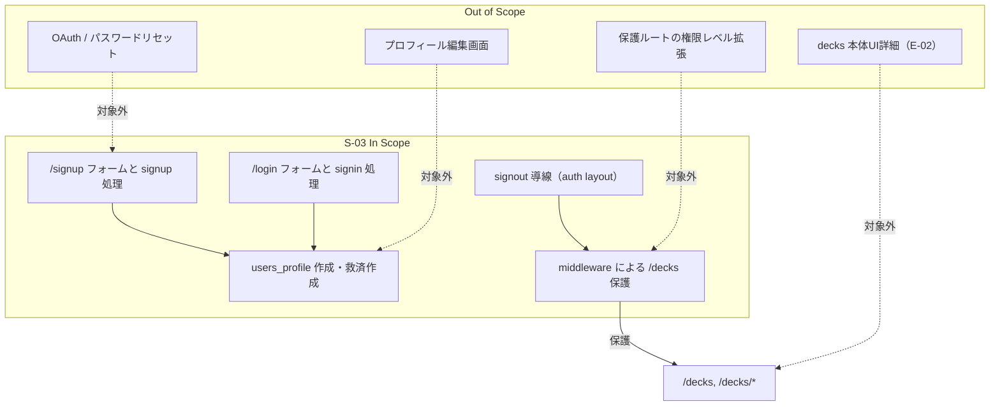
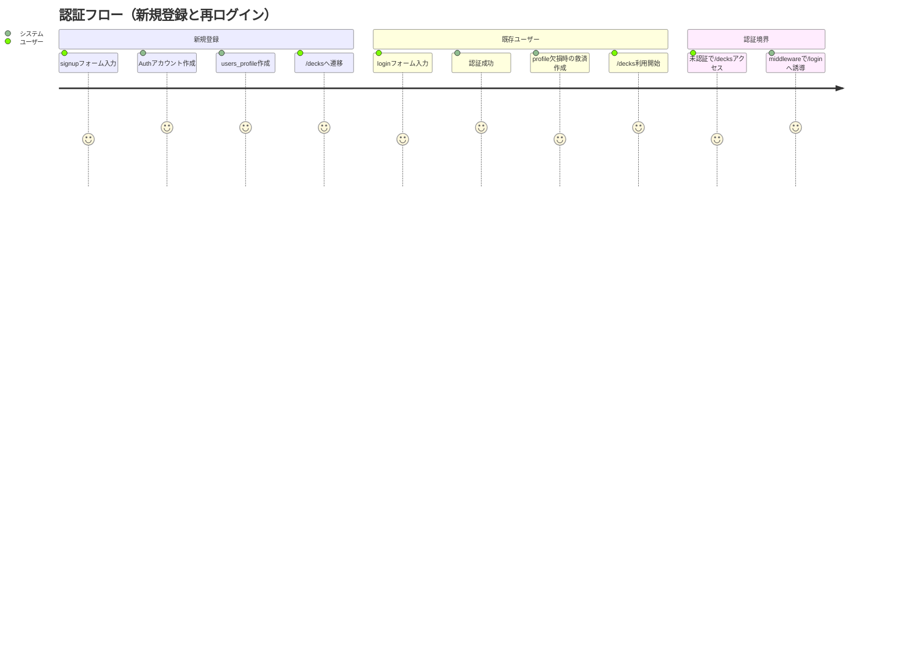

# 要件定義書: authentication-flow

## 1. 概要

### 1行要約
Supabase Auth（メール/パスワード）による認証フローを導入し、`/decks` 配下を認証済みユーザーのみに制限する。

### 背景
E-01 では、後続ストーリーの学習機能を実装する前に、ユーザーごとのデータ分離と認証ゲートが必須となる。
本ストーリーは、サインアップ/ログイン/ログアウト、認証ミドルウェア、`users_profile` の整合性補完を定義し、RLS 前提の安全な利用基盤を確立する。

## 2. ユーザーストーリー

### プライマリーユーザー
- 学習アプリ利用者（メールアドレスとパスワードで継続利用したい）
- 開発者（認証境界を明確に保ち、後続機能を安全に実装したい）

### ユーザーストーリー
```
As a learner
I want to sign up, sign in, and sign out with email/password
So that I can access only my own deck area securely
```

### ユースケース
1. 新規ユーザーが `/signup` でアカウント作成し、`users_profile` 作成後に `/decks` へ遷移する。
2. 既存ユーザーが `/login` で認証し、`/decks` へ遷移する。
3. サインアップ時にプロフィール作成が失敗した場合、Auth アカウントは保持され、ユーザーへエラーを表示する。
4. ログイン時に `users_profile` 欠損が検知された場合、自動救済作成して利用継続できる。
5. 未認証ユーザーが `/decks` 系URLへアクセスした場合、`/login` へリダイレクトされる。

## 3. 要件

### Must（必須）
- Supabase Auth の email/password 方式で、`signup` / `signin` / `signout` を提供する。
- `/signup` で `display_name`、`email`、`password` を入力できる。
- サインアップ時バリデーションを満たす。
  - `email`: 必須、メール形式
  - `password`: 必須、8文字以上
  - `display_name`: 必須、1〜20文字
- MVP環境では Supabase Auth の `Enable email confirmations` を OFF とし、signup成功時はメール確認待ちなしでセッション確立の上 `/decks` へ遷移する。
- サインアップ成功時は Auth ユーザー作成後に `users_profile` を作成し、以下の値を保持する。
  - `user_id`: AuthユーザーID
  - `display_name`: 入力値
  - `timezone`: `Asia/Tokyo`
- サインアップで `users_profile` 作成に失敗した場合、Auth 作成済みであることを前提にエラーを表示し、成功扱いで遷移しない。
- `/login` で `email`、`password` による認証を行い、成功時 `/decks` へ遷移する。
- ログイン時に `users_profile` が存在しない場合、救済作成を冪等に実行してから `/decks` へ遷移する（同一 `user_id` で重複作成しない）。
- Next.js Middleware で認証状態を検証し、`/decks` 配下を保護する。
  - 未認証で `/decks` または `/decks/*` へアクセスした場合、`/login` へリダイレクト
  - 認証済みで `/login` または `/signup` へアクセスした場合、`/decks` へリダイレクト
  - 公開ルート `/` は認証状態に関わらず表示可能とする
  - matcher で `/_next/static`, `/_next/image`, `/favicon.ico` を除外する
- 認証済みルートとして `app/(auth)/layout.tsx` を利用し、ヘッダーにアプリ名「まいにち漢字」とログアウト導線を持つ。
- `/login` と `/signup` はモバイル優先UIで提供する（フォームコンテナ `max-width: 28rem`、入力/ボタン高さ 48px 以上、プライマリボタン `width: 100%`）。
- エラーメッセージをフォーム上部に表示し、以下のユーザー向け文言方針を満たす。
  - 重複メール、パスワード要件不足、認証失敗、signupサーバーエラー、loginサーバーエラーを識別表示する。

### Should（望ましい）
- 送信中は二重送信防止（ボタン無効化、ローディング表示）を行う。
- ログイン/サインアップ間の導線リンクを常に表示する。

### Could（あるとよい）
- パスワード表示切替など、入力ミス低減UIを提供する。
- エラーメッセージに再試行ガイド（例: 時間をおいて再実行）を付与する。

### Won’t（対象外）
- OAuth（Google/Apple等）ログイン導入。
- パスワードリセット、メール認証フローの実装。
- `app/(auth)/decks/page.tsx` の本格UI実装（E-02対象）。
- 保護ルートの追加拡張（`/decks` 配下以外）。

### MVP / Future 要件マッピング
| 領域 | MVP（本ストーリー） | Future（対象外） |
|---|---|---|
| 認証方式 | Supabase Auth email/password | OAuth、Magic Link |
| 保護範囲 | `/decks` 配下、`/login`/`/signup` の認証済みリダイレクト | 役割別アクセス制御、保護ルート拡張 |
| プロフィール整合性 | signup時作成 + login時救済作成 | プロフィール編集画面、タイムゾーン設定UI |
| 画面 | `/login` `/signup` のモバイル優先フォーム | 多言語化、高度なアクセシビリティ改善 |

## 4. 非機能要件

### セキュリティ
- パスワード平文はアプリ永続化しない（Supabase Auth 管理）。
- セッションCookieは Supabase/Next.js の安全設定（HttpOnly, Secure, SameSite）を前提として扱う。
- Middleware と RLS 前提の二重境界で未認証アクセスを抑止する。
- `signUp` / `signIn` / `signOut` は Next.js Server Actions で実装し、Next.js ビルトインの CSRF 保護を利用する。

### 信頼性
- サインアップ成功後のプロフィール作成失敗をユーザーへ明示し、次回ログイン時救済で復旧できること。
- ログイン救済作成は再実行可能で、既存プロフィールを破壊しないこと。

### パフォーマンス
- 認証判定およびリダイレクトは通常操作で体感遅延が目立たないこと（目安: 1秒以内）。
- モバイル端末でフォーム操作時にレイアウト崩れが発生しないこと。

### 保守性
- 認証アクション（signup/signin/signout）と middleware 責務を分離し、挙動変更時の影響範囲を限定する。
- エラーメッセージ方針を統一し、UX上の差異を最小化する。

## 5. 成功指標

### 定量的指標
1. 新規サインアップ成功ケースの100%で、`users_profile.timezone='Asia/Tokyo'` が作成されること。
2. サインアップ時プロフィール作成失敗ケースで、100%エラーメッセージが表示され、Authユーザーは残存すること。
3. `users_profile` 欠損ユーザーのログイン時、救済作成成功率が100%であること。
4. 未認証で `/decks` 系にアクセスした場合、100% `/login` にリダイレクトされること。
5. 認証済みで `/login` `/signup` へアクセスした場合、100% `/decks` にリダイレクトされること。

### 定性的指標
1. ユーザーが迷わず「登録→ログイン→ログアウト」の基本フローを完了できること。
2. 開発者が要件書のみで、プロフィール作成の失敗時救済戦略を説明できること。

## 6. スコープ境界図



## 7. ユーザージャーニー



## 8. 制約・前提（Assumptions）
- A1. AC成立条件として、MVP環境の Supabase Auth 設定 `Enable email confirmations` を OFF に固定する。
- A2. `Enable email confirmations` が ON の環境では signup直後の `/decks` 遷移が成立しないため、本要件の即時遷移ACは適用外とする（環境依存リスク）。
- A3. ログイン救済で `display_name` の元データがない場合は、Authの `user_metadata.display_name` を優先し、なければメールローカル部を暫定値として使用する。
- A4. `users_profile.user_id` は一意であり、救済作成は重複作成を起こさないUpsert相当の挙動を前提とする。
- A5. タイムゾーンは本ストーリーでは常に `Asia/Tokyo` 固定とし、ユーザー編集機能は扱わない。
- A6. UI評価対象はモバイル優先（幅320〜430px相当）を基準とする。

## 9. リスクと対策

| リスク | 影響度 | 発生確率 | 軽減策 |
|---|---|---|---|
| 環境で `Enable email confirmations` が ON になり、signup直後の `/decks` 遷移が成立しない | 高 | 中 | MVP環境のAuth設定を OFF に固定し、デプロイ時チェック項目に含める |
| Auth成功後に profile 作成が失敗し、ユーザーが利用不能に見える | 高 | 中 | エラー文言で「アカウント作成済み」を明示し、次回ログイン救済を必須化 |
| middleware の matcher 漏れで保護対象がすり抜ける | 高 | 低 | `/decks` と `/decks/*` を要件で固定し、受入条件で検証する |
| 救済作成処理が非冪等で重複レコードエラーを誘発する | 中 | 中 | `user_id` 一意前提の冪等設計（既存時は更新/スキップ）を要件化する |
| モバイルUIで入力操作性が不足し、離脱率が高まる | 中 | 中 | 最小48pxタップ領域、全幅ボタン、フォーム最大幅制約を要件に含める |

## 10. 受入条件（測定可能）
1. AC#1: `/signup` で `display_name`（1〜20文字）、`email`（メール形式）、`password`（8文字以上）の入力検証が行われる。
2. AC#2: AC成立前提として、MVP環境の Supabase Auth 設定 `Enable email confirmations` が OFF である。
3. AC#3: `Enable email confirmations` が OFF の前提下で、サインアップ成功時はメール確認なしでセッション確立し、`/decks` へ遷移する。
4. AC#4: サインアップ成功時、Authユーザー作成後に `users_profile` が `display_name` と `timezone='Asia/Tokyo'` で作成される。
5. AC#5: サインアップ時に `users_profile` 作成が失敗した場合、画面上に失敗メッセージを表示し、Authユーザーは削除されない。
6. AC#6: メール重複時に「このメールアドレスは既に登録されています」を表示する。
7. AC#7: パスワード要件不足時に「パスワードは8文字以上で入力してください」を表示する。
8. AC#8: signup処理でサーバーエラーが発生した場合、「アカウントの作成に失敗しました。もう一度お試しください」を表示する。
9. AC#9: `/login` で認証成功時、`/decks` へ遷移する。
10. AC#10: `/login` で認証失敗時、「メールアドレスまたはパスワードが正しくありません」を表示する。
11. AC#11: login処理でサーバーエラーが発生した場合、「ログインに失敗しました。もう一度お試しください」を表示する。
12. AC#12: `/login` と `/signup` のフォームコンテナは `max-width: 28rem` 以下、入力/ボタンは高さ48px以上、プライマリボタンは `width: 100%` を満たす。
13. AC#13: ログイン成功時に `users_profile` 欠損を検知した場合、救済作成後に `/decks` 遷移できる。
14. AC#14: `users_profile` 救済作成は冪等であり、同一 `user_id` でログイン救済を再実行してもレコード数は1件のままである。
15. AC#15: 未認証ユーザーが `/decks` および `/decks/*` にアクセスすると、`/login` へリダイレクトされる。
16. AC#16: 認証済みユーザーが `/login` または `/signup` にアクセスすると、`/decks` へリダイレクトされる。
17. AC#17: 公開ルート `/` は認証有無に関わらず閲覧でき、`/login` や `/decks` への強制リダイレクトは発生しない。
18. AC#18: middleware の matcher で `/_next/static/*`、`/_next/image/*`、`/favicon.ico` が除外され、これらへのリクエストで認証リダイレクトが発生しない。
19. AC#19: `app/(auth)/layout.tsx` にアプリ名「まいにち漢字」とログアウト導線があり、ログアウト実行後 `/login` へ遷移する。
20. AC#20: `signUp` / `signIn` / `signOut` が Next.js Server Actions として実装され、フォーム経由実行でビルトインCSRF保護を利用する。

## 11. 参考資料
- `specs/epics/E-01-project-foundation-auth/epic.md`
- `specs/stories/S-03-authentication-flow/story.md`
- `specs/stories/S-01-project-scaffolding/requirements.md`
- `specs/stories/S-02-database-schema-rls/requirements.md`

## 12. 変更履歴

| 日付 | 版 | 変更内容 | 作成者 |
|---|---|---|---|
| 2026-02-23 | 1.1.0 | document-reviewer指摘反映（サーバーエラーAC追加、email verification前提固定、救済作成冪等性Must化、UI/ルート測定具体化、CSRF要件明記） | Codex |
| 2026-02-23 | 1.0.0 | 初版作成 | Codex |
