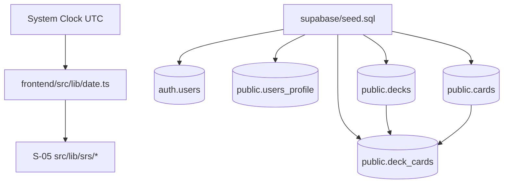
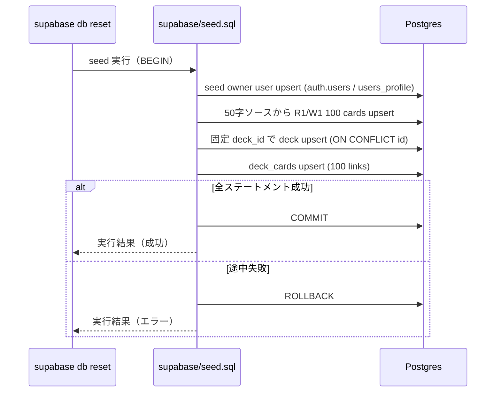

# Seed データ & 共通ユーティリティ Design Document

## 改訂履歴

- 2026-02-24 v1.1.0: Seed 原子性、`decks` 冪等戦略、`auth.users` 必須列、ロールバック統合テスト観点を追記

## 概要

S-04 では、後続の SRS ロジック（S-05）と学習導線の初期動作確認を成立させるために、JST 日付ユーティリティと Seed データ投入基盤を追加する。  
具体的には `frontend/src/lib/date.ts` の純粋関数群と `supabase/seed.sql` の冪等 Seed 処理を定義し、`cards / decks / deck_cards` の初期データを再現可能にする。

## 背景とコンテキスト

### 仕様優先順位

- 最優先: `specs/stories/S-04-seed-data-and-utilities/story.md`
- 準拠: `specs/epics/E-01-project-foundation-auth/epic.md`
- 参照: `specs/stories/S-05-srs-engine/story.md`（`getTomorrowJST(today)` 呼び出し前提）

### ADR 作成判定

- 判定: **ADR 新規作成なし**
- 理由:
  - 変更規模は中規模（想定 4 ファイル）で、`.claude/steering/documentation-criteria.md` の「3-5ファイル = Design Doc 推奨」に該当
  - 新規外部依存導入、アーキテクチャ層再編、既存 ADR の前提を覆す設計変更がない
  - 既存 ADR-001/002 の方針内（環境変数管理・RLS 境界）で完結可能

### 前提となる ADR

- `specs/adr/ADR-001-project-foundation-supabase-clients.md`
  - 環境変数フェイルファスト方針
- `specs/adr/ADR-002-database-schema-rls-access-boundary.md`
  - `cards` public read と `decks/deck_cards` owner scoped の境界

### 合意事項チェックリスト

#### スコープ
- [x] JST 日付ユーティリティ 4 関数（`getTodayJST`, `getTomorrowJST`, `addDaysJST`, `isBeforeOrEqualJST`）
- [x] 小3漢字 MVP Seed（50字固定、R1/W1 の 100 枚）
- [x] デフォルトデッキ 1 件作成と `deck_cards` 全紐付け
- [x] Seed の冪等化（再実行で重複しない）

#### 非スコープ
- [x] SRS 計算ロジック本体（S-05 で実装）
- [x] 学習画面 UI 実装（E-02 で実装）
- [x] Seed データの全 200 字完全網羅（MVP 以降）

#### 制約
- [x] 外部日付ライブラリ（dayjs など）は導入しない
- [x] 既存 RLS 方針（`cards` public read、`decks/deck_cards` owner scoped）を変更しない
- [x] Seed は `supabase db reset` で再現可能な形を優先する
- [x] Seed DML は単一トランザクションで実行し、途中失敗時は全件ロールバックする

### openQuestions のデフォルト方針（解消）

1. **seed 対象漢字選定**
   - デフォルト: MVP は **50 字固定**（`SEED_KANJI_MVP_50`）とし、`supabase/seed.sql` の `VALUES` を単一の正とする。
   - 1字につき「代表語 1 件 + 読み 1 件」を持ち、R1/W1 の 2 枚を生成する。

2. **deck `owner_user_id` 方針**
   - デフォルト: Seed 専用 owner を固定 UUID（`SEED_OWNER_USER_ID=00000000-0000-4000-8000-000000000001`）で upsert し、デッキは固定 UUID（`SEED_DECK_ID=00000000-0000-4000-8000-0000000000d4`）を採用する。
   - `decks` は `INSERT ... VALUES (SEED_DECK_ID, ...) ON CONFLICT (id) DO UPDATE ...` で 1 行を維持する。
   - 理由: `decks.owner_user_id` が `NOT NULL + FK(auth.users)` のため、固定 owner と固定 deck_id を持たない方式では `supabase db reset` 直後の再現性と AC-11（件数不増）を満たせない。

3. **`getTomorrowJST` シグネチャ**
   - デフォルト: `getTomorrowJST(baseDate?: string): string`
   - 仕様: `baseDate` 省略時は `getTodayJST()` を基準に翌日を返し、指定時は `addDaysJST(baseDate, 1)` を返す。
   - 理由: `story.md` の単純利用と、S-05 の `getTomorrowJST(today)` 想定の両立。

4. **seed 実装方式**
   - デフォルト: **`supabase/seed.sql` を採用**（S-04 では `scripts/seed.ts` を採用しない）。
   - 理由: `supabase db reset` への自動統合と依存追加最小化を優先する。

### Seed 実行の原子性（AC-12 トレース）

- `supabase/seed.sql` の DML は `BEGIN;` から開始し、すべて成功した場合のみ `COMMIT;` する。
- 途中で 1 ステートメントでも失敗した場合はトランザクションを `ROLLBACK;` し、`cards/decks/deck_cards/users_profile` を部分反映しない。
- この設計は AC-12（不測型）の「部分成功状態を隠蔽しない」を、**「部分成功自体を発生させない」**形で実装トレースする。

## 解決する問題

- JST 基準日付計算が未実装で、`due_date` 判定や翌日計算の共通基盤がない。
- S-02 でスキーマは整備済みだが、カード・デッキ初期データがなく E-02 開発を即時開始できない。
- Seed 再実行時の重複や owner 不整合が発生すると、RLS 前提の検証が不安定になる。

## 要件

### 機能要件

- `frontend/src/lib/date.ts` に JST ユーティリティ 4 関数を実装する。
- `supabase/seed.sql` で小3漢字 50 字の R1/W1 カード（計 100 枚）を投入する。
- Seed 専用 owner と `users_profile` を upsert し、デフォルトデッキを 1 件作成する。
- `deck_cards` に全 Seed カードを紐付ける。
- Seed 再実行時に件数が増殖しないこと（冪等）。
- Seed DML 一式を単一トランザクション化し、失敗時に全ロールバックする。

### 非機能要件

- **信頼性**: Seed 2 回実行後も `cards/decks/deck_cards` 件数が一定で、途中失敗時に部分反映が残らない。
- **保守性**: Seed データソースを `supabase/seed.sql` に一元化し、分散定義を避ける。
- **テスタビリティ**: 日付関数は固定入力で再現可能にし、UTC/JST 境界ケースを unit test で検証可能にする。
- **セキュリティ**: RLS ルールは S-02 の定義を維持し、Seed で境界を緩めない。

## 受入条件（EARS）

- AC-01（遍在型）: システムは `frontend/src/lib/date.ts` で `getTodayJST`, `getTomorrowJST`, `addDaysJST`, `isBeforeOrEqualJST` を export すること。
- AC-02（契機型）: UTC `2026-02-23T15:00:00Z` 相当入力で `getTodayJST` が実行されたとき、システムは `"2026-02-24"` を返すこと。
- AC-03（契機型）: `getTomorrowJST("2026-02-28")` が実行されたとき、システムは `"2026-03-01"` を返すこと。
- AC-04（契機型）: `addDaysJST("2026-12-31", 1)` が実行されたとき、システムは `"2027-01-01"` を返すこと。
- AC-05（契機型）: `isBeforeOrEqualJST("2026-02-24", "2026-02-23")` が実行されたとき、システムは `false` を返すこと。
- AC-06（不測型）: もし `addDaysJST` または `getTomorrowJST` に `YYYY-MM-DD` 形式でない値が渡された場合、システムは明示的な例外を送出し不正計算を継続しないこと。
- AC-07（遍在型）: システムは Seed 対象 50 字から R1/W1 の 2 枚ずつを作成し、`cards` に合計 100 枚を保持すること。
- AC-08（遍在型）: システムは Seed カードの `visibility='public'`、`owner_user_id IS NULL`、`card_key='{pattern}:{front_text}:{back_text}'` を満たすこと。
- AC-09（契機型）: Seed 実行イベントが発生したとき、システムは Seed owner（固定 UUID）と `users_profile` を upsert し、固定 `SEED_DECK_ID` の `decks` 行（`name='小学3年生の漢字'`, `new_limit_per_day=10`）を 1 件保持すること。
- AC-10（契機型）: Seed 実行イベントが発生したとき、システムはデフォルトデッキと全 Seed カードを `deck_cards` で紐付け、件数を 100 件にすること。
- AC-11（選択型）: もし Seed を再実行した場合、システムは `cards` を `ON CONFLICT (card_key) DO NOTHING`、`decks` を `ON CONFLICT (id)`、`deck_cards` を `ON CONFLICT (deck_id, card_id) DO NOTHING` で処理し、`cards/decks/deck_cards` の件数を増やさないこと。
- AC-12（不測型）: もし S-02 マイグレーション未適用または Seed 途中ステートメント失敗が発生した場合、システムは不足テーブル/制約エラーを返し、単一トランザクションをロールバックして部分成功状態を残さないこと。

## 既存コードベース分析

### 調査サマリ

- 既存コード上、`frontend/src/lib/date.ts` と `supabase/seed.sql` は未作成。
- S-02 で `cards/decks/deck_cards` の制約と RLS はすでに確定済み。
- S-05 ストーリーで `getTomorrowJST(today)` 呼び出しが想定されている。

### 実装ファイル候補（既存調査ベース）

| 種別 | パス | 役割 |
|---|---|---|
| 既存（参照） | `supabase/migrations/20260223000000_s02_schema_rls.sql` | Seed 先テーブル契約・RLS 境界の正 |
| 既存（参照） | `frontend/src/types/database.ts` | `cards/decks/deck_cards` の型契約確認 |
| 既存（参照） | `specs/stories/S-02-database-schema-rls/tests/helpers/s02-db-testkit.ts` | `auth.users` 生成時の必須列セット実績 |
| 既存（参照） | `specs/stories/S-05-srs-engine/story.md` | `getTomorrowJST` 呼び出し互換の前提 |
| 新規（実装） | `frontend/src/lib/date.ts` | JST 日付ユーティリティ |
| 新規（実装） | `frontend/src/lib/date.test.ts` | 日付ユーティリティ unit test |
| 新規（実装） | `supabase/seed.sql` | 50字×2枚カード + デフォルトデッキ Seed |
| 新規（実装） | `specs/stories/S-04-seed-data-and-utilities/tests/seed-data-and-utilities.int.test.ts` | Seed SQL の統合検証 |

### 統合境界の約束

- `date.ts` は純粋関数として実装し、DB や Next.js API に依存しない。
- Seed は `cards` を public カードとして投入し、`decks/deck_cards` は owner scoped のまま運用する。
- Seed owner ユーザーの生成/再利用は Seed SQL 内で完結し、手作業依存を持たない。

## 設計

### 実装アプローチ

- 方針: **ハイブリッド（ユーティリティ先行 + データ投入）**
1. `date.ts` / `date.test.ts` で JST 計算の純粋ロジックを先に固定
2. `seed.sql` で cards/deck/deck_cards のデータ構築を固定
3. 統合テストで Seed の冪等性と件数整合を確認

### 技術的依存関係と実装制約

1. `supabase/migrations/20260223000000_s02_schema_rls.sql` 適用後にのみ Seed を実行可能。
2. `getTomorrowJST(baseDate?: string)` は S-05 実装前に確定する必要がある。
3. Seed owner は `auth.users` の FK を満たす必要があり、owner 未確定で deck 作成を行わない。
4. `card_key` UNIQUE と `ON CONFLICT` を前提に冪等性を担保する。
5. Seed SQL の DML は単一トランザクション（`BEGIN`〜`COMMIT`）で実行し、失敗時はロールバックする。

### 変更影響マップ

```yaml
変更対象: date utility / seed SQL
直接影響:
  - frontend/src/lib/date.ts
  - frontend/src/lib/date.test.ts
  - supabase/seed.sql
  - specs/stories/S-04-seed-data-and-utilities/tests/seed-data-and-utilities.int.test.ts
間接影響:
  - S-05 の dueDate 計算（getTomorrowJST, addDaysJST 依存）
  - E-02 のデッキ一覧/学習開始時の初期データ可用性
波及なし:
  - 認証フロー（S-03）の画面遷移ロジック
  - RLS ポリシー定義そのもの（S-02）
```

### アーキテクチャ概要



### データフロー



### Seed SQL 詳細戦略（`auth.users` / `decks` / 原子性）

#### 1. `auth.users` upsert の必須列セットと値方針

`specs/stories/S-02-database-schema-rls/tests/helpers/s02-db-testkit.ts` の実績に合わせ、Seed owner 行は以下を `ON CONFLICT (id)` で upsert する。

| 列名 | 値方針 |
|---|---|
| `id` | `SEED_OWNER_USER_ID`（固定 UUID） |
| `instance_id` | `'00000000-0000-0000-0000-000000000000'::uuid` |
| `aud` | `'authenticated'` |
| `role` | `'authenticated'` |
| `email` | `'seed-owner@example.local'`（固定） |
| `encrypted_password` | `'seed-owner-not-for-login'`（Seed 専用固定文字列） |
| `email_confirmed_at` | `now()` |
| `raw_app_meta_data` | `'{"provider":"email","providers":["email"]}'::jsonb` |
| `raw_user_meta_data` | `'{"display_name":"Seed Owner"}'::jsonb` |
| `created_at` | 初回 `now()` |
| `updated_at` | 毎回 `now()` |

#### 2. `decks` 冪等戦略（AC-11 トレース）

- `SEED_DECK_ID` を固定し、`INSERT INTO public.decks (id, owner_user_id, name, new_limit_per_day) ... ON CONFLICT (id) DO UPDATE SET ...` を採用する。
- これにより Seed 再実行時も deck 行は 1 件のまま維持される。
- `deck_cards` は `ON CONFLICT (deck_id, card_id) DO NOTHING`、`cards` は `ON CONFLICT (card_key) DO NOTHING` を採用し、関連行の件数増加を防ぐ。

#### 3. 単一トランザクション戦略（AC-12 トレース）

- `BEGIN` 後に `auth.users -> users_profile -> cards -> decks -> deck_cards` の順で DML を実行する。
- 1 つでも失敗した場合は `ROLLBACK` で全変更を破棄する。
- `COMMIT` は全件成功時のみ実行する。

### インターフェース変更マトリクス

| 区分 | インターフェース | 変更種別 | 変換必要性 | 互換性確保 |
|---|---|---|---|---|
| 新規 | `getTodayJST(now?: Date): string` | 追加 | なし | 引数省略を許容 |
| 新規 | `getTomorrowJST(baseDate?: string): string` | 追加 | なし | `getTomorrowJST()` と `getTomorrowJST(today)` の両対応 |
| 新規 | `addDaysJST(baseDate: string, days: number): string` | 追加 | なし | `YYYY-MM-DD` 契約を明示 |
| 新規 | `isBeforeOrEqualJST(date: string, target: string): boolean` | 追加 | なし | 文字列比較契約を固定 |
| 新規 | `supabase/seed.sql` | 追加 | なし | `ON CONFLICT` で再実行互換を担保 |

### データ契約

```yaml
入力:
  - seed source rows:
      columns: [kanji, vocab, reading]
      cardinality: 50
  - seed owner:
      user_id: fixed UUID
      email: seed-owner@example.local
      auth_users_required_columns:
        - id
        - instance_id
        - aud
        - role
        - email
        - encrypted_password
        - email_confirmed_at
        - raw_app_meta_data
        - raw_user_meta_data
        - created_at
        - updated_at
  - seed deck:
      deck_id: fixed UUID
  - date inputs:
      baseDate: YYYY-MM-DD
      now: Date (optional)

出力:
  - cards:
      rows: 100
      constraints:
        - visibility = public
        - owner_user_id = null
        - card_key unique
  - decks:
      rows: 1 (seed default)
      attributes:
        - name = 小学3年生の漢字
        - new_limit_per_day = 10
  - deck_cards:
      rows: 100
  - date utility return:
      format: YYYY-MM-DD

不変条件:
  - cards/decks/deck_cards は seed 再実行で重複しない
  - getTomorrowJST(baseDate) == addDaysJST(baseDate, 1)
  - S-02 RLS 境界は変更しない
  - seed 途中失敗時は transaction rollback で部分反映を残さない
```

### 統合点一覧

| 統合点 | 場所 | 旧実装 | 新実装 | 切り替え方法 |
|---|---|---|---|---|
| JST 日付計算 | `frontend/src/lib/date.ts` | 該当なし | 4 関数追加 | `@/lib/date` import で利用開始 |
| SRS 連携 | `specs/stories/S-05-srs-engine/story.md` 想定 | 未実装 | `getTomorrowJST(today)` 契約を確定 | S-05 実装時に直接呼び出し |
| Seed 実行 | `supabase/seed.sql` | 未実装 | SQL seed pipeline 追加 | `supabase db reset` で自動実行 |
| DB 契約 | S-02 migration | 既存 7 テーブル | 既存契約を利用してデータ投入 | スキーマ変更なし |

### 統合ポイントでの E2E 確認手順

1. `supabase db reset` を実行し、migration + seed の完走を確認する。
2. SQL で以下を確認する。
   - `cards` の Seed 件数が 100
   - `decks` の Seed デッキが 1
   - `deck_cards` が 100
3. 同コマンドを再実行し、件数が増加しないことを確認する。
4. 意図的に Seed 中盤で失敗するテストケース（例: 不正 FK 行を一時注入）を実行し、ロールバック後に `cards/decks/deck_cards/users_profile` の件数が実行前と一致することを確認する。
5. `frontend/src/lib/date.test.ts` を実行し、UTC/JST 境界・月跨ぎ・年跨ぎが全て成功することを確認する。

## リスクと対策

| リスク | 影響 | 対策 |
|---|---|---|
| Seed owner の認証情報運用が曖昧 | デッキ可視化不能 | Seed owner の email/password 方針を S-04 実装時に固定し、README/plan に明記 |
| 50字データの表記ゆれ（同音異表記） | `card_key` 重複や品質低下 | `vocab + reading` の一意性レビューを実装前に実施 |
| 日付入力の不正形式 | due 計算バグ | 不正入力時は例外送出（Fail-Fast） |

## 完了判定

- EARS AC-01〜AC-12 を満たす実装とテストが存在する。
- `supabase db reset` の再実行でデータ件数が安定している。
- S-05 で想定される `getTomorrowJST(today)` 呼び出し互換が保たれている。
