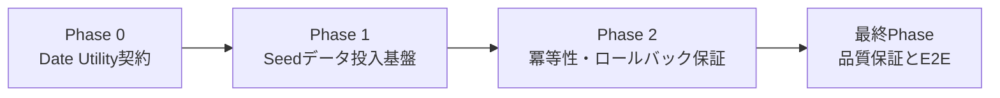
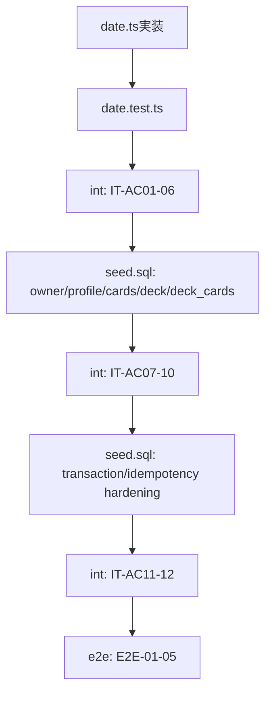

# 作業計画書: seed-data-and-utilities

作成日: 2026-02-24
種別: feature
想定影響範囲: JST日付ユーティリティ + Supabase seed SQL + S-04ストーリーテスト
関連Issue/PR: 未設定

## 関連ドキュメント
- ADR: `specs/adr/ADR-001-project-foundation-supabase-clients.md`
- ADR: `specs/adr/ADR-002-database-schema-rls-access-boundary.md`
- Story: `specs/stories/S-04-seed-data-and-utilities/story.md`
- Design Doc: `specs/stories/S-04-seed-data-and-utilities/design.md`
- 統合テスト骨子: `specs/stories/S-04-seed-data-and-utilities/tests/seed-data-and-utilities.int.test.ts`
- E2Eテスト骨子: `specs/stories/S-04-seed-data-and-utilities/tests/seed-data-and-utilities.e2e.test.ts`

## 目的
S-05 の SRS 計算で再利用する JST 日付ユーティリティを先行実装し、同時に `supabase db reset` で再現可能な Seed 基盤（50字×R1/W1、固定 owner/deck、冪等・ロールバック保証）を成立させる。

## 計画ルール（必須反映）
- [ ] 統合テスト `specs/stories/S-04-seed-data-and-utilities/tests/seed-data-and-utilities.int.test.ts` は各Phase実装と同時に `it.todo` を実装し、同じPhase内で実行・合格させる
- [ ] E2Eテスト `specs/stories/S-04-seed-data-and-utilities/tests/seed-data-and-utilities.e2e.test.ts` は全実装完了後の最終Phaseでのみ実行する

## 影響範囲
### 対象ファイル
- [x] `frontend/src/lib/date.ts`
- [x] `frontend/src/lib/date.test.ts`
- [ ] `supabase/seed.sql`
- [x] `specs/stories/S-04-seed-data-and-utilities/tests/seed-data-and-utilities.int.test.ts`
- [ ] `specs/stories/S-04-seed-data-and-utilities/tests/seed-data-and-utilities.e2e.test.ts`

### テストファイル
- [x] `frontend/src/lib/date.test.ts`
- [x] `specs/stories/S-04-seed-data-and-utilities/tests/seed-data-and-utilities.int.test.ts`
- [ ] `specs/stories/S-04-seed-data-and-utilities/tests/seed-data-and-utilities.e2e.test.ts`

## フェーズ構成

### フェーズ構成図

### タスク依存関係図

### フェーズ依存関係
- [x] Phase 1 着手条件: Phase 0 の AC-01〜AC-06 が統合テストで合格している
- [ ] Phase 2 着手条件: Phase 1 の AC-07〜AC-10 が統合テストで合格している
- [ ] 最終Phase 着手条件: Phase 0〜2 の実装・単体テスト・統合テストがすべて完了している

### Phase 0: Date Utility契約（想定コミット数: 1）
**目的**: JST日付ユーティリティ4関数と fail-fast 契約を固定し、S-05 の呼び出し前提を満たす。

#### タスク
- [x] `getTodayJST`, `getTomorrowJST(baseDate?: string)`, `addDaysJST`, `isBeforeOrEqualJST` を実装する
  - 実装: `frontend/src/lib/date.ts`
  - テスト: `frontend/src/lib/date.test.ts`
- [x] UTC/JST 境界・月跨ぎ・年跨ぎ・比較・不正入力例外の unit test を実装する
  - 実装: `frontend/src/lib/date.test.ts`
- [x] 統合テスト（Phase 0対象）を実装・実行する
  - テスト: `specs/stories/S-04-seed-data-and-utilities/tests/seed-data-and-utilities.int.test.ts`
  - 対象: `IT-AC01`, `IT-AC02`, `IT-AC03`, `IT-AC04`, `IT-AC05`, `IT-AC06`

#### フェーズ完了条件（Design AC由来）
- [x] AC-01: `date.ts` で4関数が export される
- [x] AC-02: UTC `2026-02-23T15:00:00Z` 相当入力で `getTodayJST()` が `2026-02-24` を返す
- [x] AC-03: `getTomorrowJST("2026-02-28")` が `2026-03-01` を返す
- [x] AC-04: `addDaysJST("2026-12-31", 1)` が `2027-01-01` を返す
- [x] AC-05: `isBeforeOrEqualJST("2026-02-24", "2026-02-23")` が `false` を返す
- [x] AC-06: 不正日付入力時に明示的例外を送出し計算を継続しない

#### 動作確認手順
1. `frontend/src/lib/date.test.ts` を実行して境界ケースがすべて成功することを確認する。
2. `seed-data-and-utilities.int.test.ts` の `IT-AC01`〜`IT-AC06` を実装し、同Phase内で実行して合格を確認する。
3. `getTomorrowJST()` と `getTomorrowJST("2026-02-28")` の両シグネチャが成立することを確認する。

#### 停止ポイント（品質固定）
- [x] Phase 0 対象統合テストがPASSした状態を保存する

### Phase 1: Seedデータ投入基盤（想定コミット数: 1-2）
**目的**: 50字×R1/W1カード、固定 owner/profile、固定 deck、deck_cards 紐付けを seed 一発で再現可能にする。

#### タスク
- [ ] Seed専用の固定UUID（owner/deck）と 50 字データソースを定義する
  - 実装: `supabase/seed.sql`
  - テスト: `specs/stories/S-04-seed-data-and-utilities/tests/seed-data-and-utilities.int.test.ts`
- [ ] `cards` へ R1/W1 計100枚を投入し、`card_key="{pattern}:{front_text}:{back_text}"` 契約を実装する
  - 実装: `supabase/seed.sql`
  - テスト: `specs/stories/S-04-seed-data-and-utilities/tests/seed-data-and-utilities.int.test.ts`
- [ ] `auth.users` / `users_profile` upsert、`decks` 固定ID upsert、`deck_cards` 100件紐付けを実装する
  - 実装: `supabase/seed.sql`
  - テスト: `specs/stories/S-04-seed-data-and-utilities/tests/seed-data-and-utilities.int.test.ts`
- [ ] 統合テスト（Phase 1対象）を実装・実行する
  - テスト: `specs/stories/S-04-seed-data-and-utilities/tests/seed-data-and-utilities.int.test.ts`
  - 対象: `IT-AC07`, `IT-AC08`, `IT-AC09`, `IT-AC10`

#### フェーズ完了条件（Design AC由来）
- [ ] AC-07: Seed対象50字から R1/W1 の 100 cards が投入される
- [ ] AC-08: Seed cards が `visibility='public'`、`owner_user_id IS NULL`、`card_key` 形式契約を満たす
- [ ] AC-09: Seed owner/profile upsert と固定 `SEED_DECK_ID` の deck 1件維持が成立する
- [ ] AC-10: Seed deck と全 Seed cards の `deck_cards` が 100 件になる

#### 動作確認手順
1. `supabase db reset` 後に `cards/decks/deck_cards/users_profile/auth.users` を照会し件数・属性を確認する。
2. `seed-data-and-utilities.int.test.ts` の `IT-AC07`〜`IT-AC10` を同Phase内で実装・実行し合格させる。
3. Seedデッキ `name='小学3年生の漢字'` と `new_limit_per_day=10` を確認する。

#### 停止ポイント（品質固定）
- [ ] Phase 1 対象統合テストがPASSした状態を保存する

### Phase 2: 冪等性・ロールバック保証（想定コミット数: 1）
**目的**: Seed再実行の件数不増と、失敗時の全ロールバックを実証して AC-11/12 を確定する。

#### タスク
- [ ] `supabase/seed.sql` を単一トランザクション（`BEGIN`〜`COMMIT`）で実行し、失敗時 `ROLLBACK` を保証する
  - 実装: `supabase/seed.sql`
  - テスト: `specs/stories/S-04-seed-data-and-utilities/tests/seed-data-and-utilities.int.test.ts`
- [ ] `cards/decks/deck_cards` の `ON CONFLICT` 戦略を完成させ、再実行時の件数不増を保証する
  - 実装: `supabase/seed.sql`
  - テスト: `specs/stories/S-04-seed-data-and-utilities/tests/seed-data-and-utilities.int.test.ts`
- [ ] 統合テスト（Phase 2対象）を実装・実行する
  - テスト: `specs/stories/S-04-seed-data-and-utilities/tests/seed-data-and-utilities.int.test.ts`
  - 対象: `IT-AC11`, `IT-AC12`
- [ ] 統合テストを全件再実行して退行がないことを確認する
  - テスト: `specs/stories/S-04-seed-data-and-utilities/tests/seed-data-and-utilities.int.test.ts`

#### フェーズ完了条件（Design AC由来）
- [ ] AC-11: Seed再実行後も `cards/decks/deck_cards` 件数が増えない
- [ ] AC-12: migration不足または途中失敗時に明示的エラー + 全ロールバックで部分成功を残さない

#### 動作確認手順
1. Seed を2回実行し、`cards/decks/deck_cards` 件数差分が 0 であることを確認する。
2. 失敗条件を注入した実行でエラーを確認し、実行前後の件数が一致することを確認する。
3. `seed-data-and-utilities.int.test.ts` をフル実行し、`IT-AC01`〜`IT-AC12` がすべて合格することを確認する。

#### 停止ポイント（品質固定）
- [ ] Phase 2 対象統合テストがPASSした状態を保存する

---

### 最終Phase: 品質保証・E2E実行（必須）（想定コミット数: 1）
**目的**: 全ACの受入証跡を確定し、S-04 の実装完了を判定する。

#### タスク
- [ ] `seed-data-and-utilities.e2e.test.ts` の E2E-01〜E2E-05 を実装する
  - テスト: `specs/stories/S-04-seed-data-and-utilities/tests/seed-data-and-utilities.e2e.test.ts`
- [ ] 全実装完了後にのみ E2E を実行する（計画ルール準拠）
  - テスト: `specs/stories/S-04-seed-data-and-utilities/tests/seed-data-and-utilities.e2e.test.ts`
- [ ] 統合テストを全件実行して Phase 0〜2 の退行がないことを確認する
  - テスト: `specs/stories/S-04-seed-data-and-utilities/tests/seed-data-and-utilities.int.test.ts`
- [ ] frontend 品質ゲートを実行する
  - 対象: `frontend/src/lib/date.ts`, `frontend/src/lib/date.test.ts`
- [ ] Story / Design / 実装 / テストのトレーサビリティを整理する

#### フェーズ完了条件
- [ ] E2E-01〜E2E-05 がPASSする
- [ ] AC-01〜AC-12 がテスト結果で追跡可能である
- [ ] 統合テスト同時実施・E2E最終実施の運用ルールを満たしている

#### 動作確認手順
1. `seed-data-and-utilities.int.test.ts` をフル実行して全PASSを確認する。
2. `seed-data-and-utilities.e2e.test.ts` を実行し、date utility と seed 導線の通し検証を確認する。
3. frontend 側の型/静的検査/テストを実行し、品質ゲート通過を確認する。

## AC別完了チェックリスト
- [x] AC-01: `date.ts` の4関数 export（Phase 0 / Integration）
- [x] AC-02: UTC/JST 境界で `getTodayJST` 正常（Phase 0 / Unit + Integration）
- [x] AC-03: `getTomorrowJST("2026-02-28")` 月跨ぎ（Phase 0 / Unit + Integration）
- [x] AC-04: `addDaysJST("2026-12-31", 1)` 年跨ぎ（Phase 0 / Unit + Integration）
- [x] AC-05: `isBeforeOrEqualJST` 比較判定（Phase 0 / Unit + Integration）
- [x] AC-06: 不正日付入力 fail-fast（Phase 0 / Unit + Integration）
- [ ] AC-07: Seed cards 100件（Phase 1 / Integration）
- [ ] AC-08: Seed cards 属性・`card_key` 契約（Phase 1 / Integration）
- [ ] AC-09: owner/profile/deck upsert（Phase 1 / Integration）
- [ ] AC-10: deck_cards 100件紐付け（Phase 1 / Integration）
- [ ] AC-11: Seed再実行の冪等性（Phase 2 / Integration）
- [ ] AC-12: 失敗時ロールバック（Phase 2 / Integration + Final E2E）

## リスクと対策
- [ ] リスク: 50字データの語彙・読みの誤記で学習品質が下がる  
      対策: `supabase/seed.sql` のソース行をレビューし、`vocab + reading` 一意性チェックを統合テストに組み込む
- [ ] リスク: `auth.users` 必須列不足により Seed owner upsert が失敗する  
      対策: S-02 実績列セットに合わせて `seed.sql` を実装し、AC-09 テストで固定UUID行の存在を検証する
- [ ] リスク: `decks` の衝突戦略不足で再実行時に複数デッキが生成される  
      対策: `SEED_DECK_ID` 固定 + `ON CONFLICT (id) DO UPDATE` を必須化し、AC-11 で件数不増を保証する
- [ ] リスク: トランザクション漏れで部分成功データが残留する  
      対策: `BEGIN/COMMIT/ROLLBACK` を実装し、AC-12 の失敗注入テストで件数一致を確認する
- [ ] リスク: 統合テストの後追い実装で終盤に欠陥が集中する  
      対策: 各Phaseの停止ポイントを「対象統合テストPASS」に固定する
