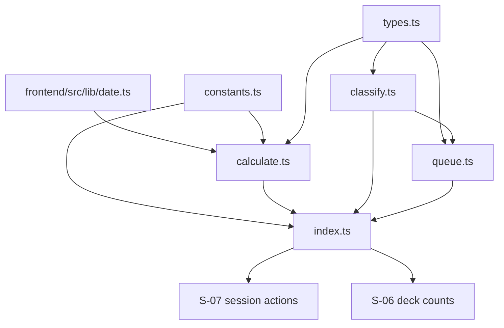
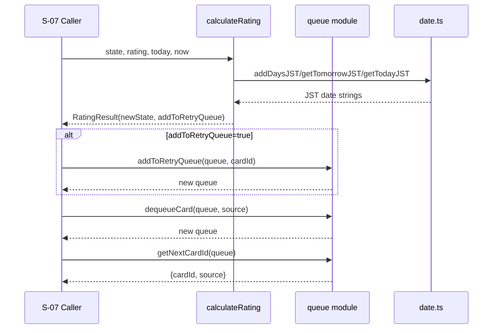

# SRS エンジン Design Document

## 概要

S-05 では、学習評価（`good/hard/again`）に応じた SRS 更新ロジックと、セッションキュー（`due -> learn -> new -> retry`）制御を `frontend/src/lib/srs/*` に純粋関数として実装する。  
本設計は `frontend/src/lib/date.ts` の JST ユーティリティに依存し、UI/DB/Server Actions から独立した決定論的ロジック契約を固定する。

## 背景とコンテキスト

### 仕様優先順位

- 最優先: `specs/stories/S-05-srs-engine/requirements.md`（AC#1〜#24）
- 準拠: `specs/adr/ADR-004-srs-engine.md`
- 参照: `specs/stories/S-05-srs-engine/story.md`, `specs/epics/E-02-core-study-flow/epic.md`

### 前提となる ADR

- `specs/adr/ADR-004-srs-engine.md`
  - `calculateRating(state, rating, today, now)` 4引数契約
  - `buildSessionQueue(cards, today, newLimit)` 3引数契約（TypeScript ルール例外を ADR で管理）
  - `retryTodayCount` の JST 日次リセット
  - `classifyCard: CardCategory | null`
  - `newLimit` 正規化（`floor -> clamp >= 0`, `NaN/無効値 -> 0`）
  - `dequeueCard` 空キュー no-op（内容不変 + 新規オブジェクト返却）
- `specs/adr/ADR-003-authentication-flow.md`
  - 型安全・テスト容易性を担保する pure logic の分離方針（間接参照）

### 合意事項チェックリスト

#### スコープ
- [x] `frontend/src/lib/srs/constants.ts` の固定値定義
- [x] `frontend/src/lib/srs/types.ts` の型契約定義
- [x] `frontend/src/lib/srs/calculate.ts` の評価ロジック実装
- [x] `frontend/src/lib/srs/classify.ts` の分類・集計実装
- [x] `frontend/src/lib/srs/queue.ts` のキュー構築・消化実装
- [x] `frontend/src/lib/srs/index.ts` のバレルエクスポート
- [x] `frontend/src/lib/srs/*.test.ts` による単体テスト

#### 非スコープ
- [x] UI コンポーネント実装（S-06/S-07）
- [x] DB 永続化、Server Actions 実装（S-07）
- [x] 学習パターン拡張（R2/W2）

#### 制約
- [x] 実装対象は `frontend/src/lib/srs/*`（`frontend/src/lib/date.ts` を依存利用）
- [x] すべての公開関数は pure / immutable
- [x] `calculateRating` は位置引数4つ契約を維持
- [x] `buildSessionQueue` は位置引数3つ契約を維持（本ストーリーでは ADR 例外管理）
- [x] 日付判定は JST 基準（`today`, `dueDate` は `YYYY-MM-DD`）

## 解決する問題

- 評価ルールの実装差異（`good/hard/again`）を排除し、同入力同出力を保証する。
- セッション順序（`due -> learn -> new -> retry`）を固定し、学習体験のぶれを防ぐ。
- `again` 連発時の当日再提示を許容しつつ、無限ループを回避する。

## 要件

### 機能要件

- 固定テーブル `GOOD_INTERVALS`, `HARD_INTERVALS`, `RETRY_TODAY_LIMIT` を実装する。
- `calculateRating` / `getIntervalPreview` で SRS 更新と表示文言を提供する。
- `classifyCard` / `countByCategory` でカード分類・集計を提供する。
- `buildSessionQueue` / `getNextCardId` / `dequeueCard` / `addToRetryQueue` / `isSessionComplete` を提供する。

### 非機能要件

- **決定性**: 外部時刻取得に依存せず、同入力で常に同出力。
- **信頼性**: 境界値（level 範囲外、retry 上限、newLimit 異常値）でも仕様通りに動作。
- **性能**: `countByCategory`, `buildSessionQueue` は O(n)。
- **保守性**: 定数・型・計算・分類・キューを責務分離し、変更影響を局所化。

## 受入条件（EARS, AC#1〜#24）

- AC#1（遍在型）: システムは固定テーブルを `GOOD=[1,3,7,14,30,60,120]`、`HARD=[1,2,4,7,14,30,60]`、`RETRY_TODAY_LIMIT=2` で保持すること。
- AC#2（遍在型）: システムは `Rating` を `good/hard/again` の3値で扱うこと。
- AC#3（契機型）: `calculateRating(state, rating, today, now)` が実行されたとき、システムは4引数契約を維持し `lastReviewedAt=now` を返し、現在時刻の内部生成を行わないこと。
- AC#4（契機型）: level0 の `good` 評価で `dueDate=today+1`, `level=1`, `addToRetryQueue=false` を返すこと。
- AC#5（契機型）: level2 の `hard` 評価で `dueDate=today+4`, `level=2`, `retryTodayCount` 据え置きを返すこと。
- AC#6（契機型）: level3 の `again` 評価で `dueDate=tomorrow`, `level=0`, `retryTodayCount+1`, `addToRetryQueue=true` を返すこと。
- AC#7（選択型）: もし `again` 後 `retryTodayCount` が上限超過なら、システムは `addToRetryQueue=false` を返すこと。
- AC#8（複合型）: `lastReviewedAt` の JST 日付が `today` と異なる状態で `again` が発生したとき、システムは `retryTodayCount` を `0` から再計算すること。
- AC#9（選択型）: もし `state=null` なら、システムは初回レビューとして level0 基準で計算すること。
- AC#10（不測型）: もし `level` が範囲外なら、システムは `0..MAX_GOOD_LEVEL` に clamp して計算継続すること。
- AC#11（契機型）: `getIntervalPreview(level=2)` 実行時、システムは `good=7日後`, `hard=4日後`, `again=今日さいご + 明日` を返すこと。
- AC#12（契機型）: `classifyCard(null, today)` 実行時、システムは `'new'` を返すこと。
- AC#13（契機型）: `classifyCard` は `level<=1 && due<=today` を `'learn'`、`level>=2 && due<=today` を `'due'` と返すこと。
- AC#14（選択型）: もし `dueDate > today` なら、システムは `null` を返すこと。
- AC#15（遍在型）: システムは `countByCategory` で `null` 分類をカウントしないこと。
- AC#16（契機型）: `buildSessionQueue` 実行時、システムは `due/learn/new` 分類と `retry=[]` 初期化を行い `newLimit` 正規化を適用すること。
- AC#17（選択型）: もし `newLimit` が小数/負数/NaN なら、システムは `floor` と clamp により `1.9->1`, `-1->0`, `NaN->0` を満たすこと。
- AC#18（遍在型）: システムは `buildSessionQueue` で各カテゴリ内部順序を入力順で維持すること。
- AC#19（遍在型）: システムは `getNextCardId` で `due->learn->new->retry` 優先順を守ること。
- AC#20（契機型）: `dequeueCard` が実行されたとき、システムは指定 source 先頭のみを削除し入力キューを破壊しないこと。
- AC#21（選択型）: もし `dequeueCard` 対象キューが空なら、システムは内容 no-op かつ新規 `SessionQueue` オブジェクトを返すこと。
- AC#22（遍在型）: システムは `addToRetryQueue` で cardId 重複を許可し末尾追加すること。
- AC#23（遍在型）: システムは4キュー全空時のみ `isSessionComplete=true` を返すこと。
- AC#24（複合型）: JST 00:00 跨ぎ条件で `again` が発生したとき、システムは前日 `lastReviewedAt` を日次リセット対象として扱うこと。

## 既存コードベース分析

### 調査サマリ

- `frontend/src/lib/date.ts` / `date.test.ts` は S-04 で実装済み。
- `frontend/src/lib/srs/` は未作成であり、S-05 で新規追加が必要。
- S-06/S-07 は未実装で、S-05 の関数契約が先行インターフェースとなる。

### 実装パスマッピング

| 種別 | パス | 役割 |
|---|---|---|
| 既存（参照） | `frontend/src/lib/date.ts` | JST日付演算（`getTodayJST`, `addDaysJST`, `getTomorrowJST`） |
| 既存（参照） | `frontend/src/lib/date.test.ts` | JST境界テスト資産 |
| 新規（実装） | `frontend/src/lib/srs/constants.ts` | 間隔テーブルと制限値 |
| 新規（実装） | `frontend/src/lib/srs/types.ts` | 公開型（`Rating`, `ReviewState`, `SessionQueue` など） |
| 新規（実装） | `frontend/src/lib/srs/calculate.ts` | `calculateRating`, `getIntervalPreview` |
| 新規（実装） | `frontend/src/lib/srs/classify.ts` | `classifyCard`, `countByCategory` |
| 新規（実装） | `frontend/src/lib/srs/queue.ts` | キュー構築・消化・完了判定 |
| 新規（実装） | `frontend/src/lib/srs/index.ts` | バレルエクスポート |
| 新規（テスト） | `frontend/src/lib/srs/calculate.test.ts` | AC#3〜#11, #24 の unit |
| 新規（テスト） | `frontend/src/lib/srs/classify.test.ts` | AC#12〜#15 の unit |
| 新規（テスト） | `frontend/src/lib/srs/queue.test.ts` | AC#16〜#23 の unit |
| 既存（更新） | `frontend/vitest.config.ts` | `frontend npm test` で S-05 統合テストを実行する include を追加 |
| 新規（統合テスト） | `specs/stories/S-05-srs-engine/tests/srs-engine.int.test.ts` | AC網羅のテーブル駆動シナリオ統合検証 |

### 統合境界の約束

- SRS 層は `frontend/src/lib/date.ts` 以外の外部依存を持たない。
- 呼び出し側（S-07 Server Actions）は `today` / `now` を注入し、SRS 層は I/O を実行しない。
- `ReviewState` の永続化形式（DB列）は S-07 側で担保し、S-05 はメモリ上契約のみを扱う。

## 設計

### 実装アプローチ

**ハイブリッド（契約固定先行 + 機能垂直実装）**

1. `constants.ts` / `types.ts` で公開契約を固定する。
2. `calculate.ts` を先行実装して SRS 更新契約（AC#3〜#11, #24）を固定する。
3. `classify.ts` と `queue.ts` を実装し、セッション進行契約（AC#12〜#23）を固定する。
4. unit -> integration の順で検証し、AC#1〜#24 トレーサビリティを完成させる。

### 技術的依存関係と順序

1. `constants.ts`, `types.ts`, `index.ts`
2. `calculate.ts`（`date.ts` 依存）
3. `classify.ts`
4. `queue.ts`（`classify.ts` 依存）
5. `calculate/classify/queue` の unit tests
6. `frontend/vitest.config.ts`（`../specs/stories/S-05-srs-engine/tests/*.test.ts` を include 追加）
7. `srs-engine.int.test.ts`（AC網羅テーブル駆動の複数シナリオ）

### モジュール境界（`frontend/src/lib/srs/*`）

| モジュール | 公開シンボル | 許可依存 | 禁止依存 | 責務 |
|---|---|---|---|---|
| `constants.ts` | `GOOD_INTERVALS`, `HARD_INTERVALS`, `MAX_*`, `RETRY_TODAY_LIMIT` | なし | `date.ts`, 他SRS実装 | 不変定数の一元管理 |
| `types.ts` | `Rating`, `ReviewState`, `RatingResult`, `CardCategory`, `SessionQueue` ほか | なし | 実装関数 import | 型契約の単一ソース |
| `calculate.ts` | `calculateRating`, `getIntervalPreview` | `constants.ts`, `types.ts`, `date.ts` | queue/classify | 評価による状態更新 |
| `classify.ts` | `classifyCard`, `countByCategory` | `types.ts` | calculate/queue | カード分類と集計 |
| `queue.ts` | `buildSessionQueue`, `getNextCardId`, `dequeueCard`, `addToRetryQueue`, `isSessionComplete` | `types.ts`, `classify.ts` | calculate | セッションキュー操作 |
| `index.ts` | 上記の再公開 | 各モジュール | 新ロジック定義 | 外部公開境界の一本化 |

### 関数契約

#### `calculate.ts`

##### `calculateRating(state, rating, today, now): RatingResult`

```ts
calculateRating(
  state: ReviewState | null,
  rating: Rating,
  today: string, // YYYY-MM-DD (JST)
  now: string,   // ISO 8601
): RatingResult
```

- 入力前提:
  - `today` は JST 日付文字列
  - `now` は ISO 8601 文字列
  - `state` は `null` または `ReviewState`
- 処理契約:
  - `normalizedLevel = clamp(state?.level ?? 0, 0, MAX_GOOD_LEVEL)`
  - `baseRetryTodayCount` は `state.lastReviewedAt` の JST 日付と `today` を比較して算出
  - `good`: level +1（上限あり）, due=`addDaysJST(today, GOOD_INTERVALS[level])`
  - `hard`: level据え置き, due=`addDaysJST(today, HARD_INTERVALS[level])`
  - `again`: level=0, due=`getTomorrowJST(today)`, retry+1, `addToRetryQueue = retry<=RETRY_TODAY_LIMIT`
  - `lastReviewedAt` は必ず `now`
- 出力保証:
  - `newState.level` は常に `0..MAX_GOOD_LEVEL`
  - 返却オブジェクトは新規参照（入力 `state` を破壊しない）

##### `getIntervalPreview(state): IntervalPreview`

```ts
getIntervalPreview(state: ReviewState | null): IntervalPreview
```

- 入力前提: `state` は `null` 許容
- 処理契約:
  - `level = clamp(state?.level ?? 0, 0, MAX_GOOD_LEVEL)`
  - `good.label = "${GOOD_INTERVALS[level]}日後"`
  - `hard.label = "${HARD_INTERVALS[level]}日後"`
  - `again.label = "今日さいご + 明日"`
- 出力保証: UI が直接表示可能な文言形式を返す

#### `classify.ts`

##### `classifyCard(reviewState, today): CardCategory | null`

- `reviewState === null -> 'new'`
- `dueDate > today -> null`
- `dueDate <= today && level <= 1 -> 'learn'`
- `dueDate <= today && level >= 2 -> 'due'`

##### `countByCategory(cards, today): { new: number; learn: number; due: number }`

- 全カードに `classifyCard` を適用し、`null` は除外カウント。
- 戻り値は常に非負整数。

#### `queue.ts`

##### `buildSessionQueue(cards, today, newLimit): SessionQueue`

- TypeScript 開発ルール「引数 0-2 個まで」に対する本ストーリー限定の ADR 例外として 3引数契約を維持する。
- `newLimit` 正規化:
  - 有限数値: `Math.floor(newLimit)` -> `Math.max(0, value)`
  - `NaN` / 非有限: `0`
- 分類順序: 入力配列を1回走査して `due/learn/new` を入力順で蓄積。
- `new` は正規化上限で slice。
- `retry` は `[]`。

##### `getNextCardId(queue)`

- 優先順で先頭を返却: `due -> learn -> new -> retry`。
- 全空時 `{ cardId: null, source: null }`。

##### `dequeueCard(queue, source)`

- 指定 source の先頭要素のみ削除して返却。
- source が空の場合は内容 no-op。
- いずれの場合も新規 `SessionQueue` オブジェクトを返却。

##### `addToRetryQueue(queue, cardId)`

- `retry` 末尾へ cardId を追加。
- 重複 cardId を許容。

##### `isSessionComplete(queue)`

- `due`, `learn`, `new`, `retry` がすべて空配列のときのみ `true`。

### 変更影響マップ

```yaml
変更対象: SRS engine pure logic (frontend/src/lib/srs/*)
直接影響:
  - frontend/src/lib/srs/constants.ts
  - frontend/src/lib/srs/types.ts
  - frontend/src/lib/srs/calculate.ts
  - frontend/src/lib/srs/classify.ts
  - frontend/src/lib/srs/queue.ts
  - frontend/src/lib/srs/index.ts
  - frontend/src/lib/srs/calculate.test.ts
  - frontend/src/lib/srs/classify.test.ts
  - frontend/src/lib/srs/queue.test.ts
  - frontend/vitest.config.ts
  - specs/stories/S-05-srs-engine/tests/srs-engine.int.test.ts
間接影響:
  - S-06 deck list / overview の New/Learn/Due 集計
  - S-07 study session の rate/getNext 制御
  - retry表示/完了判定の UX 一貫性
波及なし:
  - 認証フロー（S-03）
  - Seed/DB schema（S-02/S-04）
  - Supabase クライアント実装
```

### インターフェース変更マトリクス

| 区分 | インターフェース | 変更種別 | 変換必要性 | 互換性確保 |
|---|---|---|---|---|
| 新規 | `calculateRating(state, rating, today, now)` | 追加 | なし | 4引数契約を固定 |
| 新規 | `getIntervalPreview(state)` | 追加 | なし | label 形式固定（`x日後`） |
| 新規 | `classifyCard(reviewState, today)` | 追加 | なし | `CardCategory | null` 契約 |
| 新規 | `countByCategory(cards, today)` | 追加 | なし | `null` 除外カウント契約 |
| 新規 | `buildSessionQueue(cards, today, newLimit)` | 追加 | なし | `newLimit` 正規化 + 3引数契約（ADR例外管理） |
| 新規 | `getNextCardId(queue)` | 追加 | なし | 優先順固定 |
| 新規 | `dequeueCard(queue, source)` | 追加 | なし | no-op時も新規参照返却 |
| 新規 | `addToRetryQueue(queue, cardId)` | 追加 | なし | 重複許容 |
| 新規 | `isSessionComplete(queue)` | 追加 | なし | 全空のみ true |

### 統合点一覧

| 統合点 | 場所 | 旧実装 | 新実装 | 切り替え方法 |
|---|---|---|---|---|
| JST 日付演算 | `frontend/src/lib/date.ts` | S-04 util のみ存在 | `calculate.ts` から `addDaysJST/getTomorrowJST/getTodayJST` 利用 | import 依存追加 |
| デッキ集計 | S-06（予定） | 未実装 | `countByCategory` を利用 | S-06 実装時に関数呼び出し |
| 学習評価 | S-07（予定） | 未実装 | `calculateRating` / `getNextCardId` / queue関数を利用 | S-07 実装時に接続 |

### アーキテクチャ概要



### データフロー



## 実装タスク（1コミット粒度）

| タスクID | 内容 | 主成果物 | 依存 |
|---|---|---|---|
| T-S05-01 | 定数・型・バレルの追加 | `constants.ts`, `types.ts`, `index.ts` | なし |
| T-S05-02 | `calculateRating` 基本遷移（good/hard/again, 初回, clamp） | `calculate.ts` | T-S05-01 |
| T-S05-03 | JST日次リセットと 00:00 跨ぎ判定の反映 | `calculate.ts` | T-S05-02 |
| T-S05-04 | `getIntervalPreview` 実装 | `calculate.ts` | T-S05-01 |
| T-S05-05 | `classifyCard` / `countByCategory` 実装 | `classify.ts` | T-S05-01 |
| T-S05-06 | `buildSessionQueue` 実装（順序維持 + newLimit正規化） | `queue.ts` | T-S05-05 |
| T-S05-07 | `getNextCardId` / `dequeueCard` / `addToRetryQueue` / `isSessionComplete` 実装 | `queue.ts` | T-S05-06 |
| T-S05-08 | calculate 系 unit test | `calculate.test.ts` | T-S05-03, T-S05-04 |
| T-S05-09 | classify/queue 系 unit test | `classify.test.ts`, `queue.test.ts` | T-S05-07 |
| T-S05-10 | AC網羅のテーブル駆動 integration test と `frontend npm test` 実行対象化 | `specs/stories/S-05-srs-engine/tests/srs-engine.int.test.ts`, `frontend/vitest.config.ts` | T-S05-03, T-S05-05, T-S05-07, T-S05-09 |

## AC トレーサビリティ（AC#1〜#24 -> 実装タスク）

| AC | 実装タスク | 実装成果物 | 検証ポイント |
|---|---|---|---|
| AC#1 | T-S05-01 | `constants.ts` | 固定配列値と上限定数が一致 |
| AC#2 | T-S05-01 | `types.ts` | `Rating` 3値ユニオン |
| AC#3 | T-S05-02 | `calculate.ts` | 4引数契約、`lastReviewedAt=now` |
| AC#4 | T-S05-02 | `calculate.ts` | level0 good 遷移 |
| AC#5 | T-S05-02 | `calculate.ts` | level2 hard 遷移 |
| AC#6 | T-S05-02 | `calculate.ts` | again 基本遷移 |
| AC#7 | T-S05-02 | `calculate.ts` | retry 上限超過で `addToRetryQueue=false` |
| AC#8 | T-S05-03 | `calculate.ts` | JST 日付切替時 retry リセット |
| AC#9 | T-S05-02 | `calculate.ts` | `state=null` 初回処理 |
| AC#10 | T-S05-02 | `calculate.ts` | level clamp |
| AC#11 | T-S05-04 | `calculate.ts` | interval preview 文言 |
| AC#12 | T-S05-05 | `classify.ts` | null state -> `new` |
| AC#13 | T-S05-05 | `classify.ts` | `learn` / `due` 分岐 |
| AC#14 | T-S05-05 | `classify.ts` | `dueDate > today -> null` |
| AC#15 | T-S05-05 | `classify.ts` | null 分類除外カウント |
| AC#16 | T-S05-06 | `queue.ts` | queue 構築 + retry 初期化 |
| AC#17 | T-S05-06 | `queue.ts` | `newLimit` 正規化 |
| AC#18 | T-S05-06 | `queue.ts` | カテゴリ内入力順維持 |
| AC#19 | T-S05-07 | `queue.ts` | 優先順消化 |
| AC#20 | T-S05-07 | `queue.ts` | immutable dequeue |
| AC#21 | T-S05-07 | `queue.ts` | 空キュー no-op + 新規参照 |
| AC#22 | T-S05-07 | `queue.ts` | retry 重複許容末尾追加 |
| AC#23 | T-S05-07 | `queue.ts` | 全空時のみ complete |
| AC#24 | T-S05-03 | `calculate.ts` | JST 00:00 跨ぎ retry リセット |

### AC -> テストケースID マッピング

| AC | Unit | Integration |
|---|---|---|
| AC#1 | UT-AC01-CONSTANT-TABLES | IT-AC01-CONTRACT-EXPORTS |
| AC#2 | UT-AC02-RATING-TYPE | IT-AC02-RATING-CONTRACT |
| AC#3 | UT-AC03-CALCULATE-SIGNATURE-NOW | IT-AC03-RATECARD-CONTRACT |
| AC#4 | UT-AC04-GOOD-L0-TO-L1 | IT-AC04-FIRST-GOOD-FLOW |
| AC#5 | UT-AC05-HARD-LEVEL-HOLD | IT-AC05-HARD-FLOW |
| AC#6 | UT-AC06-AGAIN-RESET-RETRY | IT-AC06-AGAIN-RETRY-FLOW |
| AC#7 | UT-AC07-AGAIN-RETRY-LIMIT | IT-AC07-RETRY-LIMIT-FLOW |
| AC#8 | UT-AC08-RETRY-DAILY-RESET | IT-AC08-DAILY-RESET-FLOW |
| AC#9 | UT-AC09-INITIAL-STATE-NULL | IT-AC09-INITIAL-RATE-FLOW |
| AC#10 | UT-AC10-LEVEL-CLAMP | IT-AC10-OUT-OF-RANGE-LEVEL |
| AC#11 | UT-AC11-INTERVAL-PREVIEW | IT-AC11-REVEAL-PREVIEW-CONTRACT |
| AC#12 | UT-AC12-CLASSIFY-NEW | IT-AC12-COUNTS-NEW |
| AC#13 | UT-AC13-CLASSIFY-LEARN-DUE | IT-AC13-COUNTS-LEARN-DUE |
| AC#14 | UT-AC14-CLASSIFY-NOT-DUE | IT-AC14-EXCLUDE-NOT-DUE |
| AC#15 | UT-AC15-COUNT-IGNORE-NULL | IT-AC15-DECK-COUNT-NULL-EXCLUDE |
| AC#16 | UT-AC16-BUILD-QUEUE-BASIC | IT-AC16-SESSION-START-QUEUE |
| AC#17 | UT-AC17-NEWLIMIT-NORMALIZE | IT-AC17-NEWLIMIT-BOUNDARY |
| AC#18 | UT-AC18-BUILD-QUEUE-STABLE-ORDER | IT-AC18-ORDER-STABILITY |
| AC#19 | UT-AC19-NEXTCARD-PRIORITY | IT-AC19-SESSION-NEXT-PRIORITY |
| AC#20 | UT-AC20-DEQUEUE-IMMUTABLE | IT-AC20-DEQUEUE-SINGLE-STEP |
| AC#21 | UT-AC21-DEQUEUE-NOOP-NEW-REF | IT-AC21-DEQUEUE-NOOP |
| AC#22 | UT-AC22-RETRY-ALLOW-DUPLICATE | IT-AC22-RETRY-DUPLICATE-FLOW |
| AC#23 | UT-AC23-SESSION-COMPLETE | IT-AC23-SESSION-COMPLETE-FLOW |
| AC#24 | UT-AC24-JST-MIDNIGHT-BOUNDARY | IT-AC24-JST-MIDNIGHT-INTEGRATION |

## テスト戦略

### 単体テスト（最優先）

- `calculate.test.ts`
  - AC#3〜#11, #24 を固定時刻・固定日付で検証
  - 特に `retryTodayCount` 日次リセット（AC#8/#24）を境界値で検証
- `classify.test.ts`
  - AC#12〜#15 の分類契約と集計契約を検証
- `queue.test.ts`
  - AC#16〜#23 の順序・不変性・no-op 契約を検証

### 統合テスト

- `specs/stories/S-05-srs-engine/tests/srs-engine.int.test.ts`
  - AC網羅のため「queue 構築/評価/retry/dequeue/完了/JST日次境界/newLimit 正規化」を複数シナリオ（テーブル駆動）で検証
  - Unit で保証した契約が関数連携時にも崩れないことを確認
  - `frontend/vitest.config.ts` に S-05 統合テスト include を追加し、`frontend npm test` で実行可能にする

### 統合点での E2E 確認手順（S-07 接続時）

1. `startStudySession` 相当で `buildSessionQueue` 結果が期待順を満たすことを確認。
2. `rateCard(again)` 相当で `calculateRating.addToRetryQueue=true` のとき retry 末尾追加されることを確認。
3. `rateCard(again)` を同日で連続実行し、3回目で retry 追加停止することを確認。
4. JST 00:00 跨ぎで再評価し、`retryTodayCount` が日次リセットされることを確認。
5. 全キュー消化後 `isSessionComplete=true` になることを確認。

## リスクと軽減策

| リスク | 影響度 | 発生確率 | 軽減策 |
|---|---|---|---|
| JST境界判定の実装差異 | 高 | 中 | AC#8/#24 を unit+integration で二重検証 |
| `newLimit` 異常値の解釈ずれ | 中 | 中 | 正規化ルールを `buildSessionQueue` 内に固定しテスト化 |
| queue 操作で破壊的変更が混入 | 高 | 中 | 参照比較テストで immutability を必須化 |
| S-07 側呼び出し時の `today/now` 注入不備 | 中 | 中 | 4引数契約を integration test で固定 |

## 参考資料

- `specs/stories/S-05-srs-engine/requirements.md`
- `specs/stories/S-05-srs-engine/story.md`
- `specs/adr/ADR-004-srs-engine.md`
- `specs/epics/E-02-core-study-flow/epic.md`
- `frontend/src/lib/date.ts`

## 変更履歴

| 日付 | 版 | 変更内容 | 作成者 |
|---|---|---|---|
| 2026-02-24 | 1.1.0 | 再レビュー反映（`frontend/vitest.config.ts` タスク明記、T-S05-10依存修正、`buildSessionQueue` 3引数ADR例外追記、統合テスト粒度をテーブル駆動に統一） | Codex |
| 2026-02-24 | 1.0.0 | 初版作成（モジュール境界、関数契約、AC#1〜#24タスク/テストトレース、データフロー、テスト戦略） | Codex |
