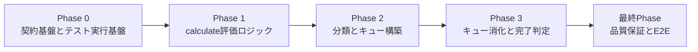
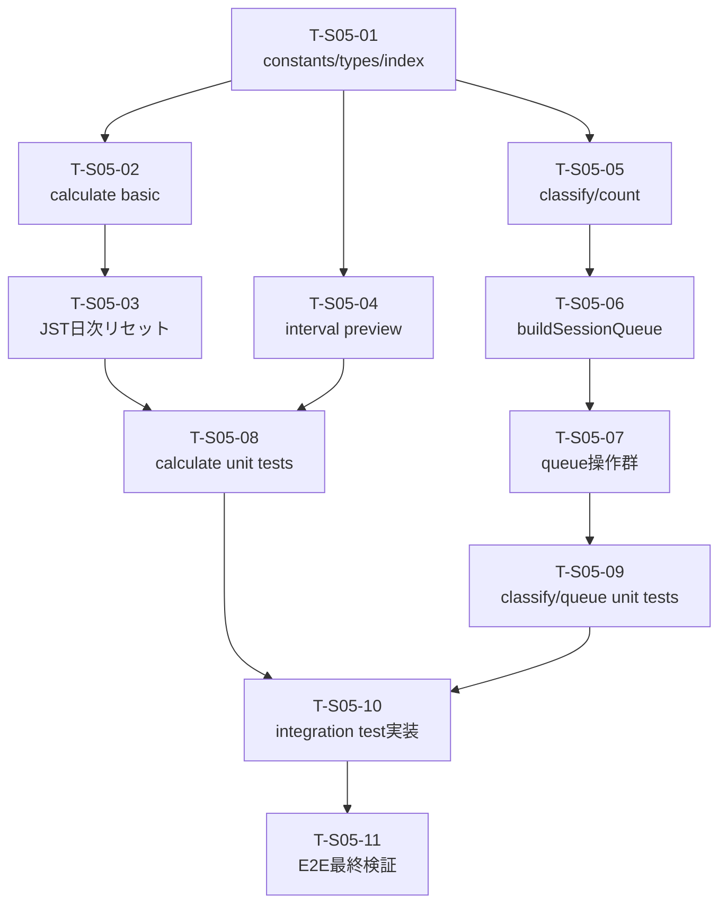

# 作業計画書: srs-engine

作成日: 2026-02-24
種別: feature
想定影響範囲: `frontend/src/lib/srs/*` + `frontend/vitest.config.ts` + S-05ストーリーテスト
関連Issue/PR: 未設定

## 関連ドキュメント
- ADR: `specs/adr/ADR-004-srs-engine.md`
- 要件定義書: `specs/stories/S-05-srs-engine/requirements.md`
- Design Doc: `specs/stories/S-05-srs-engine/design.md`
- 統合テスト骨子: `specs/stories/S-05-srs-engine/tests/srs-engine.int.test.ts`
- E2Eテスト骨子: `specs/stories/S-05-srs-engine/tests/srs-engine.e2e.test.ts`

## 目的
SRS評価ロジック（`good/hard/again`）とセッションキュー制御（`due -> learn -> new -> retry`）を pure / immutable 契約で実装し、AC#1〜#24 を統合テストと単体テストで段階的に固定する。

## 計画ルール（必須反映）
- [x] 統合テスト `specs/stories/S-05-srs-engine/tests/srs-engine.int.test.ts` は各Phaseの実装と同時に `it.todo` を実装し、同じPhase内で実行・合格させる（後回し禁止）
- [x] E2Eテスト `specs/stories/S-05-srs-engine/tests/srs-engine.e2e.test.ts` は全実装完了後の最終Phaseでのみ実行する（前倒し実行禁止）

## 影響範囲
### 対象ファイル
- [ ] `frontend/src/lib/srs/constants.ts`
- [ ] `frontend/src/lib/srs/types.ts`
- [ ] `frontend/src/lib/srs/calculate.ts`
- [ ] `frontend/src/lib/srs/classify.ts`
- [ ] `frontend/src/lib/srs/queue.ts`
- [ ] `frontend/src/lib/srs/index.ts`
- [ ] `frontend/src/lib/srs/calculate.test.ts`
- [ ] `frontend/src/lib/srs/classify.test.ts`
- [ ] `frontend/src/lib/srs/queue.test.ts`
- [ ] `frontend/vitest.config.ts`
- [ ] `specs/stories/S-05-srs-engine/tests/srs-engine.int.test.ts`
- [ ] `specs/stories/S-05-srs-engine/tests/srs-engine.e2e.test.ts`

### 参照のみ（変更なし）
- [ ] `frontend/src/lib/date.ts`（JST日付ユーティリティ依存）

## フェーズ構成

### フェーズ構成図

### タスク依存関係図

### フェーズ依存関係
- [ ] Phase 1 着手条件: Phase 0 で AC#1〜#2 の統合テストが合格している
- [ ] Phase 2 着手条件: Phase 1 で AC#3〜#11 / AC#24 の統合テストが合格している
- [ ] Phase 3 着手条件: Phase 2 で AC#12〜#18 の統合テストが合格している
- [ ] 最終Phase 着手条件: Phase 0〜3 の実装・単体テスト・統合テストがすべて完了している

### Phase 0: 契約基盤とテスト実行基盤（想定コミット数: 1）
**目的**: SRS公開契約を固定し、S-05統合テストをPhaseごとに回せる実行基盤を先に成立させる。

#### タスク（1コミット粒度）
- [ ] T-S05-01: 定数・型・公開境界を追加する
  - 実装: `frontend/src/lib/srs/constants.ts`, `frontend/src/lib/srs/types.ts`, `frontend/src/lib/srs/index.ts`
- [ ] T-S05-10-P0: S-05ストーリーテストを `frontend npm test` で実行できるよう設定する
  - 実装: `frontend/vitest.config.ts`
- [ ] T-S05-10-P0-IT: 統合テストの Phase 0 対象ケースを実装・実行する
  - テスト: `specs/stories/S-05-srs-engine/tests/srs-engine.int.test.ts`
  - 対象: `IT-AC01`, `IT-AC02`

#### フェーズ完了条件（Design AC由来）
- [ ] AC#1: `GOOD_INTERVALS` / `HARD_INTERVALS` / `RETRY_TODAY_LIMIT` が仕様値で公開される
- [ ] AC#2: `Rating` が `good | hard | again` の3値契約で公開される

#### 品質ゲート
- [ ] `npm run test --prefix frontend -- ../specs/stories/S-05-srs-engine/tests/srs-engine.int.test.ts` が成功する
- [ ] `npm run typecheck --prefix frontend` が成功する
- [ ] 実装差分が pure logic 層（`frontend/src/lib/srs/*`）に限定されている

#### 動作確認手順
1. `srs-engine.int.test.ts` の `IT-AC01` / `IT-AC02` を実装し、同Phase内でPASSさせる。
2. `frontend/vitest.config.ts` に S-05 テストパスが追加されていることを確認する。
3. `index.ts` 経由で定数・型が再公開されることを確認する。

#### 停止ポイント（品質固定）
- [ ] Phase 0 対象統合テストがPASSした状態を保存する

### Phase 1: calculate 評価ロジック（想定コミット数: 2）
**目的**: `calculateRating(state, rating, today, now)` と `getIntervalPreview` の契約を AC#3〜#11/#24 で固定する。

#### タスク（1コミット粒度）
- [x] T-S05-02: `calculateRating` の基本遷移（good/hard/again, 初回state=null, level clamp）を実装する
  - 実装: `frontend/src/lib/srs/calculate.ts`
- [x] T-S05-03: JST日次リセットと 00:00 跨ぎ判定（retryTodayCount 再計算）を実装する
  - 実装: `frontend/src/lib/srs/calculate.ts`
- [x] T-S05-04: `getIntervalPreview` の仕様文言を実装する
  - 実装: `frontend/src/lib/srs/calculate.ts`
- [x] T-S05-08: calculate 系 unit test を実装する
  - テスト: `frontend/src/lib/srs/calculate.test.ts`
  - 対象AC: AC#3〜#11, AC#24
- [x] T-S05-10-P1-IT: 統合テストの Phase 1 対象ケースを実装・実行する
  - テスト: `specs/stories/S-05-srs-engine/tests/srs-engine.int.test.ts`
  - 対象: `IT-AC03`〜`IT-AC11`, `IT-AC24`

#### フェーズ完了条件（Design AC由来）
- [x] AC#3: 4引数契約と `lastReviewedAt=now` を満たし、内部時刻生成を行わない
- [x] AC#4〜#7: `good/hard/again` 遷移と retry 上限判定が仕様通り
- [x] AC#8: `retryTodayCount` が JST 日付単位でリセットされる
- [x] AC#9〜#10: `state=null` 初回処理と level clamp を満たす
- [x] AC#11: `getIntervalPreview` 文言が仕様通り
- [x] AC#24: JST 00:00 跨ぎで retry 日次リセットが成立する

#### 品質ゲート
- [x] `npm run test --prefix frontend -- src/lib/srs/calculate.test.ts ../specs/stories/S-05-srs-engine/tests/srs-engine.int.test.ts` が成功する
- [x] `npm run typecheck --prefix frontend` が成功する
- [x] `calculate.ts` が入力オブジェクトを破壊していないことをテストで確認できる

#### 動作確認手順
1. `calculate.test.ts` で境界値（level範囲外、state=null、retry上限、JST境界）を検証する。
2. `srs-engine.int.test.ts` の Phase 1 対象 `IT-AC03`〜`IT-AC11` / `IT-AC24` を実装し同Phase内でPASSさせる。
3. `calculateRating(state, rating, today, now)` の4引数契約が呼び出し側から破壊されていないことを確認する。

#### 停止ポイント（品質固定）
- [x] Phase 1 対象統合テストがPASSした状態を保存する

### Phase 2: 分類とキュー構築（想定コミット数: 2）
**目的**: `classifyCard` / `countByCategory` / `buildSessionQueue` の分類・集計・順序契約を固定する。

#### タスク（1コミット粒度）
- [x] T-S05-05: `classifyCard` / `countByCategory` を実装する
  - 実装: `frontend/src/lib/srs/classify.ts`
- [x] T-S05-06: `buildSessionQueue(cards, today, newLimit)` を実装する
  - 実装: `frontend/src/lib/srs/queue.ts`
  - 実装観点: `newLimit` 正規化、カテゴリ内入力順維持、`retry=[]` 初期化
- [x] T-S05-09-P2: classify/buildQueue の unit test を実装する
  - テスト: `frontend/src/lib/srs/classify.test.ts`, `frontend/src/lib/srs/queue.test.ts`
  - 対象AC: AC#12〜#18
- [x] T-S05-10-P2-IT: 統合テストの Phase 2 対象ケースを実装・実行する
  - テスト: `specs/stories/S-05-srs-engine/tests/srs-engine.int.test.ts`
  - 対象: `IT-AC12`〜`IT-AC18`

#### フェーズ完了条件（Design AC由来）
- [x] AC#12〜#14: `classifyCard` が `new/learn/due/null` を仕様どおり返す
- [x] AC#15: `countByCategory` が `null` 分類を除外して集計する
- [x] AC#16: `buildSessionQueue` が `due/learn/new/retry` 初期構築を行う
- [x] AC#17: `newLimit` 正規化（`1.9->1`, `-1->0`, `NaN->0`）が成立する
- [x] AC#18: カテゴリ内部順序が入力順のまま維持される

#### 品質ゲート
- [x] `npm run test --prefix frontend -- src/lib/srs/classify.test.ts src/lib/srs/queue.test.ts ../specs/stories/S-05-srs-engine/tests/srs-engine.int.test.ts` が成功する
- [x] `npm run typecheck --prefix frontend` が成功する
- [x] `buildSessionQueue` が O(n) で処理できる実装になっている

#### 動作確認手順
1. `classify.test.ts` で `dueDate > today -> null` と `state=null -> new` を確認する。
2. `queue.test.ts` で `newLimit` 正規化とカテゴリ順序維持を確認する。
3. `srs-engine.int.test.ts` の `IT-AC12`〜`IT-AC18` を同Phase内でPASSさせる。

#### 停止ポイント（品質固定）
- [x] Phase 2 対象統合テストがPASSした状態を保存する

### Phase 3: キュー消化と完了判定（想定コミット数: 1-2）
**目的**: セッション進行API（`getNextCardId` / `dequeueCard` / `addToRetryQueue` / `isSessionComplete`）を immutable 契約で完成させる。

#### タスク（1コミット粒度）
- [x] T-S05-07: キュー消化・完了判定関数を実装する
  - 実装: `frontend/src/lib/srs/queue.ts`
- [x] T-S05-09-P3: queue 操作系 unit test を追加実装する
  - テスト: `frontend/src/lib/srs/queue.test.ts`
  - 対象AC: AC#19〜#23
- [x] T-S05-10-P3-IT: 統合テストの Phase 3 対象ケースを実装・実行する
  - テスト: `specs/stories/S-05-srs-engine/tests/srs-engine.int.test.ts`
  - 対象: `IT-AC19`〜`IT-AC23`
- [x] T-S05-10-P3-REG: 統合テストを全件再実行して回帰がないことを確認する
  - テスト: `specs/stories/S-05-srs-engine/tests/srs-engine.int.test.ts`

#### フェーズ完了条件（Design AC由来）
- [x] AC#19: `due -> learn -> new -> retry` 優先順で次カード取得できる
- [x] AC#20: `dequeueCard` が指定 source 先頭のみ削除し入力を破壊しない
- [x] AC#21: 空キュー `dequeueCard` が no-op かつ新規参照を返す
- [x] AC#22: `addToRetryQueue` が重複IDを許容して末尾追加する
- [x] AC#23: `isSessionComplete` が4キュー全空時のみ `true` を返す

#### 品質ゲート
- [x] `npm run test --prefix frontend -- src/lib/srs/*.test.ts ../specs/stories/S-05-srs-engine/tests/srs-engine.int.test.ts` が成功する
- [x] `npm run typecheck --prefix frontend` が成功する
- [x] queue 操作がすべて新規オブジェクト返却であることをテストで確認できる

#### 動作確認手順
1. `queue.test.ts` で優先順・重複retry・空キューno-op新規参照を確認する。
2. `srs-engine.int.test.ts` の `IT-AC19`〜`IT-AC23` を同Phase内でPASSさせる。
3. `srs-engine.int.test.ts` 全件実行で `IT-AC01`〜`IT-AC24` の回帰がないことを確認する。

#### 停止ポイント（品質固定）
- [x] Phase 3 対象統合テスト + 統合テスト全件がPASSした状態を保存する

---

### 最終Phase: 品質保証・E2E実行（必須）（想定コミット数: 1）
**目的**: AC#1〜#24 の受入証跡を確定し、S-05 完了判定を行う。

#### タスク
- [x] T-S05-11-E2E: `srs-engine.e2e.test.ts` の E2E-AC01〜E2E-AC24 を実装する
  - テスト: `specs/stories/S-05-srs-engine/tests/srs-engine.e2e.test.ts`
- [x] 全実装完了後にのみ E2E を実行する（計画ルール準拠）
  - テスト: `specs/stories/S-05-srs-engine/tests/srs-engine.e2e.test.ts`
- [x] 統合テストを全件実行し、Phase 0〜3 の退行がないことを確認する
  - テスト: `specs/stories/S-05-srs-engine/tests/srs-engine.int.test.ts`
- [x] frontend 品質ゲートを実行する
  - コマンド: `npm run check --prefix frontend`
- [x] 要件/ADR/Design/実装/テストのトレーサビリティを整理する

#### フェーズ完了条件
- [x] E2E-AC01〜E2E-AC24 がPASSする
- [x] AC#1〜#24 の検証結果を unit / integration / E2E で追跡できる
- [x] 統合テスト同時実施・E2E最終実施の運用ルールを満たしている

#### 品質ゲート
- [x] `npm run test --prefix frontend -- ../specs/stories/S-05-srs-engine/tests/srs-engine.int.test.ts` が成功する
- [x] `npm run test --prefix frontend -- ../specs/stories/S-05-srs-engine/tests/srs-engine.e2e.test.ts` が成功する
- [x] `npm run check --prefix frontend` が成功する

#### 動作確認手順
1. `srs-engine.int.test.ts` をフル実行し、`IT-AC01`〜`IT-AC24` の全PASSを確認する。
2. `srs-engine.e2e.test.ts` を最終Phaseで実行し、`E2E-AC01`〜`E2E-AC24` の全PASSを確認する。
3. `npm run check --prefix frontend` を実行し、lint/typecheck/test の品質ゲート通過を確認する。

## AC別完了チェックリスト
- [x] AC#1: 固定テーブル値（Phase 0 / Integration）
- [x] AC#2: Rating 3値契約（Phase 0 / Integration）
- [x] AC#3: `calculateRating` 4引数 + `lastReviewedAt=now`（Phase 1 / Unit + Integration）
- [x] AC#4: level0 good 遷移（Phase 1 / Unit + Integration）
- [x] AC#5: level2 hard 遷移（Phase 1 / Unit + Integration）
- [x] AC#6: level3 again 基本遷移（Phase 1 / Unit + Integration）
- [x] AC#7: again retry 上限超過停止（Phase 1 / Unit + Integration）
- [x] AC#8: JST日次リセット（Phase 1 / Unit + Integration）
- [x] AC#9: `state=null` 初回処理（Phase 1 / Unit + Integration）
- [x] AC#10: level clamp（Phase 1 / Unit + Integration）
- [x] AC#11: interval preview 文言（Phase 1 / Unit + Integration）
- [x] AC#12: `classifyCard(null)=new`（Phase 2 / Unit + Integration）
- [x] AC#13: learn/due 分岐（Phase 2 / Unit + Integration）
- [x] AC#14: future due を `null`（Phase 2 / Unit + Integration）
- [x] AC#15: `countByCategory` で `null` 除外（Phase 2 / Unit + Integration）
- [x] AC#16: `buildSessionQueue` 初期構築（Phase 2 / Unit + Integration）
- [x] AC#17: `newLimit` 正規化（Phase 2 / Unit + Integration）
- [x] AC#18: カテゴリ内順序維持（Phase 2 / Unit + Integration）
- [x] AC#19: 次カード優先順（Phase 3 / Unit + Integration）
- [x] AC#20: `dequeueCard` 先頭1件削除 + immutable（Phase 3 / Unit + Integration）
- [x] AC#21: 空キュー no-op + 新規参照（Phase 3 / Unit + Integration）
- [x] AC#22: retry 重複許容末尾追加（Phase 3 / Unit + Integration）
- [x] AC#23: 全キュー空のみ完了（Phase 3 / Unit + Integration）
- [x] AC#24: JST 00:00 境界で retry リセット（Phase 1 / Unit + Integration）

## リスクと対策
- [ ] リスク: `calculateRating` が `new Date()` 依存に回帰して決定性を失う  
      対策: AC#3 を unit + integration の両方で固定し、`now` 注入を必須化する
- [ ] リスク: JST日次判定の解釈違いで retry カウントがずれる  
      対策: AC#8 / AC#24 を Phase 1 の停止条件にし、境界時刻ケースを先に潰す
- [ ] リスク: `newLimit` 異常値で queue 件数が不安定になる  
      対策: AC#17 を Phase 2 の品質ゲートへ組み込み、`1.9/-1/NaN` を固定テスト化する
- [ ] リスク: queue 操作で破壊的変更が入り既存参照を壊す  
      対策: AC#20 / AC#21 を参照比較テストで保証し、Phase 3 の完了条件にする
- [ ] リスク: 統合テスト後回しで終盤に欠陥が集中する  
      対策: 各Phase停止ポイントを「対象統合テストPASS」に固定する
