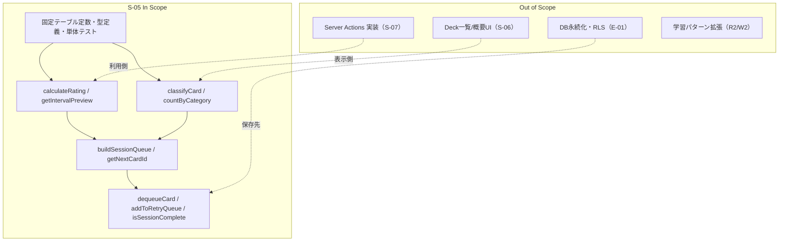
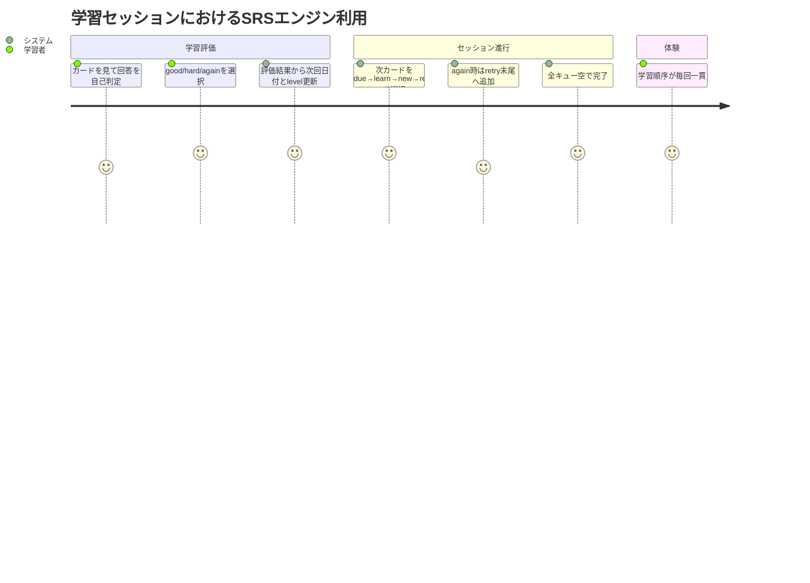

# 要件定義書: srs-engine

## 1. 概要

### 1行要約
SRS 計算ロジックと学習セッションキュー管理を、UI/DB 非依存の純粋関数群として定義し、再現性のある学習進行を保証する。

### 背景
E-02 の学習コアフローでは、評価に応じた次回復習日の算出と、セッション内の出題順制御が中核価値になる。
本ストーリーは S-06/S-07 が依存する SRS エンジン契約を確定し、入力に対して常に同じ結果を返せる検証可能な要件を定義する。

## 2. ユーザーストーリー

### プライマリーユーザー
- 学習者（評価に応じて適切な復習タイミングと出題順を得たい）
- 開発者（サーバー/画面層から独立したテスト可能な SRS ロジックを利用したい）

### ユーザーストーリー
```
As a learner and study-flow developer
I want deterministic SRS rating and session queue rules
So that study sessions always progress in a predictable and testable way
```

### ユースケース
1. 学習者が `good/hard/again` を選ぶと、次回日付・レベル・retry 追加可否が規則通り更新される。
2. セッション開始時、今日対象カードだけが `due -> learn -> new -> retry` 順で消化できる。
3. `again` が続いても retry 無限ループを防ぎながら、同一カードの再提示が必要回数だけ行われる。

## 3. 要件

### Must（必須）
- SRS 固定テーブルとして `GOOD_INTERVALS=[1,3,7,14,30,60,120]`、`HARD_INTERVALS=[1,2,4,7,14,30,60]`、`RETRY_TODAY_LIMIT=2` を使用する。
- `Rating` は `'good' | 'hard' | 'again'` の3値で定義する。
- `calculateRating` の正式シグネチャは `calculateRating(state, rating, today, now)` とし、`now` は ISO 8601 文字列を受け取る。
- `calculateRating` は位置引数4つ（`state, rating, today, now`）を正式契約として維持し、呼び出し側の可読性と既存仕様との整合を優先する。
- `calculateRating` は純粋関数として `lastReviewedAt` を `now` で設定する（`new Date()` を内部で生成しない）。
- `calculateRating` は純粋関数保証のために現在時刻注入（`now`）を分離し、シグネチャ例外や契約変更は ADR で管理する。
- `calculateRating` は `state.level` を利用する前に `0..MAX_GOOD_LEVEL` へ clamp し、出力 `newState.level` も同範囲に収める。
- `calculateRating` の `retryTodayCount` は JST 日付単位で評価し、`state.lastReviewedAt` の JST 日付が `today` と異なる場合は `0` から再計算する。
- `classifyCard` の戻り値型は `CardCategory | null` とし、`dueDate > today` のカードは `null` を返す。
- `buildSessionQueue` はカテゴリごとの内部順序を入力 `cards` の出現順のまま維持する。
- `buildSessionQueue` は `newLimit` を正規化して適用する（`floor` 後に `0` 以上へ clamp、`NaN`/無効値は `0` 扱い）。
- `addToRetryQueue` は retry キュー末尾に cardId を追加し、同一 cardId の重複を許可する。
- セッションの出題優先順は `due -> learn -> new -> retry` とする。
- `dequeueCard`、`addToRetryQueue` は既存キューを破壊せず新しいオブジェクトを返す。
- `dequeueCard` は指定 source キューが空の場合、内容を変更しない（no-op）で返す。ただし返却値は新しい `SessionQueue` オブジェクトとする。
- `countByCategory` は `null` 分類（今日対象外）をカウント対象に含めない。
- `buildSessionQueue` の `new` キューは `newLimit` 件までに制限する。
- `isSessionComplete` は4キューがすべて空配列の場合のみ `true` を返す。
- S-05 の実装対象パス表記は `frontend/src/lib/srs/*` と `frontend/src/lib/date.ts` に統一する。
- 日付演算は S-04 で定義済みの JST ユーティリティ（`frontend/src/lib/date.ts`）を利用し、`today/dueDate` は `YYYY-MM-DD` 文字列で扱う。

### Should（望ましい）
- `calculateRating`、`classifyCard`、`queue` 関数群は境界値（初回 `state=null`、level 下限/上限外、retry 上限）を単体テストで網羅する。
- `getIntervalPreview` の文言は UI がそのまま表示可能な形式（例: `3日後`、`今日さいご + 明日`）で返す。

### Could（あるとよい）
- テストで「同一入力=同一出力」を追加検証し、純粋関数性を強化する。
- 将来の間隔テーブル差し替えを見据え、定数とロジックの依存を最小化する。

### Won’t（対象外）
- DB 永続化、Server Actions、UI コンポーネント実装。
- R2/W2 等の学習パターン拡張。
- SRS パラメータチューニング UI や運用画面。

### MVP / Future 要件マッピング
| 領域 | MVP（本ストーリー） | Future（対象外） |
|---|---|---|
| 評価ロジック | fixed table による `good/hard/again` 計算、retry制御 | 動的パラメータ最適化、個別学習者調整 |
| カード分類 | `new/learn/due/null(対象外)` の決定 | 追加カテゴリ（例: cram/custom） |
| キュー制御 | `due->learn->new->retry`、入力順維持、重複retry許容 | 優先度重み付け、適応順序最適化 |

## 4. 非機能要件

### 決定性・テスト容易性
- すべての公開関数は同一入力に対して同一出力を返すこと。
- 現在時刻依存は `now` 引数注入で外部化し、テストで固定値検証できること。

### 信頼性
- level 範囲外入力や retry 境界入力でも例外を投げず、定義済み挙動（clamp/上限判定）で処理継続できること。
- 今日対象外カードは `null` 分類され、セッションキュー汚染を起こさないこと。

### パフォーマンス
- `buildSessionQueue` と `countByCategory` はカード配列に対して線形時間で処理できること（目安 O(n)）。

### 保守性
- SRS 定数・型・計算・分類・キューをファイル責務で分離し、変更影響を局所化すること。

## 5. 成功指標

### 定量的指標
1. ACで定義した SRS 計算・分類・キューの単体テストが 100% パスすること。
2. `calculateRating` で `lastReviewedAt` がテスト入力 `now` と100%一致すること。
3. `classifyCard(dueDate > today)` ケースで `null` が100%返ること。
4. `buildSessionQueue` でカテゴリ内順序が入力順と一致することを、3カテゴリ以上混在ケースで100%確認できること。
5. retry 同一カード重複ケースで `addToRetryQueue` が拒否せず追加できることを100%確認できること。
6. level 範囲外入力（負数/上限超過）で、出力 level が常に `0..MAX` に収まることを100%確認できること。
7. `retryTodayCount` が JST 日付切り替わり時に `0` から再計算されることを100%確認できること。
8. `newLimit` 異常値入力（負数/小数/NaN）時に正規化ルールどおり適用されることを100%確認できること。
9. `dequeueCard` が空キュー指定時に no-op であることを100%確認できること。
10. JST 日付境界（00:00跨ぎ）でも `retryTodayCount` が日次ルールどおり再計算されることを100%確認できること。

### 定性的指標
1. 開発者が要件書のみで S-07 の `rateCard/getNextCard` に必要な SRS 契約を説明できること。
2. 学習者の体験として「評価後の次カード遷移が不自然にぶれない」とレビューで判断できること。

## 6. スコープ境界図



## 7. ユーザージャーニー



## 8. 制約・前提（確定方針反映）

- D1. `classifyCard` の戻り値は `CardCategory | null` とし、`dueDate > today` は `null` 許容で扱う。
- D2. `calculateRating` の `lastReviewedAt` は `now` 引数注入で決定し、関数内部で時刻生成しない。
- D3. `buildSessionQueue` のカテゴリ内順序は入力順を維持する。
- D4. retry キューでは同一カードIDの重複を許可する。
- D5. level 範囲外入力は `0..max` に clamp する（下限0、上限 `MAX_GOOD_LEVEL`）。
- D6. `calculateRating` は位置引数4つを正式契約として維持し、`now` 注入を分離して純粋関数保証を明確化する。契約変更は ADR で例外管理する。

## 9. リスクと対策

| リスク | 影響度 | 発生確率 | 軽減策 |
|---|---|---|---|
| 時刻依存が内部生成され、テストが不安定になる | 高 | 中 | `now` 引数必須化（D2）とACで厳格検証 |
| 今日対象外カードが誤ってキュー投入される | 高 | 中 | `classifyCard -> null` 契約（D1）と `count/build` の除外要件化 |
| キュー構築で順序が変化し学習体験がぶれる | 中 | 中 | 入力順維持要件（D3）をACで具体ケース検証 |
| retry重複禁止実装により再提示が欠落する | 中 | 低 | 重複許可要件（D4）を明示しテスト固定 |
| 異常level入力で計算破綻する | 高 | 低 | clamp要件（D5）と境界テスト必須化 |

## 10. 受入条件（測定可能）

1. AC#1: `GOOD_INTERVALS` は `[1,3,7,14,30,60,120]`、`HARD_INTERVALS` は `[1,2,4,7,14,30,60]`、`RETRY_TODAY_LIMIT` は `2` である。
2. AC#2: `Rating` は `good/hard/again` の3値のみを受け付ける。
3. AC#3: `calculateRating` の正式契約は位置引数4つの `calculateRating(state, rating, today, now)` とする。`now`（ISO 8601 文字列）を受け取って `newState.lastReviewedAt` にそのまま設定し、関数内部で `new Date()` を呼ばない（呼び出し可読性・既存仕様整合・純粋関数保証のため）。
4. AC#4: `calculateRating(state={level:0,retryTodayCount:0,lastReviewedAt:null}, rating='good', today='2026-02-24', now='2026-02-24T10:00:00.000Z')` で `dueDate='2026-02-25'`、`level=1`、`addToRetryQueue=false`、`lastReviewedAt='2026-02-24T10:00:00.000Z'` となる。
5. AC#5: `calculateRating(state={level:2,retryTodayCount:1,lastReviewedAt:'2026-02-24T00:00:00.000Z'}, rating='hard', today='2026-02-24', now='2026-02-24T10:00:00.000Z')` で `dueDate='2026-02-28'`、`level=2`、`retryTodayCount=1` となる。
6. AC#6: `calculateRating(state={level:3,retryTodayCount:0,lastReviewedAt:'2026-02-24T01:00:00.000Z'}, rating='again', today='2026-02-24', now='2026-02-24T10:00:00.000Z')` で `dueDate='2026-02-25'`、`level=0`、`retryTodayCount=1`、`addToRetryQueue=true` となる。
7. AC#7: `calculateRating(state={level:0,retryTodayCount:2,lastReviewedAt:'2026-02-24T02:00:00.000Z'}, rating='again', today='2026-02-24', now='2026-02-24T10:00:00.000Z')` で `retryTodayCount=3`、`addToRetryQueue=false` となる。
8. AC#8: `calculateRating(state={level:1,retryTodayCount:2,lastReviewedAt:'2026-02-23T00:00:00.000Z'}, rating='again', today='2026-02-24', now='2026-02-24T10:00:00.000Z')` で、`state.lastReviewedAt` の JST 日付が `today` と異なるため `retryTodayCount` は `1`（`0` から再計算後に `again` 加算）となる。
9. AC#9: `state=null` を初回レビューとして扱い、`calculateRating(state=null, rating='good', today='2026-02-24', now='2026-02-24T10:00:00.000Z')` で `level=1`、`calculateRating(state=null, rating='again', today='2026-02-24', now='2026-02-24T10:00:00.000Z')` で `level=0` を返す。
10. AC#10: level 入力が負数または上限超過でも、計算前に `0..MAX_GOOD_LEVEL` へ clamp され、出力 `newState.level` も同範囲に収まる。
11. AC#11: `getIntervalPreview(state={level:2})` は `good='7日後'`、`hard='4日後'`、`again='今日さいご + 明日'` を返す。
12. AC#12: `classifyCard(null, today)` は `'new'` を返す。
13. AC#13: `classifyCard({level:1,dueDate=today}, today)` は `'learn'`、`classifyCard({level:2,dueDate=today}, today)` は `'due'` を返す。
14. AC#14: `classifyCard({level:2,dueDate>today}, today)` は `null` を返す。
15. AC#15: `countByCategory` は `null` 分類カードを `new/learn/due` のいずれにも加算しない。
16. AC#16: `buildSessionQueue(cards, today, newLimit)` は `due/learn/new` を分類し、`retry` を空配列で初期化する。`newLimit` は `floor` 後に `0` 以上へ clamp し、`NaN`/無効値は `0` として扱う。
17. AC#17: `buildSessionQueue` の `newLimit` 正規化は、`newLimit=1.9` で `new.length=1`、`newLimit=-1` で `new.length=0`、`newLimit=NaN` で `new.length=0` を満たす。
18. AC#18: `buildSessionQueue` の `due`・`learn`・`new` 各配列の内部順序は入力 `cards` の出現順と一致する。
19. AC#19: `getNextCardId` は `due -> learn -> new -> retry` の優先順で先頭カードを返し、全空時 `{cardId:null, source:null}` を返す。
20. AC#20: `dequeueCard` は指定 source の先頭のみを削除し、入力キューオブジェクトを破壊しない。
21. AC#21: `dequeueCard` は指定 source キューが空配列の場合、返却キュー内容を入力と同一に保つ（no-op）。ただし返却値は入力と同一参照ではなく、新しい `SessionQueue` オブジェクトである。
22. AC#22: `addToRetryQueue` は同一 `cardId` 既存時も拒否せず末尾追加し、重複を保持する。
23. AC#23: `isSessionComplete` は4キューすべて空のときのみ `true`、いずれか1つでも要素があれば `false` を返す。
24. AC#24: JST 日付境界（00:00）を跨ぐ `calculateRating(..., rating='again', today='2026-02-24', now='2026-02-23T15:00:00.000Z')` で、`lastReviewedAt='2026-02-23T14:59:59.000Z'` の場合は前日扱いとなり、`retryTodayCount` は `1`（`0` から再計算後に `again` 加算）となる。

## 11. 参考資料
- `specs/stories/S-05-srs-engine/story.md`
- `specs/epics/E-02-core-study-flow/epic.md`
- `specs/stories/S-03-authentication-flow/requirements.md`

## 12. 変更履歴

| 日付 | 版 | 変更内容 | 作成者 |
|---|---|---|---|
| 2026-02-24 | 1.2.0 | 実装パス表記を `frontend/src/lib/*` に統一、`dequeueCard` no-op時の新規オブジェクト返却を明文化、`calculateRating` 4引数契約の根拠とADR例外管理前提を追記、JST 00:00跨ぎACを追加 | Codex |
| 2026-02-24 | 1.1.0 | document-reviewer 指摘 I-01〜I-05 反映（`calculateRating` シグネチャ統一、`retryTodayCount` 日次リセット、`newLimit` 異常値、`dequeueCard` 空キュー no-op を明文化） | Codex |
| 2026-02-24 | 1.0.0 | 初版作成（S-05要件を測定可能形式へ再編し、確定方針D1-D5を反映） | Codex |
