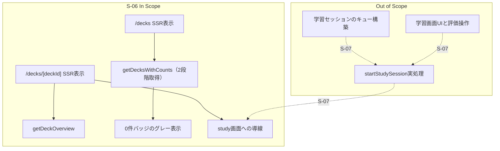
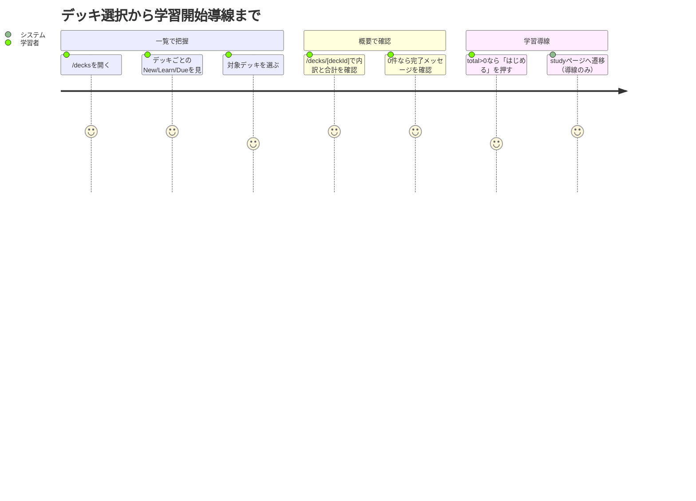

# 要件定義書: deck-list-and-overview

## 1. 概要

### 1行要約
デッキ一覧とデッキ概要で、今日学習するカード量（New/Learn/Due）を即時把握し、学習画面への導線を提供する。

### 背景
E-02 学習コアフローでは、学習開始前に「どのデッキで何枚学習するか」を短時間で判断できることが中核体験の入口になる。
本ストーリーは `/decks` と `/decks/[deckId]` の表示契約と集計契約を定義し、S-07 の学習セッション実処理へ接続する前段を確定する。

## 2. ユーザーストーリー

### プライマリーユーザー
- 学習者（今日の学習量を見てデッキを選びたい）
- 開発者（S-05 の分類ロジックを利用して、一覧/概要の表示契約を安定運用したい）

### ユーザーストーリー
```text
As a learner
I want to see New/Learn/Due counts in deck list and deck overview
So that I can choose a deck and move to study with confidence
```

### ユースケース
1. ユーザーが `/decks` を開くと、所有デッキごとの New/Learn/Due を比較して選択できる。
2. ユーザーが `/decks/[deckId]` で内訳と合計を確認し、学習画面へ進むか判断できる。
3. 当日対象カードが 0 件の場合、学習不要であることを画面から即座に理解できる。

## 3. 要件

### Must（必須）
- `/decks` は Server Component で SSR 描画し、`getDecksWithCounts()` の結果を表示する。
- デッキ一覧の各行に「デッキ名」「New」「Learn」「Due」を表示し、行全体が `/decks/[deckId]` へのリンクであること。
- New/Learn/Due の算出は S-05 `countByCategory` 契約に準拠すること。
- カウントバッジは 0 件でも非表示にせず表示し、0 件時はグレー配色で表示すること。
- デッキが 0 件のときは「デッキがまだありません」を表示すること。
- `/decks/[deckId]` は Server Component で SSR 描画し、`getDeckOverview(deckId)` の結果を表示する。
- デッキ概要は `new/learn/due/total` を表示し、`total = new + learn + due` を満たすこと。
- `getDeckOverview(deckId)` で対象デッキが存在しない、または他ユーザー所有の場合は 404 を返すこと。
- 「はじめる」ボタンは `total > 0` のとき有効、`total = 0` のとき無効化し「今日の学習は完了しています」を表示すること。
- **S-06 では `startStudySession` 実処理を実行しない。** 「はじめる」は `/decks/[deckId]/study` への導線提供のみを担うこと（実セッション作成は S-07）。
- `/decks/[deckId]/study` は S-06 でプレースホルダ画面を表示し、遷移先が 404 にならないこと。
- `getDecksWithCounts()` は保守性優先で **2段階取得** とする。  
  1) 所有デッキ一覧取得  
  2) 取得した deckId 群に対するカード/復習状態取得と集計
- Server Actions とページで認証・所有者チェックを行い、未認証時は `/login` へ誘導すること。

### Should（望ましい）
- デッキ一覧と概要の UI はモバイル優先で、タッチターゲット最小 48px を満たすこと。
- バッジの色分け（New=青, Learn=赤, Due=緑, 0件=グレー）を一覧/概要で統一すること。

### Could（あるとよい）
- デッキ一覧で最終学習日や総カード数を補助情報として表示できる設計にしておくこと。
- 将来の集計拡張（例: `overdue`）を見据え、表示コンポーネントを再利用可能に保つこと。

### Won’t（対象外）
- `startStudySession` のセッション生成・キュー構築実装（S-07 で実施）。
- 学習画面本体（`/decks/[deckId]/study`）の UI/操作実装（S-06 はプレースホルダのみ、実装本体は S-07 で実施）。
- SRS パラメータ変更、評価ロジック変更（S-05 管轄）。

### MVP / Future 要件マッピング
| 領域 | MVP（S-06） | Future（S-07以降） |
|---|---|---|
| デッキ一覧 | New/Learn/Due の表示と遷移導線 | 追加指標・並び替え最適化 |
| デッキ概要 | 内訳表示、0件時メッセージ、開始導線 | 学習開始時の実セッション生成 |
| 集計取得 | `getDecksWithCounts` 2段階取得 | 高度な集計最適化（必要時） |

## 4. 非機能要件

### セキュリティ
- `getDecksWithCounts` / `getDeckOverview` は認証必須とし、`owner_user_id` 条件で他ユーザーデータを返さないこと。
- 不正な deckId 指定時にデータ内容を漏らさず 404 応答にすること。

### パフォーマンス
- デッキ一覧の集計処理はデッキ件数に対して線形に拡張可能な構造であること（2段階取得 + メモリ集計）。
- 概要画面は対象デッキ1件の取得と集計のみを行うこと。

### 信頼性
- 集計対象外（`due_date > today`）カードを New/Learn/Due に誤算入しないこと。
- 0件バッジ表示ルールが一覧/概要で一貫すること。

### 保守性
- `getDecksWithCounts` の取得責務（デッキ取得と明細取得）を分離し、クエリ条件変更時の影響を局所化すること。
- 集計ロジックは S-05 契約に依存し、独自分類ロジックを重複実装しないこと。

## 5. 成功指標

### 定量的指標
1. New/Learn/Due 集計が S-05 契約テストケースと 100% 一致すること。
2. 0件カウント表示ケースで、対象バッジが 100% グレー表示されること。
3. `total = new + learn + due` が全表示ケースで 100% 成立すること。
4. 所有外 deckId 指定時の 404 応答が 100% 成立すること。
5. 「はじめる」押下時、S-06 範囲では `startStudySession` 呼び出しが 0 回であること。

### 定性的指標
1. 学習者が一覧画面から「どのデッキを今日やるか」を迷わず判断できること。
2. 開発者が S-06 要件のみで、S-07 に引き渡す責務境界（導線のみ）を説明できること。

## 6. スコープ境界図



## 7. ユーザージャーニー



## 8. 制約・前提（確定方針反映）

- D1. `startStudySession` は S-06 では実行しない。S-06 は学習画面への導線とプレースホルダ表示のみを担い、実セッション処理は S-07 で実装する。
- D2. `getDecksWithCounts` は保守性優先で 2段階取得を採用し、DBクエリ数は最大2回（所有デッキ0件時は1回）に制約する（単一巨大JOIN最適化は本ストーリーで採用しない）。
- D3. New/Learn/Due バッジの 0 件は非表示にせずグレー表示する。
- D4. カテゴリ判定は S-05 `countByCategory` の定義を唯一の基準とする。

## 9. リスクと対策

| リスク | 影響度 | 発生確率 | 軽減策 |
|---|---|---|---|
| `startStudySession` 未実装を見落として S-06 で実処理を入れてしまう | 中 | 中 | D1 と AC に責務境界を明記し、レビュー観点に含める |
| 2段階取得が崩れ、クエリ責務が肥大化して保守性が低下する | 中 | 中 | D2 を固定し、取得ステップを関数内で分離する |
| 0件バッジが非表示実装になり、情報欠落でUXが悪化する | 中 | 高 | D3 を固定し、UIテストで 0 件表示を検証する |
| 所有者チェック漏れで他ユーザーのデッキ情報が表示される | 高 | 低 | Action + ページ両層で所有者確認し、404 を返す |

## 10. 受入条件（測定可能）

1. AC#1: `/decks` は Server Component で `getDecksWithCounts()` を呼び、SSR でデッキ一覧を描画する。
2. AC#2: `getDecksWithCounts()` は「(a)所有デッキ取得」「(b)deckId 群に対するカード/復習状態取得と集計」の2段階で実装され、DBクエリ数は最大2回（所有デッキ0件時は1回）である。
3. AC#3: `getDecksWithCounts()` は S-05 `countByCategory` を使って各デッキの `new/learn/due` を返す。
4. AC#4: デッキ行は `デッキ名 + New + Learn + Due` を表示し、行押下で `/decks/[deckId]` に遷移する。
5. AC#5: New/Learn/Due バッジは count=0 でも表示され、0件時はグレー配色（例: `bg-gray-* text-gray-*`）になる。
6. AC#6: count>0 のバッジ配色は New=青、Learn=赤、Due=緑で表示される。
7. AC#7: 所有デッキが 0 件の場合、`デッキがまだありません` を表示する。
8. AC#8: `/decks/[deckId]` は Server Component で `getDeckOverview(deckId)` を呼び、`new/learn/due/total` を表示する。
9. AC#9: `getDeckOverview(deckId)` が `null` を返すケース（不存在または他ユーザー所有）は 404 画面になる。
10. AC#10: `total` は常に `new + learn + due` と一致する。
11. AC#11: `total=0` のとき「はじめる」ボタンは非活性で、「今日の学習は完了しています」を表示する。
12. AC#12: `total>0` のとき「はじめる」ボタンは活性で、押下すると `/decks/[deckId]/study` に遷移する。
13. AC#13: S-06 の範囲では「はじめる」押下時に `startStudySession` は呼び出されない（導線のみ）。
14. AC#14: 未認証状態で `/decks` または `/decks/[deckId]` を要求した場合、`/login` にリダイレクトされる（`Location: /login` を観測できる）。
15. AC#15: `/decks/[deckId]/study` は S-06 時点でプレースホルダ画面を返し、存在する deckId への遷移で 404 を返さない。

## 11. 参考資料
- `specs/stories/S-06-deck-list-and-overview/story.md`
- `specs/epics/E-02-core-study-flow/epic.md`
- `specs/stories/S-05-srs-engine/requirements.md`

## 12. 変更履歴

| 日付 | 版 | 変更内容 | 作成者 |
|---|---|---|---|
| 2026-02-24 | 1.1.0 | document-reviewer 指摘対応（AC#2をクエリ回数まで測定可能化、AC#14を`/login`固定化、`/study`プレースホルダ要件を追加） | Codex |
| 2026-02-24 | 1.0.0 | 初版作成（測定可能要件へ再編、確定事項3点を反映） | Codex |
