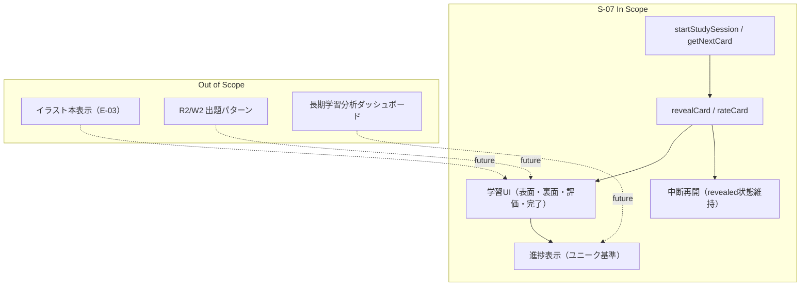
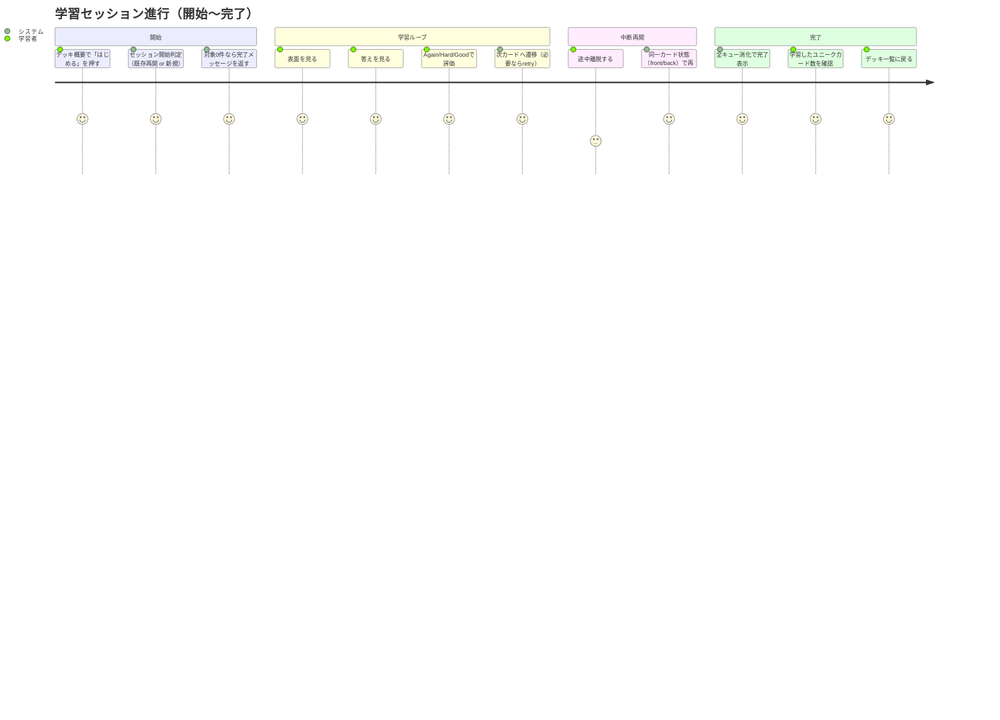

# 要件定義書: study-session-flow

## 1. 概要

### 1行要約
学習セッションを「表面表示 -> 答え表示 -> 3段階評価 -> 次カード/完了」で一貫して進行させる中核フローを定義する。

### 背景
E-02 学習コアフローでは、S-05 のSRS契約を実際のセッション進行と接続し、学習者がテンポよく反復できる体験が必要である。
本ストーリーは、セッション作成・再開・評価反映・完了までの振る舞いを測定可能な要件として固定し、S-06 からの導線を受けて学習体験を成立させる。

## 2. ユーザーストーリー

### プライマリーユーザー
- 学習者（迷わず1問ずつ進めて今日の学習を完了したい）
- 開発者（SRSロジックとセッション状態を破綻なく統合したい）

### ユーザーストーリー
```text
As a learner
I want to progress cards with Show Answer and 3-level rating
So that I can complete daily kanji study with a clear sense of progress
```

### ユースケース
1. 学習者がデッキ概要から学習を開始し、表面を見てから答えを確認して評価できる。
2. 学習者がセッション途中で離脱しても、同じカード状態から再開できる。
3. 全対象カードを終えると、学習完了メッセージと学習カード数を確認してデッキ一覧へ戻れる。

## 3. 要件

### Must（必須）
- `startStudySession`, `getNextCard`, `revealCard`, `rateCard` の4つのセッション操作契約を提供すること。
- `startStudySession(deckId)` は認証チェック・デッキ所有者チェックを行うこと。
- 同一デッキに `finished_at IS NULL` のアクティブセッションがある場合、新規作成せず既存セッションを再開すること。
- セッション開始時の初期キューは S-05 契約に従い `due -> learn -> new` を構築し、`retry` は空で開始すること。
- セッション開始時に対象カードが0件の場合、`study_sessions` を作成せず完了状態メッセージを返すこと。
- `getNextCard(sessionId)` は表面データのみを返し、`current_card_id` を更新し `revealed=false` を保証すること。
- `progress.total` / `progress.remaining` は初期対象ユニークカード基準で管理し、retry再提示で増減させないこと。
- `revealCard(sessionId)` は現在カードの裏面データと3評価分の次回目安を返し、`revealed=true` を反映すること。
- `rateCard(sessionId, rating)` は `revealed=true` を前提とし、ReviewState更新・キュー更新・ポインタ更新・次カード決定を一貫処理すること。
- `rateCard` の整合性は DBトランザクション（RPCまたは同等の原子処理）で保証すること。
- `again` 評価時の retry 追加は S-05 の `retry_today_count` 上限契約に従うこと。
- 全キューが空になった時点でセッションを完了し、`finished_at` を更新して完了表示へ遷移できること。
- 学習完了画面の「学習したカード数」はユニークカード数を表示し、retry回答回数は別指標として分離可能にすること。
- `revealed=true` で離脱後に再開した場合、同一カードの裏面表示から再開すること。
- 学習UIは「表面」「裏面」「評価ボタン」「完了画面」を提供し、イラストはプレースホルダ表示（`illustrationUrl=null`）とすること。
- 評価ボタンは `Again -> Hard -> Good` の固定順で、各ボタンに次回目安テキストを表示すること。

### Should（望ましい）
- `rateCard` 実行から次カード表示までの体感待ち時間を 200ms 以内目標で最適化すること。
- 学習画面はモバイル優先とし、主要操作ボタンのタッチターゲット最小48pxを満たすこと。
- セッション再開時の初期表示判定（front/back/complete）を単一の判定経路で実装可能な契約にすること。

### Could（あるとよい）
- 完了サマリーに `retryAnswerCount` などの補助指標を追加できる拡張余地を持たせること。
- 将来の学習パターン追加（R2/W2）を考慮し、カード表示契約を再利用可能に保つこと。

### Won’t（対象外）
- イラスト本実装（E-03 で対応）。
- R2/W2 など追加出題パターン。
- 学習統計ダッシュボードや長期レポート機能。

### MVP / Future 要件マッピング
| 領域 | MVP（S-07） | Future（S-07対象外） |
|---|---|---|
| セッション制御 | 開始・再開・進行・完了の契約固定 | 複数セッション同時実行最適化 |
| カード表示 | 表面/裏面、評価、完了表示 | 追加パターン表示（R2/W2） |
| 補助情報 | 進捗と次回目安の提示 | 詳細分析メトリクス |
| 画像表示 | プレースホルダのみ | 生成イラストの表示連携（E-03） |

## 4. 非機能要件

### セキュリティ
- すべてのセッション操作は認証必須とし、`session.user_id`/`deck.owner_user_id` の所有者一致を強制すること。
- 他ユーザーの `sessionId` や `deckId` を指定した場合、情報漏えいしない失敗応答にすること。

### パフォーマンス
- `rateCard` は次カード情報を同一レスポンスで返し、不要な往復呼び出しを増やさないこと。
- セッション進行に必要な最小クエリで処理し、連続評価時の待ち時間増加を抑えること。

### 信頼性
- セッション状態（キュー、`current_card_id`, `revealed`）は中断後も再開可能な一貫性を維持すること。
- 途中失敗時に部分更新を残さないこと（原子処理またはロールバック）。

### データ整合性
- `progress.total` はセッション開始時点で固定し、retry再提示では増やさないこと。
- `progress.remaining` は未学習ユニークカード数を示し、負数にならないこと。
- 完了サマリーの学習カード数はユニーク基準で算出すること。

### 保守性
- SRS計算規則は S-05 契約を唯一の基準とし、重複ロジックを導入しないこと。
- セッション所有者チェックと認証チェックは共通化可能な契約で定義すること。

## 5. 成功指標

### 定量的指標
1. 本要件の受入条件（AC）が 100% 検証可能な形で満たされること。
2. retry を含むケースで `progress.total` がセッション中に不変であることを 100% 確認できること。
3. 対象カード0件ケースで `study_sessions` 作成件数が 0 件であることを 100% 確認できること。
4. `revealed=true` 離脱再開時に同一カード裏面から復帰することを 100% 確認できること。
5. `rateCard` 失敗時の部分更新が 0 件（ロールバック成立）であることを 100% 確認できること。
6. 完了サマリーの `studiedUniqueCards` がユニーク評価済みカード数と 100% 一致すること。
7. 評価ボタン順序（Again/Hard/Good）が全画面幅で崩れないことを 100% 確認できること。

### 定性的指標
1. 学習者が「次に何を押すか」を迷わず、1セッションを中断再開含めて完遂できること。
2. 開発者が要件書のみで、進捗算出基準と再開挙動を説明できること。

## 6. スコープ境界図



## 7. ユーザージャーニー



## 8. 制約・前提（確定方針反映）

- D1. `progress.total` / `progress.remaining` は「セッション開始時の初期対象ユニークカード数」を基準とし、retry再提示は `total` に加算しない。
- D2. 完了時の「学習したカード数」はユニークカード数を採用し、retry回答回数は別指標（例: `retryAnswerCount`）として分離可能にする。
- D3. セッション開始時の対象カードが0件の場合、セッションは作成せず完了状態メッセージを返す。
- D4. `revealed=true` の状態で離脱した場合、再開時は同一カードの裏面表示から復帰する。
- D5. `rateCard` の ReviewState更新とキュー更新は DBトランザクション（RPCまたは同等の原子処理）を必須とする。
- D6. 出題優先順は S-05 契約どおり `due -> learn -> new -> retry` とする。

## 9. リスクと対策

| リスク | 影響度 | 発生確率 | 軽減策 |
|---|---|---|---|
| retry再提示を進捗に加算し、学習者の達成感が崩れる | 中 | 中 | D1を固定し、進捗ACでユニーク基準を検証する |
| 0件時に空セッションを作り、不要データが蓄積する | 中 | 中 | D3を固定し、作成0件を受入条件で検証する |
| `revealed=true` 再開時に表面へ戻り、体験が不連続になる | 中 | 高 | D4を固定し、再開時表示状態を明示的にテストする |
| `rateCard` 中断で ReviewState とキューが不整合になる | 高 | 中 | D5の原子処理必須化とロールバック検証を行う |
| 所有者チェック漏れで他ユーザーセッションを操作できる | 高 | 低 | 全Actionで認証+所有者チェックを必須化する |

## 10. 受入条件（測定可能）

1. AC#1: `startStudySession(deckId)` は未認証時に失敗応答を返し、セッションを新規作成しない。
2. AC#2: `startStudySession(deckId)` は他ユーザー所有デッキ指定時に失敗応答を返し、セッションを新規作成しない。
3. AC#3: 同一デッキに `finished_at IS NULL` のセッションが存在する場合、`startStudySession` は既存 `sessionId` を返し、新規 `study_sessions` 行を追加しない。
4. AC#4: アクティブセッションが存在せず、初期対象ユニークカード数 > 0 の場合のみ `study_sessions` を1件作成する。
5. AC#5: セッション開始時の初期対象ユニークカード数が 0 の場合、`startStudySession` は完了状態（例: `status='completed'` と完了メッセージ）を返し、`study_sessions` 作成件数は 0 件である。
6. AC#6: `getNextCard(sessionId)` は表面表示に必要な情報のみ返し、返却時点で `revealed=false` が保存される。
7. AC#7: `getNextCard(sessionId)` の `progress.total` はセッション開始時の初期対象ユニークカード数と一致し、retry再提示後も不変である。
8. AC#8: `getNextCard(sessionId)` の `progress.remaining` は未学習ユニークカード数と一致し、retry回答によって増加しない。
9. AC#9: 全キュー空の状態で `getNextCard(sessionId)` を呼ぶと `null` を返し、`finished_at` が設定される。
10. AC#10: `revealCard(sessionId)` は `current_card_id` が存在し `revealed=false` の場合のみ成功し、成功後は `revealed=true` が保存される。
11. AC#11: `revealCard(sessionId)` は `intervalPreview` を `again/hard/good` の3項目で返す。
12. AC#12: `revealed=true` かつ `current_card_id` が存在するアクティブセッションを再開した場合、同一 `cardId` の裏面状態から表示を再開する。
13. AC#13: `revealed=false` かつ `current_card_id` が存在するアクティブセッションを再開した場合、同一 `cardId` の表面状態から表示を再開する。
14. AC#14: `rateCard(sessionId, rating)` は `current_card_id` が存在し `revealed=true` の場合のみ成功する。
15. AC#15: `rateCard` は ReviewStateのUPSERT、キュー消化、retry追加判定、`current_card_id/revealed` リセット、次カード決定を単一トランザクション（または同等の原子処理）で実行する。
16. AC#16: AC#15 の処理途中で障害が発生した場合、ReviewStateとセッションキュー更新はともに反映されない（部分更新が残らない）。
17. AC#17: `rating='again'` で `addToRetryQueue=true` の条件を満たす場合、現在カードIDが retry キュー末尾に追加される。
18. AC#18: retry キューに追加されたカードは `due/learn/new` が空になった後に提示される（優先順 `due -> learn -> new -> retry`）。
19. AC#19: `rateCard` のレスポンスは `nextCard` を含み、追加の `getNextCard` 呼び出しなしで次表示へ遷移できる。
20. AC#20: 完了画面の「学習したカード数」はユニーク評価済みカード数と一致する。
21. AC#21: retry回答回数を表示する場合、ユニーク学習カード数とは独立した別指標として扱われる。
22. AC#22: S-07 範囲では `illustrationUrl` は常に `null` で、UIはイラストプレースホルダを表示する。
23. AC#23: 評価ボタンは常に `Again -> Hard -> Good` の順序で表示され、各ボタンに次回目安テキストが表示される。

## 11. 参考資料
- `specs/stories/S-07-study-session-flow/story.md`
- `specs/epics/E-02-core-study-flow/epic.md`
- `specs/stories/S-05-srs-engine/requirements.md`
- `specs/stories/S-06-deck-list-and-overview/requirements.md`

## 12. 変更履歴

| 日付 | 版 | 変更内容 | 作成者 |
|---|---|---|---|
| 2026-02-24 | 1.0.0 | 初版作成（S-07要件の完成版。未確定点5項目の推奨デフォルトを確定反映） | Codex |
