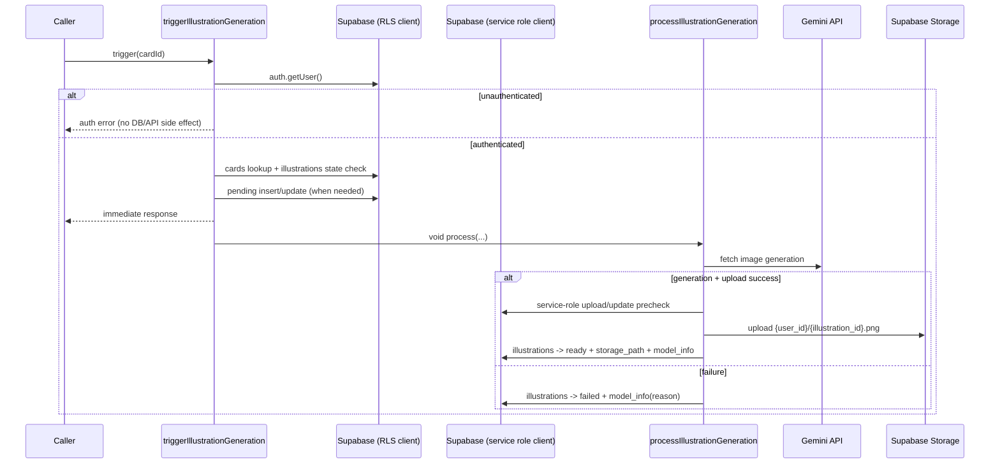

# Illustration Generation Backend Design Document

## 概要

S-08 では、Gemini 画像生成と Supabase Storage キャッシュを統合したバックエンド実装を追加し、学習フローを止めない非同期イラスト生成基盤を提供する。  
MVP は Next.js `14.2.5` 前提で、Server Action 内の fire-and-forget（`void processIllustrationGeneration(...)`）を採用し、`triggerIllustrationGeneration` は生成完了待ちを行わない。

## 背景とコンテキスト

### 仕様優先順位

- 最優先: `specs/stories/S-08-illustration-generation-backend/requirements.md`（v1.0.2）
- 準拠: `specs/adr/ADR-004-illustration-generation-backend-mvp-decisions.md`
- 参考: `specs/stories/S-08-illustration-generation-backend/story.md`, `specs/epics/E-03-illustration-generation/epic.md`
- 差分解決ルール: story/epic の旧記述（`public/` パス、`after()` 前提）と要件が競合する場合は requirements + ADR を採用

### 前提となる ADR

- `specs/adr/ADR-001-project-foundation-supabase-clients.md`
  - env フェイルファスト方針と Supabase client 分離
- `specs/adr/ADR-002-database-schema-rls-access-boundary.md`
  - owner scoped private 境界（`illustrations` DB + Storage）
- `specs/adr/ADR-004-illustration-generation-backend-mvp-decisions.md`
  - S-08 の4論点（private 境界 / fire-and-forget / fetch 連携 / non-unique key 決定規則）

### 合意事項チェックリスト

#### スコープ

- [x] `triggerIllustrationGeneration(cardId)` Server Action 実装
- [x] `getIllustrationUrl(illustrationKey)` Server Action 実装
- [x] `processIllustrationGeneration(...)` 非同期処理（prompt -> Gemini -> Storage -> status 更新）
- [x] `illustrations` 状態遷移（`pending/ready/failed`）の deterministic 制御
- [x] `owner_user_id + illustration_key` での non-unique key lookup 規則固定
- [x] `GEMINI_API_KEY` 未設定時の fail-fast ではなく fail-safe（`failed` 収束 + 理由記録）

#### 非スコープ

- [x] `revealCard` 統合や UI 表示（S-09）
- [x] Queue/Worker/Edge Function 導入
- [x] Next.js 15+ `after()` への移行
- [x] 公開共有モデル（`public/` パス運用）

#### 制約

- [x] ランタイムは Next.js `14.2.5` 前提
- [x] Gemini 連携は `fetch` ベース（SDK 追加禁止）
- [x] Storage パスは `{user_id}/{illustration_id}.png` 固定
- [x] `illustration_key` は非ユニークのまま運用
- [x] Server Action の未認証呼び出しは DB副作用0件 + 外部API呼び出し0回

## 解決する問題

- 学習処理と画像生成処理を同期的に結合すると、生成遅延が UX を阻害する。
- `illustration_key` 非ユニーク前提で取得決定規則を固定しないと、環境ごとに返却行がブレる。
- 失敗時の記録が曖昧だと、運用で「なぜ failed になったか」が切り分け不能になる。
- `owner scoped private` 境界と Storage パスが不整合だと、RLS/Storage policy により 403 や漏洩リスクが発生する。

## 要件

### 機能要件

- 認証済みユーザーのみ `triggerIllustrationGeneration` を実行できる。
- 状態遷移規則:
  - `ready` / `pending`: no-op
  - `failed`: `pending` に戻して再生成
  - レコードなし: `pending` 新規作成
- 非同期起動は `void processIllustrationGeneration(...)` を採用し、Action の応答は待機しない。
- `processIllustrationGeneration` は prompt 生成、Gemini 呼び出し、Storage upload、`ready/failed` 更新を一貫実行する。
- `getIllustrationUrl` は `owner_user_id + illustration_key` で `ready` 最新1件のみを採用し、Signed URL（3600秒）を返す。

### 非機能要件

- **セキュリティ**: `illustrations` DB/Storage は owner scoped private を維持する。
- **信頼性**: 非同期処理失敗時は `status='failed'` + `model_info` 理由記録で終状態を保証する。
- **性能**: `triggerIllustrationGeneration` の応答は生成完了待ちを行わず p95 300ms 以内を目標とする。
- **性能**: `getIllustrationUrl` の lookup + Signed URL 発行は p95 150ms 以内を目標とする。
- **保守性**: 外部依存を追加せず、`frontend/src/actions` と `frontend/src/lib` の既存構造に統合する。

## 受入条件（EARS, 要件 AC-01〜AC-14 準拠）

- AC-01（遍在型）: システムは `illustrations` を owner scoped private として扱い、`owner_user_id` を NULL 不可で運用すること。
- AC-02（遍在型）: システムは Storage オブジェクト名を `{user_id}/{illustration_id}.png` のみで生成すること。
- AC-03（契機型）: `triggerIllustrationGeneration(cardId)` が未認証で呼び出されたとき、システムは認証エラーを返し、DB副作用0件・外部API呼び出し0回で終了すること。
- AC-04（状態型）: もし対象レコードが `ready` または `pending` の間、システムは新規生成処理を開始しないこと。
- AC-05（状態型）: もし対象レコードが `failed` の間、システムは `pending` に更新して再生成を開始すること。
- AC-06（契機型）: 対象レコードが存在しない状態でトリガーされたとき、システムは `pending` を INSERT して生成を開始すること。
- AC-07（遍在型）: システムは Next.js 14.2.5 で `void processIllustrationGeneration(...)` による fire-and-forget を実装し、レスポンスを生成完了まで待たないこと。
- AC-08（選択型）: もし `GEMINI_API_KEY` が未設定なら、システムは Gemini API を呼び出さず、`status='failed'` と `model_info` 理由記録を行うこと。
- AC-09（遍在型）: システムは Gemini 連携を `fetch` ベースで実装し、新規 SDK 依存を追加しないこと。
- AC-10（契機型）: 画像生成と Storage アップロードが成功したとき、システムは `status='ready'`, `storage_path`, `prompt`, `model_info` を更新すること。
- AC-11（不測型）: もし Gemini 呼び出しまたは Storage アップロードが失敗した場合、システムは `status='failed'` に遷移し `model_info` に失敗理由を記録すること。
- AC-12（条件型）: もし `getIllustrationUrl(illustrationKey)` が呼び出されたなら、システムは `owner_user_id + illustration_key` で `status='ready'` かつ `storage_path IS NOT NULL` を `updated_at DESC, id DESC` で並べて最新1件のみを採用し、`expiresIn=3600` で Signed URL を発行すること。
- AC-13（不測型）: もし AC-12 条件一致が0件なら、システムは `null` を返すこと。
- AC-14（遍在型）: システムは `sanitizePromptInput` によって制御文字除去と100文字上限を適用した入力のみを Gemini に渡すこと。

## 既存コードベース分析

### 調査サマリ

- `frontend/src/lib/env.ts` と `frontend/src/lib/supabase/server.ts` は既存で、S-08 の環境変数取得・Supabase統合の接続点になる。
- `frontend/src/actions` には auth actions が存在し、Server Action 実装パターン（型戻り値、redirect 以外は state を返す）を再利用できる。
- `frontend/src/types/database.ts` に `public.illustrations` 型契約は既に存在する。
- S-08 専用の `illustration` 実装ファイルは未作成のため、新規追加が必要。

### 実装対象ファイル一覧（現行コードベースの既存パス配下）

| 種別 | パス | 役割 |
|---|---|---|
| 既存（更新） | `frontend/src/lib/env.ts` | `geminiApiKey` 読み出し追加（必須ではなく optional） |
| 既存（更新） | `frontend/src/lib/env.test.ts` | `GEMINI_API_KEY` optional 契約テストを追加 |
| 既存（更新） | `frontend/.env.local.example` | `GEMINI_API_KEY=` のサンプル追加（optional） |
| 既存（更新） | `frontend/src/lib/supabase/server.ts` | Server Action 向け client と非同期処理向け service role client 境界を定義 |
| 既存（更新） | `frontend/vitest.config.ts` | `S-08` 配下 integration/e2e skeleton テストの include 設定追加 |
| 新規 | `frontend/src/actions/illustration-actions.ts` | `triggerIllustrationGeneration`, `getIllustrationUrl` Server Actions |
| 新規 | `frontend/src/actions/illustration-actions.test.ts` | action 状態遷移と認証境界テスト |
| 新規 | `frontend/src/lib/illustration/prompt.ts` | prompt 生成 + sanitize |
| 新規 | `frontend/src/lib/illustration/gemini-client.ts` | `fetch` ベース Gemini 呼び出し |
| 新規 | `frontend/src/lib/illustration/storage.ts` | upload / signed URL ラッパ |
| 新規 | `frontend/src/lib/illustration/generator.ts` | 非同期生成統合処理 |
| 新規 | `frontend/src/lib/illustration/types.ts` | `model_info` 構造・失敗理由 enum |
| 新規（テスト） | `frontend/src/lib/illustration/prompt.test.ts` | sanitize 契約（AC-14） |
| 新規（テスト） | `frontend/src/lib/illustration/gemini-client.test.ts` | 成功/失敗分類（AC-08/09/11） |
| 新規（テスト） | `frontend/src/lib/illustration/generator.test.ts` | ready/failed 更新分岐（AC-10/11） |
| 新規（統合） | `specs/stories/S-08-illustration-generation-backend/tests/illustration-generation-backend.int.test.ts` | AC-01〜AC-14 統合検証 |
| 新規（E2E骨格） | `specs/stories/S-08-illustration-generation-backend/tests/illustration-generation-backend.e2e.test.ts` | 統合点E2Eシナリオ骨格 |
| 新規（トレース） | `specs/stories/S-08-illustration-generation-backend/tests/s08-traceability.md` | AC -> テストID マッピング |

### 統合ポイント（env.ts / supabase server client / actions）

| 統合ポイント | 既存基盤 | S-08 での追加契約 |
|---|---|---|
| `env.ts` | `getEnvConfig()` が Supabase必須キーを返す | `geminiApiKey?: string` を追加し、未設定時は throw せず `undefined` を返す |
| `supabase server client` | `createServerClient()`（cookie + anon key） | Action層は `createServerClient()` で認証/RLS境界を使い、非同期処理は service role client で DB/Storage 更新を完結 |
| `actions` | `auth-actions.ts` 実装パターン | `illustration-actions.ts` を追加し、認証境界・状態遷移・fire-and-forget起動を統合 |

## 設計

### 実装アプローチ

**選択アプローチ: ハイブリッド（Action主導 + 非同期処理分離）**

1. Action で認証・カード解決・`pending` 管理を deterministic に実施する。  
2. 生成本体は `processIllustrationGeneration` に分離し、`void` 起動で Action レイテンシを隔離する。  
3. 失敗理由は `model_info` に統一形式で記録し、調査容易性を維持する。

### 技術的依存関係と実装制約

1. `env.ts` 拡張（`geminiApiKey` optional）を先に実装する。
2. `supabase server client` の責務分離（Action/RLS用と非同期更新用）を固定する。
3. `prompt` -> `gemini-client` -> `storage` -> `generator` の順で下位モジュールを実装する。
4. `illustration-actions.ts` で状態遷移 + fire-and-forget を実装する。
5. `frontend/vitest.config.ts` に `S-08` tests の include を追加する。
6. 単体 -> 統合 -> E2E skeleton の順で検証する。

### 変更影響マップ

```yaml
変更対象: illustration generation backend (actions + lib + env/supabase integration)
直接影響:
  - frontend/src/lib/env.ts
  - frontend/.env.local.example
  - frontend/src/lib/supabase/server.ts
  - frontend/vitest.config.ts
  - frontend/src/actions/illustration-actions.ts
  - frontend/src/lib/illustration/*
  - specs/stories/S-08-illustration-generation-backend/tests/*
間接影響:
  - S-09 の revealCard が参照する getIllustrationUrl 契約
  - Supabase Storage objects のパス命名規則準拠率
  - Gemini 障害時の運用トリアージ（model_info 依存）
波及なし:
  - S-03 認証画面/UI
  - S-04 seed/date utilities
  - S-02 schema/RLS 定義そのもの（契約は再利用）
```

### アーキテクチャ概要

```mermaid
flowchart TD
  UI[S-09 or future caller] --> ACT[Server Action<br/>triggerIllustrationGeneration]
  ACT --> AUTH[createServerClient().auth.getUser]
  ACT --> DB1[(public.cards / public.illustrations)]
  ACT -->|void| GEN[processIllustrationGeneration]

  GEN --> PROMPT[prompt.ts<br/>generate + sanitize]
  PROMPT --> GEMINI[gemini-client.ts<br/>fetch call]
  GEMINI --> STORAGE[storage.ts<br/>upload to illustrations bucket]
  STORAGE --> DB2[(public.illustrations update)]

  UI --> GETURL[Server Action<br/>getIllustrationUrl]
  GETURL --> DB3[(public.illustrations lookup)]
  GETURL --> STORAGE
```

### データフロー



### Next.js 14.2.5 fire-and-forget 具体化

#### 実装規約

- `triggerIllustrationGeneration` 内では **必ず** `void processIllustrationGeneration(args).catch(...)` で起動する。
- Action 戻り値は生成完了を待たずに返し、待機系 API（`after()`, `waitUntil`, queue）は使わない。
- detached Promise の unhandled rejection を防ぐため、`catch` で例外を吸収しログ化する。
- `pending` 行の作成/更新は fire-and-forget 起動前に確定し、呼び出し直後に状態観測できるようにする。

#### 擬似コード

```typescript
export async function triggerIllustrationGeneration(cardId: string): Promise<TriggerResult> {
  const supabase = createServerClient()
  const { data: userData } = await supabase.auth.getUser()
  if (!userData.user) return { ok: false, code: "unauthorized" }

  const preparation = await prepareIllustrationRecord({ supabase, cardId, userId: userData.user.id })
  if (!preparation.shouldStart) return { ok: true, started: false }

  void processIllustrationGeneration(preparation.args).catch((error) => {
    console.error("S-08 detached generation failed", {
      illustrationId: preparation.args.illustrationId,
      error,
    })
  })

  return { ok: true, started: true }
}
```

### データ契約（illustrations row / model_info / storage path / non-unique key lookup）

#### 1) `illustrations` row 契約

| フィールド | 型 | 必須 | 契約 |
|---|---|---|---|
| `id` | uuid | yes | 生成対象識別子。Storage名の末尾に使用 |
| `owner_user_id` | uuid | yes | 認証ユーザーID。RLS/Storage境界の主軸 |
| `illustration_key` | text | yes | 非ユニーク。検索条件として owner と組み合わせる |
| `status` | text | yes | `pending` / `ready` / `failed` |
| `storage_path` | text \| null | conditional | `ready` のとき非NULL必須 |
| `prompt` | text \| null | should | サニタイズ済み prompt を保存 |
| `model_info` | text \| null | yes | JSON文字列で成功/失敗理由を保存 |
| `updated_at` | timestamptz | yes | 最新判定の一次ソートキー |

#### 2) `model_info` 契約（text カラムに JSON 文字列で保存）

```json
{
  "provider": "gemini",
  "model": "gemini-2.0-flash-preview-image-generation",
  "outcome": "ready | failed",
  "reason": "success | api_key_missing | rate_limit | safety | network | storage_upload_failed | unknown",
  "httpStatus": 200,
  "requestId": "optional-string",
  "timestamp": "2026-02-24T12:34:56.000Z"
}
```

#### 3) Storage path 契約

- 形式: `{owner_user_id}/{illustration_id}.png`
- 例: `cb6a1a0d-.../21a9c2d4-....png`
- 禁止: `public/` プレフィックス、拡張子なし、`owner_user_id` 以外の先頭セグメント

#### 4) non-unique key lookup 契約

```sql
SELECT id, storage_path
FROM public.illustrations
WHERE owner_user_id = :auth_user_id
  AND illustration_key = :illustration_key
  AND status = 'ready'
  AND storage_path IS NOT NULL
ORDER BY updated_at DESC, id DESC
LIMIT 1;
```

- 0件時: `null`
- 1件以上時: 最新1件のみで Signed URL を発行（`expiresIn = 3600`）

### インターフェース変更マトリクス

| 区分 | インターフェース | 変更種別 | 変換必要性 | 互換性確保 |
|---|---|---|---|---|
| 既存 | `getEnvConfig()` | 更新 | なし | 既存必須キー契約を維持しつつ `geminiApiKey` を追加 |
| 既存 | `createServerClient()` | 利用拡張 | なし | 既存 auth-actions と同じ呼び出し形を維持 |
| 新規 | `triggerIllustrationGeneration(cardId)` | 追加 | なし | Server Action export を固定 |
| 新規 | `getIllustrationUrl(illustrationKey)` | 追加 | なし | `Promise<string | null>` 契約を固定 |
| 新規 | `processIllustrationGeneration(args)` | 追加 | なし | Action から `void` 起動する非同期専用関数 |

### 統合点一覧

| 統合点 | 場所 | 旧実装 | 新実装 | 切り替え方法 |
|---|---|---|---|---|
| env integration | `frontend/src/lib/env.ts` | Supabaseキーのみ | `geminiApiKey` optional 追加 | `getEnvConfig()` 経由参照 |
| Supabase auth boundary | `frontend/src/lib/supabase/server.ts` + `illustration-actions.ts` | auth-actions のみ | illustration actions が同パターンで認証確認 | `createServerClient().auth.getUser()` |
| 非同期起動境界 | `frontend/src/actions/illustration-actions.ts` | 該当なし | `void processIllustrationGeneration(...)` | fire-and-forget |
| 生成処理統合 | `frontend/src/lib/illustration/generator.ts` | 該当なし | prompt/gemini/storage/db update を直列化 | 単一エントリ関数化 |
| URL返却境界 | `frontend/src/actions/illustration-actions.ts` + `storage.ts` | 該当なし | latest ready 1件 -> signed URL | lookup query + `createSignedUrl` |

## 統合点での E2E 確認手順

1. 未認証で `triggerIllustrationGeneration` を呼び、認証エラーと DB/API副作用0件を確認する。  
2. 認証済みでレコードなしキーをトリガーし、即時応答 + `pending` 作成 + 非同期起動を確認する。  
3. `ready` レコード存在時に再トリガーし、追加生成が発生しないことを確認する。  
4. `failed` レコード存在時に再トリガーし、`pending` へ戻して再生成を開始することを確認する。  
5. `GEMINI_API_KEY` 未設定で実行し、Gemini呼び出し0回・`failed`・`model_info.reason=api_key_missing` を確認する。  
6. 同一 `illustration_key` の複数 ready 行を作成し、`getIllustrationUrl` が `updated_at DESC, id DESC` の最新1件のみを返し、`expiresIn=3600` で Signed URL を生成することを確認する。  
7. 一致0件ケースで `getIllustrationUrl` が `null` を返すことを確認する。

## AC トレーサビリティ（AC-01〜AC-14）

| AC | 実装成果物 | 検証ポイント |
|---|---|---|
| AC-01 | `illustration-actions.ts`, `generator.ts` | `owner_user_id` 必須で行を扱う |
| AC-02 | `storage.ts`, `generator.ts` | 保存パスが常に `{user_id}/{illustration_id}.png` |
| AC-03 | `illustration-actions.ts` | 未認証時の no-side-effect |
| AC-04 | `illustration-actions.ts` | `ready/pending` で no-op |
| AC-05 | `illustration-actions.ts` | `failed -> pending` 再始動 |
| AC-06 | `illustration-actions.ts` | レコードなしで `pending` INSERT |
| AC-07 | `illustration-actions.ts` | `void process...` で応答非ブロック |
| AC-08 | `env.ts`, `generator.ts`, `gemini-client.ts` | key未設定時に failed + reason 記録 |
| AC-09 | `gemini-client.ts` | `fetch` のみで連携し SDK 追加なし |
| AC-10 | `generator.ts`, `storage.ts` | 成功時に ready + 保存情報更新 |
| AC-11 | `generator.ts` | 失敗時に failed + reason 記録 |
| AC-12 | `illustration-actions.ts` | owner+key lookup + 最新1件採用 + `expiresIn=3600` |
| AC-13 | `illustration-actions.ts` | 一致なしで `null` |
| AC-14 | `prompt.ts` | 制御文字除去 + 100文字制限 |

### AC -> テストケースID マッピング（unit / integration / e2e）

| AC | Unit | Integration | E2E |
|---|---|---|---|
| AC-01 | UT-AC01-OWNER-SCOPED-ROW | IT-AC01-OWNER-SCOPED-ROW | E2E-AC01-OWNER-SCOPE |
| AC-02 | UT-AC02-STORAGE-PATH-FORMAT | IT-AC02-STORAGE-PATH-FORMAT | E2E-AC02-STORAGE-PATH |
| AC-03 | UT-AC03-UNAUTH-NO-SIDE-EFFECT | IT-AC03-UNAUTH-NO-SIDE-EFFECT | E2E-AC03-UNAUTH-TRIGGER |
| AC-04 | UT-AC04-READY-PENDING-NOOP | IT-AC04-READY-PENDING-NOOP | E2E-AC04-NOOP |
| AC-05 | UT-AC05-FAILED-RETRY-PENDING | IT-AC05-FAILED-RETRY-PENDING | E2E-AC05-FAILED-RETRY |
| AC-06 | UT-AC06-MISSING-INSERT-PENDING | IT-AC06-MISSING-INSERT-PENDING | E2E-AC06-MISSING-CREATE |
| AC-07 | UT-AC07-FIRE-AND-FORGET | IT-AC07-FIRE-AND-FORGET-LATENCY | E2E-AC07-NONBLOCKING |
| AC-08 | UT-AC08-APIKEY-MISSING | IT-AC08-APIKEY-MISSING | E2E-AC08-APIKEY-MISSING |
| AC-09 | UT-AC09-FETCH-ONLY | IT-AC09-FETCH-ONLY | E2E-AC09-DEPENDENCY-CHECK |
| AC-10 | UT-AC10-SUCCESS-READY-UPDATE | IT-AC10-SUCCESS-READY-UPDATE | E2E-AC10-SIGNED-URL-READY |
| AC-11 | UT-AC11-FAIL-FAILED-UPDATE | IT-AC11-FAIL-FAILED-UPDATE | E2E-AC11-FAILED-VISIBILITY |
| AC-12 | UT-AC12-LATEST-READY-LOOKUP | IT-AC12-LATEST-READY-LOOKUP | E2E-AC12-LATEST-RETURN |
| AC-13 | UT-AC13-NO-MATCH-NULL | IT-AC13-NO-MATCH-NULL | E2E-AC13-NO-MATCH |
| AC-14 | UT-AC14-SANITIZE-INPUT | IT-AC14-SANITIZE-INPUT | E2E-AC14-SANITIZE-BOUNDARY |

## テスト戦略

### 単体テスト

- `prompt.test.ts`: sanitize 契約（制御文字除去、100文字上限）
- `gemini-client.test.ts`: `fetch` 成功・rate limit・safety・network 失敗分類
- `generator.test.ts`: success/failed 分岐と `model_info` 記録
- `illustration-actions.test.ts`: 認証境界、状態遷移、lookup 規則、fire-and-forget 起動
- `env.test.ts`: `GEMINI_API_KEY` optional 契約

### 統合テスト

- `illustration-generation-backend.int.test.ts` で AC-01〜AC-14 を検証する。
- DB副作用件数、外部API呼び出し回数、storage path 形式、latest ready lookup を実測する。
- `processIllustrationGeneration` に遅延を入れて、Action 応答時間（p95 <= 300ms）を確認する。

### E2E テスト

- `illustration-generation-backend.e2e.test.ts` は実運用導線に近い形で「トリガー -> 遅延後 URL 取得」を検証する骨格とする。
- S-09 実装後、reveal 経由での実シナリオに拡張する。

## リスクと対策

| リスク | 影響度 | 発生確率 | 軽減策 |
|---|---|---|---|
| fire-and-forget 実行中にプロセス停止し `pending` が残留 | 中 | 中 | `failed` 収束ロジックと将来 queue 移行前提を明記 |
| key未設定検知を env 必須チェックに混ぜて起動失敗 | 高 | 中 | `geminiApiKey` を optional として扱う |
| non-unique key で返却行が揺れる | 高 | 中 | `updated_at DESC, id DESC` を契約化しテスト固定 |
| Storage パスの prefix 不整合で policy 403 | 高 | 中 | path builder を単一実装に集約し AC で検証 |

## 参考資料

- `specs/stories/S-08-illustration-generation-backend/requirements.md`
- `specs/adr/ADR-004-illustration-generation-backend-mvp-decisions.md`
- `specs/adr/ADR-002-database-schema-rls-access-boundary.md`
- `supabase/migrations/20260223000000_s02_schema_rls.sql`
- `supabase/migrations/20260223000001_s02_storage_illustrations.sql`
- `frontend/package.json`（Next.js `^14.2.5`）

## 変更履歴

| 日付 | 版 | 変更内容 | 作成者 |
|---|---|---|---|
| 2026-02-24 | 1.0.0 | 初版作成（S-08 Design Doc: create mode） | Codex |
