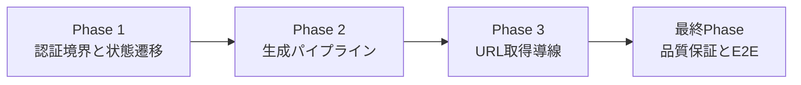
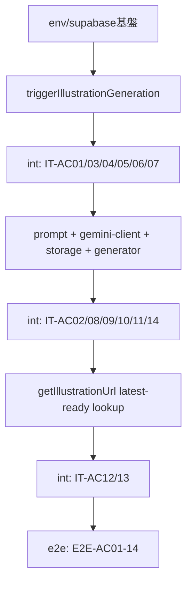

# 作業計画書: illustration-generation-backend

作成日: 2026-02-24
種別: feature
想定影響範囲: frontend Server Actions + illustration library + S-08 story tests
関連Issue/PR: 未設定

## 関連ドキュメント
- ADR: `specs/adr/ADR-004-illustration-generation-backend-mvp-decisions.md`
- 要件定義書: `specs/stories/S-08-illustration-generation-backend/requirements.md`
- Design Doc: `specs/stories/S-08-illustration-generation-backend/design.md`
- 統合テスト骨子: `specs/stories/S-08-illustration-generation-backend/tests/illustration-generation-backend.int.test.ts`
- E2Eテスト骨子: `specs/stories/S-08-illustration-generation-backend/tests/illustration-generation-backend.e2e.test.ts`

## 目的
Gemini 画像生成と Supabase Storage キャッシュを非同期で統合し、`triggerIllustrationGeneration` の応答をブロックしないまま `illustrations` の状態遷移（`pending/ready/failed`）と owner scoped private 境界を成立させる。

## 計画ルール（前工程テスト情報の反映）
- [ ] 統合テスト `specs/stories/S-08-illustration-generation-backend/tests/illustration-generation-backend.int.test.ts` は Phase 1〜3 の各実装と同時に `it.todo` を実装し、同じPhase内で実行・合格させる
- [ ] E2Eテスト `specs/stories/S-08-illustration-generation-backend/tests/illustration-generation-backend.e2e.test.ts` は全実装完了後の最終Phaseでのみ実行する

## 影響範囲
### 対象ファイル
- [ ] `frontend/src/lib/env.ts`
- [ ] `frontend/src/lib/env.test.ts`
- [ ] `frontend/.env.local.example`
- [ ] `frontend/src/lib/supabase/server.ts`
- [ ] `frontend/vitest.config.ts`
- [ ] `frontend/src/actions/illustration-actions.ts`
- [ ] `frontend/src/actions/illustration-actions.test.ts`
- [ ] `frontend/src/lib/illustration/prompt.ts`
- [ ] `frontend/src/lib/illustration/prompt.test.ts`
- [ ] `frontend/src/lib/illustration/gemini-client.ts`
- [ ] `frontend/src/lib/illustration/gemini-client.test.ts`
- [ ] `frontend/src/lib/illustration/storage.ts`
- [ ] `frontend/src/lib/illustration/generator.ts`
- [ ] `frontend/src/lib/illustration/generator.test.ts`
- [ ] `frontend/src/lib/illustration/types.ts`
- [ ] `specs/stories/S-08-illustration-generation-backend/tests/illustration-generation-backend.int.test.ts`
- [ ] `specs/stories/S-08-illustration-generation-backend/tests/illustration-generation-backend.e2e.test.ts`
- [ ] `specs/stories/S-08-illustration-generation-backend/tests/s08-traceability.md`

### テストファイル
- [ ] `frontend/src/lib/env.test.ts`
- [ ] `frontend/src/actions/illustration-actions.test.ts`
- [ ] `frontend/src/lib/illustration/prompt.test.ts`
- [ ] `frontend/src/lib/illustration/gemini-client.test.ts`
- [ ] `frontend/src/lib/illustration/generator.test.ts`
- [ ] `specs/stories/S-08-illustration-generation-backend/tests/illustration-generation-backend.int.test.ts`
- [ ] `specs/stories/S-08-illustration-generation-backend/tests/illustration-generation-backend.e2e.test.ts`

## フェーズ構成

### フェーズ構成図

### タスク依存関係図

### フェーズ依存関係
- [ ] Phase 2 着手条件: Phase 1 の統合テスト（`IT-AC01/03/04/05/06/07`）が合格している
- [ ] Phase 3 着手条件: Phase 2 の統合テスト（`IT-AC02/08/09/10/11/14`）が合格している
- [ ] 最終Phase 着手条件: Phase 1〜3 の実装・単体テスト・統合テストがすべて完了している

### Phase 1: 認証境界と状態遷移
**目的**: `triggerIllustrationGeneration` の認証境界と `illustrations` 状態遷移規則（no-op / retry / insert）を確定する。

#### タスク
- [ ] `GEMINI_API_KEY` の optional 取得契約を追加する
  - 実装: `frontend/src/lib/env.ts`, `frontend/.env.local.example`
  - テスト: `frontend/src/lib/env.test.ts`
- [ ] Server Action / 非同期処理で利用する Supabase クライアント境界を定義する
  - 実装: `frontend/src/lib/supabase/server.ts`
  - テスト: `frontend/src/actions/illustration-actions.test.ts`
- [ ] `triggerIllustrationGeneration(cardId)` の認証チェックと状態遷移（`ready/pending` no-op, `failed` retry, missing insert）を実装する
  - 実装: `frontend/src/actions/illustration-actions.ts`
  - テスト: `frontend/src/actions/illustration-actions.test.ts`
- [ ] `void processIllustrationGeneration(...).catch(...)` の fire-and-forget 起動を実装する
  - 実装: `frontend/src/actions/illustration-actions.ts`
  - テスト: `frontend/src/actions/illustration-actions.test.ts`
- [ ] 統合テスト（Phase 1対象）を同時実装・実行する
  - テスト: `specs/stories/S-08-illustration-generation-backend/tests/illustration-generation-backend.int.test.ts`
  - 対象: `IT-AC01`, `IT-AC03`, `IT-AC04`, `IT-AC05`, `IT-AC06`, `IT-AC07`

#### フェーズ完了条件（Design AC由来）
- [ ] AC-01: owner scoped private 境界で `owner_user_id` 必須運用を維持する
- [ ] AC-03: 未認証呼び出しで認証エラー + DB副作用0件 + 外部API呼び出し0回を満たす
- [ ] AC-04: `ready/pending` の再トリガーで新規生成を開始しない
- [ ] AC-05: `failed` の再トリガーで `pending` へ戻し再生成開始する
- [ ] AC-06: 対象レコードなしで `pending` を新規作成して生成開始する
- [ ] AC-07: `triggerIllustrationGeneration` が生成完了待ちをせず応答する

#### 動作確認手順
1. 未認証・認証済み両ケースで `triggerIllustrationGeneration` の戻り値と DB 更新件数を確認する。
2. `ready/pending/failed/recordなし` の4状態を fixture で再現し、遷移契約を確認する。
3. `IT-AC01/03/04/05/06/07` を実装した統合テストを実行し、同Phase内で合格させる。

#### 停止ポイント（品質固定）
- [ ] Phase 1 対象統合テストが PASS した状態を保存する

### Phase 2: 生成パイプライン
**目的**: `processIllustrationGeneration` の内部処理（prompt生成、Gemini fetch、Storage upload、`ready/failed` 更新）を完成させる。

#### タスク
- [ ] `sanitizePromptInput` と prompt 生成を実装する
  - 実装: `frontend/src/lib/illustration/prompt.ts`
  - テスト: `frontend/src/lib/illustration/prompt.test.ts`
- [ ] Gemini 連携を `fetch` ベースで実装し、失敗分類を `model_info` に反映できるようにする
  - 実装: `frontend/src/lib/illustration/gemini-client.ts`, `frontend/src/lib/illustration/types.ts`
  - テスト: `frontend/src/lib/illustration/gemini-client.test.ts`
- [ ] Storage アップロード処理と `{user_id}/{illustration_id}.png` パス生成を実装する
  - 実装: `frontend/src/lib/illustration/storage.ts`
  - テスト: `frontend/src/lib/illustration/generator.test.ts`
- [ ] 生成統合処理 `processIllustrationGeneration` を実装する（成功時 `ready`、失敗時 `failed` + 理由）
  - 実装: `frontend/src/lib/illustration/generator.ts`
  - テスト: `frontend/src/lib/illustration/generator.test.ts`
- [ ] 統合テスト（Phase 2対象）を同時実装・実行する
  - テスト: `specs/stories/S-08-illustration-generation-backend/tests/illustration-generation-backend.int.test.ts`
  - 対象: `IT-AC02`, `IT-AC08`, `IT-AC09`, `IT-AC10`, `IT-AC11`, `IT-AC14`

#### フェーズ完了条件（Design AC由来）
- [ ] AC-02: Storage オブジェクト名が常に `{user_id}/{illustration_id}.png` 形式を満たす
- [ ] AC-08: `GEMINI_API_KEY` 未設定時に外部API呼び出し0回で `failed` + 理由記録を満たす
- [ ] AC-09: Gemini 連携が `fetch` 実装であり新規SDK依存が追加されていない
- [ ] AC-10: 生成成功時に `status='ready'`, `storage_path`, `prompt`, `model_info` を更新する
- [ ] AC-11: Gemini/Storage 失敗時に `status='failed'` + 失敗理由を記録する
- [ ] AC-14: 制御文字除去と100文字上限を適用した入力のみを Gemini に渡す

#### 動作確認手順
1. Gemini 成功/失敗、Storage 失敗、APIキー未設定の各ケースで `model_info.reason` と `status` を確認する。
2. アップロードされた object key が `{user_id}/{illustration_id}.png` 形式であることを確認する。
3. `IT-AC02/08/09/10/11/14` を実装した統合テストを実行し、同Phase内で合格させる。

#### 停止ポイント（品質固定）
- [ ] Phase 2 対象統合テストが PASS した状態を保存する

### Phase 3: URL取得導線
**目的**: `getIllustrationUrl(illustrationKey)` の決定規則（owner + key + latest ready 1件）と `null` 返却契約を確定する。

#### タスク
- [x] `getIllustrationUrl(illustrationKey)` を実装する（`updated_at DESC, id DESC`, `expiresIn=3600`）
  - 実装: `frontend/src/actions/illustration-actions.ts`
  - テスト: `frontend/src/actions/illustration-actions.test.ts`
- [x] 同一 `illustration_key` 複数行の tie-break 条件を unit で固定する
  - 実装: `frontend/src/actions/illustration-actions.test.ts`
  - テスト: `frontend/src/actions/illustration-actions.test.ts`
- [x] ACトレーサビリティファイルを更新する
  - 実装: `specs/stories/S-08-illustration-generation-backend/tests/s08-traceability.md`
- [x] 統合テスト（Phase 3対象）を同時実装・実行する
  - テスト: `specs/stories/S-08-illustration-generation-backend/tests/illustration-generation-backend.int.test.ts`
  - 対象: `IT-AC12`, `IT-AC13`
- [x] 統合テストを全件再実行して退行がないことを確認する
  - テスト: `specs/stories/S-08-illustration-generation-backend/tests/illustration-generation-backend.int.test.ts`

#### フェーズ完了条件（Design AC由来）
- [x] AC-12: owner + key 条件で `ready` 最新1件のみを採用し Signed URL（3600秒）を返す
- [x] AC-13: 条件一致0件で `null` を返す

#### 動作確認手順
1. 同一 `illustration_key` で `updated_at` 同値ケースを含む fixture を投入し、`id DESC` タイブレークを確認する。
2. `ready` かつ `storage_path` 非NULL 条件の絞り込みを確認する。
3. `IT-AC12/13` を実装した統合テストと統合テスト全件を実行し、合格を確認する。

#### 停止ポイント（品質固定）
- [x] Phase 3 対象統合テストが PASS した状態を保存する

---

### 最終Phase: 品質保証・E2E実行（必須）
**目的**: 全ACの受入証跡を確定し、S-08 を完了判定できる状態にする。

#### タスク
- [ ] E2Eテスト（`E2E-AC01`〜`E2E-AC14`）を実装する
  - テスト: `specs/stories/S-08-illustration-generation-backend/tests/illustration-generation-backend.e2e.test.ts`
- [ ] 全実装完了後にのみ E2E を実行する（計画ルール準拠）
  - テスト: `specs/stories/S-08-illustration-generation-backend/tests/illustration-generation-backend.e2e.test.ts`
- [ ] 統合テストを全件実行し、Phase 1〜3 の退行がないことを確認する
  - テスト: `specs/stories/S-08-illustration-generation-backend/tests/illustration-generation-backend.int.test.ts`
- [ ] frontend 品質ゲートを実行する
  - コマンド: `npm run check --prefix frontend`
- [ ] Story / Requirements / ADR / Design / 実装 / テストのトレーサビリティを整理する

#### フェーズ完了条件
- [ ] E2E-AC01〜E2E-AC14 が PASS する
- [ ] AC-01〜AC-14 の検証結果がテストログと成果物で追跡可能である
- [ ] 統合テスト同時実施・E2E最終実施のルールを満たしている

#### 動作確認手順
1. `illustration-generation-backend.int.test.ts` をフル実行して全PASSを確認する。
2. `illustration-generation-backend.e2e.test.ts` を実行し、主要導線（trigger -> 状態遷移 -> getIllustrationUrl）を確認する。
3. `npm run check --prefix frontend` を実行し、lint/typecheck/test の通過を確認する。

## AC別完了チェックリスト
- [ ] AC-01: owner scoped private 境界と `owner_user_id` 必須運用
- [ ] AC-02: Storage パス `{user_id}/{illustration_id}.png` 固定
- [ ] AC-03: 未認証 trigger は認証エラー + DB副作用0件 + 外部API 0回
- [ ] AC-04: `ready/pending` 再トリガー no-op
- [ ] AC-05: `failed` 再トリガーで `pending` へ戻して再生成
- [ ] AC-06: レコードなし時の `pending` INSERT + 生成開始
- [ ] AC-07: fire-and-forget（`void processIllustrationGeneration(...)`）で非ブロッキング応答
- [ ] AC-08: APIキー未設定時に外部API未呼び出し + `failed` + 理由記録
- [ ] AC-09: Gemini `fetch` 連携（SDK依存追加なし）
- [ ] AC-10: 成功時 `ready` + `storage_path/prompt/model_info` 更新
- [ ] AC-11: 失敗時 `failed` + `model_info` 失敗理由記録
- [x] AC-12: latest-ready 1件採用（`updated_at DESC, id DESC`）で Signed URL 返却
- [x] AC-13: 条件一致なしで `null` 返却
- [ ] AC-14: `sanitizePromptInput` の制御文字除去 + 100文字上限

## リスクと対策
- [ ] リスク: fire-and-forget 中の例外が未処理で欠落する  
      対策: `void process...catch(...)` を必須化し、失敗時 `failed` 収束とログ出力を検証する
- [ ] リスク: `GEMINI_API_KEY` の必須化回帰で起動不能になる  
      対策: `env.ts` を optional 契約に固定し、未設定時の fail-safe を AC-08 で保証する
- [ ] リスク: Storage パス逸脱で policy 403 が発生する  
      対策: path builder を単一実装に集約し、AC-02 テストで形式を固定する
- [ ] リスク: non-unique key で返却対象が揺れる  
      対策: `updated_at DESC, id DESC` 規則を unit/integration で固定し、AC-12 で検証する
- [ ] リスク: 統合テストの実装後倒しで欠陥が終盤集中する  
      対策: 各Phaseの停止ポイントを「対象統合テストPASS」に固定する
