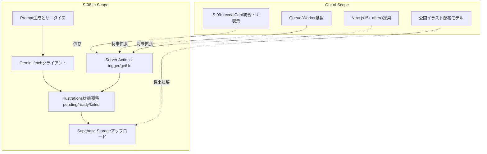
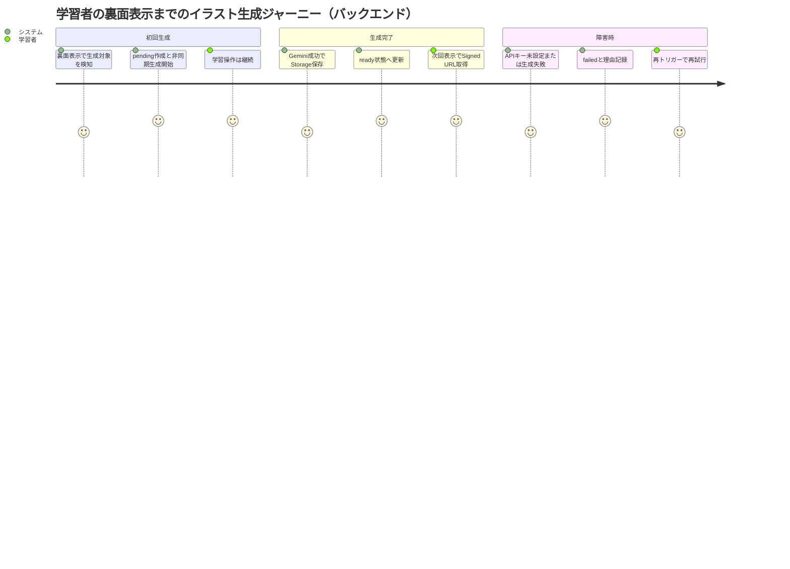

# 要件定義書: illustration-generation-backend

## 1. 概要

### 1行要約
Gemini画像生成とSupabase Storageキャッシュを統合し、学習フローを止めない非同期イラスト生成バックエンドを提供する。

### 背景
E-03では、答え合わせ時の視覚補助としてイラスト生成が必要である。一方で、S-02/ADR-002で確定した owner scoped private 境界を崩すとRLS・Storageポリシーと不整合になるため、S-08は既存境界を維持したまま生成基盤のみを提供する。

## 2. ユーザーストーリー

### プライマリーユーザー
- 学習アプリ利用者（答え合わせ時にイラストを受け取りたい）
- 開発者（生成失敗時でも学習を継続可能な状態管理を実装したい）

### ユーザーストーリー
```
As a learner
I want illustration generation to run asynchronously in the backend
So that my study flow continues while illustrations are generated and cached safely
```

### ユースケース
1. カード裏面表示前後にイラスト未生成なら、生成をバックグラウンド開始し、学習操作自体は即時継続できる。
2. 生成済みなら `getIllustrationUrl` でSigned URLを返し、再生成せず再利用できる。
3. 生成失敗時は `failed` を保持し、再トリガー時のみ `pending` に戻して再試行できる。
4. `GEMINI_API_KEY` 未設定環境でもAPI呼び出しを行わず、失敗理由を追跡可能な状態で記録できる。

## 3. 要件

### Must（必須）
- `illustrations` は **owner scoped private** を維持し、`owner_user_id` を必須（NULL不可）として扱う。
- Storageパスは `{user_id}/{illustration_id}.png` 形式のみを採用し、`public/` 配下をMVPで使用しない。
- `triggerIllustrationGeneration(cardId)` は認証必須で動作し、未認証呼び出し時は認証エラーを返し、`illustrations` へのDB副作用を0件、外部API呼び出しを0回にする。
- `triggerIllustrationGeneration(cardId)` は認証済み時に `illustrations` の状態に応じて以下を実行する。
  - `ready`: 何もしない
  - `pending`: 何もしない
  - `failed`: `pending` へ更新して再生成開始
  - レコードなし: `pending` をINSERTして生成開始
- Next.js 14.2.5 のMVPでは、Server Action内で `void processIllustrationGeneration(...)` の fire-and-forget 方式を採用し、レスポンスを生成完了まで待たない。
- `processIllustrationGeneration(...)` は以下を一貫実行する。
  - プロンプト生成（入力サニタイズ含む）
  - Gemini画像生成呼び出し
  - Storageアップロード
  - `illustrations` の `ready/failed` 更新
- `GEMINI_API_KEY` 未設定時はGemini API呼び出しを実施せず、`failed` に遷移し、`model_info` に未設定理由を記録する。
- Gemini連携は新規SDK依存を追加せず、`fetch` ベースのクライアントで実装する。
- `illustration_key` は非ユニークを前提とし、`getIllustrationUrl(illustrationKey)` は `owner_user_id + illustration_key` で検索し、`status='ready'` かつ `storage_path IS NOT NULL` を `updated_at DESC, id DESC` で並べた最新1件のみを採用する。該当がない場合は `null` を返す。
- `model_info` には成功/失敗の根拠（例: model名、安全フィルタ拒否、ネットワークエラー、環境変数未設定）を追跡可能な形で記録する。

### Should（望ましい）
- `prompt` は後続監査用に保存し、個人情報や機密情報を含まない形に正規化する。
- 生成API失敗種別（rate limit / safety / network / unknown）を `model_info` で判別可能にする。
- 同一 `illustration_key` での重複生成を最小化できるよう、`pending`/`ready` 時の再トリガーを抑止する。

### Could（あるとよい）
- 失敗時の再試行回数や最終失敗時刻を `model_info` へ含め、運用可視化を改善する。
- 画像サイズ最適化（圧縮率調整）を将来差し替え可能な設計で保持する。

### Won’t（対象外）
- `revealCard`/UI表示統合（S-09対象）。
- 画像の手動差し替え・管理画面。
- ジョブキュー/Edge Function などの専用非同期基盤導入。
- Next.js 15+ `after()` を前提にした実装。

### MVP / Future 要件マッピング
| 領域 | MVP（S-08） | Future（対象外） |
|---|---|---|
| 非同期実行方式 | Server Action内 fire-and-forget（`void process...`） | Next.js 15+ `after()`、Queue/Worker移行 |
| アクセス境界 | `illustrations` DB/Storageとも owner scoped private | 公開共有モデルの追加 |
| Storageパス | `{user_id}/{illustration_id}.png` 固定 | 公開配布用パス設計の追加 |
| Gemini連携 | `fetch` ベース（SDK非導入） | SDK導入やマルチモデル切替 |
| キー未設定時挙動 | API未呼び出し + `failed` + 理由記録 | 管理者通知や自動復旧 |

### Future注記
- Next.js 15+ `after()` 採用検討（旧AC-15相当）はFuture要件として扱い、S-08のMVP受入条件には含めない。

## 4. 非機能要件

### セキュリティ
- `GEMINI_API_KEY` はサーバー専用環境変数として扱い、クライアントへ露出しない。
- Server Actionで認証境界を確認し、他ユーザーの `illustrations` へアクセスしない。
- Storageはprivate bucket前提で、オブジェクト名先頭セグメントを `auth.uid()` と一致させる。

### 信頼性
- 生成失敗時でも `failed` へ必ず収束し、処理中断で状態不明にならない。
- `pending -> ready/failed` の終状態遷移が必ず1回以上観測できる。

### パフォーマンス
- `triggerIllustrationGeneration` のレスポンスは生成完了待ちを行わず、通常時p95 300ms以内（DB処理中心）を目標とする。
- `getIllustrationUrl` はread-only処理としてp95 150ms以内を目標とする。

### 保守性
- Gemini呼び出し層とStorage層を分離し、外部依存変更の影響局所化を可能にする。
- 外部依存追加を抑制し、既存のTypeScript/Next.js/Supabase構成で運用できる。

## 5. 成功指標

### 定量的指標
1. `triggerIllustrationGeneration` 呼び出しのうち、`pending/ready` 状態で重複生成を開始しない割合が100%であること。
2. 生成成功レコードの `storage_path` が `^{user_id}/{illustration_id}\\.png$` 形式準拠である割合が100%であること。
3. `GEMINI_API_KEY` 未設定時に外部生成APIへのリクエスト送信数が0件であること。
4. 生成失敗ケースの100%で `model_info` に失敗理由が記録されること。
5. `getIllustrationUrl` が `owner_user_id + illustration_key` 検索で `status='ready'` かつ `storage_path` 非NULLの最新1件のみを返し、該当なしで `null` を返す正答率が100%であること。

### 定性的指標
1. 開発者が要件書のみで「なぜ公開パスを使わないか」をADR-002基準で説明できること。
2. 運用者が `model_info` だけで失敗原因の一次切り分けを実施できること。

## 6. スコープ境界図



## 7. ユーザージャーニー



## 8. 既存仕様との整合理由
- **ADR-002優先**: `illustrations` はDB行/Storageオブジェクトとも owner scoped private がAcceptedであり、S-08はこの境界を維持する。
- **S-02実装整合**: `illustrations.owner_user_id` はNOT NULLで、Storage policyは `split_part(name, '/', 1) = auth.uid()::text` を要求するため、`{user_id}/{illustration_id}.png` 以外は不整合を生む。
- **記述優先順位**: 旧記述（public pathや公開共有前提）が存在しても、ADR/requirementsの確定仕様を優先する。
- **ランタイム整合**: `frontend/package.json` が Next.js 14.2.5 のため、MVPは `after()` 非依存で実装し、Futureで再評価する。

## 9. 制約・前提（Assumptions）
- A1. `illustrations` テーブルとStorage bucket `illustrations` はS-02で作成済みである。
- A2. Server Action実行時に認証済みユーザーIDを取得できる。
- A3. `model_info` は文字列カラムのため、運用上はJSON文字列化して記録してよい。
- A4. 画像フォーマットはPNGを前提とし、MVPでは固定する。
- A5. Gemini APIエンドポイント仕様変更時は、fetchクライアント実装のみ差し替える。

## 10. リスクと対策

| リスク | 影響度 | 発生確率 | 軽減策 |
|---|---|---|---|
| APIキー未設定のまま運用に入り、生成が全件失敗する | 高 | 中 | API未呼び出し+`failed`+理由記録を必須化し、検知可能状態を担保 |
| `public/` パス実装が混入しStorage policyで403が多発する | 高 | 中 | Storageパスを `{user_id}/{illustration_id}.png` に固定し、受入条件で検証 |
| 非同期処理をawaitしてレスポンス遅延が発生する | 中 | 中 | fire-and-forget要件を明文化し、レスポンスSLOを設定 |
| Gemini API障害時に失敗理由が残らず調査不能になる | 中 | 中 | `model_info` 理由記録を必須化 |
| SDK追加で依存衝突やビルドサイズ悪化が発生する | 中 | 低 | fetch方針をMust要件で固定 |

## 11. 受入条件（EARS, 測定可能）
1. AC-01（遍在型）: システムは `illustrations` を owner scoped private として扱い、`owner_user_id` をNULL不可で運用すること。
2. AC-02（遍在型）: システムはStorage保存時のオブジェクト名を常に `{user_id}/{illustration_id}.png` 形式にすること。
3. AC-03（契機型）: `triggerIllustrationGeneration(cardId)` が未認証で呼び出されたとき、システムは認証エラーを返し、DB副作用と外部API呼び出しを発生させないこと。判定指標は「戻り値のエラー種別」「`illustrations` へのINSERT/UPDATE/DELETE件数」「Gemini/Storage呼び出し回数」とし、期待値は「認証エラー」「DML 0件」「外部呼び出し0回」であること。
4. AC-04（状態型）: もし対象 `illustrations` レコードが `ready` または `pending` なら、システムは新たな生成処理を開始しないこと。判定指標は「`processIllustrationGeneration` 呼び出し回数」「`illustrations` の新規INSERT/更新件数」とし、期待値は両方とも0であること。
5. AC-05（状態型）: もし対象 `illustrations` レコードが `failed` なら、システムは `pending` へ更新して再生成を開始すること。
6. AC-06（契機型）: もし対象 `illustrations` レコードが存在しない状態でトリガーされたなら、システムは `pending` レコードを新規作成して生成を開始すること。
7. AC-07（遍在型）: システムはMVP（Next.js 14.2.5）で生成処理をServer Action内 fire-and-forget（`void processIllustrationGeneration(...)`）で起動し、完了待ちでレスポンスをブロックしないこと。判定指標は「`processIllustrationGeneration` に5秒遅延を入れた際の `triggerIllustrationGeneration` 応答時間（p95）」「応答返却時点での非同期処理完了待ち有無」とし、期待値は「p95が300ms以内」「完了待ちなし」であること。
8. AC-08（条件型）: もし `GEMINI_API_KEY` が未設定なら、システムは外部生成APIを呼び出さず、`status='failed'` とし、`model_info` に未設定理由を保存すること。
9. AC-09（遍在型）: システムはGemini連携を `fetch` ベースで実装し、新規SDK依存を追加しないこと。
10. AC-10（契機型）: 画像生成とStorageアップロードが成功したとき、システムは `status='ready'`、`storage_path`、`prompt`、`model_info` を更新すること。
11. AC-11（不測型）: もしGemini呼び出し、またはStorageアップロードが失敗したなら、システムは `status='failed'` とし、`model_info` に失敗理由を記録すること。
12. AC-12（条件型）: もし `getIllustrationUrl(illustrationKey)` が呼び出されたなら、システムは `owner_user_id + illustration_key` で検索し、`status='ready'` かつ `storage_path IS NOT NULL` の候補を `updated_at DESC, id DESC` で並べ、最新1件の `storage_path` だけを用いて有効期限3600秒のSigned URLを返すこと。
13. AC-13（不測型）: もし AC-12 の検索条件に一致するレコードが1件もないなら、システムは `getIllustrationUrl` で `null` を返すこと。
14. AC-14（遍在型）: システムは `sanitizePromptInput` により制御文字除去と最大長100文字制限を適用した入力のみを生成APIへ渡すこと。

## 12. ACトレーサビリティ（AC→検証方法→期待値）

| AC | 検証方法 | 期待値 |
|---|---|---|
| AC-01 | `illustrations` スキーマ定義とRLSポリシー検証 | `owner_user_id` がNULL不可かつowner scoped privateを維持 |
| AC-02 | Storageアップロード後のオブジェクト名をパターン検証 | 100%が `{user_id}/{illustration_id}.png` 形式 |
| AC-03 | 未認証で `triggerIllustrationGeneration` を実行し、戻り値・DB監査ログ・外部APIモックを確認 | 認証エラー、DML 0件、外部API 0回 |
| AC-04 | `ready`/`pending` のfixtureで `triggerIllustrationGeneration` を実行し、処理呼び出しとDB変更件数を確認 | `processIllustrationGeneration` 呼び出し0回、INSERT/UPDATE 0件 |
| AC-05 | `failed` fixtureで `triggerIllustrationGeneration` 実行後の状態遷移を確認 | `failed -> pending` へ更新され再生成開始 |
| AC-06 | レコードなしfixtureで `triggerIllustrationGeneration` 実行後のDBを確認 | `pending` レコードが1件作成され生成開始 |
| AC-07 | `processIllustrationGeneration` に5秒遅延を入れ、`triggerIllustrationGeneration` の応答時間を計測 | 応答p95が300ms以内、応答時に完了待ちしない |
| AC-08 | `GEMINI_API_KEY` 未設定で生成処理を実行し外部APIモックとDBを確認 | 外部API 0回、`status='failed'`、`model_info` に未設定理由 |
| AC-09 | 依存関係一覧と実装コードを確認 | Gemini連携が `fetch` のみで新規SDK追加なし |
| AC-10 | 生成成功モックで処理を完了させDBを確認 | `status='ready'`、`storage_path`、`prompt`、`model_info` が更新 |
| AC-11 | Gemini失敗/Storage失敗モックで処理を実行しDBを確認 | `status='failed'` へ遷移し `model_info` に失敗理由記録 |
| AC-12 | 同一 `illustration_key` の複数行（`updated_at` 同値ケース含む）を投入し `getIllustrationUrl` を実行 | `ready` + `storage_path` 非NULLの最新1件（`updated_at DESC, id DESC`）のみでSigned URL生成 |
| AC-13 | AC-12条件に一致しないfixtureで `getIllustrationUrl` を実行 | 常に `null` を返す |
| AC-14 | 制御文字入り/101文字以上の入力で `sanitizePromptInput` の出力を検証 | 制御文字除去済みかつ最大100文字に制限 |

## 13. 参考資料
- `specs/stories/S-08-illustration-generation-backend/story.md`
- `specs/epics/E-03-illustration-generation/epic.md`
- `specs/adr/ADR-002-database-schema-rls-access-boundary.md`
- `specs/stories/S-02-database-schema-rls/requirements.md`
- `supabase/migrations/20260223000000_s02_schema_rls.sql`
- `supabase/migrations/20260223000001_s02_storage_illustrations.sql`

## 14. 変更履歴

| 日付 | 版 | 変更内容 | 作成者 |
|---|---|---|---|
| 2026-02-24 | 1.0.2 | `getIllustrationUrl` の同値タイブレーク規則を `updated_at DESC, id DESC` に統一し、AC-12とトレーサビリティ期待値を更新 | Codex |
| 2026-02-24 | 1.0.1 | document-reviewer指摘反映（`getIllustrationUrl` 決定規則明記、未認証失敗契約、AC-15のFuture移設、AC-03/04/07観測指標追加、ACトレーサビリティ表追加） | Codex |
| 2026-02-24 | 1.0.0 | 初版作成（EARS受入条件、MVP/Future境界、ADR-002整合制約を反映） | Codex |
