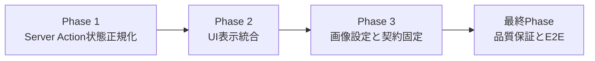
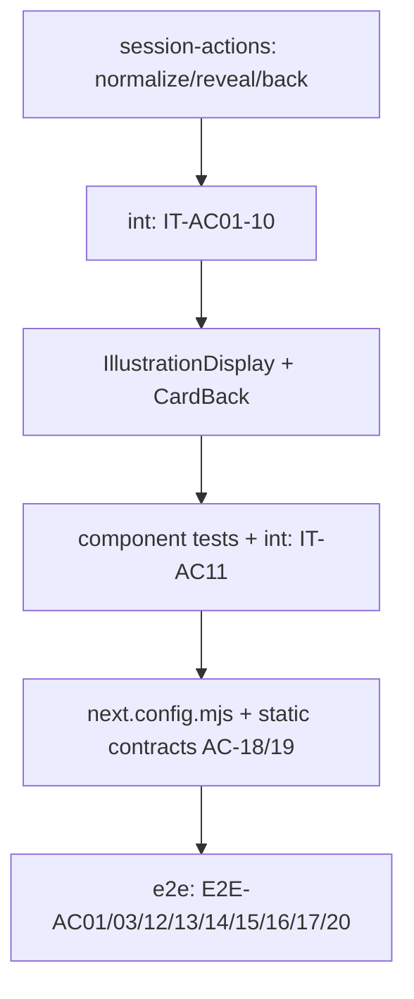

# 作業計画書: illustration-display-integration

作成日: 2026-02-24
種別: feature
想定影響範囲: frontend Server Actions + study UI + Next.js image config + S-09 story tests
関連Issue/PR: 未設定

## 関連ドキュメント
- ADR: `specs/adr/ADR-006-illustration-display-state-contract.md`
- ADR: `specs/adr/ADR-004-illustration-generation-backend-mvp-decisions.md`
- ADR: `specs/adr/ADR-005-study-session-flow.md`
- 要件定義書: `specs/stories/S-09-illustration-display-integration/requirements.md`
- Design Doc: `specs/stories/S-09-illustration-display-integration/design.md`
- 統合テスト骨子: `specs/stories/S-09-illustration-display-integration/tests/illustration-display-integration.int.test.ts`
- E2Eテスト骨子: `specs/stories/S-09-illustration-display-integration/tests/illustration-display-integration.e2e.test.ts`

## 目的
`revealCard` と `getStudySessionState(phase=back)` にイラスト状態正規化を統合し、`CardBack` で `ready/pending/generating/failed/none` を安全に描画できるようにする。画像障害時でも学習導線を止めない UX を維持し、S-07/S-08 の契約を単一仕様へ収束させる。

## 計画ルール（必須伝達事項）
- [ ] 統合テストは実装と同時に具体化・実行する（各Phase完了条件に統合テストPASSを含める）
- [ ] E2Eテストは全実装後に具体化・実行する（最終Phase着手前にE2Eを実装・実行しない）
- [ ] `ui_design: none` のため、UI実装完了時は手動デザイン確認を完了条件に含める

## 影響範囲
### 対象ファイル
- [ ] `frontend/src/actions/session-actions.ts`
- [ ] `frontend/src/actions/session-actions.test.ts`
- [ ] `frontend/src/components/study/CardBack.tsx`
- [ ] `frontend/src/components/study/CardBack.test.tsx`
- [ ] `frontend/src/components/study/RatingButtons.test.tsx`
- [ ] `frontend/src/components/study/IllustrationDisplay.tsx`
- [ ] `frontend/src/components/study/IllustrationDisplay.test.tsx`
- [ ] `frontend/next.config.mjs`
- [ ] `frontend/vitest.config.ts`
- [ ] `specs/stories/S-09-illustration-display-integration/tests/illustration-display-integration.int.test.ts`
- [ ] `specs/stories/S-09-illustration-display-integration/tests/illustration-display-integration.e2e.test.ts`

### テストファイル
- [ ] `frontend/src/actions/session-actions.test.ts`
- [ ] `frontend/src/components/study/IllustrationDisplay.test.tsx`
- [ ] `frontend/src/components/study/CardBack.test.tsx`
- [ ] `frontend/src/components/study/RatingButtons.test.tsx`
- [ ] `specs/stories/S-09-illustration-display-integration/tests/illustration-display-integration.int.test.ts`
- [ ] `specs/stories/S-09-illustration-display-integration/tests/illustration-display-integration.e2e.test.ts`

## フェーズ構成

### フェーズ構成図

### タスク依存関係図

### フェーズ依存関係
- [x] Phase 2 着手条件: Phase 1 の統合テスト（`IT-AC01`〜`IT-AC10`）が合格
- [x] Phase 3 着手条件: Phase 2 の統合テスト（`IT-AC11` を含む）とUI単体テストが合格
- [ ] 最終Phase 着手条件: Phase 1〜3 の実装・単体テスト・統合テストがすべて完了

### Phase 1: Server Action状態正規化
**目的**: `revealCard` / `getStudySessionState(phase=back)` の状態判定を `normalizeIllustrationState` に統一し、5状態契約を固定する。

#### タスク
- [ ] `CardBackData` と `IllustrationDisplayStatus` 契約を更新する
  - 実装: `frontend/src/actions/session-actions.ts`
  - テスト: `frontend/src/actions/session-actions.test.ts`
- [ ] `normalizeIllustrationState` を実装し `illustration_key` / `illustrations` / `trigger` 結果を5状態へ正規化する
  - 実装: `frontend/src/actions/session-actions.ts`
  - テスト: `frontend/src/actions/session-actions.test.ts`
- [ ] `revealCard` に `ok/started` 分岐と例外時 `pending` フォールバックを実装する
  - 実装: `frontend/src/actions/session-actions.ts`
  - テスト: `frontend/src/actions/session-actions.test.ts`
- [ ] `getStudySessionState(phase=back)` に同一正規化ロジックを適用し、必要時 trigger を許容する
  - 実装: `frontend/src/actions/session-actions.ts`
  - テスト: `frontend/src/actions/session-actions.test.ts`
- [ ] 統合テスト（Phase 1対象）を同時具体化し実行する
  - テスト: `specs/stories/S-09-illustration-display-integration/tests/illustration-display-integration.int.test.ts`
  - 対象: `IT-AC01`, `IT-AC02`, `IT-AC03`, `IT-AC04`, `IT-AC05`, `IT-AC06`, `IT-AC07`, `IT-AC08`, `IT-AC09`, `IT-AC10`

#### フェーズ完了条件（Design AC由来）
- [ ] AC-01: `illustrationStatus` が `ready|pending|generating|failed|none` の列挙のみ
- [ ] AC-02: `illustration_key=null` で `none/null`
- [ ] AC-04: `ready + storage_path` で `ready + Signed URL`
- [ ] AC-05: Signed URL 生成 `expiresIn=3600`
- [ ] AC-06: `pending` 行で `pending/null`
- [ ] AC-07: `failed` 行で `failed/null` かつ trigger 0回
- [ ] AC-08: レコードなし + `ok=true started=true` で `generating/null`
- [ ] AC-09: レコードなし + `ok=true started=false` で `pending/null`
- [ ] AC-10/11: `ok=false` または例外でも `pending/null` で学習継続

#### 動作確認手順
1. `revealCard` の分岐 fixture（none/ready/pending/failed/recordなし各ケース）で戻り値と副作用を確認する。
2. `getStudySessionState(phase=back)` が同一入力で `revealCard` と同値の `illustrationStatus/illustrationUrl` を返すことを確認する。
3. `IT-AC01`〜`IT-AC10` を同Phase内で実装・実行し、PASSを確認する。

#### 停止ポイント（品質固定）
- [ ] Phase 1 対象統合テストがPASSした状態を保存する

### Phase 2: UI表示統合
**目的**: `CardBack` から表示責務を分離し、`IllustrationDisplay` で状態別描画と画像エラー時フォールバックを成立させる。

#### タスク
- [x] `IllustrationDisplay` を新規実装し、`none/pending/generating/failed/ready` の描画契約を実装する
  - 実装: `frontend/src/components/study/IllustrationDisplay.tsx`
  - テスト: `frontend/src/components/study/IllustrationDisplay.test.tsx`
- [x] `ready` 表示で `<Image>` を使用し、`onError` で `illustration-fallback` へ切り替える
  - 実装: `frontend/src/components/study/IllustrationDisplay.tsx`
  - テスト: `frontend/src/components/study/IllustrationDisplay.test.tsx`
- [x] `CardBack` の固定プレースホルダを除去し `IllustrationDisplay` 呼び出しへ置換する
  - 実装: `frontend/src/components/study/CardBack.tsx`
  - テスト: `frontend/src/components/study/CardBack.test.tsx`
- [x] `RatingButtons` 操作継続性テストを追加し、フォールバック時の評価導線を保証する
  - 実装: `frontend/src/components/study/RatingButtons.test.tsx`
  - テスト: `frontend/src/components/study/RatingButtons.test.tsx`
- [x] 統合テスト（Phase 2対象）を同時具体化し実行する
  - テスト: `specs/stories/S-09-illustration-display-integration/tests/illustration-display-integration.int.test.ts`
  - 対象: `IT-AC11`（reveal応答のみで追加API呼び出しなしに裏面分岐可能）
- [x] UI手動確認（`ui_design: none` 対応）を実施する
  - 確認内容: 表面非表示・裏面状態別表示・フォールバック時の評価導線

#### フェーズ完了条件（Design AC由来）
- [x] AC-03: `none` で `illustration-region` が0件
- [x] AC-12: `pending` で `illustration-loading=1`, `illustration-image=0`
- [x] AC-13: `generating` が `pending` と同一ローディング表示
- [x] AC-14: `failed` で `illustration-failed=1` かつ再試行UIなし
- [x] AC-15: `ready` で `illustration-image=1`
- [x] AC-16: 画像ロード失敗で `illustration-fallback=1` + 評価操作継続
- [x] AC-17: front表示でイラスト関連DOMが常に0件
- [x] AC-20: 状態判定の追加API呼び出し0回

#### 動作確認手順
1. `IllustrationDisplay` の5状態を unit で検証し、`data-testid` 件数を固定する。
2. `ready` の `onError` 分岐を発火し、`illustration-fallback` と `onRate` 動作継続を確認する。
3. `IT-AC11` を同Phase内で実装・実行し、PASSを確認する。

#### 停止ポイント（品質固定）
- [x] UI単体テスト + Phase 2対象統合テストがPASSした状態を保存する

### Phase 3: 画像設定と契約固定
**目的**: Next.js 画像許可設定と `<Image>` 契約を固定し、本番相当環境での表示失敗リスクを除去する。

#### タスク
- [x] `frontend/next.config.mjs` を新規作成し `images.remotePatterns` を設定する
  - 実装: `frontend/next.config.mjs`
  - 対象契約: `https://*.supabase.co/storage/v1/object/sign/**`
- [x] `next.config.ts` 非対象ルールを維持する（既存があっても変更しない）
  - 実装: `frontend/next.config.mjs`
- [x] Story配下テストを実行対象に含めるため `vitest` 設定を必要最小限更新する
  - 実装: `frontend/vitest.config.ts`
- [x] AC-18/19 の静的契約検証を追加する（remotePatterns / Image props）
  - テスト: `frontend/src/components/study/IllustrationDisplay.test.tsx` または同等の静的検証テスト
- [x] 統合テストを全件再実行し退行がないことを確認する
  - テスト: `specs/stories/S-09-illustration-display-integration/tests/illustration-display-integration.int.test.ts`

#### フェーズ完了条件（Design AC由来）
- [x] AC-18: `frontend/next.config.mjs` に `remotePatterns` が定義されている
- [x] AC-19: `<Image>` で `priority` 未使用、`width/height/sizes` 明記、遅延読込維持
- [x] Phase 1〜3 の統合テストが全PASS

#### 動作確認手順
1. `next.config.mjs` を静的検査し、`*.supabase.co` と `/storage/v1/object/sign/**` を許可していることを確認する。
2. `IllustrationDisplay` の `<Image>` props を静的検査し、AC-19の制約を満たすことを確認する。
3. 統合テストを全件実行し、Phase 1/2 の退行がないことを確認する。

#### 停止ポイント（品質固定）
- [x] Phase 1〜3 の統合テスト再実行がPASSした状態を保存する

---

### 最終Phase: 品質保証・E2E実行（必須）
**目的**: 全ACの受入証跡を確定し、S-09 を完了判定可能な状態にする。

#### タスク
- [ ] E2E骨子（`illustration-display-integration.e2e.test.ts`）の `it.todo` を全実装完了後に具体化する
  - テスト: `specs/stories/S-09-illustration-display-integration/tests/illustration-display-integration.e2e.test.ts`
  - 対象: `E2E-AC01`, `E2E-AC03`, `E2E-AC12`, `E2E-AC13`, `E2E-AC14`, `E2E-AC15`, `E2E-AC16`, `E2E-AC17`, `E2E-AC20`
- [ ] 全実装完了後にのみ E2E を実行する（計画ルール準拠）
  - テスト: `specs/stories/S-09-illustration-display-integration/tests/illustration-display-integration.e2e.test.ts`
- [ ] 統合テストを全件実行し、同時実装ルールで具体化した内容の退行がないことを確認する
  - テスト: `specs/stories/S-09-illustration-display-integration/tests/illustration-display-integration.int.test.ts`
- [ ] frontend 品質ゲートを実行する
  - コマンド: `npm run check --prefix frontend`
- [ ] Story / Requirements / ADR / Design / 実装 / テストのトレーサビリティを整理する

#### フェーズ完了条件
- [ ] E2E-AC01/03/12/13/14/15/16/17/20 がPASS
- [ ] AC-01〜AC-20 の検証結果がテストログで追跡可能
- [ ] 統合テスト同時実施・E2E最終実施のルールを満たす

#### 動作確認手順（Design Doc統合点E2E手順転記）
1. `illustration_key=null` カードで `none` と裏面非表示を確認する。
2. `ready + storage_path` ありで画像表示を確認する。
3. `ready + storage_path=NULL` 異常行で `pending` 正規化を確認する。
4. レコードなし + `ok=true started=true` で `generating` 表示を確認する。
5. レコードなし + `ok=true started=false` で `pending` 表示を確認する。
6. `ok=false` または例外でも `pending` 表示で学習継続できることを確認する。
7. `ready` 画像の `onError` で `illustration-fallback` と評価操作継続を確認する。
8. frontフェーズでは全状態でイラスト要素が非表示であることを確認する。

## AC別完了チェックリスト
- [ ] AC-01: `illustrationStatus` 契約（5状態列挙）
- [ ] AC-02: `illustration_key=null` の `none/null`
- [ ] AC-03: `none` 時のDOM非表示
- [ ] AC-04: `ready + storage_path` のSigned URL返却
- [ ] AC-05: Signed URL 3600秒
- [ ] AC-06: `pending` 行の `pending/null`
- [ ] AC-07: `failed` 行の `failed/null` + triggerなし
- [ ] AC-08: `ok=true started=true` で `generating`
- [ ] AC-09: `ok=true started=false` で `pending`
- [ ] AC-10: `ok=false` で `pending`（例外非発生）
- [ ] AC-11: trigger例外で `pending`（例外非発生）
- [ ] AC-12: pendingローディング表示
- [ ] AC-13: generatingローディング表示
- [ ] AC-14: failedプレースホルダ表示（再試行UIなし）
- [ ] AC-15: ready画像表示
- [ ] AC-16: 画像失敗時フォールバック + 評価操作継続
- [ ] AC-17: frontでイラスト要素非表示
- [x] AC-18: `next.config.mjs` remotePatterns 設定
- [x] AC-19: `<Image>` props契約
- [ ] AC-20: reveal後の追加API呼び出し0回

## リスクと対策
- [ ] リスク: `revealCard` と `getStudySessionState` の分岐乖離
      対策: `normalizeIllustrationState` 共通化 + `IT-AC10` 固定
- [ ] リスク: `ready && storage_path` 欠落で契約破綻
      対策: 強制 `pending` 正規化 + `IT-AC04` で拘束
- [ ] リスク: 画像設定漏れによる本番表示失敗
      対策: `next.config.mjs` 新規作成 + AC-18静的検証
- [ ] リスク: 画像ロード失敗時に評価導線が止まる
      対策: `IllustrationDisplay` fallback + `UT-AC16` / `IT-AC11` / `E2E-AC16`
- [ ] リスク: 統合テスト後倒しで不具合集中
      対策: 各Phase停止ポイントを「対象統合テストPASS」に固定
