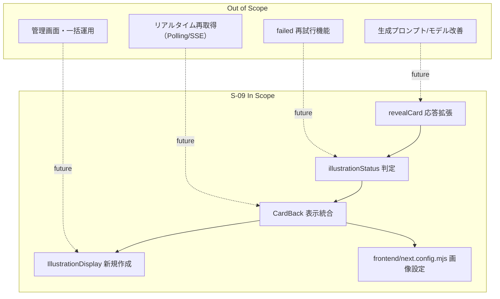
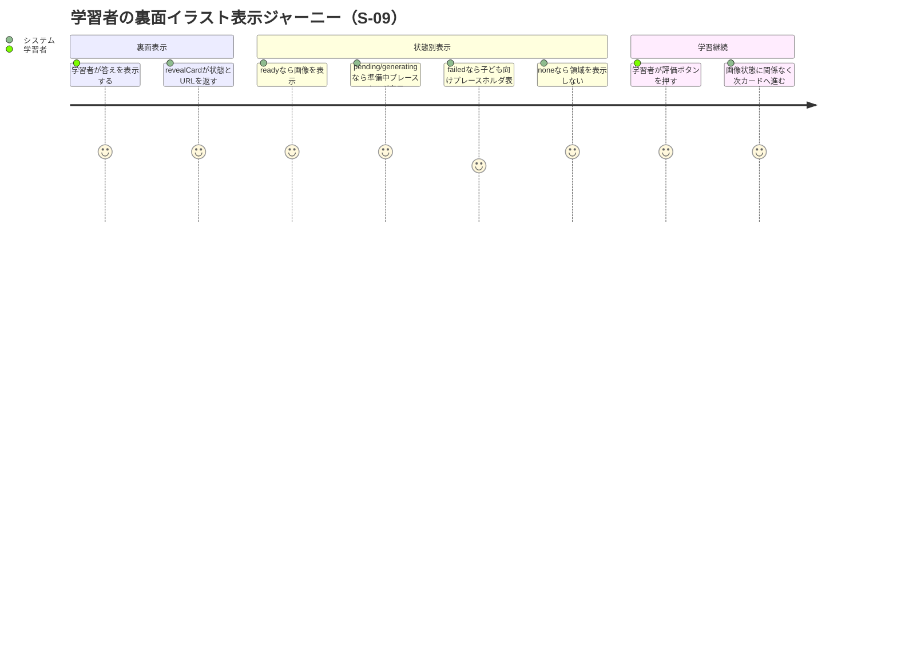

# 要件定義書: illustration-display-integration

## 1. 概要

### 1行要約
学習セッション裏面（CardBack）に、生成状態に応じたイラスト表示を安全かつ非阻害で統合する。

### 背景
S-07 では裏面にプレースホルダのみを配置し、S-08 でイラスト生成バックエンドの状態管理（`pending/ready/failed`）を整備した。  
S-09 はこの2つを接続し、学習者が答え確認時にイラストを活用できる体験を成立させる。

## 2. ユーザーストーリー

### プライマリーユーザー
- 学習者（答え合わせ時にイラストで意味連想を補強したい）
- 開発者（S-07/S-08 の契約を破綻なく統合したい）

### ユーザーストーリー
```text
As a learner
I want to see an illustration on the card back when available
So that I can reinforce kanji meaning without interrupting study flow
```

### ユースケース
1. `ready` のカードでは、裏面表示時に正解テキスト直下へイラストが表示される。
2. `pending` または `generating` のカードでは、子ども向け文言のローディングプレースホルダが表示される。
3. `failed` のカードでは、再試行を行わず「準備中」プレースホルダで学習を継続できる。
4. `none`（`illustration_key = null`）のカードでは、イラスト領域が描画されずレイアウトが詰まる。

## 3. 要件

### 変更規模判定
- 本ストーリーは**大規模変更**として扱う（Server Action契約変更、UI分岐追加、Next.js画像設定追加を同時に含むため）。

### Must（必須）
- `revealCard(sessionId)` は `illustrationUrl` と `illustrationStatus` を返すこと。
- `illustrationStatus` は `ready | pending | generating | failed | none` のみを返すこと。
- `illustration_key` が `null` の場合、`illustrationStatus='none'` とし `illustrationUrl=null` を返すこと。
- `illustrations.status='ready'` かつ `storage_path` が存在する場合のみ Signed URL を返し、`illustrationStatus='ready'` を返すこと（Signed URL 有効期限は 3600 秒）。
- `illustrations.status='pending'` の場合、`illustrationStatus='pending'` とし `illustrationUrl=null` を返すこと。
- `illustrations.status='failed'` の場合、`illustrationStatus='failed'` とし `illustrationUrl=null` を返すこと。
- `illustrations` レコードが存在しない場合、`triggerIllustrationGeneration(cardId)` を呼び、戻り値が `ok=true` かつ `started=true` のときのみ `illustrationStatus='generating'` を返すこと。
- `illustrations` レコードが存在しない場合、`triggerIllustrationGeneration(cardId)` の戻り値が `ok=true` かつ `started=false` のときは、競合時フォールバックとして `illustrationStatus='pending'` を返すこと。
- `illustrations` レコードが存在しない場合、`triggerIllustrationGeneration(cardId)` が `ok=false` を返す、または例外を送出したときは、学習継続優先で `illustrationStatus='pending'` と `illustrationUrl=null` を返すこと。
- `failed` 状態では今回スコープで再試行を実装しないこと（自動再試行・手動再試行UIともに対象外）。
- `CardBack` は `IllustrationDisplay` を利用し、`illustrationStatus` と `illustrationUrl` によって表示分岐すること。
- `IllustrationDisplay` は `status='none'` で `null` を返し、イラスト領域を完全非表示にすること。
- `status='pending'` / `status='generating'` ではローディングプレースホルダを表示すること。
- `status='failed'` では子ども向け文言の静的プレースホルダを表示すること（「失敗」文言を直接表示しない）。
- `status='ready'` では Next.js `<Image>` で画像表示し、ロード失敗時はプレースホルダにフォールバックすること。
- `<Image>` は `priority` を使用せず、遅延読込（lazy）を維持し、`width` / `height` / `sizes` を明記すること。
- 表面（front）ではイラストを表示しないこと。
- Next.js 画像許可設定は `frontend/next.config.mjs` を対象に定義すること（既存 `next.config.ts` は対象外）。

### Should（望ましい）
- `revealCard` へのイラスト関連追加処理オーバーヘッドを p95 50ms 以内目標で維持する。
- 裏面テキスト表示を優先し、画像は遅延読み込みで学習テンポを阻害しない。
- プレースホルダ文言は子どもが不安になりにくいトーンで統一する。

### Could（あるとよい）
- `illustrationStatus` 別の表示回数メトリクスを計測し、運用時の状態偏り把握に活用する。
- 画像フォールバック発生回数を監視し、Signed URL期限・配信不具合の早期検知に利用する。

### Won’t（対象外）
- `failed` 状態の再試行機能（自動・手動）。
- イラスト管理画面や差し替えUI。
- 裏面表示後の追加ポーリングによる状態更新。

### MVP / Future 要件マッピング
| 領域 | MVP（S-09） | Future（S-09対象外） |
|---|---|---|
| 状態表示 | `ready/pending/generating/failed/none` の表示統合 | `failed` 自動再試行・手動再試行 |
| 表示面 | 裏面のみ表示、表面は非表示固定 | 問題面ヒント表示 |
| 画像設定 | `frontend/next.config.mjs` に `remotePatterns` 追加 | 画像CDN最適化の詳細チューニング |
| 状態更新 | `revealCard` 応答に同梱された状態で描画 | リアルタイム更新（polling/SSE） |

## 4. 実装対象・非対象

### 実装対象（In Scope）
| ファイル | 変更内容 |
|---|---|
| `frontend/src/actions/session-actions.ts` | `revealCard` のイラスト状態判定・URL返却・`ok`/`started`/例外時 `pending` フォールバック反映 |
| `frontend/src/components/study/CardBack.tsx` | `IllustrationDisplay` 組み込み、裏面レイアウト統合 |
| `frontend/src/components/study/IllustrationDisplay.tsx` | 新規作成。状態別表示、画像エラーフォールバック、`Image` 属性（`priority`未使用・`sizes`・寸法）適用 |
| `frontend/next.config.mjs` | `images.remotePatterns` に Supabase Signed URLドメインを設定（未存在なら新規作成） |

### 非対象（Out of Scope）
- `triggerIllustrationGeneration` の戻り値契約や再試行戦略変更（S-08側仕様変更）。
- `getSignedUrl` 実装内部や有効期限ルール自体の再設計（S-08の契約を利用するのみ）。
- 生成プロンプト改善やモデル切替。
- イラストの手動運用機能（管理画面・一括処理）。
- `illustrations` テーブルスキーマ変更や新規マイグレーション。

## 5. 非機能要件

### セキュリティ
- Signed URL は裏面表示時レスポンスでのみ利用し、有効期限 3600 秒の期限付きURLとして扱う。
- 表面表示データにイラストURLを含めない。

### パフォーマンス
- `revealCard` は画像バイト転送を含まず、URLと状態のみ返す。
- `ready` 以外で不要な画像リクエストを発生させない。

### 信頼性
- 画像ロード失敗時も裏面の正解表示と評価操作を継続できること。
- 不明状態を返さず、定義済み5状態へ必ず正規化すること。
- `triggerIllustrationGeneration` が `ok=false` または例外でも、`revealCard` は失敗させず `pending` で学習継続を優先すること。

### 保守性
- `illustrationStatus` 判定ロジックを `revealCard` で一元化し、UIは受信状態に従って描画する。
- `frontend/next.config.mjs` を設定の単一ソースとして扱う。

## 6. 成功指標

### 定量的指標
1. 受入条件（AC）の検証可能項目充足率が 100% であること。
2. `illustration_key=null` ケースでイラスト領域DOM出現率が 0% であること。
3. `failed` ケースで再試行処理呼び出し回数が 0 回であること。
4. `ok=true && started=true` ケースの `illustrationStatus='generating'` 返却率が 100% であること。
5. `ok=true && started=false` ケースの `illustrationStatus='pending'` 返却率が 100% であること。
6. `ok=false` ケースの `illustrationStatus='pending'` 返却率が 100% であること。
7. `triggerIllustrationGeneration` 例外ケースで `illustrationStatus='pending'` 返却率が 100% であること。

### 定性的指標
1. 学習者が「画像が出なくても学習は進められる」と感じられること。
2. 開発者が要件書のみで状態遷移と表示ルールを説明できること。

## 7. スコープ境界図



## 8. ユーザージャーニー



## 9. 制約・前提（確定方針）

- D1. 変更規模は大規模として扱う。
- D2. Next.js設定対象は `frontend/next.config.mjs` を採用する（現状設定ファイル未作成）。
- D3. `illustrationStatus='generating'` は `revealCard` 内で `triggerIllustrationGeneration` が `ok=true && started=true` の場合のみ返す。
- D4. `illustrations` レコードなしで `triggerIllustrationGeneration` が `ok=true && started=false` の場合は、競合時フォールバックとして `pending` を返す。
- D5. `triggerIllustrationGeneration` が `ok=false` または例外の場合、`revealCard` は学習継続優先で `pending` を返す。
- D6. Signed URL 有効期限は 3600 秒（1時間）を採用する。
- D7. `failed` 状態は再試行せず、UIは子ども向け文言のプレースホルダ表示とする。
- D8. `none`（`illustration_key=null`）はイラスト領域を完全非表示とする。
- D9. `ready` かつ URL ロード失敗時はプレースホルダへフォールバックする。
- D10. `<Image>` は `priority` 未使用、遅延読込、`sizes` と寸法（`width`/`height`）明記を必須とする。

## 10. 受入条件（測定可能）

### 観測ポイント（共通）
- レスポンス観測: `revealCard(sessionId)` の戻り値 `illustrationStatus` / `illustrationUrl`。
- 呼び出し観測: `triggerIllustrationGeneration(cardId)` と Signed URL 生成関数の呼び出し回数・引数。
- DOM観測: `IllustrationDisplay` の要素を `data-testid`（`illustration-region` / `illustration-image` / `illustration-loading` / `illustration-failed` / `illustration-fallback`）で検証する。

1. AC-01（契約型）: `revealCard(sessionId)` は `illustrationStatus` と `illustrationUrl` を必ず返し、`illustrationStatus` は `ready|pending|generating|failed|none` のいずれかであること。判定指標は「レスポンスキー存在」「列挙値一致」。
2. AC-02（条件型）: 対象カードの `illustration_key` が `null` の場合、`revealCard` は `illustrationStatus='none'` と `illustrationUrl=null` を返すこと。判定指標は「レスポンス項目値」。
3. AC-03（UI型）: AC-02 の場合、`CardBack` で `data-testid='illustration-region'` の描画件数が 0 件であること。判定指標は「DOM要素件数」。
4. AC-04（条件型）: `illustrations.status='ready'` かつ `storage_path` が存在する場合、`revealCard` は `illustrationStatus='ready'` と非nullのSigned URLを返すこと。判定指標は「レスポンス項目値」「Signed URL生成呼び出し回数」。
5. AC-05（契約型）: AC-04 の Signed URL 生成は `expiresIn=3600` 秒で実行されること。判定指標は「Signed URL生成関数第2引数」。
6. AC-06（条件型）: `illustrations.status='pending'` の場合、`revealCard` は `illustrationStatus='pending'` と `illustrationUrl=null` を返すこと。判定指標は「レスポンス項目値」。
7. AC-07（条件型）: `illustrations.status='failed'` の場合、`revealCard` は `illustrationStatus='failed'` と `illustrationUrl=null` を返し、`triggerIllustrationGeneration` を呼び出さないこと。判定指標は「レスポンス項目値」「呼び出し回数0」。
8. AC-08（条件型）: `illustrations` レコードなしで `triggerIllustrationGeneration` が `ok=true && started=true` を返した場合、`revealCard` は `illustrationStatus='generating'` と `illustrationUrl=null` を返すこと。判定指標は「レスポンス項目値」「呼び出し結果分岐」。
9. AC-09（条件型）: `illustrations` レコードなしで `triggerIllustrationGeneration` が `ok=true && started=false` を返した場合、`revealCard` は競合時フォールバックとして `illustrationStatus='pending'` と `illustrationUrl=null` を返すこと。判定指標は「レスポンス項目値」「呼び出し結果分岐」。
10. AC-10（条件型）: `illustrations` レコードなしで `triggerIllustrationGeneration` が `ok=false` を返した場合、`revealCard` は例外を投げず `illustrationStatus='pending'` と `illustrationUrl=null` を返すこと。判定指標は「レスポンス項目値」「例外非発生」。
11. AC-11（条件型）: `illustrations` レコードなしで `triggerIllustrationGeneration` が例外を送出した場合、`revealCard` は学習継続優先で `illustrationStatus='pending'` と `illustrationUrl=null` を返すこと。判定指標は「レスポンス項目値」「例外非発生」。
12. AC-12（UI型）: `illustrationStatus='pending'` の裏面表示で、`data-testid='illustration-loading'` が1件表示され、`data-testid='illustration-image'` は0件であること。判定指標は「DOM要素件数」。
13. AC-13（UI型）: `illustrationStatus='generating'` の裏面表示で、AC-12 と同一のローディング表示になること。判定指標は「DOM要素件数」「文言一致」。
14. AC-14（UI型）: `illustrationStatus='failed'` の裏面表示で、`data-testid='illustration-failed'` が1件表示され、再試行ボタンが0件であること。判定指標は「DOM要素件数」「再試行要素不在」。
15. AC-15（UI型）: `illustrationStatus='ready'` かつ `illustrationUrl` 非nullの場合、`data-testid='illustration-image'` が1件表示されること。判定指標は「DOM要素件数」「`src`一致」。
16. AC-16（障害耐性型）: AC-15 の画像読み込みが失敗した場合、`data-testid='illustration-fallback'` が1件表示され、評価ボタン操作を継続できること。判定指標は「DOM要素件数」「評価ボタン活性」「操作成功」。
17. AC-17（UI型）: 表面表示時は `illustrationStatus` の値にかかわらず `illustration-region` / `illustration-image` / プレースホルダ要素の描画件数がすべて0件であること。判定指標は「DOM要素件数」。
18. AC-18（設定型）: `frontend/next.config.mjs` に `images.remotePatterns` が存在し、`*.supabase.co` の `/storage/v1/object/sign/**` を許可していること。判定指標は「設定ファイル静的検査」。
19. AC-19（設定型）: `<Image>` 実装で `priority` が未指定、`width` / `height` が明記、`sizes` が明記され、遅延読込が有効であること。判定指標は「コンポーネントprops静的検査」。
20. AC-20（データフロー型）: `revealCard` 実行後、クライアントはイラスト状態判定のための追加API呼び出しなしで表示分岐できること。判定指標は「ネットワーク呼び出し回数（追加0回）」。

## 11. 参考資料
- `specs/stories/S-09-illustration-display-integration/story.md`
- `specs/stories/S-09-illustration-display-integration/meta.json`
- `specs/epics/E-03-illustration-generation/epic.md`
- `specs/stories/S-08-illustration-generation-backend/requirements.md`
- `specs/stories/S-07-study-session-flow/requirements.md`

## 12. 変更履歴

| 日付 | 版 | 変更内容 | 作成者 |
|---|---|---|---|
| 2026-02-24 | 1.0.1 | document-reviewer指摘反映（`ok`/`started`分岐厳密化、`ok:false`/例外時`pending`フォールバック、Signed URL 3600秒明記、`Image`要件明記、AC測定観測点追加、実装境界明確化） | Codex |
| 2026-02-24 | 1.0.0 | 初版作成（S-09の確定方針、実装対象/非対象、測定可能ACを反映） | Codex |
