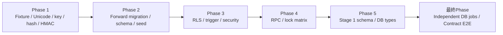
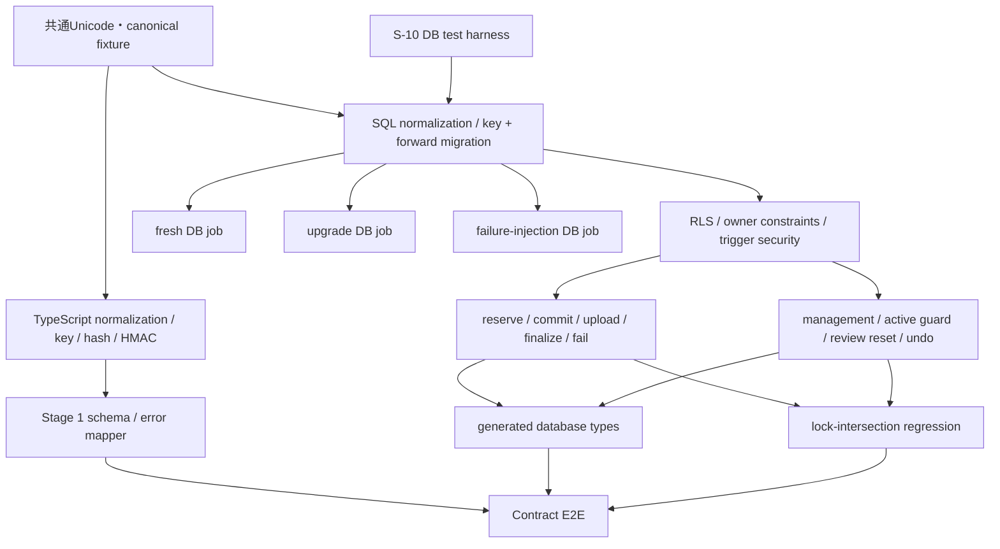

# 作業計画書: AIカード登録基盤

作成日: 2026-07-14  
種別: feature  
関連Issue: #10  
計画状態: 実装着手可能

## 関連ドキュメント

- 要件定義書: `specs/stories/S-10-ai-card-import-foundation/requirements.md` v1.1.1 Approved
- ADR: `specs/adr/ADR-007-ai-card-import-foundation.md` v1.1.1 Accepted
- Design Doc: `specs/stories/S-10-ai-card-import-foundation/design.md` v1.1.1 Approved
- 受入テスト計画: `specs/stories/S-10-ai-card-import-foundation/tests/acceptance-test-plan.md`
- Unit骨子（32件）: `specs/stories/S-10-ai-card-import-foundation/tests/ai-card-import-foundation.test.ts`
- DB Integration骨子（61件）: `specs/stories/S-10-ai-card-import-foundation/tests/ai-card-import-foundation.int.test.ts`
- Contract E2E骨子（13件）: `specs/stories/S-10-ai-card-import-foundation/tests/ai-card-import-foundation.e2e.test.ts`

## 目的

既存Auth・card・deck・学習データを互換接続先として維持しながら、owner単位のprivate card、二段階import、JST quota、冪等性、学習中guard、undoをDB不変条件と共有TypeScript契約で保証する。公開Seedを壊さず、空DBとSeed済みDBの両方へforward migrationできる状態を完成させる。

## スコープ境界

### 実装対象

- [ ] Unicode正規化、`card_key`、canonical hash、preview HMAC、Stage 1 schema、安定error契約
- [ ] 既存schemaを維持した単一forward migration、`seed.sql`のforward互換更新
- [ ] import/upload/tag/quota tables、constraints、indexes、RLS、grants、trigger
- [ ] reserve/commit/finalize/fail/upload/management/undo RPCと単一lock matrix
- [ ] `frontend/src/types/database.ts`の再生成とSupabase型契約の更新
- [ ] Unit 32件、DB Integration 61件、Contract E2E 13件の実テスト化
- [ ] fresh、upgrade、failure-injectionを相互に状態共有しない独立DB jobとして実行

### 対象外

- Queue、`pgmq`、enqueue、worker、retry orchestration
- OpenAI/Gemini等のprovider呼出、moderation、画像生成、Storage object処理
- UI、Route Handler、Remote MCP transport、OAuth、MCP tool公開
- preview secret/provider secretの環境変数配線
- R2/W2、一般問題形式、公開・共有カード

## 計画固定ルール

- [ ] 既存migrationは編集せず、S-10は新しいforward migrationだけを追加する
- [ ] Unit TODOは対応するTypeScript production moduleと同じPhaseでRedテストへ置換し、同PhaseでGreenにする
- [ ] DB Integration TODOは対応するmigration/trigger/RPCと同じPhaseで実テストへ置換し、同Phaseで実DB実行する
- [ ] Contract E2E TODOは全production実装完了後の最終Phaseでのみ実テスト化・実行する
- [ ] fresh、upgrade、failure-injectionは別process・別databaseで実行し、同一DBのreset使い回しを禁止する
- [ ] Queue/provider/Storage処理をテストfixtureやstubとしても起動せず、S-10 primitiveをsystem boundaryとする
- [ ] SQL/TypeScriptのUnicode期待値は同一fixtureを参照し、期待値をテストへ重複記述しない
- [ ] 各Phaseの対象テストがPASSするまで次Phaseへ進まず、実装とテストを同じ変更単位に保つ

## 既存コード分析と主な変更先

### 維持する既存実装

- `supabase/migrations/20260223000000_s02_schema_rls.sql`
- `supabase/migrations/20260223000001_s02_storage_illustrations.sql`
- `specs/stories/S-02-database-schema-rls/tests/helpers/s02-db-testkit.ts`
- `frontend/src/lib/supabase/client.ts`
- `frontend/src/lib/supabase/server.ts`

### 追加・更新候補

- `supabase/migrations/*_s10_ai_card_import_foundation.sql`
- `supabase/seed.sql`
- `frontend/src/lib/ai-import/schema.ts`
- `frontend/src/lib/ai-import/normalize.ts`
- `frontend/src/lib/ai-import/card-key.ts`
- `frontend/src/lib/ai-import/canonical-request.ts`
- `frontend/src/lib/ai-import/preview-token.ts`
- `frontend/src/lib/ai-import/errors.ts`
- `frontend/src/types/database.ts`
- `frontend/vitest.config.ts`
- `frontend/package.json`
- `specs/stories/S-10-ai-card-import-foundation/fixtures/unicode-card-key.json`
- `specs/stories/S-10-ai-card-import-foundation/fixtures/canonical-requests.json`
- `specs/stories/S-10-ai-card-import-foundation/tests/fixtures/pre-s10-seed.sql`
- `specs/stories/S-10-ai-card-import-foundation/tests/helpers/s10-db-testkit.ts`
- `specs/stories/S-10-ai-card-import-foundation/tests/helpers/s10-db-jobs.ts`
- 既存のUnit/Integration/E2E骨子3ファイル

`architecture/implementation-approach.md`はrepository内に存在しないため、確認レベルは承認済みDesign Docの実装順序、単一lock matrix、テスト戦略を正本とする。現行projectはNestJS/Prisma構成ではなくNext.js + Supabase構成であるため、実コードとDesign Docをproject固有ルールより優先する。

## フェーズ構成

### フェーズ構成図

### タスク依存関係図

### Phase 1: Fixture・Unicode・card-key・canonical hash・preview HMAC実装

**目的**: runtime間で共有する期待値とDB test harnessを固定し、TypeScriptと後続SQLの入力正本となる決定的な純粋契約を完成させる。

#### タスク

- [ ] Unicode/card-key fixtureとcanonical request fixtureを作成する
  - 実装: `specs/stories/S-10-ai-card-import-foundation/fixtures/unicode-card-key.json`
  - 実装: `specs/stories/S-10-ai-card-import-foundation/fixtures/canonical-requests.json`
  - 完了条件: 固定White_Space全点、U+FEFF、NFKC、case、astral/結合文字、U+001F material、generation/import hash差分をfixtureで表現する
- [ ] pre-S10 SeedとS-10 DB test harnessを準備する
  - 実装: `specs/stories/S-10-ai-card-import-foundation/tests/fixtures/pre-s10-seed.sql`
  - 実装: `specs/stories/S-10-ai-card-import-foundation/tests/helpers/s10-db-testkit.ts`
  - 実装: `specs/stories/S-10-ai-card-import-foundation/tests/helpers/s10-db-jobs.ts`
  - 完了条件: baseline snapshot、owner A/B/anon/service、複数connection、test clock、failpoint、独立DB jobを型付きで提供する
- [ ] S-10テスト検出と独立実行scriptを追加する
  - 実装: `frontend/vitest.config.ts`, `frontend/package.json`
  - 完了条件: Unit、Integration、Contract E2E、fresh、upgrade、failure-injectionを個別commandで選択でき、接続先未指定時はfail-fastする
- [ ] `normalize.ts`を実装し、Unit 5件をTODOからRed→Greenにする
  - 実装: `frontend/src/lib/ai-import/normalize.ts`
  - テスト: `ai-card-import-foundation.test.ts`のUT-NORM-01〜05
  - AC対応: AC-01〜03（5件）
- [ ] `card-key.ts`を実装し、Unit 3件をTODOからRed→Greenにする
  - 実装: `frontend/src/lib/ai-import/card-key.ts`
  - テスト: UT-CARDKEY-01〜03
  - AC対応: AC-01〜03（3件）
- [ ] generation/import canonical hashを実装し、Unit 7件をTODOからRed→Greenにする
  - 実装: `frontend/src/lib/ai-import/canonical-request.ts`
  - テスト: UT-HASH-01〜07
  - AC対応: AC-04〜05（7件）
- [ ] preview token署名・検証をsecret/clock注入の純粋関数として実装し、Unit 7件をTODOからRed→Greenにする
  - 実装: `frontend/src/lib/ai-import/preview-token.ts`
  - テスト: UT-HMAC-01〜07
  - AC対応: AC-04（7件）
- [ ] fixture全vectorをNode runtimeで実行し、crypto・UTF-8・constant-time比較の退行を固定する
  - テスト: `specs/stories/S-10-ai-card-import-foundation/tests/ai-card-import-foundation.test.ts`

#### フェーズ完了条件

- [ ] Unit解決: 22/32件（UT-NORM 5 + UT-CARDKEY 3 + UT-HASH 7 + UT-HMAC 7）
- [ ] TODO inventoryがUnit 32 / Integration 61 / Contract E2E 13であり、3ファイルがVitestから検出される
- [ ] fixture/helperに`any`、secret/card本文のlog、外部network/provider依存がない
- [ ] digestはlowercase SHA-256 hex、token TTLは1800秒、HMAC secret/clockは外部注入である
- [ ] U+FEFFを空白として扱わず、固定White_Space全点とastral文字の期待値が一致する
- [ ] `npm --prefix frontend run typecheck`と対象UnitがPASSする

#### 動作確認手順

1. Vitestのlist/dry runでS-10の3ファイルとTODO inventoryを確認する。
2. `npm --prefix frontend run test -- ../specs/stories/S-10-ai-card-import-foundation/tests/ai-card-import-foundation.test.ts -t "UT-NORM|UT-CARDKEY|UT-HASH|UT-HMAC"`を実行する。
3. 同じ意味のNFKC/空白/case入力が同じkey/hash、意味差分が異なるkey/hashになることをfixtureで確認する。
4. token改ざん、別secret、owner/hash/key不一致、期限境界が安全な失敗となりtoken本文がerrorへ露出しないことを確認する。

### Phase 2: Forward migration・schema・constraints・backfill・Seed実装

**目的**: 既存migrationを変更せず、card-key移行とS-10永続schemaをtransactional DDLで追加する。

#### タスク

- [ ] 単一forward migrationへICU `und` collation、SQL正規化/key関数、fixture self-checkを追加する
  - 実装: `supabase/migrations/*_s10_ai_card_import_foundation.sql`
  - 完了条件: ICU/NFKC/lowercaseを利用不能な環境でfail-fastし、function名と権限を安定名で作る
- [ ] 既存cardsをtemporary計算・衝突検査後にSHA-256 keyへbackfillする
  - 実装: 同forward migration
  - 完了条件: 旧global uniqueをdropする前にpublic/private衝突を検知し、衝突時は全transactionをrollbackする
- [ ] `cards`と`deck_cards`のforward制約/indexを追加する
  - 実装: 同forward migration
  - テスト: IT-UNIQUE-01〜03、IT-OWNER-02〜03
  - AC対応: AC-01/02/09（5件）
- [ ] import/upload/tag/quota tables、FK、CHECK、indexを依存順に追加する
  - 実装: 同forward migration
  - テスト: IT-OWNER-01
  - AC対応: AC-09（1件）
- [ ] `seed.sql`を新key関数とpartial unique predicateへ更新する
  - 実装: `supabase/seed.sql`
  - 完了条件: `ON CONFLICT (card_key) WHERE visibility = 'public' DO NOTHING`を使い、SeedのID/本文/関連/件数を変えない
- [ ] Phase 2のDB Integration 6件をTODOから実テストへ置換し、実DBで実行する
  - テスト: `specs/stories/S-10-ai-card-import-foundation/tests/ai-card-import-foundation.int.test.ts`

#### フェーズ完了条件

- [ ] DB Integration解決: 6/61件（IT-UNIQUE 3 + IT-OWNER-01〜03 3）
- [ ] 異なるownerの同keyと公開Seed同値privateを許可し、同一owner/cross-owner relationを拒否する
- [ ] migration file単体が1 transactionで適用され、repositoryのSeed実行をtransaction内へ混在させない
- [ ] 既存migration 2ファイルに差分がない

#### 動作確認手順

1. pre-S10 schema + frozen Seedへforward migrationを適用し、SQL fixture self-checkとbackfillを確認する。
2. IT-UNIQUE-01〜03、IT-OWNER-01〜03を実DBで実行する。
3. Seedを別transactionで再実行し、public card/deck/relation件数と新keyが変わらないことを確認する。

### Phase 3: RLS・trigger・security・owner/session不変条件実装

**目的**: RPC実装前に、service roleや直接DMLでも迂回できない所有権・学習中guard・review resetを確定する。

#### タスク

- [ ] 全対象tableのRLS policyとdirect-write matrixを実装し、DB Integration 7件を同時実装する
  - 実装: S-10 forward migration
  - テスト: IT-RLS-01〜07
  - AC対応: AC-03/09（7件）
- [ ] wrapper/internal/trigger functionのowner、`search_path`、EXECUTE revoke/grant、schema CREATE ACLを実装する
  - 実装: S-10 forward migration
  - テスト: IT-SECURITY-01〜02
  - AC対応: AC-09（2件）
- [ ] card/tag正規化、public immutable、deck/card/tag owner triggerを実装する
  - 実装: S-10 forward migration
  - 完了条件: caller提供`card_key`/`normalized_name`を信用せず、service roleでもowner invariantを迂回できない
- [ ] session queue UUID抽出、対称lock、active-session guardを実装し、DB Integration 4件を同時実装する
  - 実装: S-10 forward migration
  - テスト: IT-GUARD-01〜04
  - AC対応: AC-07（4件）
- [ ] content-change review resetとtrigger原子性を実装し、DB Integration 3件中2件を同時実装する
  - 実装: S-10 forward migration
  - テスト: IT-REVIEW-01、IT-REVIEW-03
  - AC対応: AC-08（2件）
- [ ] trigger失敗時のstatement rollbackを実装・検証する
  - テスト: IT-SECURITY-03
  - AC対応: AC-08/09（1件）

#### フェーズ完了条件

- [ ] DB Integration累計解決: 22/61件（Phase 2の6件 + Phase 3の16件）
- [ ] 非owner/anonのprivate data操作成功が0件で、public SELECT互換を維持する
- [ ] authenticated/service roleを含めinternal/trigger functionの直接EXECUTE成功が0件である
- [ ] current + 4 queueのactive cardをRPC前提なしの直接UPDATE/DELETEでも拒否する
- [ ] content 4列だけがreview reset対象となり、失敗transactionではreview stateを維持する

#### 動作確認手順

1. actor A/B/anon/serviceでRLS/grant matrixとowner偽装を実行する。
2. current/queue_due/queue_learn/queue_new/queue_retryごとにdirect UPDATE/DELETEとsession同時更新を実行する。
3. `pg_proc`、`information_schema.routine_privileges`、schema ACLを照会し、DEFINER/security条件を確認する。

### Phase 4: Reserve・commit・finalize・fail・upload・management RPCとlock matrix実装

**目的**: Queue非依存primitiveと管理経路を、単一transaction・冪等性・単一lock順で完成させる。

#### タスク

- [ ] 安定SQLSTATE/error helperとtransaction-local internal flagを実装する
  - 実装: S-10 forward migration
  - 完了条件: named constraintだけを安定codeへ分類し、不明な`23505`を一律duplicateへ変換しない
- [ ] `reserve_provider_usage` wrapper/internalを実装し、DB Integration 8件を同時実装する
  - 実装: S-10 forward migration
  - テスト: IT-QUOTA-01〜08
  - AC対応: AC-05（8件）
- [ ] `commit_import` wrapper/internalを実装し、DB Integration 9件を同時実装する
  - 実装: S-10 forward migration
  - テスト: IT-COMMIT-01〜09
  - AC対応: AC-02/04/06（9件）
- [ ] `register_ai_upload`を実装し、DB Integration 3件を同時実装する
  - 実装: S-10 forward migration
  - テスト: IT-UPLOAD-01〜03
  - AC対応: AC-06/09（3件）
- [ ] `finalize_import_item`を実装し、DB Integration 5件を同時実装する
  - 実装: S-10 forward migration
  - テスト: IT-FINALIZE-01〜05
  - AC対応: AC-01/02/06（5件）
- [ ] `mark_import_item_failed`を実装し、DB Integration 2件を同時実装する
  - 実装: S-10 forward migration
  - テスト: IT-FAIL-01〜02
  - AC対応: AC-06（2件）
- [ ] update/delete/deck/tag/illustration管理RPCと編集印・削除tombstoneを実装する
  - 実装: S-10 forward migration
  - テスト: IT-OWNER-04、IT-REVIEW-02
  - AC対応: AC-08/09（2件）
- [ ] `undo_import`を実装し、DB Integration 4件を同時実装する
  - 実装: S-10 forward migration
  - テスト: IT-UNDO-01〜04
  - AC対応: AC-07（4件）
- [ ] lock helperと全経路の取得順を統一し、交差試験を同時実装する
  - 実装: S-10 forward migration、`tests/helpers/s10-db-testkit.ts`
  - テスト: IT-LOCK-01
  - AC対応: AC-04/05/07/09（1件）

#### フェーズ完了条件

- [ ] DB Integration累計解決: 56/61件（Phase 4で34件追加）
- [ ] commitはbatch/items/tags/reservation linkだけ、finalizeはcard/deck/card_tags/item結果だけを各1 transactionで確定する
- [ ] 同じidempotency/attempt/itemの再送・並行実行で副作用が1回分を超えない
- [ ] JST quotaの成功合計がcard 200/image 50を超えず、trusted exemptとprovider開始済みreservationを契約どおり扱う
- [ ] failpoint、active guard、modified/undo拒否時の部分永続化が0件である
- [ ] 有限反復の交差試験でdeadlock 0、timeout 0、不変条件違反0である

#### 動作確認手順

1. Phase 4対象34件を機能群ごとに実行し、各群の前後snapshot差分を確認する。
2. `deadlock_timeout`を短くした複数connectionでcommit/finalize/undo/session/direct DML/relation RPCを反復する。
3. error/log assertionでtoken、request/card本文、SQL、stackが露出しないことを確認する。

### Phase 5: Stage 1 schema・error mapper・database types統合

**目的**: DBで確定した契約をTypeScript入力境界と生成型へ接続し、後続UI/MCPが再利用できる状態にする。

#### タスク

- [ ] `schema.ts`を`unknown`入力・field path issue・branded normalized resultとして実装する
  - 実装: `frontend/src/lib/ai-import/schema.ts`
  - テスト: UT-SCHEMA-01〜10
  - AC対応: AC-02/06（10件）
- [ ] trusted fieldをclient schema/canonical requestから排除し、source/quota免除境界を型で固定する
  - 実装: `frontend/src/lib/ai-import/schema.ts`, `canonical-request.ts`
  - 完了条件: `source`、quota免除flag、未知fieldを受理せず、DB wrapper入力型とclient入力型を分離する
- [ ] DB SQLSTATE/constraint名を安定codeへ写像するTypeScript error mapperを実装する
  - 実装: `frontend/src/lib/ai-import/errors.ts`
  - 完了条件: Designの11 codeを区別し、owner不一致は存在秘匿し、unexpectedだけを`INTERNAL_ERROR`にする
- [ ] Supabase型を再生成し、S-10 tables/functions/既存cards更新を反映する
  - 実装: `frontend/src/types/database.ts`
  - コマンド: `supabase gen types typescript --local --schema public > frontend/src/types/database.ts`
- [ ] Unit 32件とDB Integration 56件を全回帰し、lint/typecheckを実行する
  - テスト: Unit/Integration骨子2ファイル

#### フェーズ完了条件

- [ ] Unit解決: 32/32件（Phase 5でUT-SCHEMA 10件追加）
- [ ] DB Integration実装済み56/56件が回帰PASSする
- [ ] normalized request、RPC args/results、database typesに`any`がない
- [ ] TypeScript moduleは環境変数・DB・networkを直接参照しない
- [ ] `npm --prefix frontend run lint`、`typecheck`、S-10 Unit/IntegrationがPASSする

#### 動作確認手順

1. UT-SCHEMA-01〜10を実行し、全issue収集、1/50/51、ID/tag/deck/image/trusted field境界を確認する。
2. 型生成差分を確認し、既存Supabase client/serverの`Database` genericがcompileすることを確認する。
3. Phase 1〜4のUnit/Integrationを全件再実行する。

### 最終Phase 6: 独立DB job・Contract E2E・最終品質保証

**目的**: 全production完成後にmigration二経路、failure rollback、adapter相当workflowを独立環境で最終受入する。

#### タスク

- [ ] migration用DB Integration 5件をTODOから実テストへ置換する
  - テスト: IT-MIGRATION-01〜05
  - AC対応: AC-03/10（5件）
- [ ] fresh DB jobを独立実行する
  - 経路: 空DB → 全migration → 更新Seed → IT-MIGRATION-01 → AC-01〜09 smoke → E2E-MIGRATION-01
  - 完了条件: 他jobとdatabase/container/connection stringを共有しない
- [ ] upgrade DB jobを独立実行する
  - 経路: pre-S10 migration → frozen Seed → baseline snapshot → S-10 migration → 更新Seed再実行 → IT-MIGRATION-02〜04 → AC-01〜09 smoke → E2E-MIGRATION-02
  - 完了条件: 一般Seed snapshot差分0、全既存cardの新key期待値一致、Seed再実行後key差分0
- [ ] failure-injection DB jobを独立実行する
  - 経路: pre-S10 baseline → normalization/backfill/index/table/RLS区間ごとのtransaction中断 → IT-MIGRATION-05 → E2E-MIGRATION-03
  - 完了条件: 各区間でschema/constraint/data/keyが適用前snapshotと一致する
- [ ] Contract workflow E2E 10件を全production完成後にTODOから実テストへ置換する
  - テスト: E2E-CONTRACT-01〜10
  - AC対応: AC-01〜09（10件）
- [ ] migration Contract E2E 3件を各独立DB job内で実行する
  - テスト: E2E-MIGRATION-01〜03
  - AC対応: AC-10（3件）
- [ ] Unit/Integration/Contract E2Eをフル実行し、ACトレーサビリティ証跡を記録する
  - 実装: `specs/stories/S-10-ai-card-import-foundation/tests/s10-traceability.md`
- [ ] Queue/provider/UI/MCP transportが差分へ混入していないことをscope reviewする

#### フェーズ完了条件

- [ ] Unit 32/32、DB Integration 61/61、Contract E2E 13/13が実テスト化され、未解決TODOが0件である
- [ ] fresh/upgrade/failure-injectionの3 jobが個別にPASSし、相互の実行順へ依存しない
- [ ] AC-01〜10と全sub-ACをtest ID・実行結果・関連実装へ追跡できる
- [ ] 公開Seedの一般不変項目差分0、新keyはmigration後期待値一致かつSeed再実行後差分0である
- [ ] Queue/provider/Storage実行なしでreserve/commit/finalize/fail/management/undo契約を完走できる
- [ ] lint、typecheck、build、全既存testを含む最終品質checkがPASSする

#### 動作確認手順

1. fresh、upgrade、failure-injectionを別process・別DBで並行可能なjobとして実行する。
2. migration 3 E2Eの完了後、E2E-CONTRACT-01〜10を実行する。
3. Unit 32、Integration 61、E2E 13の未解決`it.todo`が0件であることを検索する。
4. `npm --prefix frontend run check`と`npm --prefix frontend run build`を実行する。
5. AC-01〜10の証跡とscope差分をレビューする。

## AC別完了チェックリスト

- [ ] AC-01: owner A/Bおよび公開Seed同値privateのcommit/finalizeとowner relation成立
- [ ] AC-02: request/既存/finalize競合の重複分類と副作用0
- [ ] AC-03: Seed一般snapshot不変、key backfill期待値、public immutable
- [ ] AC-04: HMAC改ざん拒否、並行冪等commit 1 batch、別hash conflict
- [ ] AC-05: JST 200/50境界、並行原子性、trusted exempt、再送0加算
- [ ] AC-06: Stage 1全件validation、commit/finalize分離、全区間rollback
- [ ] AC-07: current + 4 queue guard、modified/active undo拒否、tombstone、再undo、自動deck処理
- [ ] AC-08: content 4列review reset、relation変更keep、失敗時rollback
- [ ] AC-09: actor×operation RLS、owner FK/trigger、wrapper/internal grant、owner偽装拒否
- [ ] AC-10: fresh/upgrade/failure-injection独立DB jobと全transaction rollback

## リスクと対策

- [ ] Unicode/ICU差分
  - 検知: TypeScript/SQLで同一fixtureを全vector実行する
  - 対策: migration self-checkを先頭でfail-fastし、silentなkey変更を許可しない
- [ ] backfill衝突またはSeed破壊
  - 検知: unique drop前のtemporary衝突検査、upgrade snapshot、新key個別再計算
  - 対策: 恣意的なmerge/deleteを行わずmigration transaction全体をrollbackする
- [ ] `SECURITY DEFINER`によるRLS迂回・search path hijack
  - 検知: catalog/ACL統合テストとowner/source偽装テスト
  - 対策: 固定owner、`pg_catalog,pg_temp`、完全修飾、全EXECUTE revoke後のwrapper別grantを強制する
- [ ] lock順の不一致によるdeadlock/guard取りこぼし
  - 検知: 短い`deadlock_timeout`、有限反復、経路名付きfailure output
  - 対策: ID収集はnon-lock read、同classはcanonical/UUID順、共通lock helper以外の取得を禁止する
- [ ] 冪等再送やquota競合による二重永続化
  - 検知: 複数connectionの同key/別key競合と全table前後snapshot
  - 対策: owner scoped advisory lock、named unique、usage row lock、reservation ledgerを同transactionで使う
- [ ] trigger途中失敗でreview/tombstone/edit markerだけが残る
  - 検知: 区間別failpointとstatement後snapshot
  - 対策: side effectを同statement/transactionへ閉じ、internal flagをtransaction-localに限定する
- [ ] テストjob間のDB汚染
  - 検知: job固有markerと接続先assertion
  - 対策: fresh/upgrade/failure-injectionごとにDBをprovision/dropし、fallback URLを禁止する
- [ ] Issue #12以降の責務混入
  - 検知: final scope reviewで`pgmq`、provider SDK、Storage operation、UI/MCP transport importを検索する
  - 対策: Queue非依存RPCだけを境界とし、外部処理はstubも実装しない

## Open questions

実装を停止するopen questionはない。Design v1.1.1で次を固定値として扱う。

- `idempotency_key`最大128文字
- upload上限10 MiB、MIMEはPNG/JPEG/WebP
- batch/itemの`processing`状態
- SQL lowercase基準は固定ICU `und` collation
- preview token TTLは1800秒
- quotaはJST日次card 200、image concept 50

## 最終完了定義

- [ ] 実装完了: forward migration、Seed、shared modules、全RPC/trigger、database typesがDesign v1.1.1どおり存在する
- [ ] 品質完了: Unit 32、Integration 61、Contract E2E 13、lint、typecheck、buildがPASSする
- [ ] 統合完了: fresh/upgrade/failure-injection独立DB jobでAC-01〜10を追跡でき、既存Auth/card/deck/review/session/illustration契約を維持する
- [ ] スコープ完了: Queue/provider/UI/MCP transportを含まず、Issue #10だけの差分になっている
