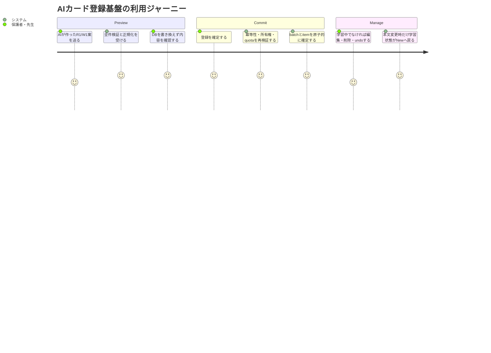
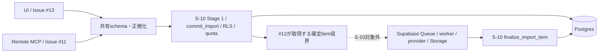

# 要件定義書: AIカード登録基盤

## 1. 概要

### 1行要約
アプリ内AI生成と外部AI連携が、同じ所有権・重複判定・冪等性・利用上限を使って安全にAIカードを登録・管理できるDBおよび共通ドメイン契約を提供する。

### 背景とユーザー価値
現行の `cards.card_key` は全ユーザーで一意であり、異なる利用者が同じ内容の非公開カードを所有できない。保護者・先生が子どもの苦手な漢字を個別登録できるよう、公開Seedを不変のまま、本人所有カードだけを安全に登録・編集・削除できる基盤が必要である。

### プライマリーユーザー
- 保護者・先生を想定したログインユーザー（MVPでは既存ロールがないため全ログインユーザー）
- 後続ストーリーでUI、Remote MCP、Queueを接続する開発者

### ユーザーストーリー
```text
As a logged-in parent or teacher
I want AI-created R1/W1 cards to be stored under my ownership without duplicates or quota races
So that I can safely prepare private practice material for a child
```

## 2. スコープと優先順位

### Must（S-10）
1. 所有者単位の非公開カード重複判定と公開カードの一意性を両立する。
2. インポートbatch/item、upload、tag、利用量の所有者境界をDBで強制する。
3. Stage 1検証、preview token、commit、冪等性、JST日次quotaを改ざん・競合に耐える契約にする。
4. 学習中カードの編集・削除・undo拒否と、本文変更時の学習状態リセットをDBで強制する。
5. バッチ単位undoと、公開Seedの不変性を保証する。
6. 既存migrationを変更せずforward migrationとして、空DBと現行Seed済みDBの両方に適用できる。
7. UIとMCPで共有するTypeScript schema、正規化、card key、preview HMACの純粋な契約を提供する。

### Should
- DB競合は安定したエラーコードへ分類し、後続のHTTP/MCP層が同じ意味で返せるようにする。
- DB関数経由だけでなく、許可された `cards` 直接UPDATE/DELETEでも学習中guardとreview resetを迂回できないようにする。

### Could
- 利用量・batch/itemの監査に必要な非機密メタデータを、後続の運用機能が参照できるよう保持する。

### Won't / Out of Scope
- OpenAI、Geminiその他providerの呼び出し、モデル選択、moderation実行。
- アプリ画面、カード管理UI、Route Handler。
- Remote MCP transport、OAuth、MCPツール公開。
- Supabase Queues、`pgmq`、enqueue、worker、再試行、provider実行、画像生成・Storage処理。これらはIssue #12の責務である。workerが結果を確定するために呼ぶQueue非依存DB primitiveはS-10に含む。
- provider secretやpreview HMAC secretの環境変数配線。
- R2/W2、一般問題形式、公開・共有カード。

## 3. 決定済みドメイン契約

### 3.0 既存機能との境界
- 既存Auth、`cards`、`decks`、`deck_cards`、`review_states`、`study_sessions`、`illustrations` は互換接続先として維持する。
- AI import tables、RLS、RPC、card-key、TypeScript共有schema、preview HMAC、テストはclean-slateで新規に定義する。
- 旧 `card_key` 算出処理および既存の直接CRUDをAI import経路へ流用しない。
- 既存機能から許可される直接DMLには、active-session guard、review reset、所有者整合などの不変条件をDBで同じように強制する。
- DB primitiveの具体的なSQL方式、locking方式、権限方式と選定理由はADR/Design Docで定義する。本書は外部観測可能な契約を正本とする。

### 3.1 対応カード
- `pattern='R1'` は `skill='reading'`、`pattern='W1'` は `skill='writing'` とする。
- front/backは正規化後1〜200文字とし、漢字側に最低1文字の漢字を含める。
- 1リクエストはR1/W1展開後1〜50カードとする。
- 同一conceptにR1、W1を各最大1件だけ許可し、ペアはfront/backが相互一致する。
- `clientItemId` は1〜64文字かつrequest内で一意とする。
- tagは1card最大10件、表示名の正規化後1〜30文字とする。
- tag表示名はNFKC後、Unicode White_Spaceの前後除去と連続部分のASCII SPACE 1文字への圧縮を行った値を保持する。重複判定用の正規化名は、その表示名をさらにUnicode小文字化した値とする。

### 3.2 正規化と `card_key`
表示値の大文字小文字は保持し、重複判定値だけを次の順で作る。

1. Unicode NFKC
2. 前後のUnicode White_Spaceを除去
3. 連続するUnicode White_SpaceをASCII SPACE 1文字へ圧縮
4. Unicode小文字化
5. `pattern + U+001F + front + U+001F + back` のUTF-8 SHA-256 lowercase hexを `card_key` とする

Unicode White_Space集合は次で固定し、TypeScriptとSQLテストが同一fixtureを参照する。`U+FEFF`は含めない。

```text
U+0009..U+000D, U+0020, U+0085, U+00A0, U+1680,
U+2000..U+200A, U+2028, U+2029, U+202F, U+205F, U+3000
```

- 公開カード: `visibility='public'` の `card_key` を全体で一意にする。
- 非公開カード: `visibility='private'` の `(owner_user_id, card_key)` を一意にする。
- 異なる所有者の同内容カード、および公開Seedと同内容の非公開カードは許可する。
- 既存cardの `card_key` は新規則でSHA-256 backfillし、backfill完了後に部分一意契約を有効にする。衝突がある場合はmigration全体を失敗させ、恣意的な削除・統合をしない。
- S-02/S-04の旧 `UNIQUE(card_key)` と旧生成規則は、本要件に合わせて仕様・テストを更新対象とする。

### 3.3 永続データ
- `cards` に `updated_at` と更新日時契約を追加する。公開カードは更新・削除不可とする。
- `ai_import_batches`: owner、source、target deck、自動作成deck、status、idempotency key、正規化request hash、件数、日時を保持する。
- `ai_import_items`: owner、batch、client item、concept、カード案、画像方式、結果card、error、`user_edited_at`を保持する。
- `ai_uploads`: owner、用途、Storage path、MIME、byte数、作成・消費日時を保持する。
- `tags`: owner、表示名、正規化名を保持し、同一owner内で正規化名を一意にする。
- `card_tags`: `owner_user_id` を明示保持し、card・tag・関連行のowner一致をDB制約またはtriggerで常に保証する。
- `ai_usage_daily`: owner、JST日付、AI生成カード数、AI生成画像数を保持する。
- `idempotency_key` はowner単位で一意とする。
- `deck_cards`: public card、または `card.owner_user_id = deck.owner_user_id` のprivate cardだけを関連付けられる。INSERT/UPDATEのどちらでもcross-owner関連を拒否する。

### 3.4 RLSマトリクス

| 対象 | 所有者 | 非所有者 | 未認証 | 公開データの例外 |
|---|---|---|---|---|
| private `cards` | SELECT可。INSERT/UPDATE/DELETEはowner一致かつDB guard適用 | 全操作拒否 | 全操作拒否 | なし |
| public `cards` | 既存参照契約に従いSELECT可 | 既存参照契約に従いSELECT可 | 既存参照契約を維持 | INSERT/UPDATE/DELETEは通常利用者に不可 |
| `deck_cards` | owner deckへpublic cardまたは同一owner private cardだけを関連付け可 | 他owner deckの全操作、およびcross-owner INSERT/UPDATEを拒否 | 全操作拒否 | public cardの関連付けのみ可 |
| `ai_import_batches` | SELECT可。変更はowner認証済みRPC契約のみ | 全操作拒否 | 全操作拒否 | なし |
| `ai_import_items` | SELECT可。変更はowner認証済みRPC契約のみ | 全操作拒否 | 全操作拒否 | なし |
| `ai_uploads` | 本人分のみ参照・許可された状態変更 | 全操作拒否 | 全操作拒否 | なし |
| `tags` | 本人分のみ参照・作成・変更・削除 | 全操作拒否 | 全操作拒否 | なし |
| `card_tags` | owner一致するcard/tag間のみ操作可 | 全操作拒否 | 全操作拒否 | なし |
| `ai_usage_daily` | 本人分SELECT可。加算は原子的DB関数のみ | 全操作拒否 | 全操作拒否 | なし |

RLSだけに依存せず、ownerを受け取るDB関数は認証主体と一致することを再検証する。存在秘匿が必要な非所有リソースはnot-found相当として扱う。

### 3.5 Stage 1とpreview token
Stage 1は全件検証であり、1件でも不正ならcard、deck、batch、item、tag、card_tags、usageを0件のままにする。検証対象はschema、R1/W1整合、50枚上限、`clientItemId`の長さ・request内一意性、tagの件数・長さ・正規化後一意性、batch内重複、既存owner内重複、deck所有権・一意解決、upload所有権・状態、quotaである。検証途中の例外でも同じロールバック条件を満たす。

preview tokenは `userId`、正規化済みrequestのSHA-256、`expiresAt` を含む30分有効のHMAC署名tokenとする。署名・検証はsecretを引数注入する純粋関数とし、環境変数を直接参照しない。commit時に署名、owner、期限、request hashを再検証し、TOCTOU対策として重複・deck・quotaもDBトランザクション内で再検証する。

### 3.6 commit、finalize、冪等性、quota
- `commit_import` はQueueに依存せず、deck解決、batch/items、tags、利用枠を1トランザクションで確定する。この時点ではcardとcard_tagsを作成しない。
- `finalize_import_item` は、#12 workerがprovider/Storage処理後に呼ぶQueue非依存DB primitiveとする。owner・batch/item状態・重複・deck関連を再検証し、card、deck_card、card_tags、item結果を1トランザクションで確定する。同一itemの再実行は副作用を増やさない。
- S-10は `commit_import` と `finalize_import_item` のDB primitiveおよび契約を提供するが、Queue作成、`pgmq`、enqueue、workerは提供しない。
- 同じowner・idempotency key・同じrequest hashのcommit再送は、並行実行を含め同じbatchを返し、batch/item/tag/usageを増やさない。
- 同じowner・idempotency keyでrequest hashが異なる場合は `CONFLICT` として拒否する。
- 日次境界は `Asia/Tokyo` の00:00:00〜23:59:59とする。
- AI生成カードは1ユーザー1日200カード、AI生成画像は1ユーザー1日50conceptを超えて予約できない。
- MCPで外部AIが生成済みのカードはカード生成枠の対象外、upload画像はAI画像枠の対象外とする。
- provider開始時予約とcommitが同一idempotency単位を参照し、再試行で二重消費しない。provider開始前の入力拒否は消費しない。
- 競合する予約でも、上限内の要求だけを成功させる原子性を保証する。具体方式はADR/Design Docへ委譲する。

### 3.7 学習中guardと学習状態
未完了セッションは `finished_at IS NULL` とする。対象cardが `current_card_id` または `queue_due/queue_learn/queue_new/queue_retry` のUUID文字列に含まれる場合、編集・削除・undoを副作用なしで `ACTIVE_SESSION`（HTTP 409相当）として拒否し、対象session IDとdeckを識別可能にする。JSON配列中のUUID文字列以外は既存parser同様に無視する。

判定と変更は同一DBトランザクションで行う。RPCだけでなく `cards` への許可された直接UPDATE/DELETEにもDB trigger等で同じguardを適用し、迂回を許さない。

- front、back、skill、patternのいずれかが実際に変更された場合、そのcardに紐づく全 `review_states` を削除してNewへ戻す。
- illustration、tag、所属deckだけの変更では `review_states` を維持する。
- 本文変更とreview resetは原子的に行い、直接UPDATEでも強制する。

### 3.8 undo
- batch ownerだけが実行でき、batch作成card、関連付け、参照されなくなった関連データを原子的に取り消す。非ownerは `UNAUTHORIZED` またはnot-found相当で拒否する。
- batch内に `user_edited_at` 設定済みcardが1件でもあれば全体を `CARD_MODIFIED` で拒否する。
- active session対象cardが1件でもあれば全体を `ACTIVE_SESSION` で拒否する。
- 個別削除済みcardは無視する。既にundoneのbatchへの再実行は成功扱いとする。
- 自動作成deckは空になった場合だけ削除する。公開Seedおよび他batch・他cardのデータは変更しない。

### 3.9 migrationとSeed不変性
- 既存migrationは編集せず、forward migrationだけを追加する。
- 移行時に既存cardの `card_key` を新SHA-256規則でbackfillする。公開SeedのID、本文、skill、pattern、deck関連、件数は変更しない。
- 現行Seedの再実行後も公開カード・deck・関連件数が増えず、更新・削除不能である。
- 検証経路は (A) 空DBへ全migration chain＋seedを適用するfresh reset、(B) 現行migration＋seed済みDBへ新migrationを適用するupgrade の2つを必須とする。
- migration前snapshotはID、本文、skill、pattern、deck関連、件数と旧 `card_key` を記録する。一般の不変項目比較に `card_key` は含めない。
- migration後は、各cardの新しい正規化・SHA-256再計算期待値とbackfill後 `card_key` の一致を個別に検証する。
- seed再実行後は、migration後に確定した新 `card_key` が不変であることを検証する。
- migration途中へ意図的な失敗を注入した試験で、スキーマ、制約、backfill対象データがすべて適用前状態へ戻ることを保証する。

## 4. エラー契約
最低限、`VALIDATION_ERROR`、`DUPLICATE_IN_REQUEST`、`DUPLICATE_EXISTING`、`DECK_NOT_FOUND`、`DECK_AMBIGUOUS`、`QUOTA_EXCEEDED`、`ACTIVE_SESSION`、`CARD_MODIFIED`、`CONFLICT`、`UNAUTHORIZED`、`INTERNAL_ERROR`を区別する。内部SQL、stack、token、カード本文をエラーやログへ露出しない。

## 5. 非機能要件・成功指標
- 原子性: Stage 1失敗、quota競合、冪等再送、guard拒否のすべてで部分的な永続化が0件である。
- セキュリティ: 非所有者による対象テーブルのSELECT/INSERT/UPDATE/DELETE成功率が0%である。
- 一貫性: 同一ownerの重複成功率0%、異なるownerの同内容作成成功率100%である。
- 上限: 200カード/50画像境界の並行予約試験で超過が0件、二重消費が0件である。
- 移行: fresh resetとseed済みupgradeの両経路が成功し、一般のSeed不変項目はmigration前後で差分0、新 `card_key` はmigration後とseed再実行後で差分0である。
- 保守性: 外部runtime validator依存を追加せず、共有schema moduleの型・型guard・正規化関数をUI/MCP後続で再利用できる。

## 6. ユーザージャーニー


## 7. スコープ境界図


## 8. 受入条件（Issue #10正本）
1. **AC-01 異なる所有者**: 同じ正規化内容のitemを異なる2ユーザーのbatchとしてcommitし、各itemをfinalizeしたとき、部分一意契約により両方のcard作成が成功する。
   - AC-01a: 各card、deck_card、card_tagsのownerが呼出主体と一致する。
   - AC-01b: 公開Seedと同じ内容のprivate cardもfinalizeできる。
2. **AC-02 重複拒否**: 同一ownerの重複をStage 1またはfinalize時のDB競合で拒否する。
   - AC-02a: 同一request内の重複は `DUPLICATE_IN_REQUEST` となり、commit副作用が0件である。
   - AC-02b: commit時に存在する同一owner cardは `DUPLICATE_EXISTING` となり、commit副作用が0件である。
   - AC-02c: commit後・finalize前に同一owner cardが作られた場合、finalizeは部分一意契約によりitemを重複エラーへ確定し、card、deck_card、card_tagsを増やさない。
3. **AC-03 Seed不変性**: migration前後で公開SeedのID・本文・skill・pattern・deck関連・件数が一致し、`card_key` は移行時の期待変更として別に検証する。
   - AC-03a: migration前に各既存cardの旧 `card_key` を記録し、一般の不変snapshotからは除外する。
   - AC-03b: migration後に各既存cardの新しい正規化・SHA-256再計算期待値とbackfill後 `card_key` が一致する。
   - AC-03c: seed再実行後に新 `card_key` がmigration後の値から変化しない。
   - AC-03d: 通常利用者による公開SeedのUPDATE/DELETEを拒否する。
4. **AC-04 preview・冪等commit**: preview tokenとidempotency境界が改ざん・再送・並行実行に耐える。
   - AC-04a: HMAC署名不正、owner不一致、期限切れ、request hash不一致をそれぞれ拒否し、永続副作用を0件にする。
   - AC-04b: 同一owner・idempotency key・request hashの並行commitではbatchが1件だけ作成され、全呼出しが同じbatch IDを取得し、item・tag・quotaを二重確定しない。
   - AC-04c: 同一owner・同一idempotency keyでrequest hashが異なる再送は `CONFLICT` とし、既存batchを変更しない。
5. **AC-05 JST quota**: `Asia/Tokyo`の日付境界前後および並行予約で、1日200カード/50画像conceptを超える要求だけを `QUOTA_EXCEEDED` とし、成功分合計が上限を超えない。
   - AC-05a: MCP外部生成cardとupload画像は該当quotaを消費しない。
   - AC-05b: 同じ予約idempotencyの再送は利用量を増やさず、異なる予約だけを加算する。
   - AC-05c: provider開始前の拒否では消費せず、開始済み予約は成功・拒否・失敗にかかわらず返却しない。
6. **AC-06 Stage 1 rollbackとcommit境界**: Stage 1対象条件を1つ以上不正にしたとき、deck、card、batch、item、tag、card_tags、usageの増分をすべて0件にする。
   - AC-06a: 50枚上限、`clientItemId`の1〜64文字・request内一意、tagの1card 10件・1〜30文字・正規化後一意を個別に拒否できる。
   - AC-06b: 正常commitはbatch、items、tags、quotaを原子的に確定し、card、deck_card、card_tagsは0件のままとする。
   - AC-06c: `finalize_import_item` はcard、deck_card、card_tags、item結果を原子的に確定し、同一itemへの再実行で副作用を増やさない。
7. **AC-07 active session guardとundo**: 未完了sessionのcurrentまたは4 queueのいずれかにcard IDがあるとき、RPCおよび直接DMLによる編集・削除・undoを `ACTIVE_SESSION` で拒否し、対象データを変更しない。
   - AC-07a: 非ownerのundoを拒否し、`user_edited_at` 設定済みcardが1件でもあるbatchは `CARD_MODIFIED` で全体拒否する。
   - AC-07b: 個別削除済みcardは無視し、既にundoneのbatchへの再実行は同じ成功結果を返す。
   - AC-07c: 自動作成deckはundo後に空の場合だけ削除し、他cardが残る場合は維持する。
8. **AC-08 review reset/keep**: front/back/skill/patternを変更したとき対象cardの `review_states` を同一transactionで削除し、illustration/tag/deckだけを変更したときは変更前の `review_states` を完全一致で維持する。
   - AC-08a: 管理RPCと許可されたcards直接UPDATEの両経路で同じ結果になる。
   - AC-08b: 更新自体が失敗した場合はreview_statesも変更しない。
9. **AC-09 RLS・所有者整合**: 2ユーザー・未認証actorでRLS matrixの全SELECT/INSERT/UPDATE/DELETEを検証し、非所有privateデータへの操作をすべて拒否する。
   - AC-09a: `card_tags`でcard owner、tag owner、関連行ownerが一致しないINSERT/UPDATEを拒否する。
   - AC-09b: `deck_cards`はpublic cardまたは `card.owner_user_id = deck.owner_user_id` の場合だけ許可し、cross-owner private cardのINSERT/UPDATEを拒否する。
   - AC-09c: owner引数の偽装によってRPCの所有者境界を越えられない。
10. **AC-10 migration二経路とrollback**: 空DBへの全migration chain＋seedと、現行seed済みDBへのforward migrationの両方が成功し、各経路でAC-01〜AC-09のDB契約を満たす。
   - AC-10a: upgrade経路で既存cardのSHA-256 `card_key` backfillと部分一意契約が完了する。
   - AC-10b: migration途中へ意図的な失敗を注入すると、追加schema、制約、backfillデータがすべて適用前状態へ戻る。

## 9. ACトレーサビリティ
| AC | 主な検証 | 期待値 |
|---|---|---|
| AC-01〜02 | 正規化fixture、部分unique、commit/finalize DB統合試験、commit-finalize間競合 | owner間・公開/private間許可、owner内/batch内拒否 |
| AC-03 | migration前の旧key記録、一般Seed snapshot、新key再計算、seed再実行、公開card DML拒否 | 一般項目は前後不変、migration後はSHA-256期待値一致、seed再実行後は新key不変 |
| AC-04 | token署名・owner・期限・hash改ざん、同時commit、同key別hash | 不正token副作用0、batch 1件、別hash conflict |
| AC-05 | JST固定時刻・並行予約・免除source・同一予約再送 | 200/50以下、免除0消費、再送0加算 |
| AC-06 | validation matrix、正常commit差分、finalize再送 | 失敗時全増分0、commit時card 0、finalize副作用1回 |
| AC-07 | current＋4 queue、RPC＋直接DML、undo全分岐、自動deckの空/非空 | 409相当、変更0、undo冪等、空deckのみ削除 |
| AC-08 | 変更列別・更新失敗・RPC/直接UPDATE試験 | 本文4列はreset、他3領域はkeep、失敗時不変 |
| AC-09 | actor×table×operation、card_tags/deck_cards owner不一致、RPC owner偽装 | 非owner/未認証/cross-owner成功0件 |
| AC-10 | fresh reset、seeded upgrade、失敗注入rollback | 両経路成功、backfill完了、失敗時差分0 |

## 10. 依存関係・前提
- Parent Epic: GitHub Issue #9。
- 既存契約: S-02（schema/RLS）、S-04（Seed）、S-05/S-07（review/session）。旧 `card_key` 契約は本要件に合わせて更新する。
- 後続: #12がQueue・worker・provider・Storageを接続し、#11/#13/#14がMCP・UI・管理機能を接続する。
- Queue非依存のcommit結果は#12が安全に引き継ぎ、処理結果をS-10のfinalize primitiveへ渡す。S-10単独では非同期処理を開始しない。
- issue-sprintの通常停止ポイントは承認済みであり、要件作成後は設計・計画・実装へ自律継続できる。ただし `/ship`、merge、deploy、Issue closeは行わない。

## 11. リスクと軽減策
| リスク | 影響 | 軽減策 |
|---|---|---|
| 旧全体uniqueとの競合 | 別ownerが登録不能 | forward migrationと二経路試験で置換を確認 |
| RPC外の直接DMLがguardを迂回 | 学習中変更・SRS不整合 | DB trigger等で同じguard/resetを強制 |
| preview後の競合・改ざん | 重複・quota超過 | HMAC検証とcommit transaction内再検証 |
| QueueをS-10へ混在 | 責務肥大・移行失敗 | `pgmq`/enqueueを#12へ明示分離 |
| owner不一致tag関連 | 越境参照 | `card_tags.owner_user_id`とDB整合保証 |

## 12. 変更履歴
| Version | Date | Changes |
|---|---|---|
| 1.0.0 | 2026-07-14 | Issue #10の初版要件を作成 |
| 1.1.0 | 2026-07-14 | commit/finalize責務、deck_cards所有者整合、preview/idempotency/quota/undo、card_key backfill・migration rollback、入力上限の検証契約を補強 |
| 1.1.1 | 2026-07-14 | card_key移行検証の時系列分離、tag正規化順の明記、card_tags表記統一 |
