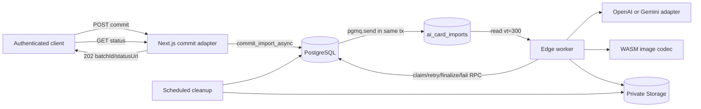
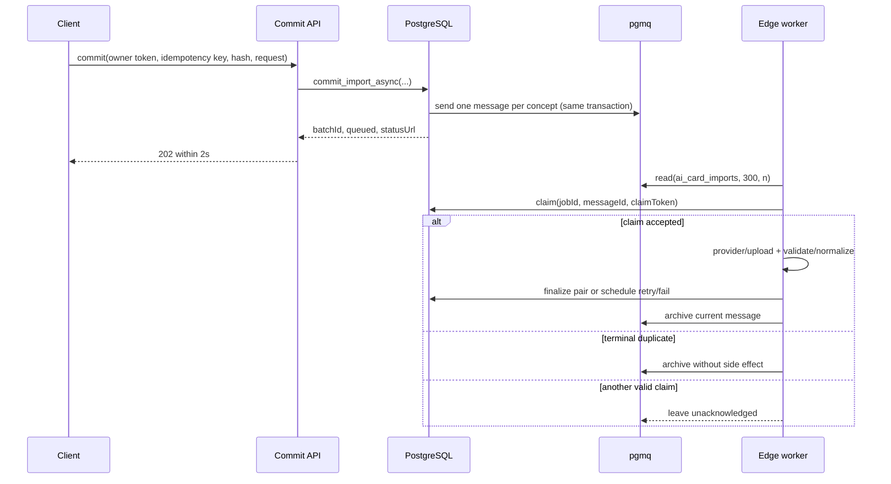

# Design Doc: AIカード非同期Queue・画像処理

## 1. 目的・設計境界

S-10のowner、idempotency、quota、card確定primitiveを維持しながら、commit後のconcept単位処理をSupabase Queues（pgmq）とEdge Functionへ移す。commitはprovider、画像decode、Storage、card作成を待たずHTTP 202を2秒以内に返し、永続statusへ再接続できることを正本とする。OpenAIによるカード本文生成UI、OAuth、MCP transportは対象外である。

### 合意事項チェックリスト

- [x] queue名は`ai_card_imports`、visibility timeoutは300秒。
- [x] messageはconcept単位、業務正本はDB job、claim tokenで旧workerをfenceする。
- [x] retryはnetwork/408/429/5xxだけ、delayは5/30/120秒、最大3 retry（総4試行）。
- [x] providerは`openai | gemini`、未指定OpenAI、provider/modelの自動fallbackなし。
- [x] sourceは最大5件、各10MiB、合計50MiB、16MP、magic/MIME/decodeを検証する。
- [x] illustration入力は正規化前に両辺64px以上を検査し、縦横比を維持して最大辺1024px以下のmetadataなしPNGへ正規化する。縮小後の短辺には64px最小を再適用しない。
- [x]同一owner・batch・conceptのR1/W1は1 illustrationを共有しpairを原子的に確定する。
- [x] source/orphanは通常経路で即時削除し、残存物は作成24時間到達後の最初のscheduled cleanupで回収する。
- [x] API key、Authorization、画像bytes/base64、card/prompt本文、raw payload/bodyを記録しない。

## 2. 既存コードベース分析とsteering適用

| 証拠 | 現状 | S-11での扱い |
|---|---|---|
| `frontend/package.json`, `frontend/app/`, `frontend/src/lib/ai-import/` | Next.js 14 App Router、TypeScript、Vitest、S-10の`validateImportRequest`/`hashImportRequest`/`verifyPreviewToken`/safe error mapping | routeは`frontend/app`へ置き、S-10の検証・hash・token契約を再利用する |
| `supabase/migrations/20260714000000_s10_ai_card_import_foundation.sql` | batch=`committed/processing/completed/undone`、item=`committed/processing/finalized/failed/deleted/undone`、owner/idempotency/quota/finalize primitiveあり | 既存migrationは変更せずforward migrationでjob/RPC/constraintを追加する |
| `frontend/src/lib/illustration/*` | Gemini専用、Node `Buffer`、fire-and-forget、`upsert:true` | prompt policyだけ再利用し、Edge用adapter/codec/Storage境界を新設する |
| `supabase/migrations/20260223000001_s02_storage_illustrations.sql` | private `illustrations` bucketとowner path | bucketは維持し、決定的pathと参照再確認cleanupを加える |
| `specs/stories/S-10-*/tests/helpers` | DB testkit、fresh/upgrade/failure試験 | S-11 integration testkitを同じ配置規則で追加する |

`.claude/steering/architecture/{overview,backend,frontend}.md`は別製品Hapico（NestJS/Prisma/Next.js 16）を記述しており、このリポジトリ実体と一致しない。また必須参照の`architecture/implementation-approach.md`は存在しない。このため当設計ではそれらを実装根拠にせず、上表の実コード、`technical-spec.md`、ADR-008、S-08/S-10の実装パターンを正とする。steering自体の修正は本storyのproduction scope外とし、work planにリポジトリ保守riskとして渡す。

UI変更はなくFigma/画面構造調査は不要である。

## 3. 実装アプローチ

水平基盤（migration、Queue、provider/codec）を先に作り、その後concept単位のcommit→worker→statusを縦に接続するハイブリッド方式を採用する。Queue、Storage、providerを同時に接続するため純粋な垂直実装だけでは失敗分類とfencingを検証できず、水平方式だけでは2秒commitと再接続のE2E契約を遅らせるためである。





## 4. 配置と変更影響マップ

### 実装パスマッピング

| 種別 | 予定パス | 責務 |
|---|---|---|
| forward migration | `supabase/migrations/*_s11_ai_card_async_processing.sql` | pgmq、job/tracking、RPC、trigger、RLS/grant、bucket |
| worker | `supabase/functions/ai-card-import-worker/` | read、claim、provider、codec、Storage、retry/finalize |
| cleanup | `supabase/functions/ai-card-import-cleanup/` | source/orphan/delete候補の再確認と削除 |
| shared Edge code | `supabase/functions/_shared/ai-card-import/` | 型、validator、backoff、redaction、provider interface |
| HTTP adapter | `frontend/app/api/ai/imports/commit/route.ts`, `frontend/app/api/ai/imports/status/route.ts` | auth、入力検証、RPC、HTTP変換 |
| upload adapter | `frontend/app/api/ai/imports/sources/{prepare,complete}/route.ts` | signed upload、owner path、complete検証起動 |
| S-10共有契約 | `frontend/src/lib/ai-import/{schema,canonical-request,preview-token,errors}.ts` | commit入力・hash・token・safe errorを拡張し、既存正本を重複実装しない |
| function/schedule設定 | `supabase/config.toml`、S-11 forward migration、運用runbook | service-to-service認証、5秒以下のworker poll、15分cleanup、secret/Vault設定 |
| tests | `specs/stories/S-11-ai-card-async-processing/tests/` | unit/integration/E2E skeletonとtraceability |

### 変更影響マップ

| 区分 | 対象 |
|---|---|
| 変更対象 | commit契約、S-10 status mapping、illustration生成、Storage lifecycle |
| 直接影響 | S-11 forward migration、Edge Functions、Next route handlers、環境変数、S-11 tests |
| 間接影響 | S-09 signed URL表示、S-10 undo/delete/quota、運用schedule/secrets |
| 波及なし | 既存public card、SRS計算、学習UI、認証UI、カード本文生成UI、OAuth/MCP transport |

### インターフェース変更マトリクス

| 既存 | 新規 | 変換 | 互換性 |
|---|---|---|---|
| `commit_import_internal` | `commit_import_async_internal` | S-10確定後job/message作成 | forward migration、既存関数は残す |
| item `committed/finalized` | API `queued/succeeded` | status viewでmapping | 物理状態を破壊変更しない |
| item単位`finalize_import_item_internal` | `finalize_ai_import_concept` | R1/W1を1 transactionで確定 | 内部primitiveを再利用しpair rollbackを保証 |
| Gemini専用generator | `IllustrationProvider` adapters | provider結果を共通Resultへ変換 | S-08 reveal経路は維持 |
| Storage `upsert:true` | S-11 `upsert:false` | stable object path | AI import経路だけ変更 |
| Queueなしの同期実行 | `pg_cron` + `pg_net` → worker pull | 5秒以下の周期で1 invocation/1 concept | Queueを正本とし、重複invocationはvisibility/claimで無害化 |

## 5. 永続データ・Queue契約

### `ai_import_concept_jobs`

| 列 | 契約 |
|---|---|
| `id uuid PK` | Queue payloadの`jobId` |
| `owner_user_id`, `batch_id`, `concept_id` | owner FK、`UNIQUE(batch_id, concept_id)` |
| `state` | `queued | processing | succeeded | failed | undone` |
| `queue_message_id bigint` | 現在有効なmessage ID |
| `attempt smallint` | 0=初回、1..3=retry、CHECK 0..3 |
| `claim_token uuid`, `claim_expires_at timestamptz` | processing時だけ必須、300秒lease |
| `terminal_message_id bigint`, `terminal_claim_token_hash text` | failed transactionを確定したclaim identity。raw tokenをowner-readable rowへ残さず、failed時だけ必須でfailure reconciliationを同一attemptへfenceする |
| `next_attempt_at`, `error_code`, timestamps | safe metadataだけ。本文/raw error禁止 |

jobは全distinct conceptに1件作る。commit時に同一concept内の既存itemを検査し、`image_mode`とupload時の`upload_id`が一致しなければenqueue前にvalidation failureとする。片側conceptは存在する1itemだけを処理する。`none`はprovider/Storage/quotaを呼ばずpair/単独cardを確定し、`ai`はprovider生成、`upload`は検証済みsourceをillustration入力として処理する。

### object lifecycle追跡

- `ai_uploads`をforward migrationで`prepared -> ready -> cleanup_pending -> cleaning -> deleted`へ拡張し、raw/source bucket/path、source write intent、`detected_mime_type`, `width`, `height`, `delete_due_at`、source/raw別cleanup claim UUID/previous stateを追加する。S-10 rowはsource bucket=`illustrations`でbackfillしてobjectを移動せず、新規signed uploadだけをprivate `ai-card-sources`の`{ownerUserId}/{uploadId}/raw|source`へ保存する。sanitized sourceはStorage write直前にexact deterministic pathをdurable intentとして登録し、成功時にready pathへ昇格、応答喪失・write後crashは404-safe cleanupへ収束する。
- `ai_upload_consumers(upload_id,job_id,owner_user_id)`をdurable associationとし、同一uploadを参照する全jobがterminalになるまでsourceをreadyのまま保持する。最後のterminal consumerだけがupload rowをlockしてcleanup pendingへ遷移し、記録bucket/pathを即時削除へ渡す。
- `ai_illustration_objects`は`illustration_id` unique、stable path=`{owner}/s11-managed/{illustrationId}.png`、`state=uploading|ready|orphan|delete_pending|cleaning|deleted`、`delete_due_at`、cleanup lease、claim前の`cleanup_previous_state`を持つ。retry completionは`delete_pending`を`orphan`へ潰さず復元する。object bodyやpromptを持たない。
- `ai_worker_log_outbox`はfailure/poison/duplicateのsafe IDs/code/reasonだけをterminal/archive transaction内で一意化する。worker invocationはUUIDでoutbox rowをclaimし、stable `eventId`付きallowlist logを出してからexact tokenでcompleteする。crash再送は同じevent IDとなり、logger/collectorが冪等に重複排除する。terminal commit後のclaim/complete failureはsafe best-effort境界で隔離し、durable `failed`を`recoverable`へ上書きせず、upload source releaseをfinallyで直ちに継続する。未complete eventは同じDB-clock leaseで再claimする。
- `(owner_user_id,batch_id,concept_id)`のillustration associationをuniqueにし、カード2件は既存`illustration_key`から同じillustrationを参照する。
- `ai_illustration_objects.reference_count`をcard参照数のatomic metadataとする。canonical row-lock classは既存cards（UUID順）→illustrations（UUID順）→`ai_illustration_objects`（UUID順）である。新規card INSERTは既存card rowがないためillustrationsから入り、tracking-only claim/recoveryは後から前段classを取得しない。共通`ai_s11_lock_illustration_lifecycle`はillustrationsを全件lockしてからtrackingを全件lockし、S-10 attach/create/update/delete/undo、S-11 finalize/fail/card trigger、cleanup verify/complete、owner/service lifecycle updateはこの順序またはそのprefix/suffixだけを使う。S-10 attachのforward overrideはlocked cardのOLD keyと要求NEW IDを同owner内で解決し、OLD+NEW全件をhelperへ渡してからready/pathを再検証しcardを更新するため、A→B/B→Aもtarget-only lockを作らない。AFTER triggerは既に保持中のlock上でinsert/remove/different-key updateを加減し、sibling cardを取得しない。2→1は`ready`、1→0だけ`delete_pending`とし、未claim pending attachは同じtracking lock上でreadyへ戻す。
- cleanup-deleted illustration guardはSECURITY DEFINERの`current_user`を権限根拠にせず、`request.jwt.claim.role='service_role'`だけを内部lifecycle操作として扱う。deletedのstatus/path復活はauthenticated ownerにP1008、service cleanupは許可し、deleted trackingを持たないlegacy owner updateは従来どおり許可する。

### Queue payload（version 1）

```json
{"version":1,"jobId":"uuid","batchId":"uuid"}
```

owner ID、concept文字列、card text、prompt、画像、secretをpayloadへ含めない。workerはjob joinからowner/conceptを得る。queue schemaをData APIへ公開せず、service-role専用SECURITY DEFINER RPCだけに`pgmq`権限を与える。

### 状態mapping

| 外部 | S-10 item | job | 条件 |
|---|---|---|---|
| `queued` | `committed` | `queued` | 未claimまたはretry待機 |
| `processing` | `processing` | `processing` | 有効claimあり |
| `succeeded` | `finalized` | `succeeded` | card確定済み |
| `failed` | `failed` | `failed` | safe error確定 |
| `undone` | `undone`または`deleted` | `undone` | undo/delete terminal |

batch API状態はitemsから導出する。全terminalかつ成功のみ=`completed`、成功/失敗混在=`partial`、成功0かつ失敗あり=`failed`、全undone=`undone`。それ以外でprocessingあり=`processing`、なければ`queued`。既存物理batch `completed`を外部の成功意味に直接流用しない。

## 6. HTTP・RPC・内部型契約

### Commit API

`POST /api/ai/imports/commit`

- auth: Supabase authenticated owner。bodyのownerは信用しない。
- input: S-10 normalized request、`idempotencyKey`、`importRequestHash`、`previewToken`、`cardReservationKey`。
- success: HTTP 202、`{ batchId, status: "queued", statusUrl }`。同owner/key/hash再送も同じ値。異なるhashは409。
- timing: request受信からbody送信まで2,000ms未満。provider、decode、card finalizeを呼ばない。
- queue/RPC transactionまたはavailability失敗: HTTP 503 `{ error: { code: "SERVICE_UNAVAILABLE" } }`。batchだけ作って202を返さない。既知のvalidation/auth/authorization/conflict mappingと成功payload contract failureの500は維持する。
- malformed JSONは400 `VALIDATION_ERROR`、PreviewTokenErrorは401 `UNAUTHORIZED`とする。success/status RPC dataはraw objectを返さず、enum、UUID、nonnegative counts、items/card IDs、safe error code、同一batch相対status URLをstrict parseしたallowlist DTOだけをserializeする。

`GET /api/ai/imports/status?batchId={uuid}`または`?idempotencyKey={key}`はowner RLS下で次を返す。

```typescript
interface ImportStatusResponse {
  readonly batchId: string
  readonly status: "queued" | "processing" | "completed" | "partial" | "failed" | "undone"
  readonly counts: { readonly total: number; readonly succeeded: number; readonly failed: number }
  readonly items: readonly {
    readonly itemId: string
    readonly conceptId: string
    readonly status: "queued" | "processing" | "succeeded" | "failed" | "undone"
    readonly cardId?: string
    readonly errorCode?: SafeImportErrorCode
  }[]
}
```

別ownerは存在秘匿の404。raw error、card text、Storage pathを返さない。
terminal itemのsafe error allowlistにはS-10互換`DUPLICATE_EXISTING`を含め、未知code、非文字列、statusと不整合なerror/card組合せはcontract failureにする。

### source upload

- `POST .../sources/prepare`: 1 request最大5 metadata、各`byteSize <= 10_485_760`かつ合計50MiB。owner pathと短期signed uploadを返す。
- `POST .../sources/complete`: raw objectをservice境界で取得し、actual bytesが`1..10_485_760`、magic/MIME一致、decode可、`width*height <= 16_000_000`であることを検証する。codecで不要metadataを除いたsanitized bytesをowner固定`source` pathへ`upsert:false`で保存し、そのdigest/寸法/MIMEを原子的に`ready`へ記録してrawを削除する。不正時は両objectを削除しsafe 422、削除失敗は24時間cleanupへ残す。
- commitはowner、ready、未consumed、path一致のuploadだけ参照できる。外部URLは入力型に存在させない。

### worker RPCの条件

| RPC | 事前条件 | 原子的結果 |
|---|---|---|
| `claim_ai_import_concept(job,message,token)` | payload妥当、terminalでない、messageが現在ID、DB clockでqueuedまたは旧claim期限切れ | jobとconcept内の全既存itemをprocessing、tokenとDB clock由来300秒expiryを設定し`claimed`を返す |
| `schedule_ai_import_retry(job,message,token,code,delay)` | current token、attempt<3、delayが5/30/120の該当値 | attempt+1、queued、新message send、旧message archive |
| `finalize_ai_import_concept(job,message,token,illustration)` | current token、pair全item非terminal | R1/W1 card/quota/illustrationを1 txで確定、job succeeded、archive |
| `fail_ai_import_concept(job,message,token,code)` | current token | concept全item failed、job failed、archive、空auto deck整理 |
| `get_ai_import_failure_state(job,message,token)` | response loss後の照合 | failed jobのterminal identityがmessage/tokenと一致するときだけ`terminal_failed`、別claimは`claim_lost` |
| `ack_inert_delivery(job,message)` | terminal、またはmessageが現在IDでない | 副作用なしで当該messageだけarchive |

すべての副作用RPCはjob IDとcurrent claim tokenを検証し、失効tokenを`CLAIM_LOST`で拒否する。

### delivery/ACK判定マトリクス

| delivery判定 | worker動作 | ACK/archive |
|---|---|---|
| jobが`succeeded`、`failed`、`undone` | provider、Storage、quota、cardを呼ばない | 当該messageをarchive。archive失敗時は次回同じ判定 |
| `message_id <> queue_message_id` | replacement済みstaleとして副作用なし | 当該stale messageをarchive |
| 現在message、別の未失効claimあり | 副作用なしで終了 | archiveしない |
| 現在message、`queued` | CASで`queued -> processing`成功時だけ開始 | terminal/retry RPCまでarchiveしない |
| 現在message、期限切れ`processing` | token/expiryをCAS置換できたworkerだけ再開 | 旧workerは`CLAIM_LOST`、新workerのterminal/retry RPCまでarchiveしない |
| payload不正またはjob不存在 | secret/本文なしのsafe codeでpoison扱い | 当該messageのarchive成功booleanを検証し、true確認後だけmessage ID相関の`worker_poison`を1件記録。false/例外/不明はpoisonなしでrecoverable |

Queueはpull型なので、`pg_cron` + `pg_net`がVault内service-to-service secretでworkerを5秒以下の周期にinvokeし、workerは`pgmq.read('ai_card_imports', 300, 1)`で1件だけ取得する。retry delayの正本はmessageの5/30/120秒であり、poll遅延を別retryとして数えない。scheduleはworker deploy・認証疎通後に有効化し、重複cron invocationは上表で無害化する。

### providerと画像codec

```typescript
type ProviderName = "openai" | "gemini"
type ProviderResult =
  | { readonly kind: "success"; readonly bytes: Uint8Array; readonly declaredMime: string }
  | { readonly kind: "transient"; readonly code: SafeImportErrorCode; readonly httpStatus?: number }
  | { readonly kind: "permanent"; readonly code: SafeImportErrorCode; readonly httpStatus?: number }

interface IllustrationProvider {
  generate(input: { readonly prompt: string; readonly signal: AbortSignal }): Promise<ProviderResult>
}
```

`ILLUSTRATION_PROVIDER`はtrim後の厳密値だけを受理し、未設定は`openai`。選択providerのkey/model欠落は`PROVIDER_CONFIG_ERROR`でretry 0。HTTP classifierはnetwork/408/429/500..599だけtransientとし、その他4xx、safety/moderation、decode/validationはpermanent。adapterを一度選択した後に別adapterを呼ばない。

provider success bodyはContent-Lengthとstream累計を独立に制限し、欠落・過少申告でもresponse budget超過を全materialize前に停止する。宣言oversizeはbody read前にshared helperでbest-effort cancelし、cancel absent/sync throw/async rejectionでも元の`IMAGE_TOO_LARGE`を必ず再throwする。stream overflowも同じhelper/contractを使い、cancel error/raw bodyをlogしない。base64はlength/paddingからdecoded-sizeを`atob`前に求め、10MiB超を恒久`IMAGE_TOO_LARGE`にする。OpenAI/Geminiの双方へ同じreader/decoderを適用する。

adapter endpoint未指定時は公式OpenAI/Gemini URLを固定defaultとする。overrideは`ILLUSTRATION_PROVIDER_ENDPOINT`と`ILLUSTRATION_PROVIDER_ENDPOINT_BINDING`のpaired HTTPS設定だけを許可し、userinfo/hash/partial bindingは`PROVIDER_CONFIG_ERROR`でprovider call前に拒否する。override adapterはbinding headerを送信し、real E2E fake control/statsは同じbindingとcall増分を必須にする。

codecはversion pinした`@imagemagick/magick-wasm`をEdgeで使用し、magic PNG/JPEG/WebP、実MIME一致、10MiB、decode、16MP、illustration入力の両辺64pxを正規化前に検証する。最大辺が1024px超なら縦横比維持で縮小し、超えなければ拡大せず、PNG再encodeでmetadataを落とす。入力条件を満たす極端な縦横比では縮小後の短辺が64px未満でも受理し、永続寸法は各辺1..1024とする。16MP境界に加え、decode bombと独立truncated decode failureが各々HTTP 422 `IMAGE_DECODE_FAILED`となること、および各失敗経路のCPU/RSS/wallをdeployment gateで実測する。

## 7. retry、障害回復、冪等性

retryはprocess内sleepではなくdelayed replacement messageで永続化する。backoffは`[5,30,120]`固定、jitterなし。DB transaction自体が不明/失敗した場合はattemptを増やさず、旧messageをACKせずvisibility後の再配信に委ねる。

| 障害点 | 回復契約 |
|---|---|
| commit応答喪失 | 同じidempotency key/hashで同じbatch/status URLを返す |
| worker crash前/中 | 300秒後に再配信。期限切れclaimだけCASで再取得 |
| 旧workerの遅延完了 | claim token不一致でDB確定拒否。stable object pathをcleanupへ収束 |
| provider transient | 5/30/120秒後に同じjobをretry。quotaを再予約/再消費しない |
| Storage upload失敗 | transient分類ならretry。terminal確定時だけdurable orphan後に即時補償削除し、失敗ならcleanupへ残す |
| DB finalize失敗 | claim所有を再照会する。`terminal_duplicate`はbusiness duplicateとして即時補償、未確定ならdurable orphan化後に補償、claim-lostは削除しない |
| cleanup途中停止 | tracking rowを残し、次回同じage/owner/reference条件を再評価 |

冪等キーはowner+idempotency key（batch）、batch+concept（job/illustration）、**job単位で固定したreservation key**（quota/provider開始）、owner+illustration ID（Storage path）、batch+card key（card）で固定する。`job+attempt`は観測用provider attempt IDにだけ用い、quota reservation keyには含めない。uploadは`upsert:false`。conflict readは10MiB制限後にだけdigest比較する。pre-work terminal duplicateは副作用なしでACKし、post-upload card-key duplicateはfinalizeのstrict `{status:'failed',errorCode:'DUPLICATE_EXISTING'}`を`failed_duplicate`へ写像する。response lossはterminal message/token SHA-256一致時だけ`terminal_duplicate`とし、durable orphan確認後に同じpathを即時best-effort削除する。

## 8. cleanup・参照削除

cleanupを15分間隔で起動する。sourceは全consumer terminal後のreleaseで即時削除する。age cleanupの`delete_due_at`は24時間到達前の選択を許可せず、eligible対象を最初のscheduled runで回収する。対象選択を5分lease + `SKIP LOCKED`で分割する。sourceの`cleanup_previous_status`は最初のclaimだけで保存し、stale `cleaning`再claimで上書きしない。

source/orphan age cleanupは`created_at + 24 hours <= now`を必須とし、23:59:59はprotected、24:00:00はeligibleとする。`delete_pending` illustrationは最後のcard参照削除後の即時候補なのでage条件を課さず、同一owner参照0を削除直前に再確認する。

cleanup claimは`orphan | delete_pending`を`cleaning`へ変える前のstateをdurableに保存する。Storage delete失敗またはverify skipは元stateへ戻し、`delete_pending`は24時間age条件を再適用せず即時retry可能にする。各reclaim/verifyでlease、owner path、association、同一owner参照0件を再評価し、retry間に参照が復活したobjectはclaim/deleteしない。

pending再参照とcleanup claimは`ai_illustration_objects` row lockを共有する。attachが先にlockした場合はunclaimed pendingをreadyへ戻してcardを書き、cleanupの`SKIP LOCKED`は対象外にする。cleanupが先に`cleaning`へ遷移した場合はattachを`CONFLICT`で拒否する。cleanup完了済み`deleted`と非ready/path-null illustrationの復活はlifecycle triggerとattach guardの双方で拒否する。

claim limitはillustrationまたはuploadのtracking entity単位で適用し、選択uploadの同時due source/rawを同じrunへ展開する。completeもDB clockで5分leaseとexact UUIDを再検査する。illustrationのdeleted確定はtracking rowと同一transactionで`illustrations.status='failed'`かつ`storage_path=NULL`にし、削除済みobjectの再attachを拒否する。

illustration/source/raw claimはそれぞれ新しいUUID identityを返す。verify/delete直前とcompleteはtracking ID・bucket・path・UUIDの完全一致を要求し、stale completeは`CLAIM_LOST`で新leaseを変更しない。source/raw候補は同じupload rowを1回だけ更新して別claimとして返すため、両方がeligibleなら最初のscheduled runで両方を処理できる。

illustration orphan/delete candidateは削除直前に、(1) path先頭がtracking owner、(2) illustration association、(3)同一owner card参照が0、(4)age/due条件、を再確認する。Storageの404は成功扱い。参照あり、他owner path、期限前は削除しない。Storage APIだけでobjectを操作し`storage` schemaを直接更新しない。

## 9. セキュリティ・ログ

- commit/status/uploadはauthenticated owner、Queue/worker/cleanupはservice role。ただし公開routeにservice roleを渡さない。
- Queue schema/helperをData APIへ公開せず、RPCの`search_path`固定、EXECUTE grantを最小化する。
- bucketはprivate。signed uploadはowner固定path、短期、有効なprepared rowに限定する。
- `illustrations` owner SELECTは維持するが、tracking済みS-11 objectのowner INSERT/UPDATE/DELETEはforward Storage policyで拒否する。untracked legacy owner pathとservice-role worker/cleanupは維持し、`ai-card-sources` signed-upload flowを変更しない。
- loggerはallowlist方式でvalidated `invocationId`、`batchId,itemId,jobId,conceptJobId,provider,httpStatus,errorCode,attempt,durationMs`と列挙済みreasonだけを受け、eventは`worker_success|worker_retry|worker_failure|worker_recoverable|worker_poison|worker_duplicate|cleanup`に限定する。
- API key、Authorization、URL query内key、image bytes/base64、front/back/prompt、raw request/response、queue payload全体、Storage bodyをlogger/model_info/error_detailへ渡さない。
- user statusは列挙済みsafe error codeだけ。providerの生文言やstackを返さない。
- permanent provider/Storage failureまたはretry exhaustionがDBでterminal `failed`へ確定した場合だけ、safe code付き`worker_failure`をexactly one件出す。configuration、画像validation/decode、provider/Storage contract、poison、duplicate/business result、retry persistence fault、DB/RPC/network ambiguity、claim loss、未確定/setup結果は`worker_failure`を出さず、対応するsafe allowlist eventだけを出す。
- actual HTTP handlerはtrim後non-empty worker secretの取得をouter boundary内で行う。missing/blank/config/setup faultはHTTP 500+recoverable one、valid configのauth denialは401+log zero、malformed invocation UUIDはsafe 400とする。poison ACKは`worker_poison`、duplicate terminalは`worker_duplicate`としfailureへ混ぜない。
- cleanup HTTP handlerもtrim後non-empty secret取得とdatabase/Storage setupをouter boundary内で行い、missing/blank/read/setup faultをsafe 500+cleanup one、有効secretへのauth denialをlogなし401にする。
- real gateはmain/recoverable deploymentごとの独立control-plane attestation `{deploymentUrl,artifactSha256,immutable:true}`を同じexpected SHA-256へ照合し、recoverable probe UUIDのsafe responseとcollector logをexactly oneへ束縛する。

## 10. 受入条件（EARS）

| ID | EARS受入条件 | 検証 |
|---|---|---|
| AC-01 | 正常なcommitが発生したとき、システムはprovider処理を待たず2秒以内に202、同一`batchId`、`queued`、status URLを返し、切断後もbatch IDまたは同一keyから同じ状態を返すこと。 | elapsed、response loss後GET、再commit snapshot |
| AC-02 | duplicate deliveryまたはworker中断が発生した場合、システムは300秒visibilityとcurrent claim tokenを用い、DB clock上で未失効のclaimだけに全業務副作用を許可し、reconcile/terminal failureも同じexpiryと確定message/tokenへfenceし、terminal duplicateを副作用なしでACKすること。 | sequential/parallel duplicate、clock+299/+300秒、reclaim前expired Aの全副作用/reconcile拒否、A expiry→B failure→A claim_lost、件数差0 |
| AC-03 | networkまたはHTTP 408/429/5xxが発生した場合、システムは5/30/120秒で最大3回だけretryし、それ以外の恒久エラーはretryせずconcept itemsをfailedにすること。 | delayed message/attempt/quota snapshot |
| AC-04 | provider設定を読むとき、システムは未指定を公式OpenAI、明示値を該当adapterへ限定し、不正値/key欠落/失敗時も別providerを呼ばないこと。overrideはpaired HTTPS endpoint/bindingだけとしserved gateでbindingを照合すること。 | adapter spy call count、fake stats binding |
| AC-05 | source/illustrationを受け取ったとき、システムはmagic/MIME、10MiB、decode、16MPを検証し、source最大5件、正規化前illustration入力の両辺64pxを満たさないものを副作用前に拒否すること。source/provider/conflict readは宣言値とstream累計をmaterialize前に制限すること。 | boundary fixtures、owner隔離、missing/lying Content-Length |
| AC-06 | illustration保存時、システムは最大辺1024px以下のmetadataなしPNGへ縦横比維持で変換し、入力64px条件を満たす極端な縦横比を縮小後短辺だけで拒否せず、同一owner・conceptのR1/W1に同じtracked managed objectを割り当て、owner mutationを拒否し、最後のcard参照が消えるまで削除しないこと。legacy owner pathとservice worker操作は維持すること。 | portrait/landscape実codec、decoded output、shared key、owner A/B/anon mutation denial、service/legacy sequence |
| AC-07 | source処理終了またはorphanが検出されたとき、システムはsource write intentをStorage前に永続化し、DB-confirmed orphan後だけ即時削除を試み、残存物を作成24時間到達後の最初のscheduled cleanupで回収し、参照中/期限前/他owner objectを削除しないこと。entity limit後にdue pathを展開し、complete leaseを再検査し、deleted illustrationを非attachableにする。 | ambiguous source write、limit=1 source/raw pair、4:59 verify→6:00 complete拒否、authenticated reattach拒否、fixed clock cleanup |
| AC-08 | concept画像処理が失敗した場合、システムはそのR1/W1を同一transactionでfailedにしcardを0件とし、別conceptをterminalまで継続すること。 | pair rollback + sibling success |
| AC-09 | actual handler/auth、poison、duplicate、success/retry/failure/cleanupの全経路で禁止データを記録せず、DB-confirmed normal failureだけに`worker_failure`を記録すること。 | missing/blank/mismatch/match handler、poison ACK、duplicate log、artifact attestation、probe UUID recoverable=1/failure=0 |

## 11. テスト設計

### Unit（最低15件、要件の12件以上を充足）

| # | 観点 | 主な期待 |
|---:|---|---|
| 1-4 | PNG/JPEG/WebP magic一致、MIME不一致 | 3形式accept、不一致reject |
| 5-8 | 10MiB、16MP、64px、1024px PNG | 境界accept/超過reject、metadata除去 |
| 9-11 | provider default/explicit/invalid/fallback禁止 | 選択adapterだけ1回 |
| 12-13 | transient/permanent分類 | network/408/429/5xxだけtransient |
| 14 | backoff | `[5,30,120]`、4回目なし |
| 15 | log redaction/allowlist | 禁止値0件 |

### Integration（最低15件、要件の10件以上を充足）

| # | シナリオ | 観測点 |
|---:|---|---|
| 1 | commit 2秒/202/enqueue | response、batch/job/message |
| 2 | response loss/status reconnect | 同一snapshot |
| 3-5 | sequential/parallel/terminal duplicate | provider/quota/card/object増分0、ACK |
| 6 | crash、300秒再claim、旧worker | new token、old finalize=`CLAIM_LOST` |
| 7 | transient retry後成功 | delay列、quota/card/image各1 |
| 8 | permanent failure | retry message 0、failed |
| 9 | Storage failure/補償失敗 | orphan row、cleanup削除 |
| 10 | R1/W1共有成功 | illustration/object各1、cards 2 |
| 11 | pair画像失敗と別concept | pair cards 0、sibling成功 |
| 12 | 最後の参照まで保持 | 1枚削除後あり、最後の後なし |
| 13 | source/upload/orphan 24h cleanup | 23:59:59保持、24:00:00 eligible、rerun同値 |
| 14 | cleanup保護 | referenced/young/other-owner保持 |
| 15 | 全経路ログ秘匿 | forbidden token scan 0 |

DB integrationはS-10 testkitを拡張し、fresh migrationとS-10→S-11 upgradeの両方で実行する。provider/Storageはlocal fake serverでHTTP statusとnetwork abortを制御し、実secretを用いない。16MP WASM resource試験はCIまたはdeployment gateとして別タグにする。

### フェーズ別E2E確認

1. Schema/Queue: fresh・upgradeでqueue/job/RLS/grant、同一transaction rollbackを確認。
2. Worker core: fake providerでclaim/retry/finalize/fail、duplicate deliveryを確認。
3. Image/Storage: fixtureをuploadしPNG正規化、pair共有、補償/orphanを確認。
4. API/recovery: 202<2秒、応答喪失、owner status隔離を確認。
5. Cleanup/security: fixed clock cleanup、最後の参照、ログ禁止値を確認。

## 12. 技術的依存順序とdeployment gate

1. forward migrationとDB testkit
2. pure validator/provider/backoff/redaction
3. provider/codec/Storage adapter
4. workerとcommit/status/upload adapter
5. cleanup scheduleと参照削除trigger
6. worker deploy・service認証疎通後に5秒以下poll schedule、cleanup deploy後に15分scheduleを有効化
7. integration/E2E、16MP resource計測、運用runbook

deploy前にpgmq availability、Edge secret、WASM bundle/load、Cron/Vault呼出、Queue権限非公開をstagingで確認する。Hosted Edgeの2026-07-15公式上限（memory 256MB、CPU 2秒/request、wall clock Free 150秒/paid 400秒、idle 150秒、bundle 20MB）に対し、resource functionを外部URLへ委譲せず、self-containedにbuildした同一artifactとpin済みWASM fileをgate自身がlocal Deno processとして直接serveする。gateは起動前に両fileを独立hash/size計測し、spawnした同一PIDのCPU時間・外部peak RSSとcodec内peak RSSを測るため、endpointがcaller指定hashをechoするartifact同一性判定は禁止する。PNG/JPEG/WebPそれぞれの10MiBかつ16MP fixture、decode bomb、正常PNGから導出した独立truncated decode failureに加え、actual OpenAI adapterからの10MiB/16MP最大応答と110秒abortをlocal HTTP fake provider経由で同じserved codec/WASM pathへ通す。failureは各々HTTP 422 `IMAGE_DECODE_FAILED`以外を拒否する。hard gateはpeak memory `<= 204MiB`、CPU `<= 1.6秒`、artifact+WASM `<= 16MB`、wall clock `<= 120秒`（provider timeoutを含む）とし、上限到達時はgate parentがrequestをabortしてspawn processをkillする。1ケースでも超過、resource-limit、OOM、timeoutならscheduleを有効化せずdeploy失敗とし、処理分割またはcodecのADR再決定へ戻す。provider abort deadlineは110秒、claim budgetは300秒未満とする。

resource outputはbundle/WASMそれぞれのbytes/SHA-256を報告し、WASMを`artifact-manifest.json`と`package-lock.json`のversion/integrityへ照合する。provider served casesへ10MiB+1 base64、Content-Length欠落、宣言response超過を追加する。configured real E2Eはsuccess/retry/permanent failure/cleanupのserved runtime logsをcollectorから取得し、取得完全性と禁止値0件をhard gateにする。

## 13. リスクと軽減

| リスク | 軽減/判定 |
|---|---|
| stale architecture steering | 実コード/ADRを正本として本書に乖離を記録。別保守タスク候補 |
| DBとStorage非原子 | stable path、tracking、補償、24h cleanup |
| 旧worker競合 | tokenを全副作用RPCで検証 |
| Edge memory/time | 1 invocation 1 concept、version pin、16MP gate |
| Queue retry二重化 | replacement send+state+旧archiveを1 DB transaction |
| S-10状態語の意味衝突 | API viewで明示mappingし物理`completed`を直接公開しない |

## 14. 参考資料

- [Supabase Queues](https://supabase.com/docs/guides/queues)
- [Supabase Queues API](https://supabase.com/docs/guides/queues/api)
- [Consuming Queue Messages with Edge Functions](https://supabase.com/docs/guides/queues/consuming-messages-with-edge-functions)
- [PGMQ extension](https://supabase.com/docs/guides/queues/pgmq)
- [Supabase Edge image manipulation](https://supabase.com/docs/guides/functions/examples/image-manipulation)
- [Supabase Edge Functions limits](https://supabase.com/docs/guides/functions/limits)
- [Scheduling Edge Functions](https://supabase.com/docs/guides/functions/schedule-functions)
- [Supabase Storage access control](https://supabase.com/docs/guides/storage/security/access-control)
- [Supabase Storage schema](https://supabase.com/docs/guides/storage/schema/design)
- [OpenAI image generation](https://developers.openai.com/api/docs/guides/image-generation)
- [Gemini image generation](https://ai.google.dev/gemini-api/docs/image-generation)

2026-07-15に上記公式URLの到達とQueue `send/read/archive`、visibility、Edge image/WASM、provider image APIの記述を確認した。

## 15. 変更履歴

| 日付 | 版 | 内容 |
|---|---|---|
| 2026-07-15 | 1.0.0 | ADR-008とrequirements v1.1.1に基づく初版。契約、EARS AC、test matrix、recovery/securityを確定 |
| 2026-07-15 | 1.0.1 | review修正。pull worker起動、ACK matrix、quota key、片側/no-image concept、source sanitation、数値付きEdge hard gateを確定 |
| 2026-07-15 | 1.1.0 | requirements v1.2.0/ADR-008 v1.1.0へ整合。bucket互換、shared-source association、cleanup lease、WASM初期化、補償orphan化、streaming上限、real gateを確定 |
| 2026-07-15 | 1.1.1 | real E2EをSupabase SSR cookie sessionへ整合し、resource gateを同一local artifact直接serve・独立hash/size/PID CPU計測・provider最大応答/110秒timeoutへ修正 |
| 2026-07-15 | 1.1.2 | Queue/RPC availability 503、decode-bomb/decode-failureの厳密422契約、外部PID RSS/CPU/deadline強制を反映 |
| 2026-07-15 | 1.2.0 | F-01〜F-13 remediation。strict DTO/4xx、provider response bounds、cleanup exact age、real DB/E2E lifecycle、artifact manifest、runtime log gateを反映 |
| 2026-07-15 | 1.3.0 | F-14〜F-18 remediation。safe duplicate status、paired provider binding、exact terminal failure log、bounded conflict read、tracked managed Storage policyとlegacy/service gatesを反映 |
| 2026-07-15 | 1.4.0 | P3-01/P3-02 remediation。DB-confirmed terminal failure logging、safe recoverable event、入力限定64pxと極端縦横比の正規化・永続寸法契約を反映 |
| 2026-07-15 | 1.5.0 | Review attempt 1 remediation。entrypoint recoverable boundary、terminal message/token fencing、served recoverable runtime log correlationを反映 |
| 2026-07-15 | 1.6.0 | Review attempt 2 remediation。actual handler secret boundary、immutable deployment attestation、poison observability、duplicate reconciliation/compensationを反映 |
| 2026-07-15 | 1.7.0 | Fresh remediation cycle 4。failure taxonomy、poison ACK confirmation/correlation、delete_pending retry intent、cleanup auth boundaryを反映 |
| 2026-07-15 | 1.8.0 | Review attempt 1 remediation。durable terminal log outbox/event ID、cleanup UUID fencing、実source限定trackingとsource/raw first-run cleanupを反映 |
| 2026-07-15 | 1.9.0 | Review attempt 2 remediation。DB-clock active claim、pre-write source intent、entity cleanup limit、complete lease、deleted illustration fenceを反映 |
| 2026-07-15 | 2.0.0 | Bounded remediation cycle 5。全claim/cleanup/outbox caller clock除去、deleted lifecycle trigger、Response streaming source read、共有prompt policyを反映 |
| 2026-07-15 | 2.0.1 | Cycle 5 independent review 1 remediation。shared reference lock、2→1 ready、last-reference pending、S-10 attach/cleanup競合を反映 |
| 2026-07-15 | 2.0.2 | Cycle 5 independent review 2 remediation。reference count backfill、canonical lifecycle lock、bounded delete/delete・delete/attach gateを反映 |
| 2026-07-16 | 2.0.3 | Fresh bounded remediation cycle 6。全card/illustration/tracking pathのcanonical lock、complete/attach二順序gate、provider cancel-safe oversize classificationを反映 |
| 2026-07-16 | 2.0.4 | Cycle 6 independent review 1 remediation。S-10 attach forward overrideのOLD+NEW canonical lockとA↔B cross-swap gateを反映 |
| 2026-07-16 | 2.0.5 | Cycle 6 independent review 2 remediation。caller JWT lifecycle authorityとpost-terminal outbox/source-release fault isolationを反映 |
