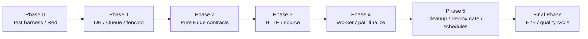
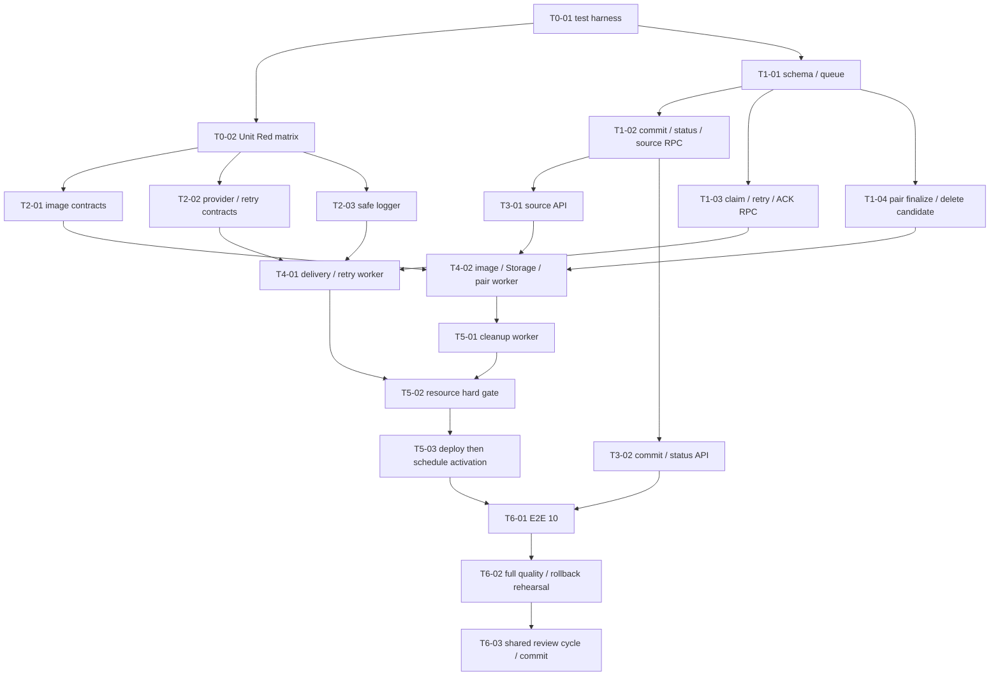

# 作業計画書: AIカード非同期Queue・画像処理

作成日: 2026-07-15
種別: feature
関連Issue: #12
動作モード: create

## 関連ドキュメントと正本

- 要件定義書: `specs/stories/S-11-ai-card-async-processing/requirements.md` v2.0.5 Approved
- ADR: `specs/adr/ADR-008-ai-card-async-queue-image-processing.md` v2.0.5 Accepted
- Design Doc: `specs/stories/S-11-ai-card-async-processing/design.md` v2.0.5 Approved
- Unit suite: `specs/stories/S-11-ai-card-async-processing/tests/ai-card-async-processing.test.ts`（現行23件）
- Integration suite: `specs/stories/S-11-ai-card-async-processing/tests/ai-card-async-processing.int.test.ts`（現行189件。127/139/142/147/153/154/155/162/163/168/179/181件は履歴値）
- E2E suite: `specs/stories/S-11-ai-card-async-processing/tests/ai-card-async-processing.e2e.test.ts`（10件）
- 先行実装: `supabase/migrations/20260714000000_s10_ai_card_import_foundation.sql`
- 先行testkit: `specs/stories/S-10-ai-card-import-foundation/tests/helpers/s10-db-testkit.ts`, `s10-db-jobs.ts`

現行リポジトリはNext.js 14、Supabase PostgreSQL/Storage、Vitest、Deno Edge Functions（新設）を実行基盤とする。`.claude/steering/architecture/*.md`はHapicoのNestJS/Prisma/Next.js 16を記述して実体と一致せず、必須参照の`.claude/steering/architecture/implementation-approach.md`も存在しない。このため、実際のコード、manifest、migration、ADR-008、承認済みDesign Docを正本とする。この制約を理由にアーキテクチャ規則を創作しない。

UI変更はなく、Figma、ui-fixer、visual-checkerは対象外である。

## 目的

S-10のowner、idempotency、quota、card確定契約を壊さず、commitを2秒以内の永続Queue受付へ変え、concept単位の画像生成・検証・保存・card確定をEdge workerで再開可能かつ冪等に処理する。StorageとDBの非原子性はstable path、tracking、補償削除、24時間cleanupで収束させ、再接続statusと秘密情報を含まない運用ログを完成させる。

## 計画固定ルール

- [x] 既存migrationは編集せず、S-11はforward migrationだけで追加する。
- [x] Queue名はlogged `ai_card_imports`、message粒度はconcept、payloadは`version/jobId/batchId`だけとする。
- [x] `pgmq.read`のvisibilityは300秒、1 invocationは1 concept、条件付きclaimとtoken fencing成功後だけ副作用を開始する。
- [x] retryはprocess内sleepではなく5/30/120秒のdelayed replacement messageとし、総試行は最大4回とする。
- [x] `ILLUSTRATION_PROVIDER`は`openai | gemini`のみ、未設定OpenAI、provider/modelの自動fallbackは実装しない。
- [x] Unit 15件はPhase 0で実行可能なRedにし、対応するpure実装と同じPhaseでGreenにする。
- [x] Integration 25件は該当production componentと同じPhaseで実装・実行し、E2E 10件は全component完成後の最終Phaseだけで実装・実行する。
- [x] 各タスクは1つの意味あるcommit単位とし、タスク内の記載は「実装」と「テスト/検証」の2階層までにする。
- [x] worker/cleanupのdeploy、service認証疎通、Edge resource hard gate合格より前に`pg_cron` scheduleを有効化しない。
- [x] API key、Authorization、画像bytes/base64、front/back/prompt、raw request/response、Queue payload全体をlog・DB error detailへ渡さない。

## 予定変更パス

### Production / configuration

- `supabase/migrations/20260715000000_s11_ai_card_async_processing.sql`
- `supabase/migrations/20260715000001_s11_ai_card_async_schedule_controls.sql`
- `supabase/config.toml`
- `supabase/functions/deno.json`
- `supabase/functions/_shared/ai-card-import/contracts.ts`
- `supabase/functions/_shared/ai-card-import/retry-policy.ts`
- `supabase/functions/_shared/ai-card-import/image-validation.ts`
- `supabase/functions/_shared/ai-card-import/image-codec.ts`
- `supabase/functions/_shared/ai-card-import/provider.ts`
- `supabase/functions/_shared/ai-card-import/providers/openai.ts`
- `supabase/functions/_shared/ai-card-import/providers/gemini.ts`
- `supabase/functions/_shared/ai-card-import/storage.ts`
- `supabase/functions/_shared/ai-card-import/logger.ts`
- `supabase/functions/_shared/ai-card-import/supabase.ts`
- `supabase/functions/_shared/ai-card-import/worker.ts`
- `supabase/functions/_shared/ai-card-import/worker-entrypoint.ts`
- `supabase/functions/ai-card-import-worker/index.ts`
- `supabase/functions/ai-card-import-cleanup/index.ts`
- `frontend/app/api/ai/imports/commit/route.ts`
- `frontend/app/api/ai/imports/status/route.ts`
- `frontend/app/api/ai/imports/sources/prepare/route.ts`
- `frontend/app/api/ai/imports/sources/complete/route.ts`
- `frontend/src/lib/ai-import/schema.ts`
- `frontend/src/lib/ai-import/errors.ts`
- `frontend/src/lib/ai-import/async-contract.ts`
- `frontend/src/types/database.ts`
- `frontend/src/lib/env.ts`
- `frontend/.env.local.example`
- `frontend/package.json`, `frontend/package-lock.json`, `frontend/vitest.config.ts`, `frontend/tsconfig.json`

### Tests / operations

- `specs/stories/S-11-ai-card-async-processing/tests/ai-card-async-processing.test.ts`
- `specs/stories/S-11-ai-card-async-processing/tests/ai-card-async-processing.int.test.ts`
- `specs/stories/S-11-ai-card-async-processing/tests/ai-card-async-processing.e2e.test.ts`
- `specs/stories/S-11-ai-card-async-processing/tests/helpers/s11-db-testkit.ts`
- `specs/stories/S-11-ai-card-async-processing/tests/helpers/s11-db-jobs.ts`
- `specs/stories/S-11-ai-card-async-processing/tests/helpers/s11-edge-testkit.ts`
- `specs/stories/S-11-ai-card-async-processing/tests/helpers/s11-fake-http-server.ts`
- `specs/stories/S-11-ai-card-async-processing/tests/fixtures/images/`
- `specs/stories/S-11-ai-card-async-processing/tests/fixtures/pre-s11-seed.sql`
- `specs/stories/S-11-ai-card-async-processing/tests/edge-resource-gate.ts`
- `specs/stories/S-11-ai-card-async-processing/operations.md`
- `specs/stories/S-11-ai-card-async-processing/traceability.md`

## DB・Edge契約一覧

core migrationは`pgmq` extension/queue、private `ai-card-sources` bucket、`ai_import_concept_jobs`、`ai_illustration_objects`、`ai_uploads` forward columns、制約/index/RLS/grant/triggerを追加する。最低限、次のservice-role限定関数を安定名で提供する。

- `commit_import_async(...)`, `get_ai_import_status(...)`
- `prepare_ai_source_upload(...)`, `mark_ai_source_ready(...)`, `mark_ai_source_cleanup(...)`
- `read_ai_import_queue(integer, integer)`
- `claim_ai_import_concept(uuid, bigint, uuid)`
- `schedule_ai_import_retry(uuid, bigint, uuid, text, integer)`
- `finalize_ai_import_concept(uuid, bigint, uuid, uuid)`
- `fail_ai_import_concept(uuid, bigint, uuid, text)`
- `ack_inert_delivery(uuid, bigint)`
- `claim_ai_import_cleanup(integer)`, `verify_ai_import_cleanup(uuid,text,text,uuid)`, `complete_ai_import_cleanup(uuid,text,text,uuid,text)`
- `claim_ai_worker_log_outbox(uuid)`, `complete_ai_worker_log_outbox(uuid,uuid)`
- `activate_ai_card_async_schedules()`, `deactivate_ai_card_async_schedules()`

Queue schemaをData APIへ公開せず、全`SECURITY DEFINER`関数の`search_path`、owner解決、EXECUTE grantを明示する。schedule control migrationは関数定義だけを行い、適用時にscheduleを自動起動しない。

## フェーズ構成と依存関係





個別タスクは同Phaseの入口checkpointだけに依存し、実装者は上図の直接依存だけを扱う。3段以上の実装詳細依存は各タスクへ持ち込まず、Phase完了checkpointで統合する。

## Phase 0: テスト基盤とUnit Red

**目的**: 実リポジトリのVitest/isolated DB運用をS-11へ拡張し、15 Unit観点を失敗する実行可能テストとして固定する。

### タスク

- [x] **T0-01: S-11 test harness、fixture、実行scriptを追加する**
  - 実装: S-10 testkitを継承する`tests/helpers/s11-db-testkit.ts`/`s11-db-jobs.ts`、fake HTTP/Edge helper、PNG/JPEG/WebPと境界fixture、`frontend/package.json`の`test:s11:{unit,integration,e2e,fresh,upgrade,failure,resource}`、Vitest/tsconfig includeを追加する。`S11_FRESH_DATABASE_URL`、`S11_UPGRADE_DATABASE_URL`、`S11_FAILURE_DATABASE_URL`は別DBを必須とし、未設定/同一DBはfail-fastする。
  - 完了条件: 実装=25 Integration/10 E2E骨格と新Unitファイルが検出される、品質=helperに`any`や実secretがない、統合=fresh/upgrade/failure jobがS-10→S-11の独立経路を選択できる。
- [x] **T0-02: Unit 15件をRedテストとして作成する**
  - テスト: `ai-card-async-processing.test.ts`へmagic/MIME 4件、10MiB/16MP/64px/1024px PNG 4件、provider default/explicit-invalid/fallback禁止 3件、transient/permanent 2件、backoff 1件、log allowlist/redaction 1件を実装し、未実装contractに対する期待失敗を記録する。
  - 完了条件: 実装=15件が`it.todo`でなく実assertion、品質=各テスト1責務・固定clock/typed spy、統合=Phase 2の予定import pathと契約が一致し、失敗理由が「未実装」だけである。

### フェーズ完了条件

- [x] Unit 15件、Integration 25件、E2E 10件のinventoryを自動集計できる。
- [x] Phase 0ではUnitが意図したRed、既存S-10 suiteはGreenである。

### 動作確認

```bash
npm --prefix frontend run test:s11:unit
npm --prefix frontend run test:s10:unit
npm --prefix frontend run typecheck
```

期待結果: S-11 Unit 15件だけが未実装contractでRed、既存テストと型設定に退行がない。

## Phase 1: Forward migration・Queue・永続fencing

**目的**: QueueとDBを単一transactionの正本にし、API/workerから独立して冪等性・claim・pair atomicityを検証可能にする。

### タスク

- [x] **T1-01: core forward migrationでQueue、job、object/source tracking、securityを追加する**
  - 実装: `20260715000000_s11_ai_card_async_processing.sql`へlogged `ai_card_imports`、job/tracking table、`ai-card-sources` private bucket、`ai_uploads` forward state/columns、unique/check/FK/index/RLS/grantを追加する。`(batch_id,concept_id)`、illustration association、stable pathをDBで一意化する。
  - 完了条件: 実装=freshとS-10 upgradeの両方へtransactional適用、品質=Queue schema/内部関数のPUBLIC/authenticated直接実行0、統合=rollback/failure injectionで既存S-10 schema/Seed snapshotが不変。
- [x] **T1-02: transactional commit、owner status、source lifecycle RPCを追加する**
  - 実装: S-10 `commit_import_internal`を再利用する`commit_import_async`、distinct concept job+`pgmq.send`、外部状態mapping、owner/batchまたはidempotency key status、prepare/ready/cleanup RPCを実装する。enqueue失敗は全transactionをrollbackする。
  - テスト: IT-02を実装し、IT-01/03/15/16用DB fixtureを完成させる。
  - 完了条件: 実装=同owner/key/hash再送で同一batch/message、品質=hash違い409相当・raw本文をDB detailへ保存しない、統合=enqueue failure時batch/item/job/message増分0。
- [x] **T1-03: claim token、retry replacement、ACK matrix RPCを追加する**
  - 実装: `read_ai_import_queue`、`claim_ai_import_concept`、`schedule_ai_import_retry`、`ack_inert_delivery`を実装する。300秒境界、current message ID、token、attempt 0..3、delay 5/30/120をDBで検査し、replacement send+state+旧archiveを1 transactionにする。
  - テスト: IT-07、IT-09のDB境界を実装する。
  - 完了条件: 実装=299秒再claim不可/300秒CAS再claim、品質=任意delay・失効token・stale message確定を拒否、統合=retry transaction rollback時に旧message/current stateが回復可能。
- [x] **T1-04: concept pair finalize/failと参照削除候補triggerを追加する**
  - 実装: `finalize_ai_import_concept`、`fail_ai_import_concept`をS-10 primitive/lock順へ接続し、R1/W1または片側を1 transactionでterminal化する。card illustration変更/削除はStorageを触らず`delete_pending`候補だけを記録する。
  - テスト: pair rollback、旧claim=`CLAIM_LOST`、最後の参照候補、image mode `none`のDB fixtureを追加する。
  - 完了条件: 実装=pair片側成功状態0、品質=stable reservation/card/object keyと空auto deck整理、統合=別concept transactionは失敗conceptから独立して継続可能。

### フェーズ完了条件

- [ ] core migrationはfresh/upgrade/failureでGreen、既存migration 3本に差分がない。
- [x] DB contractだけでenqueue欠落、claim競合、旧token書込み、pair partial commitを再現して拒否できる。

### 動作確認

```bash
npm --prefix frontend run test:s11:fresh
npm --prefix frontend run test:s11:upgrade
npm --prefix frontend run test:s11:failure
npm --prefix frontend run test:s11:integration -- -t "IT-02|IT-07|IT-09"
```

## Phase 2: Edge pure contract・provider・画像・ログ

**目的**: 外部I/Oから分離したvalidator/classifier/backoff/loggerをUnit Greenにし、Edge runtimeのadapter境界を固定する。

### タスク

- [x] **T2-01: image validatorとversion pinしたWASM codecを実装する**
  - 実装: `image-validation.ts`と`image-codec.ts`でPNG/JPEG/WebP magic+declared MIME、1..10MiB、decode、16MP、正規化前illustration入力の両辺64pxを検査し、最大辺1024px以下のmetadataなしPNGへ再encodeする。小画像は拡大せず、入力条件を満たす極端な縦横比では縮小後短辺が64px未満でも受理する。
  - テスト: Unit #1-8をGreenにする。
  - 完了条件: 実装=3形式と全境界、品質=full decode前のcheap check・入力bytesをlogしない、統合=Node/Vitest fixtureとDeno/WASM出力digest・寸法が一致。
- [x] **T2-02: provider factory/adapters、failure classifier、backoffを実装する**
  - 実装: `provider.ts`、OpenAI/Gemini adapter、`retry-policy.ts`を実装し、Deno `fetch`、AbortSignal、`success|transient|permanent`へ正規化する。prompt policyは再利用するがNode `Buffer`とS-08状態更新を持ち込まない。
  - テスト: Unit #9-14をGreenにする。
  - 完了条件: 実装=unset OpenAI/明示adapterだけ選択、品質=network/408/429/5xxだけtransient・固定backoff、統合=非選択adapter spyは設定/key/呼出失敗でも0回。
- [x] **T2-03: allowlist loggerとsafe error契約を実装する**
  - 実装: logger入力をID、provider、HTTP status、safe code、attempt、durationだけに型制限し、URL query/API key、Authorization、bytes/base64、card/prompt、raw body/payloadを受け付けない。frontend safe errorを同じ列挙へ接続する。
  - テスト: Unit #15をGreenにする。
  - 完了条件: 実装=success/retry/failure/cleanup共通logger、品質=禁止marker 0件、統合=DB `error_code/error_detail`とHTTP statusがsafe contractだけを返す。

### フェーズ完了条件

- [x] Unit 15/15がGreenで、OpenAI/Gemini間fallbackが存在しない。
- [ ] Deno checkとfrontend typecheckが両方通る。

### 動作確認

```bash
npm --prefix frontend run test:s11:unit
npm --prefix frontend run typecheck
deno check --config supabase/functions/deno.json supabase/functions/ai-card-import-worker/index.ts supabase/functions/ai-card-import-cleanup/index.ts supabase/functions/ai-card-import-resource-gate/index.ts
```

## Phase 3: source upload・commit/status HTTP adapter

**目的**: authenticated ownerを境界で解決し、sourceの二段階uploadと2秒commit/reconnectable statusを公開契約として完成させる。

### タスク

- [x] **T3-01: source prepare/complete routeとStorage sanitationを実装する**
  - 実装: prepareは最大5件・各10MiB・合計50MiBを検証して`{owner}/{uploadId}/raw`の短期signed uploadを返す。completeはservice境界でactual bytesを取得・検証・sanitized `source`へ`upsert:false`保存・ready記録・raw削除し、失敗時はcleanup trackingを残す。
  - テスト: IT-15、IT-16、IT-21を実装する。
  - 完了条件: 実装=PNG/JPEG/WebP owner隔離と外部URL入力なし、品質=invalid/decode/size/pixelでprovider/quota/card副作用0、統合=success/failure/exceptionでraw/source即時削除または期限付きcleanup対象。
- [x] **T3-02: commit/status routeとS-10共有契約を実装する**
  - 実装: commit routeはauth、S-10 schema/hash/tokenを再利用してservice RPCを呼び、provider/codec/cardを待たず202 `{batchId,status:"queued",statusUrl}`を返す。status routeはowner RLS下でbatch ID/keyを解決し、別ownerは404とする。
  - テスト: IT-01、IT-03を実装する。
  - 完了条件: 実装=最大50item/5source metadataで2,000ms未満、品質=body ownerを信用せずraw error/card text/pathを返さない、統合=応答喪失後の再commit/statusが同一snapshotで全副作用増分0。

### フェーズ完了条件

- [x] IT-01〜03、15、16、21がGreenで、commit同期経路にprovider/image/card finalize呼出がない。
- [ ] source bucketはprivateでowner B/anonymousのread/commitが拒否される。

### 動作確認

```bash
npm --prefix frontend run test:s11:integration -- -t "IT-01|IT-02|IT-03|IT-15|IT-16|IT-21"
npm --prefix frontend run lint
npm --prefix frontend run typecheck
```

## Phase 4: Queue worker・retry・Storage・concept確定

**目的**: at-least-once deliveryを、ACK matrix、stable key、claim fence、concept transactionでexactly-once相当の業務結果へ収束させる。

### タスク

- [x] **T4-01: delivery/claim/ACK/retry/provider workerを実装する**
  - 実装: workerは内部認証後`read(...,300,1)`し、payload検証、terminal/stale/active claim/current queued/expired claimを判定する。claim成功時だけproviderを呼び、transientはreplacement、permanent/枯渇はpair fail、DB不明はattemptを増やさず未ACKにする。
  - テスト: IT-04〜14（image/storage固有のIT-12を含む）を実装する。
  - 完了条件: 実装=sequential/parallel/terminal/stale/active duplicateとarchive failure、品質=無条件ACK/process sleepなし、統合=provider試行だけ増えquota/card/illustration/objectは各論理結果1件以下。
- [x] **T4-02: image mode dispatch、Storage stable object、pair finalize/compensationを実装する**
  - 実装: `none|ai|upload`をdispatchし、source/provider bytesをvalidate/normalize、tracking先行、`{owner}/s11-managed/{illustrationId}.png`へ`upsert:false`保存する。既存objectはbounded read後にtracking+digest+PNG/dimension一致時だけ冪等成功、DB finalize失敗時は即時補償削除し失敗をorphan化する。
  - テスト: IT-17、IT-19、IT-23、IT-24を実装する。
  - 完了条件: 実装=R1/W1が1 illustration/objectを共有、品質=OBJECT_CONFLICTを安全に拒否・noneはprovider/quota/Storage 0回、統合=失敗pair cards 0かつ別concept/片側conceptがterminalまで継続。

### フェーズ完了条件

- [x] IT-04〜14、17、19、23、24がGreenで、全25 Integration中cleanup固有4件とIT-25以外が解決済みである。
- [x] worker crash/300秒再claim/旧token遅延確定でcard、quota、image重複0件である。

### 動作確認

```bash
npm --prefix frontend run test:s11:integration -- -t "IT-0[4-9]|IT-1[0-4]|IT-17|IT-19|IT-23|IT-24"
deno check --config supabase/functions/deno.json supabase/functions/ai-card-import-worker/index.ts
npx supabase functions serve ai-card-import-worker --env-file supabase/.env.s11.test
```

## Phase 5: cleanup・resource hard gate・安全なschedule有効化

**目的**: Storage/DB非原子障害を24時間境界後の最初のscheduled cleanupで収束させ、Hosted Edge上限を数値で満たしたdeployだけを定期起動する。

### タスク

- [x] **T5-01: cleanup workerと参照再確認削除を実装する**
  - 実装: 15分周期を前提にage cleanupを`created_at + 24 hours <= now`、due順`SKIP LOCKED`でsource/raw/orphanをclaimし、最後の参照削除で生じる`delete_pending`は即時候補としてclaimする。削除直前にowner path、association、同一owner card参照0、age/dueを再確認し、Storage APIの404を成功扱いにする。
  - テスト: IT-18、IT-20〜22、IT-25を実装する。
  - 完了条件: 実装=即時補償失敗を24時間到達後の最初のscheduled cleanupで削除、品質=23:59:59/referenced/other-ownerを保持し24:00:00をeligible化・再実行冪等、統合=success/retry/failure/cleanupログの禁止marker 0件。
- [x] **T5-02: Edge設定、resource benchmark、運用/rollback手順を実装する**
  - 実装: `supabase/config.toml`、Deno import pin、secret一覧、fake最大provider応答、PNG/JPEG/WebP各10MiBかつ16MP、decode bombの`edge-resource-gate.ts`、`operations.md`を作る。1 invocation 1 concept、画像並列度1、provider abortを測定対象にする。
  - 完了条件: 実装=測定値と環境を機械可読出力、品質=peak memory `<=204 MiB`、CPU `<=1.6秒`、bundle `<=16 MiB`、wall clock `<=120秒`の全ケース合格、統合=1件でも超過/OOM/resource-limit/timeoutならdeploy/schedule activationをhard failしてADR再決定へ戻す。
- [x] **T5-03: worker/cleanupを先にdeploy・疎通し、その後だけscheduleを有効化する**
  - 実装: schedule control migrationは`pg_cron`/`pg_net`/Vaultを設定するactivate/deactivate関数だけを作り、初期状態inactiveとする。hard gate後にworker、次にcleanupをdeployし、内部認証・Queue権限・手動1 message・cleanup dry-runを確認してからworker `5 seconds`、cleanup `*/15 * * * *`をactivateする。
  - 完了条件: 実装=worker deploy前のcron job数0、品質=service secretをSQL/logへ平文出力せずQueue schema非公開、統合=activation後の重複invocationがvisibility/claimで無害かつdue超過alertを取得可能。

### フェーズ完了条件

- [x] Integration 25/25がGreenで、24時間cleanupと最後のcard参照削除をStorage snapshotで確認する。
- [ ] 数値hard gate全ケース合格、worker/cleanup手動疎通合格後にのみscheduleがactiveである。

### 動作確認

```bash
npm --prefix frontend run test:s11:integration
npm --prefix frontend run test:s11:resource
npx supabase functions deploy ai-card-import-worker --no-verify-jwt
npx supabase functions deploy ai-card-import-cleanup --no-verify-jwt
# operations.mdの認証付きmanual smokeがGreenになった後だけactivate_ai_card_async_schedules()を実行
```

## 最終Phase 6: E2E・品質保証・共有品質サイクル

**目的**: API→pgmq→Edge→provider fake→Storage→DB statusを通し、全AC、rollback、レビューを完了して1つの整合した変更としてcommitする。

### タスク

- [x] **T6-01: E2E骨格10件を実装しfull-systemで実行する**
  - テスト: E2E-01〜10を`it.todo`から実テストへ置換する。UI/Playwrightは追加せず、authenticated HTTP、実pgmq、local/staging Edge、private Storage、owner statusを通し、providerだけfake serverにする。
  - 完了条件: 実装=10/10実行、品質=固定clock/failpoint後始末とsecret非使用、統合=2秒commit/reconnect/retry/restart/concept分離/source/共有削除/cleanup/log秘匿を端から端まで確認。
- [ ] **T6-02: 全品質ゲート、traceability、rollback/compensation rehearsalを完了する**
  - 実装: `traceability.md`にAC↔task↔Unit/IT/E2E↔証跡を確定し、`operations.md`で新規enqueue停止、schedule deactivate、Queue保持/監査、worker rollback、orphan補償、再開順を演習する。 populated DBに破壊的down migrationを適用せず、schema/job/message/trackingを保持して旧同期経路へ自動fallbackしない。
  - 完了条件: 実装=全ACの未対応0、品質=lint/typecheck/build/Unit 15+/Integration 25+/E2E 10+全Green、統合=deactivate中も既存status取得とQueue監査が可能で、再deploy→manual smoke→schedule再開順が再現可能。
- [ ] **T6-03: shared quality cycleを順番どおり実行し、cleanになってからcommitする**
  - 検証: `task-executor`にplan全体を一括実行させ、`code-reviewer`でDesign Doc/AC/差分をレビューする。指摘があれば`task-executor`へ戻し、`code-reviewer`がcleanになるまで反復する。その後`quality-fixer`で全品質commandを実行・修正し、最終diffへsecret/生成物/一時fileがないことを確認してcommitする。
  - 完了条件: 実装=plan全checkboxとtraceabilityが完了、品質=code-reviewer cleanかつquality-fixer Green、統合=commitにはS-11成果物だけを含み`.issue-sprint/`と`.codex/steering/implementation-flow.md`を含めない。

### 最終動作確認

```bash
npm --prefix frontend run test:s11:unit
npm --prefix frontend run test:s11:integration
npm --prefix frontend run test:s11:e2e
npm --prefix frontend run test:s11:resource
npm --prefix frontend run lint
npm --prefix frontend run typecheck
npm --prefix frontend run build
deno check --config supabase/functions/deno.json supabase/functions/ai-card-import-worker/index.ts supabase/functions/ai-card-import-cleanup/index.ts
git diff --check
git status --short
```

## Acceptance Criteria / test traceability

| AC | 実装タスク | Unit | Integration | E2E |
|---|---|---|---|---|
| AC-01 非同期受付・再接続 | T1-02, T3-02 | - | IT-01〜03 | E2E-01, E2E-02 |
| AC-02 claim・重複耐性・冪等性 | T1-03, T1-04, T4-01, T4-02 | backoff/adapter spy補助 | IT-04〜10, IT-12 | E2E-03, E2E-06 |
| AC-03 retry分類 | T1-03, T2-02, T4-01 | #12〜14 | IT-11〜13, IT-17 | E2E-03 |
| AC-04 provider選択 | T2-02, T4-01 | #9〜11 | IT-16 | E2E-07 |
| AC-05 source/入力画像 | T2-01, T3-01 | #1–7 | F-02, NR-15, F-17, HI-08, R7-F4 | `test:s11:real-e2e` source owner/upload + `test:s11:resource` max/decode (fail-closed) |
| AC-06 正規化・共有・参照削除 | T1-04, T2-01, T4-02, T5-01 | #8 | IT-19, IT-20 | E2E-08 |
| AC-07 source/orphan cleanup | T3-01, T4-02, T5-01 | - | IT-18, IT-21, IT-22 | E2E-05, E2E-09 |
| AC-08 concept失敗分離 | T1-04, T4-02 | - | F-08 fail-closed PostgreSQL pair-failure/sibling-success | E2E-04 (local) |
| AC-09 ログ秘匿 | T2-03, T5-01 | #15 | IT-25 | E2E-10 |

数量gateは現行Unit 23件、Integration 198件、E2E 10件である。93/102/110/127/139/142/147/153/154/155/162/163/168/179/181/189/195 Integrationは各変更履歴時点のhistorical inventoryでありcurrent evidenceではない。R14-F1〜F3はtrue autocommit、global default privilege、canonical UUID、typed preview secretへ接続する。R13-F1〜F5はresponse-loss reconciliation、autocommit recovery、default privilege、schedule value validation、run-scoped residueへ接続する。R12-F1〜F5はcompletion/cleanup競合、入力境界、段階migration、resource secret、3 DB分離品質gateへ接続する。cycle 7 R11-F1/F2はQueue RPCのempty/malformed分離とoutbox safe-code runtime allowlistへ接続し、R11-R2-F2はactual prepare routeの5件受理/6件副作用前拒否へ接続する。cycle 6 R10-F1/F2は全production lock pathのcards→illustrations→tracking順、bounded complete/attach concurrency、provider cancellation-safe oversize classificationへ接続する。review-attempt-1 R10-R1-F1はS-10 different-key attachのOLD+NEW一括canonical lockとA↔B二順序gateへ接続する。review-attempt-2 R10-R2-F1/F2はcaller JWT lifecycle authorityとterminal outbox fault後のsource releaseへ接続する。

## Rollback・compensation

1. 異常時は新規enqueue switchを停止し、`deactivate_ai_card_async_schedules()`でworker/cleanup cronを止める。Queue message、batch/job/status、tracking rowは削除しない。
2. worker releaseを直前のknown-good版へ戻し、内部認証付きmanual single-message smokeを行う。provider間や旧fire-and-forget経路への自動fallbackは禁止する。
3. upload済み未確定objectはstable trackingから即時補償削除し、失敗は`orphan`と`delete_due_at`を維持する。手動で`storage.objects`を直接DELETEしない。
4. cleanupだけ障害の場合はworkerを必要に応じ継続し、due超過を監視する。cleanup復旧後にdry-run、owner/reference再確認、限定batch、通常scheduleの順で再開する。
5. schema rollbackはforward fixを原則とし、処理済みデータのあるtable/queue/columnをdropするdown migrationを実行しない。

## リスクと対策

| リスク | Hard stop / 対策 |
|---|---|
| Edgeで10MiB・16MPがresource上限超過 | T5-02の204MiB/1.6秒/16MiB/120秒のいずれか不合格ならscheduleを有効化せずADR再決定 |
| DB↔Queueまたはretryの欠落 | 同一Postgres transaction、fresh/upgrade/failure injection、message ID uniqueで検証 |
| 旧workerが遅延確定 | 全副作用RPCでcurrent tokenを検証し`CLAIM_LOST`、stable pathをcleanupへ収束 |
| StorageとDBの非原子性 | tracking先行、`upsert:false`、digest再検証、即時補償、24時間cleanup |
| cleanup誤削除 | owner path、association、同一owner card参照、age/dueの4条件を削除直前に再確認 |
| provider error差異・secret漏洩 | 共通classifierとallowlist logger、fake endpoint、禁止marker走査、fallback call count 0 |
| stale steeringによる誤実装 | 実コード/manifest/ADR/Designを正本とし、欠落`implementation-approach.md`を創作しない |

## 実装完了定義

- [x] **実装完了**: commit/Queue/worker/source/provider/image/Storage/status/cleanup/schedule controlがDesign Doc契約どおり接続される。
- [ ] **品質完了**: Unit 15+/Integration 25+/E2E 10+、lint、typecheck、build、Deno check、数値Edge hard gateが全Greenである。
- [ ] **統合完了**: fresh/upgrade/failure、duplicate/crash/retry/Storage障害/cleanup/reconnectを通してcard・quota・illustration・objectの重複0、禁止log 0、残存source/orphanが24時間到達後の最初のscheduled cleanupで収束する。
- [ ] **運用完了**: worker/cleanup deployと認証疎通より前のcron activation 0、rollback/compensation rehearsal済み、due超過を監視できる。
- [ ] **レビュー完了**: task-executor全計画→code-reviewer cleanまで反復→quality-fixer→commitの共有品質サイクルを完了する。

## Code-reviewer 第1回修正

- [x] CR-01: SECURITY DEFINER owner、table/illustration/pgmq/cron/Vault最小ACLをforward migrationへ追加した。
- [x] CR-02: S-11 safe codeを直接terminal化するconcept failure primitiveへ分離した。
- [x] CR-03: R1/W1事前検査、一括card/deck/tag確定、upload一回consumeを単一transaction化した。
- [x] CR-04: source削除をterminal時だけに限定し、削除失敗をcleanup trackingへ戻した。
- [x] CR-05: finalize応答喪失時の状態再照会とclaim-fenced compensationを追加した。
- [x] CR-06: Integration/E2Eのsource文字列検査をroute/RPC/provider/Storage/worker実境界へ置換した。
- [x] HI-07: status RPCをservice-role限定にし、routeのJWT userだけをownerに使用した。
- [x] HI-08: sourceをWASMでfull decode、metadata strip、PNG再encodeし、全失敗経路をcleanup trackingへ接続した。
- [x] HI-09: cleanupのglobal limit、5分lease、stale cleaning再claimを実装した。
- [x] HI-10: raw/source pathを別々に削除・完了追跡するようにした。
- [x] HI-11: network、HTTP、decode/contract、Storage read/writeを型分離しtransient条件を限定した。
- [x] HI-12: S-10 populated upload lifecycleのbackfillとupgrade fixtureを追加した。
- [x] HI-13: cron.jobには固定wrapper呼出だけを保存し、secretを実行時Vault解決にした。
- [x] MD-14: 全item failureかつsuccess 0の空auto deckをfailure transaction内で削除するようにした。

## Code-reviewer 第2回修正

- [x] CR-03: concept finalizeをR1/W1の片側またはpair（1〜2件）に対応し、重複patternだけを拒否した。
- [x] CR-04: failure RPC応答喪失をterminal state再照会で照合し、確定失敗sourceをcleanupへ進めた。
- [x] CR-06: mockへfallbackしないreal Postgres/pgmq gateとserved HTTP→Edge→Storage gateを分離した。
- [x] HI-09: cleanupをlease後・Storage削除前のfenced再検査へ変更し、cleaning中の新規参照を拒否した。
- [x] HI-11: codec decode/encode例外を恒久失敗化し、正規化後PNG・寸法・サイズを再検証した。
- [x] HI-12: due到達済みprepared/ready/consumed sourceを非terminal job参照がない場合にcleanup対象化した。
- [x] NR-15: bucket 10MiB limitとContent-Length相当/streaming双方の読込上限を追加した。
- [x] NR-16: statusの存在秘匿404とbackend/network 5xxを分離した。

## GitHub issue #12 remediation correction run

- [x] CR-06: worker実header、real pgmq/RPC-RLS/private Storage/served Edge境界を整合し、resource gateをexact Edge WASM・16MP最大fixture・decode bomb・bundle/resource上限のfail-closed gateにする。
- [x] HI-09: cleanup初回stateをstale lease再claimで上書きせず、claim後停止→lease超過→再claim→完了を回帰試験する。
- [x] HI-12: upload/object bucketを永続化し、S-10 rowを`illustrations`へbackfillしてobject移動なしでworker/cleanupが記録bucketを使う。
- [x] NR-17: ImageMagickを実package signatureどおりWASM bytesで一度だけ初期化し、served Deno Edgeの同一pathでdecode/normalizeする。
- [x] NR-18: durable upload-consumer associationを追加し、全consumer terminal後だけsourceを一度削除するparallel/out-of-order試験を追加する。

## Fresh remediation review attempt 1

- [x] CR-06: real E2Eを実upload+AI request、authenticated route、PostgREST RPC/RLS、pgmq、served worker/cleanup、fake provider、exact Edge codec、private Storage lifecycleへ接続し、resource結果を実artifact hashとcodec中peak RSSへ束縛する。
- [x] HI-19: finalize未確定時は補償削除前にobjectをdurable orphan化し、削除transient後もcleanup claimから収束する回帰試験を追加する。
- [x] HI-20: worker Storage readerで宣言値とstream累計の10MiB上限をmaterialize前に強制し、fresh/legacy・欠落/過少Content-Lengthを試験する。
- [x] MD-21: requirements、ADR、Design、plan、traceabilityの版、status、参照、変更履歴を現行data/recovery contractへ整合する。

## Fresh remediation review attempt 2

- [x] CR-06: real password loginで`@supabase/ssr`が生成したcookieをexplicit jarへ保持し、Next routeはCookieだけ、PostgRESTはaccess-token Authorizationだけでowner A/B境界を検証する。
- [x] CR-06: resource gate自身がself-contained bundleとpin済みWASMを同一local Deno processとして直接serveし、両artifactの独立digest/sizeとspawn PID CPU、codec内peak RSSを測定する。endpointによるcaller-controlled digest echoを廃止する。
- [x] CR-06: actual OpenAI adapterをlocal HTTP fake providerへ接続し、10MiB/16MP最大responseのdecode/normalizeと110秒abortを同じserved artifact/codec/WASM pathで測定する。

## Fresh remediation attempt 0

- [x] CR-06: decode bombと独立したimage decode failureの失敗応答を厳密なHTTP status/safe error contractへ固定し、各経路でspawn PID CPU、codec peak RSS、wall deadline/resource limitを強制・計測する。
- [x] CR-06: real E2Eの全拒否シナリオを正確なHTTP status/error codeへ固定し、任意non-2xxを成功扱いするassertionを除去する。
- [x] MD-22: commit routeのQueue/RPC infrastructure/availability failureを必ずHTTP 503 `SERVICE_UNAVAILABLE`へ写像し、validation/auth/authorization/conflict/internal contractを維持するfocused regressionを追加する。
- [x] 回帰保護: bucket compatibility、cleanup lease、compensation cleanup、pre-materialization 10MiB、ImageMagick WASM一回初期化、shared-source consumer lifecycleと既存real SSR-cookie/RLS/artifact/provider-timeout境界を再実行可能なsuiteで確認する。
- [x] 品質証跡: local inventory/unit/integration/E2E/lint/typecheck/build/Deno/migration gateを実行し、real prerequisite欠如は`not_run`かつnonzeroとしてtraceability/operationsへ記録する。

## Fresh remediation attempt 1 of maximum 3

- [x] F-01: real/resource/fresh/upgrade/failure/Denoをfallbackなしの`not_run`/exit 2 gateに統一し、local Greenと実行未了を別記する。
- [x] F-02: OpenAI/Gemini responseをContent-Length+streamで有界化し、10MiB+1 base64を`atob`前に拒否し、served resource casesを追加する。
- [x] F-03/F-04/F-05: commit/status allowlist DTO、malformed JSON 400、PreviewTokenError 401、cleanup malformed RPC fail-closedをfocused regressionで固定する。
- [x] F-06/F-08/F-12: real DB gateへexpired reclaim fencing、pair failure+sibling success、23:59:59/24:00/reference/owner-path cleanupを追加する。
- [x] F-07/F-09/F-11: real E2Eへlive source owner isolation、cross-owner commit denial、strict reconnect/duplicate snapshot、shared reference delete lifecycleを追加する。
- [x] F-10: bundle/WASMの独立size/hashとmanifest/package-lock identity照合をresource gateへ追加する。
- [x] F-13: configured fake-provider control/runtime log collectorを必須化し、success/retry/permanent failure/cleanupの禁止値scanを追加する。
- [x] SSOT: requirements/ADR/Design/plan/traceability/operations/metaをv1.2/1.3契約へ同期し、実前提欠如をpassと記載しない。

## Fresh remediation attempt 2 of maximum 3

- [x] F-14: SQL/shared/frontend statusのsafe terminal allowlistへ`DUPLICATE_EXISTING`を追加し、unknown/malformed rejectionを維持する。
- [x] F-15: official endpoint defaultを維持し、paired HTTPS endpoint/bindingをserved worker adapterとreal control/stats misbinding gateへ接続する。
- [x] F-16: permanent provider/Storage failureとretry exhaustionのterminal確定ごとにsafe `worker_failure`をexactly one件出し、retry/ACKを変更しない。
- [x] F-17: existing-illustration conflict readを宣言値とstream累計の10MiBでmaterialization前に制限し、missing/lying Content-Lengthを固定する。
- [x] F-18: tracked `{owner}/s11-managed/{illustrationId}.png`のowner mutationを拒否し、same-prefix legacy owner path、service role、source signed uploadを維持する。
- [x] SSOT: requirements/ADR/Design/plan/traceability/operations/metaをattempt 2 executable contractへ同期する。
- [x] Verification: local inventory/S-10/lint/typecheck/build/diffとfail-closed real/resource/DB/Deno gateをtruthfulに記録する。

## Fresh remediation cycle 3, task-executor pass

- [x] P3-01: `worker_failure`をDB-confirmed terminal `failed`だけに限定し、retry persistence fault、DB ambiguity、claim loss、未確定結果をallowlisted `worker_recoverable`へ分離する。
- [x] P3-01: terminal-confirmed/recoverable/ambiguous focused testsでexactly-once、ACK/retry/fencingと禁止データ0件を固定する。
- [x] P3-02: 64px最小を正規化前input validationだけへ適用し、縮小後の各辺1..1024をcodec・DB contractで受理する。
- [x] P3-02: portrait/landscapeの極端縦横比をpure codec、worker contract、pin済みImageMagick codecで回帰試験する。
- [x] SSOT: requirements v1.5.0、ADR/Design/plan/traceability v1.4.0、operations/metaをcycle 3 executable contractへ同期する。
- [x] Verification: local inventory/S-10/lint/typecheck/build/diffとfail-closed real/resource/DB/Deno gateをtruthfulに記録する。

## Fresh remediation cycle 3, independent review attempt 1

- [x] F1: entrypoint config/WASM/Queue read/claim/ACK/RPC/network/contract faultをterminal proofなしの`worker_failure`へ写像せず、共通invocation boundaryで`worker_recoverable`に限定する。
- [x] F2: failed jobへterminal message/token-hash identityを永続化し、raw tokenをowner-readable rowへ残さず、同一claimだけが`terminal_failed`を照合できるようにする。A expiry→B fail→A reconcileは`claim_lost`とする。
- [x] F3: real E2Eへ別名でserveしたsame-artifact recoverable instanceを必須化し、permanent batch failure=1、その他failure=0、recoverable>=1を相関検証する。
- [x] SSOT/meta: requirements v1.6.0、ADR/Design/plan/traceability v1.5.0、operations/metaをreview attempt 1 contractへ同期する。
- [x] Verification: focused/full local gatesとfail-closed real/resource/DB/Deno gateを再実行しtruthfulに記録する。

## Fresh remediation cycle 3, independent review attempt 2

- [x] F1: actual HTTP handler内でtrim済みnon-empty secret configを検証し、config/setup fault=500+recoverable one、auth denial=401+log zeroを固定する。
- [x] F2: main/recoverableを独立immutable control-plane artifact attestationの同一SHA-256へ束縛し、probe invocation UUIDのrecoverable=1/failure=0を要求する。
- [x] F3: malformed/job-missing poisonをACK後のsafe `worker_poison` exactly oneへ接続する。
- [x] F4: duplicate finalize/reconciliationをstrict business outcomeへ分離し、durable orphan後だけ即時best-effort削除、失敗時cleanup fallbackとする。
- [x] F5: historical inventoryとcurrent Unit 23/Integration 127/E2E 10を明示的に分離する。

## Fresh remediation cycle 4, new independent review attempt 1

- [x] F1: `worker_failure`をDB-confirmed normal provider/Storage permanent failureまたはretry exhaustionだけに限定し、configuration/validation/decode/contract/business/recoverable結果をsafe eventへ分離する。
- [x] F2: exact delivery ACKのstrict boolean confirmation後だけqueue message ID相関の`worker_poison`を1件出し、false/例外/不明はpoison zeroでrecoverableに残す。
- [x] F3: cleanup claim前stateをdurableに保持し、failed `delete_pending` deletionをage待ちなしで即時retry可能にし、各試行でlease/owner/referenceを再確認する。
- [x] F4: cleanup secret/config/setupをsafe outer boundaryへ移し、missing/blank/read/setup=500+safe cleanup one、valid-secret auth denial=401+log zeroにする。
- [x] Red/Green: 4 findingの意図したRedを個別確認後、focused 12/12をGreen化する。

## Fresh remediation cycle 4, independent review attempt 1 remediation

- [x] F1: terminal failure/poison/duplicateをarchive/terminalと同一transactionのunique safe outboxへ記録し、stable event IDとUUID dispatch leaseでcrash後再送・重複排除する。
- [x] F2: illustration/source/raw cleanupへUUID identityを追加し、verify/completeをexact tokenでfence、stale completeを`CLAIM_LOST`にする。
- [x] F3: source upload前のfabricated pathを廃止し、source/rawを同一upload rowの単一UPDATEから独立claimとして返して最初のeligible runで両方回収する。
- [x] Red/Green: R5-F1〜F3を各1/1 Red確認後、focused 3/3をGreen化する。

## Fresh remediation cycle 4, independent review attempt 2 remediation

- [x] R6-F1: retry/upload/orphan/fail/finalizeと両reconcileを共通DB-clock active claim fenceへ接続する。
- [x] R6-F2: exact deterministic source write intentをStorage前に永続化し、ready昇格または404-safe cleanupへ収束する。
- [x] R6-F3: cleanup limitをtracking entityへ適用し、選択uploadのdue source/rawを同runへ展開する。
- [x] R6-F4: cleanup completeでもDB-clock 5分leaseを再検査し、expired completionを`CLAIM_LOST`にする。
- [x] R6-F5: illustration cleanup deleted確定と同一transactionでillustrationを非attachableにし、authenticated reattachを拒否する。
- [x] Red/Green: R6-F1〜F5を各1/1 Red確認後、focused 5/5をGreen化する。
- [ ] Independent review attempt 3/3を次gateとする。

## Fresh bounded remediation cycle 5

- [x] R7-F1: cleanup-deleted illustrationのowner UPDATE resurrectionとattachをDB triggerで拒否し、非deleted owner更新とservice lifecycleを維持する。
- [x] R7-F2/R7-F3/R7-F6: concept、cleanup、outboxのcaller-authoritative time引数を全production signature/call siteから除去し、DB-controlled fixtureで境界を固定する。
- [x] R7-F4: source completeをStorage HTTP `Response.body` readerへ接続し、Content-Lengthとstream累計をBlob materialization前に制限・cancelする。
- [x] R7-F5: S-08/S-11のprompt生成を`supabase/functions/_shared/illustration-prompt-policy.ts`へ統合し、S-11固有SQL promptを除去する。
- [x] Red/Green: 6 findingを同時に6/6 Red確認し、同じfocused commandを6/6 Green化する。
- [x] Complete local inventory後に独立review attempt 1/3を実行し、shared illustration lifecycle finding 1件を受領する。

## Cycle 5 independent review attempt 1 remediation

- [x] R8-F1 Red: shared illustrationの最初の参照解除が誤ってpending化する回帰を1/1で確認する。
- [x] R8-F1 Green: tracking/残存card lock、2→1 ready、1→0 pending、unclaimed pending再参照とcleanup claimの相互排他を実装する。
- [x] Real DB gate: third-card S-10 attachとattach/cleanup双方が先にlockを得る競合を追加する。
- [x] Complete local/external gatesを再実行し、独立review attempt 2/3へ進む。

## Cycle 5 independent review attempt 2 remediation

- [x] R9-F1 Red: sibling-card lock inversionを要求するcontractを1/1 Red確認する。
- [x] R9-F1 Green: reference count初期化/backfill、same/different-key attach/remove、canonical tracking lockを実装する。
- [x] Real DB gate: distinct shared-card delete/deleteとdelete/attachを2接続・2秒lock timeout・5秒statement timeoutで実行する。
- [x] Complete local/external gatesを再実行し、最終独立review attempt 3/3へ進む。

## Fresh bounded remediation cycle 6

- [x] R10-F1 Red: cleanup completeのtracking→illustrationとS-10 attachのcard→illustration→tracking inversionをfocused contractで再現する。
- [x] R10-F1 Green: canonical lock classを既存cards→illustrations→trackingへ固定し、S-10 create/update/delete/attach/undo、S-11 finalize/fail/triggers、cleanup verify/complete、owner/service lifecycleを共通helper/prefix/suffixへ統一する。
- [x] R10-F1 Real DB gate: claimed cleanup completeとauthenticated attachをattach-first/complete-firstの二順序で2接続実行し、2秒lock/5秒statement timeout、`40P01`なし、exactly one success、reference/lifecycle終状態を要求する。
- [x] R10-F2 Red/Green: declared oversizeのread 0+cancel、cancel sync throw/async reject/no body、Content-Length欠落/過少stream overflowをOpenAI/Gemini shared readerで固定し、`IMAGE_TOO_LARGE`を保持する。
- [x] Complete local/external gates後、新規独立review attempt 1/3へ進む。

## Cycle 6 independent review attempt 1 remediation

- [x] R10-R1-F1 Red: S-10 different-key attachのtarget-only先行lockとcross-swap gate欠落を1/1 Red確認する。
- [x] R10-R1-F1 Green: S-11 forward overrideでcard lock後にOLD+NEWを解決し、共通helperへ一括投入してからcardを変更する。
- [x] Real DB gate: authenticated A→B/B→AをA-first/B-firstで実行し、2秒lock/5秒statement timeout、`40P01`なし、swapped key/reference_count/ready終状態を要求する。
- [x] Complete local/external gatesを再実行し、独立review attempt 2/3へ進む。

## Cycle 6 independent review attempt 2 remediation

- [x] R10-R2-F1 Red/Green: SECURITY DEFINER `current_user` bypassをcaller JWT service-role判定へ変更し、owner拒否/service cleanup/legacy update/deleted attachを分離する。
- [x] R10-R2-F2 Red/Green: permanent/duplicate terminal後のoutbox claim/complete faultをbest-effort境界へ隔離し、failed outcomeと即時source release、stable event reclaimを維持する。
- [x] Complete local/external gatesを再実行し、最終独立review attempt 3/3へ進む。

## Repository-owned quality contract cycle 8

- [x] `.codex/quality.json`をリポジトリ正本として、S-10 bootstrap・既存migration・Seedからstrict-prefix disposable DBを作成し、source DBをquality test targetとして使わない。
- [x] review前safety unit 12/12と実source harnessでprotected-name rejection、作成中signalを含む即時/success/failure cleanup、exit propagation、同時実行、source continuity、zero residue、URL/credential/generated-name非出力を確認する。
- [x] repository quality commandでlint 97 files、typecheck、configured build、ordinary Vitest 652 pass/8 conditional skip、S-11 inventory 214/214、focused 34/34、`git diff --check`を順番どおり実行する。
- [x] fresh/upgrade/failure/real-integration/real-E2E/resource/Denoの7 gateを実行し、全件をprerequisite不足の`not_run`/exit 2としてfail closedに保つ。
- [x] 初回cycle-8 task-executorではSupabase platform schema/role/default privilege/extensionのdump/restore、quality-fixer、review、commit、push、ship、deploy、remote mutation、cron activationを行わない。

## Cycle 8 independent review attempt 1 remediation

- [x] R8-R1-F1 Red/Green: role prerequisite欠落とrole/membership fingerprint変化をfail closedにし、S-10 migration streamからcluster-wide `CREATE ROLE`/membership `GRANT`を除外する。
- [x] R8-R1-F2 Red/Green: primary quality failureとdrop/residue failureの同時発生を再現し、sanitized teardown failureを優先し、verified cleanup時だけexact quality exitを保持する。
- [x] Safety 17/17と実local harnessのsuccess/check-failure/setup-failureでsource continuity、role/membership不変、target run-only、zero residueを確認する。
- [x] S-10 Unit 32/32、safe-error/outbox 12/12、lint 97、typecheck、configured build、ordinary Vitest 652 pass/8 skip、S-11 214/214、focused 34/34、diff checkを再実行する。
- [x] 7 external gateは既存の`not_run`/exit 2を維持し、独立review attempt 2/3へ進む。

## Cycle 8 independent review attempt 2 remediation

- [x] R8-R2-F1 Red/Green: signal handlerへ渡すcallbackをdropだけでなくsource continuity、exact target absence、role/membership fingerprintまで検証するauthoritative teardownへ統一し、未検証/失敗時はsignal statusでなくgeneric exit 1を返す。
- [x] R8-R2-F2 Red/Green: `pg_auth_members` fingerprintへ`admin_option`に加えて`inherit_option`と`set_option`を含め、実local PostgreSQLでSQL contractを実行する。
- [x] Focused Red 17 pass/3 failからsafety 20/20 Green、実local three-target harness、S-10 Unit 32/32、safe-error/outbox 12/12を確認する。
- [x] lint 97、typecheck、configured build、ordinary Vitest 652 pass/8 skip、S-11 214/214、focused 34/34、final source/role/residue、diff checkを再実行する。
- [x] 7 external gateは既存の`not_run`/exit 2を維持し、最終独立review attempt 3/3へ進む。

## Cycle 8 final quality gate

The following checklist is historical cycle-8 evidence. It does not claim the
current R12 remediation or any hosted gate is approved.

- [x] 独立read-only review attempt 3/3で全差分・AC 9/9・quality/database safety contractを再検証し、zero findings / 100% / `approved`を得る。
- [x] repository rootからinstalled `$ar-core:quality-fixer`を実行し、`.codex/quality.json`経由のrepo-owned commandがexit 0 / `approved`となる。
- [x] quality-fixer後もsource continuity、exact target absence、role/membership fingerprint不変をverified teardownで確認し、CHECKPOINT 2を完了する。
- [x] 7 external gateを`not_run`/exit 2のまま保持し、push/PR/merge/issue close/ship/deploy/remote mutation/cron activationを行わない。

## Ship review remediation cycle 9

- [x] R13-F1: ready commit後のresponse lossをexact DB row/digest/write-intentでreconcileし、confirmed uncommitted以外ではsourceを削除しないactual route + DB gateを追加する。
- [x] R13-F2/F3: core migrationをautocommit・再実行可能にし、3境界のpartial failure、ledger未記録、PUBLIC execute非公開、forward recoveryを実DBで確認する。
- [x] R13-F4: core/scheduleの先頭でdefault PUBLIC function executeをdenyし、schedule URL/secretをactivation/invoke両方で検証する。
- [x] R13-F5: strict run scope/advisory leaseでstale residueだけを除去し、active concurrent/malformed prefixを保護し、current-scope residueを終了時にfail closed検証する。
- [x] malformed upload UUIDをservice DB/Storage前400にし、DB safety 23/23、full quality、external 7件`not_run`/exit 2を再確認する。

## True-autocommit review remediation cycle 10

- [x] `psql -f -`でproduction同等のstatement-level autocommitを再現し、3 failpointのpartial DDL/constraint/policy/trigger/grant/ACL/ledgerを新sessionで検査する。
- [x] schema-localでは無効だったdefault function privilege revokeをglobal revokeへ修正し、中断時PUBLIC executeを実DBで拒否する。
- [x] uppercase UUIDを入力直後lowercase canonical化し、typed env layerへpreview HMAC secretを集約する。
- [x] full isolated qualityをexit 0にし、hosted gateをPR本文の明示留保かつmerge blockerとして維持する。

## 変更履歴

| 日付 | 版 | status | 変更内容 |
|---|---|---|---|
| 2026-07-15 | 1.0.0 | ready_for_implementation | 承認済み設計から初期実装計画を作成 |
| 2026-07-15 | 1.1.0 | quality_review | correction runとfresh remediation review attempt 1、58 integration gate、現行文書版参照を反映 |
| 2026-07-15 | 1.1.1 | quality_review | attempt 2 CR-06のSSR cookie auth、direct artifact serve、provider最大/timeout resource境界を反映 |
| 2026-07-15 | 1.1.2 | quality_review | fresh remediation attempt 0のCR-06 failure resource強制・厳密HTTP contractとMD-22 Queue/RPC 503を反映 |
| 2026-07-15 | 1.2.0 | quality_review | fresh remediation attempt 1のF-01〜F-13、Integration 85件、real DB/E2E/resource/runtime gate強化とtruthful SSOTを反映 |
| 2026-07-15 | 1.3.0 | quality_review | fresh remediation attempt 2のF-14〜F-18、Unit 21/Integration 93、provider binding、terminal log、bounded conflict read、tracked Storage policyを反映 |
| 2026-07-15 | 1.4.0 | quality_review | fresh remediation cycle 3のP3-01/P3-02、Unit 23/Integration 102、DB-confirmed terminal logging、safe recoverable event、extreme-aspect normalizationを反映 |
| 2026-07-15 | 1.5.0 | quality_review | independent review attempt 1のF1〜F3、Integration 110、entrypoint recoverable boundary、claim-bound terminal identity、served recoverable log correlationを反映 |
| 2026-07-15 | 1.6.0 | quality_review | independent review attempt 2のF1〜F5、current Integration 127、actual handler、artifact/correlation、poison、duplicate compensationを反映 |
| 2026-07-15 | 1.7.0 | quality_review | fresh remediation cycle 4のF1〜F4、current Integration 139、failure taxonomy、confirmed poison ACK、delete_pending retry、cleanup authを反映 |
| 2026-07-15 | 1.8.0 | quality_review | independent review attempt 1 remediation、current Integration 142、durable log outbox、cleanup UUID fence、source/raw first-run cleanupを反映 |
| 2026-07-15 | 1.9.0 | quality_review | independent review attempt 2 remediation、current Integration 147、DB-clock claim/source intent/entity cleanup/complete expiry/reattach fenceを反映 |
| 2026-07-15 | 2.0.0 | quality_review | bounded remediation cycle 5、current Integration 153、caller clock除去/lifecycle/streaming/shared promptを反映 |
| 2026-07-15 | 2.0.1 | quality_review | cycle 5 review 1 remediation、current Integration 154、shared reference/S-10 attach/cleanup lockを反映 |
| 2026-07-15 | 2.0.2 | quality_review | cycle 5 review 2 remediation、current Integration 155、atomic reference count/canonical lock/bounded concurrency gateを反映 |
| 2026-07-16 | 2.0.3 | quality_review | bounded remediation cycle 6、current Integration 162、full canonical lock/complete-attach gate/provider safe cancelを反映 |
| 2026-07-16 | 2.0.4 | quality_review | cycle 6 review 1 remediation、current Integration 163、S-10 OLD+NEW canonical attach/cross-swap gateを反映 |
| 2026-07-16 | 2.0.5 | quality_review | cycle 6 review 2 remediation、current Integration 168、JWT lifecycle fence/post-terminal outbox source releaseを反映 |
| 2026-07-16 | 2.0.7 | remediation | ship review R13-F1〜F5、current Integration 195、autocommit recovery、privilege/schedule/residue hardeningを反映 |
| 2026-07-16 | 2.0.8 | remediation | R14-F1〜F3、current Integration 198、true autocommit/global default privilege/UUID/env hardeningを反映 |
