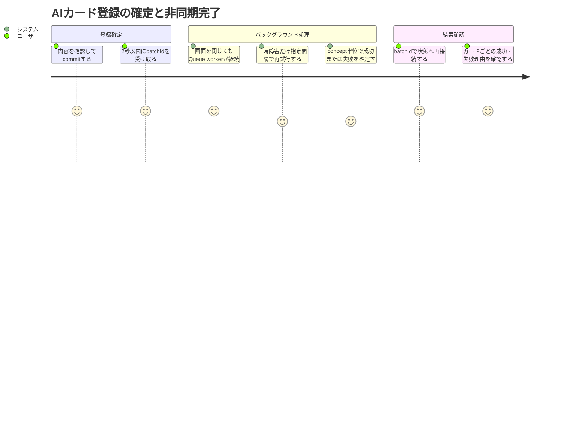
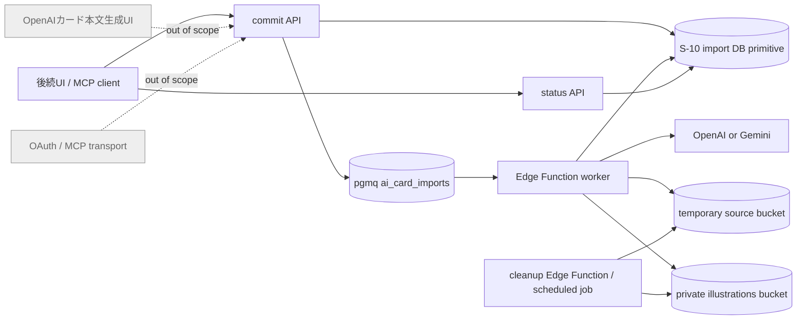

# 要件定義書: AIカード非同期Queue・画像処理

## 1. 概要

### 1行要約
AIカード登録の確定要求を2秒以内に受け付け、Supabase QueuesとEdge Functionで画像処理およびカード確定を冪等に継続し、切断後も安全に結果へ再接続できるようにする。

### 背景とユーザー価値
最大50カードと画像処理を同期HTTP要求内で完了させると、provider待ち、Storage障害、ブラウザ切断によってタイムアウトや中間状態が生じる。ログインユーザーが登録確定後に画面を閉じても処理が継続し、再接続時にカード単位の成功・失敗を確認できる非同期Stage 2が必要である。

### プライマリーユーザー
- AIで作成した本人所有の非公開カードを登録する保護者・先生（MVPでは全ログインユーザー）
- 後続のアプリ内生成UIおよびRemote MCPから同じcommit/status契約を利用するクライアント

### 関係者
- 登録結果を再確認し、成功したカードで学習を始める学習者・保護者・先生
- provider、Queue、Storage、cleanupの障害を本文や機密情報なしで追跡する運用担当者
- S-10の登録基盤および後続UI/MCPを同じ非同期契約へ接続する開発者

### ユーザーストーリー
```text
As a logged-in parent or teacher
I want a confirmed AI-card import to continue safely in the background
So that disconnects and transient provider or Storage failures do not duplicate or lose my cards
```

### ユースケース
1. ユーザーが確認済みbatchをcommitし、画像生成の完了を待たず2秒以内に`batchId`を受け取る。
2. commit直後にブラウザを閉じ、後で`batchId`または同じidempotency keyから同じ処理結果を再取得する。
3. providerまたはStorageの一時障害から指定backoffで回復し、カード・quota・画像を重複させず処理を完了する。
4. 1つのconceptだけが画像処理に失敗した場合、そのR1/W1の失敗を確認しつつ、他conceptの成功カードを利用する。

### 成功指標
| 指標 | 目標値 | 測定方法 |
|---|---:|---|
| commit受付時間 | 正常要求の100%が2秒以内 | API統合試験で受信から`batchId`・`queued`応答までの経過時間を計測 |
| reconnectable recovery | 切断・応答喪失ケースの100%で同一batchへ復帰 | `batchId`および同一idempotency keyによるstatus再取得結果を比較 |
| 業務結果の冪等性 | card、quota予約・消費、illustration行、Storage objectの重複0件 | 逐次・並行duplicate delivery前後のDB件数とobject pathを比較 |
| cleanup期限 | 対象source/orphanの100%を作成24時間到達後の最初のscheduled cleanupで削除 | 23:59:59 protected / 24:00:00 eligibleの境界を固定したcleanup統合試験でStorageとDB追跡行を確認 |
| concept失敗分離 | 障害concept外の処理継続率100% | R1/W1ペア失敗と別concept成功を同一batchで検証 |
| ログ秘匿 | 禁止データ検出0件 | success・retry・provider/Storage失敗・cleanupの取得ログを自動走査 |
| 自動テスト最低数 | unit 12件以上、integration 10件以上 | テスト一覧と実行結果を種別ごとに集計 |

## 2. スコープと優先順位

### Must（S-11）
1. Supabase Queues（pgmq）の`ai_card_imports` queueとEdge Function workerを導入する。
2. commit APIを非同期受付にし、2秒以内に`batchId`、`status: queued`、再取得可能なstatus参照を返す。
3. 5分のvisibility timeout、条件付きitem claim、terminal重複配信ACK、指定されたretry分類とbackoffを実装契約にする。
4. `ILLUSTRATION_PROVIDER=openai|gemini`でproviderを明示選択し、既定OpenAI、provider間の自動fallbackなしとする。
5. source/illustration画像を実データから検証し、owner pathの一時Storage、正規化PNG、concept共有、参照ベース削除を保証する。
6. concept単位の画像失敗をR1/W1へ一貫して反映し、無関係なconceptの処理を継続する。
7. 作成24時間を境界にした一時source/orphan cleanupと、Storage保存後にDB確定できなかったobjectの回収を保証する。
8. card、quota、illustration、Storage objectを含むend-to-end冪等性と、切断後のstatus復旧を保証する。
9. 機密情報・画像bytes・カード本文をログへ出さない。
10. 指定観点を含むunit 12件以上、integration 10件以上を用意する。

### Should
- worker停止時はqueueを保持し、再開後に永続状態から処理を再開できる。
- 新規enqueueを停止する運用スイッチを持ち、既存メッセージの処理・監査を妨げない。
- provider、Storage、DBの障害を、安全なerror codeと非機密メタデータだけで運用追跡できる。

### Could
- cleanup実行ごとの対象件数、成功件数、失敗件数を非機密メトリクスとして記録する。

### Won't / Out of Scope
- OpenAIによるカード本文生成UIおよび画像からカード本文を生成する画面。
- OAuth、Remote MCP transport、MCP tool公開。
- AIカード一覧・編集・削除・batch undoのUI。
- provider障害時にOpenAIとGeminiを自動切替する処理。
- 外部URLからの画像取得。

### MVP / Future要件マッピング
| 領域 | MVP（S-11で必須） | Future候補（S-11の完了条件外） |
|---|---|---|
| 非同期処理 | commit受付、Queue、worker、status再接続、冪等な結果確定 | worker並列度の自動調整、優先度Queue |
| provider | OpenAI既定とGemini明示選択、fallbackなし | provider追加、管理画面からの切替 |
| 画像 | source検証・一時保存、PNG正規化、concept共有、参照ベース削除 | 画像編集・差し替え・一括管理UI |
| 運用 | retry、safe error、24時間cleanup、禁止データを除くログ | cleanup詳細ダッシュボード、長期容量最適化 |

Future候補は実装フェーズや本storyの作業項目を表さず、追加要件として別途承認されるまでS-11のスコープに含めない。

## 3. 既存契約との境界

### S-10から利用するもの
- `ai_import_batches`、`ai_import_items`、`ai_uploads`、`ai_quota_reservations`、`ai_usage_daily`とowner RLS境界。
- owner単位のidempotency keyとrequest hashによるcommit冪等性。
- Queue非依存の`commit_import`、`reserve_provider_usage`、`finalize_import_item`、`mark_import_item_failed` DB primitive。
- card、deck_card、tag、quotaを原子的かつ再実行安全に確定する契約。
- 既存の非公開`illustrations` bucket、`illustrations`テーブル、Gemini生成境界。

### S-11で完成させるもの
- DB commitと`ai_card_imports` enqueueを、クライアントから観測可能な1回のcommit受付として整合させる。
- queue message、worker claim、retry、ACK、status照会、画像validation/normalization、provider選択、cleanupを接続する。
- S-10の内部名`committed`/`finalized`を残すかforward migrationするかに関わらず、外部契約の`queued`/`succeeded`と一意に対応させ、workerの条件付き遷移を曖昧にしない。
- 既存Gemini専用実装をprovider共通境界へ適合させ、OpenAI providerを既定経路として追加する。

### 後続ストーリーへ渡すもの
- アプリUIとMCPが共有できるcommit/status契約。
- source uploadの安全な一時保存・cleanup契約。
- カード管理・undoから利用できるillustration参照削除契約。

## 4. ユーザージャーニー



## 5. スコープ境界



## 6. 機能要件

### FR-1 commit受付とQueue
- `ai_card_imports` queueをSupabase Queues（pgmq）上に作成する。
- 認証・preview token・request hash・所有権・quota・Stage 1の再検証に成功したcommitは、batch/itemsの永続化とqueue messageの作成を整合させる。
- commit APIは正常要求にHTTP 202相当で、2秒以内に`batchId`、`status: queued`、status再取得に必要な参照を返す。
- commitの応答はprovider呼び出し、画像decode/変換、カード行作成の完了を待たない。
- Queue/RPC transactionまたはavailability failureは部分的なbatchを成功扱いせず、HTTP 503 `SERVICE_UNAVAILABLE`を返す。validation、authentication、authorization、conflictの既存mappingは維持する。
- malformed JSONはHTTP 400 `VALIDATION_ERROR`、無効・期限切れ・不一致preview tokenはHTTP 401 `UNAUTHORIZED`とし、Queue/RPC availabilityだけをHTTP 503へ写像する。
- commit/statusのRPC成功値は列挙状態、UUID、件数、item、safe error、同一batchの相対status URLを厳密検証し、raw RPC objectを返さずallowlist DTOを再構築する。
- 同じowner、idempotency key、request hashの再送は同じbatchを返し、batch、message、quota、card、imageを増やさない。
- 同じownerとidempotency keyでrequest hashが異なる場合はconflictとして拒否する。

### FR-2 状態と再接続
- 外部Batch状態は`queued | processing | completed | partial | failed | undone`を表現できる。
- 外部Item状態は`queued | processing | succeeded | failed | undone`を表現できる。
- `batchId`のownerだけが、現在のbatch集計と全itemの状態、成功時card ID、安全な失敗codeを再取得できる。
- ブラウザ切断、commit応答喪失、再読み込み後もidempotency keyまたは`batchId`で同じ永続状態へ復帰できる。
- 全item成功は`completed`、成功と失敗の混在は`partial`、全item失敗は`failed`とする。
- terminal statusのsafe error contractはS-10の`DUPLICATE_EXISTING`を含み、未知・不正形式のcodeは引き続きcontract failureとして拒否する。

### FR-3 worker claim、visibility、重複配信
- queue messageのvisibility timeoutは5分とする。
- workerはclaim対象itemを永続状態上で`queued`から`processing`へ条件付き遷移できた場合だけ副作用を開始する。
- 既に`processing`で有効な別claimがある場合は、同じ副作用を並行開始しない。
- `processing`のままworkerが中断した場合は、5分のvisibility timeout経過後に旧claimが無効であることを条件付きで確認した再配信だけが処理を再取得でき、旧workerの遅延した確定書き込みは受理しない。
- 再配信時にitemが`succeeded`、`failed`、`undone`のterminal状態なら、副作用を起こさずmessageをACKする。
- workerの中断後はvisibility timeout経過後の再配信で同じitemを再開できる。
- terminal failure persistenceは、そのtransactionを確定したmessage IDとclaim tokenのSHA-256 identityをjobへ残す。raw tokenはowner-readable rowへ残さず、失効claimのfailure reconciliationは別claimのterminal failureを自身の確定結果として扱わない。
- quota予約、provider開始、Storage path、illustration確定、card確定は同じbatch/item/conceptの安定したキーに結び付ける。

### FR-4 retry分類とbackoff
- retry対象はネットワーク例外と、providerまたはStorageのHTTP 408、429、5xxだけとする。
- retry対象は初回試行後に5秒、30秒、120秒の順で最大3回再試行する（総試行回数は最大4回）。
- 入力・画像validation不正、decode不能、moderation/safety拒否、認証・認可失敗、HTTP 408/429以外の4xx、provider設定不正はpermanent errorとし、再試行せずitem failureにする。
- 3回のretryを使い切ったtransient errorは安全なerror codeでitem failureにする。
- 同じretryでquotaを再予約・再消費しない。
- retry待機は同期HTTP要求を保持せず、永続queue/message状態から復旧できる。

### FR-5 provider選択
- `ILLUSTRATION_PROVIDER`は`openai`または`gemini`だけを受け付ける。
- 未指定時は`openai`を選択する。
- 選択providerのAPI key欠落または呼出失敗時に、他providerへ自動fallbackしない。
- provider設定値は起動時または処理開始前に検証し、不正値をpermanent configuration errorとして扱う。
- provider固有の応答は共通の成功、transient failure、permanent failure契約へ分類する。
- productionでendpoint overrideが未設定ならOpenAI/Geminiの公式endpointだけを使用する。real E2E等でoverrideする場合はHTTPS endpointと非機密binding IDを必ず対で設定し、partial、平文HTTP、userinfo付きURLをfail closedで拒否する。workerはbinding IDをoverride requestへ付与し、gateはcontrol/statsのbinding一致と実call増分でserved workerの誤接続を検出する。
- provider応答はdecoded画像4MiB、最大辺1024pxを上限とし、`Content-Length`とstream累計の両方を有界化する。欠落・過少申告でも上限超過を全body materialize前に停止し、宣言値だけで超過が確定した場合はbody byteを読まずbest-effortでcancelする。cancelが存在しない、同期throw、非同期rejectのいずれでも元の恒久`IMAGE_TOO_LARGE`を保持し、cancel error/raw bodyをlogしない。base64は`atob`前にdecoded-sizeを算出し、固定長bufferへindex copyして中間配列を作らない。

### FR-6 source画像の受付と一時保存
- 1回のrequestでsource画像は最大5枚、各10MB以下、合計50MB以下とする。
- Storageからworkerへ読むsourceは、`Content-Length`が欠落または実体より小さい場合もstream中に10MiBを超えた時点で中止し、全体をmemoryへmaterializeする前に恒久`IMAGE_TOO_LARGE`とする。
- 許可形式はPNG、JPEG、WebPのみとし、宣言MIMEとmagic bytesの両方を検査して一致を必須とする。
- 拡張子を信頼せず、実際にdecode可能であることを検証する。codecの固定メモリ床と反復実測に基づき、PNG/JPEG/WebPはいずれも1,048,576 pixels以下とする。PNGは8-bit・非透過（grayscale/RGB/palette）だけを受理し、PNG 16-bitとPNG/WebP alpha channelはfull decode前に拒否する。
- 検証済みsourceは専用の一時bucketへ`{ownerUserId}/...`のowner pathで保存し、他ownerから参照できないようにする。
- S-10で既にready/consumedのuploadは`illustrations` bucketに存在するため、uploadごとにbucketとpathを永続化し、S-11新規uploadだけを`ai-card-sources`へ保存する。upgrade時に既存objectを移動・複製しない。
- 同じuploadを複数conceptが参照できる。concept-jobとのdurable associationを保持し、retry待機を含む全参照conceptがterminalになるまでsourceを削除しない。
- EXIFその他不要なmetadataを処理経路で除去する。
- 正常・失敗を問わず処理終了後にsourceを削除し、即時削除に失敗したobjectは作成24時間到達後の最初のscheduled cleanupで回収する。
- source画像を外部URLから取得しない。

### FR-7 illustration画像の検証と正規化
- upload illustrationはPNG/JPEG/WebPのmagic bytes、10MiB、decode可否、1,048,576 pixels上限を検証し、PNGは8-bit、PNG/WebPは非透過だけとする。provider出力は同じ形式検証に加えてdecoded 4MiB・最大辺1024pxをWASM初期化前に必須とする。
- illustration入力は正規化前の幅・高さとも64px以上を必須とする。この入力条件を満たす画像は、縦横比を維持した縮小により保存PNGの短辺が64px未満になっても拒否しない。
- 保存前に縦横比を維持し、最大辺1024px以下へ縮小し、PNGへ変換する。1024px以下の画像を拡大する必要はない。
- stable path競合で既存illustrationを照合するreadも、source readと同じく宣言`Content-Length`とstream累計を10MiBで制限し、欠落・過少申告でもmaterialize前に中止する。
- 保存するPNGからEXIFその他不要なmetadataを除去する。
- 同じownerとconceptのR1/W1は同一illustrationレコードおよび同一Storage objectを共有する。
- 異なるowner間では同じconcept内容でもobjectを共有しない。

### FR-8 concept単位の失敗分離
- 同一conceptの画像生成、upload画像処理、Storage確定のいずれかが失敗した場合、そのconceptのR1/W1を両方failedにし、cardをどちらも作成しない。
- 同じconceptで片方だけ先にcard確定する状態を作らない。
- 画像処理を必要としないconcept、および別conceptの処理は継続する。
- conceptにR1またはW1の片方しか存在しない場合は、その1itemだけに結果を反映する。
- 自動作成deckが全item失敗で空の場合は、S-10の契約に従い安全に削除する。

### FR-9 illustration参照とobject削除
- cardはconcept共有illustrationを参照し、1枚のcard削除だけで共有objectを削除しない。
- 同一ownerにおける最後の参照cardが消えたときだけ、illustration objectをStorageから削除する。
- DB参照削除とStorage削除の間で失敗したobjectをorphanとして追跡可能にし、作成24時間到達後の最初のscheduled cleanupで回収する。
- Storage保存後にDB確定が失敗した場合は、補償削除を試みる前にobjectをdurable orphan/cleanup対象へ遷移し、その後best-effortで直ちに削除する。
- sanitized sourceは決定的な正規pathをStorageへ書く直前にdurable write intentとして登録する。Storage応答喪失・write後crash・ready確定失敗でも、その実write intentを404-safe cleanupへ収束させ、成功確定時だけready pathへ昇格する。
- Storage保存後のcard-key重複はfinalize RPCの`DUPLICATE_EXISTING`を保持する。正常応答またはclaim-bound response-loss照合でdurable orphanが確認できた後だけ即時best-effort削除し、失敗時は同じorphan cleanup/fencingへ残す。
- retry、重複delivery、undo、個別削除が同じobject削除を複数回要求しても安全に成功扱いにできる。
- S-11 worker objectは`{ownerUserId}/s11-managed/{illustrationId}.png`へ保存し、durable tracking rowに一致するobjectのowner INSERT/UPDATE/DELETEをStorage policyで拒否する。trackingに一致しないS-02 legacy owner path（同じ第二segmentを偶然含む場合も含む）のowner mutationと、service-role worker/cleanup操作は維持する。
- cleanup-deleted illustrationのlifecycle guardはSECURITY DEFINER実行者ではなく`request.jwt.claim.role`のservice-role contextだけを内部復旧権限として認める。authenticated ownerによるstatus/path復活を拒否し、trackingされないlegacy illustrationのowner更新とservice cleanupを維持する。

### FR-10 cleanup
- source一時object、未確定upload、Storage保存後にDB参照を持たないillustration orphanを検出する定期cleanupを提供する。
- age cleanupは`created_at + 24 hours <= now`だけを対象とし、23:59:59は保護、24:00:00はeligibleとする。eligible対象は最初のscheduled cleanupで処理する。
- cleanupはowner path外のobjectおよび参照中のillustrationを削除しない。
- cleanupの重複実行および途中失敗後の再実行は冪等である。
- cleanup claimは5分leaseとclaim前のdurable lifecycle stateを保持し、transient failureまたはworker停止後にstale leaseを再claimして完了できる。
- cleanup失敗は次回再試行可能な非機密情報だけを残す。
- age-based source/orphan cleanupは作成から23:59:59までは保護し、24:00:00で初めてeligibleとする。最後のcard参照削除で生じた`delete_pending`は参照0件を再確認後に即時回収できる。
- `delete_pending`のStorage削除が失敗した場合は同じlifecycle intentをdurableに保持し、24時間age待ちへ戻さず次回cleanupで即時再claim可能にする。各試行はlease、owner path、同一owner参照0件を再確認し、再参照されたobjectを削除しない。
- shared illustrationはtracking rowのatomic `reference_count`を正本とする。cards/illustrations/lifecycleの複数classをlockする全経路は、既存card UUID順 → illustration UUID順 → `ai_illustration_objects` UUID順の単一順序に従う。新規card INSERTは競合可能な既存card rowがないためillustration classから入り、tracking-onlyのclaim/recoveryは後からcard/illustrationをlockしない。S-10 attach/create/update/delete/undo、S-11 finalize/fail/card trigger、cleanup verify/complete、owner/service illustration lifecycle updateを同じhelper/suffixへ接続し、sibling cardはlockしない。S-10 different-key attachはcard lock後にOLD+NEW illustration IDを非lock参照で解決し、両方を一括でUUID順lockしてからcardを変更する。insert/remove/different-key updateを同transactionで加減し、2→1では`ready`を維持して既存S-10 attachを許可し、1→0だけを`delete_pending`にする。未claimの`delete_pending`再参照とcleanup claimは同じlifecycle lockで直列化する。
- cleanup claimはillustration/source/rawごとのUUID identityを返し、verifyとcompleteはtracking ID・bucket・path・claim UUIDの完全一致を必須とする。stale workerのverify/delete/completeは新leaseを利用できず、stale completeは`CLAIM_LOST`である。source/rawが同時に24時間へ到達した場合は同じ最初のscheduled runで独立claimし、両方を回収可能にする。存在しないsanitized source pathをcleanup目的で捏造しない。
- cleanupの`limit`はtracking entity単位に適用し、選択されたuploadについて同時にdueなsource/rawを同じrunへ展開する。completeはverify後にもDB clockで5分leaseを再検査し、期限切れを`CLAIM_LOST`にする。illustration削除確定はtracking更新と同一transactionでillustrationを非attachable（非readyかつpathなし）にする。

### FR-11 ログとエラー情報
- OpenAI/Gemini API key、Authorization header、画像binary/base64、カードのfront/back/prompt本文をログへ出さない。
- queue payload全体、provider request/response body、Storage object bodyをログへ出さない。
- 許可する相関情報はvalidated UUID invocation ID、batch ID、item ID、concept ID、provider名、HTTP status、safe error code、attempt、処理時間、安全な列挙済みreasonなどの非機密メタデータに限定する。
- ユーザー向けstatusはsafe error codeと安全な説明だけを返し、providerの生レスポンスやsecretを含めない。
- configured runtime gateはmain/recoverable両deploymentについてruntimeとは別originのimmutable control-plane attestationから同一expected artifact SHA-256を検証する。recoverable probeはvalidated invocation UUIDをrequest・safe response・allowlisted logへ通し、そのIDに相関する`worker_recoverable` exactly one、`worker_failure` zeroを要求する。stale/unrelated logやself-reported digestを証拠にせず、取得不能・不完全なら合格扱いにしない。
- normal permanent provider/Storage failureとretry exhaustionがDBでterminal `failed`へ確定したときだけ、safe codeだけを含む`worker_failure`をexactly one件記録する。configuration、画像/input validation/decode、provider/Storage contract、poison、duplicate/business outcome、claim loss、DB/RPC/network ambiguity、setup/recoverable経路は`worker_failure`を記録せず、適切なallowlist eventで観測する。ACK規則は変更しない。
- actual HTTP handlerはtrim後non-emptyのconfigured worker secret検証をsafe outer boundary内で行う。missing/blank/read fault、WASM初期化、Queue read/claim/ACK、RPC/network/contract例外はHTTP 500とexactly one `worker_recoverable`、有効secretに対するmissing/mismatch headerはlogなし401とし、blank同士の認証成功を禁止する。
- malformed payloadとjob不存在はexact queue deliveryのarchive/ACK成功がDB応答で確認された後だけ、queue message IDで相関した本文やraw payloadを含まない`worker_poison`をexactly one件記録する。ACKがfalse、失敗、または不明ならpoisonを記録せずrecoverable pathへ残す。card-key重複はterminal business event `worker_duplicate`として記録し、`worker_failure`へ分類しない。
- `worker_failure`、`worker_poison`、`worker_duplicate`はterminal/archiveと同じDB transactionで一意なdurable outbox eventを記録する。stdout前にprocessが停止しても次回invocationが再claimし、stable `eventId`でdispatcher/logger/collectorが冪等重複排除する。outboxはsafe ID/code/enumerated reasonだけを保持し、secret、raw payload、画像、card/prompt本文、provider responseを保持しない。
- permanent failureまたはduplicateのterminal/archive commit後はoutbox claim/complete/transport failureでdurable terminal outcomeを`recoverable`へ戻さない。dispatchはstable eventをlease再claim可能なままbest-effortとし、upload sourceの最終consumer releaseを同じinvocationで直ちに実行する。dispatch例外本文をログへ出さない。
- cleanup HTTP handlerもtrim後non-emptyのconfigured secret取得と全environment/setupをsafe outer boundary内で行う。missing/blank/read/setup faultはsafe 500+cleanup observation one、有効secretに対するmissing/mismatch headerはlogなし401とし、blank同士を認証しない。

## 7. 非機能要件

### 性能
- commit APIの正常応答は受信から2秒以内とする。
- 最大50item、最大5source画像のrequestでもprovider処理を同期応答時間へ含めない。
- workerはvisibility timeout内で完了しない処理を安全に継続・再配信できる。

### 信頼性・整合性
- Queueはat-least-once deliveryを前提にし、exactly-once相当の業務結果をDB条件付き遷移と冪等キーで実現する。
- card、quota、illustration行、Storage objectの重複を許さない。
- DB確定とStorage操作の非原子性はorphan追跡とcleanupで収束させる。

### セキュリティ・プライバシー
- Queue操作、worker DB操作、cleanupは最小権限のサーバー実行境界に限定する。
- 一時bucketとillustration bucketはprivateとし、owner path/owner IDを検証する。
- API keyは環境変数・secret管理から取得し、クライアントへ公開しない。
- 画像はcontent-type宣言ではなく実内容を検証し、外部URL fetchを禁止する。

### 運用性
- consumer停止中もqueue messageとbatch/item状態を保持する。
- 新規enqueue停止後も既存状態をstatus APIから確認できる。
- retry回数、cleanup結果、terminal件数を本文なしで監視できる。

## 8. 受入条件

| ID | 受入条件 | 検証可能な結果 |
|---|---|---|
| AC-01 非同期受付・再接続 | Supabase Queues（pgmq）の`ai_card_imports`とEdge Function workerにより、commitを同期画像処理から分離する | 正常commitはprovider/画像処理を待たず2秒以内にstrict-parsed allowlist DTOの同一`batchId`、`queued`、同一batchの`statusUrl`を返す。応答喪失・切断・再読み込み後も、ownerがretry commit、`batchId`、同じidempotency keyでfull snapshot equalityと副作用増分0を確認できる |
| AC-02 Queue claim・重複耐性 | 5分visibility、条件付き`queued -> processing`、失効claimの条件付き再取得、terminal重複ACKを守り、at-least-once deliveryを業務上1回の結果へ収束させる | 逐次・並行duplicate deliveryでもDB clock上で未失効のmessage/token claimだけがretry/upload/orphan/fail/finalize副作用を開始し、reconcileも未確定claimをownedと返す。worker中断後は5分経過後の再配信が処理を再取得でき、旧workerの遅延書き込みは再claim前でも拒否される。terminal failure reconciliationは確定message/tokenと一致するclaimだけに`terminal_failed`を返す。terminal itemは副作用なしでACKされ、card、quota予約・消費、illustration行、Storage objectの増分は各論理結果につき1件以下である |
| AC-03 retry分類 | 一時障害だけを指定回数・間隔で再試行し、恒久障害を即時item failureにする | ネットワーク例外とHTTP 408/429/5xxだけが初回後5秒、30秒、120秒の最大3回retry対象となる。その他4xx、validation/decode、moderation/safety、認証・認可、設定不正はretry 0回でsafe error付きfailedとなり、retryでもquotaを再予約・再消費しない |
| AC-04 provider選択 | `ILLUSTRATION_PROVIDER=openai|gemini`だけを許可し、未指定はOpenAIとする | OpenAI/Geminiの明示値が対応providerだけを呼び、未指定は公式OpenAI endpointだけを呼ぶ。不正値・選択providerのkey欠落・呼出失敗でも他provider呼出回数は0回である。overrideはpaired HTTPS endpoint/bindingだけを許可し、served gateはfake-provider callとbindingの一致を確認する |
| AC-05 source/入力画像検証 | sourceを最大5枚までowner pathのprivate一時bucketへ置き、実内容とresource上限を検証する | PNG/JPEG/WebPのmagic bytes、宣言MIME一致、各10MiB以下、decode可能、全形式1,048,576 pixels以下、PNG 8-bit、PNG/WebP非透過だけを受理し、illustration入力は正規化前の幅・高さとも64px以上を必須とする。providerはdecoded 4MiB・最大辺1024px、source/conflict readは10MiBをContent-Length/stream/base64 decoded-sizeでmaterialize前に制限する。不正画像はprovider/カード確定前に拒否され、anonymous/他ownerからlive sourceを取得・commit参照できない |
| AC-06 illustration正規化・共有・参照削除 | illustrationを最大1024pxのPNGへ正規化し、同一owner・conceptのR1/W1で共有する | 保存objectは縦横比を維持した最大辺1024px以下のPNGで不要metadataを含まない。正規化前の64px入力条件を満たす縦長・横長画像は、縮小後の短辺が64px未満でも受理される。R1/W1は同一tracked `s11-managed` objectを参照し、owner mutationは拒否、service worker/cleanupとuntracked legacy owner pathは維持される。一方のcard削除ではobjectが`ready`のまま残って第三cardの既存S-10 attachが成功し、同一ownerの最後の参照card消失時だけ`delete_pending`になる。未claim pendingの再参照とcleanup claimは同一lockで競合解決し、`cleaning/deleted/orphan`およびcleanup-completed objectはattachできない |
| AC-07 source/orphan cleanup | 処理済みsourceと、未確定uploadまたはDB参照を持たないorphanを期限内に回収する | source write前にexact durable intentを登録し、成功時だけreadyへ昇格、応答喪失は404-safe cleanupへ収束する。通常処理後のsourceは全参照conceptがterminalになった後だけ、記録済みbucket/pathから削除される。post-upload duplicate/terminal Storage failureはDB-confirmed orphan後だけ即時削除を試み、失敗時はcleanupへ残る。age cleanupは23:59:59を保護し24:00:00でeligible、stale lease後にUUID identity付きで再claimできる。verify/completeはexact claim identityとDB-clock 5分leaseを要求しstale complete=`CLAIM_LOST`、Storage delete直前にowner/reference/fenceを再確認する。limitはentity単位で、選択uploadのdue source/rawを同runへ展開する。`delete_pending`失敗はintentを保持してage待ちなしで即時retryする。削除済みillustrationは同一transactionで非attachableになる。参照中object、24時間未満のobject、他owner pathは削除されず、cleanup再実行は冪等である |
| AC-08 concept失敗分離 | conceptのillustration取得・処理が失敗した場合、同conceptのR1/W1を一体で失敗させ、他conceptを継続する | 対象conceptのR1/W1はともに`failed`となりcard作成は0件、片側だけの成功状態は生じない。同一batchの別conceptは独立してterminal結果まで処理される |
| AC-09 ログ秘匿 | success、retry、失敗、cleanupの全経路でsecret・画像・カード本文をログへ残さない | worker/cleanup actual handlerのmissing/blank configはsafe 500+safe observation、valid configのauth denialは401+log zero。poison/duplicate/normal terminal failureはterminal/archiveと同一transactionのsafe durable outboxへ一意に記録し、stable `eventId`でcrash後dispatchと重複排除を行う。DB-confirmed normal provider/Storage terminal failureまたはretry exhaustionだけが`worker_failure`である。configured gateは独立control-plane attestationでmain/recoverableの同一immutable SHA-256を検証し、probe invocation UUIDに相関するrecoverable=1/failure=0と禁止値0件を要求する。stale/unrelated log、artifact mismatch、取得不能はpassではない |

## 9. テスト要件

### Unit tests（12件以上）
最低限、次の独立観点を含める。
1. PNG magic bytesと宣言MIME一致。
2. JPEG magic bytesと宣言MIME一致。
3. WebP magic bytesと宣言MIME一致。
4. magic bytes/MIME不一致拒否。
5. 10MB超過拒否。
6. 全形式1,048,576 pixels超過、PNG 16-bit、PNG/WebP alpha拒否。
7. illustrationの64px未満拒否。
8. 最大1024px PNG正規化。
9. provider未指定時OpenAI。
10. OpenAI/Gemini明示選択と不正値拒否。
11. provider自動fallbackなし。
12. network/408/429/5xxのtransient分類。
13. その他4xx、moderation、validationのpermanent分類。
14. 5秒・30秒・120秒backoffと最大3retry。
15. ログredaction。

deployment resource gateは、header段階で判定できるdimension bombと正常PNGから導出した独立truncated decode failureを同じserved artifact/WASM codecへ通し、前者がHTTP 422 `IMAGE_DIMENSIONS_INVALID`、後者がHTTP 422 `IMAGE_DECODE_FAILED`となることを検証する。各失敗ケースでもspawn PID CPU、runtime baseline後のrequest増分peak RSS、codec内peak RSS、wall timeを測定し、CPU 1.6秒、RSS 248MiB、wall 120秒のいずれかを超えた時点でrequestとprocessを強制停止してgateを失敗させる。各fixtureはfresh Deno processで実行する。

resource gateはbundleとWASMのsize/SHA-256を独立報告し、WASMをrepository内artifact manifestのbyte size/SHA-256および`package-lock.json`のpackage version/integrityと照合する。combined revisionは補助証跡に限る。provider served pathでは4MiB/1024px最大応答、4MiB+1 base64、Content-Length欠落、宣言body超過も同じ上限契約へ通す。

### Integration tests（10件以上）
最低限、次の独立観点を含める。
1. commit 2秒以内の202/batchIdとenqueue。
2. 切断相当後のstatus復旧。
3. 同一messageの逐次duplicate delivery。
4. 同一messageの並行duplicate delivery。
5. terminal messageの副作用なしACK。
6. worker中断と5分visibility経過後の再取得、および旧workerの遅延確定拒否。
7. transient retry後成功時のquota/card/image非重複。
8. permanent failureのretryなし確定。
9. Storage upload failureとorphan回収。
10. concept R1/W1共有成功。
11. concept画像失敗でペア失敗・他concept継続。
12. 最後のcard参照までobject保持。
13. 24時間cleanup（source、未確定upload、orphan）。
14. cleanupが参照中object・他owner pathを保護。
15. provider/API key/画像bytes/card本文のログ非出力。

## 10. 制約・依存関係

### 技術制約
- Supabase Queues（pgmq）とSupabase Edge Functionsを利用する。
- 既存migrationを編集せず、必要なschema/extension/state変更はforward migrationで行う。
- TypeScript/DenoのEdge Function runtimeと既存Next.js TypeScript契約の共有境界を明示する。
- 既存private `illustrations` bucketおよびRLSとの互換性を維持する。
- OpenAI/GeminiのSDKまたはHTTP API、画像decode/変換手段はEdge runtimeで動作する必要がある。

### 依存関係
- S-10 AIカード登録基盤のDB primitive、RLS、quota、idempotency契約。
- S-08のGemini client、prompt、Storage保存契約。
- S-09のillustration表示とprivate Storage signed URL契約。
- Supabase projectでのpgmq/Queues、scheduled Edge Functionまたは同等cleanup triggerの利用可能性。

## 11. 前提・解決済みの曖昧さ

`--auto`実行のため、routine ambiguityは次の前提で固定し、設計で実現方式を決める。

1. ローカルstory IDは、AI Cards 1/6のS-10に続く機能順としてS-11を使用する。GitHub issue番号とは一致させない。
2. 「最大3回retry」は初回を含めず、5秒・30秒・120秒の3回を意味するため、総試行回数は最大4回とする。
3. uploadの10MiB、全形式1,048,576 pixels、PNG 8-bit、PNG/WebP非透過制約はsourceおよびillustrationへ適用する。providerは4MiB/1024px、64px最小はカード用illustrationだけへ適用する。
4. Epicの上位制約を継承し、画像は1request合計50MB以下、外部URL fetch禁止、metadata除去を含める。
5. S-10の`committed`/`finalized`は既存内部契約である。S-11の外部`queued`/`succeeded`を正とし、forward migrationまたは明示mappingのどちらでも、条件付き`queued -> processing`とterminal判定が単一の永続状態を参照することを必須とする。
6. source画像は後続の本文生成UIでは利用されるが、本storyでは安全なupload、検証、一時保存、削除、cleanupの基盤までを対象とする。

## 12. リスク

| リスク | 影響度 | 発生確率 | 軽減策 |
|---|---|---|---|
| S-10の状態名とIssue #12の外部状態名が不一致 | 高 | 中 | ADRで永続状態と外部mappingを一意化し、状態遷移テストを正本にする |
| DB transactionとpgmq enqueueの整合性が崩れる | 高 | 中 | 同一Postgres transactionまたは回復可能outbox相当を比較しADRで決定する |
| StorageとDBを原子的に確定できない | 高 | 中 | 決定的path、冪等upload、補償削除、24時間cleanupを組み合わせる |
| 5分visibility中に画像処理が完了しない | 高 | 中 | claim lease、再配信判定、安定した冪等キーを設計しduplicate delivery試験を行う |
| Edge runtimeの画像変換互換性・memoryが不足する | 高 | 中 | 10MiB・1,048,576 pixels（PNGは8-bit RGB）とprovider 4MiB/1024pxをfresh-isolate resource gateで反復測定し、248MiB上限を必須にする |
| OpenAI/Geminiのエラー形式差によりretry分類を誤る | 中 | 中 | provider adapterごとの分類表と契約テストを作る |
| cleanupが参照中または他ownerのobjectを誤削除する | 高 | 低 | owner・DB参照・ageの全条件を満たす場合だけ削除し、保護試験を必須にする |

## 13. 要件トレーサビリティ

| 要求元 | 本書 |
|---|---|
| 2秒以内batchId、非同期worker | FR-1, AC-01 |
| reconnectable status recovery | FR-2, AC-01 |
| 5分visibility、条件付き遷移、terminal ACK、重複なし | FR-3, AC-02 |
| retry分類、5/30/120秒、最大3回 | FR-4, AC-03 |
| provider選択、OpenAI既定、fallbackなし | FR-5, AC-04 |
| magic bytes、10MB、形式別pixel上限、64px、最大5source | FR-6, FR-7, AC-05 |
| 最大1024px PNG、concept共有、最後の参照で削除 | FR-7, FR-9, AC-06 |
| 24時間境界後のsource/orphan cleanup | FR-6, FR-9, FR-10, AC-07 |
| concept失敗分離 | FR-8, AC-08 |
| ログ禁止事項 | FR-11, AC-09 |
| unit 12+、integration 10+ | 9. テスト要件 |

## 14. 変更履歴

| Version | Date | Changes |
|---|---|---|
| 1.0.0 | 2026-07-15 | Issue #12の要件分析結果を基に初版を作成 |
| 1.1.0 | 2026-07-15 | issueの9受入項目との1対1対応、再接続・冪等性、provider/画像検証、成功指標の測定方法、MVP/Future境界、リスク評価を補強 |
| 1.1.1 | 2026-07-15 | visibility timeout後の失効claim再取得と旧workerの遅延書き込み拒否を明確化し、統合試験観点を追加 |
| 1.2.0 | 2026-07-15 | S-10 legacy bucket互換、durable upload-consumer参照、recoverable cleanup lease、補償前orphan化、streaming 10MiB上限を正本化 |
| 1.2.1 | 2026-07-15 | Queue/RPC availabilityのHTTP 503契約とdecode-bomb/decode-failure resource強制計測契約を正本化 |
| 1.3.0 | 2026-07-15 | F-01〜F-13 remediation。provider response/base64 bounds、strict allowlist DTO、safe 4xx、cleanup fail-closed/24h境界、real DB/E2E lifecycle、WASM manifest、runtime log gateを正本化 |
| 1.4.0 | 2026-07-15 | F-14〜F-18 remediation。DUPLICATE_EXISTING terminal contract、paired HTTPS provider binding、exactly-one terminal failure log、既存object bounded read、tracked worker object Storage mutation denialとlegacy/service互換を正本化 |
| 1.5.0 | 2026-07-15 | P3-01/P3-02 remediation。`worker_failure`をDB-confirmed terminalだけへ限定しrecoverable eventをallowlist化、64pxを正規化前入力条件に限定して極端な縦横比のPNG縮小を正本化 |
| 1.6.0 | 2026-07-15 | Review attempt 1 remediation。entrypoint faultのrecoverable限定、terminal message/token identityによるfailure reconciliation、served recoverable runtime log count/correlation gateを正本化 |
| 1.7.0 | 2026-07-15 | Review attempt 2 remediation。actual auth/config boundary、artifact attestation+invocation correlation、poison observability、duplicate business outcomeとdurable-orphan後の即時補償を正本化 |
| 1.8.0 | 2026-07-15 | Fresh remediation cycle 4。厳密なfailure taxonomy、DB-confirmed poison ACK、durable delete_pending retry、cleanup auth safe boundaryを正本化 |
| 1.9.0 | 2026-07-15 | Review attempt 1 remediation。terminal observability outbox、cleanup UUID fencing、実在source限定trackingとsource/raw初回同時回収を正本化 |
| 2.0.0 | 2026-07-15 | Review attempt 2 remediation。DB-clock claim expiry、pre-write source intent、entity limit expansion、cleanup complete expiry、deleted illustration非attachable化を正本化 |
| 2.0.1 | 2026-07-15 | Cycle 5 independent review 1 remediation。shared illustrationの2→1 ready維持、last-reference pending、S-10 attach互換、cleanup競合lockを正本化 |
| 2.0.2 | 2026-07-15 | Cycle 5 independent review 2 remediation。atomic reference countとcard→canonical lifecycle lock orderでdelete/delete・delete/attach inversionを除去 |
| 2.0.3 | 2026-07-16 | Fresh bounded remediation cycle 6。card→illustration→trackingの全経路canonical lockとcomplete/attach二順序gate、provider oversize best-effort cancelとclassification固定を正本化 |
| 2.0.4 | 2026-07-16 | Cycle 6 independent review 1 remediation。S-10 different-key attachのOLD+NEW一括canonical lockとA↔B cross-swap二順序gateを正本化 |
| 2.0.5 | 2026-07-16 | Cycle 6 independent review 2 remediation。caller JWT lifecycle fenceとpost-terminal outbox fault時のauthoritative outcome/source releaseを正本化 |
