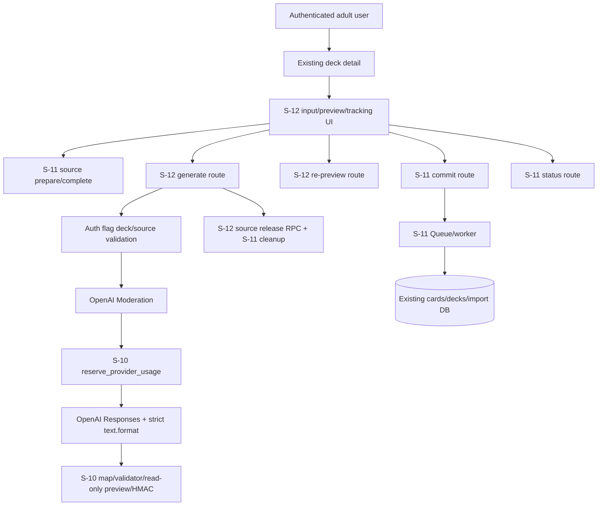
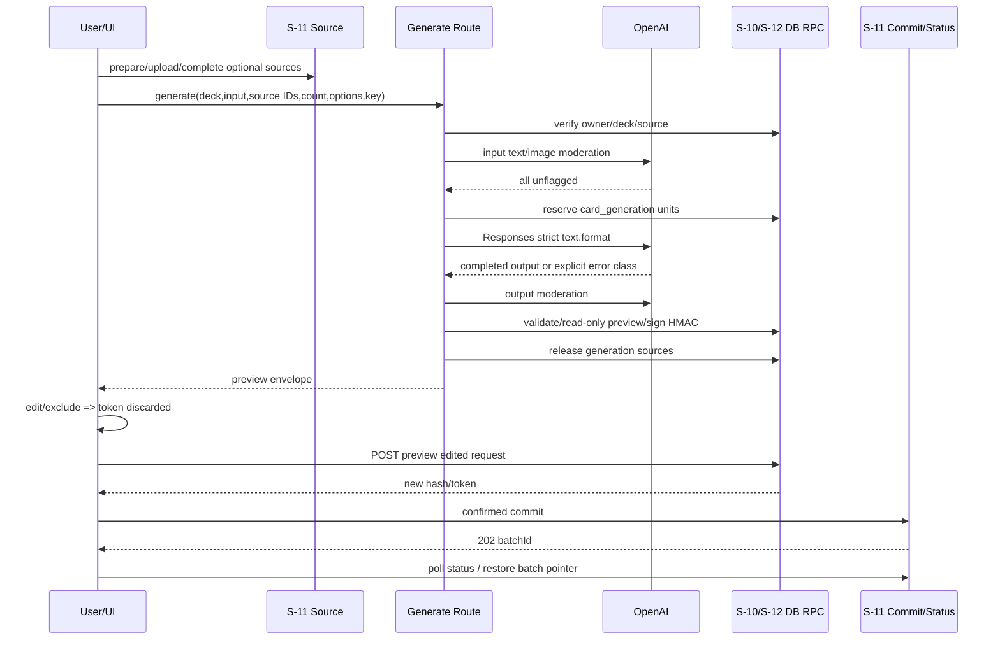
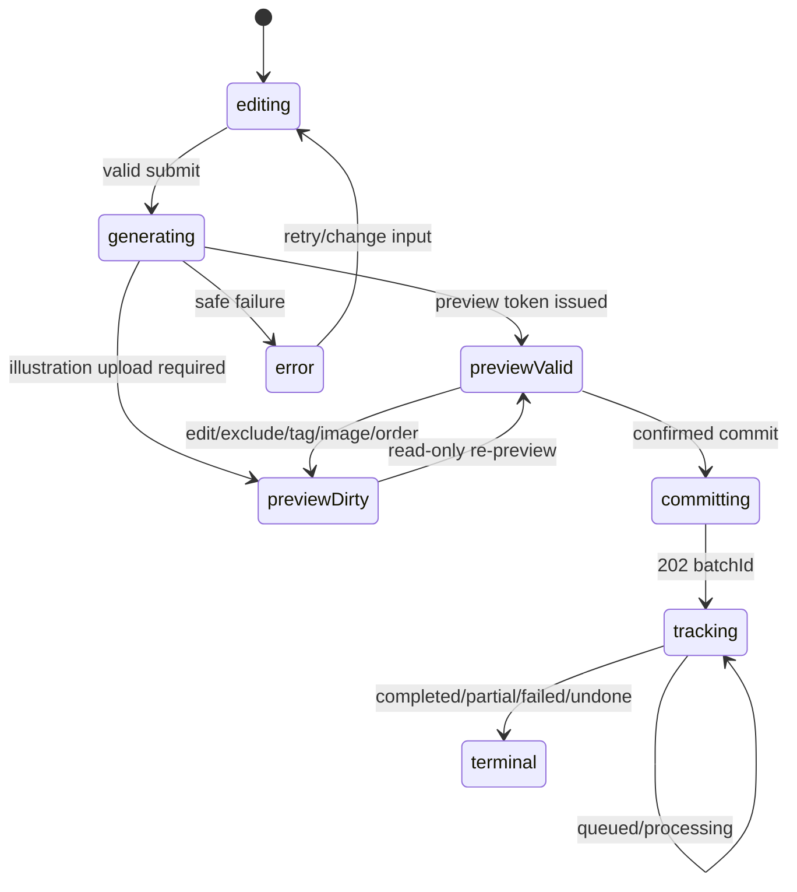

# Design Doc: アプリ内OpenAIカード生成UI

## 1. 目的・設計境界

ログインユーザーが所有deckから、textまたは検証済み教材画像をOpenAIへ入力し、R1/W1 draftを全件確認・編集・除外してからS-10/S-11の安全なimportへ渡す。S-12は生成と人間確認の境界だけを追加し、S-10のimport不変条件、S-11のQueue/worker/cleanup、既存card/studyを置換しない。

### 合意事項チェックリスト

#### スコープ

- [x] deck詳細のfeature flag連動導線
- [x] `/decks/[deckId]/ai/new`の入力・生成・preview・tracking UI
- [x] OpenAI Responses strict Structured Outputsとtext/image/output moderation
- [x] S-10 quota、validator、hash、HMACおよびS-11 source/commit/statusへのadapter
- [x] source即時releaseのS-11 forward拡張
- [x] Unit 10件以上、Integration 6件以上、E2E 4件以上

#### 非スコープ

- [x] PDF、R2/W2、一般問題形式、BYOK、無確認登録
- [x] S-10/S-11 migration履歴、Queue、worker、cleanup architectureの再構築
- [x] 既存Gemini illustration生成と既存学習画面の置換
- [x] server-side draft保存、multi-device draft復元、push通知

#### 制約

- [x] 現行実体のNext.js 14.2 / React 18 / Supabaseを正とする
- [x] 既存URL、private owner境界、SRS挙動を後方互換とする
- [x] S-11 hosted acceptance未完了を実装開始前hard gateとする
- [x] `AI_CARD_IMPORT_ENABLED=false`で新規app AI mutationだけを停止する

## 2. 前提ADRと設計判断

| ADR | 前提 |
|---|---|
| `ADR-007-ai-card-import-foundation.md` | owner境界、S-10 validator/hash/HMAC、開始時quota、二段階commit |
| `ADR-008-ai-card-async-queue-image-processing.md` | source validation/cleanup、async commit/status、concept pair、partial batch |
| `ADR-009-openai-card-generation-safety-boundary.md` | Responses、strict schema、moderation、model/error契約 |
| `ADR-010-ai-card-preview-source-status-ui-boundary.md` | preview state、source release、poll/reload、flag境界 |

ADR-009/010は公式OpenAI仕様、S-10/S-11非置換境界、security/cleanup/rollback契約の第三者document reviewを通過し、`Accepted`である。

## 3. 既存コードベース分析

### 3.1 実体とsteeringの差異

`frontend/package.json`はNext.js `^14.2.5`、React `^18.3.1`、Tailwind 3、Vitest 2である。一方`.claude/steering/architecture/*`は別製品HapicoのNext.js 16/NestJS/Prismaを記載し、必須参照の`architecture/implementation-approach.md`は存在しない。S-11と同様、実コード、`technical-spec.md`、ADR-007/008を正本とする。steering修正はIssue #13のproduction scope外である。

### 3.2 UIデータソース

S-12にはFigma `ui-design/metadata.json`、`structure.xml`、screenshotが存在しない。したがって既存`frontend/app/(auth)/decks/[deckId]/page.tsx`とTailwind tokenをUIの接続正本とし、新画面は既存の`max-w-lg`、`px-4`、blue/slate tone、44px以上の主要controlを踏襲する。Figma準拠を推測しない。

### 3.3 実装パスマッピング

| 種別 | パス | 現在/追加責務 |
|---|---|---|
| 既存変更 | `frontend/app/(auth)/decks/[deckId]/page.tsx` | server側flag判定後にAI作成Linkを追加 |
| 新規 | `frontend/app/(auth)/decks/[deckId]/ai/new/page.tsx` | auth/flag/deck ownerのserver boundary、404 |
| 新規 | `frontend/app/(auth)/decks/[deckId]/ai/new/AiCardImportClient.tsx` | UI state reducerと画面合成 |
| 新規 | `frontend/src/components/ai-card-import/*` | form、source list、draft cards、warning、status |
| 新規 | `frontend/app/api/ai/card-drafts/generate/route.ts` | validation→moderation→quota→Responses→preview |
| 新規 | `frontend/app/api/ai/card-drafts/sources/release/route.ts` | 明示取消と即時source release |
| 新規 | `frontend/app/api/ai/imports/preview/route.ts` | 編集後read-only preview、hash/HMAC再発行 |
| 既存変更 | `frontend/app/api/ai/imports/{commit,sources/prepare,sources/complete}/route.ts` | flag、warning confirmation、S-12 source gate |
| 波及なし | `frontend/app/api/ai/imports/status/route.ts` | flag無効でもowner-scoped statusを維持 |
| 新規 | `frontend/src/lib/ai-card-generation/{contracts,openai-adapter,moderation,output-mapper,errors}.ts` | pure provider/domain境界 |
| 既存拡張 | `frontend/src/lib/ai-import/{canonical-request,errors}.ts` | generation canonical inputとsafe codeを正本へ追加 |
| 既存拡張 | `frontend/src/lib/env.ts` | OpenAI/flag/timeoutのtyped config |
| 新規 | `frontend/src/lib/ai-import/preview-service.ts` | S-10 validator、DB preview、HMACの共通service |
| 新規 | `frontend/src/lib/ai-import/status-poller.ts` | storage pointer、poll policy、tab lease pure logic |
| forward migration | `supabase/migrations/*_s12_ai_card_generation_source_release.sql` | upload usage scope、read-only preview/source取得、owner-scoped release RPC |
| 新規test | `specs/stories/S-12-ai-card-openai-generation-ui/tests/*` | Unit/Integration/E2E/traceability |

### 3.4 既存統合点

- `validateImportRequest`: 1〜50、text 1〜200、tag 0〜10/1〜30、Han、R1/W1 pair、duplicateを最終正本とする。
- `canonicalizeGenerationRequest` / `hashGenerationRequest`: instruction、source digest、pattern、requested count、tag、illustration modeをcanonicalizeする。
- `hashImportRequest`: 編集・除外後requestのHMAC bindingを作る。
- `signPreviewToken` / `verifyPreviewToken`: user/reservation/import hash/30分を継続利用する。
- `reserve_provider_usage`: `card_generation`、`app_ai`、展開後unitsでprovider直前に呼ぶ。
- S-11 routes: source prepare/complete、async commit/statusを正規経路にする。
- S-11 cleanup: `claim/verify/complete_ai_import_cleanup`とprivate `ai-card-sources`を変更しない。

## 4. 実装アプローチ

`implementation-approach.md`がないため、変更依存を明示評価した結果、**水平安全境界 + 垂直user flowのハイブリッド**を採用する。

1. 型・config・provider parser・S-12 forward RPCを独立contractとして先に成立させる。
2. text-only generate→preview→commit→statusの縦flowを接続する。
3. source/image moderation/releaseとillustration uploadを同じflowへ追加する。
4. accessibility、reload/partial、rollbackを統合境界で検証する。

これはスケジュールやtask分解ではなく、技術的依存順序である。source releaseはDB contractなしにrouteを安全実装できず、UIはgenerate/preview DTOなしにtoken lifecycleを型付けできない。

## 5. アーキテクチャと変更影響

### 5.1 アーキテクチャ図



### 5.2 変更影響マップ

```yaml
変更対象:
  - deck詳細導線
  - app AI生成/preview UIとserver adapter
  - app AI feature flag境界
  - generation sourceのcommit前release
直接影響:
  - frontend/app/(auth)/decks/[deckId]/page.tsx
  - frontend/app/(auth)/decks/[deckId]/ai/new/*
  - frontend/app/api/ai/card-drafts/*
  - frontend/app/api/ai/imports/{preview,commit,sources/*}
  - frontend/src/lib/{ai-card-generation,ai-import,env.ts}
  - S-12 forward migration/tests
間接影響:
  - OpenAI費用と応答時間
  - S-10 quota reservation
  - S-11 private Storage cleanup schedule
  - async batch status表示
波及なし:
  - existing public/private cards
  - decks/study URLとSRS計算
  - S-11 Queue worker/illustration provider selection
  - remote MCP import contract
  - Gemini illustration reveal経路
```

### 5.3 インターフェース変更マトリクス

| 既存 | 新規/変更 | 変換必要性 | 互換性 |
|---|---|---|---|
| deck detail | flag付きAI Link | なし | 既存study Linkを保持 |
| S-11 source prepare/complete | flag gate + generation source | upload DTOは維持 | enabled時既存contractを維持 |
| `ai_uploads` | `usage_scope`追加 | 教材source/card illustrationを分離 | 既存rowは`card_illustration`へbackfill |
| S-10 generation canonical input | S-12 option object | あり | 既存canonicalizerを拡張、複製なし |
| OpenAI concept JSON | `ClientImportRequestInput` | 必須 | S-10 validator通過後だけ内部へ渡す |
| preview HMAC pure function | `POST /api/ai/imports/preview` | route service化 | token format/30分を維持 |
| S-11 commit body | `confirmedWarnings: true`追加 | 必須 | app_aiだけ追加検証 |
| S-11 status | UI poll/reload pointer | なし | status route/DTOを変更しない |
| S-11 cleanup RPC | S-12 immediate release RPC | forward補助 | age cleanup正本を維持 |

## 6. HTTP・内部型契約

### 6.1 Generate request/response

`POST /api/ai/card-drafts/generate`

```typescript
interface GenerateCardDraftRequest {
  readonly deckId: string
  readonly instruction: string
  readonly sourceUploadIds: readonly string[]
  readonly pattern: "R1" | "W1" | "both"
  readonly requestedCardCount: number
  readonly tags: readonly string[]
  readonly illustration: "none" | "ai" | "upload"
  readonly generationReservationKey: string
}

interface PreviewEnvelope {
  readonly request: ClientImportRequestInput
  readonly importRequestHash: string
  readonly previewToken: string
  readonly previewExpiresAt: number
  readonly cardReservationKey: string
  readonly warnings: readonly ["accuracy", "privacy", "copyright"]
}
```

Validation:

- `deckId`はURL/route bodyで一致し、auth user ownerの既存deckでなければ404。
- instructionはdisplay normalization後1〜4,000 Unicode scalar。制御文字/surrogate不正を拒否する。
- sourceは0〜5のcanonical UUID、重複不可、全件owner/ready/privateかつ`usage_scope='generation_source'`でなければ404/409。
- `requestedCardCount`は展開後1〜50。`both`は偶数、concept countは半数。
- tagsはS-10 limit。illustration `upload`は生成直後にはconcept upload未確定でもよいが、有効preview発行時には全included conceptへreadyかつ`usage_scope='card_illustration'`のuploadを要求する。初回generateでupload未指定なら`previewDirty`相当draftを返し、`POST preview`で完成させる。
- reservation keyは1〜128、安全なASCII。serverがgeneration hashとunitsへ束縛する。

SuccessはHTTP 200 `PreviewEnvelope`。illustration uploadが未完ならHTTP 200 `DraftEnvelope { request, requiresIllustrationUploads: conceptIds }`でtokenを返さない。

### 6.2 Edited preview

`POST /api/ai/imports/preview`

```typescript
interface PreviewImportRequest {
  readonly request: ClientImportRequestInput
  readonly cardReservationKey: string
}
```

処理はauth/flag→S-10 `validateImportRequest`→deck owner→owner内duplicate/read-only upload ready→reservation owner/kind/source/started確認→`hashImportRequest`→HMAC発行。DB書込みはしない。reservationのgeneration hashは変えず、edited import hashだけを新tokenへ束縛する。

### 6.3 Commit追加契約

既存`POST /api/ai/imports/commit` bodyへ`confirmedWarnings: true`を追加する。exact trueでなければ400 `CONFIRMATION_REQUIRED`。その後、既存のrequest validation、hash、HMAC、S-11 `commit_import_async`を実行する。flag disabledは404 `FEATURE_DISABLED`とし、DB RPCを呼ばない。

### 6.4 Source release

`POST /api/ai/card-drafts/sources/release`

```typescript
interface ReleaseGenerationSourcesRequest {
  readonly uploadIds: readonly string[]
}

interface ReleaseGenerationSourcesResponse {
  readonly released: number
  readonly cleanupPending: number
}
```

owner以外または`generation_source`以外を存在秘匿し、1〜5件を昇順に処理する。DBが返したbucket/path以外をStorageへ渡さない。Storage success/404はreleased、network/5xxはcleanupPending。route response loss後の再送は同じ結果へ収束する。

### 6.5 Feature config

| env | default | allowlist/範囲 | invalid時 |
|---|---|---|---|
| `AI_CARD_IMPORT_ENABLED` | disabled | exact `true`のみenable | disabled。status/source releaseは継続 |
| `OPENAI_API_KEY` | なし | non-empty server secret | provider config error |
| `OPENAI_CARD_GENERATION_MODEL` | `gpt-5.6-luna` | safe model ID 1〜128 | config error |
| `OPENAI_MODERATION_MODEL` | `omni-moderation-latest` | exact値 | config error |
| `OPENAI_CARD_IMAGE_DETAIL` | `high` | `low/high/auto` | config error |
| `OPENAI_CARD_GENERATION_TIMEOUT_MS` | 60000 | 5000〜120000 integer | config error |
| `OPENAI_MODERATION_TIMEOUT_MS` | 10000 | 1000〜30000 integer | config error |

`process.env`参照は`frontend/src/lib/env.ts`に集約し、client bundleへsecretをexportしない。

## 7. OpenAI payload・response contract

### 7.1 Responses payload

```json
{
  "model": "<server configured>",
  "store": false,
  "background": false,
  "max_output_tokens": 32768,
  "input": [
    {
      "role": "developer",
      "content": [{ "type": "input_text", "text": "<fixed card-generation policy>" }]
    },
    {
      "role": "user",
      "content": [
        { "type": "input_text", "text": "<bounded canonical instruction/options>" },
        { "type": "input_image", "image_url": "data:image/png;base64,...", "detail": "high" }
      ]
    }
  ],
  "text": {
    "format": {
      "type": "json_schema",
      "name": "kanji_card_concepts",
      "strict": true,
      "schema": "<exact concept-count schema>"
    }
  }
}
```

No tools、`previous_response_id`、外部URL、client model、metadata本文を含めない。source complete後のsanitized PNG bytesだけを使う。

### 7.2 Structured schemaとmapping

```typescript
interface OpenAiConceptOutput {
  readonly concepts: readonly {
    readonly kanjiSide: string
    readonly counterpartSide: string
  }[]
}
```

- JSON Schemaはroot/item `additionalProperties:false`、required field固定、text `minLength:1/maxLength:200`。
- concept count `minItems=maxItems`はR1/W1ならrequested count、bothなら半数。
- server IDは`concept-001`、item IDは`concept-001-r1`/`-w1`として決定的に作る。
- R1: front=`kanjiSide`, back=`counterpartSide`。W1: front=`counterpartSide`, back=`kanjiSide`。
- both: 同じconcept IDと相互交換。tags/imageはuser selectionを全itemへ写像する。
- `validateImportRequest`のnormalized resultだけをpreview responseにserializeする。

### 7.3 Strict response判定

1. HTTP non-2xxをstatusだけで分類する。
2. 2xx bodyをsize制限付きでJSON parseし、rootを`unknown`から検査する。
3. `error != null`または`status=failed`はprovider error。
4. `status=incomplete`はreasonに関係なく`OPENAI_INCOMPLETE_OUTPUT`。`max_output_tokens`/`content_filter`はsafe metricだけに保持する。
5. output message内に`refusal`が1件でもあれば`OPENAI_REFUSAL`。
6. `status=completed`、error/incomplete null、completed assistant message 1件、そのcontent内の`output_text` 1件だけを受理する。`output`に併存し得るallowlisted reasoning itemは本文として扱わず、追加message、未知のactive content type、複数/欠落`output_text`はschema mismatchとする。
7. JSON/schema/count/mapping/S-10 validationのいずれかに失敗したら`OPENAI_OUTPUT_SCHEMA_MISMATCH`。

### 7.4 Moderation

- instruction textは文字列1件として1回、sourceは単一`image_url` content itemとして1画像1回、`omni-moderation-latest`へ別requestで送る。multimodal contentの要素数と`results`の件数・index対応を仮定しない。
- 各responseは`results.length === 1`かつ`results[0].flagged`がbooleanでなければunavailable。
- instruction callのflaggedはtext、各source callのflaggedはimage moderation codeへ写像する。
- outputは`[CARD n FRONT]... [BACK]...`のbounded text 1件として送り、結果1件を要求する。
- category score/detailは保存・返却せず、stageとflagged booleanだけを扱う。

## 8. 生成・preview・commitデータフロー



Quota不変条件:

- provider前validation/moderation failureではreservation 0。
- reservation成功後はどのprovider/output結果でも返却0。
- duplicate click/response lossは同一reservation key/generation hash/unitsでusage増分1回。

## 9. Source lifecycleと24時間reconciliation

### 9.1 通常終了

1. prepare routeが教材sourceを`usage_scope='generation_source'`として保存する。generate routeは全sourceのowner、scope、ready state、記録済みpathを検証した直後、Storage byte readより前にIDをrelease setへ入れる。
2. success/refusal/moderation/schema/provider failureのすべてでrelease RPCを呼ぶ。
3. release RPCがrow lock、owner/path、active consumer不在を確認し`cleanup_pending`へする。
4. Storage source/rawをdelete。404も成功。
5. completion RPCがpathをnull化し、両方なければ`deleted`にする。

### 9.2 異常・取消

- delete失敗/response lossはpathを残した`cleanup_pending`とし、同じreleaseの再試行またはscheduled cleanupへ渡す。
- generate request到達前の明示取消はrelease routeを使う。
- browser crashは`created_at + 24 hours`まで保持し、S-11 scheduled cleanupが回収する。

### 9.3 既存S-11契約との整合

実装済み`claim_ai_import_cleanup`と`verify_ai_import_cleanup`は、source/rawについて`created_at + interval '24 hours' <= db_now`を両方で再確認する。この比較により23:59:59は保護、24:00:00でeligibleである。`delete_due_at`が23時間45分でも、24時間条件とのANDで早期削除されない。active `queued/processing` consumer、owner prefix不一致、stale claimは削除しない。

S-11のcandidate-bound release evidenceは`accepted`でHosted7が全件passしている。以下を実装開始前hard gateとする。

- S-11 migration/RPC/routesが対象hosted環境へ反映済み。
- Hosted7とcleanup schedule/resource gateがcurrent candidateで成功。
- 固定DB時計testで23:59:59 claim 0、24:00:00 claim 1、active consumer claim 0。

未成立ならS-12内で代替cleanupを構築せずblockedとする。

## 10. UI設計

### 10.1 画面構造マップ

```text
Deck detail
├── existing back link / title / stats / study action
└── AIでカードを作る Link (flag enabled only)

AI Card New (/decks/[deckId]/ai/new)
├── Header
│   ├── デッキへ戻る Link
│   └── title / target deck name
├── SafetyNotice (accuracy / privacy / copyright)
├── GenerationForm
│   ├── instruction textarea + field error
│   ├── source image file input / list / remove
│   ├── pattern radio (R1/W1/both)
│   ├── requested count number input
│   ├── tag inputs
│   └── illustration mode radio
├── DraftPreview (1..50 cards)
│   └── ConceptGroup
│       ├── R1/W1 card editor(s) + include checkbox
│       └── concept illustration control (upload only)
├── ApprovalPanel
│   ├── three warnings
│   ├── confirmed checkbox
│   ├── 再確認 preview button (dirty only)
│   └── 登録 commit button (valid+confirmed only)
├── BatchStatus
│   ├── queued/processing text + retry
│   ├── completed/partial/failed counts
│   └── item safe errors
└── aria-live StatusRegion
```

### 10.2 配置・responsive

| Section | Layout | 360px契約 |
|---|---|---|
| page | `mx-auto w-full max-w-lg px-4 py-6` | content幅328px、overflowなし |
| mode controls | 1列またはwrapするfieldset | radio labelを省略しない |
| card editor | conceptごとの縦stack | inputは`min-w-0 w-full` |
| action | mobile縦stack、largerで横並び可 | DOM/focus順は視覚順と一致 |
| status items | text wrap list | table固定幅を使わない |

### 10.3 Concept illustration upload

- `upload` modeではconcept header直下に1つのfile inputを表示する。
- R1/W1 item双方には同じupload statusをread-only表示し、別file inputを作らない。
- concept除外時は未参照uploadをrelease対象にする。片側だけ除外した場合は残りへ同じupload IDを保持する。
- 教材source listとillustration listは見出しと説明を分ける。

### 10.4 Accessibility

- textarea、file、radio group、count、tags、各front/back、include、warning checkboxへvisible label/legendを付ける。
- field error IDを`aria-describedby`へ関連付け、invalid controlへ`aria-invalid=true`。
- generate/preview/commit errorは`role=alert`へ出し、submit後にsummary headingへfocusする。
- queued/processing/status更新は`aria-live=polite`の文字列で通知し、spinner/colorのみへ依存しない。
- file追加/削除、card除外、再preview、commit、cancel、status再取得をnative keyboard controlで行う。drag-only reorderは実装しない。
- focusは生成成功後preview heading、commit成功後status heading、terminal後result headingへ移す。
- disabled buttonだけに理由を隠さず、隣接textで「再確認が必要」「注意事項の確認が必要」を示す。

## 11. UI state・poll・reload

### 11.1 State union

```typescript
type AiCardUiState =
  | { readonly kind: "editing" }
  | { readonly kind: "generating"; readonly startedAt: number }
  | { readonly kind: "previewDirty"; readonly request: ClientImportRequestInput }
  | { readonly kind: "previewValid"; readonly preview: PreviewEnvelope; readonly confirmed: boolean }
  | { readonly kind: "committing"; readonly preview: PreviewEnvelope }
  | { readonly kind: "tracking"; readonly deckId: string; readonly batchId: string }
  | { readonly kind: "terminal"; readonly result: ImportStatusResponse }
  | { readonly kind: "error"; readonly code: AiCardGenerationErrorCode }
```

`previewToken`は`previewValid/committing`だけに存在する。edit、exclude、order、tag、image eventはtokenを持たない`previewDirty`を生成し、confirmationもfalseへ戻す。

### 11.2 Browser storage

- key: `kanji-everyday:ai-card-import:v1:{deckId}`
- value: `{ "version": 1, "deckId": "uuid", "batchId": "uuid" }`
- 202 strict parse後だけwrite。terminal/401/404/invalid JSON/deck mismatchでremove。
- card text、instruction、source、token、hash、reservation/idempotency keyを保存しない。

### 11.3 Poll

- tracking開始〜30秒: visible leader tabが2秒間隔。
- 30秒以降: 5秒間隔。
- terminal、401/404、unmount/cancelでAbortControllerをabortし停止。
- network/503は5秒後再試行し、同時に手動「再取得」を提供。
- `BroadcastChannel` heartbeat 4秒、lease expiry 10秒。visible tabの最小tab IDがleader。非対応時はtabごとpollする。

## 12. 状態遷移と不変条件



不変条件:

- 展開後requested countはprovider前とprovider後の両方で1〜50かつ要求値と一致する。
- dirty requestはpreview tokenを持たずcommitできない。
- warning confirmation falseではclient/server双方がcommitしない。
- source bytesはbrowser storage、application log、analyticsへ出ない。
- `partial`はS-11 terminal batchだけであり、OpenAI incomplete draftではない。
- flag disabledでも既存status/card/studyは読める。

## 13. Error contract

| safe code | HTTP | UI message/action |
|---|---:|---|
| `FEATURE_DISABLED` | 404 | page/導線を出さない |
| `CONFIRMATION_REQUIRED` | 400 | 注意事項checkboxへfocus |
| `OPENAI_INPUT_TEXT_MODERATION` | 422 | 指示を見直す |
| `OPENAI_INPUT_IMAGE_MODERATION` | 422 | 教材画像を見直す |
| `OPENAI_OUTPUT_MODERATION` | 422 | 安全上preview不可 |
| `OPENAI_MODERATION_UNAVAILABLE` | 503 | 後で再試行 |
| `OPENAI_REFUSAL` | 422 | model拒否として表示 |
| `OPENAI_INCOMPLETE_OUTPUT` | 502 | 不完全結果を採用せず再試行 |
| `OPENAI_OUTPUT_SCHEMA_MISMATCH` | 502 | card形式確認不能、再試行 |
| `OPENAI_PROVIDER_TRANSIENT` | 503 | timeout/rate/provider一時障害 |
| `OPENAI_PROVIDER_CONFIG` | 503 | 運用設定、一般利用者には再試行案内 |
| `OPENAI_PROVIDER_PERMANENT` | 502 | provider処理失敗 |
| S-10/S-11 existing codes | 既存 | 既存safe mappingを維持 |

responseは`{ error: { code, detail? } }`のallowlistだけを返す。detailはfield/stage/correlation ID等の安全値に限定し、raw OpenAI message/category/card/source pathを含めない。

## 14. Threat model・security

| Threat | Attack | Control |
|---|---|---|
| owner差し替え | body deck/source/batch ownerを偽装 | auth UIDを正本、owner RPC/RLS、404秘匿 |
| quota bypass | count/model/key変更、double click | server count/model、canonical generation hash、stable reservation key、S-10 lock |
| preview改ざん | token/hash/card/tag/image差し替え | S-10 HMAC、server recompute hash、30分 expiry、dirty token破棄 |
| 無確認commit | disabled UI迂回 | `confirmedWarnings === true`をserver検証 |
| prompt injection | 教材画像/textがsystem policyを上書き | developer policy、toolsなし、provider outputは最小schema、S-10再検証 |
| PII/copyright | source/指示へ個人情報・無権利教材 | persistent warning、moderation、no-log、source即時/24h削除、人間確認 |
| provider data leak | private URL/secret/raw response露出 | server bounded bytes→data URL、`store:false`、no raw logging/client response |
| Storage delete abuse | client pathで他objectまたはillustrationを削除 | DB記録owner pathと`generation_source` scopeのみ、service RPC、active consumer/owner再確認 |
| browser persistence | draft/tokenをlocalStorageから取得 | batch/deck UUIDだけ保存 |
| feature flag bypass | route直叩き | 新規作成routeをserver gate、exact trueのみenable。status/recovery releaseだけ継続 |

## 15. Observability・運用

### 15.1 Allowlist structured log

```yaml
event: ai_card_generation
correlationId: safe UUID
stage: validate|input_moderation|quota|responses|output_moderation|preview|source_release|commit|poll
outcome: success|safe_error
safeCode: optional allowlisted code
durationMs: nonnegative integer
requestedCardCount: 1..50
sourceCount: 0..5
model: safe configured identifier
```

禁止: instruction、front/back、tags、source bytes/path、API key、Authorization、preview token、reservation/idempotency key、raw provider body/refusal/category score。

### 15.2 Metrics/alert

- generation request/success/error count by safe stage/code/model。
- p50/p95 duration for moderation/Responses/preview/source release。
- reserved units vs preview success count（本文なし）。
- source immediate release success/pending count、24h eligible residual count。
- schema mismatch/refusal/moderation/provider transient rate。
- flag disabled mutation attempt count。

Alert候補: moderation unavailable/provider transientが5分窓で20%以上、schema mismatchがmodel切替後5%以上、24h eligible sourceがscheduled cleanup 2回後も残存、provider config error 1件以上。

## 16. 受入条件（EARS）

### AC-01 Text/image generation

- 契機型: ownerがvalid text-only requestを送信したとき、システムはinput/output moderationとResponses strict schemaを通過したR1/W1 previewを返すこと。
- 選択型: もしready source画像を含むなら、システムは同じsanitized imageをimage moderationとResponses `input_image`へ渡すこと。

### AC-02 both/count

- 遍在型: システムは`requestedCardCount`を展開後1〜50として扱うこと。
- 不測型: もしbothが奇数、0、51以上、またはprovider展開件数が不一致なら、システムはpreview tokenを発行しないこと。
- 契機型: both conceptを展開するとき、システムは同じconcept IDを共有しfront/backが交換されたR1/W1を作ること。

### AC-03 Error separation

- 不測型: Structured schema不一致、refusal、incomplete、text/image/output moderation、provider failureが発生した場合、システムは本書13章の異なるsafe codeへ写像すること。
- 遍在型: システムはraw provider response、secret、source/card textをerror response/logへ含めないこと。

### AC-04 Edit/exclude/confirmation

- 契機型: preview後にcard/tag/image/include/orderが変わったとき、システムはtokenを破棄し再previewを要求すること。
- 状態型: confirmationがfalseの間、システムはclient/server双方でcommitを拒否すること。
- 不測型: included cardが0またはS-10 validation failureなら、システムはcommitしないこと。

### AC-05 Token defense

- 不測型: token改ざん、別owner、期限切れ、reservationまたはrequest内容差し替えがある場合、システムは401/400で拒否しbatch/item/card/tagを増やさないこと。

### AC-06 Source deletion

- 契機型: generateがsuccess/refusal/moderation/schema/provider failureで終了したとき、システムは全generation sourceの即時releaseを試行すること。
- 状態型: source ageが24時間未満またはactive consumerがある間、scheduled cleanupは削除しないこと。
- 契機型: source ageが24時間に到達した後の最初のcleanupで、owner/path/claim再確認を通過した残存sourceを削除すること。

### AC-07 UI/accessibility

- 遍在型: 360px viewportでpage scroll widthはclient widthを超えないこと。
- 遍在型: 全inputはaccessible name、field errorは関連ID、async/errorは文字/live regionを持つこと。
- 契機型: keyboardだけで入力、source操作、生成、編集、除外、再preview、確認、commit、status再取得を行えること。

### AC-08 Quality/rollback/regression

- 状態型: flagがdisabledの間、新規導線/page/generate/preview/source prepare・complete/app_ai commitは成功せず、status、source recovery release、既存card/studyは維持されること。
- 遍在型: `frontend`の`npm run check`とS-10/S-11影響suiteが成功すること。

## 17. Test strategy

### 17.1 Unit（最低10、設計上16件）

1. text-only Responses payloadと`store:false/text.format`。
2. image data URL + detail payload。
3. dynamic exact-count JSON Schema。
4. R1 mapping。
5. W1 mapping。
6. both swap/shared concept。
7. 0/51/both odd/count mismatch。
8. completed output strict parse。
9. refusal mapping。
10. incomplete max tokens/content filter mapping。
11. schema/unknown output mapping。
12. text 1回・画像ごと1回・output 1回のmoderation mapping、各`results.length !== 1`/shape不正。
13. timeout/429/5xx/401/other4xx/error object mapping。
14. generation hash/quota retry/conflict。
15. edit event token/confirmation invalidation reducer。
16. localStorage/poll/leader policy strict parse。

### 17.2 Integration（最低6、設計上9件）

1. text generate→normalized preview→confirmation→S-11 202 commit。
2. source prepare/complete→moderation→generate→immediate release→commit。
3. input moderation rejectionでquota/provider/batch 0。
4. output moderation/schema/refusal/provider failureで予約保持、preview/batch 0、source release。
5. edited preview→new token、old token/content/tamper/expiry拒否。
6. warning false server拒否、true commit。
7. source read失敗/削除response loss→release、repeat/404→deleted、削除failure→24h cleanup、illustration scopeのrelease拒否。
8. owner/deck/source/batch isolation。
9. flag off mutation全拒否、status/card snapshot不変。

### 17.3 E2E（最低4、設計上5件）

1. text-only generate→edit→re-preview→confirm→completed。
2. image generate→exclude→illustration concept upload→confirm→completed。
3. queued/processingでreloadしbatch pointerから復元。
4. terminal `partial`でsuccess cardとfailed item codeを区別。
5. 360px + keyboard + label/error/live region + flag off導線。

### 17.4 Regression/commands

実装完了時の正本:

```bash
cd frontend && npm run check
cd frontend && npm run test:s10:inventory
cd frontend && npm run test:s11:inventory
```

DB/hosted資格情報が必要なS-10/S-11 gateは対象環境で別実行し、not_runをpassとして扱わない。既存deck detailとstudy page testを明示実行し、URL、開始、回答、評価を確認する。

## 18. 技術的依存関係と統合確認

### 18.1 必要順序

1. ADR-009/010 AcceptedとS-11 hosted hard gate。
2. typed config、error/type/pure OpenAI contracts。
3. S-12 forward RPC/source releaseとDB contract tests。
4. generate/preview service routes。
5. UI reducer/componentsとdeck導線。
6. existing commit/source flag extension、status poll/reload。
7. full integration/accessibility/regression/rollback evidence。

### 18.2 統合ポイント別E2E確認

| 統合点 | 確認 | 期待 |
|---|---|---|
| deck→new page | owner deck/other owner/flag offでnavigate | enabled ownerだけ200、他404 |
| source→OpenAI | PNG/JPEG/WebP complete後generate | sanitized image moderation/Responses、終了release |
| OpenAI→S-10 | strict fixtureでboth 4枚 | exact pair、validator/hash/token成功 |
| edit→preview→commit | 1文字編集後old token commit | old拒否、新token + confirmationだけ202 |
| commit→S-11 status | queued後reload | same batchを復元、terminalでpointer削除 |
| partial | 1 success/1 failure fixture | success保持、safe item error表示 |
| rollback | flag true→false snapshot | new mutation 0、status/card/study不変 |

## 19. Rollout・rollback

### Rollout gate

- ADR-009/010 Accepted。
- configured generation modelのtext/image/Structured Outputs contract test成功。
- S-11 current candidateのHosted7、cleanup schedule、source 24h境界成功。
- OpenAI key/model/moderation/timeout typed config validation成功。
- feature flag default disabledのstaging deploy後、test ownerだけでenableしてmetrics確認。

### Rollback

`AI_CARD_IMPORT_ENABLED`をfalseへする。deck導線/new page/generate/preview/source prepare・complete/new app_ai commitをserverで停止する。status GET、owner-scoped source release、S-11 worker/cleanup、既存batch/card/deck/studyは継続する。切替前sourceは即時release retryまたはS-11 24h cleanupへ収束する。migration rollbackや既存card削除は行わない。

## 20. Riskと軽減

| Risk | 影響 | 軽減 |
|---|---|---|
| model aliasの能力/出力変化 | 高 | capability gate、strict schema、model/error metrics、flag rollback |
| 日本語教材画像の読取誤り | 高 | detail high、公式vision制約を警告、人間による全件確認 |
| 50MiB base64 request memory/latency | 中 | source逐次bounded read、5件/50MiB、timeout、負荷test |
| moderation false positive/unavailable | 中 | stage別表示、fail closed、raw category非表示 |
| source即時delete response loss | 高 | DB marker先行、idempotent retry、404 success、24h cleanup |
| preview dirty判定漏れ | 高 | reducer union、全mutation test、server hash/HMAC再検証 |
| multi-tab duplicate poll | 低 | BroadcastChannel leader、GET read-only、fallback許容 |
| S-11 hosted未受入 | 高 | implementation hard gate、S-12内で代替構築禁止 |
| stale architecture steering | 中 | actual package/code/ADRを正本、別保守issueへ分離 |

## 21. 解決済み未決事項と残存前提

要件16章の8項目は次のとおり解決した。

1. instruction 4,000 Unicode scalar、dynamic user text 16,000、source 5件/50MiB。
2. default `gpt-5.6-luna`、moderation `omni-moderation-latest`、detail high、typed timeouts。
3. 7章/13章のstrict parseとsafe HTTP mapping。
4. concept単位illustration control、both共有。
5. owner-scoped release/complete forward RPC + S-11 age reconciliation。
6. batch/deckだけlocalStorage、2→5秒poll、terminal停止、BroadcastChannel best-effort leader。
7. exact trueだけenable、statusをflag外へ維持。
8. S-11 SQL上の24時間AND契約を確認し、hosted current candidate成功をimplementation hard gate化。

ユーザー判断が必要なopen questionはない。残存前提はS-11 hosted gateであり、未成立時は推測実装せずblockedとする。ADR reviewは完了済みである。

## 22. 参考資料

- `specs/stories/S-12-ai-card-openai-generation-ui/requirements.md`
- `specs/stories/S-10-ai-card-import-foundation/design.md`
- `specs/stories/S-11-ai-card-async-processing/design.md`
- https://developers.openai.com/api/docs/guides/structured-outputs
- https://developers.openai.com/api/reference/resources/responses/methods/create
- https://developers.openai.com/api/docs/guides/images-vision
- https://developers.openai.com/api/docs/guides/moderation
- https://developers.openai.com/api/reference/resources/moderations/methods/create
- https://developers.openai.com/api/docs/models/gpt-5.6-luna
- https://developers.openai.com/api/docs/models/omni-moderation-latest

OpenAI Developer Docs MCP/OpenAPI toolは当セッションに存在しなかったため、公式OpenAI guide/model page/API referenceのみをfallback参照した。

## 23. 変更履歴

| 日付 | 版 | 変更内容 |
|---|---|---|
| 2026-07-18 | 1.0.0 | Issue #13、S-10/S-11実装、OpenAI公式仕様を統合した初版 |
| 2026-07-18 | 1.0.1 | 第三者reviewでOpenAI moderation cardinality、Responses reasoning item、source read失敗時release契約を修正し、ADR-009/010 Acceptedを反映 |
| 2026-07-19 | 1.0.2 | S-11のcandidate-bound accepted evidenceを反映し、過去のHosted7 pending記録をS-12の現行blockerから除外 |
