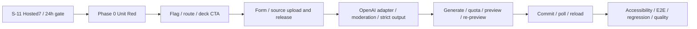
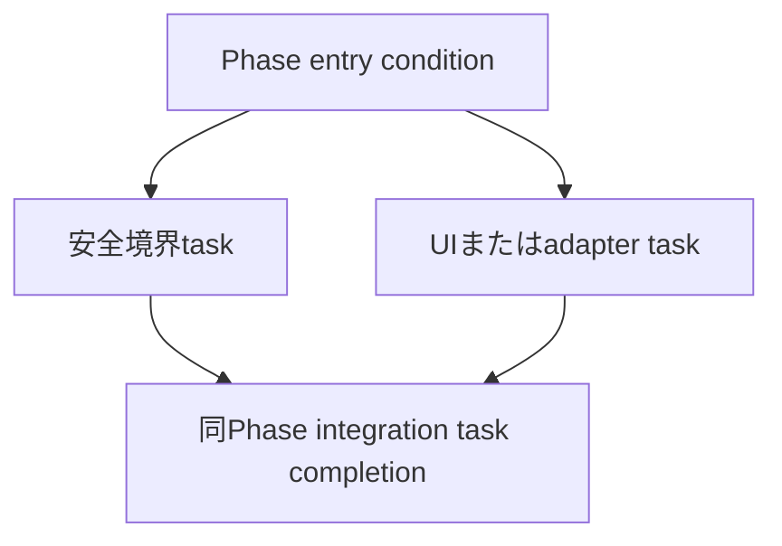

# 作業計画書: アプリ内OpenAIカード生成UI

## 1. 目的と計画境界

保護者・先生を想定したログインユーザーが、textまたは教材source画像からR1/W1案を生成し、全件を編集・除外・確認してから既存S-10/S-11 import基盤へ登録できる導線を実装する。

本計画はIssue #13だけを対象とする。S-10のowner/quota/validator/hash/HMACとS-11のsource/Queue/worker/commit/status/cleanupを正本として再利用し、既存実装・migration・testを置換または再構築しない。PDF、R2/W2、一般問題形式、BYOK、確認なし登録は対象外である。

### 計画運用ルール

- 1タスクを論理的な1コミット境界とする。実行時は実装・関連Unit/Integration・動作確認を同じタスク内で完結させる。
- 本書の依存階層は「Phase → task」の2階層だけとし、別のtasksファイルへ再分解しない。
- E2E実装・実行は全production実装後の最終Phaseだけで行う。
- UI用Figma cacheは存在しないため`ui_design: none`とする。既存deck detail、Tailwind token、`max-w-lg`、`px-4`、blue/slate tone、44px以上のcontrolをbaselineに手動確認する。
- `.claude/steering/architecture/implementation-approach.md`は存在せず、architecture steeringは別製品の記述を含む。実コード、Design Doc、technical spec、ADR-007〜010を正本とし、Issue #13でsteeringを推測修正しない。
- 工数・期間の見積もりは行わない。

## 2. 関連ドキュメントとテスト正本

- 要件: `specs/stories/S-12-ai-card-openai-generation-ui/requirements.md`
- ADR: `specs/adr/ADR-009-openai-card-generation-safety-boundary.md`
- ADR: `specs/adr/ADR-010-ai-card-preview-source-status-ui-boundary.md`
- Design Doc: `specs/stories/S-12-ai-card-openai-generation-ui/design.md`
- Unit/受入結果: `specs/stories/S-12-ai-card-openai-generation-ui/tests/acceptance-test-plan.md`
- Integration skeleton: `specs/stories/S-12-ai-card-openai-generation-ui/tests/ai-card-openai-generation-ui.int.test.ts`
- E2E skeleton: `specs/stories/S-12-ai-card-openai-generation-ui/tests/ai-card-openai-generation-ui.e2e.test.ts`
- Visual/accessibility checklist: `specs/stories/S-12-ai-card-openai-generation-ui/ui-design/visual-checklist.md`
- 再利用正本: S-10/S-11のrequirements、ADR、design、implementation、tests

### テスト配置契約

- Phase 0でUnit計画16件とPhase固有Unitを失敗するtestとして作成し、Redを確認する。
- 各production Phaseでは該当UnitをGreenにし、同じtaskで対応するIntegration `it.todo`を実装して即時実行する。依存境界が未完成のtodoを空実装で消化しない。
- Integration skeleton 15件はPhase 2〜5に割り当て、最終Phase開始時点でtodo 0件とする。
- E2E skeleton 7件はPhase 6まで`it.todo`のまま維持し、全実装後にだけ実装・実行する。
- Visual/accessibility checklistはPhase 6だけで実行する。Figma比較ではなく既存UI baselineと360px/keyboard/label-error契約を確認する。
- S-10/S-11 production契約は変更せず、S-12の追加列・公開RPCに追随する互換fixture/gateだけを最小更新し、最終回帰としてinventoryを実行する。

## 3. 開始前ハードゲート

以下がすべてpassするまでPhase 0へ進まない。`not_run`、資格情報不足、古いcandidateの結果をpassとして扱わない。

- [x] S-11 current candidateでHosted7がすべてpassしている。
- [x] scheduled cleanupが対象環境で有効で、S-11のclaim/verify/complete契約を通過している。
- [x] `created_at + 24 hours <= DB now`の境界が、23:59:59保持・24:00以降削除として実環境で確認済みである。
- [x] source/raw object、active consumer、owner path、claim fencingのS-11 cleanup evidenceが現candidateに対応する。
- [x] gate不成立時はS-12内へ代替Queue/worker/cleanupを実装せず、作業を`blocked`として終了する。

S-11のcandidate `9b95ab88239022a3e1fc03e028b8ac30b6429bae`はHosted7を含むrelease evidenceが`accepted`である。S-12固有のHosted E2Eは別gateとして扱い、S-11の過去の`not_run`記録を現行blockerへ戻さない。

## 4. 実装順序

### タスク依存関係

各taskの直接依存はPhase entryと同Phase内の必要な先行taskまでに限定する。長い横断依存はPhase完了条件で吸収し、taskを3階層以上へネストしない。

## 5. Phase 0: Unit Redと実行境界の固定

**目的**: 受入test計画を失敗するUnitへ具体化し、S-12だけを実行できるquality commandを用意する。production codeは変更しない。

### タスク

- [x] **P0-01 Unit 16件とS-12 test commandをRedで固定する**
  - 対応AC: AC-01〜08
  - 依存: 開始前ハードゲート
  - 想定変更ファイル: `specs/stories/S-12-ai-card-openai-generation-ui/tests/ai-card-openai-generation-ui.test.ts`、`frontend/package.json`
  - Commit境界: Unit計画16件と必要なfeature config/source boundaryの補助Unit、`test:s12:{unit,integration,e2e,inventory}` scriptだけを追加する。
  - 実装完了条件: `acceptance-test-plan.md`のU-01〜16が独立したtest名と対象pure boundaryを持ち、未実装moduleに対してRedになる。
  - 品質完了条件: assertionは各testの単一責務に限定し、external responseは`unknown`、mockは型付き、固定時刻を使用する。
  - 統合完了条件: Integration/E2E skeletonは変更せず、Unitだけを対象にしたcommandで意図した失敗を再現できる。
  - 動作確認: `cd frontend && npm run test:s12:unit`を実行し、未実装を理由とするRedでありtest設定不良ではないことを確認する。

### Phase完了条件

- [x] Unit 16件以上のRed理由がrequirements/designの未実装境界と一致する。
- [x] Integration 15 todo、E2E 7 todoが維持される。
- [x] production file、S-10/S-11 fileに変更がない。

## 6. Phase 1: Feature flag、Route境界、deck CTA

**目的**: fail-safe flagとowner/404境界を先に成立させ、新規AI作成の入口を既存deck detailへ最小追加する。

### タスク

- [x] **P1-01 typed feature/provider configとserver gateを実装する**
  - 対応AC: AC-03、AC-08
  - 依存: Phase 0
  - 想定変更ファイル: `frontend/src/lib/env.ts`、`frontend/src/lib/env.test.ts`、`frontend/src/lib/ai-card-generation/contracts.ts`、関連Route gate test
  - Commit境界: `AI_CARD_IMPORT_ENABLED` exact true、OpenAI key/model/moderation/detail/timeoutのtyped configとserver-only getterを追加する。
  - 実装完了条件: 未設定・空・false・不正flagはdisabled、secretはclient bundleへexportされず、`process.env`直接参照が増えない。
  - 品質完了条件: Phase 0のconfig UnitをGreenにし、invalid range/model/detail/config errorを検証する。
  - 統合完了条件: status GETとsource recovery releaseはflag外、新規mutation用gateだけが共通helperを利用できる。
  - 動作確認: flagのtrue/false/未設定を切替え、server config testとroute gate testを実行する。

- [x] **P1-02 deck CTAとowner限定new page shellを追加する**
  - 対応AC: AC-07、AC-08
  - 依存: P1-01
  - 想定変更ファイル: `frontend/app/(auth)/decks/[deckId]/page.tsx`、`frontend/app/(auth)/decks/[deckId]/ai/new/page.tsx`、page/deck test
  - Commit境界: 既存deck detailへenabled ownerだけのLinkを追加し、new pageはauth/flag/deck owner不一致を404にする。
  - 実装完了条件: enabled ownerだけが「AIでカードを作る」を見てnew pageへ遷移し、disabled/別ownerは存在を知れない。
  - 品質完了条件: page/route UnitをGreenにし、既存study Linkとdeck summary snapshotを維持する。
  - 統合完了条件: 既存deck URL・学習開始を変更せず、新page shellだけが追加される。
  - 動作確認: owner/other owner/anonymous、flag true/falseでdeck detailとnew URLの200/404を確認し、Figmaなしのため既存deck baselineで手動デザイン確認を行う。

### Phase完了条件

- [x] flag disabledでdeck CTAが非表示、new pageが404となる。
- [x] 既存deck detailとstudy Linkが不変である。
- [x] Phase 1対象UnitがGreenである。

## 7. Phase 2: Form、source upload、generation source lifecycle

**目的**: 教材sourceとcard illustrationをDBで区別し、安全なupload/release契約と入力UIをOpenAI呼出し前に成立させる。

### タスク

- [x] **P2-01 S-12 forward migrationでusage scopeとrelease RPCを追加する**
  - 対応AC: AC-05、AC-06、AC-08
  - 依存: Phase 1
  - 想定変更ファイル: `supabase/migrations/*_s12_ai_card_generation_source_release.sql`、`frontend/src/types/database.ts`、`frontend/src/types/database.typecheck.ts`、S-12 DB test
  - Commit境界: `ai_uploads.usage_scope`、既存rowの`card_illustration` backfill、generation source取得/read-only preview/release/complete RPCをforward migrationで追加する。
  - 実装完了条件: owner/scope/ready/path/active consumerをDB clockとrow lockで再確認し、client pathを削除対象に使わない。
  - 品質完了条件: fresh/upgrade、別owner、illustration scope、active consumer、idempotent retry、23:59:59/24:00境界のDB contract testがpassする。
  - 統合完了条件: S-11 migrationと`claim/verify/complete_ai_import_cleanup`を編集せず、既存card illustration row/worker挙動を維持する。
  - 動作確認: S-12 migrationのfresh/upgrade test後にS-11 inventoryを実行し、source/raw cleanup正本が不変であることを確認する。

- [x] **P2-02 source prepare/complete/release Routeをscope-awareに接続する**
  - 対応AC: AC-01、AC-05、AC-06、AC-08
  - 依存: P2-01、P1-01
  - 想定変更ファイル: `frontend/app/api/ai/imports/sources/prepare/route.ts`、`frontend/app/api/ai/imports/sources/complete/route.ts`、`frontend/app/api/ai/card-drafts/sources/release/route.ts`、source route tests、Integration skeleton
  - Commit境界: generation source用prepare/complete gateとowner-scoped releaseを追加し、既存illustration upload DTOを後方互換に保つ。
  - 実装完了条件: generation sourceは1〜5件、ready/private/owner/scopeを満たし、Storage success/404はreleased、network/5xxはcleanupPendingとなる。
  - 品質完了条件: Integration `INT-14`を実装して実行し、別owner・scope・consumer・client path差し替えを拒否する。
  - 統合完了条件: flag disabledでprepare/completeは404、source recovery releaseはflag外、S-11 card illustration uploadは維持される。
  - 動作確認: prepare→upload→complete→release、release再送、Storage 404/5xx、flag offの各contractを実行する。

- [x] **P2-03 instruction/options/source入力UIを実装する**
  - 対応AC: AC-01、AC-02、AC-04、AC-07
  - 依存: P2-02、P1-02
  - 想定変更ファイル: `frontend/app/(auth)/decks/[deckId]/ai/new/AiCardImportClient.tsx`、`frontend/src/components/ai-card-import/AiCardForm.tsx`、`frontend/src/components/ai-card-import/SourceUploadList.tsx`、UI Unit tests
  - Commit境界: instruction、source、R1/W1/both、requestedCardCount、tag、illustration controlとclient-side validationを追加する。
  - 実装完了条件: countは展開後1〜50、both奇数/0/51、source 6件目、invalid tagをprovider前に表示し、cancelはsource releaseを呼ぶ。
  - 品質完了条件: Phase 0のform/source UnitをGreenにし、label/error ID、accessible name、keyboard focusのcomponent testをpassさせる。
  - 統合完了条件: serverを正本としつつclientで同じ境界を早期表示し、source bytesをlocalStorage/logへ保存しない。
  - 動作確認: text-only/image、R1/W1/both、0/1/50/51、source追加/削除/取消をkeyboardで確認し、既存UI baselineで手動デザイン確認する。

### Phase完了条件

- [x] 教材sourceとillustration uploadがscopeで分離される。
- [x] flag/owner/path/active consumer境界を越えた削除ができない。
- [x] Integration `INT-14`とPhase 2 UnitがGreenである。

## 8. Phase 3: OpenAI adapter、moderation、Structured Outputs、error taxonomy

**目的**: 外部providerをpure contractとbounded fetch adapterへ隔離し、payload/output/error分類をRoute接続前に確定する。

### タスク

- [x] **P3-01 Responses payload、strict parser、R1/W1/both mapperを実装する**
  - 対応AC: AC-01、AC-02、AC-03
  - 依存: Phase 2
  - 想定変更ファイル: `frontend/src/lib/ai-card-generation/contracts.ts`、`frontend/src/lib/ai-card-generation/openai-adapter.ts`、`frontend/src/lib/ai-card-generation/output-mapper.ts`、Unit test、Integration skeleton
  - Commit境界: strict `text.format` schema、text/image payload、unknown response parser、deterministic concept/item mappingを追加する。
  - 実装完了条件: `store:false`、`background:false`、toolsなし、server model、sanitized data URL、assistant message/output_text各1件を要求し、allowlisted reasoning item以外を拒否する。
  - 品質完了条件: Unit U-01〜11の該当caseをGreenにし、Integration `INT-03`、`INT-04`、`INT-06`、`INT-07`を実装・実行する。
  - 統合完了条件: bothは同一concept IDでfront/back交換、provider count mismatchはpreviewへ渡らず、S-10 validatorを最終正本として呼べる。
  - 動作確認: text/image payload fixture、R1/W1/both、追加message/refusal/incomplete/schema/count mismatchをtargeted testで確認する。

- [x] **P3-02 moderation transportとprovider safe error mappingを実装する**
  - 対応AC: AC-01、AC-03
  - 依存: P3-01、P1-01
  - 想定変更ファイル: `frontend/src/lib/ai-card-generation/moderation.ts`、`frontend/src/lib/ai-card-generation/errors.ts`、`frontend/src/lib/ai-card-generation/openai-adapter.ts`、Unit test、Integration skeleton
  - Commit境界: text 1回・画像ごと1回・output 1回のmoderation、timeout/bounded body、safe code/logger allowlistを追加する。
  - 実装完了条件: `results.length === 1`/boolean以外はfail closed、text/image/output refusalとmoderation unavailableを分離し、providerをtransient/config/permanentへ分類する。
  - 品質完了条件: Unit U-12〜13をGreenにし、Integration `INT-08`、`INT-09`を実装・実行する。
  - 統合完了条件: raw provider body/message/refusal/category/card/source/API keyをresponse/logへ含めず、自動model/provider fallbackを行わない。
  - 動作確認: moderation flagged/shape/timeout、OpenAI timeout/network/408/429/5xx/401/403/その他4xx/failed error fixtureを実行する。

### Phase完了条件

- [x] Structured mismatch、refusal、incomplete、text/image/output moderation、provider failureが異なるsafe codeになる。
- [x] 展開後件数、both parity、partial不採用がpure contractで固定される。
- [x] Integration `INT-03/04/06/07/08/09`とUnit U-01〜13がGreenである。

## 9. Phase 4: Generation、quota、preview、edit/re-preview

**目的**: validation→moderation→quota→Responses→mapping→output moderation→S-10 preview/HMAC→source releaseを一つのserver flowとして接続する。

### タスク

- [x] **P4-01 generate orchestration、quota予約、source terminal releaseを実装する**
  - 対応AC: AC-01、AC-02、AC-03、AC-06
  - 依存: Phase 3
  - 想定変更ファイル: `frontend/app/api/ai/card-drafts/generate/route.ts`、`frontend/src/lib/ai-import/canonical-request.ts`、`frontend/src/lib/ai-import/errors.ts`、generation service/test、Integration skeleton
  - Commit境界: auth/flag/deck/source/input validationからpreview envelope/draft envelopeまでのgenerate flowを実装する。
  - 実装完了条件: source IDはbyte read前にrelease setへ登録し、input moderation後・Responses直前に展開後unitsでS-10 quotaを予約し、予約後は結果にかかわらず返却しない。
  - 品質完了条件: Unit U-14とgeneration service testをGreenにし、Integration `INT-01`、`INT-02`、`INT-05`、`INT-13`を実装・実行する。
  - 統合完了条件: provider前拒否はquota/provider/batch 0、予約後schema/refusal/moderation/provider failureはquota保持・preview/batch 0・source releaseとなる。
  - 動作確認: text/image success、0/1/50/51、both odd/even、duplicate submit、source read失敗、全safe terminal path、delete 404/5xx、23:59:59/24:00を確認する。

- [x] **P4-02 read-only preview serviceとedit/exclude/re-preview UIを実装する**
  - 対応AC: AC-04、AC-05、AC-07
  - 依存: P4-01、P2-03
  - 想定変更ファイル: `frontend/src/lib/ai-import/preview-service.ts`、`frontend/app/api/ai/imports/preview/route.ts`、`frontend/app/(auth)/decks/[deckId]/ai/new/AiCardImportClient.tsx`、`frontend/src/components/ai-card-import/DraftCardList.tsx`、`frontend/src/components/ai-card-import/WarningConfirmation.tsx`、Unit test、Integration skeleton
  - Commit境界: previewValid/previewDirty reducer、全card編集・除外・order/tag/image変更、illustration concept control、再preview/HMAC再発行、警告UIを追加する。
  - 実装完了条件: mutation eventでtokenを同期破棄しconfirmationをfalseへ戻し、0件またはS-10 validation failureではtokenを発行しない。
  - 品質完了条件: Unit U-15をGreenにし、Integration `INT-10`を実装・実行する。
  - 統合完了条件: preview routeはDB writeせずowner/deck/upload/reservation/hashを再確認し、normalized requestだけを返す。
  - 動作確認: 1文字編集、除外、並替え、tag/image変更、illustration upload required、古いtoken破棄、新token発行をkeyboard操作で確認する。

### Phase完了条件

- [x] text/imageのgenerateから編集可能previewまで接続される。
- [x] 50枚上限は展開後に適用され、both交換関係が維持される。
- [x] 全terminal pathでsource immediate releaseまたは24時間cleanupへ収束する。
- [x] Integration `INT-01/02/05/10/13`とPhase 4 UnitがGreenである。

## 10. Phase 5: Confirmed commit、poll、reload復元

**目的**: warning確認済みpreviewだけをS-11 async commitへ渡し、queued以降のstatusをbatch pointerから安全に復元する。

### タスク

- [x] **P5-01 confirmedWarnings、token防御、app_ai commit gateを実装する**
  - 対応AC: AC-04、AC-05、AC-08
  - 依存: Phase 4
  - 想定変更ファイル: `frontend/app/api/ai/imports/commit/route.ts`、`frontend/src/lib/ai-import/preview-token.ts`または既存利用側、commit/UI tests、Integration skeleton
  - Commit境界: `confirmedWarnings === true`、feature flag、canonical request hash、owner/reservation/expiryを既存commit前に検証する。
  - 実装完了条件: 未確認、dirty、tampered token、別owner、期限切れ、reservation/body/tag/illustration/count差し替えを401/400/404で拒否し、valid requestだけが202 queuedになる。
  - 品質完了条件: Integration `INT-11`、`INT-12`、全route完成後の`INT-15`を実装・実行する。
  - 統合完了条件: 拒否時batch/item/card/tag増分0、開始済みquotaは保持、flag disabled時はDB RPC 0、status/recovery releaseは利用可能である。
  - 動作確認: confirmation欠落/false/型違い、token tamper/expiry/content replacement、二重submit、flag off、valid 202を確認する。

- [x] **P5-02 status poll、batch pointer、reload/partial UIを実装する**
  - 対応AC: AC-07、AC-08、およびIssue #13 reload/partial要件
  - 依存: P5-01
  - 想定変更ファイル: `frontend/src/lib/ai-import/status-poller.ts`、`frontend/app/(auth)/decks/[deckId]/ai/new/AiCardImportClient.tsx`、`frontend/src/components/ai-card-import/ImportStatus.tsx`、Unit test
  - Commit境界: strict 202/status parse、deckId/batchIdだけのlocalStorage pointer、2秒→5秒poll、BroadcastChannel lease、terminal/401/404停止を追加する。
  - 実装完了条件: reloadでsame owner batchを復元し、instruction/source/draft/card/token/hash/reservationをbrowser永続化せず、partialの成功/失敗itemを区別する。
  - 品質完了条件: Unit U-16をGreenにし、poll timerは固定時刻、unmount/cancelはAbortController、network/503は5秒後再試行として検証する。
  - 統合完了条件: S-11 status route/DTOを変更せず、terminalでpointerを削除し、flag disabled後も既存batch trackingを継続する。
  - 動作確認: queued→processing→completed/partial/failed/undone、reload、multi-tab、network/503、401/404、manual retryを確認する。

### Phase完了条件

- [x] confirmationなし、tamper、expiry、内容差し替えでcommitできない。
- [x] queued以降をbatchIdでpollし、reload後に同じbatchを復元できる。
- [x] Integration skeleton 15件が実装済みでtodo 0件、全件Greenである。
- [x] Unit計画16件以上がすべてGreenである。

## 11. Phase 6: Accessibility、E2E、回帰、最終品質保証

**目的**: 全実装後にだけE2E skeletonを実装し、360px/keyboard/label-error、rollback、既存deck/study回帰を含む最終gateを完了する。

### タスク

- [x] **P6-01 360px・keyboard・label/error/live regionを完成させる**
  - 対応AC: AC-03、AC-04、AC-07
  - 依存: Phase 5
  - 想定変更ファイル: `frontend/app/(auth)/decks/[deckId]/ai/new/AiCardImportClient.tsx`、`frontend/src/components/ai-card-import/*`、UI tests
  - Commit境界: 横overflow、focus順、accessible name、`aria-describedby`、`aria-invalid`、focus recovery、async/error live regionを最終調整する。
  - 実装完了条件: mouseなしで入力→source→生成→編集/除外→再preview→確認→commit→status再取得を完了できる。
  - 品質完了条件: 360pxで`scrollWidth <= clientWidth`、keyboard blocker、accessible name欠落、label/error未関連付けが0件となる。
  - 統合完了条件: error taxonomyが色だけでなく安全な文字で区別され、accuracy/privacy/copyright警告がpreview前後で継続する。
  - 動作確認: Figmaなしのため既存UI baselineとの手動デザイン確認を行い、visual checklistの実行準備を完了する。

- [x] **P6-02 E2E 7 todoを実装しvisual/accessibility checklistを実行する**
  - 対応AC: AC-01〜08
  - 依存: P6-01
  - 想定変更ファイル: `specs/stories/S-12-ai-card-openai-generation-ui/tests/ai-card-openai-generation-ui.e2e.test.ts`、必要なS-12専用E2E testkit、`specs/stories/S-12-ai-card-openai-generation-ui/ui-design/visual-checklist.md`
  - Commit境界: 全production実装完了後にE2E-01〜07だけを実装し、text、image、reload、partial、error taxonomy、accessibility、rollbackを実行可能にする。
  - 実装完了条件: E2E skeletonのtodoが0件で、source/image-capable configured modelとS-11 hosted environmentを使うcaseがskip/not_runにならない。
  - 品質完了条件: E2E 7件とvisual checklist全項目がpassし、raw provider responseやprivate本文をartifactへ保存しない。
  - 統合完了条件: text/imageのgenerate→preview→commit→status、reload、partial、flag rollbackがユーザー操作からDB結果まで接続される。
  - 動作確認: `cd frontend && npm run test:s12:e2e`を実行し、360×800各状態、keyboard-only操作、label/error/live regionをchecklistへ記録する。

- [x] **P6-03 全quality gateと既存回帰を実行し文書整合を確定する**
  - 対応AC: AC-01〜08
  - 依存: P6-02
  - 想定変更ファイル: S-12 test/evidence/必要なDesign Doc整合更新、S-12を実DBへ接続するroute/action/test互換修正、forward migration。S-10/S-11の既存migration履歴とQueue/worker architectureは再構築しない。
  - Commit境界: 最終testで判明したS-12内の修正、traceability/evidence更新、不要なtodo/debug/log除去をまとめる。
  - 実装完了条件: flag enabled/disabled、source immediate/24h cleanup、token tamper/expiry/content replacement、post-expansion 50/both parity、全error taxonomyを再確認する。
  - 品質完了条件: `cd frontend && npm run check`、`npm run test:s12:inventory`、`npm run test:s10:inventory`、`npm run test:s11:inventory`がすべてpassする。
  - 統合完了条件: 既存deck detailのURL/CTA/study開始、学習画面の表示・回答・評価、既存card/batch/statusがflag rollback前後で不変である。
  - 動作確認: enabled flowのsnapshot取得後に`AI_CARD_IMPORT_ENABLED=false`へ切替え、new CTA/page/generate/preview/source prepare・complete/app_ai commitが404/disabled、status/source recovery/既存deck/card/studyが継続することを確認する。

### 最終Phase完了条件

- [x] Unit 20件、Integration 18件、Hosted E2E 7件がpassし、S-12内todo/skip/not_runが0件である。
- [x] `npm run check`とS-10/S-11 inventoryがpassする。
- [x] 360px、keyboard、label/error、live region checklistが完了する。
- [x] source通常即時削除、失敗時24時間cleanup、別owner/scope/active consumer保護がhosted環境でpassする。
- [x] token tamper/expiry/content replacement、confirmation bypass、quota二重消費が拒否される。
- [x] flag disabledで新規AI作成だけが停止し、既存card/deck/study/batch statusがhosted環境で保持される。

ローカルでは58 test files / 795 pass / 9既存skip、production build、実OpenAI text/image、実DB gate、ブラウザkeyboard flowまでpassした。`ai-card-openai-generation-ui.e2e.test.ts`のjourney contract 7件に加え、HTTP route・Chromium・OpenAI・hosted DB・workerを接続したHosted E2E 7件を`hosted-e2e-evidence.json`へ記録した。

## 12. AC traceability

| AC | 主担当task | Unit | Integration | E2E/確認 |
|---|---|---|---|---|
| AC-01 text/image generation | P2-03、P3-01/02、P4-01 | U-01〜03、08、12 | INT-01〜03 | E2E-01/02 |
| AC-02 both/count | P2-03、P3-01、P4-01 | U-03〜07 | INT-04/05 | E2E-02、0/1/50/51 |
| AC-03 error separation | P3-01/02、P4-01、P6-01 | U-08〜13 | INT-06〜09 | E2E-05、文字/live region |
| AC-04 edit/exclude/confirmation | P4-02、P5-01 | U-15 | INT-10/11 | E2E-01/02 |
| AC-05 token defense | P2-01/02、P4-02、P5-01 | U-14 | INT-12/14 | tamper/expiry/content replacement |
| AC-06 source deletion | P2-01/02、P4-01 | U-12 | INT-02/13/14 | E2E-02、immediate/24h |
| AC-07 UI/accessibility | P1-02、P2-03、P4-02、P5-02、P6-01 | U-15/16 | INT-10 | E2E-06、visual checklist |
| AC-08 quality/rollback/regression | P1-01/02、P5-01/02、P6-02/03 | U-16 + flag Unit | INT-15 | E2E-03/04/07、`npm run check` |

## 13. リスクと停止条件

| Risk | 対策/停止条件 |
|---|---|
| S-11 hosted gate未達 | Phase 0前にblocked。S-12内でQueue/cleanupを代替実装しない |
| configured OpenAI modelがtext/image/strict schemaを満たさない | feature flagをdisabledのまま`OPENAI_PROVIDER_CONFIG`でfail closed。modelを推測変更しない |
| moderation/provider response drift | unknown strict parse、bounded body、fixture contract、safe code、raw本文非保持 |
| source delete response loss | DB marker先行、idempotent retry、404 success、既存24h cleanupへ収束 |
| preview dirty漏れ | discriminated union、全mutation Unit、server hash/HMAC再検証 |
| 50MiB sourceのmemory/timeout | S-11 bounded read/sanitizationとDesign Doc timeoutを維持し、上限を緩和しない |
| feature flag bypass | server route共通gate、exact trueのみenable、status/recoveryを停止しない |
| Figma不在 | `ui_design:none`、既存UI baselineとvisual/accessibility checklistで手動確認 |
| steeringと実体の差異 | Next.js 14/React 18/Supabaseの実コードを正本とし、別製品architectureへ合わせて再構築しない |

## 14. 計画自己レビュー

- [x] story ID、feature、Issue、入力document、`ui_design:none`をmetadataへ記録した。
- [x] S-11 Hosted7/24時間cleanupを最初のhard gateにした。
- [x] 指定された実装順序をPhase 0〜6へ反映した。
- [x] task階層をPhase→taskの2階層に限定し、各taskを1コミット境界にした。
- [x] 各taskに対応AC、依存、想定変更ファイル、実装/品質/統合完了条件、動作確認を記載した。
- [x] UnitはPhase 0 Red→各Phase Green、Integrationは該当Phaseで実装/即実行、E2E/visualは最終Phaseだけに配置した。
- [x] text、image、reload、partial、360px、keyboard、label/errorを最終確認へ含めた。
- [x] post-expansion 50/both parity、error taxonomy、source immediate/24h cleanup、token tamper/expiry/content replacement、rollbackを明記した。
- [x] `npm run check`、S-10/S-11 inventory、既存deck/study回帰を最終gateへ含めた。
- [x] S-10/S-11の置換・再構築・既存test変更を禁止した。
- [x] 工数見積もり、進捗追跡表、詳細visual task分解を含めていない。

## 15. 変更履歴

| 日付 | 版 | 変更内容 |
|---|---|---|
| 2026-07-18 | 1.0.0 | requirements v1.1.1、ADR-009/010 Accepted、design v1.0.1、acceptance test skeletonを基にcreate modeで初版作成 |
| 2026-07-19 | 1.1.0 | Phase 6、実OpenAI text/image/keyboard QA、3件のQA修正、実DB・全回帰・production buildの完了結果を反映 |
| 2026-07-19 | 1.1.1 | 独立ship監査を反映し、教材sourceの早期失敗releaseと非同期focusを修正。後続訂正でS-11 Hosted7のaccepted evidenceを反映し、S-12 Hosted E2Eだけを未完了gateとして分離 |
| 2026-07-19 | 1.1.2 | S-11 Hosted7のcandidate-bound accepted evidenceへ正本を同期し、S-12固有Hosted E2Eのみを未完了gateとして明示 |
| 2026-07-19 | 1.1.3 | S-12 Hosted E2E 7件、source即時削除、reload、partial、360px、owner境界、flag rollbackのcandidate-bound evidenceを反映。最終inventoryで検出したsource helper 4関数のowner逸脱をforward migrationで修正 |
