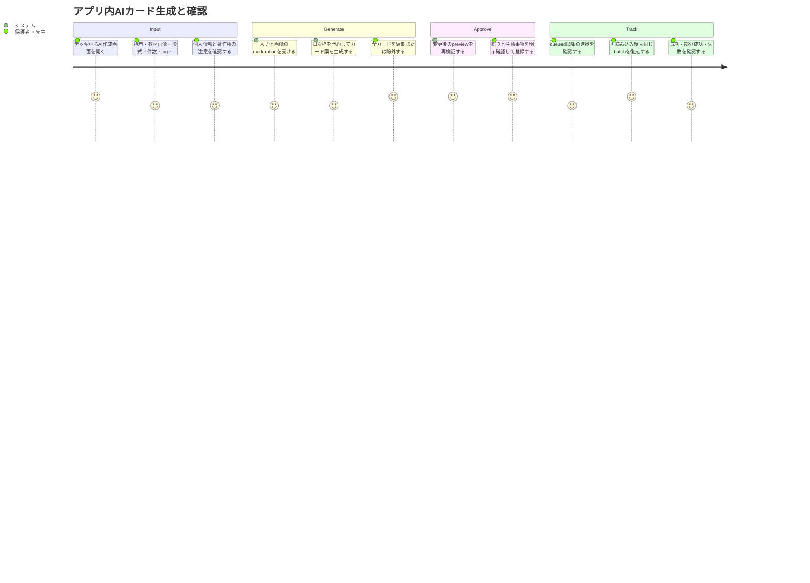
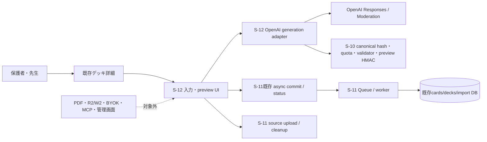

# 要件定義書: アプリ内OpenAIカード生成UI

## 1. 概要

### 1行要約

保護者・先生を想定したログインユーザーが、テキストまたは教材画像からOpenAIでR1/W1カード案を生成し、全件を編集・除外・確認してから既存の安全なimport基盤へ登録できる導線を提供する。

### 背景とユーザー価値

S-10は所有権、正規化、preview HMAC、quota、冪等commitを、S-11はsource画像の安全な一時保存・清掃と非同期Queue/statusを提供済みである。しかし、アプリ内で入力からOpenAI生成、確認、commit、処理完了までをつなぐ画面と生成adapterは存在しない。本ストーリーは既存基盤を置換せず、保護者・先生がAI出力の誤りや権利・個人情報リスクを確認したうえで登録するユーザー境界を追加する。

### プライマリーユーザー

- 保護者・先生を想定したログインユーザー
- MVPでは専用ロールがないため、既存仕様どおり全ログインユーザー

### ユーザーストーリー

```text
As a logged-in parent or teacher
I want to generate editable R1/W1 drafts from instructions or teaching-material images and approve them before import
So that I can safely add practice cards tailored to a child's needs
```

### 主要ユースケース

1. 保護者がテキストで苦手な漢字や学年を指示し、R1またはW1のカード案を作る。
2. 先生が教材画像をsourceとして添付し、`both`で表裏を交換したR1/W1ペアを作る。
3. 大人が生成された全カードを確認し、誤りを編集し、不要なカードを除外してから登録する。
4. 登録後に画面を再読み込みし、同じbatchの処理状況と部分成功・失敗を確認する。
5. 運用者がfeature flagを無効化し、新規生成を停止しながら既存カードと処理状況を保持する。

### ステークホルダー

| ステークホルダー | 関心事 |
|---|---|
| 保護者・先生 | 少ない手間でカード案を作り、誤り・個人情報・著作権を確認して安全に登録できること |
| 学習者 | 大人が確認した本人用カードで、既存学習フローを変えずに学べること |
| 運用者 | provider障害や費用リスク時に新規生成を止め、既存データと処理状況を失わないこと |
| 開発・QA | S-10/S-11の安全契約を再利用し、受入条件を自動検証できること |

## 2. 規模とドキュメント判定

- タスクタイプ: `feature`
- 規模: **large**
- 推定変更ファイル数: **18〜24ファイル**（実装・test・設定。設計文書を除く）
- 影響レイヤー: Next.js page/UI、Route Handler、OpenAI provider adapter、共有import domain、Supabase RPC/Storage連携、環境設定、unit/integration/E2E test
- 要件定義書: **必須**（モード: `create`。新機能かつ6ファイル以上）
- ADR: **必須**（外部API導入、3段階以上のデータフロー、複数非同期状態、moderation/refusal/error契約）
- Design Doc: **必須**（大規模変更、既存S-10/S-11との統合点が複数）
- 作業計画書: **必須**（大規模変更）

## 3. スコープと優先順位

### Must

1. デッキ詳細にfeature flag連動の「AIでカードを作る」導線を追加する。
2. `/decks/[deckId]/ai/new`で指示、source画像、生成形式、tag、illustration方式、展開後希望カード数を入力できる。
3. OpenAI Responses APIとStructured Outputsを利用し、入力テキスト・source画像・出力カードをmoderationする。
4. OpenAI呼出し直前に、S-10のprovider usage予約へ展開後`requestedCardCount`を1〜50として原子的に予約する。
5. 生成案を全件表示し、編集・除外・再previewできる。commit対象は1〜50件でなければならない。
6. 誤り確認、個人情報、著作権の警告を表示し、ユーザーの明示確認なしではcommitできない。
7. S-10のcanonical request、validator、import hash、preview HMACを使い、S-11のasync commit/statusへ接続する。
8. queued以降は`batchId`でpollし、再読み込み後も同じbatchを復元する。
9. source画像を正常・拒否・失敗のいずれでも処理終了後に削除し、削除失敗・異常終了はS-11の24時間清掃へ残す。
10. `AI_CARD_IMPORT_ENABLED=false`で新規作成導線と作成操作を停止し、既存カードを変更しない。
11. 360px幅、キーボード操作、label/error関連付けを満たす。

### Should

- 30秒以上継続する処理には「処理中」と再取得導線を表示する。
- カード単位のエラーは安全な既存error codeを日本語表示へ写像し、raw provider応答を表示しない。
- 再読み込み復元には`batchId`と対象deck IDだけを必要最小限として永続化し、指示、生成途中のdraft、card本文、secret、source画像bytes、preview tokenを永続ブラウザ保存しない。

### Could

- ユーザーが除外した件数と最終commit件数を、本文を含まない運用メトリクスとして記録する。
- 再生成時に前回の入力条件を復元する。

### Won't / Out of Scope

- PDF入力
- R2/W2、選択問題、自由記述問題、一般問題形式
- BYOK、クライアントへのOpenAI API key露出
- 確認なし登録、自動commit
- Remote MCP、OAuth、AIカード管理一覧
- S-10のDB/RLS/import contractまたはS-11のQueue/worker/cleanup architectureの置換・再構築
- 既存Gemini illustration clientの削除・置換

### MVP / Future境界

| 領域 | MVP（S-12） | Future（S-12対象外） |
|---|---|---|
| 入力 | テキスト、PNG/JPEG/WebP source画像 | PDF、文書一括取込、外部URL |
| カード形式 | R1、W1、both | R2/W2、一般問題形式 |
| 確認 | 全件preview、編集、除外、明示確認 | 自動承認、確認なし登録、共同レビュー |
| provider | サーバー管理のOpenAI設定 | BYOK、ユーザー別provider選択 |
| 処理状況 | poll、reload復元、partial表示 | push通知、リアルタイム配信 |
| 管理 | 対象deckへの新規登録 | AIカード一覧・編集・削除・batch undo UI |

## 4. 決定済み機能要件

### 4.1 導線・認可・対象deck

- 導線は既存デッキ詳細に表示し、対象URLを`/decks/{deckId}/ai/new`とする。
- 未認証ユーザーは既存auth境界に従い利用できない。
- 自分が所有しない、または存在しないdeckは既存の存在秘匿方針に従い404相当とする。
- 生成・preview・commitの対象deckはURLの`deckId`で固定し、画面入力から別deckへ差し替えられない。
- `AI_CARD_IMPORT_ENABLED=false`では導線を非表示にし、新規作成pageと生成endpointは404相当、新規commit操作はdisabledとする。既に作成済みのカードを削除せず、既存batchのstatus参照は復旧・監査のため維持する。

### 4.2 入力フォーム

入力項目は次を必須契約とする。

| 項目 | 要件 |
|---|---|
| 指示 | Unicode scalar text。空白正規化後1文字以上。上限はDesign DocでOpenAI request上限とUI可用性を踏まえ固定する |
| source画像 | 任意、0〜5枚、各10MiB以下、合計50MiB以下、PNG/JPEG/WebP |
| 生成形式 | `R1` / `W1` / `both`。既定`both` |
| requestedCardCount | **R1/W1展開後**1〜50の整数 |
| tag | 各生成cardへ付与。S-10の0〜10件、正規化後各1〜30文字を使用 |
| illustration方式 | `none` / `upload` / `ai`。S-10の既存image unionへ写像 |

- `both`では1つのconceptから表裏が交換されたR1とW1を生成する。
- `both`の`requestedCardCount`は偶数だけを許可する。concept数は`requestedCardCount / 2`とする。
- `R1`または`W1`ではconcept数と`requestedCardCount`が一致する。
- R1は漢字側がfront、W1は漢字側がbackで、漢字側に最低1文字の漢字を含む。
- source画像は教材内容の解析用であり、カード用illustrationとは別入力として扱う。ユーザーが明示的にillustrationへ選択しない限りsource画像をカード画像として保存しない。
- illustration方式`upload`を選ぶ場合は、source画像とは別にカード用illustrationを明示選択し、commit前にS-10/S-11の既存upload契約を満たす必要がある。`both`のR1/W1ペアは同一conceptのillustrationを共有する。
- source画像upload・magic/MIME/decode/resource検証・metadata除去はS-11のprepare/complete契約を再利用する。外部URL入力を許可しない。

### 4.3 生成前検証・moderation・quota予約

provider呼出しまでの順序を次で固定する。

1. 認証、feature flag、deck所有権、入力shape、件数、tag、source所有権・ready状態を検証する。
2. 入力テキストをmoderationする。
3. source画像をimage moderationする。
4. S-10の`canonicalizeGenerationRequest` / `hashGenerationRequest`で、入力、model-independent options、`requestedCardCount`を固定する。
5. provider呼出し直前に、同一workflowのstable reservation keyでS-10 `reserve_provider_usage`の`card_generation`を予約する。
6. 予約成功後にOpenAI Responses APIを呼ぶ。

- provider呼出し前の入力不正、deck/source不正、moderation拒否ではcard生成枠を消費しない。
- 予約成功後は成功、refusal、Structured Outputs不一致、出力moderation拒否、provider failureのいずれでも枠を返却しない。
- 同一reservation key・同一generation hash・同一unitsの再送は二重消費せず、内容またはunitsが異なる再送は`CONFLICT`とする。
- 1ユーザー1日200カード、JST日付境界はS-10を正本とし、本ストーリーで別カウンタを作らない。

### 4.4 OpenAI生成契約

- server-onlyのOpenAI API keyと環境変数で指定したmodelを使用する。API key、Authorization、source bytes、raw provider responseをclientやlogへ露出しない。
- Responses APIへ、生成形式、展開後件数、R1/W1関係、文字数・漢字要件、tag・illustration選択に必要な情報を明示する。
- Structured Outputs schemaは、最終的にS-10 `ClientImportRequestInput`へ決定的に写像できる最小限のconcept draftを返す。
- Structured Outputsで期待schemaに一致しない応答を、通常のprovider failureやrefusalへ混同しない。
- providerが明示refusalを返した場合、生成失敗とは別のユーザー向けエラーとする。
- 出力card textもmoderationし、1件でも拒否対象ならpreview tokenを発行せず全体を拒否する。
- provider出力は信頼せず、S-10 validatorで展開後全件を再検証する。件数不足・件数超過、R1/W1不整合、重複、漢字なし、長さ超過をStructured outputの成功だけで受理しない。
- providerのpartial/incomplete応答をpreviewへ採用しない。Issueの「partial result」はcommit後のS-11 batch `partial`表示を意味する。
- moderationサービスが利用不能、応答不正、判定不能の場合はfail closedとし、preview tokenを発行しない。

### 4.5 出力mappingとpreview

- OpenAI concept draftをR1/W1へ展開し、`both`は同一`conceptId`、相互一致するfront/back、別`clientItemId`を持つ2件へ写像する。
- 展開後件数は`requestedCardCount`と完全一致し、1〜50件であることを要求する。
- tagとillustration方式はユーザー入力を正本とし、providerに所有権を与えない。
- provider出力からS-10 `validateImportRequest`を通した正規化済みrequestだけをpreviewへ返す。
- read-only preview検査でdeck所有権、owner内重複、upload状態を検証し、失敗時にcard、deck、batch、item、tag、usageを新たに作らない。ただしprovider開始済みquota予約は返却しない。
- `importRequestHash`はS-10 `hashImportRequest`で計算する。
- preview tokenはS-10 `signPreviewToken`を使用し、`userId`、card generationの`reservationKey`、`importRequestHash`、30分の期限を束縛する。
- preview responseはnormalized cards、警告、preview token、期限、reservation key、import hashを含み、raw provider responseを含まない。

### 4.6 編集・除外・警告確認

- preview画面では全cardのpattern、front、back、tag、illustration方式を確認できる。
- ユーザーはpreview前のdraft、およびpreview後のnormalized cardを編集・除外できる。
- preview後に1文字でも編集、tag/illustration変更、除外、順序・対象変更を行った場合、既存preview tokenを無効扱いにし、commit前に変更後requestでread-only previewとtoken再発行を必須とする。
- 全件除外はcommit不可とする。最終commit対象は1〜50件かつS-10 validatorを通る必要がある。
- preview画面には少なくとも次を常時表示する。
  - AIの出力には誤りがあり得るため、表・裏・読みを確認すること
  - 氏名、住所、連絡先など個人情報を入力・登録しないこと
  - 教材画像や生成内容の著作権・利用権限を確認すること
- 「全カードと上記注意事項を確認した」明示checkboxを必須とし、未確認時はcommit buttonをdisabledにする。server側も確認済み状態を要求し、client UIだけに依存しない。

### 4.7 commit・poll・再読み込み復元

- commitはS-11の既存`POST /api/ai/imports/commit`とS-10 preview token検証を再利用し、新しい並行import実装を作らない。
- commit payloadは最終preview対象request、preview token、import request hash、card reservation key、stable idempotency keyを送る。
- token署名不正、owner/reservation不一致、期限切れ、request hash不一致は401/拒否となり、batch、item、cardを作成しない。
- 正常commitは202と`{ batchId, status: "queued", statusUrl }`を返す。
- queued以降はS-11の既存`GET /api/ai/imports/status?batchId=...`をpollし、`queued / processing / completed / partial / failed / undone`を表示する。
- `partial`では成功件数と失敗件数、各itemのsafe error codeを表示し、成功済みcardを削除しない。
- `batchId`と対象deck IDは再読み込み復元に必要な最小状態として保持できる。復元時はserver statusを正本とし、保存済みdraftや表示状態を成功結果として信用しない。
- 別ownerのbatchは404相当とし、card本文、Storage path、raw provider errorをstatusへ追加しない。

### 4.8 source画像の終了処理

- source画像は生成入力としてのみ一時利用し、OpenAI成功、refusal、moderation拒否、Structured output不一致、provider failure、ユーザー取消の各終了経路で不要になった時点で削除を試みる。
- 即時削除に失敗した場合はS-11のdurable cleanup markerへ移し、作成から24時間到達後の最初のcleanup対象とする。
- 24時間未満、別owner、別のactive consumerが参照中のobjectを削除しない。
- cleanup処理・Storage lifecycleを本ストーリー用に再構築せず、S-11のservice-role RPCとprivate `ai-card-sources` bucketを利用する。

### 4.9 エラー表示契約

最低限、次を異なるUI状態・安全なcodeとして区別する。

| 分類 | 例 | UI要件 |
|---|---|---|
| Structured Outputs不一致 | schema/件数/R1-W1 mapping不正 | 「カード形式を確認できませんでした」相当。再試行可能 |
| refusal | modelの明示拒否 | 拒否として表示し、provider障害と混同しない |
| moderation | 入力text、source image、出力cardの拒否 | 対象段階を安全な一般表現で表示。生の判定詳細は出さない |
| provider failure | timeout、429、5xx、network、設定不正 | 一時/恒久/設定を安全に分類し、secretやraw本文を出さない |
| validation/import | S-10 validator、重複、deck、quota、token | 既存safe codeを日本語へ写像 |
| async item failure | S-11 `partial` / `failed` | 成功・失敗件数とitem別safe codeを表示 |

- Structured output mismatch、refusal、moderation、provider failureは同一の`INTERNAL_ERROR`へ潰さない。
- HTTP statusとerror codeの具体mappingはDesign Docで固定し、unit testの正本とする。
- ユーザー向けメッセージにOpenAI raw response、stack、SQL、token、source path、カード本文を含めない。

## 5. 成功基準

### 定量的指標

1. Issue #13のAC-01〜AC-08について、自動または明示的な検証手順の充足率が100%である。
2. `both`の正常ケースで相互交換されたR1/W1ペア生成率が100%、展開後51件以上の受付率が0%である。
3. Structured Outputs不一致、refusal、moderation、provider failureの4分類が、契約testですべて異なるsafe codeへ写像される。
4. token改ざん、別owner、期限切れ、reservation差し替え、内容差し替えの拒否率が100%で、batch/item/card/tag増分が0件である。
5. source画像を利用する全終了経路で即時削除を100%試行し、残存対象は作成24時間到達後の最初のcleanupで回収される。
6. 360px viewportの主要flowで横方向overflowが0px、キーボードのみで完了できない必須操作が0件である。
7. 追加test数がUnit 10件以上、Integration 6件以上、E2E 4件以上を満たし、`npm run check`が成功する。
8. feature flag無効時に新規作成導線・page・source prepare/complete・生成・新規app AI commitの成功件数が0件で、既存card件数とstatus参照成功件数に意図しない差分がない。

### 定性的指標

1. 保護者・先生が、AI出力は未確認の案であり大人の確認が必要だと画面上で理解できる。
2. エラー時に、拒否・安全上の停止・一時的障害・入力修正のどれに該当するかを、機密情報なしで判断できる。
3. 再読み込みや部分失敗後も、登録済みカードと未登録カードの状態を見失わない。

### 測定方法

- Unit/Integration/E2E test結果とACトレーサビリティを正本とする。
- 360pxおよびkeyboard flowはE2Eとaccessibility assertionで検証する。
- source cleanupは固定時刻のIntegration testで23:59:59保護と24:00:00対象化を検証する。
- rollbackはflag on/offのroute・導線・既存status/card snapshot差分で検証する。

## 6. 非機能要件

### セキュリティ・プライバシー

- OpenAI API key、Supabase service role key、preview HMAC secretはserver-only環境変数とし、typed env accessから取得する。
- source画像、instruction、generated card textをapplication log・analyticsへ記録しない。
- clientが送るowner ID、quota免除、provider/model、deck ownership判定を信用しない。
- moderationをclientのみで行わず、server境界で必ず実行する。
- preview tokenは30分で期限切れとし、内容変更時は再previewする。

### アクセシビリティ・レスポンシブ

- 360px viewportで横スクロールを発生させない。
- pointerなしで、入力、画像追加・削除、生成、card編集・除外、警告確認、commit、取消、status再取得を操作できる。
- すべての入力に可視labelまたは同等のaccessible nameを付与する。
- field errorは`aria-describedby`等で対応入力に関連付け、全体errorはlive regionまたはfocus移動で通知する。
- 非同期状態を文字情報でも示し、色やspinnerだけに依存しない。
- 対象browserはEpic契約どおり最新版と1つ前のChrome/Safari/Firefoxとする。

### 性能・信頼性

- OpenAI生成時間自体にはSLAを置かない。30秒以上は継続中表示と再取得/再試行導線を出す。
- commitはprovider/upload処理を含めず、S-11のp95 2秒以下契約を維持する。
- 二重click、response loss、再読み込みでもstable reservation/idempotency keyによりquotaとbatchを二重作成しない。
- provider、moderation、Storageの外部障害で既存デッキ・既存カードを変更しない。

### 保守性・回帰

- S-10 `schema.ts`、`canonical-request.ts`、`preview-token.ts`、`errors.ts`を拡張・再利用し、同義のvalidator/hash/tokenを複製しない。
- S-11 source prepare/complete、commit、status、cleanup契約を再利用する。
- 既存デッキURLと学習URL、SRS分類・出題順・評価間隔を変更しない。
- `npm run check`を成功させ、既存デッキ詳細・学習画面のtestを回帰確認する。

## 7. ユーザージャーニー



## 8. スコープ境界図



## 9. 受入条件（Issue #13正本）

### AC-01 テキスト・source画像生成

- テキストのみの入力と、S-11で検証済みのPNG/JPEG/WebP source画像を1枚以上含む入力の双方で、R1またはW1のpreviewを得られる。
- input text/source image/output card moderationを通過した場合だけpreview tokenが発行される。

### AC-02 both展開・50枚上限

- `both`でN conceptを要求すると、同一concept IDを共有しfront/backが相互交換されたR1/W1が2N枚生成される。
- `requestedCardCount`は展開後1〜50で検証し、`both`の奇数、0、51以上をprovider呼出し・quota予約前に拒否する。
- provider結果の展開後件数が要求値と一致しない場合もpreviewを発行しない。

### AC-03 エラー分離

- Structured Outputs不一致、refusal、text/image/output moderation拒否、provider failureを独立したsafe error codeとメッセージで表示する。
- 各エラーでraw provider response、secret、source bytes、カード本文をlogまたはresponseへ含めない。

### AC-04 編集・除外・明示確認

- preview前後にcardを編集・除外でき、変更後は再previewが要求される。
- 0件ではcommitできず、1〜50件の全cardがS-10 validatorを通る。
- 誤り・個人情報・著作権の確認checkboxが未選択の場合、clientとserverの両方でcommitできない。

### AC-05 preview token防御

- HMAC改ざん、別owner、期限切れ、reservation key差し替え、card本文/tag/illustration/件数差し替えの各ケースを拒否する。
- 拒否時にbatch、item、card、tagの増分は0件で、既に予約済みのprovider利用枠は返却しない。

### AC-06 source画像削除

- 正常生成、refusal、moderation拒否、Structured output不一致、provider failure、ユーザー取消の終了後にsource削除を試みる。
- 即時削除失敗・異常終了のsourceは作成24時間未満では保持され、24時間到達後の最初のS-11 cleanupで削除される。
- active consumer、別owner objectは削除されない。

### AC-07 UI・アクセシビリティ

- 360px viewportで横スクロールがなく、主要操作をキーボードだけで完了できる。
- 全入力にaccessible nameがあり、field errorが対応入力へ関連付けられ、非同期/error状態が文字またはlive regionで通知される。

### AC-08 品質・回帰・rollback

- `frontend`で`npm run check`が成功する。
- 既存デッキ詳細と学習画面のURL・主要操作に回帰がない。
- `AI_CARD_IMPORT_ENABLED=false`で導線と新規作成page/source prepare・complete/generationを利用できず、新規commit操作が停止する一方、既存カードと既存batch status参照は保持される。

## 10. テスト要件

### Unit tests（10件以上）

最低限、次を独立に検証する。

1. text-only Responses API payload。
2. source image付きResponses API payload。
3. R1 output mapping。
4. W1 output mapping。
5. bothのpair展開・相互交換・concept共有。
6. 展開後0/51超、both奇数、要求件数不一致の拒否。
7. Structured Outputs schema mismatch mapping。
8. refusal mapping。
9. text/image/output moderation mapping。
10. provider timeout/429/5xx/config error mapping。
11. quota reservationの同一key再送と別内容conflict。
12. 編集・除外後のhash/token無効化。

### Integration tests（6件以上）

最低限、次を独立に検証する。

1. text generate → normalized preview → confirmation → async commit。
2. source upload/complete → image moderation → generate → source release → commit。
3. input moderation拒否でprovider/quota/batch副作用0。
4. output moderation拒否でpreview/batch副作用0、開始済みquota保持。
5. token改ざん・期限切れ・内容差し替えのcommit拒否。
6. provider failure後のsource cleanup marker。
7. owner/deck/source/batch隔離。

### E2E tests（4件以上）

1. text-onlyで生成、編集、確認、登録完了。
2. source画像付きで生成、除外、確認、登録完了。
3. queued/processing中のreloadから`batchId`で復元。
4. batch `partial`で成功cardと失敗itemが区別表示される。
5. 360px・keyboard・label/error関連付けの主要flow。

### 回帰確認

- 既存デッキ詳細から学習開始できる。
- 既存学習画面の表示・回答・評価が変わらない。
- S-10/S-11のunit/integration契約を変更した場合は該当suiteも実行する。

## 11. 既存基盤の再利用境界

| 要件 | 再利用する正本 | S-12で追加する責務 |
|---|---|---|
| R1/W1 schema・正規化・50件 | `frontend/src/lib/ai-import/schema.ts` | OpenAI conceptから既存inputへのmapping |
| generation/import hash | `canonical-request.ts` | UI入力optionのcanonical object定義 |
| provider開始時quota | S-10 `reserve_provider_usage` | app AI generation adapterからの呼出し |
| preview token | `preview-token.ts` | read-only preview後の発行とUI lifecycle |
| safe import errors | `errors.ts` | OpenAI生成固有errorの追加mapping |
| source画像 | S-11 prepare/complete、private bucket、cleanup RPC | generation inputとしての参照と終了時release |
| commit | `POST /api/ai/imports/commit` | 確認済み最終requestの送信 |
| status/poll | `GET /api/ai/imports/status`、`async-contract.ts` | UI表示、poll、reload復元 |
| Queue/worker/partial | S-11 | UIでの状態・item結果表示のみ |

禁止事項:

- 既存validator、hash、HMAC、quota table/counter、commit、status、source cleanupの同義実装を新設しない。
- 既存S-10/S-11 migrationを編集して履歴を書き換えない。必要なDB拡張があればforward migrationだけを用いる。
- source解析を同期commit/workerへ混在させず、card生成previewとasync importの責務を分離する。

## 12. 依存関係・制約

### 依存関係

- S-10 AIカード登録基盤: schema、normalization、hash、preview HMAC、quota reservation、RLS、commit primitive
- S-11 非同期Queue・画像処理: source upload/validation/cleanup、async commit/status、partial result
- 既存Supabase Auth、deck ownership、private Storage
- OpenAI Responses API、Structured Outputs、Moderation API

### 技術制約

- Next.js App Router / Route Handlerと既存Supabase SSR authを使用する。
- OpenAI model名はserver環境変数で変更可能にする。
- server-only secretは既存`env.ts`のtyped access経由とし、`process.env`直接参照を分散させない。
- OpenAI APIの不確実な仕様は実装前に公式documentationで確認し、Design Docでrequest/response/error contractを固定する。

## 13. リスクと軽減策

| リスク | 影響度 | 発生確率 | 軽減策 |
|---|---:|---:|---|
| preview後編集とtoken hashが不一致 | 高 | 高 | 編集・除外でtokenを破棄し、必ず再previewする |
| requestedCardCountとboth concept数が曖昧 | 高 | 中 | 展開後件数を正本とし、bothは偶数限定 |
| source画像が終了後も残る | 高 | 中 | finally相当の即時releaseとS-11 durable 24h cleanupを併用 |
| moderationの段階・エラーが混同される | 中 | 中 | input text/image/outputを別stage codeでtestする |
| OpenAI refusal/schema/error形式変更 | 高 | 中 | provider adapterでstrict parseし、raw値をdomainへ漏らさない |
| quota予約後にproviderが失敗し利用者が混乱 | 中 | 中 | 「開始時に消費」の注意表示と冪等retryを明示する |
| browser保存からPII/tokenが漏れる | 高 | 低 | source bytes/tokenを永続保存せず、batchIdだけを最小保持する |
| rollback時に処理中batchを見失う | 高 | 低 | 新規作成だけ停止しstatus GETを維持する |
| S-10/S-11との重複実装・契約乖離 | 高 | 中 | Design Docに統合点・再利用matrix・interface testを必須化する |
| S-11のhosted verification未完了状態に依存する | 高 | 中 | 実装開始前にS-11の必要migration/RPC/route/cleanup gateが利用可能であることを確認し、未成立ならS-12で再構築せず前提blockerとして扱う |

## 14. 前提・解決済みの曖昧さ

`--auto`実行のため、Issue本文だけでは複数解釈がある点を次で固定する。

1. ローカルstory IDは既存S-10/S-11に続く`S-12`とし、GitHub issue番号とは一致させない。
2. `requestedCardCount`は常に展開後件数であり、`both`は偶数だけを許可する。
3. 「preview前後で編集」は、生成draftの編集とnormalized preview後の編集の双方を意味する。preview後編集はcommit直結せず、再previewと新tokenを必須とする。
4. IssueのE2E「partial result」はOpenAIの不完全出力採用ではなく、S-11 async batchの一部成功`partial`を意味する。
5. source画像は教材解析用で、card illustrationとは別概念である。明示選択なしに保存画像へ転用しない。
6. rollbackは新規生成・commitを停止するが、既存batch status取得を残す。これにより処理中/完了結果と既存カードを保持する。
7. Issue commentは実装開始の通知のみで、本文を変更する追加要件はない。

## 15. Rollback要件

- `AI_CARD_IMPORT_ENABLED=false`を新規作成停止の正本とする。
- flag無効時はデッキ詳細の導線を表示せず、`/decks/[deckId]/ai/new`と生成endpointを404相当にする。
- flag無効時はS-12からの新規source prepare/completeをserver側で拒否し、未使用の一時objectを新たに作らない。
- flag無効時は新規`app_ai` commitをserver側で拒否し、clientのdisabled表示だけに依存しない。
- flag切替前に生成済みのsource画像は即時削除またはS-11の24時間cleanupへ収束させる。
- flag無効化によって既存カード、deck関連、学習状態、batch/item結果を削除・巻き戻ししない。
- 処理中またはterminalな既存batchのstatus取得は維持し、再読み込み後も結果確認を可能にする。
- rollback検証はflag切替前後の既存card/batch snapshot、新規route応答、新規quota/batch増分で行う。

## 16. 未決事項（Design Docで確定）

次はスコープやユーザー価値を変更しない技術的未決事項であり、要件フェーズのblockerではない。

1. 指示テキストの最大文字数と、OpenAIへ送る総入力上限。
2. text入力、image入力、Responses API、Structured Outputsを同時にサポートするOpenAI Responses model、およびmoderation model、image detail、timeoutの環境変数名と許容値。
3. Structured Outputs schema、refusal/incomplete、moderation、provider errorの厳密なrequest/response parseとHTTP/safe code mapping。
4. preview後のcard用illustration uploadをconcept単位で選択・共有する具体UI。
5. source即時削除とcleanup marker更新に利用するS-11 RPCの組合せ、および削除応答喪失時のreconciliation。
6. `batchId`の安全なbrowser保存先、poll間隔、停止条件、複数tab時の重複poll抑制。
7. feature flag未設定・不正値時のfail-safe既定値と、既存status routeを維持する判定境界。
8. S-11のsource cleanupが23:59:59保護、24:00:00対象化を含む必要契約とhosted環境で整合していることの前提確認。

## 17. ハード停止判定

- 要件分析時点の続行不能要因: **なし**
- 設計時の必須確認事項: OpenAI公式仕様に基づくResponses Structured Outputs、image input、moderation request/response、refusal/incomplete/errorの厳密な契約
- 上記が公式仕様または現行runtimeで成立しない場合は推測実装せず、`blocked`としてarchitecture/要件の再判断を要求する。

## 18. 要件トレーサビリティ

| Issue #13要求 | 本書 |
|---|---|
| デッキ詳細導線 | 4.1, AC-08 |
| 入力画面 | 4.2, AC-01, AC-02 |
| Responses + Structured Outputs + moderation | 4.3, 4.4, AC-03 |
| 展開後requestedCardCount・開始時予約 | 4.2, 4.3, AC-02 |
| preview編集・除外・確認commit | 4.5〜4.7, AC-04, AC-05 |
| batchId poll・reload復元 | 4.7, AC-08 |
| 誤り・PII・著作権注意 | 4.6, AC-04 |
| source終了削除・24h cleanup | 4.8, AC-06 |
| 360px・keyboard・label/error | 6, AC-07 |
| unit +10 / integration +6 / E2E +4 | 10 |
| feature flag rollback | 4.1, AC-08, 15 |
| PDF/R2/W2/BYOK/無確認登録対象外 | 3 |

## 19. 変更履歴

| Version | Date | Changes |
|---|---|---|
| 1.0.0 | 2026-07-18 | GitHub Issue #13、親Epic #9、S-10/S-11実装・設計契約を統合して初版作成 |
| 1.1.0 | 2026-07-18 | updateモードで主要ユースケース・ステークホルダー、MVP/Future境界、測定可能な成功基準、illustration upload条件、fail-closed moderation、専用Rollback要件、Design Docへの未決事項を追加 |
| 1.1.1 | 2026-07-18 | 第三者レビューでreload永続化範囲をbatch/deck IDへ統一し、feature flagのsource endpoint停止、OpenAI model能力条件、S-11 verification前提を明確化 |
