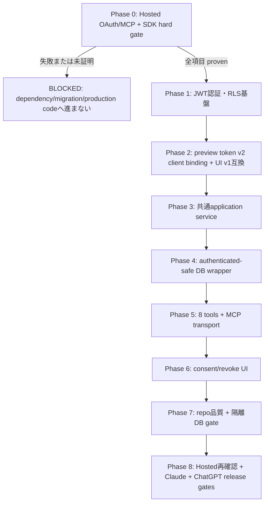
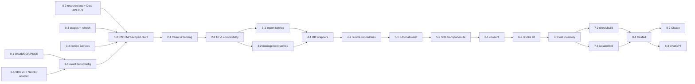

# S-14 実装計画: Supabase OAuth・Remote MCP

## 1. 計画の位置づけ

この `plan.md` を S-14 実装の単一情報源とする。`story.md`、`requirements.md`、`design.md`、ADR-011 を正本とし、既存 S-10〜S-13 の共有 schema、preview HMAC、async commit/status、AI private card 管理・undo、RLS、stable error code を変更せず再利用する。

この計画作成時点では Phase 0 を含む実装・検証を一切実行しない。production code、dependency、lockfile、migration、Hosted Supabase 設定、Claude/ChatGPT 接続は変更しない。実装時も `tasks/` や個別 task file を作らず、本ファイルの checkbox と Phase 0 証跡欄だけを更新する。

### スコープ外

- custom OAuth scope、client credentials、public card、R2/W2、一般問題形式
- アプリ内 OpenAI 生成、Queue worker、Storage lifecycle、SRS の再実装
- OAuth facade、token exchange、別 Authorization Server、MCP SDK v2 beta
- Playwright、`test:e2e`、新規 package script、検証専用 dependency の追加
- production deploy、remote migration 適用、ship、merge、issue close

## 2. 実行原則と hard-stop 規則

1. Phase 0 は **Hosted Supabase OAuth/MCP compatibility HARD GATE** であり、全項目が一次資料と実 Hosted 挙動で証明されるまで Phase 1 以降へ進まない。
2. Phase 0 のいずれかが失敗、未実施、非公式情報だけ、または Supabase の undocumented internal auth table 依存となる場合、`status: blocked` と本ファイルの証跡欄へ記録して停止する。dependency 追加、lockfile 変更、migration、production 実装は行わない。
3. SDK は実装開始日に公式 MCP TypeScript SDK v1 branch/release と公式 package registry を再確認し、stable v1 の exact version と全 peer dependency の exact 解決値を Phase 0 へ記録する。計画作成時点の version を推測して固定しない。v2 beta へ移行しない。
4. actor は検証済み Bearer JWT の `sub` / DB の `auth.uid()` からだけ導出する。MCP の owner CRUD に service role を使わず、JWT-scoped client、RLS、authenticated-safe wrapper を通す。
5. standard scope `openid email profile` は identity/consent contract であり、card 操作権限そのものではない。8 tool allowlist、verified `client_id`、active session/grant、JWT actor、RLS を併用する。
6. repo gate、隔離 DB gate、Hosted gate、Claude gate、ChatGPT gateを別々に判定する。未実施 gate を他の成功へ合算しない。

## 3. フェーズ構成

## 4. Phase 0: Hosted Supabase OAuth/MCP compatibility HARD GATE

**対象:** REQ-OAUTH-01、REQ-CONSENT-01〜02、REQ-REVOKE-01、REQ-MCP-01、REQ-AUTH-01〜02、NFR-SEC-01、NFR-COMPAT-01、Design AC-01〜06・13・15・17〜19・21、ADR-011 §1〜3

**先行依存:** なし。disposable/preview Hosted Supabase project、合成ユーザー/データ、公開 HTTPS preview origin を使用する。実ユーザーデータ、card 本文、token/code/verifier/secret/cookie/署名鍵を証跡へ保存しない。

### Task 0-1: Hosted OAuth discovery、DCR、S256 PKCE、consent を証明する

**実装対象:** production file なし。Hosted dashboard/API と standards-based disposable test clientだけを使用し、sanitized 結果を本 Phase の証跡欄へ記録する。

- [x] Supabase 公式一次資料で OAuth Server、authorization server metadata、DCR、Authorization Code + S256 PKCE、custom consent approve/deny の実装開始日時点 contract を再確認した。
- [x] metadata から authorization、token、registration、JWKS endpointを解決した。
- [x] DCR 後に Authorization Code + S256 PKCE が成功し、approve は code/token を発行、deny は grant/token 副作用 0 だった。
- [x] consent に使う client name、redirect URI、scope が Supabase の検証済み authorization details と一致し、query/body 値を信用しない経路を確認した。
- [x] DCR 無効化後は新規 client registration が拒否され、既存 grant revoke とは別の運用境界であることを確認した。

**完了条件:** 上記が documented/supported boundary で再現でき、REQ-OAUTH-01、REQ-CONSENT-01〜02 の実現可能性が proven。

### Task 0-2: RFC 8707 resource/audience と Data API RLS の両立を証明する

**canonical resource:** `https://<preview-origin>/api/mcp`

- [x] authorization request と token request の両方へ同一 RFC 8707 `resource` を送った。default 発行では audience へ反映されないことを確認後、公式 Custom Access Token Hook で canonical resource を発行 audience に設定した。
- [x] access token の `alg` が ES256 で、exact `iss`、UUID `sub`、`role=authenticated`、`client_id`、`session_id`を確認した。hook 適用後も claim contract は維持された。
- [x] MCP resource server が string `aud` の canonical audience を exact 検証できることを確認した。
- [x] 同じ access token を Supabase Data API/RPC へ伝播し、authenticated role、`auth.uid()`、owner RLS が成立し、other user/anon が拒否されることを確認した。
- [x] 公式 Custom Access Token Hook で string audience と array audience を disposable 設定として別々に実測した。双方で Data API/RPC の authenticated owner RLS が成立し、exact resource validation に適する string canonical audience を採用した。

**完了条件:** MCP exact audience と Data API authenticated/RLS が同一 token で両立する。片方だけの成功は不合格。

### Task 0-3: standard scope refresh と request 単位の grant/scope source を証明する

- [x] authorization で exact `openid email profile` だけを要求し、`offline_access`、`phone`、custom/unknown scope を追加していない。
- [x] standard scope だけで refresh/reconnect に必要な token flow が成立した。
- [x] request ごとの granted scope を `client_id` が一致する active `getUserGrants` 相当から取得できた。
- [x] active grant の scope source が exact 3 scopes を証明し、一般的な JWT `scope` claim や内部 auth table shape を仮定していない。refresh response 自体は exact scope を返さなかったため、判定元には使用しない。

**完了条件:** REQ-CONSENT-02、Design AC-06・18 の scope contract と Claude/ChatGPT refresh 前提が proven。

### Task 0-4: grant revoke 後の old access token liveness を証明する

- [x] supported revoke API で対象 client grant を解除し、session/refresh token が失効した。
- [x] revoke 前に発行された未期限切れ access tokenを次の requestで再利用し、request 単位の `getUser` / active grant liveness 検査により401相当で拒否できた。
- [x] JWKS/署名検証成功だけでは許可せず、positive liveness result を request 間 cache しない方式を supported API で構成できた。
- [x] deny、revoke、expired/invalid token をtool dispatch/DB mutation前に同形拒否できる境界を確認した。stale JWT単体はData APIへ到達できるため、request単位liveness検査が必須である。

**完了条件:** REQ-REVOKE-01、REQ-AUTH-01、Design AC-04・13 の「旧 access token の次 request 401」が proven。

### Task 0-5: official MCP SDK stable v1 と Next.js 14 Web adapter を証明する

**実装対象:** disposable branch/worktree の最小 spikeのみ。main implementation worktree の `frontend/package.json`、lockfile、production route は変更しない。

- [x] 実装開始日に MCP 公式 TypeScript SDK v1 の公式 release/branch と公式 package registryを確認し、production-ready stable v1であることを確認した。
- [x] candidate SDK の exact version、registry dist-tag/source、公開日、peer dependency rangeを証跡欄へ記録した。
- [x] peer dependencyを公式 metadataから列挙し、現在の Next.js 14 / React 18 / TypeScript と整合する exact 解決値を一時 spike lockfileで確認した。
- [x] v2 beta、pre-release、非公式 forkを候補から除外した。
- [x] 実 package exportを読み、Web `Request`/`Response`、header/body/stream/abort/error semanticsを扱う最小 Route Handler adapterを作った。特定 class や `enableJsonResponse` の存在を仮定していない。
- [x] disposable spike で既存 scriptだけを使い、対象 Vitest、`cd frontend && npm run typecheck`、`cd frontend && npm run build` が成功した。
- [x] Web Standard transportを直接利用でき、Express-only bridgeは不要だった。

**完了条件:** exact stable v1 + peer dependency pin と Next.js 14 adapter が compile/test/build で proven。合格後だけ Phase 1 で `frontend/package.json` と `frontend/package-lock.json` へ同じ exact versionを追加できる。

### Phase 0 証跡記録（実装開始時に本欄だけへ追記）

- [x] 実施日時 / git SHA / Hosted projectの非機密識別子 / preview origin: 2026-07-19 JST / `81c3dc1` / `KANJI-EVERYDAY-staging` (`wolwkdvvosfxgxoosgjw`) / `https://s14-oauth-preview-lftzema8z-ardama.vercel.app`
- [x] 参照した Supabase・MCP 公式一次資料と確認日: 2026-07-19。Supabase OAuth Server / OAuth flows / MCP authentication / sessions / revokeGrant / JWT docs、MCP Authorization 2025-11-25、MCP TypeScript SDK v1.xとnpm registry。
- [x] RFC 8707 authorization/token resource と発行 audience の sanitized 結果: 両requestへ同一canonical resourceを送信。default `aud=authenticated` の不成立を記録後、公式 hook の string `aud=canonical-resource` と array `aud=[authenticated, canonical-resource]` を別々に発行・検証した。retained 構成は exact resource validation が可能な string 形式。
- [x] Data API/RPC authenticated role・owner/other/anon RLS 結果: string/array の両 hook 構成で同tokenによるowner成功、other/anon拒否。retained string 構成で MCP exact audience と Data API authenticated owner RLS が両立した。
- [x] exact standard scopes、refresh、per-request grant/scope source の結果: exact `openid email profile`でrefresh成功。active `getUserGrants`相当はexact 3 scopes、refresh response自体はexact scopeを返さなかった。
- [x] revoke API、old access token の次 request、観測した401の結果: revoke後は`getUser`、active grant取得、refreshが拒否され、MCP request単位liveness境界で401にできた。stale JWTのData API単独利用は有効だった。
- [x] signing algorithm、issuer、claim shape の sanitized 結果: ES256、exact Hosted issuer、UUID `sub`、`role=authenticated`、non-empty `client_id` / `session_id`。secret/token/code/verifier/cookie本文は保存していない。
- [x] SDK package名 / exact stable v1 version / registry source / peer ranges / exact peer解決値: npm `latest`の`@modelcontextprotocol/sdk@1.29.0`（2026-03-30公開）、peer `zod ^3.25 || ^4.0` / `@cfworker/json-schema ^4.1.1`、exact `zod@4.4.3` / `@cfworker/json-schema@4.1.1`。
- [x] Next.js 14 adapter export/API、対象 Vitest、typecheck、build の結果: `@modelcontextprotocol/sdk/server/webStandardStreamableHttp.js`の`WebStandardStreamableHTTPServerTransport`。一時spikeでVitest 4/4、typecheck、Next.js 14.2.35 build成功。
- [x] gate status: `proven`。default audience の blocked 判定を、公式 Custom Access Token Hook remediation で解消した。string/array を別々に Hosted 実測し、retained string canonical audience で exact audience、ES256/issuer/actor/client/session、standard scopes、refresh、active grant source、revoke/liveness、Data API owner RLS を同時に確認した。Vercel は Preview のみ。Supabase OAuth/DCR/path/Site URL/allow list と hook は proven staging 構成を保持し、baseline は復元していない。

### Phase 0 判定

- [x] Task 0-1〜0-5がすべて `proven`。Phase 1へ進める。
- [ ] 1項目でも failed/unproven の場合は `blocked` を記録し、production dependency、migration、production codeへ進まず停止した。

## 5. Phase 1: JWT認証・RLS基盤

**対象:** REQ-AUTH-01〜02、REQ-FLAG-01、REQ-MCP-01、NFR-SEC-01、Design AC-02・04〜06・14〜16・18

**先行依存:** Phase 0 全項目 proven。特に audience/Data API RLS、liveness/scope source、SDK adapter が確定済みであること。

### Task 1-1: exact dependency pin と MCP環境設定を追加する

**変更 file:**

- `frontend/package.json`
- `frontend/package-lock.json`
- `frontend/src/lib/env.ts`
- `frontend/src/lib/env.test.ts`
- `frontend/src/lib/mcp/metadata.ts`
- `frontend/src/lib/mcp/metadata.test.ts`

- [x] Phase 0で proven となった official SDK stable v1 と peer dependencyだけを exact pinし、lockfileの解決値を証跡と一致させた。
- [x] `MCP_ENABLED` は trim後 exact `true` だけ有効とし、canonical public origin/resource、Supabase OAuth issuer、allowed Originを server-only でstrict parseした。
- [x] public originを forwarded headerから組み立てず、PRM、challenge、audience validationが同じ canonical configを使う。
- [x] v2 beta、floating range、不要な dependency、package scriptを追加していない。

**検証:** `cd frontend && npm run test -- src/lib/env.test.ts src/lib/mcp/metadata.test.ts`。exact true/fail-closed、invalid URL/Origin、canonical resource、exact 3 scopesが成功する。

### Task 1-2: request単位Bearer JWT・session/grant検証を実装する

**変更 file:**

- `frontend/src/lib/mcp/auth.ts`
- `frontend/src/lib/mcp/auth.test.ts`
- `frontend/src/lib/supabase/server.ts`
- `frontend/src/lib/supabase/server.test.ts`

- [x] Authorization Bearer headerだけをstrict parseし、query/body/cookie、複数header、空tokenを拒否した。
- [x] JWKS/getClaims相当で署名、RS256/ES256 allowlist、exact issuer/audience、`exp`/`nbf`、authenticated role、UUID `sub`、non-empty `client_id`/`session_id`を各requestで検証した。
- [x] Phase 0で proven となった supported session/grant liveness と exact scope sourceを毎request照合し、positive auth/livenessをcacheしていない。
- [x] `McpActorContext`へraw token/claimsを保存せず、owner/client/sourceをtool inputから受理していない。
- [x] anon/publishable key + accessToken callback、persist/refresh/cookie fallback/service roleなしの `createJwtScopedClient`を追加した。
- [x] auth failureはdispatch前の同形401 + exact Bearer challengeで、DB mutation 0、理由・token・claimを反射しない。

**検証:** `cd frontend && npm run test -- src/lib/mcp/auth.test.ts src/lib/supabase/server.test.ts`。RS/ES success、HS/none/unknown kid、issuer/audience/time/role/sub/client/session/scope/liveness failure、JWKS rotation、owner contextを確認する。

**Phase完了条件:** JWT cryptographic validation、request単位 liveness、JWT-scoped clientがDB/application serviceより先に確立し、service role代替がない。

## 6. Phase 2: preview token v2 client binding と既存UI token v1互換

**対象:** REQ-SERVICE-01、REQ-TOOL-03〜04、NFR-SEC-01、NFR-REL-01、Design AC-08・09・20

**先行依存:** Phase 1のverified `userId` / `clientId` actor contract。

### Task 2-1: remote preview token v2をclientへ束縛する

**変更 file:**

- `frontend/src/lib/ai-import/preview-token.ts`
- `frontend/src/lib/ai-import/preview-token.test.ts`
- `frontend/src/lib/ai-import/preview-service.ts`
- `frontend/src/lib/ai-import/preview-service.test.ts`
- `frontend/src/lib/ai-import/canonical-request.ts`（既存canonical意味を変えず必要時のみ拡張）

- [x] remote v2 HMAC payloadをdomain separator、owner、verified `client_id`、normalized canonical request/hash、card reservation key、expiryへ結合し、commit RPCでもDB-local `app.ai_preview_hmac_secret` GUCで再検証した。
- [x] cross-client、cross-owner、request/hash差替え、期限切れ、改ざんを副作用前に拒否した。
- [x] `AI_PREVIEW_HMAC_SECRET`をTS server boundaryに留め、tool output/logへ渡していない。remote commit直叩き対策として、Hosted/DB側にも同値の`app.ai_preview_hmac_secret`を設定し、RPC引数ではなくDB-local GUCとして検証する。
- [x] generation hashを固定domain separator、import hash、normalized `client_id`から決定的に導出し、tool inputで上書きできない。

### Task 2-2: UI token v1互換を固定する

**変更 file:** Task 2-1と同じ既存module/test、および必要な既存route回帰fixture。

- [x] 現行 `frontend/app/api/ai/imports/preview/route.ts` と `frontend/app/api/ai/imports/commit/route.ts` がtoken v1を同じ外形・意味で発行/検証できる。
- [x] UI v1をOAuth `client_id`必須のwrapperへ移さず、MCP v2と明示的にversion分岐した。
- [x] normalized request、hash、warning、expiry、stable error codeの既存contractを変更していない。

**検証:** `cd frontend && npm run test -- src/lib/ai-import/preview-token.test.ts src/lib/ai-import/preview-service.test.ts src/lib/ai-import/commit-exclusions.regression-1.test.ts`。v2 client bindingとv1 regressionが同時に成功する。

**Phase完了条件:** Design AC-20を満たし、remote v2のcross-client replay拒否と既存UI v1互換が別々のtestで固定される。

## 7. Phase 3: transport非依存の共通application service

**対象:** REQ-SERVICE-01、REQ-TOOL-02〜09、REQ-ERROR-01、NFR-REL-01、Design AC-07〜12・16・20

**先行依存:** Phase 2のpreview token契約。DB repository実装はinterfaceへ依存し、serviceはSupabase/MCP/Next型へ依存しない。

### Task 3-1: AI import application serviceへUI/MCP契約を収束する

**変更 file:**

- `frontend/src/lib/ai-import/service.ts`
- `frontend/src/lib/ai-import/service.test.ts`
- `frontend/app/api/ai/imports/preview/route.ts`
- `frontend/app/api/ai/imports/commit/route.ts`
- `frontend/app/api/ai/imports/status/route.ts`
- `frontend/app/api/ai/card-drafts/generate/route.ts`（同じpreview契約へのadapter接続だけ）

- [x] preview/commit/status use caseが `ActorContext`、validated domain input、repositoryを受け、typed success/safe errorを返す。
- [x] serviceへNext Request/Response、cookie、MCP SDK type、Supabase clientを持ち込んでいない。
- [x] schema、canonical hash、preview token、`async-contract.ts`、existing stable errorを正本とし、UI/MCP adapterが同義ロジックを複製していない。
- [x] UI/app_ai repositoryとremote_mcp repositoryを分離し、trusted `source='remote_mcp'`/quota免除をMCP adapter/repository側だけで固定した。UI用repositoryはactor-bound adapter、remote用はPhase 4でJWT-scoped adapterとして同一interfaceへ注入する。
- [x] 現行UI routeのresponse/errorとtoken v1互換を回帰testで維持した。

### Task 3-2: AI card management application serviceへAction/MCP契約を収束する

**変更 file:**

- `frontend/src/lib/ai-card-management/service.ts`
- `frontend/src/lib/ai-card-management/service.test.ts`
- `frontend/src/actions/ai-card-management-actions.ts`
- `frontend/src/actions/ai-card-management-actions.test.ts`

- [x] list/update/delete/undo orchestrationをtransport非依存serviceへ抽出し、S-13 validation、cursor、DTO、stable errorを再利用した。
- [x] UI Actionは既存cookie authenticated repositoryを選び、remote MCPはPhase 4のJWT-scoped repositoryを同じinterfaceへ注入する。UIをOAuth-specific wrapperへ移していない。
- [x] updateのempty/mixed patch、delete 1〜100、undo、optimistic conflict、active-session、not-foundのS-13 validation/error意味をserviceへ維持した。複合remote patchのDB atomicityはPhase 4 wrapperで検証する。
- [x] unknown DB/provider errorは`INTERNAL_ERROR`へsanitizationし、stack/SQL/provider body/card本文を出さない。

**検証:** `cd frontend && npm run test -- src/lib/ai-import/service.test.ts src/lib/ai-card-management/service.test.ts src/actions/ai-card-management-actions.test.ts`。UI/MCP同義contract、repository分離、safe errorを確認する。

**Phase完了条件:** UI Route/Actionと将来のMCP adapterが同じapplication service interface/result mapperを使い、domain実装の複製がない。

## 8. Phase 4: authenticated-safe DB wrapper とRLS統合

**対象:** REQ-AUTH-02、REQ-TOOL-02〜09、NFR-SEC-01、NFR-REL-01、Design AC-05・07〜09・12・20

**先行依存:** Phase 1のJWT-scoped client、Phase 3のrepository interface。既存S-10〜S-13 migrationは編集しない。

### Task 4-1: S-14 forward migrationとDatabase型を追加する

**変更 file:**

- `supabase/migrations/20260719000002_s14_remote_mcp_authenticated_wrappers.sql`
- `frontend/src/types/database.ts`
- `frontend/src/types/database.typecheck.ts`
- `frontend/src/lib/ai-card-management/migration-contract.test.ts`

- [x] generic authenticated actor helperはpacked JWTのauthenticated role/UUID `sub`を検査し、S-14 wrapperはpacked `client_id`/`session_id`とTS選定contextの一致を再検証した。
- [x] `commit_import_async` / `get_ai_import_status` のbodyをowner-only ungranted internalへ抽出し、既存service-role wrapperのsignature/挙動を維持した。
- [x] remote previewをwrite-free、remote commitをtrusted source + exempt reservation + async commitの単一transaction、remote statusをimplicit actorで実装した。
- [x] list/delete/undoはS-13 public authenticated wrapperを再利用し、複合updateだけを1 transaction/共有lock順のatomic wrapperとして追加した。
- [x] SECURITY DEFINERは固定owner、`SET search_path = pg_catalog, pg_temp`、完全修飾名、PUBLIC/anon/internal direct EXECUTE revoke、必要wrapperだけgrantを満たした。
- [x] internalはservice_roleからも直接実行不可で、既存UI互換wrapperとS-14 authenticated wrapperだけが到達する。
- [x] migration fresh chain、S-13→S-14 upgrade、Database型が同じfunction signatureを表す。

### Task 4-2: remote_mcp repositoryをJWT/RLSへ接続する

**変更 file:**

- `frontend/src/lib/ai-import/remote-mcp-repository.ts`
- `frontend/src/lib/ai-import/remote-mcp-repository.test.ts`
- `frontend/src/lib/ai-card-management/remote-mcp-repository.ts`
- `frontend/src/lib/ai-card-management/remote-mcp-repository.test.ts`
- `frontend/src/lib/mcp/real-db.int.test.ts`

- [x] repository methodはowner/user/client/sourceをtool inputから受けず、JWT-scoped PostgREST/RPCの`auth.uid()`をactorにした。
- [x] normal deck/card/batch CRUDでservice role clientを作成・注入していない。
- [x] preview snapshot不変、commit atomicity/idempotency、status owner境界、AI private管理/undoのS-10〜S-13契約を維持した。
- [x] owner、other authenticated、anon、missing/malformed packed claim、client/session mismatch、service role direct wrapper/internalのactor matrixを検証した。

**対象testの完了条件:** DB/application integrationを少なくとも10件追加し、Design §12.2の15観点（actor matrix、preview副作用0、commit replay/conflict、status、list/update/delete/undo、migration互換、token v1/v2）を全てtestへ割り当てる。

**Phase内検証（mock/contractのみ）:** `cd frontend && npm run test -- src/lib/ai-import/remote-mcp-repository.test.ts src/lib/ai-card-management/remote-mcp-repository.test.ts src/lib/ai-card-management/migration-contract.test.ts`。

**隔離DB実行:** Phase 7でdisposable `s14_gate_*` DBを作成し、Hosted/shared DBではなくlocal isolated DBで確認した。`supabase db reset`は使用していない。

**実装証跡:** `migration-contract.test.ts`、remote repository test、Database型検査、`frontend/src/lib/mcp/real-db.int.test.ts`で確認済み。fresh chain、S-13→S-14 upgrade、actor matrix、RLS、preview副作用0、commit atomicity/replay/conflict/status、composite update atomicityを実DBで確認した。

## 9. Phase 5: 8 tools と Streamable HTTP MCP endpoint

**対象:** REQ-MCP-01、REQ-TOOL-01〜09、REQ-ERROR-01、REQ-FLAG-01、NFR-SEC-01、NFR-REL-01、NFR-COMPAT-01、Design AC-01・06〜12・14・16・19・21

**先行依存:** Phase 0 SDK adapter、Phase 1 auth、Phase 3 services、Phase 4 JWT/RLS repositories。

### Task 5-1: static 8-tool allowlist・schema・safe resultを実装する

**変更 file:**

- `frontend/src/lib/mcp/tools.ts`
- `frontend/src/lib/mcp/tools.test.ts`
- `frontend/src/lib/mcp/error-result.ts`
- `frontend/src/lib/mcp/error-result.test.ts`

- [x] tool名を `list_decks`、`preview_card_import`、`commit_card_import`、`get_import_status`、`list_ai_cards`、`update_ai_card`、`delete_ai_cards`、`undo_import_batch` のexact 8件に固定した。
- [x] tools/listとdispatchを同一immutable mapから導出し、任意RPC/table/function名を動的dispatchしていない。
- [x] 全inputをstrict schemaでvalidationし、未知field、不正UUID/cursor/key、limit、exactly-one、empty/mixed patch、`confirmedWarnings !== true`をservice前に拒否した。
- [x] descriptor annotationsとread/mutation/destructive性が一致し、全descriptorのOAuth `securitySchemes` / `_meta` scopesがexact `openid email profile`である。
- [x] successは`structuredContent`とserialized textを一致させ、domain failureは`isError: true` + stable safe code、unknownは`INTERNAL_ERROR`へ変換した。
- [x] error/logへstack、SQL/provider body、secret、token、cookie、Storage path、card本文を反射していない。

### Task 5-2: official SDK v1 transport と Route Handlerを統合する

**変更 file:**

- `frontend/src/lib/mcp/server.ts`
- `frontend/src/lib/mcp/server.test.ts`
- `frontend/src/lib/mcp/route-contract.test.ts`
- `frontend/app/api/mcp/route.ts`
- `frontend/app/.well-known/oauth-protected-resource/api/mcp/route.ts`
- `frontend/app/.well-known/oauth-protected-resource/route.ts`（実client gateで必要と proven の場合だけ同一metadata alias）

- [x] POST Streamable HTTPをPhase 0で provenのWeb adapterへ渡し、initialize/protocol/tools capabilityだけを公開した。
- [x] flag、method、content type、payload上限、Host/Origin、Bearer authをprotocol/tool dispatchより先に検証した。
- [x] feature disabledは固定404相当・repository未呼出し、invalid Originは403、missing/invalid/revoked authは401 + same challenge、GET/DELETEはsession/SSE非採用時405となる。
- [x] malformed protocol/unknown toolは安全なMCP protocol errorでdomain service未呼出し、既知tool domain errorをprotocol errorへ変換していない。
- [ ] initial authはHTTP 401を維持した。tool-level reauth `_meta["mcp/www_authenticate"]` はChatGPT gateで必要性を確認して実装判断する。通常domain errorにはchallengeなしとした。
- [x] root PRM aliasを必要性の証拠なく追加せず、追加時もcanonical resourceを増やしていない。

**検証:** `cd frontend && npm run test -- src/lib/mcp/tools.test.ts src/lib/mcp/error-result.test.ts src/lib/mcp/server.test.ts src/lib/mcp/route-contract.test.ts`。Unit/contractは少なくとも8件を追加し、Design §12.1の13観点を全て割り当てる。

**Phase完了条件:** exact 8 tools以外の実行経路がなく、auth/protocol/domain errorが層ごとに分離し、Next.js 14 Route HandlerでSDK v1だけがtransportを担う。

## 10. Phase 6: OAuth consent・連携解除UI

**対象:** REQ-OAUTH-01、REQ-CONSENT-01〜02、REQ-REVOKE-01、REQ-FLAG-01、NFR-SEC-01、NFR-UI-01、NFR-COMPAT-01、Design AC-01・03・06・13・14・16

**先行依存:** Phase 0でprovenのSupabase OAuth operation、Phase 1 auth/config、Phase 5 PRM/challenge。

### Task 6-1: consent approve/deny とlogin復帰境界を実装する

**変更 file:**

- `frontend/app/oauth/consent/page.tsx`
- `frontend/src/actions/oauth-actions.ts`
- `frontend/src/actions/oauth-actions.test.ts`
- `frontend/src/lib/oauth/consent-state.ts`
- `frontend/src/lib/oauth/consent-state.test.ts`
- `frontend/src/lib/oauth/consent-ui.test.tsx`
- `frontend/middleware.ts`
- `frontend/src/middleware.test.ts`

- [x] `authorization_id`をstrict parseし、Supabase supported authorization detailsからverified client名/redirect/scopesを再取得した。
- [x] 未認証時はstrict authorization IDだけをserver-side短命one-time stateへ保存し、same-origin固定consent routeへlogin後復帰した。raw return URL/client redirectを渡していない。
- [x] exact 3 scopes以外、missing/tampered/expired/replayed/cross-origin requestをapproveせず、安全な日本語errorにした。
- [x] approve/denyはSupabase正規operationを使い、flag offではapproveをfail closedにしてgrantを作らない。
- [x] 「外部AIとの連携を確認」、verified client名、「デッキ名の参照」「非公開カードの作成・編集・削除」、standard scope補足、拒否/許可を表示した。
- [x] 拒否/許可は一意なaccessible name、keyboard、visible focus、48px target、二重送信防止を持ち、拒否を同等操作にした。

### Task 6-2: grant一覧・連携解除を実装する

**変更 file:**

- `frontend/app/(auth)/oauth/connections/page.tsx`
- `frontend/src/actions/oauth-actions.ts`
- `frontend/src/actions/oauth-actions.test.ts`
- `frontend/src/lib/oauth/connections-ui.test.tsx`
- `frontend/middleware.ts`

- [x] 現在userのgrantだけをsupported APIで取得し、client名/許可日/状態だけを表示してtoken/secret/grant内部情報を出していない。
- [x] 対象client確認後にrevokeし、成功後に一覧を再取得した。別user/client/unknownは同形の404相当とした。
- [x] revoke後 old access token 401はrepo fixtureだけで完了扱いにせず、Phase 8 Hosted/client gateへ残した。
- [x] flag off、error、empty、submitting、success stateでもアプリ内AI生成・既存管理導線を壊していない。

**UI手動確認:** Figma正本はない（`ui_design: none`）。`http://localhost:3000/oauth/consent?...` と `http://localhost:3000/oauth/connections` を320px/desktop、200% zoom、keyboard only、長いclient名、loading/error/empty/submitting/successで確認し、横scroll、console error、failed network request、secret/token露出がないことを記録する。実 authorization IDが必要な経路はHosted gateと明確に分ける。

**検証:** `cd frontend && npm run test -- src/actions/oauth-actions.test.ts src/lib/oauth/consent-state.test.ts src/lib/oauth/consent-ui.test.tsx src/lib/oauth/connections-ui.test.tsx src/middleware.test.ts`。

**Phase完了条件:** consent/revoke UIとserver actionのsecurity boundary、a11y、flag rollback、既存アプリ回帰が自動testと手動UI確認で成立する。

## 11. Phase 7: repo品質gate と隔離DB gate

**対象:** 全REQ/NFR、Issue AC-01〜08、Design AC-01〜21

**先行依存:** Phase 1〜6の実装完了。Hosted/real clientの成功をrepo gateへ含めない。

### Task 7-1: 対象test inventoryとAC対応を完了する

- [x] Unit/contractを少なくとも8件、DB/application integrationを少なくとも10件追加し、Design §12.1〜12.2の主要repo観点にtest名/pathを割り当てた。
- [x] Issue AC-01〜08とDesign AC-01〜21が自動test、隔離DB、UI手動、Hosted、Claude、ChatGPTのいずれかへ追跡され、未実施外部gateを明記した。
- [x] `.only`、weak assertion、実行日依存、共有DB/module state、未認証時の副作用見落としがない。隔離DB suiteは接続情報なしの通常checkで明示的にenvironment-gatedとし、そのskipをDB成功へ数えずTask 7-3で実行した。
- [x] S-14 testを`frontend/src/**/*.test.ts(x)`に置き、現行Vitest/tsconfig includeで実行・型検査されることを確認した。

### Task 7-2: frontend check とbuildを別々に実行する

既存 `frontend/package.json` scriptだけを使用し、結果を混ぜずに記録する。

- [x] **Repo quality gate:** `cd frontend && npm run check` が成功した（lint + typecheck + Vitest）。
- [x] **Production build gate:** `cd frontend && npm run build` が成功した（Next.js 14 Route/Server-Client/env/bundling）。

`npm run check`成功をbuild成功と表現せず、build成功をHosted/実client成功と表現しない。

### Task 7-3: 隔離DB gateを単独実行する

**対象test:** `frontend/src/lib/mcp/real-db.int.test.ts`。既存S-10〜S-13 testkit、または同じ安全規約のS-14 helperを再利用する。新規 package scriptは追加しない。

- [x] 接続先がdisposable isolated DBであり、Hosted/production/shared DBでないことをDB名 `s14_gate_*` とlocal URL検査で確認した。
- [x] fresh migration chainとS-13→S-14 upgradeを適用し、既存migrationを編集/rollbackしていない。
- [x] `cd frontend && S14_TEST_DATABASE_URL=<isolated-db-url> npm run test -- src/lib/mcp/real-db.int.test.ts` が成功した。
- [x] 上記実行ではenvironment-gated DB suiteがskipされず 11 tests を実行したことを確認した。
- [x] owner/other/anon/service-role actor matrix、RLS、wrapper/internal grant、preview副作用0、commit/idempotency/status、management/update atomicity、UI wrapper互換を確認した。delete/undoはS-13 wrapper再利用として既存S-10/S-13 real DB testsで確認した。
- [x] DB gate未実施時はrepo gate成功と合算しなかった。実施後はfresh DB checkとupgrade DB checkを個別に記録した。

**Phase完了条件:** repo check、build、隔離DBが3つの独立結果として成功し、Issue AC-02〜06・08とDesign AC-04〜12・14〜16・20〜21のrepo側証拠が揃う。

## 12. Phase 8: Hosted・Claude・ChatGPT release gates

**対象:** REQ-OAUTH-01、REQ-CONSENT-01〜02、REQ-REVOKE-01、REQ-MCP-01、REQ-AUTH-01〜02、REQ-TOOL-01〜09、NFR-SEC-01、NFR-COMPAT-01、Issue AC-01〜08、Design AC-01〜21

**先行依存:** Phase 0 proven、Phase 7 repo/build/isolated DB successful。production deploy/remote migrationは本Storyの自動実行scope外であり、明示承認されたproduction-like previewだけを使う。

### Task 8-1: Hosted Supabase gateをproduction-like previewで再確認する

- [ ] Phase 0のRFC 8707 resource/audience、Data API RLS、exact standard scopes/refresh、grant/scope source、deny/revoke/old token liveness、RS256/ES256を実装済みpublic preview endpointで再確認した。
- [ ] Hosted migration、DCR、consent path、redirect URI、signing configurationの非機密要約、日時、git SHA、project識別子、結果を本ファイルへ記録した。
- [ ] `MCP_ENABLED=false`、DCR disable、all grants/session/refresh/access token revokeを別境界としてrollback確認した。

### Task 8-2: Claude実client gateを単独実行する

- [ ] client/version、日時、git SHA、public MCP URL、Hosted project識別子を記録した。
- [ ] discovery→DCR→S256 PKCE→日本語consent→tools/list exact 8件→`list_decks -> preview_card_import -> commit_card_import -> get_import_status`を実行した。
- [ ]本人deckへのR1/W1 private card、same-key replay増分0、safe error、refresh/reconnectを確認した。
- [ ] revoke後に旧access tokenの次requestが401となりtool/DB副作用0だった。
- [ ] Claude gateの結果をChatGPT gateやrepo testへ代用していない。

### Task 8-3: ChatGPT実client gateを単独実行する

- [ ] ChatGPT Developer Modeのclient/version、日時、git SHA、public MCP URL、Hosted project識別子を記録した。
- [ ] discovery→DCR→S256 PKCE→日本語consent→tools/list exact 8件→実import flowを実行した。
- [ ] tool-level reauthが必要な場合 `_meta["mcp/www_authenticate"]`、initial authはHTTP 401のまま、refresh/reconnectを確認した。
- [ ] revoke後に旧access tokenの次requestが401となりtool/DB副作用0だった。
- [ ] ChatGPT gateの結果をClaude gateやrepo testへ代用していない。

**Phase完了条件:** Hosted、Claude、ChatGPTの3 gateが個別に成功し、Issue AC-01・03・07〜08とDesign AC-01〜07・13・15・17〜19・21の外部証拠が揃う。credential/token/code/card本文を保存しない。1件でも未実施・失敗ならrelease未完了とし、ship/deploy/merge/issue closeへ進まない。

## 13. タスク依存関係

Phase内で独立fixtureを準備できる場合も、security boundaryの確定前に下流production実装を先行させない。ClaudeとChatGPTはHosted再確認後に相互独立で実行できる。

## 14. 要件・受入条件トレーサビリティ索引

- **OAuth/discovery/consent/revoke:** REQ-OAUTH-01、REQ-CONSENT-01〜02、REQ-REVOKE-01、Issue AC-01・07、Design AC-01〜03・06・13・17〜19 → Phase 0、5、6、8。
- **Bearer JWT/JWT-RLS/flag:** REQ-AUTH-01〜02、REQ-FLAG-01、Issue AC-02・08、Design AC-02・04〜06・13〜15・18 → Phase 0、1、4、5、7、8。
- **MCP transport/error:** REQ-MCP-01、REQ-ERROR-01、Issue AC-06、Design AC-01・06・10〜11・16・19・21 → Phase 0、1、5、7、8。
- **共通service/preview/commit/status:** REQ-SERVICE-01、REQ-TOOL-02〜05、Issue AC-03〜06、Design AC-07〜10・20 → Phase 2、3、4、5、7、8。
- **management/undo:** REQ-TOOL-06〜09、Issue AC-04・06、Design AC-12 → Phase 3、4、5、7。
- **tool allowlist/schema:** REQ-TOOL-01、Issue AC-06、Design AC-06・10〜11・19 → Phase 5、7、8。
- **非機能:** NFR-SEC-01 → Phase 0〜8、NFR-REL-01 → Phase 2〜5・7〜8、NFR-UI-01 → Phase 6、NFR-COMPAT-01 → Phase 0・5〜8。

## 15. リスクと対応

- **Supabase OAuth betaがRFC 8707 resource/audienceを保持しない:** Phase 0でblocked。OAuth facadeや別ASを追加せず、新ADRと上流再設計へ戻る。
- **MCP audienceとData API `authenticated`/RLSが両立しない:** Phase 0でblocked。service role fallbackを禁止する。
- **standard scopeだけでrefreshできない、exact granted scope sourceがない:** Phase 0でblocked。`offline_access`/custom scopeを黙って追加しない。
- **revoke後old access token livenessをsupported APIで判定できない:** Phase 0でblocked。JWKS成功や内部auth table直接参照で代替しない。
- **stable SDK v1がNext.js 14 Web Routeと安全に統合できない:** Phase 0でblocked。v2 betaへ移らず、ADR更新と再設計を要求する。
- **UI/MCP service抽出で既存UI token v1やservice-role互換wrapperが壊れる:** Phase 2〜4の回帰test、fresh/upgrade migration、同義contractで検知する。
- **authenticated wrapperのSECURITY DEFINER/grant不備:** catalog/assertion、owner/other/anon/service-role matrix、完全signature/typecheckで検知し、隔離DB gate前にHostedへ適用しない。
- **contract testをreal E2Eと誤報する:** Phase 7 repo/DBとPhase 8 Hosted/Claude/ChatGPTを別結果として報告する。
- **token/card本文/secret漏洩:** sanitized fixture、allowlist log/error、response snapshotを使い、証跡へ機密値を保存しない。

## 16. 最終完了条件

- [x] Phase 0が全項目provenで、exact SDK stable v1/peer dependencyと公式source/結果が本ファイルに記録されている。
- [x] JWT/RLS、preview v2 client binding、UI v1互換、application service、authenticated-safe wrapper、8 tools、consent/revoke UIを記載順に実装した。
- [ ] Issue AC-01〜08、Design AC-01〜21、全REQ/NFRがtestまたは明示的外部gateへ追跡され、未実施がない。
- [x] `cd frontend && npm run check`、`cd frontend && npm run build`、隔離DB gateが別々に成功した。
- [ ] Hosted Supabase gate、Claude実client gate、ChatGPT実client gateが別々に成功した。
- [ ] flag off、DCR disable、grant/session/token revokeの3 rollback境界を個別確認した。
- [x] `git diff --check`、JSON parse、story/requirements/design/plan/ADR整合確認に成功した。
- [x] production deploy、ship、merge、issue closeを行っていない。

## 17. 実装開始・停止時の報告

- Phase 0 proven後の次gate: Phase 1のexact dependency pin + JWT/RLS基盤。Phase 0証跡と完全一致するversionだけをmain worktreeへ追加する。
- Phase 0 blocked時: failed/unproven項目、一次資料、sanitized観測結果、必要な上流判断を報告し、dependency/migration/production codeを変更しない。
- 全実装後もPhase 8未完了ならrelease未完了。ship、deploy、merge、issue closeは別承認・別workflowとする。

## 18. 実装実行証跡（2026-07-19、sanitized）

- Phase 3は既存のservice/route/action回帰を含む対象Vitestとtypecheckで確認済み。
- Phase 4はforward migration、JWT-scoped remote repository、Database型、static migration contract、実DBgateで確認済み。reviewで検出したData API直叩きcommit迂回は、remote commit wrapperがDB-local `app.ai_preview_hmac_secret` GUCでpreview token v2 HMACを再検証する設計へ修正した。idempotency replayはreservation作成前に既存batchへ委譲し、same key/same hashは同じbatch、same key/different hashはCONFLICTに固定した。
- Phase 5はSDK v1 stateless Web transport、path-specific PRM、exact 8 tools、HTTP boundary contractを実装し、MCP unit/contract testsで確認済み。SDKがtop-level `securitySchemes`をtools/listへ出さないため、tools/list JSON responseへdescriptor由来のtop-level + `_meta` mirrorを後処理で付与した。root PRM aliasは追加していない。tool-level `_meta["mcp/www_authenticate"]`はChatGPT実client gateで必要性を確認する未完了項目として残した。
- Phase 6はSupabase公式 `auth.oauth` operationを用いるconsent/revoke action、server-side one-time consent state、同一origin login continuation、connections UIを実装し、unit/source contractで確認済み。approve/deny provider rejectは安全な日本語Action stateへ正規化した。実authorization IDを使うbrowser/Hosted confirmationはPhase 8へ残る。
- implementation security reviewで `s14_private` schema owner不足、RPC direct commit境界、tool result二重包装、auth/transport 401誤分類、unknown tool auth順序、top-level securitySchemes欠落、consent approve/deny例外処理を検出し修正した。
- S-14対象unit/contract再実行: `npm test -- src/lib/mcp/real-db.int.test.ts src/lib/mcp/migration-contract.test.ts src/lib/mcp/tools.test.ts src/lib/mcp/server.test.ts src/lib/mcp/route-contract.test.ts` は skip時 28 passed / 11 skipped。DB URLなしのskipはDB成功へ数えていない。
- Isolated DB fresh gate: disposable local DB `s14_gate_issue11_fullcheck_*` にS-02→S-14 migrationとseedを適用し、`S14_TEST_DATABASE_URL` / `S10_TEST_DATABASE_URL` を同DBへ向けて `npm test -- src/lib/mcp/real-db.int.test.ts` を実行。11 tests passed、0 skipped。owner/other/client/session/malformed/service actor境界、wrapper/internal grant、preview副作用0、DB HMAC未設定commit拒否、valid commit、replay、different hash conflict、status、composite updateを確認した。DBはtrapで削除済み。
- Full repo quality gate: disposable local DB `s14_gate_issue11_fullcheck_*` に同じfresh chainを適用し、`S14_TEST_DATABASE_URL` / `S10_TEST_DATABASE_URL` を同DBへ向けて `npm run check` を実行。lint、typecheck、Vitest全体が成功。83 files passed、943 tests passed、9 skipped。DBはtrapで削除済み。
- S-13→S-14 upgrade gate: disposable local DB `s14_gate_upgrade_*` にS-13まで適用し、既存S-13-managed batch/card fixture投入後にS-14 migrationを適用。既存item count不変と `s14_remote_commit_import(text,text,text,text,text,text,jsonb,text)` 登録を確認。DBはtrapで削除済み。
- Build gate: non-production dummy Supabase envをprocess-scopedに渡したbuild、およびenv未設定の通常 `npm run build` を実行。Next.js 14.2.35 build成功。認証配下layoutとimport status routeはruntime dynamicへ固定し、Vercel/Next prerender時にSupabase envを要求しないことを確認した。実Hosted/prod environment成功とは扱わない。
- Vercel Preview gate: `s14-oauth-preview` projectを `frontend/` にlinkし、frontend単体deployでrepo外 `supabase/functions/_shared` importがVercel upload対象外になる問題を検出した。frontend内local moduleへ移して解消。remote build queue滞留を避けるため `vercel build --yes` + `vercel deploy --prebuilt --yes` で Preview `https://s14-oauth-preview-cxig640cr-ardama.vercel.app` をREADY化した。smokeは `/login` 200、`/decks` 307→`/login`、`/.well-known/oauth-protected-resource/api/mcp` は `MCP_ENABLED`/Hosted MCP env未設定のためfail-closed 404。Preview projectにHosted Supabase/MCP envは未設定であり、OAuth/MCP実client成功とは扱わない。
- Hosted staging setup: Supabase CLI 2.109.1で `KANJI-EVERYDAY-staging` (`wolwkdvvosfxgxoosgjw`) へlinkし、remote DBへ S-13/S-14/S-14 runtime config migrations を適用した。Hosted SupabaseではManagement API roleが `ALTER ROLE SET app.*` を許可しないため、`s14_private.remote_mcp_runtime_config` を追加し、DB wrapperはprivate table優先・local `SET LOCAL app.ai_preview_hmac_secret` fallbackでpreview tokenを検証する形へ変更した。Vercel projectはGit repo未接続でproject-level Preview envが使えないため、deployment-scoped env付き prebuilt deploy `https://s14-oauth-preview-bxlgvn03x-ardama.vercel.app` をREADY化した。stable alias `https://s14-oauth-preview-kodama-8816-ardama.vercel.app` で `/login` 200、PRM metadata 200（resource=`.../api/mcp`, authorization server=`https://wolwkdvvosfxgxoosgjw.supabase.co/auth/v1`, scopes=`openid email profile`）、GET `/api/mcp` 405、POST `/api/mcp` missing auth 401 + WWW-Authenticate、invalid Origin 403を確認した。secret/API key/token値は証跡へ保存していない。
- production deploy、main merge、PR作成、issue close、Hosted Supabase migrationは行っていない。次の必須gateはPhase 8 Hosted standard client再確認、Claude実client gate、ChatGPT実client gateである。
