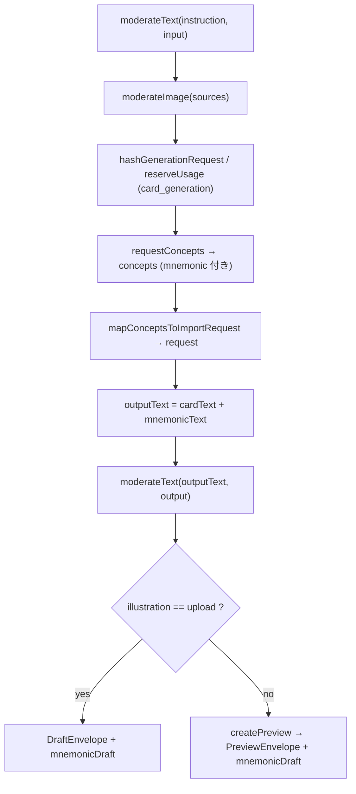

# S-16C ニーモニック＋説明の AI 下書き生成（OpenAI） — Design Doc

## ADR 不要の判断

本 Story は Accepted な既存設計（`ai-card-generation` の OpenAI Responses / moderation / `reserve_provider_usage`、Epic #40 / S-16A で確定した `slots`・`explanation` 正本形）の**範囲内の実装拡張**であり、schema / RLS / auth / provider / SRS contract の変更を伴わないため、新規 ADR は不要（`documentation-criteria.md`「既存 Accepted ADR の範囲内の実装 → 新規 ADR は不要」に該当）。

---

## 1. スコープと非ゴール

### スコープ（in scope）
- OpenAI 出力スキーマへ `mnemonic`（`slots` + `explanation`）を **required** で追加（`openai-adapter.ts` の `buildResponsesPayload`）。
- 出力検証を `mnemonic` 込みへ拡張（`openai-adapter.ts` の `parseOpenAiResponse`）。
- 型の追加（`contracts.ts`：`MnemonicSlotsDraft` / `MnemonicExplanationDraft` / `MnemonicDraft` / `MnemonicDraftEntry`、`OpenAiConceptOutput.mnemonic`、`PreviewEnvelope.mnemonicDraft?`、`DraftEnvelope.mnemonicDraft?`）。
- `generation-service.ts` の output-stage moderation 対象文字列（`outputText`）へ mnemonic テキストを追加し、`concepts` → `mnemonicDraft` を組み立てて envelope へ付加。
- `generate/route.ts`：`NextResponse.json(preview)` は現状のまま（`mnemonicDraft` は envelope に載って透過的に返る）。route ロジックの変更は最小（下記参照）。
- 上記に対応する単体テスト（`specs/stories/S-16C-ai-mnemonic-draft/tests/*.test.ts`、既存 S-12 と同じ相対 import 方式）。

### 非ゴール（non-goal）
- 承認 UI・`card_mnemonics` への保存（S-16D）。
- 画像生成への `slots` 配線（S-16E）。
- 新規 migration / RLS / DB 型変更（S-16A 完了済み。本 Story は SQL に触れない）。
- 新 provider kind / 新 units 種別 / 新 moderation 段 / 新エラーコードの追加。
- `ai-import` の import request schema（`ClientImportItemInput` 等）へ mnemonic を持ち込む変更（validate 経路を壊すため範囲外。mnemonic は import request とは別チャネルで搬送する）。

---

## 2. 合意事項チェックリスト

| 合意事項 | 反映箇所 |
|---|---|
| 既存 `ai-card-generation` を再利用し新 provider kind を作らない | §7 利用量予約：`p_kind: "card_generation"` 固定を維持 |
| moderation は既存 input/output 2 段のみ・新 flaggedCode なし | §6 moderation：output 段へ mnemonic テキストを合流 |
| `mnemonicDraft` は optional（後方互換） | §8 後方互換：`PreviewEnvelope` / `DraftEnvelope` の optional 追加 |
| 新エラーコードを増やさない | §5 検証：異常系はすべて `OPENAI_OUTPUT_SCHEMA_MISMATCH` |
| server-only secret をブラウザへ露出しない | §3：変更は既存 server-only モジュール内に限定、client import 追加なし |
| 最小差分・未関連ファイル不変 | §9 影響マップ：4＋1 ファイルに限定 |
| SQL / migration / RLS に触れない | 非ゴールに明記。`card_mnemonics` は read/write しない |

矛盾・未反映なし。

---

## 3. 既存コードベース分析（再利用するコード）

前工程成果物（`investigation.md` / `regression-risk.md`）は本 Story ディレクトリに存在しない（`meta.json` / `story.md` / `requirements.md` のみ）。以下は自前調査（実測 2026-07-22）。

| モジュール | 現状の責務 | 本 Story での扱い |
|---|---|---|
| `frontend/src/lib/ai-card-generation/contracts.ts` | `OpenAiConceptOutput` / `PreviewEnvelope` / `DraftEnvelope` / `ResponsesPayload` 型 | **変更**：mnemonic 型・field を追加 |
| `frontend/src/lib/ai-card-generation/openai-adapter.ts` | `buildResponsesPayload`（strict schema 生成）・`parseOpenAiResponse`（厳格検証）・`requestOpenAiConcepts` | **変更**：schema と検証へ mnemonic を追加 |
| `frontend/src/lib/ai-card-generation/generation-service.ts` | `generateCardDraft`（moderation→reserve→request→map→moderation→preview の逐次オーケストレーション） | **変更**：`outputText` 拡張と `mnemonicDraft` 付加のみ |
| `frontend/app/api/ai/card-drafts/generate/route.ts` | 認証・deck 所有権・依存注入・`safeError` | **変更なし〜極小**（envelope 透過。§8 参照） |
| `frontend/src/lib/ai-card-generation/output-mapper.ts` | `validateGenerationInput` / `expectedConceptCount` / `mapConceptsToImportRequest` | **変更なし（原則）**：mnemonic は import request に含めないため `mapConceptsToImportRequest` は不変。検証拡張は adapter 側に集約 |
| `frontend/src/lib/ai-card-generation/moderation.ts` | `moderate`（text/image・input/output・flaggedCode） | **変更なし**：output 段へ渡す文字列を service 側で拡張 |
| `frontend/src/lib/ai-card-generation/errors.ts` | エラーコード enum と HTTP status | **変更なし**：既存 `OPENAI_OUTPUT_SCHEMA_MISMATCH` を再利用 |
| `frontend/src/lib/illustration/prompt.ts` | `MnemonicSlots` / `MnemonicShapeHint` 正本型・`generatePrompt` | **参照のみ（type-only）**：`MnemonicSlotsDraft` の構造整合の基準 |

**類似機能の検索結果**：mnemonic 下書きを生成する既存実装は無い（`card_mnemonics` は S-16A で table のみ、書き込みは S-16D 予定）。OpenAI concept 生成基盤（S-12）は存在するため、それを拡張する（新規基盤は作らない）。

**Issue 前提「output-mapper.ts / openai-adapter.ts を検証対象」との差分**：mnemonic は import request に載せないため、実際の検証追加は `parseOpenAiResponse`（adapter）に集約するのが最小差分。`output-mapper.ts` の `mapConceptsToImportRequest` は R1/W1 の front/back を組む責務のみを保ち不変とする。この判断を§5 で明示。

---

## 4. API 契約（OpenAI JSON Schema strict）— AC-1

`buildResponsesPayload` が生成する strict schema（`kanji_card_concepts`）の各 concept item に `mnemonic` を **required** 追加する。strict モードの制約上、**全プロパティを `required` に列挙し、各オブジェクトへ `additionalProperties: false` を付ける**（strict:true では `required` に全 key を並べることが OpenAI Responses structured output の要件）。

concept item（拡張後）:

```jsonc
{
  "type": "object",
  "additionalProperties": false,
  "required": ["kanjiSide", "counterpartSide", "mnemonic"],
  "properties": {
    "kanjiSide": { "type": "string", "minLength": 1, "maxLength": 200 },
    "counterpartSide": { "type": "string", "minLength": 1, "maxLength": 200 },
    "mnemonic": {
      "type": "object",
      "additionalProperties": false,
      "required": ["slots", "explanation"],
      "properties": {
        "slots": {
          "type": "object",
          "additionalProperties": false,
          "required": ["kanji", "isSingleKanji", "shapeHint", "meaningHint", "story"],
          "properties": {
            "kanji":        { "type": "string",  "minLength": 1, "maxLength": 16 },
            "isSingleKanji":{ "type": "boolean" },
            "shapeHint": {
              "type": "object",
              "additionalProperties": false,
              "required": ["part", "picture"],
              "properties": {
                "part":    { "type": "string", "minLength": 1, "maxLength": 100 },
                "picture": { "type": "string", "minLength": 1, "maxLength": 100 }
              }
            },
            "meaningHint": { "type": "string", "minLength": 1, "maxLength": 100 },
            "story":       { "type": "string", "minLength": 1, "maxLength": 100 }
          }
        },
        "explanation": {
          "type": "object",
          "additionalProperties": false,
          "required": ["summary", "mappings"],
          "properties": {
            "summary": { "type": "string", "minLength": 1, "maxLength": 120 },
            "mappings": {
              "type": "array",
              "minItems": 2,
              "maxItems": 4,
              "items": {
                "type": "object",
                "additionalProperties": false,
                "required": ["part", "meaning"],
                "properties": {
                  "part":    { "type": "string", "minLength": 1, "maxLength": 100 },
                  "meaning": { "type": "string", "minLength": 1, "maxLength": 100 }
                }
              }
            }
          }
        }
      }
    }
  }
}
```

### maxLength の根拠（「過長」を弾く基準）

| フィールド | max | 根拠 |
|---|---|---|
| `slots.kanji` | 16 | 単字（`isSingleKanji: true`）または短い熟語を許容。`shapeHint` の 1:1 マッピングは単字のみ有効 |
| `slots.shapeHint.part` / `picture` | 100 | `illustration/prompt.ts` の `sanitizePromptInput` が `MAX_PROMPT_INPUT_LENGTH = 100` で slice する。同値に揃え、S-16E で `generatePrompt` へ渡した際に**沈黙切り詰めが起きない**上限にする |
| `slots.meaningHint` / `slots.story` | 100 | 同上（prompt 生成時に slice される 5 フィールドと一致させる） |
| `explanation.summary` | 120 | 答え側表示用の 1 文（seed 例「目で見たものが、頭の中で光って記憶に残る。」相当）。prompt には渡らないが表示過長を抑止 |
| `explanation.mappings[].part` / `meaning` | 100 | 部品→意味の短い対応語（seed 例は十数文字） |
| `explanation.mappings` 件数 | `minItems:2` / `maxItems:4` | Epic #40 正本の 2–4 件制約（seed 例は 3 件） |
| `slots.isSingleKanji` | boolean | 正本 `MnemonicSlots` に一致 |

`kanjiSide` / `counterpartSide` の既存 `maxLength: 200` は不変。

**注**：`ResponsesPayload` 型の `schema.properties.concepts.items` は既に `Readonly<Record<string, unknown>>` の緩い型のため、型シグネチャの変更は不要。`buildResponsesPayload` 内のオブジェクトリテラル（runtime schema）だけを上記へ差し替える。

---

## 5. 型の追加（contracts.ts）— AC-2 支援

`illustration/prompt.ts` の `MnemonicSlots`（正本）と構造整合させた **readonly ミラー**を定義し、drift を型テストで固定する。

```ts
// contracts.ts（追加分・言語非依存の意図として提示。最終形は実装で確定）
import type { MnemonicSlots } from "@/lib/illustration/prompt"; // type-only（secret を含まない純関数モジュール）

export interface MnemonicShapeHintDraft {
  readonly part: string;
  readonly picture: string;
}

export interface MnemonicSlotsDraft {
  readonly kanji: string;
  readonly isSingleKanji: boolean;
  readonly shapeHint: MnemonicShapeHintDraft;
  readonly meaningHint: string;
  readonly story: string;
}

export interface MnemonicExplanationDraft {
  readonly summary: string;
  readonly mappings: readonly { readonly part: string; readonly meaning: string }[];
}

export interface MnemonicDraft {
  readonly slots: MnemonicSlotsDraft;
  readonly explanation: MnemonicExplanationDraft;
}

// 生成結果（concept 単位）に mnemonic を追加
export interface OpenAiConceptOutput {
  readonly kanjiSide: string;
  readonly counterpartSide: string;
  readonly mnemonic: MnemonicDraft; // ← 追加
}

// envelope 搬送用（join key を保持）
export interface MnemonicDraftEntry {
  readonly conceptId: string;          // request.items[].conceptId と一致
  readonly slots: MnemonicSlotsDraft;
  readonly explanation: MnemonicExplanationDraft;
}
```

`PreviewEnvelope` / `DraftEnvelope` へ optional 追加：

```ts
export interface PreviewEnvelope {
  // ...既存フィールド不変...
  readonly mnemonicDraft?: readonly MnemonicDraftEntry[]; // ← 追加（optional）
}

export interface DraftEnvelope {
  readonly request: ClientImportRequestInput;
  readonly requiresIllustrationUploads: readonly string[];
  readonly mnemonicDraft?: readonly MnemonicDraftEntry[]; // ← 追加（optional・§8 判断）
}
```

### 正本 `MnemonicSlots` との整合（再利用方針）
`MnemonicSlotsDraft` は `MnemonicSlots` と**構造同形の readonly 版**とする。TypeScript では readonly プロパティを mutable ターゲットへ代入可能なため、`MnemonicSlotsDraft` の値はそのまま `generatePrompt(slots: MnemonicSlots)` へ渡せる（S-16E で変換不要）。drift 防止のため型テストで双方向の割当可能性を固定する。

```ts
// 型テスト（S-16C tests）— 構造が乖離したら typecheck が失敗する
const _toCanonical: MnemonicSlots = {} as MnemonicSlotsDraft;         // Draft → 正本へ渡せる
const _fromCanonical: MnemonicSlotsDraft = {} as Readonly<MnemonicSlots>; // 正本 → Draft 構造互換
```

**実装時訂正（drift guard 配置）**: `frontend/tsconfig.json` の `include` は S-10/S-11 の specs テストのみを列挙し、S-16C テストは `tsc --noEmit`（`check` の typecheck 段）の対象外。テストファイル内の代入アサートだけでは esbuild が型を剥がすため `check` で検証されない。そこで drift guard は typecheck 対象の `contracts.ts` に compile-time 型（`AssertAssignable` + `MnemonicSlotsDraftMirrorsCanonical` / `CanonicalMirrorsMnemonicSlotsDraft`）として配置し、`check` で常時有効化する。テスト側の代入チェックは可読性のための併記。

### concept → illustration_key 対応の設計
- 1 concept ＝ 1 漢字カード概念 ＝ 1 mnemonic。`mnemonicDraft[i]` は `concepts[i]` に 1:1 対応し、`conceptId = concept-00N`（`mapConceptsToImportRequest` と同じ採番規則 `concept-${(i+1).padStart(3,"0")}`）を join key に持つ。
- `card_mnemonics` の unique key は `(owner_user_id, illustration_key)` だが、**`illustration_key` は draft 時点で確定しない**（import commit / illustration 確定後に決まる）。したがって S-16C は `illustration_key` を**捏造せず** `conceptId` を搬送キーとし、`conceptId → 永続カード/illustration → illustration_key` の解決は S-16D（承認・保存）に委譲する。
- 消費側（S-16D）は `PreviewEnvelope.request.items[].conceptId` と `mnemonicDraft[].conceptId` を突き合わせて対応づける。両者は同一リクエスト内で採番が一致するため安定。

---

## 6. 検証（output-mapper.ts / openai-adapter.ts）— AC-2

検証は `parseOpenAiResponse`（adapter）へ集約する。`mapConceptsToImportRequest`（output-mapper）は import request の組立責務のみで**不変**（mnemonic を import request に持ち込まない設計判断による）。

`parseOpenAiResponse` の concept ループを次の通り拡張する。

- **キー数の固定値更新**：`Object.keys(concept).length !== 2` → `!== 3`（`kanjiSide` / `counterpartSide` / `mnemonic`）。この定数更新の見落としが最頻の回帰点。
- `concept.mnemonic` を `isRecord` で確認し、`slots` / `explanation` の 2 キー厳格（`Object.keys(mnemonic).length !== 2`）。
- `slots`：`Object.keys` 数 5、`kanji`（string, 1–16 code point）、`isSingleKanji`（`typeof === "boolean"`）、`shapeHint`（record・キー数 2・`part`/`picture` string 1–100）、`meaningHint`（string 1–100）、`story`（string 1–100）。
- `explanation`：`Object.keys` 数 2、`summary`（string 1–120）、`mappings`（`Array.isArray` かつ **`length < 2` または `length > 4` を境界検出**、各要素 record・キー数 2・`part`/`meaning` string 1–100）。
- 長さ判定は既存踏襲で `Array.from(x).length`（code point 基準）を用いる。
- 上記いずれの欠損・型不一致・件数境界（`mappings` 2 未満 / 4 超）・過長も既存 `schemaError()` = **`OPENAI_OUTPUT_SCHEMA_MISMATCH`** を投げる。**新エラーコードは追加しない**。
- 正常時は `concepts.push({ kanjiSide, counterpartSide, mnemonic: {...} })` で mnemonic 付き結果を返す（`requestOpenAiConcepts` の戻り型 `readonly OpenAiConceptOutput[]` は型拡張のみで透過）。

> strict schema（§4）が第一防衛線だが、モデルの schema 逸脱・部分逸脱に備え `parseOpenAiResponse` を**独立した第二防衛線**として厳格に保つ（既存方針を踏襲）。

---

## 7. moderation — AC-3

- moderation は既存の **input 段（instruction・source image）と output 段（生成テキスト）の 2 段のみ**。新規段・新規 `flaggedCode` を追加しない。
- input 段は既存のまま（instruction テキスト＋画像）。mnemonic は入力ではないため対象外。
- output 段：`generateCardDraft` 内の `outputText` 組立を拡張し、**mnemonic の生成自由文（`shapeHint.part` / `shapeHint.picture` / `meaningHint` / `story` / `explanation.summary` / `explanation.mappings[].part` / `[].meaning`）を既存のカード front/back 直列化文字列へ連結**して 1 回の `moderateText(outputText, "output")` に含める。`slots.kanji` は漢字そのもので低リスクだが完全性のため含めてよい。
- フラグ時は既存 `OPENAI_OUTPUT_MODERATION`（422）で返る。moderation 到達不能は既存 `OPENAI_MODERATION_UNAVAILABLE`（503）。

`outputText` 拡張イメージ（generation-service.ts）:

```ts
const cardText = request.items
  .map((item, i) => `[CARD ${i + 1} FRONT]\n${item.front}\n[BACK]\n${item.back}`)
  .join("\n");
const mnemonicText = concepts
  .map((c, i) => {
    const s = c.mnemonic.slots;
    const e = c.mnemonic.explanation;
    const maps = e.mappings.map((m) => `${m.part} -> ${m.meaning}`).join("\n");
    return `[MNEMONIC ${i + 1}]\n${s.shapeHint.part}\n${s.shapeHint.picture}\n${s.meaningHint}\n${s.story}\n${e.summary}\n${maps}`;
  })
  .join("\n");
await dependencies.moderateText(`${cardText}\n${mnemonicText}`, "output");
```

`concepts` は `requestConcepts` の戻り値をこのスコープで保持済み（既存フローで `const concepts = await dependencies.requestConcepts(...)`）。追加の provider 呼び出しは発生しない。

---

## 8. 利用量予約 — AC-4

- `reserveUsage` は既存のまま `p_kind: "card_generation"`・`p_source: "app_ai"`・`units: input.requestedCardCount`。**新 kind・新 units 種別を作らない**。
- mnemonic は**同一 concept 生成の一部**として同一 OpenAI Responses 呼び出しで返るため、**追加課金・追加 units を発生させない**。`hashGenerationRequest` の入力（instruction / sourceDigests / pattern / tags / illustration / requestedUnits）も不変。

---

## 9. 後方互換 — AC-5

- `mnemonicDraft` は **optional**。S-16D 未導入の間、`route.ts` は従来通り envelope を `NextResponse.json` で返し、`mnemonicDraft` が存在すれば付加されて透過的に返る。**既存レスポンス消費側（S-12 UI）は未知フィールドを無視**するため壊れない。
- **route.ts の変更**：原則不要。`generateCardDraft` の戻り値へ `mnemonicDraft` を含めるのは service 層で行い、route はそのまま `NextResponse.json(preview)`。したがって route は「変更なし〜極小」。
- **`DraftEnvelope`（illustration=`upload` 経路）での扱い（判断）**：mnemonic は illustration mode に依存せず生成される（strict schema で常時 required）。upload 経路で draft を破棄すると生成物の損失と非対称が生じるため、**`DraftEnvelope` にも optional `mnemonicDraft` を付加する**（追加は optional 1 フィールドで最小差分、消費側非破壊）。生成しない選択肢（preview 経路のみ付加）も検討したが、「同一生成で得た下書きを経路差で捨てる」不整合を避け、付加する方を採用。
- `generateCardDraft` 内の分岐（`input.illustration === "upload"` → `DraftEnvelope` / else → `createPreview` → `PreviewEnvelope`）双方の return に `mnemonicDraft` を載せる。

### generateCardDraft の変更後フロー（順序不変）



`mnemonicDraft` は `concepts` から `conceptId = concept-00N` を採番して構築（§5 の対応規則）。

---

## 10. 変更影響マップ

```yaml
変更対象: OpenAI concept 生成へ mnemonic を追加
直接影響:
  - frontend/src/lib/ai-card-generation/contracts.ts        # 型追加（mnemonic 系・envelope optional・drift guard 型）
  - frontend/src/lib/ai-card-generation/openai-adapter.ts    # schema 追加 + parse 検証拡張
  - frontend/src/lib/ai-card-generation/generation-service.ts# outputText 拡張 + mnemonicDraft 付加
  - frontend/app/api/ai/card-drafts/generate/route.ts        # 変更なし〜極小（envelope 透過）
  - frontend/vitest.config.ts                                # 実装時訂正: S-16C tests を include allowlist へ登録（check の vitest ランナー）
間接影響:
  - specs/stories/S-16C-ai-mnemonic-draft/tests/*.test.ts    # 新規テスト（相対 import）
  - specs/stories/S-12-*/tests/*.{test,int,e2e}.ts           # 実装時訂正: 共有 OpenAiConceptOutput.mnemonic required 化に伴う fixture 追加（assertion 不変）
波及なし:
  - moderation.ts / errors.ts / output-mapper.ts             # シグネチャ不変
  - ai-import/schema.ts, service.ts, canonical-request.ts    # import request 契約は不変
  - supabase/*（migration / RLS / seed / DB 型）             # SQL 非対象
  - card_mnemonics table                                     # read/write なし（S-16D）
  - 既存 S-12 UI レスポンス消費（runtime）                  # 未知 optional field は無視。ただし型を直接構築するテスト fixture は required 追加が波及
```

### インターフェース変更マトリクス

| 既存 | 変更後 | 変換要否 | アダプター | 互換性確保 |
|---|---|---|---|---|
| `OpenAiConceptOutput{kanjiSide,counterpartSide}` | `+mnemonic` | あり（生成側で必ず埋まる） | 不要 | required 追加。生成経路は schema で保証 |
| `PreviewEnvelope` | `+mnemonicDraft?` | なし | 不要 | optional。消費側非破壊 |
| `DraftEnvelope` | `+mnemonicDraft?` | なし | 不要 | optional。消費側非破壊 |
| `parseOpenAiResponse` 戻り | mnemonic 込み | なし | 不要 | 戻り型は `OpenAiConceptOutput[]` のまま拡張 |
| `buildResponsesPayload` schema | mnemonic item 追加 | なし | 不要 | `items` 型は `Record<string,unknown>` で緩く互換 |

---

## 11. 統合境界の約束

```yaml
境界1 OpenAI Responses ← buildResponsesPayload:
  入力: config + GenerateCardDraftInput + images
  出力: ResponsesPayload（strict schema に mnemonic required）
  エラー時: なし（純関数）
境界2 parseOpenAiResponse ← OpenAI 生レスポンス:
  入力: unknown（外部 JSON）
  出力: { concepts: OpenAiConceptOutput[] }（mnemonic 検証済み・同期）
  エラー時: OPENAI_OUTPUT_SCHEMA_MISMATCH / OPENAI_REFUSAL / OPENAI_INCOMPLETE_OUTPUT / OPENAI_PROVIDER_*（既存のまま）
境界3 generateCardDraft → route:
  入力: input + sources + dependencies
  出力: PreviewEnvelope | DraftEnvelope（いずれも mnemonicDraft? 付き・非同期）
  エラー時: AiCardGenerationError（既存 code/httpStatus）→ safeError
境界4 route → client:
  入力: envelope
  出力: NextResponse.json（mnemonicDraft は optional・未知フィールドとして安全）
  エラー時: safeError(code, status)（既存契約不変）
```

### データ契約

| チャネル | 型 | 前提 | 保証 | エラー時 |
|---|---|---|---|---|
| concept → mnemonicDraft | `MnemonicDraftEntry[]` | concepts と 1:1、`conceptId=concept-00N` | `slots` は `MnemonicSlots` 構造互換、`mappings` 2–4 件 | 検証段で `OPENAI_OUTPUT_SCHEMA_MISMATCH` |
| mnemonicDraft ↔ request.items | join by `conceptId` | 同一リクエスト内で採番一致 | 突合可能 | 消費側（S-16D）で解決 |

---

## 12. auth / secret / failure handling

- 認証・deck 所有権は既存 route の `createServerClient().auth.getUser()` ＋ `owner_user_id` 一致で不変。
- `OPENAI_API_KEY` / service role は既存 server-only モジュール（`env.ts` / `supabase/server`）内に閉じる。**contracts.ts が追加 import する `MnemonicSlots` は type-only**（`illustration/prompt.ts` は secret を含まない純関数）。client への secret 露出経路は増えない。
- 失敗時は fail-fast（既存踏襲）。mnemonic 検証失敗を空配列や `null` に潰さず `OPENAI_OUTPUT_SCHEMA_MISMATCH` を投げる。moderation 失敗を成功扱いしない。

---

## 13. 受入条件 対応表

| AC | 内容 | 設計での充足 | 検証 |
|---|---|---|---|
| AC-1 | strict schema の各 concept に `mnemonic`(`slots`+`explanation`) required、`mappings` 2–4、`slots` は正本形 | §4 | L1: `buildResponsesPayload` の schema スナップショット/構造アサート |
| AC-2 | `mnemonic` 欠損・型不一致・`mappings` 件数境界・過長を `OPENAI_OUTPUT_SCHEMA_MISMATCH`、正常系は `mnemonicDraft` を返す | §5, §6 | L1: `parseOpenAiResponse` の正常・各異常ケース |
| AC-3 | moderation は既存 input/output のみ、mnemonic は output 段対象、フラグ時 `OPENAI_*_MODERATION` | §7 | L1: `outputText` に mnemonic 文字列が含まれる／L2: output flagged で 422 |
| AC-4 | `reserve_provider_usage` は `card_generation` 枠内、新 kind/units なし | §8 | L2: route が `p_kind:"card_generation"` で 1 回のみ予約 |
| AC-5 | `mnemonicDraft` optional・後方互換 | §9 | L1: 型テスト（optional）／L2: 既存 preview レスポンス形不変 |
| AC-6 | `npm --prefix frontend run check` 通過 | 全体 | lint + typecheck + vitest |

---

## 14. テスト戦略（L1 / L2 / L3）

配置：`specs/stories/S-16C-ai-mnemonic-draft/tests/*.test.ts`（S-12 同様、`../../../../frontend/src/...` 相対 import）。

- **L1（純関数・単体）**
  - `buildResponsesPayload`：concept item に `mnemonic` が required、`mappings.minItems/maxItems=2/4`、`slots.shapeHint` ネスト・`additionalProperties:false`・全 key required（AC-1）。
  - `parseOpenAiResponse`：
    - 正常：mnemonic 付き concept を返し、`mnemonicDraft` 構築元として整合。
    - 異常：`mnemonic` 欠損／`slots` キー過不足／`isSingleKanji` 非 boolean／`shapeHint` 欠損／`mappings` 1 件・5 件／各 string 過長 → すべて `OPENAI_OUTPUT_SCHEMA_MISMATCH`（AC-2）。
    - `Object.keys(concept).length` の 3 固定（余剰キーで mismatch）。
  - 型テスト：`MnemonicSlotsDraft` ↔ `MnemonicSlots` 双方向割当（drift 固定）、`mnemonicDraft` optional（AC-5）。
- **L2（route / integration 寄り）**
  - `generateCardDraft`（依存注入モック）：`outputText` に mnemonic 文字列が含まれ output moderation へ渡る（AC-3）、`reserveUsage` は `card_generation` で 1 回（AC-4）、preview/draft 双方に `mnemonicDraft` が付く（AC-5, §9）。
  - route：flagged output で 422 `OPENAI_OUTPUT_MODERATION`、schema mismatch で 502。
- **L3（実 provider）**：本 Story では実 OpenAI 呼び出しは行わない（未検証範囲として明記）。既存 S-12 の hosted evidence 方式を踏襲する場合も本 Story のゲート（`--until plan`）外。
- **完了ゲート**：`npm --prefix frontend run check`（AC-6）。route/bundling 境界の実変更は最小のため `build` は必要時のみ。

---

## 15. ロールアウト / ロールバック

- 追加はすべて後方互換（optional field ＋ 生成側 required）。feature flag は既存 `isAiCardImportEnabled` を流用（新フラグなし）。
- ロールバック：本 Story の 4＋1 ファイルの diff を戻すだけで従来挙動（mnemonic 無し）へ復帰。DB 変更が無いためデータ移行・逆移行は不要。
- forward-fix：mnemonic 検証が厳しすぎてモデル出力を弾く場合は `parseOpenAiResponse` の境界と §4 maxLength を調整（schema と検証を同時更新）。

---

## 16. 未解決事項

1. **`slots.kanji` の maxLength=16**：複数字語（`isSingleKanji:false`）の想定最大長。熟語がこれを超える運用が判明したら §4 を更新（現状 seed/正本例は単字〜数字で十分）。
2. **`explanation.summary` maxLength=120**：表示 UI（S-16D）の折り返し要件が固まれば再調整の可能性。prompt には渡らないため生成品質への影響は無い。
3. **`conceptId → illustration_key` の最終確定**：`illustration_key` の生成規則は S-16D/S-16E の commit/illustration 確定ロジックに依存。本 Story は `conceptId` 搬送に留め、解決は後続へ委譲（§5）。
4. **モデルの mnemonic 生成品質**：strict schema で形式は保証されるが、内容妥当性（字形と手掛かりの整合）はプロンプト（`DEVELOPER_POLICY`）調整の余地あり。本 Story のスコープ外だが S-16D 承認 UI での人手編集が最終担保。

---

## 17. 参考資料

- OpenAI Structured Outputs（strict JSON Schema：全プロパティ required・`additionalProperties:false` 制約）: https://platform.openai.com/docs/guides/structured-outputs
- OpenAI Responses API: https://platform.openai.com/docs/api-reference/responses
- 本リポジトリ実測ソース（正本）: `frontend/src/lib/ai-card-generation/*`, `frontend/src/lib/illustration/prompt.ts`, `supabase/migrations/20260721000001_s16_card_mnemonics.sql`, `supabase/seed.sql`
