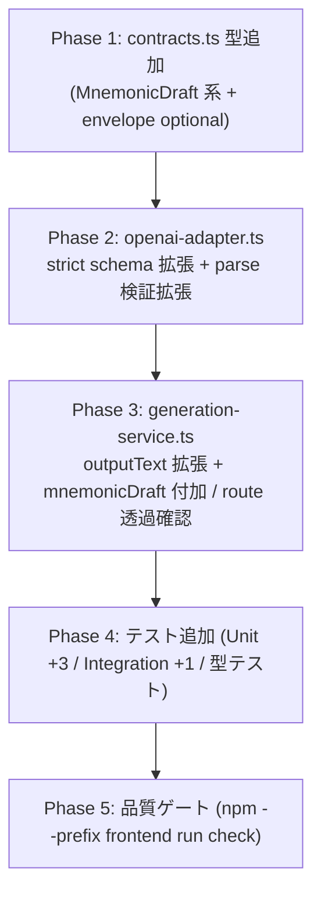
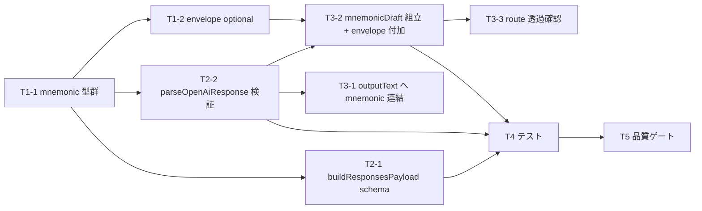
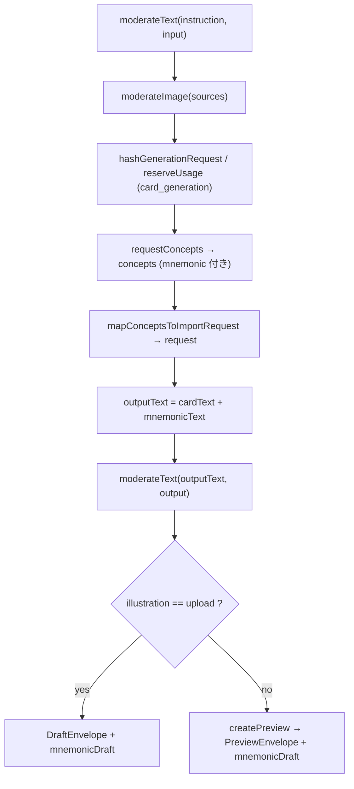

# S-16C ニーモニック＋説明の AI 下書き生成（OpenAI） — 作業計画書

`plan.md` は本 Story 実装の単一情報源。`tasks/` や個別 task ファイルは作らない。フェーズは依存順。全変更は
`design.md`（正本）の決定に厳密整合させる。UI 実装は含まないため `ui_design: none`。

## 前提と参照

- 設計正本: `specs/stories/S-16C-ai-mnemonic-draft/design.md`
- 要件: `specs/stories/S-16C-ai-mnemonic-draft/requirements.md`（AC-1〜AC-6）
- 影響対象（design §10 影響マップに一致・5＋1 ファイル。実装時に vitest 登録が必須と判明し 4＋1 → 5＋1 へ訂正）:
  - `frontend/src/lib/ai-card-generation/contracts.ts`（型追加。drift guard 型もここに配置＝下記注参照）
  - `frontend/src/lib/ai-card-generation/openai-adapter.ts`（strict schema 拡張 + parse 検証拡張）
  - `frontend/src/lib/ai-card-generation/generation-service.ts`（outputText 拡張 + mnemonicDraft 付加）
  - `frontend/app/api/ai/card-drafts/generate/route.ts`（変更なし〜極小・envelope 透過）
  - `frontend/vitest.config.ts`（S-16C tests を include allowlist に 1 エントリ登録。**訂正**: 実際の `check` ランナーは
    `frontend/vitest.config.ts` の明示 include allowlist を使う。ルート `vitest.config.mjs` は `check` の対象ではない。
    既存 S-10/S-11/S-12 と同一パターンの additive な 1 行追加で `*.test.ts` glob が Unit・Integration 双方を収集する）
  - `specs/stories/S-16C-ai-mnemonic-draft/tests/*.test.ts`（新規テスト・相対 import）
- 実装時の付随修正（承認済みオーケストレーター判断・機械的保守）:
  - `specs/stories/S-12-ai-card-openai-generation-ui/tests/*.{test,int.test,e2e.test}.ts`：共有型
    `OpenAiConceptOutput.mnemonic` を required 化した機械的帰結として、mnemonic を持たない concept fixture 3 箇所へ
    有効な mnemonic を追加（assertion 不変・intent 保持）。design §10「S-12 波及なし」は runtime レスポンス消費側
    （optional `mnemonicDraft` を無視）の意味であり、型を直接構築するテスト fixture には required 追加が波及する。
- 不変（触れない）: `moderation.ts` / `errors.ts` / `output-mapper.ts` のシグネチャ、`ai-import/*` の import request 契約、
  `supabase/*`（migration / RLS / seed / DB 型）、`card_mnemonics` table（read/write なし）。

## フェーズ構成図

## タスク依存関係図

依存は最大 2 階層。並列可能: Phase 1 完了後に T2-1 と T2-2 は独立実装可。

---

## Phase 1: contracts.ts に mnemonic 型を追加（AC-2 支援 / AC-5）

- 対象 requirement / design: AC-2, AC-5 / design §5, §10（インターフェース変更マトリクス）
- 対象ファイル: `frontend/src/lib/ai-card-generation/contracts.ts`
- 先行 dependency: なし

### T1-1: mnemonic 型群の追加と正本 `MnemonicSlots` との構造整合
- 変更概要:
  - `import type { MnemonicSlots } from "@/lib/illustration/prompt";` を **type-only** で追加（`prompt.ts` は
    secret を含まない純関数モジュール。client への secret 露出経路を増やさない — design §12）。
  - `MnemonicShapeHintDraft`（`part` / `picture`）、`MnemonicSlotsDraft`（`kanji` / `isSingleKanji` /
    `shapeHint` / `meaningHint` / `story`）、`MnemonicExplanationDraft`（`summary` / `mappings`）、
    `MnemonicDraft`（`slots` + `explanation`）、`MnemonicDraftEntry`（`conceptId` + `slots` + `explanation`）を
    すべて readonly で追加（design §5 の型定義に一致）。
  - `OpenAiConceptOutput` に `readonly mnemonic: MnemonicDraft;` を **required** 追加。
- 完了条件:
  - `MnemonicSlotsDraft` は正本 `MnemonicSlots` と構造同形の readonly 版であること（drift は Phase 4 の型テストで固定）。
  - typecheck 0 エラー / lint 0。

### T1-2: envelope への optional フィールド追加（後方互換）
- 変更概要:
  - `PreviewEnvelope` に `readonly mnemonicDraft?: readonly MnemonicDraftEntry[];` を追加。
  - `DraftEnvelope` に `readonly mnemonicDraft?: readonly MnemonicDraftEntry[];` を追加（design §9 の判断：upload
    経路でも同一生成で得た下書きを捨てないため付加。optional 1 フィールドで消費側非破壊）。
- 完了条件:
  - 既存 `PreviewEnvelope` / `DraftEnvelope` の他フィールドは不変。
  - optional 追加のため既存 S-12 消費側（未知フィールド無視）が壊れないこと。typecheck 0 / lint 0。

---

## Phase 2: openai-adapter.ts の strict schema と検証を拡張（AC-1 / AC-2）

- 対象 requirement / design: AC-1, AC-2 / design §4, §6
- 対象ファイル: `frontend/src/lib/ai-card-generation/openai-adapter.ts`
- 先行 dependency: Phase 1（`MnemonicDraft` / `OpenAiConceptOutput.mnemonic`）

### T2-1: `buildResponsesPayload` の strict schema へ `mnemonic` を required 追加（AC-1）
- 変更概要（design §4 の JSON Schema をそのまま runtime リテラルへ反映）:
  - concept item の `required` を `["kanjiSide", "counterpartSide", "mnemonic"]` に更新。
  - `mnemonic`（object, `additionalProperties:false`, required `["slots","explanation"]`）を追加。
    - `slots`: required `["kanji","isSingleKanji","shapeHint","meaningHint","story"]`。
      - `kanji` string 1–16、`isSingleKanji` boolean、
      - `shapeHint` object required `["part","picture"]`（各 string 1–100）、
      - `meaningHint` string 1–100、`story` string 1–100。
    - `explanation`: required `["summary","mappings"]`。
      - `summary` string 1–120、
      - `mappings` array `minItems:2` / `maxItems:4`、item は required `["part","meaning"]`（各 string 1–100）。
  - strict:true の要件どおり全 object に `additionalProperties:false` と全 key の `required` 列挙を守る。
  - `ResponsesPayload` 型の `items` は `Readonly<Record<string, unknown>>` で緩いため **型シグネチャ変更不要**（design §4 注）。
  - `kanjiSide` / `counterpartSide` の既存 `maxLength:200` は不変。
- 完了条件:
  - 生成 schema がスナップショット/構造アサートで期待どおり（Phase 4 で検証）。typecheck 0 / lint 0。

### T2-2: `parseOpenAiResponse` に mnemonic 検証を追加（第二防衛線・AC-2）
- 変更概要（design §6）:
  - **キー数固定値更新**: `Object.keys(concept).length !== 2` → `!== 3`（`kanjiSide` / `counterpartSide` / `mnemonic`）。
    ※この定数更新の見落としが最頻の回帰点。
  - `concept.mnemonic` を `isRecord` 確認し `Object.keys(mnemonic).length !== 2`（`slots` / `explanation`）を厳格。
  - `slots`: キー数 5、`kanji`（string, 1–16 code point）、`isSingleKanji`（`typeof === "boolean"`）、
    `shapeHint`（record・キー数 2・`part`/`picture` string 1–100）、`meaningHint`（string 1–100）、`story`（string 1–100）。
  - `explanation`: キー数 2、`summary`（string 1–120）、`mappings`（`Array.isArray` かつ `length < 2` または
    `length > 4` を境界検出、各要素 record・キー数 2・`part`/`meaning` string 1–100）。
  - 長さ判定は既存踏襲の `Array.from(x).length`（code point 基準）。
  - 欠損・型不一致・件数境界・過長はすべて既存 `schemaError()` = `OPENAI_OUTPUT_SCHEMA_MISMATCH` を throw
    （**新エラーコードを追加しない**）。空配列や `null` へ潰さず fail-fast（design §12）。
  - 正常時 `concepts.push({ kanjiSide, counterpartSide, mnemonic: {...} })` で mnemonic 込み結果を返す。
    `requestOpenAiConcepts` の戻り型 `readonly OpenAiConceptOutput[]` は型拡張のみで透過。
- 完了条件:
  - 正常系で mnemonic 付き concept を返す。全異常系で `OPENAI_OUTPUT_SCHEMA_MISMATCH`。typecheck 0 / lint 0。

---

## Phase 3: generation-service.ts の moderation 合流と mnemonicDraft 付加（AC-3 / AC-5）

- 対象 requirement / design: AC-3, AC-4, AC-5 / design §7, §8, §9
- 対象ファイル: `frontend/src/lib/ai-card-generation/generation-service.ts`,
  `frontend/app/api/ai/card-drafts/generate/route.ts`
- 先行 dependency: Phase 1（envelope optional）, Phase 2（`OpenAiConceptOutput.mnemonic`）

### T3-1: output-stage moderation に mnemonic 自由文を連結（AC-3）
- 変更概要（design §7）:
  - 既存 `outputText`（card front/back 直列化）へ mnemonic 自由文を連結して **1 回の**
    `moderateText(outputText, "output")` に含める。対象文字列: `shapeHint.part` / `shapeHint.picture` /
    `meaningHint` / `story` / `explanation.summary` / `explanation.mappings[].part` / `[].meaning`
    （`slots.kanji` は低リスクだが完全性のため含めてよい）。
  - `concepts`（`requestConcepts` 戻り値）を既存スコープで保持済み。**追加の provider 呼び出しは発生させない**。
  - moderation 段・`flaggedCode` は増やさない。フラグ時は既存 `OPENAI_OUTPUT_MODERATION`（422）、到達不能は
    既存 `OPENAI_MODERATION_UNAVAILABLE`（503）。
- 完了条件:
  - output moderation へ渡る文字列に mnemonic 文字列が含まれる（Phase 4 L2 で検証）。順序不変（design §9 flow）。

### T3-2: `mnemonicDraft` を組み立て envelope へ付加（AC-4 不変 / AC-5）
- 変更概要（design §5, §9）:
  - `concepts` から `MnemonicDraftEntry[]` を構築。join key は
    `conceptId = concept-${String(i+1).padStart(3,"0")}`（`mapConceptsToImportRequest` と同一採番規則）で `concepts[i]` に 1:1。
    各 entry は `{ conceptId, slots: c.mnemonic.slots, explanation: c.mnemonic.explanation }`。
  - 分岐双方の return に `mnemonicDraft` を載せる:
    - `input.illustration === "upload"` → `DraftEnvelope` に `mnemonicDraft` を付加。
    - それ以外 → `createPreview(...)` の戻り `PreviewEnvelope` を `{ ...preview, mnemonicDraft }` で拡張して返す
      （`createPreview` 依存のシグネチャは不変。service 層でマージ）。
  - `reserveUsage` は既存のまま `p_kind:"card_generation"` 相当・`units: input.requestedCardCount`・
    `hashGenerationRequest` の入力も不変（**新 kind / 新 units を作らない** — design §8, AC-4）。
- 完了条件:
  - preview / draft 双方に `mnemonicDraft` が付く。`illustration_key` を捏造せず `conceptId` を搬送キーとする
    （解決は S-16D へ委譲）。typecheck 0 / lint 0。

### T3-3: route の透過確認（変更なし〜極小）
- 変更概要（design §8, §9）:
  - `generate/route.ts` は原則変更なし。`generateCardDraft` の戻り値へ `mnemonicDraft` が service 層で載るため
    `NextResponse.json(preview)` のまま透過的に返る。認証・deck 所有権・`safeError` は不変。
- 完了条件:
  - route 差分は無しまたは型追従のみ。既存 preview レスポンス形が壊れない（後方互換）。

---

## Phase 4: テスト追加（AC-1〜AC-5 の検証 / design §14）

- 対象 requirement / design: AC-1〜AC-5 / design §14（L1 / L2）
- 先行 dependency: Phase 1〜3
- テスト配置（design §14 / testing-guide 準拠）:
  - 新規に **`specs/stories/S-16C-ai-mnemonic-draft/tests/`** 配下へ置く（S-12 と同じ相対 import 方式）。
    **訂正**: これらは `frontend/vitest.config.ts` の明示 include allowlist へ登録して初めて `check` の
    `vitest run` に収集される（ルート `vitest.config.mjs` は `check` の対象外）。上記「影響対象」に
    `frontend/vitest.config.ts` を追加済み。
  - Unit / 型テスト: `specs/stories/S-16C-ai-mnemonic-draft/tests/ai-mnemonic-draft.test.ts`
  - Integration: `specs/stories/S-16C-ai-mnemonic-draft/tests/ai-mnemonic-draft.int.test.ts`
  - import は S-12 同様 `../../../../frontend/src/...` の相対パス。

### T4-1: Unit（+3）— adapter の mnemonic 検証（AC-1 / AC-2）
- `ai-mnemonic-draft.test.ts`:
  - (a) 適合ケース: `buildResponsesPayload` の concept item に `mnemonic` が required、`mappings.minItems/maxItems=2/4`、
    `slots.shapeHint` ネスト・`additionalProperties:false`・全 key required（AC-1）。
    `parseOpenAiResponse` が適合入力で mnemonic 付き concept を返し `mnemonicDraft` 構築元として整合（AC-2 正常系）。
  - (b) 欠損/型不一致: `mnemonic` 欠損 / `slots` キー過不足 / `isSingleKanji` 非 boolean / `shapeHint` 欠損 /
    余剰キー（`Object.keys(concept).length` 3 固定違反）→ すべて `OPENAI_OUTPUT_SCHEMA_MISMATCH`（AC-2）。
  - (c) 件数境界・過長: `mappings` 1 件 = NG / 2 件 = OK / 4 件 = OK / 5 件 = NG、各 string 過長（`slots.kanji` 17,
    `shapeHint.part` 101, `summary` 121 等）→ `OPENAI_OUTPUT_SCHEMA_MISMATCH`（AC-2）。

### T4-2: 型テスト — drift 固定と optional（AC-5）
- `ai-mnemonic-draft.test.ts`（型レベル・typecheck で担保）:
  - `MnemonicSlotsDraft` ↔ `MnemonicSlots` の双方向割当可能性（`const _toCanonical: MnemonicSlots = {} as
    MnemonicSlotsDraft;` / `const _fromCanonical: MnemonicSlotsDraft = {} as Readonly<MnemonicSlots>;`）。
    構造が乖離したら typecheck が失敗する。
  - **訂正（drift guard 配置）**: `frontend/tsconfig.json` の `include` は S-10/S-11 の specs テストのみを列挙し、
    **S-16C テストは `tsc --noEmit`（`check` の typecheck 段）の対象外**。テスト側だけの代入アサートは esbuild が
    型を剥がすため `check` では検証されない。そこで drift guard は typecheck 対象の
    `contracts.ts`（`AssertAssignable` + `MnemonicSlotsDraftMirrorsCanonical` / `CanonicalMirrorsMnemonicSlotsDraft`）に
    配置し `check` で常時有効化する。テスト側 U-13 の代入チェックは可読性のための併記（compile-time のみ・runtime コスト 0）。
  - `PreviewEnvelope.mnemonicDraft` が optional（未設定でも型が通る）ことのアサート。

### T4-3: Integration（+1）— generate route が mnemonicDraft を返す（AC-3 / AC-4 / AC-5）
- `ai-mnemonic-draft.int.test.ts`（`generateCardDraft` に依存注入モック / fetch モック）:
  - `outputText` に mnemonic 文字列が含まれ output moderation へ渡る（AC-3）。
  - `reserveUsage` は `card_generation` 枠で 1 回のみ呼ばれる（AC-4、新 kind/units なし）。
  - preview / draft 双方の戻りに `mnemonicDraft`（`conceptId` join key・concepts と 1:1）が付く（AC-5, design §9）。
  - 異常系: output flagged で 422 `OPENAI_OUTPUT_MODERATION`、schema mismatch で `OPENAI_OUTPUT_SCHEMA_MISMATCH`。
- 完了条件（Phase 4 全体）:
  - Unit +3・Integration +1・型テストがすべて green。`test.skip`/`.only`/弱い assertion を残さない。
  - 未解決テスト 0 件。

---

## Phase 5: 品質ゲート（AC-6）

- 対象 requirement: AC-6
- 実行コマンドと期待結果:
  - `npm --prefix frontend run check`（lint + typecheck + vitest）→ 全 pass、lint/型 0 エラー。
  - **`build` の要否判断**: route ロジックは実質変更なし〜極小（envelope 透過）で Server/Client 境界・bundling・
    環境変数に影響しないため `npm --prefix frontend run build` は **必須ではない**（design §14）。ただし route ファイルに
    型追従以上の差分が生じた場合、または check だけで Server/Client 境界の疑義が残る場合のみ build を追加実行する。
- 完了条件:
  - `check` 完全 pass。AC-1〜AC-6 すべて対応テスト green（下表）。
  - 変更は 4＋1 ファイルに限定され、未関連ファイル不変（最小差分）。

---

## 受入条件 → テスト対応表

| AC | 内容 | 対応 Phase / テスト |
|---|---|---|
| AC-1 | strict schema の各 concept に `mnemonic`(`slots`+`explanation`) required、`mappings` 2–4、`slots` 正本形 | Phase 2 T2-1 / T4-1 (a) `buildResponsesPayload` 構造アサート |
| AC-2 | `mnemonic` 欠損・型不一致・`mappings` 件数境界・過長 → `OPENAI_OUTPUT_SCHEMA_MISMATCH`、正常系は `mnemonicDraft` を返す | Phase 2 T2-2 / T4-1 (a)(b)(c) `parseOpenAiResponse` |
| AC-3 | moderation は既存 input/output のみ、mnemonic は output 段対象、フラグ時 `OPENAI_*_MODERATION` | Phase 3 T3-1 / T4-3 int（outputText 含有・422） |
| AC-4 | `reserve_provider_usage` は `card_generation` 枠内、新 kind/units なし | Phase 3 T3-2 / T4-3 int（1 回・card_generation） |
| AC-5 | `mnemonicDraft` optional・後方互換、preview/draft 双方に付加 | Phase 1 T1-2 / Phase 3 T3-2 / T4-2 型テスト・T4-3 int |
| AC-6 | `npm --prefix frontend run check` 通過 | Phase 5 |

---

## スコープ外の再確認（design §1 非ゴール）

- **S-16D**: 承認 UI・`card_mnemonics` への保存（本 Story は table を read/write しない。`conceptId → illustration_key`
  解決も S-16D へ委譲）。
- **S-16E**: 画像生成への `slots` 配線（`generatePrompt` への受け渡し）。
- **SQL 非対象**: 新規 migration / RLS / Storage policy / DB 型 / seed 変更（S-16A で完了済み）。
- 新 provider kind / 新 units 種別 / 新 moderation 段 / 新エラーコードの追加なし。
- `ai-import` の import request schema（`ClientImportItemInput` 等）に mnemonic を持ち込まない（mnemonic は
  import request とは別チャネル = envelope の `mnemonicDraft` で搬送）。

---

## リスクと緩和（design §16 の未解決事項を引き継ぐ）

| リスク | 検知 | 緩和 |
|---|---|---|
| strict schema と OpenAI 実挙動の乖離（モデルが schema を部分逸脱） | 実 provider 呼び出しは本 Story では未実施（L3 は範囲外・`--until plan` 外） | `parseOpenAiResponse` を独立した第二防衛線として厳格保持。逸脱時は §4 maxLength と検証境界を **同時更新**（forward-fix）。 |
| `parseOpenAiResponse` のキー数固定値（2→3）の更新漏れ | 正常系テストが `OPENAI_OUTPUT_SCHEMA_MISMATCH` で落ちる | T4-1 (a) 正常系で回帰検出。design §6 に最頻回帰点と明記済み。 |
| `slots.kanji` maxLength=16 が熟語運用で不足（`isSingleKanji:false`） | 生成が過長で弾かれるログ / 検証失敗 | design §16-1 の未解決事項として引き継ぎ。運用判明時に §4 を更新（schema と検証を同時変更）。現状 seed/正本例は単字〜数字で充足。 |
| `explanation.summary` maxLength=120 と S-16D 表示折り返し要件の不整合 | S-16D UI 実装時に判明 | prompt には渡らないため生成品質へ影響なし。S-16D で再調整可能（design §16-2）。 |
| `conceptId ↔ illustration_key` 対応の未確定 | S-16D 保存時に join 不能なら検知 | 本 Story は `illustration_key` を捏造せず `conceptId` 搬送に留める。解決は S-16D へ委譲（design §5, §16-3）。 |
| mnemonic 生成内容の妥当性（字形と手掛かりの整合） | 人手レビュー | strict schema は形式のみ保証。内容担保は S-16D 承認 UI の人手編集（design §16-4）。本 Story スコープ外。 |
| `DraftEnvelope` へ optional 追加した際の既存 upload 経路消費側破壊 | typecheck / 既存テスト | optional 1 フィールドで消費側非破壊。既存 S-12 は未知フィールドを無視。 |

---

## 変更後フロー（generateCardDraft・順序不変 / design §9）

