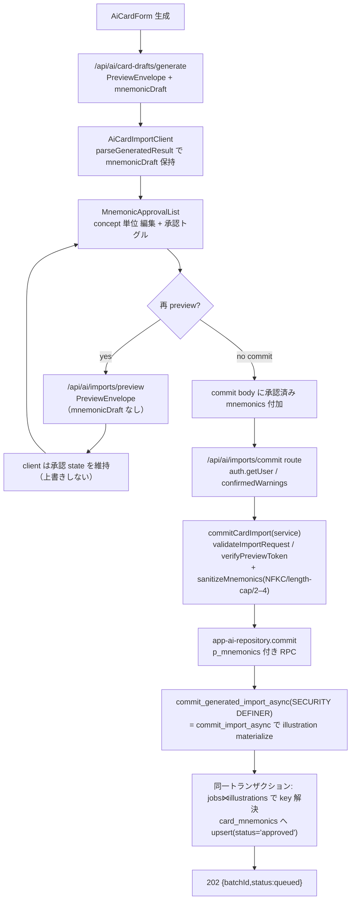

# S-16D ニーモニック承認 UI → card_mnemonics 保存 — Design Doc

## 前提となる ADR

- [ADR-012: 承認済みニーモニックは app_ai commit RPC の同一トランザクション内で card_mnemonics へ書き込む](specs/adr/ADR-012-mnemonic-approval-commit-write-boundary.md)（本 Story で新規作成。書き込み位置・key 解決・搬送・owner 境界の正本）
- [ADR-011: Remote MCP は Supabase OAuth 互換性 gate と JWT/RLS 境界の内側に置く](specs/adr/ADR-011-supabase-oauth-remote-mcp-security-boundary.md)（preview-token / `importRequestHash` 契約と DB 再検証の正本。本 Story は不破壊）
- [ADR-007: AI カードインポート基盤](specs/adr/ADR-007-ai-card-import-foundation.md) / [ADR-008: 非同期キュー・画像処理](specs/adr/ADR-008-ai-card-async-queue-image-processing.md) / [ADR-010: preview/source/status UI 境界](specs/adr/ADR-010-ai-card-preview-source-status-ui-boundary.md)

---

## 1. スコープと非ゴール

### スコープ（in scope）
- `AiCardImportClient` が S-16C envelope の `mnemonicDraft` を保持し、concept 単位で編集・承認する UI（新規 `MnemonicApprovalList.tsx`）。
- commit body に承認済み concept の `mnemonics: [{conceptId, slots, explanation}]` を追加（token 非相乗り）。
- commit 経路（route / service / repository）の mnemonic 対応：TS 側での独立再検証・再サニタイズ（NFKC・length-cap・mappings 2–4）。
- commit RPC `commit_generated_import_async` の拡張（新 migration）：`p_mnemonics jsonb DEFAULT NULL` を追加し、同一トランザクション内で materialize 済み `illustration_key` を解決して `card_mnemonics` へ upsert。
- `frontend/src/types/database.ts` の RPC 型更新。
- 関連テスト（Vitest 単体 + `*.int.test.ts`）。

### 非ゴール（non-goal）
- 画像生成トリガー（S-16E）・答え側の説明表示（S-16F）。
- Remote MCP 経由の承認（本 Story は app_ai / cookie 認証経路のみ。共有 primitive `commit_import_async` は不変）。
- preview-token / `importRequestHash` の契約変更（5 キー shape・hash 被覆範囲を一切変更しない）。
- `card_mnemonics` の table / RLS 変更（S-16A で確定済み。本 Story は DDL を追加せず既存 table へ書くのみ）。
- 新 feature flag の追加（既存 `isAiCardImportEnabled` を流用）。
- `ClientImportItemInput` / import request schema へ mnemonic を持ち込む変更（validate 経路を壊すため。mnemonic は別チャネル搬送）。

---

## 2. 合意事項チェックリスト

| 合意事項 | 反映箇所 |
|---|---|
| 書き込みは commit RPC 同一トランザクション内（別 Action 不可） | §5 データフロー、§7 RPC 拡張、ADR-012 決定1 |
| illustration_key は materialize 済み行から join 解決（式を複製しない） | §7 upsert SQL、ADR-012 決定2 |
| Remote MCP 共有 primitive `commit_import_async` は不変 | §7、§10 影響マップ、ADR-012 決定3 |
| mnemonic は token 非相乗り・commit body 独立フィールドで搬送 | §4 データ契約、§6 client、ADR-012 決定4 |
| owner は認証セッション由来で固定・client 指定不可 | §8 auth、§6 service、ADR-012 決定5 |
| サーバで独立に再検証・再サニタイズ（NFKC・length-cap・mappings 2–4） | §6 service、§7 RPC、ADR-012 決定5 |
| preview-token 5 キー shape / hash 被覆範囲を不変 | §4、非ゴール |
| 未承認 concept は card_mnemonics 0 行・UI 明示 | §6 UI、§9 受入条件 AC-4 |
| 冪等 upsert（再 commit・worker 再試行で二重化しない） | §7 冪等性、AC-2 |
| 既存 `isAiCardImportEnabled` 流用・新フラグなし | §8、非ゴール |
| DB 一体変更（migration / DB 型 / test） | §7、§10、§11 |

矛盾・未反映なし。

---

## 3. 既存コードベース分析（再利用するコード）

前工程成果物（`investigation.md` / `regression-risk.md`）は本 Story ディレクトリに存在しない（`meta.json` / `story.md` / `requirements.md` のみ）。以下は自前調査（実測 2026-07-22）。

| モジュール | 現状の責務 | 本 Story での扱い |
|---|---|---|
| `frontend/app/(auth)/decks/[deckId]/ai/new/AiCardImportClient.tsx` | preview→commit オーケストレータ。`parseGeneratedResult`（491–523）が `mnemonicDraft` を破棄 | **変更**：`mnemonicDraft` を保持・承認 state 管理・commit body へ付加 |
| `frontend/src/components/ai-card-import/DraftCardList.tsx` | concept 単位の front/back/tags/画像編集 | **参照のみ**：承認欄は別コンポーネントに分離（責務分割） |
| `frontend/src/components/ai-card-import/MnemonicApprovalList.tsx` | （なし） | **新規**：concept 単位の slots/explanation 編集・承認トグル・mappings 2–4 |
| `frontend/app/api/ai/imports/commit/route.ts` | 認証・confirmedWarnings・service 呼出 | **変更なし〜極小**：body（mnemonics 含む）を `commitCardImport` へ透過 |
| `frontend/src/lib/ai-import/service.ts` | `commitCardImport` / `parseCommitInput` | **変更**：mnemonics の parse・再検証・再サニタイズ・repository へ受け渡し |
| `frontend/src/lib/ai-import/app-ai-repository.ts` | `commit_generated_import_async` 呼出 | **変更**：`p_mnemonics` を渡す |
| `frontend/src/lib/ai-import/normalize.ts` | `normalizeDisplayText`（NFKC）・`isUnicodeScalarText` | **再利用**：mnemonic テキストのサニタイズに使用 |
| `frontend/src/lib/ai-import/schema.ts` | `validateImportRequest` / `NormalizedImportRequest` | **参照のみ**：`conceptId` 突合の正本（items へ mnemonic を足さない） |
| `frontend/src/lib/ai-card-generation/contracts.ts` | `MnemonicDraftEntry` / `MnemonicSlotsDraft` / `MnemonicExplanationDraft` | **再利用**：承認 state・commit 搬送の型 |
| `frontend/src/lib/ai-import/preview-token.ts` | 5 キー v1 token・`importRequestHash` 非 mnemonic 被覆 | **変更なし**：契約不破壊 |
| `supabase/migrations/20260718000006_...` | `commit_generated_import_async`（app_ai UI 専用 wrapper） | **拡張（新 migration で DROP/CREATE）** |
| `supabase/migrations/20260715000000_...` | 内側 `commit_import_async`（key materialize・共有 primitive） | **変更なし**（Remote MCP 共有） |
| `supabase/migrations/20260721000001_...` | `card_mnemonics` table / RLS | **変更なし**（既存へ書くのみ） |
| `frontend/src/types/database.ts` | RPC / table 型 | **変更**：`commit_generated_import_async` に `p_mnemonics?` 追加 |

**類似機能の検索結果**：`card_mnemonics` への書き込み実装は現状存在しない（S-16A で table のみ作成、書き込みは本 Story が初）。commit RPC・preview-token・sanitize は既存を再利用し、新基盤は作らない。

**「既存で充足／対象外」判断の確認**：
- Remote MCP 経路は `s14_remote_commit_import` → `ai_s14_enqueue_import_internal` を通り、`commit_generated_import_async` を呼ばない（`20260720000004_...sql` で確認）。よって wrapper 拡張は Remote MCP に波及しない。
- 再 preview 経路 `/api/ai/imports/preview` → `previewCardImport` → `createImportPreview` は `PreviewEnvelope` を返すが `mnemonicDraft` を再生成しない（mnemonic は OpenAI 生成でのみ得られる）。よって client は `mnemonicDraft` を再 preview 越しに保持する必要がある（§6）。

---

## 4. データ契約（統合境界の約束）

```yaml
境界1 client → /api/ai/imports/commit（HTTP body）:
  入力: { request, importRequestHash, previewToken, cardReservationKey, idempotencyKey,
          confirmedWarnings, mnemonics?: [{conceptId, slots, explanation}] }  # mnemonics は承認済みのみ
  出力: 202 { batchId, status:"queued", statusUrl }（同期応答）
  エラー時: safeError(code,status)（既存契約）。mnemonics 不正は VALIDATION_ERROR(400)
  不変: preview-token（5 キー）と importRequestHash 被覆範囲は変更しない。mnemonics は token 非被覆
境界2 commitCardImport（service）→ repository.commit:
  入力: { idempotencyKey, importRequestHash, request, cardReservationKey, previewToken,
          mnemonics?: SanitizedMnemonicEntry[] }
  出力: RPC 生結果（unknown）→ parseCommitAsyncResponse
  エラー時: VALIDATION_ERROR / UNAUTHORIZED / SERVICE_UNAVAILABLE（既存 mapping）
  保証: mnemonics は owner 非搬送（actor 由来）・conceptId は validated items に存在・全文 NFKC・length-cap・mappings 2–4
境界3 repository.commit → RPC commit_generated_import_async:
  入力: p_actor_user_id, p_idempotency_key, p_import_request_hash, p_request,
        p_card_reservation_key, p_mnemonics(jsonb|NULL)
  出力: jsonb { batchId, status, statusUrl }
  エラー時: ai_raise_import_error(...)（VALIDATION_ERROR / CONFLICT 等）
  原子性: illustration 行と card_mnemonics 行は同一トランザクションで確定/ロールバック
境界4 RPC → card_mnemonics:
  入力: (owner_user_id=p_actor_user_id, illustration_key=join 解決値, slots, explanation, status='approved')
  出力: upsert 行
  エラー時: constraint 違反は例外（トランザクション巻き戻し）
  冪等: ON CONFLICT (owner_user_id, illustration_key) DO UPDATE
```

### mnemonic 搬送型（TS）

```ts
// commit body / service 内部（言語非依存の意図。最終形は実装で確定）
interface CommitMnemonicEntry {
  readonly conceptId: string;                 // validated request.items[].conceptId に存在
  readonly slots: MnemonicSlotsDraft;         // contracts.ts 再利用
  readonly explanation: MnemonicExplanationDraft;
}
// サニタイズ後（NFKC + length-cap + mappings 2–4 済み）を repository へ渡す
type SanitizedMnemonicEntry = CommitMnemonicEntry;
```

---

## 5. データフロー



---

## 6. Client / Server（UI と service）設計

### 6.1 UI 状態（Client Component）

`AiCardImportClient` に承認 state を追加する。

- `mnemonicDraft` の**初期値**は生成 envelope から取得（`parseGeneratedResult` を拡張し破棄をやめる）。
- 承認・編集 state は `conceptId` を key にした map として保持する（例 `Map<conceptId, { slots, explanation, approved }>`）。再 preview では `request.items` の `conceptId` が不変のため、この map を**上書きせず維持**する（再 preview 応答に `mnemonicDraft` は含まれないため。§3 参照）。
- `defaultValue` に頼らず controlled state で編集する（coding-standards.md の編集 UI 規約）。二重送信防止のため `busy` で操作可否を明示。

`MnemonicApprovalList.tsx`（新規）の責務：

- concept 単位に slots（`kanji` / `isSingleKanji`（`kanji` の code point 数から自動判定＋手動トグル）/ `shapeHint.part` / `shapeHint.picture` / `meaningHint` / `story`）と explanation（`summary` / `mappings[]`）を編集。
- `mappings` の追加・削除（**2–4 件**の範囲でのみボタン活性）。
- concept 単位の承認トグル。承認可否は client バリデーション（全必須欄が length-cap 内・`mappings` 2–4・非空）で判定し、未充足なら承認ボタンを非活性。
- `image='ai'` かつ未承認の concept に「ニーモニック未承認：画像は生成されません」を明示（`aria-live` / 意味的 HTML）。
- 48px 以上の touch target、色のみに依存しない状態表現、長文日本語・200% zoom の overflow 回避（frontend.md 準拠）。

commit 時（`commit()`）：body に**承認済み concept のみ**の `mnemonics` を追加。未承認 concept・`image='none'` concept はサーバ側 join で自然に除外されるが、client は承認済みのみ送る。

### 6.2 service（`commitCardImport` / `parseCommitInput`）

- `parseCommitInput` を拡張し optional `mnemonics`（array of record）を取り出す。未指定・空は許容（従来 commit と同一）。
- `validateImportRequest`（既存）で request を検証後、その `data.items[].conceptId` 集合を作る。
- 新規 `sanitizeMnemonics(entries, allowedConceptIds)`：
  - `conceptId` が allowed に無ければ `VALIDATION_ERROR`。重複 `conceptId` も拒否。
  - 各テキストへ `isUnicodeScalarText` → `normalizeDisplayText`（NFKC）を適用。
  - length-cap（code point 基準 `Array.from().length`、既存 schema と同方式）：`kanji` 1–16、`shapeHint.part`/`picture`・`meaningHint`・`story` 各 1–100、`summary` 1–120、`mappings[].part`/`meaning` 各 1–100。
  - `isSingleKanji` は boolean 必須。`mappings` は 2–4 件必須。範囲外・型不一致は `VALIDATION_ERROR`。
- サニタイズ済み entries を `repository.commit({ ..., mnemonics })` へ渡す。owner は渡さない（RPC が `p_actor_user_id` で固定）。
- token 検証（`verifyPreviewToken`）は既存のまま。mnemonics は token 検証に一切関与しない（決定4）。

`AiImportRepository.commit` の入力型へ optional `mnemonics?: readonly SanitizedMnemonicEntry[]` を追加（Remote MCP repository は未設定＝ NULL 相当で従来挙動、interface 互換）。

---

## 7. commit RPC の拡張（新 migration）— AC-2 / AC-5

**新 migration**: `supabase/migrations/20260722000000_s16_commit_generated_import_mnemonics.sql`（既存最大 prefix `20260721000001` より後を採番。並行スプリントの prefix 衝突回避）。

### 7.1 signature 変更

`commit_generated_import_async` は現状 5 引数の `CREATE FUNCTION`。引数追加は overload 増殖を避けるため DROP → CREATE で行う。

```sql
DROP FUNCTION IF EXISTS public.commit_generated_import_async(uuid,text,text,jsonb,text);

CREATE FUNCTION public.commit_generated_import_async(
  p_actor_user_id uuid,
  p_idempotency_key text,
  p_import_request_hash text,
  p_request jsonb,
  p_card_reservation_key text,
  p_mnemonics jsonb DEFAULT NULL          -- 後方互換: 既存/非承認 commit は NULL
)
RETURNS jsonb LANGUAGE plpgsql SECURITY DEFINER SET search_path = pg_catalog, pg_temp AS $$
-- ... 既存本体（引数検証・advisory lock・reservation 調整・commit_import_async 呼出）...
-- 変更点: 既存の 2 経路（冪等再 commit / 新規）を早期 RETURN せず result に集約し、
--         mnemonic upsert 後に RETURN する。
$$;

ALTER FUNCTION public.commit_generated_import_async(uuid,text,text,jsonb,text,jsonb)
  OWNER TO s10_migration_owner;                                   -- common-failure #17
REVOKE ALL ON FUNCTION public.commit_generated_import_async(uuid,text,text,jsonb,text,jsonb)
  FROM PUBLIC, anon, authenticated;
GRANT EXECUTE ON FUNCTION public.commit_generated_import_async(uuid,text,text,jsonb,text,jsonb)
  TO service_role;
```

### 7.2 mnemonic upsert（同一トランザクション・materialize 済み key 解決）

内側 `commit_import_async`（変更なし）が illustration 行を materialize した後、その戻り値 `batchId` を用いて実 key を join 解決して upsert する。key 生成式は複製しない（決定2）。

```sql
-- result := public.commit_import_async(...); target_batch_id := (result->>'batchId')::uuid; の後
IF p_mnemonics IS NOT NULL THEN
  IF jsonb_typeof(p_mnemonics) <> 'array' THEN
    PERFORM public.ai_raise_import_error(
      'VALIDATION_ERROR', jsonb_build_object('field','mnemonics','rule','type')
    );
  END IF;
  FOR mnemonic_row IN
    SELECT entry.value ->> 'conceptId'  AS concept_id,
           entry.value -> 'slots'       AS slots,
           entry.value -> 'explanation' AS explanation
    FROM jsonb_array_elements(p_mnemonics) AS entry(value)
  LOOP
    resolved_key := NULL;
    SELECT ill.illustration_key INTO resolved_key
    FROM public.ai_import_concept_jobs AS jobs
    JOIN public.illustrations AS ill ON ill.id = jobs.illustration_id
    WHERE jobs.batch_id = target_batch_id
      AND jobs.owner_user_id = p_actor_user_id
      AND jobs.concept_id = mnemonic_row.concept_id
      AND ill.owner_user_id = p_actor_user_id;
    -- image_mode='none'（illustration 行なし）や未知 conceptId は skip
    IF resolved_key IS NULL THEN CONTINUE; END IF;
    INSERT INTO public.card_mnemonics (owner_user_id, illustration_key, slots, explanation, status)
    VALUES (p_actor_user_id, resolved_key, mnemonic_row.slots, mnemonic_row.explanation, 'approved')
    ON CONFLICT (owner_user_id, illustration_key) DO UPDATE
      SET slots       = EXCLUDED.slots,
          explanation = EXCLUDED.explanation,
          status      = 'approved',
          updated_at  = now();
  END LOOP;
END IF;
RETURN result;
```

### 7.3 原子性・冪等性

- **原子性**: 関数全体が単一トランザクション。illustration 行と card_mnemonics 行は all-or-nothing。commit 失敗時は mnemonic も巻き戻る。
- **冪等性**: 同一 `idempotencyKey` の再 commit は既存 batch 検出経路を通り、内側 `commit_import_async` は `IF FOUND THEN CONTINUE` で illustration を再作成しないが行は残存するため join で同じ key を解決でき、`ON CONFLICT DO UPDATE` で二重化せず最新承認内容へ更新する。worker 再試行は card 作成側であり本 upsert には影響しない。
- **image mode 分岐（§ 明記）**: `image_mode <> 'none'`（`ai` と `upload` の両方）は illustration 行を持つため upsert 対象。`none` は key なしで skip。**既定方針：承認済みかつ illustration_key を持つ concept（ai + upload）を保存**する（explanation は S-16F 表示で ai/upload 双方に有用、upload への書き込みは低リスク）。S-16E の画像「生成」は `image_mode='ai'` のみが別途判断する。→ **レビューゲート確認事項**：upload への explanation 保存を許容するかを最終確認する。

### 7.4 owner ロールと RLS 迂回

- 書き込みは `SECURITY DEFINER`（owner=`s10_migration_owner`）で実行され owner-scoped RLS を迂回するが、owner を `p_actor_user_id` で明示固定するため cross-user 書き込みは起こらない（既存 illustrations 書き込みと同一パターン）。
- `s10_migration_owner` が `card_mnemonics` を INSERT/UPDATE でき、かつ RLS を迂回できる前提（既存 illustrations と同条件）を migration で担保し、隔離 DB の `pg_proc` / actor 別 int test で確認する（common-failure #17、database-conventions）。

### 7.5 DB 型更新

`frontend/src/types/database.ts` の `commit_generated_import_async.Args` へ `p_mnemonics?: Json | null` を追加（既存キーは不変）。

---

## 8. auth / owner / secret / failure handling

- **認証**: commit route の `auth.getUser()` で認証必須（既存踏襲）。未認証は 401、副作用 0。
- **所有権**: mnemonic の owner は client 指定不可。`p_actor_user_id`（認証ユーザー）で固定。`conceptId` は署名済み request 内 items のものだけ許可。
- **RLS**: `card_mnemonics` の owner-scoped RLS を最終防衛線として維持（S-16F 直接 read・client アクセスの遮断）。
- **secret**: HMAC secret / service role は server-only モジュールに閉じる。`MnemonicApprovalList` は client component だが secret を受け取らない（props は serializable な draft/承認 state のみ）。
- **failure**: mnemonic 検証失敗を空配列や成功へ潰さず `VALIDATION_ERROR`。commit 本体（カード登録）の失敗は成功扱いしない。feature flag は既存 `isAiCardImportEnabled` を流用。

---

## 9. 受入条件 対応表（EARS 記法）

| AC | EARS 記法 | 設計での充足 | 検証（L1/L2/L3） |
|---|---|---|---|
| AC-1 | 契機型: 生成が完了したとき、システムは各 concept の slots/explanation を `mnemonicDraft` 初期値として編集フォームへ表示すること。選択型: もし承認済みなら、システムは commit を許可すること | §6.1 | L1: `MnemonicApprovalList` の初期表示・編集（client test） |
| AC-2 | 契機型: commit が成功したとき、システムは illustration_key を持つ承認済み concept について `card_mnemonics` に `owner_user_id`=認証ユーザー・`status='approved'`・`illustration_key`=RPC 採番値・slots/explanation=承認内容の行を保存すること | §7.2 | L2(int): commit→DB 検証（key 一致・status・owner） |
| AC-3 | 不測型: もし `explanation.mappings` が 2 件未満または 4 件超なら、システムは保存前に client と server 双方で拒否すること。遍在型: システムは mappings の追加・削除を提供すること | §6.1, §6.2, §7.2 | L1: client バリデーション／L1: `sanitizeMnemonics`／L2(int): RPC 側 |
| AC-4 | 選択型: もし concept が未承認なら、システムは当該 concept の `card_mnemonics` を 0 行にすること。遍在型: `image='ai'` かつ未承認の concept について「ニーモニック未承認：画像は生成されません」を表示すること | §6.1, §6.2 | L1: 未承認は body 非搬送／L2(int): 0 行／L1: 表示 |
| AC-5 | 不測型: もし他 owner の `card_mnemonics` を read/write しようとした場合、システムは RLS で拒否すること。遍在型: owner は認証セッション由来とすること | §7.4, §8, ADR-012 決定5/6 | L2(int): 別 actor の select/insert 拒否 |
| AC-6 | 遍在型: システムは `npm --prefix frontend run check` を通過すること（route/境界変更のため `build` も実行） | 全体 | lint+typecheck+vitest / build |

---

## 10. 変更影響マップ

```yaml
変更対象: 承認済み mnemonic を commit RPC 経由で card_mnemonics へ保存
直接影響:
  - supabase/migrations/20260722000000_s16_commit_generated_import_mnemonics.sql  # 新規: RPC 拡張
  - frontend/src/types/database.ts                                # commit_generated_import_async.Args に p_mnemonics?
  - frontend/src/lib/ai-import/service.ts                          # mnemonics parse/再検証/再サニタイズ
  - frontend/src/lib/ai-import/app-ai-repository.ts               # p_mnemonics を渡す
  - frontend/app/(auth)/decks/[deckId]/ai/new/AiCardImportClient.tsx  # mnemonicDraft 保持・承認 state・commit body
  - frontend/src/components/ai-card-import/MnemonicApprovalList.tsx    # 新規 UI
間接影響:
  - frontend/app/api/ai/imports/commit/route.ts                   # body 透過（変更なし〜極小）
  - specs/stories/S-16D-approval-ui/tests/*.{test,int.test}.ts    # 新規テスト
波及なし:
  - supabase/migrations/20260715000000_...（commit_import_async 共有 primitive）  # 不変
  - supabase/migrations/20260720000004_...（s14_remote_commit_import）           # Remote MCP 不変
  - supabase/migrations/20260721000001_...（card_mnemonics table/RLS）           # DDL 不変
  - frontend/src/lib/ai-import/preview-token.ts / canonical-request.ts / schema.ts  # 契約不変
  - DraftCardList.tsx                                             # front/back/tags 編集は不変
```

### インターフェース変更マトリクス

| 既存 | 変更後 | 変換要否 | アダプター | 互換性確保 |
|---|---|---|---|---|
| `commit_generated_import_async(uuid,text,text,jsonb,text)` | `+ p_mnemonics jsonb DEFAULT NULL`（6 引数へ DROP/CREATE） | なし（NULL 既定） | 不要 | 既存/非承認 commit は NULL で従来挙動 |
| `AiImportRepository.commit` 入力 | `+ mnemonics?` | なし | 不要 | optional。Remote MCP repo は未設定 |
| `parseCommitInput` 戻り | `+ mnemonics` | なし | 不要 | optional。未指定は従来 commit |
| `parseGeneratedResult` 戻り | `+ mnemonicDraft` | なし | 不要 | client 内部型拡張 |
| `commit_import_async` | 不変 | - | - | Remote MCP 共有のため変更しない |

---

## 11. テスト戦略（L1 / L2 / L3）

配置：`specs/stories/S-16D-approval-ui/tests/*.test.ts`（単体）・`*.int.test.ts`（RPC、`S10_TEST_DATABASE_URL` 必須。S-16C と同じ相対 import 方式）。

- **L1（単体・純関数/コンポーネント、+2 以上）**
  - `sanitizeMnemonics`：`conceptId` allowlist 外拒否、NFKC 適用、length-cap 境界（kanji 16/17、summary 120/121、part/meaning 100/101）、`mappings` 1件/5件拒否・2件/4件許可、`isSingleKanji` 非 boolean 拒否（AC-3/AC-5）。
  - `MnemonicApprovalList`：初期値表示、mappings 追加/削除の 2–4 活性境界、未充足時の承認ボタン非活性、未承認 `image='ai'` の警告表示（AC-1/AC-3/AC-4）。
  - `parseGeneratedResult`：`mnemonicDraft` を保持し、再 preview 応答（mnemonicDraft なし）で承認 state を上書きしない（§6.1）。
- **L2（integration、`*.int.test.ts`、+2 以上）**
  - commit → `card_mnemonics` 保存：owner スコープ・`status='approved'`・`illustration_key` が RPC 採番値と一致・冪等再 commit で二重化せず更新（AC-2）。
  - `image='none'` concept は 0 行、未承認 concept は 0 行（AC-4）。
  - 別 actor による `card_mnemonics` select/insert 拒否（RLS）（AC-5）。
  - `s10_migration_owner` が RLS を迂回して書けること・関数 owner の catalog 確認（§7.4）。
- **L3（E2E）**
  - 受入の全体像は「生成→編集→承認→commit」フローだが **Playwright は未導入**（`frontend/package.json` に E2E script なし）。本 Story では Vitest で代替不能な hosted E2E は実施しない。**E2E 導入の是非は別途の設計判断としてレビューゲートへ提示**する（勝手に `test:e2e` を plan へ入れない。common-failure #1/#11/#18）。
- **完了ゲート**：`npm --prefix frontend run check`。route / Server-Client 境界変更を含むため `npm --prefix frontend run build` も実行（AC-6）。

---

## 12. ロールアウト / ロールバック / forward-fix

- **ロールアウト**: すべて後方互換（RPC 引数は DEFAULT NULL、UI は既存フローに承認欄を追加）。feature flag は既存 `isAiCardImportEnabled` を流用。
- **ロールバック**: 本 Story の 6 ファイル diff を戻し、新 migration を逆適用（`commit_generated_import_async` を 5 引数版へ戻す migration）で従来挙動へ復帰。`card_mnemonics` の DDL は不変のためデータ移行は不要（保存済み行は残置または明示削除を運用判断）。
- **forward-fix**: サニタイズが厳しすぎて承認を弾く場合は §6.2 の length-cap を S-16C の maxLength と同時調整（乖離させない）。

---

## 13. 未解決事項

1. **upload concept への explanation 保存**（§7.3）：既定は保存対象。upload の explanation を S-16F で表示するか、保存を ai 限定にするかをレビューゲートで最終確認。
2. **未知 conceptId の扱い**：本設計では RPC 側 join で skip、TS 側で `VALIDATION_ERROR`。TS を第一境界とし RPC は防御的 skip という二段構えで一貫させるが、TS で必ず弾く前提を int test で固定する。
3. **E2E 導入**（§11）：Playwright 未導入。生成→承認→commit の hosted 検証手段を別 Story / 別判断として残す。
4. **大量 concept 時の upsert 性能**：既存 illustration ループと同オーダーだが、上限件数（`IMPORT_REQUEST_LIMITS`）内での実測は int test で確認する。

---

## 14. 参考資料

- 本リポジトリ実測ソース（正本）:
  - `supabase/migrations/20260715000000_s11_ai_card_async_processing.sql`（`commit_import_async`・key materialize）
  - `supabase/migrations/20260718000006_commit_generated_import_after_exclusions.sql`（`commit_generated_import_async`）
  - `supabase/migrations/20260720000004_s14_remote_commit_allows_client_rotation.sql`（Remote MCP 経路）
  - `supabase/migrations/20260721000001_s16_card_mnemonics.sql`（table/RLS）
  - `frontend/src/lib/ai-import/{service,app-ai-repository,preview-token,schema,normalize,async-contract}.ts`
  - `frontend/src/lib/ai-card-generation/contracts.ts`（mnemonic 型）
  - `frontend/app/(auth)/decks/[deckId]/ai/new/AiCardImportClient.tsx`
- 関連文書: [ADR-012](specs/adr/ADR-012-mnemonic-approval-commit-write-boundary.md)、[ADR-011](specs/adr/ADR-011-supabase-oauth-remote-mcp-security-boundary.md)、`specs/stories/S-16C-ai-mnemonic-draft/design.md`
- PostgreSQL `INSERT ... ON CONFLICT`（冪等 upsert）: https://www.postgresql.org/docs/current/sql-insert.html
</content>
