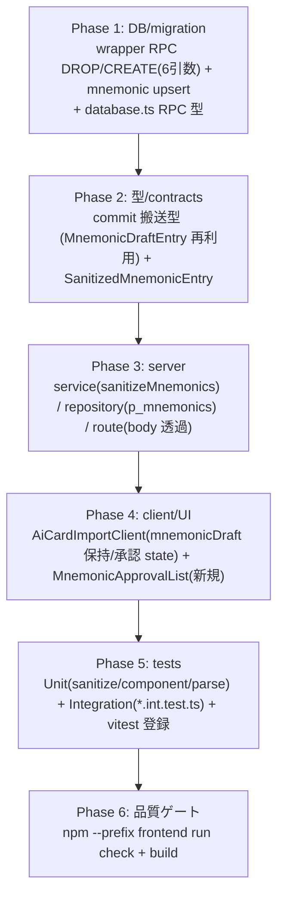
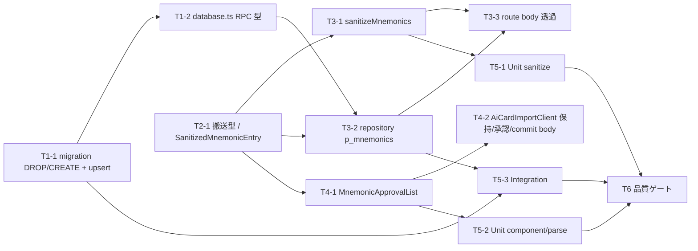

# S-16D ニーモニック承認 UI → card_mnemonics 保存 — 作業計画書

`plan.md` は本 Story 実装の単一情報源。task-executor が 1 回の呼び出しで全フェーズを依存順に実装する。
`tasks/` や個別 task ファイルは作らない。全変更は `design.md`（正本）と `ADR-012` の決定に厳密整合させる。

UI を含むが Figma UI 仕様は本 Story に存在せず（`specs/stories/S-16D-approval-ui/ui-design/` なし）、Playwright も未導入。
したがって `ui_design: none` とし、UI タスクの完了条件は `/rp-frontend:ui-review` ではなく **手動デザイン/アクセシビリティ確認**
（frontend.md 準拠）を用いる。

## 前提と参照

- 設計正本: `specs/stories/S-16D-approval-ui/design.md`
- 要件: `specs/stories/S-16D-approval-ui/requirements.md`（AC-1〜AC-6）
- ADR: `specs/adr/ADR-012-mnemonic-approval-commit-write-boundary.md`（書き込み位置・key 解決・搬送・owner 境界の正本）、
  `specs/adr/ADR-011`（preview-token / `importRequestHash` 契約と DB 再検証の正本＝不破壊）
- 影響対象（design §10 影響マップに一致・6 実装ファイル + テスト + vitest 登録）:
  - `supabase/migrations/20260722000000_s16_commit_generated_import_mnemonics.sql`（**新規**: wrapper RPC を DROP/CREATE で拡張）
  - `frontend/src/types/database.ts`（`commit_generated_import_async.Args` に `p_mnemonics?: Json | null` 追加）
  - `frontend/src/lib/ai-import/service.ts`（`parseCommitInput` / `commitCardImport` に mnemonic parse・再検証・再サニタイズ）
  - `frontend/src/lib/ai-import/app-ai-repository.ts`（`commit` で `p_mnemonics` を RPC へ渡す）
  - `frontend/app/api/ai/imports/commit/route.ts`（body の `mnemonics` を透過。変更なし〜極小）
  - `frontend/app/(auth)/decks/[deckId]/ai/new/AiCardImportClient.tsx`（`mnemonicDraft` 保持・承認 state・commit body 同梱）
  - `frontend/src/components/ai-card-import/MnemonicApprovalList.tsx`（**新規**: concept 単位 slots/explanation 編集・承認 UI）
  - `frontend/vitest.config.ts`（S-16D tests を include allowlist へ登録。**S-16C と同一必須手順**）
  - `specs/stories/S-16D-approval-ui/tests/*.{test,test.tsx,int.test}.ts(x)`（新規テスト・相対 import）
- 再利用（新基盤を作らない）:
  - `frontend/src/lib/ai-import/normalize.ts`（`normalizeDisplayText`＝NFKC / `isUnicodeScalarText`）
  - `frontend/src/lib/ai-card-generation/contracts.ts`（`MnemonicDraftEntry` / `MnemonicSlotsDraft` / `MnemonicExplanationDraft`）
  - `frontend/src/lib/ai-import/schema.ts`（`validateImportRequest`＝`conceptId` 突合の正本）
  - `frontend/src/lib/ai-import/preview-token.ts`（5 キー token・`importRequestHash` 契約）
- 不変（触れない）:
  - `supabase/migrations/20260715000000_...`（内側 `commit_import_async`＝共有 primitive・key materialize）
  - `supabase/migrations/20260720000004_...`（`s14_remote_commit_import`＝Remote MCP 経路）
  - `supabase/migrations/20260721000001_...`（`card_mnemonics` table / RLS。DDL 追加なし・既存へ書くのみ）
  - `preview-token.ts` / `canonical-request.ts` / `schema.ts` の契約（5 キー shape・hash 被覆範囲）
  - `ClientImportItemInput` / import request schema（mnemonic を持ち込まない。別チャネル搬送）
  - `DraftCardList.tsx`（front/back/tags/画像編集は不変。承認欄は別コンポーネントへ分離）

## 必須停止ポイント（core-principles「停止・確認が必要な変更」）

以下は実装着手前・適用前にレビューゲートで確認する。

- **RPC signature 変更（DROP/CREATE）と認証境界**: `commit_generated_import_async` を 5→6 引数へ変更（Phase 1）。
  `SECURITY DEFINER` 経由で owner-scoped RLS を迂回して `card_mnemonics` を書くため、owner 固定規律と関数 owner
  （`s10_migration_owner`）を catalog で確認する（common-failure #17）。
- **upload concept への explanation 保存の可否**（design §7.3 / §13-1 未解決事項）: 既定は
  「承認済みかつ `illustration_key` を持つ concept（`ai` + `upload`）を保存」。upload への explanation 保存を許容するかを
  最終確認する。**否認された場合は Phase 1 の join 条件へ `image_mode='ai'` 限定を追加**（実装分岐点を Phase 1 に明記）。
- **E2E 導入の是非**（design §11 / §13-3）: Playwright 未導入。「生成→編集→承認→commit」の hosted E2E は本 plan に
  `test:e2e` を入れず、別判断としてレビューゲートへ残置する（common-failure #1/#11/#18）。

## フェーズ構成図

## タスク依存関係図

依存は最大 2 階層。並列可能: Phase 2 完了後に T3-1 / T3-2 と Phase 4 の UI は独立実装可（結線は Phase 5 のテストで確認）。

---

## Phase 1: commit RPC 拡張（新 migration）と DB 型更新（AC-2 / AC-5）

- 対象 requirement / design: AC-2, AC-5 / design §7, ADR-012 決定1/2/3
- 対象ファイル:
  - `supabase/migrations/20260722000000_s16_commit_generated_import_mnemonics.sql`（新規）
  - `frontend/src/types/database.ts`
- 先行 dependency: なし
- **停止ポイント**: RPC signature 変更・認証境界（上記「必須停止ポイント」）。適用は隔離 DB で行い catalog 確認する。

### T1-1: wrapper `commit_generated_import_async` を DROP/CREATE で 6 引数へ拡張し mnemonic upsert を追加
- 変更概要（design §7.1 / §7.2、ADR-012 決定2）:
  - `DROP FUNCTION IF EXISTS public.commit_generated_import_async(uuid,text,text,jsonb,text);`
  - `CREATE FUNCTION public.commit_generated_import_async(p_actor_user_id uuid, p_idempotency_key text,
    p_import_request_hash text, p_request jsonb, p_card_reservation_key text, p_mnemonics jsonb DEFAULT NULL)`
    `RETURNS jsonb LANGUAGE plpgsql SECURITY DEFINER SET search_path = pg_catalog, pg_temp`。
  - **既存本体を移植**（`20260718000006_...` の現行実装から）: 引数検証・advisory lock・reservation 調整・
    内側 `commit_import_async(...)` 呼出。**変更点は「早期 RETURN せず result に集約し、mnemonic upsert 後に RETURN」**。
    内側 primitive `commit_import_async` は呼ぶだけで**一切変更しない**（ADR-012 決定3・Remote MCP 共有）。
  - `target_batch_id := (result->>'batchId')::uuid;` を得た後、`p_mnemonics IS NOT NULL` のとき:
    - 構造ガード: `jsonb_typeof(p_mnemonics) <> 'array'` なら `ai_raise_import_error('VALIDATION_ERROR', ...)`。
    - `jsonb_array_elements(p_mnemonics)` をループし、各 entry の `conceptId` / `slots` / `explanation` を取り出す。
    - **key は捏造せず materialize 済み行から join 解決**（design §7.2）:
      `ai_import_concept_jobs jobs JOIN illustrations ill ON ill.id = jobs.illustration_id`
      を `jobs.batch_id = target_batch_id AND jobs.owner_user_id = p_actor_user_id
      AND jobs.concept_id = <entry.conceptId> AND ill.owner_user_id = p_actor_user_id` で絞り `ill.illustration_key` を取得。
    - `resolved_key IS NULL` の concept（`image_mode='none'`＝illustration 行なし、または未知 conceptId）は `CONTINUE`（skip）。
    - `INSERT INTO public.card_mnemonics (owner_user_id, illustration_key, slots, explanation, status)
      VALUES (p_actor_user_id, resolved_key, <slots>, <explanation>, 'approved')
      ON CONFLICT (owner_user_id, illustration_key) DO UPDATE SET slots=EXCLUDED.slots,
      explanation=EXCLUDED.explanation, status='approved', updated_at=now();`（owner は必ず `p_actor_user_id`。client 由来値を使わない）。
    - **upload 限定分岐（停止ポイントの結果で確定）**: レビューで「ai 限定」に決した場合のみ、join に `jobs.image_mode = 'ai'`
      相当の条件を追加する。既定は ai + upload 双方保存。
  - `RETURN result;`（202 `{batchId,status:'queued',statusUrl}` 形は不変）。
  - **common-failure #17 の完全 signature 権限句を同一 migration に含める**:
    - `ALTER FUNCTION public.commit_generated_import_async(uuid,text,text,jsonb,text,jsonb) OWNER TO s10_migration_owner;`
    - `REVOKE ALL ON FUNCTION ...(uuid,text,text,jsonb,text,jsonb) FROM PUBLIC, anon, authenticated;`
    - `GRANT EXECUTE ON FUNCTION ...(uuid,text,text,jsonb,text,jsonb) TO service_role;`
- 完了条件:
  - migration が隔離 DB で適用でき、`pg_proc` 上で 6 引数版が `s10_migration_owner` 所有・`search_path` 固定・
    grant が service_role のみであることを確認（Phase 5 int で assert）。
  - 既存 5 引数呼出は存在しなくなり（DROP 済み）、`p_mnemonics` 未指定（NULL 既定）で従来挙動（後方互換）。
  - 原子性: illustration 行と card_mnemonics 行が同一トランザクションで all-or-nothing（design §7.3）。
  - 冪等性: 同一 `idempotencyKey` 再 commit で二重化せず `ON CONFLICT DO UPDATE` で最新承認内容へ更新。
  - 内側 `commit_import_async` と `card_mnemonics` DDL・`s14_remote_commit_import` は無変更。

### T1-2: `database.ts` の RPC Args 更新
- 変更概要（design §7.5）:
  - `frontend/src/types/database.ts` の `commit_generated_import_async` の `Args` へ `p_mnemonics?: Json | null` を追加。
    既存キー（`p_actor_user_id` / `p_idempotency_key` / `p_import_request_hash` / `p_request` / `p_card_reservation_key`）と
    `Returns` は不変。
- 完了条件:
  - typecheck 0 / lint 0。`card_mnemonics` の table 型（既存 `:551`）は不変。

---

## Phase 2: commit 搬送型と contracts（AC-2 / AC-3 支援）

- 対象 requirement / design: AC-2, AC-3 / design §4, §6.2
- 対象ファイル: `frontend/src/lib/ai-import/service.ts`（型定義箇所）。`contracts.ts` は**再利用のみ**（新型を足さない）。
- 先行 dependency: なし（Phase 1 とは独立実装可）

### T2-1: `CommitMnemonicEntry` / `SanitizedMnemonicEntry` を service に定義（contracts 再利用）
- 変更概要（design §4 mnemonic 搬送型）:
  - `contracts.ts` の `MnemonicSlotsDraft` / `MnemonicExplanationDraft` を **type-only import** で再利用し、
    `interface CommitMnemonicEntry { readonly conceptId: string; readonly slots: MnemonicSlotsDraft;
    readonly explanation: MnemonicExplanationDraft; }` を service（または近接の型モジュール）へ定義。
  - サニタイズ後を表す `type SanitizedMnemonicEntry = CommitMnemonicEntry;` を定義（NFKC + length-cap + mappings 2–4 済みの意図）。
  - `AiImportRepository.commit` の入力型へ `readonly mnemonics?: readonly SanitizedMnemonicEntry[];` を追加（optional）。
    Remote MCP repository は未設定＝NULL 相当で従来挙動（interface 互換・design §6.2 / §10 マトリクス）。
- 完了条件:
  - 型は readonly。`ClientImportItemInput` / import request schema へ mnemonic を足していない（別チャネル維持）。
  - typecheck 0 / lint 0。

---

## Phase 3: commit 経路の mnemonic 対応（service / repository / route）（AC-2 / AC-3 / AC-5）

- 対象 requirement / design: AC-2, AC-3, AC-5 / design §6.2, §8, ADR-012 決定4/5
- 対象ファイル:
  - `frontend/src/lib/ai-import/service.ts`
  - `frontend/src/lib/ai-import/app-ai-repository.ts`
  - `frontend/app/api/ai/imports/commit/route.ts`
- 先行 dependency: Phase 1（`database.ts` 型 / RPC）, Phase 2（搬送型）

### T3-1: `parseCommitInput` 拡張と `sanitizeMnemonics` の新規実装（第一防衛線・AC-3 / AC-5）
- 変更概要（design §6.2、ADR-012 決定5）:
  - `parseCommitInput` を拡張し optional `mnemonics`（array of record）を取り出す。**未指定・空配列は許容**（従来 commit と同一挙動）。
    型不一致（配列でない等）は `VALIDATION_ERROR`。
  - `commitCardImport` 内で `validateImportRequest`（既存）で request を検証後、その `data.items[].conceptId` 集合を作る。
  - 新規 `sanitizeMnemonics(entries, allowedConceptIds): SanitizedMnemonicEntry[]`:
    - `conceptId` が allowed に無ければ `VALIDATION_ERROR`。重複 `conceptId` も `VALIDATION_ERROR`。
    - 各テキストへ `isUnicodeScalarText` チェック → `normalizeDisplayText`（NFKC）を適用（normalize.ts 再利用）。
    - length-cap（code point 基準 `Array.from().length`、既存 schema と同方式）:
      `slots.kanji` 1–16 / `shapeHint.part` / `shapeHint.picture` / `meaningHint` / `story` 各 1–100 /
      `explanation.summary` 1–120 / `mappings[].part` / `mappings[].meaning` 各 1–100。
    - `slots.isSingleKanji` は boolean 必須（非 boolean は `VALIDATION_ERROR`）。
    - `explanation.mappings` は **2 件未満 / 4 件超を拒否**（`VALIDATION_ERROR`）。範囲外・型不一致・欠損キーはすべて `VALIDATION_ERROR`。
  - サニタイズ済み entries を `repository.commit({ ..., mnemonics })` へ渡す。**owner は渡さない**（RPC が `p_actor_user_id` で固定）。
  - `verifyPreviewToken`（既存）は不変。mnemonics は token 検証に一切関与しない（ADR-012 決定4）。検証失敗を空配列や成功へ潰さない。
- 完了条件:
  - length-cap は S-16C の maxLength と乖離させない（forward-fix 時は同時調整）。
  - 未指定 commit は従来どおり成功。不正 mnemonic は `VALIDATION_ERROR`（400）。typecheck 0 / lint 0。

### T3-2: `app-ai-repository.commit` で `p_mnemonics` を RPC へ渡す（AC-2）
- 変更概要（design §6.2, §10）:
  - `rpc("commit_generated_import_async", {...})` の引数へ `p_mnemonics: mnemonics ?? null` を追加（他引数は不変）。
    `mnemonics` 未指定時は `null` を渡し従来挙動。
- 完了条件:
  - service-role client 経由の既存呼出形が壊れない。typecheck 0 / lint 0。

### T3-3: commit route の body 透過（変更なし〜極小・AC-6 境界）
- 変更概要（design §6, §10）:
  - `frontend/app/api/ai/imports/commit/route.ts` は body（`mnemonics` を含む）を `commitCardImport` へ透過。
    `auth.getUser()`・`confirmedWarnings`・`safeError` は不変。route での mnemonic 検証はしない（service を第一境界とする）。
- 完了条件:
  - route 差分は無しまたは型追従のみ。未認証は 401・副作用 0（既存踏襲）。

---

## Phase 4: 承認 UI（`MnemonicApprovalList` 新規 + `AiCardImportClient` 拡張）（AC-1 / AC-3 / AC-4）

- 対象 requirement / design: AC-1, AC-3, AC-4 / design §6.1
- 対象ファイル:
  - `frontend/src/components/ai-card-import/MnemonicApprovalList.tsx`（新規）
  - `frontend/app/(auth)/decks/[deckId]/ai/new/AiCardImportClient.tsx`
- 先行 dependency: Phase 2（搬送型）。commit body 同梱は Phase 3 の service 契約に整合させる。
- **UI 検証方針**: `ui_design: none`（Figma なし・Playwright 未導入）のため各 UI タスクは**手動デザイン/アクセシビリティ確認**で完了とする。

### T4-1: `MnemonicApprovalList.tsx`（新規）— concept 単位の編集・承認 UI（AC-1 / AC-3 / AC-4）
- 変更概要（design §6.1）:
  - props は serializable な draft / 承認 state のみ（**secret を受け取らない**＝server-only 露出なし・design §8）。
  - concept 単位に slots を controlled state で編集（`defaultValue` に頼らない・coding-standards の編集 UI 規約）:
    `kanji` / `isSingleKanji`（`kanji` の code point 数からの**自動判定＋手動トグル**）/ `shapeHint.part` /
    `shapeHint.picture` / `meaningHint` / `story`、および explanation の `summary` / `mappings[]`。
  - `mappings` の追加・削除ボタン（**2–4 件の範囲でのみ活性**。1 件時は削除不可、4 件時は追加不可）。
  - concept 単位の承認トグル。承認可否は client バリデーション（全必須欄が length-cap 内・`mappings` 2–4・非空）で判定し、
    未充足なら承認ボタンを非活性。
  - `image='ai'` かつ未承認の concept に「ニーモニック未承認：画像は生成されません」を明示（`aria-live` / 意味的 HTML）。
  - 二重送信防止のため `busy` で操作可否を明示。48px 以上の touch target、色のみに依存しない状態表現、
    長文日本語・200% zoom の overflow 回避（frontend.md 準拠）。
- 完了条件:
  - 初期値が `mnemonicDraft` から表示され、編集・承認トグル・mappings 増減が動作。
  - 手動確認: accessible name / keyboard 操作 / 主要 touch target / 未承認警告の表示（対象ページ:
    `http://localhost:3000/decks/[deckId]/ai/new`、console / network error なし）。
  - typecheck 0 / lint 0。

### T4-2: `AiCardImportClient.tsx` — `mnemonicDraft` 保持・承認 state・commit body 同梱（AC-1 / AC-4）
- 変更概要（design §6.1, §5 データフロー）:
  - `parseGeneratedResult`（現状 491–523 で envelope の `mnemonicDraft` を破棄）を拡張し **`mnemonicDraft` を保持**する。
  - 承認・編集 state を `conceptId` を key にした map で保持（例 `Map<conceptId, { slots, explanation, approved }>`）。
    初期値は生成 envelope の `mnemonicDraft`。
  - **再 preview では承認 state を上書きしない**: 再 preview 応答（`/api/ai/imports/preview`）に `mnemonicDraft` は含まれない
    （design §3）。`request.items` の `conceptId` は不変のため、この map を維持し再 preview 越しに承認 state を保つ。
  - `MnemonicApprovalList` を描画に接続（`DraftCardList` とは責務分離。DraftCardList は不変）。
  - `commit()` の body へ**承認済み concept のみ**の `mnemonics: [{conceptId, slots, explanation}]` を追加。
    未承認 concept・`image='none'` concept は送らない（サーバ側 join でも自然に除外されるが client も承認済みのみ送る）。
    preview-token / `importRequestHash` は不変（mnemonic を token に相乗りさせない・ADR-012 決定4）。
- 完了条件:
  - 生成→編集→承認→commit で承認済み mnemonics が body に載る。再 preview 後も承認 state が維持される。
  - preview state（`request` / `preview{...}`）の既存 shape は不変。server-only secret を client bundle へ露出しない。
  - typecheck 0 / lint 0。

---

## Phase 5: テスト（AC-1〜AC-5 の検証 / design §11）

- 対象 requirement / design: AC-1〜AC-5 / design §11（L1 / L2）
- 先行 dependency: Phase 1〜4
- テスト配置（design §11 / testing-guide 準拠・S-16C plan と同方針）:
  - 新規に **`specs/stories/S-16D-approval-ui/tests/`** 配下へ置く（S-12 / S-16C と同じ相対 import 方式
    `../../../../frontend/src/...`）。実装近接の component test も許容するが、本 plan では specs 配下へ集約する。
  - Unit / component: `specs/stories/S-16D-approval-ui/tests/mnemonic-approval.test.ts` / `.test.tsx`
  - Integration: `specs/stories/S-16D-approval-ui/tests/mnemonic-approval.int.test.ts`（`S10_TEST_DATABASE_URL` 必須）
  - **vitest 登録（必須）**: `frontend/vitest.config.ts` の `include` allowlist へ次を追加（S-16C と同一の必須手順。
    ルート `vitest.config.mjs` は `check` の対象外）:
    - `"../specs/stories/S-16D-approval-ui/tests/*.test.ts"`（`*.int.test.ts` も本 glob が収集）
    - `"../specs/stories/S-16D-approval-ui/tests/*.test.tsx"`（component test 用）

### T5-1: Unit — `sanitizeMnemonics`（AC-3 / AC-5）
- `mnemonic-approval.test.ts`:
  - `conceptId` allowlist 外拒否 / 重複 `conceptId` 拒否 → `VALIDATION_ERROR`。
  - NFKC 適用の確認（全角→半角等が `normalizeDisplayText` で正規化される）。
  - length-cap 境界: `kanji` 16 OK / 17 NG、`summary` 120 OK / 121 NG、`shapeHint.part`・`meaningHint`・`story`・
    `mappings[].part/meaning` 100 OK / 101 NG（code point 基準）。
  - `mappings` 1 件 NG / 2 件 OK / 4 件 OK / 5 件 NG。`isSingleKanji` 非 boolean 拒否。
  - 未指定・空配列は許容（従来 commit と同一）。

### T5-2: Unit / component — UI と state（AC-1 / AC-3 / AC-4）
- `mnemonic-approval.test.tsx`:
  - `MnemonicApprovalList`: 初期値表示、mappings 追加/削除の 2–4 活性境界、未充足時の承認ボタン非活性、
    未承認 `image='ai'` の警告「ニーモニック未承認：画像は生成されません」表示、accessible name。
  - `AiCardImportClient.parseGeneratedResult`: `mnemonicDraft` を保持し、再 preview 応答（mnemonicDraft なし）で
    承認 state を上書きしないこと（§6.1）。commit body に承認済みのみ載ること（未承認・`image='none'` は非搬送）。

### T5-3: Integration — commit → `card_mnemonics` 保存（AC-2 / AC-4 / AC-5）
- `mnemonic-approval.int.test.ts`（`S10_TEST_DATABASE_URL` 必須・隔離 DB・actor fixture）:
  - commit → `card_mnemonics` に `owner_user_id`=認証ユーザー・`status='approved'`・`illustration_key`=RPC 採番値と一致・
    slots/explanation=承認内容の行が保存される（AC-2）。
  - 冪等: 同一 `idempotencyKey` の再 commit で二重化せず `ON CONFLICT DO UPDATE` で更新（AC-2）。
  - `image_mode='none'` concept は 0 行、未承認 concept は 0 行（AC-4）。
  - RLS: 別 actor による `card_mnemonics` の select / insert 拒否（AC-5）。
  - `s10_migration_owner` が RLS を迂回して書けること・関数 owner / grant / `search_path` の catalog 確認（design §7.4、common-failure #17）。
  - server 側 `VALIDATION_ERROR`: `mappings` 1 件 / 5 件、allowlist 外 `conceptId` を RPC/service で拒否（AC-3・二段構え）。
- 完了条件（Phase 5 全体）:
  - Unit / component / Integration がすべて green。`test.skip` / `.only` / 弱い assertion を残さない。未解決テスト 0 件。
  - vitest allowlist 登録により `check` の `vitest run` に収集される。

---

## Phase 6: 品質ゲート（AC-6）

- 対象 requirement: AC-6
- 実行コマンドと期待結果:
  - `npm --prefix frontend run check`（lint + typecheck + vitest）→ 全 pass、lint / 型 0 エラー。
  - `npm --prefix frontend run build` → 成功（**必須**: route / Server-Client 境界変更を含むため。requirements AC-6 / design §11）。
- 完了条件:
  - `check` と `build` 完全 pass。AC-1〜AC-6 すべて対応テスト green（下表）。
  - 変更は上記「影響対象」に限定され、不変ファイル（内側 primitive / Remote MCP / `card_mnemonics` DDL / preview-token 契約）は無変更（最小差分）。
  - int test は `S10_TEST_DATABASE_URL` 未設定なら unit 成功と混同せず未実施理由を明記（testing-guide / MEMORY）。

---

## 受入条件 → テスト対応表

| AC | 内容 | 対応 Phase / テスト |
|---|---|---|
| AC-1 | slots/explanation を `mnemonicDraft` 初期値で編集フォーム表示、承認して commit 可 | Phase 4 T4-1 / T4-2・T5-2 component/state |
| AC-2 | commit 成功後 `card_mnemonics` に owner・`status='approved'`・key 一致・slots/explanation=承認内容、冪等 upsert | Phase 1 T1-1 / T5-3 int |
| AC-3 | `mappings` 2–4 を client と server 双方で保存前に拒否、追加/削除操作 | Phase 3 T3-1（server）/ Phase 4 T4-1（client）/ T5-1・T5-2・T5-3 |
| AC-4 | 未承認 concept は 0 行、`image='ai'` 未承認は「画像は生成されません」表示 | Phase 4 T4-1/T4-2 / T5-2・T5-3 int（0 行） |
| AC-5 | 他 owner の read/write 不可（RLS 最終防衛線・owner はセッション由来） | Phase 1 T1-1（owner 固定）/ T5-3 int（別 actor 拒否） |
| AC-6 | `npm --prefix frontend run check` 通過（境界変更のため `build` も） | Phase 6 |

---

## リスクと緩和

| リスク | 検知 | 緩和 |
|---|---|---|
| RPC の owner が migration 実行 role のまま（`SECURITY DEFINER` owner 暗黙）で RLS 迂回書き込みが失敗/誤動作 | int test の別 actor / catalog query | 完全 signature の `ALTER FUNCTION ... OWNER TO s10_migration_owner`・REVOKE/GRANT を同一 migration に含め、`pg_proc` で違反 0 件を確認（common-failure #17） |
| 内側 `commit_import_async` を誤って変更し Remote MCP へ波及 | code review / Remote MCP 既存 int | wrapper のみ DROP/CREATE。内側 primitive と `s14_remote_commit_import` は無変更（ADR-012 決定3） |
| 早期 RETURN を残し mnemonic upsert が実行されない（既存 2 経路の集約漏れ） | T5-3 int で保存 0 行として検出 | 冪等再 commit / 新規の両経路を result に集約し upsert 後に RETURN（design §7.1） |
| key 生成式を wrapper へ複製し drift | code review / T5-3 の key 一致 assert | 式を複製せず `jobs ⋈ illustrations` join で materialize 済み値を解決（ADR-012 決定2） |
| 再 preview で承認 state を上書き・喪失 | T5-2 の parseGeneratedResult テスト | `conceptId` map を維持し再 preview 応答で上書きしない（design §6.1） |
| mnemonic が preview-token / hash に混入し契約破壊 | preview-token の 5 キー shape テスト（既存） | mnemonic は commit body 別フィールド搬送・token 非被覆（ADR-012 決定4） |
| server サニタイズが厳しすぎ承認を弾く | 承認済みが `VALIDATION_ERROR` になるログ | length-cap を S-16C maxLength と乖離させず forward-fix で同時調整（design §12） |
| upload concept への explanation 保存可否が未確定 | レビューゲート | 既定 ai+upload 保存。ai 限定に決した場合のみ join へ `image_mode='ai'` 条件追加（停止ポイント・design §13-1） |
| 大量 concept 時の upsert 性能 | T5-3 int（`IMPORT_REQUEST_LIMITS` 上限で実測） | 既存 illustration ループと同オーダー。上限内で確認（design §13-4） |

---

## スコープ外（design §1 非ゴール）

- 画像生成トリガー（S-16E）・答え側の説明表示（S-16F）。
- Remote MCP 経由の承認（共有 primitive `commit_import_async` は不変。app_ai / cookie 認証経路のみ）。
- preview-token / `importRequestHash` の契約変更（5 キー shape・hash 被覆範囲を一切変更しない）。
- `card_mnemonics` の table / RLS 変更（S-16A で確定済み。既存 table へ書くのみ・DDL 追加なし）。
- 新 feature flag（既存 `isAiCardImportEnabled` を流用）。
- `ClientImportItemInput` / import request schema へ mnemonic を持ち込む変更（別チャネル搬送を維持）。
- Hosted E2E（Playwright 未導入。別判断としてレビューゲートへ残置。`test:e2e` を plan に入れない）。
