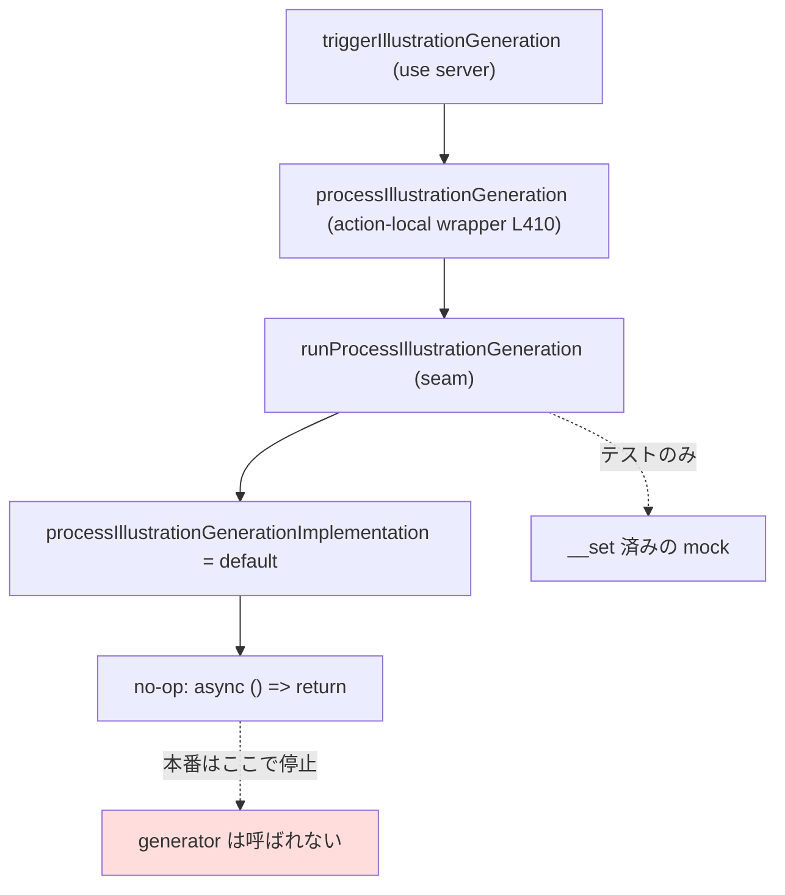
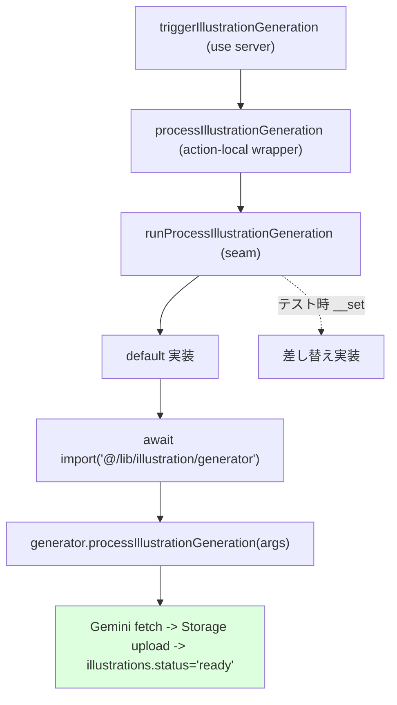

# Design Doc: S-16G 生成 runtime を本番登録して no-op を解消

## 1. 目的 / スコープ / 非スコープ

### 目的

`runProcessIllustrationGeneration`（`frontend/src/actions/illustration-generation-runtime.ts`）が呼ぶ
実装の default が no-op（`async () => { return; }`）であるため、本番の server 実行時に実生成ロジック
`processIllustrationGeneration`（`frontend/src/lib/illustration/generator.ts`）へ到達せず、
承認 slots があっても Gemini 生成・Storage upload・`illustrations.status='ready'` 遷移が発生しない。
本 story はこの **seam の本番配線のみ** を行い、本番 default で実ロジックに到達させる。

### スコープ（In Scope）

- seam の default 実装を実 `processIllustrationGeneration` へ委譲するよう配線する（唯一の機能変更）。
- server-only 境界の明示ガードを実生成モジュールへ適用する（後述の条件付き）。
- seam 回帰テスト（本番 default 経路 / setter 温存）を追加する。

### 非スコープ（Out of Scope）

- 旧 ready 画像の一括再生成。
- プロンプトテンプレ / slots スキーマ / 承認 UI / 答え側表示（S-16B〜F 対応済み）の変更。
- schema / migration / RLS / Storage policy / 認証境界の変更（本 story では一切なし）。
- 承認判定・pending 化・生成起動制御（`resolveShouldStartGeneration`）・fire-and-forget・失敗時 `model_info` 記録
  （S-08 / S-16E 実装済み、変更不要）。
- 専用ジョブ基盤（Queue / Worker / Edge Function / `after()`）への移行（ADR-004 で Future）。

## 2. 合意事項チェックリスト

| # | 合意事項 | 分類 | 設計への反映 |
|---|---|---|---|
| 1 | 変更は seam 配線に限定し最小差分 | スコープ | 変更ファイルは 3 点のみ（§8） |
| 2 | 引数 shape はアダプタ不要（両者一致） | 制約 | §6 で確認、変換なしで委譲 |
| 3 | 承認判定 / pending 化 / 起動制御 / fire-and-forget / 失敗時記録は既存維持 | 非スコープ | `triggerIllustrationGeneration` と `generator` 本体は無変更 |
| 4 | `__set/__reset...ForTest` を温存 | 制約 | §5 決定 + §7 テストで固定。`__reset` の復元先契約変更を明記 |
| 5 | server-only secret をブラウザバンドルへ露出しない | セキュリティ | §4 で境界・検証手順を定義 |
| 6 | `server-only` パッケージ追加は stop-and-confirm | 制約 | §4 で resolve 可否のフォールバックと停止条件を明記 |
| 7 | パフォーマンス測定は要件化されていない（fire-and-forget 応答性は S-08 既存担保） | パフォーマンス | 新規測定なし。ADR-004 の応答 p95 契約を継承 |

## 3. 現状のコールグラフと問題（no-op 経路）

### 現行構成調査（再利用するコード）

- `frontend/src/actions/illustration-actions.ts`（`"use server"`）: `triggerIllustrationGeneration(cardId)` が
  認証・owner 検証・承認 mnemonic 検証・pending 化・起動制御を行い、
  局所ラッパ `processIllustrationGeneration(args)`（同ファイル L410-414）を `void ...catch(...)` で fire-and-forget 起動する。
- `frontend/src/actions/illustration-generation-runtime.ts`（seam。`"use server"` ではない純モジュール）:
  `runProcessIllustrationGeneration(args)` が可変の実装ポインタ `processIllustrationGenerationImplementation` を呼ぶ。
  default は **no-op**。`__set.../__reset...ForTest` で差し替え可能。
- `frontend/src/lib/illustration/generator.ts`: 実ロジック `processIllustrationGeneration(input, dependencies = {})`。
  第2引数を省略すると実 default 依存（`getEnvConfig` / `createServiceRoleClient` / `generatePrompt` /
  `generateIllustration` / `buildIllustrationStoragePath` / `uploadIllustration` / `now`）を使用する。

### 現状のフロー（本番で生成が走らない）



問題: 実 `generator.processIllustrationGeneration` へ到達する経路が「テスト用 setter」しか無く、
本番では default = no-op で停止する。「登録し忘れ → no-op 再発」が構造的に起きうる状態。

### 目標フロー（配線後）



## 4. 選択肢比較（A / B / C）と決定

配線機構として次の 3 案を比較する。いずれも「本番 default が実ロジックへ到達する」ことは満たしうるが、
seam の静的グラフ純度・登録忘れ耐性・依存追加の有無で差が出る。

### Option A: seam default から generator を **静的 import** して委譲

- 概要: `illustration-generation-runtime.ts` の先頭で `import { processIllustrationGeneration } from "@/lib/illustration/generator"` し、default 実装がそれを直接呼ぶ。
- 利点:
  - 実装が単純で、default が確実に実ロジックへ到達する。
  - 「登録忘れ」状態を持たない。
- 欠点:
  - seam モジュールの静的グラフに generator（さらに env / supabase service-role / gemini-client / storage / prompt）が常時載る。
  - seam から `__set/__reset` だけを import する既存テスト（`illustration-actions.test.ts`）が、
    generator の重い依存ツリーを不要に load する（テストの独立性・起動コスト面で劣る）。
  - `server-only` を generator に付けると、seam を静的 import する経路が client に混入した場合の失敗点が seam まで広がる。

### Option B（採用）: seam default 内で **遅延 `await import("@/lib/illustration/generator")`** して委譲

- 概要: default 実装を `async (args) => { const { processIllustrationGeneration } = await import("@/lib/illustration/generator"); await processIllustrationGeneration(args); }` にする。
- 利点:
  - seam の**静的**グラフを純粋に保つ（generator とその重い依存を静的に取り込まない）。
    → `__set` を使う既存テストは generator を load しない。
  - 本番 default が実ロジックへ到達し、no-op を構造的に解消する。
  - default 自体が実委譲なので「登録し忘れ → no-op 再発」が原理的に起きない（登録状態を持たない）。
  - dynamic import は module cache により冪等。多重呼び出し・HMR で二重登録・順序問題が発生しない。
- 欠点:
  - 初回呼び出し時に generator chunk を遅延解決する（server 実行の初回のみ、fire-and-forget 内なのでユーザ応答に影響しない）。
  - 静的解析だけを見ると委譲先が動的に見える（コメントで契約を明記して緩和）。

### Option C: `server-only` 登録モジュール新設 + `instrumentation.ts` の `register()` で `__set`

- 概要: default は no-op のまま残し、server 起動時 hook（`instrumentation.ts` の `register()`）で
  `__set` を呼び実ロジックを登録する。
- 利点:
  - 明示的な「登録ポイント」が 1 箇所に集約される。
- 欠点（非推奨の根拠）:
  - default が no-op のまま残るため、`register()` が走らない実行文脈（登録未実行・edge/別 runtime・hook 未発火）で
    **同一バグ（no-op）が再発**しうる。本 story が解消すべき失敗モードをそのまま残す。
  - `register()` は起動ごと・HMR で複数回実行されうるため、多重 `__set` / 登録順序に依存する。
  - コードベースに `instrumentation.ts` は現状存在せず（新規導入）、`server-only` の import 使用も現状ゼロ。
    Option C は「登録モジュール + instrumentation 導入 + (必要なら)server-only 依存追加」と、最小差分から最も遠い。
  - story hint ではあるが、no-op 温存という本質的リスクにより不採用。

### 比較マトリクス

| 評価軸 | Option A 静的 import | Option B 遅延 import（採用） | Option C instrumentation 登録 |
|---|---|---|---|
| 本番 default が実ロジック到達 | 到達 | 到達 | 登録実行時のみ到達 |
| no-op 再発の構造的排除 | あり | あり | なし（未登録で再発） |
| seam 静的グラフ純度 | 低（generator 常時同梱） | 高 | 中（no-op のまま） |
| 既存 `__set` テストの依存 load | generator を load | load しない | load しない |
| 多重登録 / 順序リスク | なし | なし | あり |
| 追加ファイル / 依存 | なし | なし | 登録 module + instrumentation(+server-only) |
| 最小差分 | 中 | 高 | 低 |

### 決定

**Option B を採用する。** 遅延 `await import()` により (1) 本番 default が実ロジックへ到達して no-op を解消し、
(2) seam の静的グラフを純粋に保ち既存 `__set` テストへ generator の重い依存を持ち込まず、
(3) 登録状態を持たないため多重登録・順序・登録忘れの各リスクを構造的に排除できる。
Next.js 14 App Router では Server Action（`"use server"`）経由の server（Node.js runtime）実行内で dynamic import が
標準サポートされ、fire-and-forget（`void ...`）の起動と整合する。

## 5. `__set/__reset` の契約変更と既存テスト影響

- `__setProcessIllustrationGenerationImplementationForTest` / `__resetProcessIllustrationGenerationImplementationForTest`
  は温存する（シグネチャ・エクスポート不変）。
- **契約変更（明記）**: `__reset` の復元先 default が「no-op」から「generator への遅延委譲」へ変わる。
  すなわち reset 後に `runProcessIllustrationGeneration` を呼ぶと（`__set` されていなければ）実 generator へ到達する。
- **既存テストへの影響: なし（確認済み）**:
  - `illustration-actions.test.ts` は `beforeEach` で `__reset` した後、**各テストが必ず `__set(processMock)` してから** trigger する。
    テスト本体実行中は常に `__set` 済みの mock がアクティブで、default 経路（新委譲）を踏まない。
    全 11 ケースが `__set` を呼ぶことを確認済み（未 `__set` で default を踏むケースは存在しない）。
  - `generator.test.ts` は seam を経由せず `processIllustrationGeneration` へ dependencies を直接注入するため、本変更の影響を受けない。

## 6. server / client 境界と secret 非露出の担保・検証手順（AC-3）

### 依存解決（論点 3）

seam default は `generator.processIllustrationGeneration(args)` を **第2引数を省略** して呼ぶ。
これにより generator が実 default 依存（`getEnvConfig` / `createServiceRoleClient` / `generatePrompt` /
`generateIllustration` / `buildIllustrationStoragePath` / `uploadIllustration` / `now`）を束ねる。
seam 側に追加の依存配線は不要。引数 shape は完全一致（下表）のため変換・アダプタも不要。

| runtime `ProcessIllustrationGenerationArgs` | generator `ProcessIllustrationGenerationInput` | 変換 |
|---|---|---|
| `illustrationId: string` | `illustrationId: string` | なし |
| `illustrationKey: string` | `illustrationKey: string` | なし |
| `slots: MnemonicSlots` | `slots: MnemonicSlots` | なし |
| `ownerUserId: string` | `ownerUserId: string` | なし |

generator は runtime を import しないため、runtime → generator の新エッジは循環を生まない（確認済み）。

### secret 非露出の経路担保

- secret 読み取り点は generator 実行時のみ:
  - `getEnvConfig()` が `SUPABASE_SERVICE_ROLE_KEY` / `GEMINI_API_KEY` を（`NEXT_PUBLIC_` でない）server-read の `process.env` から取得。
  - `createServiceRoleClient()` が service-role key で Supabase client を生成。
- 到達経路は `"use server"`（`illustration-actions.ts`）→ seam → **遅延 import** された generator のみ。
  seam は generator を**静的に import しない**ため、generator が client component の静的モジュールグラフへ載る経路が無い。
- **明示ガード（条件付き）**: `frontend/src/lib/illustration/generator.ts` 冒頭に `import "server-only";` を置く。
  - 前提: `server-only` は Next.js 14 の transitive 依存として同梱されるのが通常で、`package.json` 変更なしに resolve できる見込み。
  - resolve できる場合: client 参照グラフへの混入を **build エラー** で即検出できる（AC-3 の第一防衛線）。
  - resolve できない場合（フォールバック）: `import "server-only"` を追加せず、下記の **暗黙ガード**に依存する。
    - generator は `createServiceRoleClient`（`@/lib/supabase/server`）を import する。
      `@/lib/supabase/server` はモジュール先頭で `import { cookies } from "next/headers"` を持つ（server-only モジュール）。
      よって generator を client component から import すると build が失敗する暗黙ガードが既に成立している。
  - **停止条件**: `server-only` を `package.json` へ新規追加する必要が生じた場合は、外部依存追加として
    stop-and-confirm 扱い（core-principles「停止・確認が必要な変更」）とし、独断で追加しない。

### 検証手順（AC-3 / AC-5）

1. `npm --prefix frontend run check`（lint + typecheck + test）を通す。
2. `npm --prefix frontend run build` を通す（server-only 境界違反は build エラー化。Server/Client 境界・bundling 変更のため build 必須）。
3. client chunk 非混入の grep 観点（`.next/static/chunks` 配下）:
   - generator 由来シンボル: `processIllustrationGeneration`（generator 実体）、`GEMINI_IMAGE_MODEL`、`GEMINI_PROVIDER` が現れないこと。
   - service-role 経路: `createServiceRoleClient`、`persistSession` を伴う service-role client 生成が現れないこと。
   - secret 値: `SUPABASE_SERVICE_ROLE_KEY` / `GEMINI_API_KEY` の**値**が inline されないこと。
     （補足: これらは `NEXT_PUBLIC_` でない server-read の `process.env` 参照であり、Next.js は `NEXT_PUBLIC_` のみを
     client bundle へ静的置換する。したがって値は元々 client へ inline されない。grep はその不変条件の回帰確認として実施する。）

## 7. べき等性 / 多重登録（論点 4）

- Option B は「登録状態」を持たない（default が実委譲そのもの）。多重登録・順序依存・HMR 再登録の問題は発生しない。
- `await import(...)` は Node.js module cache により冪等。初回のみ解決し、以降はキャッシュ済みモジュールを返す。
- 生成の多重起動抑止は既存担保: `triggerIllustrationGeneration` が `resolveShouldStartGeneration` で
  `ready` / `pending` を no-op、`failed` を retry、レコードなしを insert とし、承認済み mnemonic が無ければ起動しない。
  本 story はここを変更しない。

## 8. 変更対象ファイルと最小差分方針

| 種別 | パス | 変更内容 |
|---|---|---|
| 変更 | `frontend/src/actions/illustration-generation-runtime.ts` | default 実装のみを no-op から「遅延 `await import` で generator へ委譲」に置換。`__set/__reset`・型・export は不変。委譲契約と「登録忘れ防止」意図をコメントで明記 |
| 変更 | `frontend/src/lib/illustration/generator.ts` | 冒頭に `import "server-only";` を追加（resolve 可能な前提。不可なら暗黙ガードにフォールバックし追加しない）。ロジック本体は無変更 |
| 新規 | `frontend/src/actions/illustration-generation-runtime.test.ts` | seam 回帰テスト（AC-1: 本番 default 経路 / AC-4: setter 温存）。generator を `vi.mock` し `__set` せず default を検証 |

`illustration-actions.ts`（trigger 本体）と generator 本体ロジック、既存 2 テストは無変更。

### 統合境界の約束

```yaml
境界名: runProcessIllustrationGeneration -> generator.processIllustrationGeneration
  入力: ProcessIllustrationGenerationArgs { illustrationId, illustrationKey, slots, ownerUserId }
  出力: Promise<void>（非同期。fire-and-forget 起動元が catch でログのみ）
  同期/非同期: 非同期。呼び出し元 triggerIllustrationGeneration は完了を待たない（S-08 既存挙動）
  エラー時: generator 内で失敗を status='failed' + model_info へ収束（既存）。
            起動元の void ...catch はログ出力のみで学習フローを止めない
```

### 変更影響マップ

```yaml
変更対象: illustration-generation-runtime.ts の default 実装
直接影響:
  - frontend/src/actions/illustration-generation-runtime.ts（default 実装差し替え）
  - frontend/src/lib/illustration/generator.ts（server-only 明示ガード追加のみ）
間接影響:
  - 本番 trigger 経路が実 generator に到達（AC-1 成立）
  - __reset の復元先が no-op → 実委譲へ変化（§5 の契約変更。既存テストは無影響）
波及なし:
  - triggerIllustrationGeneration のロジック、承認判定、起動制御、fire-and-forget
  - generator の生成ロジック、Gemini/Storage 連携、model_info 記録
  - schema / RLS / Storage policy / 認証境界 / 型定義 / 外部依存
```

## 9. テスト設計（AC トレーサビリティ）

### 新規テスト（`illustration-generation-runtime.test.ts`）

- 方針: `vi.mock("@/lib/illustration/generator", ...)` で `processIllustrationGeneration` を spy 化。
  `beforeEach` で `__reset`（新 default を active に戻す）。dynamic import はモック済みモジュールへ解決される。
- AC-1（本番 default 経路 / no-op 解消）:
  `__set` せず `runProcessIllustrationGeneration(args)` を呼ぶ → モック generator の
  `processIllustrationGeneration` が **args そのまま** で 1 回呼ばれることを検証（no-op でないことの証明）。
- AC-4（setter 温存）:
  - `__set(customImpl)` → run → `customImpl` が呼ばれ、generator モックは呼ばれない。
  - `__reset` → run → generator モックが呼ばれる（新契約の復元先確認）。

### 既存テスト（回帰）

- AC-2（挙動不変）: `illustration-actions.test.ts` の未承認・ready/pending no-op ケースが green のまま
  （各ケースは `__set` 済みで default を踏まないため本変更の影響なし）。
- generator 単体（`generator.test.ts`）: dependencies 直接注入で seam 非経由。無影響で green のまま。

### AC トレーサビリティ表

| AC | 条件 | 設計要素 | 検証手段 |
|---|---|---|---|
| AC-1 | 本番 default で実 generator が呼ばれ ready まで到達 | §4 Option B（遅延委譲）+ §6 依存省略 | 新規 seam テスト（generator mock、default 経路）＋依存モック統合 |
| AC-2 | 未承認では起動しない（S-16E 不変） | §7（起動制御は既存 trigger）無変更 | 既存 `illustration-actions.test.ts` green |
| AC-3 | secret がブラウザバンドル非露出 | §6（server-only / 暗黙 next/headers ガード、非 NEXT_PUBLIC_ の process.env） | `build` 成功 + `.next/static/chunks` grep |
| AC-4 | `__set/__reset` 温存 | §5 契約 + setter 不変 | 新規 seam テスト（set 上書き / reset 復元） |
| AC-5 | check / build 通過 | §8 最小差分 | `npm --prefix frontend run check` / `... run build` |

### EARS 受入条件

- 契機型: 本番 server 実行で承認済み slots により `runProcessIllustrationGeneration(args)` が呼ばれたとき、
  システムは実 `generator.processIllustrationGeneration(args)` を実行し、Gemini → Storage →
  `illustrations.status='ready'` まで到達すること（no-op でないこと）。
- 遍在型: システムは seam の実装差し替え機構 `__set/__reset...ForTest` を機能させ続けること。
- 選択型: もしテストが実装を `__set` しない場合、システムは default として実 generator へ委譲すること。
- 遍在型: システムは `SUPABASE_SERVICE_ROLE_KEY` / `GEMINI_API_KEY` をブラウザバンドルへ露出しないこと。
- 不測型: もし承認済み mnemonic が存在しない、または既存 illustration が `ready`/`pending` の場合、
  システムは生成を起動しないこと（S-16E 挙動維持）。
- 不測型: もし generator 実行が失敗した場合、システムは `status='failed'` と `model_info` を記録し、
  起動元は学習フローを止めずログ出力のみ行うこと（既存挙動維持）。

## 10. リスクとロールバック

| リスク | 影響 | 対策 |
|---|---|---|
| `server-only` が resolve できない | build 失敗 or 明示ガード不成立 | §6 の暗黙ガード（`next/headers` 経由）へフォールバック。パッケージ追加は stop-and-confirm |
| dynamic import 先の解決が edge runtime 等で異なる | 生成起動失敗 | 本経路は `"use server"` の Node.js runtime のみ。edge 化は非スコープ |
| `__reset` 契約変更を前提とする将来テスト | 予期せぬ実 generator 呼び出し | §5 に契約変更を明記。新規テストで復元先を固定 |
| build 後の client chunk 混入回帰 | secret 露出 | AC-3 の grep 観点を検証手順に常設 |

- ロールバック: 配線（default 実装）を no-op に revert すれば直ちに従来挙動（本番 no-op）へ戻る。
  副作用的な状態を持たないため revert 後の残留状態はない。`server-only` import を追加した場合はその 1 行も revert する。

## 11. ADR 要否

**ADR 不要（想定）。** 本 story は schema / RLS / auth / SRS contract / 外部 provider / 型システム / 公開境界のいずれも変更せず、
既存 Accepted ADR-004（S-08 生成バックエンド境界: owner scoped private / fire-and-forget / fetch 連携 / 最新 ready 1 件規則）の
範囲内の実装配線である。`server-only` は Next.js 14 同梱の transitive 依存の見込みで新規外部依存ではない。
例外: Option C を採用し `server-only` を `package.json` へ新規追加する必要が生じた場合のみ ADR 検討（本設計では Option B 採用のため不要）。

## 12. 未解決の論点

- `server-only` パッケージの実 resolve 可否は、この worktree で `node_modules` 未インストールのため実測未確認。
  実装フェーズ冒頭で `node_modules/server-only` の存在または `require.resolve("server-only")` 相当で確認し、
  可否に応じて §6 の明示ガード / 暗黙ガードを選択する（可否いずれでも AC-3 は担保可能）。

## 参考資料

- `specs/stories/S-16G-generation-runtime-registration/story.md` / `requirements.md`
- `specs/adr/ADR-004-illustration-generation-backend-mvp-decisions.md`（S-08 生成境界・fire-and-forget）
- `specs/adr/ADR-006-illustration-display-state-contract.md`（表示状態契約）
- `specs/adr/ADR-012-mnemonic-approval-commit-write-boundary.md`（承認書き込み境界）
- `.claude/steering/security-standards.md`（secret 実行境界）
- `.claude/steering/architecture/frontend.md` / `shared.md`（Server/Client 境界・型配置）
- Next.js Docs, Server Actions（Next.js 14 stable）: https://nextjs.org/docs/app/api-reference/config/next-config-js/serverActions
- Next.js Docs, `server-only` パッケージ（server/client poisoning）: https://nextjs.org/docs/app/building-your-application/rendering/composition-patterns#keeping-server-only-code-out-of-the-client-environment
