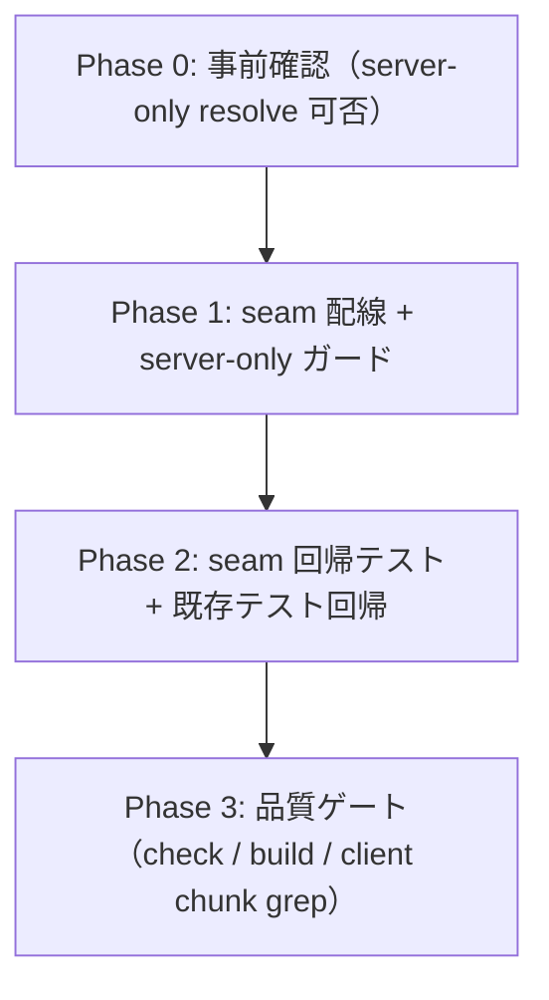
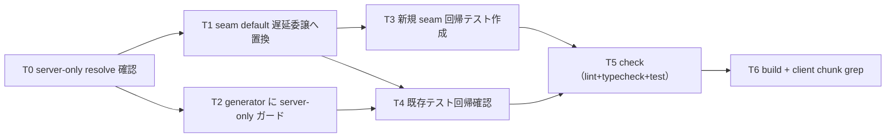

# 作業計画書: S-16G 生成 runtime を本番登録して no-op を解消

本 `plan.md` を実装の単一情報源とする（`tasks/` や個別 task ファイルは作らない）。
採用機構は design.md §4 の **Option B（seam default 内で遅延 `await import` して generator へ委譲）**。
本 story は **seam の本番配線のみ** をスコープとし、trigger 本体・generator ロジック・既存テストは原則無変更とする。

## 対象ファイル（design.md §8 準拠）

| 種別 | パス | 変更内容 |
|---|---|---|
| 変更 | `frontend/src/actions/illustration-generation-runtime.ts` | default 実装のみを no-op から「遅延 `await import` で generator へ委譲」へ置換。`__set/__reset`・型・export は不変。委譲契約と「登録忘れ防止」意図をコメントで明記 |
| 変更 | `frontend/src/lib/illustration/generator.ts` | 冒頭に `import "server-only";` を 1 行追加（resolve 可能な前提。不可なら暗黙ガードへフォールバックし追加しない）。ロジック本体は無変更 |
| 新規 | `frontend/src/actions/illustration-generation-runtime.test.ts` | seam 回帰テスト（AC-1 本番 default 経路 / AC-4 setter 温存）。generator を `vi.mock` し `__set` せず default を検証 |

無変更（波及なし）: `frontend/src/actions/illustration-actions.ts`（trigger 本体）、generator 本体ロジック、
既存 `frontend/src/actions/illustration-actions.test.ts`、`frontend/src/lib/illustration/generator.test.ts`、
schema / migration / RLS / Storage policy / 認証境界 / 型定義 / 外部依存。

## フェーズ構成図



## タスク依存関係図



---

## Phase 0: 事前確認（依存解決の可否判定）

対象 requirement / design: AC-3 / design.md §6・§12（未解決論点）
先行 dependency: なし

この worktree では `node_modules` 未インストールの可能性があり、`server-only` の実 resolve 可否が未確定
（design.md §12）。Phase 1 の分岐（明示ガード / 暗黙ガード）を決めるため最初に確定させる。

### タスク

- [ ] T0: `server-only` パッケージ resolve 可否の確認
  - `frontend/` で `node_modules/server-only` の存在、または `require.resolve("server-only")` 相当で確認する。
  - 可: Phase 1 の generator に `import "server-only";` を追加する（明示ガード。第一防衛線）。
  - 不可: `import "server-only"` を追加せず、`@/lib/supabase/server`（`next/headers` の `cookies` を先頭 import）による
    暗黙ガードへフォールバックする（design.md §6）。
  - **停止条件**: `server-only` を `package.json` へ新規追加する必要が生じた場合は、外部依存追加として
    stop-and-confirm（core-principles「停止・確認が必要な変更」）。独断で追加しない。

完了条件:
- server-only の resolve 可否が判明し、Phase 1 T2 の実施方針（明示 / 暗黙）が確定している。

---

## Phase 1: seam 本番配線 + server-only ガード（唯一の機能変更）

対象 requirement / design: AC-1 / AC-3 / design.md §4 Option B・§6・§8
先行 dependency: Phase 0

### タスク

- [ ] T1: seam default 実装を遅延委譲へ置換（`illustration-generation-runtime.ts`）
  - `defaultProcessIllustrationGenerationImplementation` を no-op（`async () => { return; }`）から
    `async (args) => { const { processIllustrationGeneration } = await import("@/lib/illustration/generator"); await processIllustrationGeneration(args); }` へ置換する。
  - generator の第2引数（dependencies）は **省略** し、実 default 依存を使わせる（引数 shape 完全一致・変換不要。design.md §6）。
  - `__set/__reset...ForTest`・型・export シグネチャは不変のまま温存する。
  - 委譲契約（入力 `ProcessIllustrationGenerationArgs` → `Promise<void>`、fire-and-forget 起動元）と
    「登録忘れ → no-op 再発を構造的に防ぐ」意図、`__reset` の復元先が no-op から実委譲へ変わる契約変更（design.md §5）をコメントで明記する。
  - 静的 import を追加しない（seam 静的グラフを純粋に保つ = Option B の要点）。
  - 完了条件: default 経路が実 generator へ到達する形になり、`__set/__reset` の export/型が不変で typecheck が通る。

- [ ] T2: generator に server-only 明示ガードを追加（`lib/illustration/generator.ts`、Phase 0 で resolve 可の場合のみ）
  - ファイル冒頭に `import "server-only";` を 1 行追加する。ロジック本体は一切変更しない。
  - Phase 0 で resolve 不可だった場合は本タスクをスキップし、暗黙ガード（`next/headers` 経由）へ依存する旨を実装コメント不要のまま記録する。
  - 完了条件: 追加は import 1 行のみ。client 参照グラフ混入が build エラーで検出可能な状態になる（または暗黙ガードで担保）。

完了条件（Phase 1）:
- 本番 default が実 `processIllustrationGeneration(args)` へ到達する（AC-1 の実装成立）。
- generator への secret 到達経路が server-only 境界（明示 or 暗黙）で守られている（AC-3 の実装成立）。
- 差分は seam default 実装置換 + generator の import 1 行のみ（最小差分）。

verification（この時点）: `npm --prefix frontend run typecheck` 相当が通る（全体 check は Phase 3）。

---

## Phase 2: seam 回帰テスト + 既存テスト回帰

対象 requirement / design: AC-1 / AC-2 / AC-4 / design.md §5・§7・§9
先行 dependency: Phase 1

### タスク

- [ ] T3: seam 回帰テスト新規作成（`frontend/src/actions/illustration-generation-runtime.test.ts`）
  - `vi.mock("@/lib/illustration/generator", ...)` で `processIllustrationGeneration` を spy 化する
    （dynamic import はモック済みモジュールへ解決される）。
  - `beforeEach` で `__resetProcessIllustrationGenerationImplementationForTest()`（新 default を active に戻す）＋ `vi.clearAllMocks()`。
  - **AC-1（本番 default 経路 / no-op 解消）**: `__set` せず `runProcessIllustrationGeneration(args)` を呼ぶ →
    モック generator の `processIllustrationGeneration` が **args そのまま** で 1 回呼ばれることを assert（no-op でないことの証明）。
  - **AC-4（setter 温存）**:
    - `__set(customImpl)` → run → `customImpl` が呼ばれ、generator モックは呼ばれない。
    - `__reset` → run → generator モック（実委譲の復元先）が呼ばれる（新契約の復元先確認）。
  - （任意）trigger → 実 generation の配線 1 本を依存モックで確認（generator を実通しし依存を注入。必須ではない）。
  - 完了条件: 上記 3 ケース（AC-1×1 / AC-4×2）が green。`test.skip`/`.only`/弱い assertion を残さない。

- [ ] T4: 既存テストの回帰確認（無変更で green）
  - `frontend/src/actions/illustration-actions.test.ts`: 未承認・`ready`/`pending` no-op ケース含め全ケース green のまま（AC-2）。
    各ケースは `beforeEach` の `__reset` 後に必ず `__set(processMock)` してから trigger するため、default 経路（新委譲）を踏まない（design.md §5 確認済み）。
  - `frontend/src/lib/illustration/generator.test.ts`: dependencies 直接注入で seam 非経由。無影響で green のまま。
  - 完了条件: 既存 2 テストを **無変更** のまま全 green。もし既存テストが赤化したら design.md §5 の前提崩れとして上流（design）へ差し戻す。

完了条件（Phase 2）:
- 新規 seam テストが green（AC-1 / AC-4 成立）。
- 既存テストが無変更 green（AC-2 / __set・__reset 温存の回帰なし）。

verification: `npm --prefix frontend run test`（対象を絞って実行 → 完了前に全体）。

---

## Phase 3: 品質ゲート（check / build / client chunk 非混入）

対象 requirement / design: AC-3 / AC-5 / design.md §6 検証手順
先行 dependency: Phase 2

### タスク

- [ ] T5: `npm --prefix frontend run check`（lint + typecheck + test）通過
  - 期待結果: lint / typecheck / 全 vitest が green。
  - 補足: 既知の env-gated 失敗（`*.int.test.ts` が `S10_TEST_DATABASE_URL` 必須）は本 story の回帰ではない。
    check 実行時に該当が出た場合は原因を切り分け、本変更起因でないことを記録する。

- [ ] T6: `npm --prefix frontend run build` 通過 + client chunk grep（AC-3）
  - build 必須理由: Server/Client 境界・bundling・secret 検証は build でしか検出できない（server-only 境界違反は build エラー化）。
  - build 成功後、`.next/static/chunks` 配下を grep して以下が **現れない** ことを確認する（design.md §6）:
    - generator 由来シンボル: `processIllustrationGeneration`（generator 実体）/ `GEMINI_IMAGE_MODEL` / `GEMINI_PROVIDER`。
    - service-role 経路: `createServiceRoleClient` / service-role client 生成（`persistSession` を伴う）。
    - secret 値: `SUPABASE_SERVICE_ROLE_KEY` / `GEMINI_API_KEY` の**値**が inline されない
      （非 `NEXT_PUBLIC_` の server-read `process.env` 参照であり元々 inline されない不変条件の回帰確認）。
  - 完了条件: build 成功 + 上記シンボル・secret 値が client chunk に非混入。

完了条件（Phase 3 / 全体）:
- `npm --prefix frontend run check` と `npm --prefix frontend run build` の双方通過（AC-5）。
- client chunk に generator/service-role シンボル・secret 値が非混入（AC-3）。
- plan.md の全チェックボックスが検証済みで、AC-1〜5 が全て充足。

---

## AC トレーサビリティ

| AC | 条件 | 対応フェーズ / タスク | 検証手段 |
|---|---|---|---|
| AC-1 | 本番 server 実行で承認済み slots → 実 `processIllustrationGeneration` が呼ばれ ready まで到達（no-op でない） | Phase 1 T1 / Phase 2 T3 | 新規 seam テスト（generator mock、default 経路で args 一致 1 回呼び出し）＋（任意）依存モック統合 |
| AC-2 | 未承認 illustration_key では起動しない（S-16E 不変） | Phase 2 T4 | 既存 `illustration-actions.test.ts` green（無変更） |
| AC-3 | server-only secret がブラウザバンドル非露出 | Phase 1 T2 / Phase 3 T6 | `build` 成功（server-only 境界違反は build エラー）＋ `.next/static/chunks` grep |
| AC-4 | `__set/__reset...ForTest` が引き続き機能 | Phase 1 T1 / Phase 2 T3・T4 | 新規 seam テスト（set 上書き / reset 復元）＋既存 action テスト green |
| AC-5 | `check` と `build` 通過 | Phase 3 T5・T6 | `npm --prefix frontend run check` / `npm --prefix frontend run build` |

## 実行コマンド

```bash
# 変更中（対象を絞る）
npm --prefix frontend run test -- src/actions/illustration-generation-runtime.test.ts

# 完了前（全体）
npm --prefix frontend run check   # lint + typecheck + vitest
npm --prefix frontend run build   # Server/Client 境界・secret・bundling 検証のため必須
```

## 最小差分方針

- 機能変更は seam default 実装の置換 1 点のみ（Option B の遅延委譲）。
- generator は `import "server-only";` の **1 行追加のみ**（resolve 可の場合。不可なら追加なし）。ロジック本体は無変更。
- trigger 本体（`illustration-actions.ts`）・generator 生成ロジック・既存 2 テスト・schema/RLS/Storage/認証境界/型/外部依存は無変更。
- feature 配線と package upgrade / 全体 rename / format を混在させない。

## リスクとロールバック（design.md §10 準拠）

| リスク | 影響 | 対策 |
|---|---|---|
| `server-only` が resolve できない | build 失敗 or 明示ガード不成立 | Phase 0 で先に判定。暗黙ガード（`next/headers` 経由）へフォールバック。package 追加は stop-and-confirm |
| dynamic import 先が edge runtime 等で異なる解決 | 生成起動失敗 | 本経路は `"use server"` の Node.js runtime のみ。edge 化は非スコープ |
| `__reset` 契約変更（復元先が no-op → 実委譲）を前提とする将来テスト | 予期せぬ実 generator 呼び出し | design.md §5 に契約変更を明記。新規テストで復元先を固定。generator を mock して実行しても副作用ゼロ |
| build 後の client chunk 混入回帰 | secret 露出 | AC-3 の grep 観点を Phase 3 T6 に常設 |
| 既存 `illustration-actions.test.ts` が想定外に赤化 | AC-2 崩れ | 「全ケース `__set` 済みで default を踏まない」前提の崩れ。plan だけ変えず上流（design §5）へ差し戻す |

### ロールバック手順

- seam default 実装を no-op（`async () => { return; }`）へ revert すれば直ちに従来挙動（本番 no-op）へ戻る。
  副作用的状態を持たないため revert 後の残留状態はない。
- `import "server-only";` を追加していた場合はその 1 行も revert する。

## 備考

- ADR 不要（design.md §11）: schema / RLS / auth / SRS contract / 外部 provider / 型 / 公開境界のいずれも変更せず、
  Accepted ADR-004 の範囲内の実装配線。`server-only` は Next.js 14 同梱 transitive 依存の見込みで新規外部依存ではない。
- 本 story は UI 表層の変更を含まないため `ui_design: none`。`/rp-frontend:ui-review` 等のビジュアル検証は対象外。
