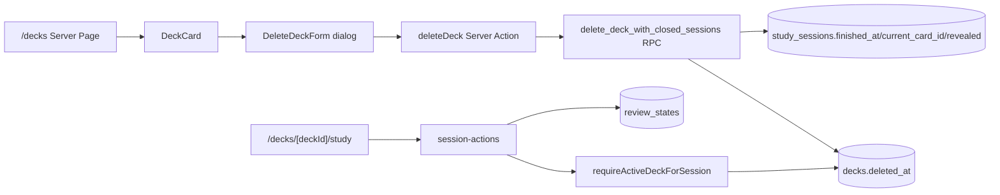
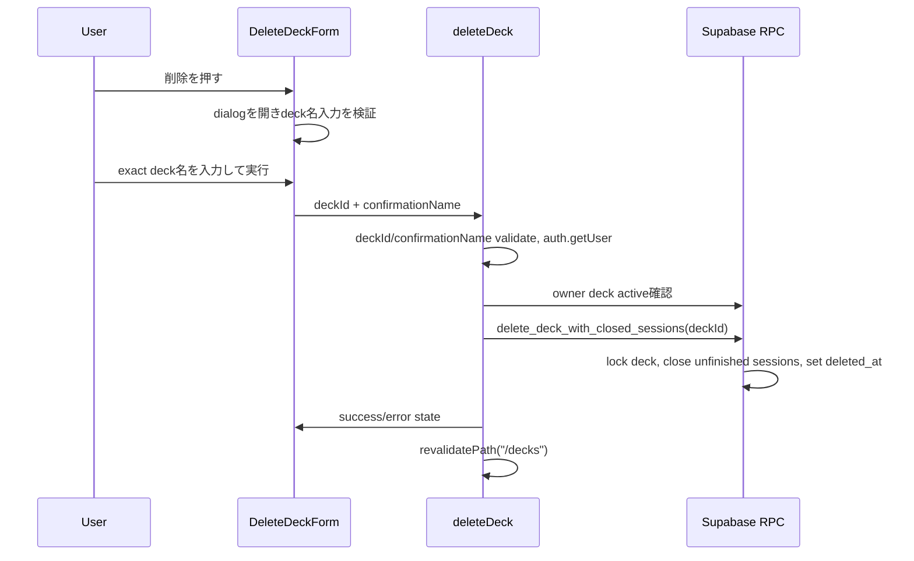

# Design: 学習状態を持つデッキの安全な論理削除

## 1. 概要

- 目的: `/decks` で誤操作しにくい削除確認を提供し、owner 本人が `review_states` / `study_sessions` を持つ deck でも論理削除できるようにする。
- 実装戦略: Hybrid。
- 選択理由: DB の削除契約と session 正本を先に固定する必要があるため、Phase 1 は migration / RPC / contract test の水平スライスにする。その後、`deleteDeck`、session Action、UI を user behavior 単位の垂直スライスで接続する。
- ADR 判定: 必須。S-25 の active session 拒否 trigger を廃止し、`study_sessions` の終了契約と deck deletion data flow を変更するため、`specs/adr/ADR-014-safer-deck-deletion-study-state.md` を作成した。

## 2. 合意事項チェックリスト

| 合意事項 | 設計反映 | 状態 |
|---|---|---|
| 確認入力はデッキ名の exact match とする。前後空白は trim する | 6. UI設計、10. 受入条件 AC-UI-02 | 反映済み |
| dialog にはデッキ名と不可逆性を表示する | 6. UI設計、10. AC-UI-01 | 反映済み |
| deck 削除は `decks.deleted_at` の論理削除を維持する | 5. データ設計、8. データ契約 | 反映済み |
| `deck_cards` / `review_states` / `study_sessions` / `cards` は物理削除しない | 5. データ設計、9. 変更影響マップ | 反映済み |
| 未完了 `study_sessions` は物理削除せず、削除と同一トランザクションで閉じる | ADR-014、5. RPC設計 | 反映済み |
| `current_card_id` は `NULL`、`revealed` は `false` に戻し、再開/出題/評価をできなくする | 5. RPC設計、7. Action契約 | 反映済み |
| DB は S-25 trigger を削除し、owner-scoped RPC を追加する | 5. migration、11. テスト | 反映済み |
| service role は使わない | 5. データ設計、7. Action契約 | 反映済み |
| Security Definer は owner/search_path/revoke/grant 規約を満たす | 5. migration、11. テスト | 反映済み |
| 削除済み deck を読む/選ぶ通常経路は `deleted_at IS NULL` を守る | 4. 現状調査、12. 統合ポイント | 反映済み |
| cards/review_states はカード単位の履歴として残す | 8. データ契約、9. 変更影響マップ | 反映済み |
| sessionId 起点 Action は副作用前に deck active を確認する | 7. Action契約、12. 統合ポイント | 反映済み |

未反映の合意事項はない。

## 3. 現状調査

### 3.1 実装ファイルパス

| 領域 | 既存ファイル | 現状 |
|---|---|---|
| Deck read/delete Action | `frontend/src/actions/deck-actions.ts` | `deleteDeck` は deckId validate -> `auth.getUser()` -> owner deck select -> active `study_sessions` select -> `decks.deleted_at` update -> `revalidatePath("/decks")`。active session があれば拒否する。 |
| Deck delete action type | `frontend/src/actions/deck-action-types.ts` | `DeckDeleteActionState` は `idle/success/error + message`。確認入力の server-side validation field は未定義。 |
| Delete UI | `frontend/src/components/deck/DeleteDeckForm.tsx` | Client Component。`window.confirm`、hidden `deckId`、`useFormState(deleteDeck)`、pending disabled、row-local alert。 |
| Deck card UI | `frontend/src/components/deck/DeckCard.tsx` | `DeckCard` 内で詳細 `Link` と `DeleteDeckForm` は sibling。interactive nesting は回避済み。 |
| Session Action | `frontend/src/actions/session-actions.ts` | `requireOwnedDeck` は active deck を要求する。`requireSessionOwner` は session owner のみ確認し、sessionId 起点の `getNextCard` / `revealCard` / `rateCard` は deck active を副作用前に必ず確認していない。 |
| DB migration | `supabase/migrations/20260728000000_s25_deck_delete.sql` | `decks.deleted_at`、deck_cards active deck policy、`guard_deck_logical_delete_active_session()` trigger、`GRANT UPDATE (deleted_at)` を追加済み。 |
| S-25 follow-up | `supabase/migrations/20260729000000_s25_deck_delete_select_policy_fix.sql` | `decks_select_owner` は tombstone row も SELECT 可能に戻し、app read paths の `.is("deleted_at", null)` を正本にする。 |
| Migration contract test | `frontend/src/lib/deck/deck-delete-migration-contract.test.ts` | S-25 trigger が存在することを固定しているため S-29 で更新が必要。 |
| Action test | `frontend/src/actions/deck-actions.test.ts` | active session 拒否と `P1007` mapping を固定しているため S-29 で更新が必要。 |
| UI test | `frontend/src/components/deck/DeleteDeckForm.test.tsx` | `window.confirm` の存在を固定しているため S-29 で更新が必要。 |

### 3.2 既存インターフェース

主要 public 関数:

- `deleteDeck(previousState, formData): Promise<DeckDeleteActionState>`
- `getDecksWithCounts(): Promise<DeckWithCounts[]>`
- `getDeckOverview(deckId): Promise<DeckOverview | null>`
- `getDeckLearningMetrics(deckId): Promise<DeckLearningMetrics | null>`
- `updateDeckStudyLimit(previousState, formData): Promise<DeckStudyLimitActionState>`
- `startStudySession(deckId): Promise<StartStudySessionResult>`
- `getStudySessionState(sessionId): Promise<StudySessionState>`
- `getNextCard(sessionId): Promise<CardFrontData | null>`
- `revealCard(sessionId): Promise<CardBackData>`
- `rateCard(sessionId, rating): Promise<RateResult>`

呼び出し関係:

```text
/decks
  -> DeckCard
  -> DeleteDeckForm
  -> deleteDeck Server Action
  -> Supabase decks / study_sessions
  -> revalidatePath("/decks")

/decks/[deckId]/study
  -> startStudySession(deckId) または getStudySessionState(sessionId)
  -> getNextCard / revealCard / rateCard
  -> study_sessions / review_states
```

### 3.3 類似機能の検索結果と判断

- S-25 logical delete は存在するが、active session 拒否が S-29 要件と矛盾するため流用ではなく置換する。
- `set_card_decks_internal`、`list_ai_managed_cards`、`validate_ai_import_preview` など AI 関連 RPC は owner deck を見るが、少なくとも確認した SQL では `decks.deleted_at IS NULL` が不足している箇所がある。S-29 の通常経路除外に含める。
- `getAiCardManagementOptionsAction`、`card-drafts/generate/route.ts`、MCP `listOwnerDecks` は active deck filter が実装済み。
- `requireOwnedDeck` は active deck filter が実装済み。`requireSessionOwner` は削除済み deck の session 操作遮断としては不足している。

判断: 既存 S-25 実装を土台にするが、active session 拒否 trigger と事前拒否を削除し、RPC + session active deck guard へ置換する。

## 4. アーキテクチャ



### 4.1 データフロー



### 4.2 責務境界

| 層 | 責務 | 配置 |
|---|---|---|
| Page / Server Component | active deck の一覧・詳細・学習入口だけを表示 | `frontend/app/(auth)/decks/**` |
| Client Component | dialog、確認入力、pending/cancel/error の UI 状態 | `frontend/src/components/deck/DeleteDeckForm.tsx` |
| Server Action | FormData 検証、認証、owner確認、安全な戻り値、revalidate | `frontend/src/actions/deck-actions.ts` |
| Session Action | sessionId 起点操作の owner + active deck guard、review/session 副作用 | `frontend/src/actions/session-actions.ts` |
| DB / RPC | deck tombstone と unfinished session 終了の atomic mutation | `supabase/migrations/*.sql` |
| Tests | Action/UI/migration/session/read path contract | `frontend/src/**/*.test.*`, `frontend/src/lib/deck/*.test.ts` |

## 5. データ設計

### 5.1 使用 table / column

| Table | Column | 扱い |
|---|---|---|
| `decks` | `id`, `owner_user_id`, `deleted_at`, `name` | `deleted_at` を tombstone とする。物理 DELETE しない。 |
| `study_sessions` | `deck_id`, `user_id`, `finished_at`, `current_card_id`, `revealed`, queue JSON | deck 削除時、未完了 session は `finished_at = deleted_at`、`current_card_id = NULL`、`revealed = false`。queue は保持。 |
| `deck_cards` | `deck_id`, `card_id` | 物理削除しない。通常 SELECT/INSERT/UPDATE は親 active deck を要求。 |
| `review_states` | `user_id`, `card_id` | 物理削除しない。削除後の stale session からは更新しない。 |
| `cards` | `id`, `owner_user_id`, `visibility` | 物理削除しない。private card cleanup は対象外。 |

### 5.2 Migration

新規 migration 候補:

`supabase/migrations/20260801000000_s29_safer_deck_delete_with_sessions.sql`

内容:

1. `DROP TRIGGER IF EXISTS guard_deck_logical_delete_active_session ON public.decks;`
2. `DROP FUNCTION IF EXISTS public.guard_deck_logical_delete_active_session();`
3. `REVOKE UPDATE (deleted_at) ON TABLE public.decks FROM authenticated;`
4. `CREATE FUNCTION public.delete_deck_with_closed_sessions(p_deck_id uuid) RETURNS jsonb LANGUAGE plpgsql SECURITY DEFINER SET search_path = pg_catalog, pg_temp ...`
5. `ALTER FUNCTION public.delete_deck_with_closed_sessions(uuid) OWNER TO s10_migration_owner;`
6. `REVOKE ALL ON FUNCTION public.delete_deck_with_closed_sessions(uuid) FROM PUBLIC, anon, authenticated, service_role;`
7. `GRANT EXECUTE ON FUNCTION public.delete_deck_with_closed_sessions(uuid) TO authenticated;`
8. AI/MCP 関連 RPC の active deck check を `deleted_at IS NULL` へ補正する:
   - `validate_ai_import_preview`
   - `commit_generated_import_async` / 内側 commit 経路の target deck owner check
   - `enforce_import_batch_deck_owner`
   - `set_card_decks_internal`
   - `list_ai_managed_cards`
   - `s14_remote_update_card` 経由の deck patch が呼ぶ internal 境界

RPC 疑似仕様:

```sql
CREATE FUNCTION public.delete_deck_with_closed_sessions(p_deck_id uuid)
RETURNS jsonb
LANGUAGE plpgsql
SECURITY DEFINER
SET search_path = pg_catalog, pg_temp
AS $$
DECLARE
  actor_id uuid;
  deleted_at_value timestamptz;
  closed_count integer;
BEGIN
  actor_id := auth.uid();
  IF actor_id IS NULL THEN
    RAISE EXCEPTION USING ERRCODE = 'P1001', MESSAGE = 'S-29 unauthorized';
  END IF;

  deleted_at_value := statement_timestamp();

  PERFORM 1
  FROM public.decks AS decks
  WHERE decks.id = p_deck_id
    AND decks.owner_user_id = actor_id
    AND decks.deleted_at IS NULL
  FOR UPDATE;
  IF NOT FOUND THEN
    RAISE EXCEPTION USING ERRCODE = 'P1002', MESSAGE = 'S-29 deck not found';
  END IF;

  UPDATE public.study_sessions AS sessions
  SET finished_at = deleted_at_value,
      current_card_id = NULL,
      revealed = false
  WHERE sessions.deck_id = p_deck_id
    AND sessions.user_id = actor_id
    AND sessions.finished_at IS NULL;
  GET DIAGNOSTICS closed_count = ROW_COUNT;

  UPDATE public.decks AS decks
  SET deleted_at = deleted_at_value
  WHERE decks.id = p_deck_id
    AND decks.owner_user_id = actor_id
    AND decks.deleted_at IS NULL;

  RETURN jsonb_build_object(
    'deckId', p_deck_id,
    'deletedAt', deleted_at_value,
    'closedSessionCount', closed_count
  );
END;
$$;
```

実装時は `p_deck_id IS NULL` を明示拒否する。PostgreSQL の三値論理で NULL が validation を通過しないよう、`IS NULL` 条件を先に置く。

### 5.3 RLS actor matrix

| 操作 | owner authenticated | other authenticated | anon | service_role |
|---|---|---|---|---|
| `delete_deck_with_closed_sessions` | active own deck のみ成功 | 失敗 | 実行不可 | 実行不可 |
| `decks` direct `deleted_at` update | 通常経路では不可 | 不可 | 不可 | S-29通常経路では不使用 |
| active deck read paths | `deleted_at IS NULL` のみ | RLS/owner filterで不可 | 不可 | server-only特別経路のみ |
| `deck_cards` active deck relation | active own deck のみ | 不可 | 不可 | S-29通常経路では不使用 |

### 5.4 Database 型と seed

- 新 RPC を `frontend/src/types/database.ts` の `Functions` に追加する。
- `study_sessions` schema 自体は変更しないため Row/Insert/Update の column 追加は不要。
- seed は physical delete しない契約のため変更不要。ただし S-29 integration fixture を追加する場合は、未完了 session 付き deck と review state 付き deck を story test 側で構築する。

## 6. UI設計

Figma は使わない。UI 根拠は `requirements.md`、`.claude/steering/design-system.md`、既存 `DeckCard` / `DeleteDeckForm` とする。

### 6.1 画面構造マップ

```text
/decks
└── DeckCard (繰り返し)
    ├── DeckDetailLink
    │   ├── DeckName
    │   ├── Total/Learned summary
    │   └── PlannedStudy badges
    └── DeleteDeckForm
        ├── TriggerButton: "削除"
        └── Dialog (open時)
            ├── Title: "デッキを削除"
            ├── Description: deckName + 不可逆性 + 履歴保持の説明
            ├── ConfirmationInput
            ├── CancelButton
            ├── SubmitButton
            └── ErrorMessage role="alert"
```

### 6.2 Interaction

- `DeleteDeckForm` は `window.confirm` を廃止し、Client Component 内の dialog state を持つ。
- trigger button は既存同様 `h-12` 以上、`aria-label="「{deckName}」を削除"`。
- dialog は `role="dialog"`、`aria-modal="true"`、`aria-labelledby`、`aria-describedby` を持つ。
- input label は「確認のためデッキ名を入力」。比較は `input.trim() === deckName`。全角/半角や Unicode 正規化は行わない exact match とする。
- submit は input 不一致または pending 中に `disabled` / `aria-disabled`。
- cancel / close は form submit を発生させず、Server Action を呼ばない。
- pending 中も deckName を表示し、削除対象が変わったように見せない。
- success 後は `/decks` revalidate により row が消える。dialog 内 success 表示に依存しない。
- error は dialog 内または row 近傍に `role="alert"` で安全な日本語を出す。SQL、Supabase raw error、他 owner 情報は出さない。
- 320px 幅では dialog body と buttons は縦積み。主要 button は 48px 以上。

## 7. API・Action契約

### 7.1 `deleteDeck(previousState, formData)`

- 入力:
  - `deckId`: UUID string。trim 後 UUID pattern に一致しない場合は generic failure。
  - `confirmationName`: string。trim 後 owner deck name と exact match しない場合は generic failure または確認入力用 safe error。
- 認証:
  - `auth.getUser()` を副作用前に呼ぶ。未認証なら DML/RPC 0 回で `ログインが必要です。`。
- 所有権:
  - `decks.id = deckId AND owner_user_id = user.id AND deleted_at IS NULL` で `id,name` を取得する。
  - 他 owner、不存在、削除済み deck は同じ generic failure。
- 副作用:
  - `supabase.rpc("delete_deck_with_closed_sessions", { p_deck_id: deckId })` を呼ぶ。
  - 成功時のみ `revalidatePath("/decks")`。
- 戻り値:
  - 成功: `{ status: "success", message: "デッキを削除しました。" }`
  - 未認証: `{ status: "error", message: "ログインが必要です。" }`
  - その他: `{ status: "error", message: "デッキを削除できませんでした。時間をおいて再度お試しください。" }`
- 廃止:
  - `ACTIVE_DECK_DELETE_ERROR_MESSAGE`
  - `isActiveDeckDeleteError(P1007)`
  - active `study_sessions` 事前拒否

### 7.2 `requireActiveDeckForSession`

新規 private helper を `frontend/src/actions/session-actions.ts` に追加する。

- 入力: `supabase`, `session.deck_id`, `userId`
- 処理: `decks.id = session.deck_id AND owner_user_id = userId AND deleted_at IS NULL` を確認する。
- 出力: active deck row または throw。
- 適用:
  - `getNextCard`: `markSessionFinished` / `updateStudySession` 前。
  - `revealCard`: `updateStudySession({ revealed: true })` 前。
  - `rateCard`: `upsertReviewState` 前。
  - `getStudySessionState`: 既存 `requireOwnedDeck` で active deck を確認済み。削除済みなら page は `notFound` 相当の安全失敗にする。
  - `startStudySession`: 既存 `requireOwnedDeck` を維持。

### 7.3 Interface変更影響マトリクス

| 既存メソッド | 新メソッド | 変換必要性 | アダプター要否 | 互換性確保方法 |
|---|---|---|---|---|
| `deleteDeck(previousState, formData)` | 同名維持 | あり。`confirmationName` field と RPC 呼び出しを追加 | 不要 | FormData field を追加するだけで Server Action signature は維持 |
| `DeckDeleteActionState` | 同名維持 | なし | 不要 | `status/message` のまま。必要なら field-level message は UI 内 state で扱う |
| `startStudySession(deckId)` | 同名維持 | なし | 不要 | `requireOwnedDeck` active filter を維持 |
| `getNextCard(sessionId)` | 同名維持 | あり。副作用前 active deck guard | 不要 | 削除済み deck では throw / safe page failure。正常系戻り値は維持 |
| `revealCard(sessionId)` | 同名維持 | あり。副作用前 active deck guard | 不要 | 正常系戻り値は維持 |
| `rateCard(sessionId, rating)` | 同名維持 | あり。review update 前 active deck guard | 不要 | 正常系戻り値は維持 |
| DB direct `UPDATE decks.deleted_at` | `delete_deck_with_closed_sessions(p_deck_id)` | あり | Server Action 内で RPC 呼び出しへ置換 | `deleted_at` grant を revoke し、RPC execute grant へ移行 |

## 8. データ契約

### 8.1 Deck deletion RPC

```yaml
境界名: delete_deck_with_closed_sessions
入力:
  p_deck_id: uuid, NULL不可
出力:
  jsonb:
    deckId: uuid
    deletedAt: timestamptz
    closedSessionCount: integer
同期/非同期: 同期。同一DBトランザクション内で完了
前提:
  callerはauthenticated
  actorはJWT/auth.uidから導出しclient入力を信用しない
保証:
  decks.deleted_at is not null
  対象owner/deckのunfinished study_sessionsはfinished_at = deletedAt
  current_card_id is null, revealed = false
  deck_cards/review_states/study_sessions/cardsを物理削除しない
エラー時:
  DBは安全なSQLSTATE/messageのみ
  Server Actionはgeneric Japanese errorへ写像
```

### 8.2 Session Action active deck guard

```yaml
境界名: sessionId -> active deck validation
入力:
  sessionId: string
  authenticated userId: string
  session.deck_id: uuid
出力:
  active deck row または例外
同期/非同期: Supabase read
エラー時:
  副作用前に停止
  review_states upsert/updateを行わない
  study_sessions revealed/current_card_id/queueを更新しない
```

## 9. 変更影響マップ

```yaml
変更対象: deleteDeck()
直接影響:
  - frontend/src/actions/deck-actions.ts（active session拒否を削除、confirmationName検証、RPC呼び出し）
  - frontend/src/actions/deck-actions.test.ts（S-25 active拒否テストをS-29成功/二重送信/RPC失敗へ更新）
間接影響:
  - /decks UI（dialog form field追加）
  - Supabase Functions型（delete_deck_with_closed_sessions追加）
波及なし:
  - SRS calculate/classify/queue純粋関数

変更対象: supabase deck deletion contract
直接影響:
  - supabase/migrations/20260801000000_s29_safer_deck_delete_with_sessions.sql
  - frontend/src/lib/deck/deck-delete-migration-contract.test.ts
  - frontend/src/types/database.ts
間接影響:
  - direct deleted_at update grantの扱い
  - Hosted Supabase function owner catalog gate
波及なし:
  - Storage bucket / signed URL

変更対象: session-actions sessionId flow
直接影響:
  - frontend/src/actions/session-actions.ts（active deck guard）
  - frontend/src/actions/session-actions.test.ts
間接影響:
  - /decks/[deckId]/study stale URL
  - StudyClient action failure path
波及なし:
  - RatingButtons / SRS interval表示

変更対象: active deck read/selection paths
直接影響:
  - supabase RPC: validate_ai_import_preview / commit path / set_card_decks_internal / list_ai_managed_cards
  - frontend tests for AI/MCP migration contract
間接影響:
  - AIカード作成/管理で削除済みdeckを選択できない
  - Remote MCP list_decks / deck patchが削除済みdeckを扱わない
波及なし:
  - MCP deck deletion tool（新規公開しない）
```

## 10. 受入条件（EARS）

### UI

- [ ] **AC-UI-01** (契機型): ユーザーが `/decks` で削除ボタンを押したとき、システムはデッキ名、不可逆性、danger 表現を含む確認 dialog を表示すること。
- [ ] **AC-UI-02** (状態型): 確認入力が trim 後のデッキ名と exact match していない間、システムは削除実行 button を disabled / aria-disabled にすること。
- [ ] **AC-UI-03** (契機型): ユーザーが確認 dialog を cancel / close したとき、システムは `deleteDeck` を呼ばないこと。
- [ ] **AC-UI-04** (状態型): 削除送信中、システムは削除対象 deck 名を表示したまま pending 表示と二重送信抑止を行うこと。
- [ ] **AC-UI-05** (不測型): もし削除が失敗した場合、システムは raw error を含まない日本語 error を `role="alert"` で表示すること。
- [ ] **AC-UI-06** (遍在型): システムは PC と 320px 幅相当のスマホで dialog 本文、入力欄、cancel、削除実行、error 表示を重ならず操作可能にすること。

### Action / DB

- [ ] **AC-ACTION-01** (遍在型): システムは deck 削除時に `decks.deleted_at` を設定し、`decks` row を物理削除しないこと。
- [ ] **AC-ACTION-02** (契機型): owner が `review_states` を持つ deck を削除したとき、システムは削除を拒否しないこと。
- [ ] **AC-ACTION-03** (契機型): owner が完了済みまたは未完了 `study_sessions` を持つ deck を削除したとき、システムは削除を拒否しないこと。
- [ ] **AC-ACTION-04** (契機型): deck 削除が成功したとき、システムは対象 deck の未完了 `study_sessions` を同一トランザクションで終了すること。
- [ ] **AC-ACTION-05** (不測型): もし未認証、他 owner、不存在、不正 deckId、削除済み deck 再削除が発生した場合、システムは副作用なしで安全な失敗を返すこと。
- [ ] **AC-ACTION-06** (状態型): deck 削除 RPC 実行中、システムは deck tombstone と unfinished session 終了を部分適用しないこと。

### Read / Study

- [ ] **AC-READ-01** (遍在型): システムは `/decks` 一覧、deck 詳細、学習開始、日次ステータス、AIカード作成/管理、MCP deck list で `decks.deleted_at IS NULL` を要求すること。
- [ ] **AC-STUDY-01** (契機型): ユーザーが削除済み deck の URL から学習開始を試みたとき、システムは新規 session を作成しないこと。
- [ ] **AC-STUDY-02** (契機型): ユーザーが削除済み deck に紐づく sessionId で回答表示または次カード取得を試みたとき、システムは副作用前に安全に失敗すること。
- [ ] **AC-STUDY-03** (契機型): ユーザーが削除済み deck に紐づく sessionId で評価保存を試みたとき、システムは `review_states` と `study_sessions` を更新しないこと。
- [ ] **AC-DATA-01** (遍在型): システムは deck 削除時に `deck_cards`、`review_states`、`study_sessions`、`cards` を物理削除しないこと。

## 11. テスト戦略

| AC | Level | テスト / 確認場所 | 期待結果 |
|---|---|---|---|
| AC-UI-01〜06 | L2 / L3 | `frontend/src/components/deck/DeleteDeckForm.test.tsx`, `frontend/src/app/decks/page.test.tsx`, 手動 320px/desktop | dialog、exact match、cancel、副作用なし、pending/error、touch target |
| AC-ACTION-01〜06 | L2 | `frontend/src/actions/deck-actions.test.ts` | RPC呼び出し、review/sessionあり成功、invalid/unauth/generic failure、revalidate |
| AC-ACTION-04 / AC-DATA-01 | L2 / DB contract | `frontend/src/lib/deck/deck-delete-migration-contract.test.ts` | trigger削除、RPC body、物理DELETEなし、grant/owner/search_path |
| AC-READ-01 | L2 | deck action tests, AI/MCP service tests, migration contract | active deck filter が全経路に存在 |
| AC-STUDY-01〜03 | L2 | `frontend/src/actions/session-actions.test.ts`, study page test | start/resume/reveal/rate が削除済みdeckで副作用前停止 |
| 全体 | L1 | `npm --prefix frontend run lint`, `npm --prefix frontend run typecheck` | 静的検査 pass |
| 全体 | L2 | `npm --prefix frontend run test` | Vitest pass |
| UI route | L3 | `npm --prefix frontend run build` + manual browser | route build と実 UI 操作 |
| DB/RLS | L2/L3 | isolated Supabase apply + catalog query | function owner/ACL/RLS actor matrix確認 |

Playwright は未導入のため、自動 E2E と L3 を同一視しない。L3 は実ブラウザまたは local Supabase smoke として plan へ渡す。

### Phase別E2E確認手順

1. DB phase: isolated DB に migration を apply し、owner A の unfinished session 付き deck を RPC で削除する。`decks.deleted_at` が入り、`study_sessions.finished_at` が同時刻、関連 row count が不変であることを確認する。
2. Action phase: Vitest で `deleteDeck` が RPC を呼び、active session 事前拒否をしないことを確認する。
3. Study phase: stale sessionId で `getNextCard` / `revealCard` / `rateCard` を呼び、`review_states` upsert と session update が 0 回であることを確認する。
4. UI phase: desktop と 320px 幅で `/decks`、dialog open、入力不一致 disabled、cancel、入力一致 submit、pending、error を確認する。

## 12. 統合ポイントマップ

```yaml
統合点1:
  既存コンポーネント: DeleteDeckForm -> deleteDeck
  統合方法: window.confirmをdialog + confirmationName FormDataへ置換
  影響度: 中（UI操作契約変更）
  必要なテスト観点: cancel時Action未呼び出し、exact matchまでdisabled、pending/error

統合点2:
  既存コンポーネント: deleteDeck
  統合方法: active session事前拒否をRPC呼び出しへ置換
  影響度: 高（削除データフロー変更）
  必要なテスト観点: review/sessionあり成功、RPC failure安全化、二重送信

統合点3:
  既存コンポーネント: supabase migrations / RLS / RPC
  統合方法: S-25 trigger削除、atomic RPC追加、deleted_at direct update grant整理
  影響度: 高（DB mutation境界変更）
  必要なテスト観点: owner/other/anon、function owner/search_path/revoke/grant、関連row非削除

統合点4:
  既存コンポーネント: getNextCard / revealCard / rateCard
  統合方法: requireSessionOwner後、副作用前にactive deck guardを追加
  影響度: 高（学習副作用の遮断）
  必要なテスト観点: 削除済みdeck sessionでreview_states更新0、study_sessions更新0

統合点5:
  既存コンポーネント: AI import / AI card management / MCP deck選択経路
  統合方法: DB RPC owner deck checkにdeleted_at IS NULLを追加
  影響度: 中（削除済みdeck利用防止）
  必要なテスト観点: 削除済みdeckId指定がDECK_NOT_FOUND相当、listに出ない
```

## 13. 実装対象ファイルと plan への引き継ぎ

実装対象候補:

- `supabase/migrations/20260801000000_s29_safer_deck_delete_with_sessions.sql`
- `frontend/src/types/database.ts`
- `frontend/src/lib/deck/deck-delete-migration-contract.test.ts`
- `frontend/src/actions/deck-action-types.ts`
- `frontend/src/actions/deck-actions.ts`
- `frontend/src/actions/deck-actions.test.ts`
- `frontend/src/components/deck/DeleteDeckForm.tsx`
- `frontend/src/components/deck/DeleteDeckForm.test.tsx`
- `frontend/src/components/deck/DeckCard.tsx`（props 追加が必要な場合のみ）
- `frontend/src/app/decks/page.test.tsx`
- `frontend/src/actions/session-actions.ts`
- `frontend/src/actions/session-actions.test.ts`
- `frontend/src/lib/mcp/services.ts`
- `frontend/src/lib/mcp/services.test.ts`
- `supabase/migrations/20260718000005_validate_preview_existing_duplicates.sql` 相当の置換 migration（既存 migration は編集せず新規 migration で function replace）
- `supabase/migrations/20260719000001_s13_ai_card_management_undo.sql` / `20260726000000_s20_ai_card_mnemonic_edit.sql` 相当の function replace（新規 migration）
- 関連 AI/MCP migration contract tests

テスト方針:

- 先に S-29 の migration contract test を更新し、S-25 trigger 存在テストを trigger 削除 + RPC 存在テストへ変える。
- `deleteDeck` は RPC mock を追加し、active session query が呼ばれないこと、review/sessionありで成功することを検証する。
- session actions は stale deleted deck の session row fixture を追加し、`revealCard` / `rateCard` の mutation 0 回を固定する。
- UI は `window.confirm` 文字列検査を削除し、dialog state と input disabled の観測可能なテストへ置換する。
- 最終 gate は `npm --prefix frontend run check`、route/UI変更のため `npm --prefix frontend run build`、migration変更のため isolated DB apply と catalog query。

## 14. 移行・ロールバック

- deploy順序: DB migration -> TypeScript 型更新 -> Server Action/RPC接続 -> UI更新。
- 既存データ: 既存 unfinished `study_sessions` は migration 時点では変更しない。deck 削除時に対象 deck の unfinished session だけ終了する。
- rollback: RPC を使う application code を戻す場合は S-25 trigger / direct grant 契約も戻す必要がある。単純 rollback では active session 付き deck の削除可否が変わるため、forward-fix を優先する。
- Hosted Supabase: migration 適用後に `pg_proc` / `pg_roles` で `delete_deck_with_closed_sessions` owner が `s10_migration_owner` であること、PUBLIC/anon/service_role に execute が無いことを確認する。

## 15. リスク・未解決事項

| 項目 | 影響 | 対応 |
|---|---|---|
| `finished_at` が削除による終了と通常完了を区別できない | 中 | S-29 では終了理由カラムを追加しない。復元/監査 UI が必要になったら別 story で `finished_reason` 等を検討する。 |
| AI/MCP RPC の active deck filter 漏れ | 高 | migration contract test で function body の `deleted_at IS NULL` を固定し、削除済みdeckId指定の拒否テストを追加する。 |
| SECURITY DEFINER owner drift | 高 | steering に従い owner/search_path/revoke/grant と catalog query を plan gate に含める。 |
| Direct `deleted_at` update grant の既存環境 drift | 中 | migration で revoke し、isolated/Hosted の grants を確認する。 |
| UI dialog の focus trap 実装範囲 | 中 | 外部 dialog dependency は追加しない。最小実装では open時に input focus、Escape/cancel/keyboard操作、focus-visible を手動確認する。 |

## 16. 参考資料

- PostgreSQL 18 Documentation: `CREATE FUNCTION` / Writing `SECURITY DEFINER` Functions Safely. `SECURITY DEFINER` の `search_path` と privilege 制御の根拠。https://www.postgresql.org/docs/current/sql-createfunction.html
- Supabase Docs: Row Level Security. RLS に加えて query filter を明示する方針、security definer function の注意点。https://supabase.com/docs/guides/database/postgres/row-level-security
- Supabase Docs: Securing your API. RLS と function EXECUTE grant を明示する根拠。https://supabase.com/docs/guides/api/securing-your-api
