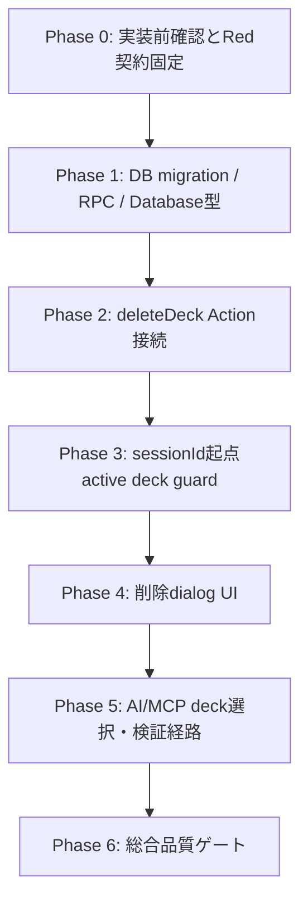
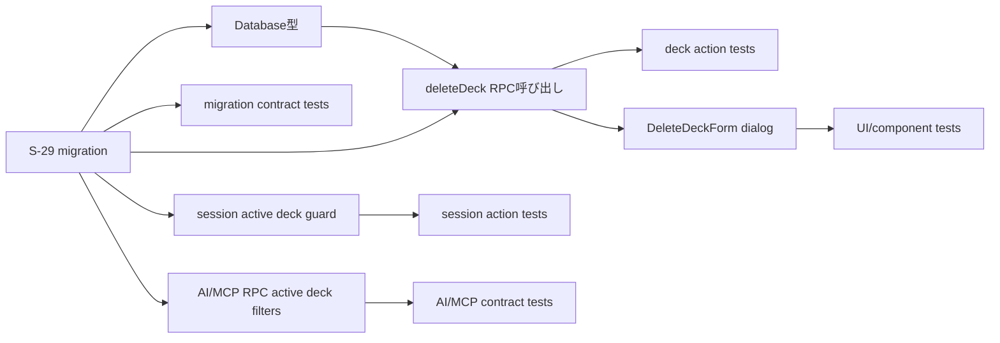

# Plan: 学習状態を持つデッキの安全な論理削除

## 実装方針

- 戦略: Hybrid。先に DB/RPC と契約テストで削除データフローを固定し、その後 `deleteDeck`、session Action、UI、AI/MCP 経路を user behavior 単位で接続する。
- 正本: `requirements.md`、`design.md`、ADR-014。S-25 の active session 削除拒否契約は S-29 で置換する。
- Figma: 本プロジェクトでは使用しない。UI 検証は既存 component、design-system、実ブラウザの desktop/320px 確認で行う。
- 永続タスクファイル: 作成しない。`tasks/`、個別 `task-*.md` は生成・参照・更新しない。

## 実装前停止ポイント

- [x] Supabase migration / RLS / SECURITY DEFINER / grant 変更を含むため、実装前に対象 worktree、対象 story、ADR-014、適用環境が local 実装のみであることを確認する。
- [x] remote / Hosted Supabase への migration apply、`supabase db reset`、production deploy、force push は本 plan の実装範囲外。必要になったら実行前に停止して承認を取る。
- [x] ADR-014 の status は `Proposed`。実装開始時点で Accepted へ上がっていない場合は、オーケストレーターへ status 差分を報告してから進める。

## フェーズ構成

## Phase 0: 実装前確認と Red 契約固定

対象要件: REQ-TEST-01〜04、AC-11

対象ファイル:
- `frontend/src/lib/deck/deck-delete-migration-contract.test.ts`
- `frontend/src/actions/deck-actions.test.ts`
- `frontend/src/actions/session-actions.test.ts`
- `frontend/src/components/deck/DeleteDeckForm.test.tsx`
- `frontend/src/app/decks/page.test.tsx`
- `frontend/src/lib/ai-card-management/migration-contract.test.ts`
- `frontend/src/lib/ai-card-management/s20-migration-contract.test.ts`
- `frontend/src/lib/mcp/services.test.ts`
- `frontend/src/lib/mcp/migration-contract.test.ts`
- `frontend/src/lib/ai-import/remote-mcp-repository.test.ts`

実施内容:
- [x] S-25 固定の「active session がある deck は削除拒否」「`P1007` を専用文言へ写像」「`window.confirm` が存在する」テストを S-29 契約へ更新する。
- [x] migration contract test に、S-25 trigger/function の drop、`delete_deck_with_closed_sessions(uuid)` の SECURITY DEFINER 契約、`decks.deleted_at` direct grant revoke、関連 table の物理 DELETE 不在を追加する。
- [x] deck action test に、`confirmationName` exact match、review_states あり成功、未完了/完了済み study_sessions あり成功、RPC failure の safe error、再削除/stale state の safe failure、`/decks` revalidate を追加する。
- [x] session action test に、削除済み deck に紐づく `getNextCard` / `revealCard` / `rateCard` が副作用前に止まることを追加する。
- [x] UI test に dialog 表示、デッキ名 exact match、cancel は action 未呼び出し、pending disabled/error alert、320px 相当で縦積み可能な構造を追加する。
- [x] AI/MCP contract test に、削除済み deck が list/selection/validation に出ないことを追加する。

完了条件:
- [x] 旧 S-25 契約を期待する test が残っていない。
- [ ] 新テストは実装前に失敗理由が S-29 未実装であることを確認できる。

確認コマンド:
- `cd frontend && npm test -- src/lib/deck/deck-delete-migration-contract.test.ts`
- `cd frontend && npm test -- src/actions/deck-actions.test.ts`
- `cd frontend && npm test -- src/actions/session-actions.test.ts`
- `cd frontend && npm test -- src/components/deck/DeleteDeckForm.test.tsx src/app/decks/page.test.tsx`

## Phase 1: DB migration / RPC / Database 型

対象要件: REQ-DB-01〜03、REQ-DATA-01〜04、REQ-SEC-02、AC-ACTION-01、AC-ACTION-04、AC-ACTION-06、AC-DATA-01、AC-READ-01

対象ファイル:
- `supabase/migrations/20260801000000_s29_safer_deck_delete_with_sessions.sql`
- `frontend/src/types/database.ts`
- `frontend/src/lib/deck/deck-delete-migration-contract.test.ts`

実施内容:
- [x] 新規 migration を追加し、適用済み migration は編集しない。
- [x] `guard_deck_logical_delete_active_session` trigger を `DROP TRIGGER IF EXISTS` し、`public.guard_deck_logical_delete_active_session()` を `DROP FUNCTION IF EXISTS` する。
- [x] `REVOKE UPDATE (deleted_at) ON TABLE public.decks FROM authenticated;` を追加し、通常 deck 削除 mutation を RPC に寄せる。
- [x] `public.delete_deck_with_closed_sessions(p_deck_id uuid)` を追加する。
  - `p_deck_id IS NULL` を明示拒否する。
  - actor は `auth.uid()` から導出し、client supplied owner は受け取らない。
  - `decks.id = p_deck_id AND owner_user_id = actor_id AND deleted_at IS NULL` を `FOR UPDATE` で lock する。
  - 同一関数内で `deleted_at_value := statement_timestamp()` を使い、未完了 `study_sessions` を `finished_at = deleted_at_value`, `current_card_id = NULL`, `revealed = false` にする。
  - `decks.deleted_at = deleted_at_value` を設定し、`deck_cards` / `review_states` / `study_sessions` / `cards` は物理削除しない。
  - 戻り値は `jsonb_build_object('deckId', p_deck_id, 'deletedAt', deleted_at_value, 'closedSessionCount', closed_count)` とする。
- [x] RPC は `LANGUAGE plpgsql SECURITY DEFINER SET search_path = pg_catalog, pg_temp` とし、完全 signature で `ALTER FUNCTION ... OWNER TO s10_migration_owner` を実行する。
- [x] `REVOKE ALL ON FUNCTION ... FROM PUBLIC, anon, authenticated, service_role;` 後、`GRANT EXECUTE ... TO authenticated;` のみを付与する。
- [x] `frontend/src/types/database.ts` の `Database["public"]["Functions"]` に `delete_deck_with_closed_sessions` を追加する。
- [x] migration contract test で owner/search_path/revoke/grant、trigger 削除、direct grant revoke、物理 DELETE 不在、Database 型を固定する。

完了条件:
- [x] S-25 active session reject trigger が DB 契約から消えている。
- [x] deck tombstone と unfinished session close が RPC の atomic 境界にまとまっている。
- [x] authenticated は direct `decks.deleted_at` update ではなく RPC execute だけを通常削除経路にする。
- [x] SECURITY DEFINER の owner/search_path/revoke/grant が静的 contract test で固定されている。

確認コマンド:
- `cd frontend && npm test -- src/lib/deck/deck-delete-migration-contract.test.ts`
- local isolated DB が利用可能な場合: 新規 migration を disposable DB に適用し、owner/other/anon actor matrix、`pg_proc` / `pg_roles` / ACL、関連 row count 不変を確認する。実行環境がない場合は未実施理由を実装完了報告に残す。

## Phase 2: `deleteDeck` Action 接続

対象要件: REQ-ACTION-01〜10、REQ-SEC-01〜03、REQ-TEST-01、AC-ACTION-01〜06

対象ファイル:
- `frontend/src/actions/deck-actions.ts`
- `frontend/src/actions/deck-action-types.ts`（型追加が必要な場合のみ）
- `frontend/src/actions/deck-actions.test.ts`

実施内容:
- [x] `deleteDeck(previousState, formData)` は `deckId` と `confirmationName` を副作用前に検証する。
- [x] `confirmationName.trim() === deck.name` の exact match を server-side でも確認する。Unicode 正規化や全角/半角変換は行わない。
- [x] owner deck lookup は `id`, `name` を取得し、`id = deckId AND owner_user_id = user.id AND deleted_at IS NULL` を維持する。
- [x] active `study_sessions` 事前 SELECT と `ACTIVE_DECK_DELETE_ERROR_MESSAGE` / `isActiveDeckDeleteError(P1007)` を削除する。
- [x] 直接 `decks.update({ deleted_at })` をやめ、`supabase.rpc("delete_deck_with_closed_sessions", { p_deck_id: deckId })` を呼ぶ。
- [x] RPC 成功時のみ `revalidatePath("/decks")` を実行する。
- [x] invalid deckId、未認証、他 owner、不存在、削除済み deck 再削除、confirmation mismatch、RPC error は safe Japanese error を返し、raw SQL/Supabase error/存在差分を返さない。

完了条件:
- [x] review_states、完了済み study_sessions、未完了 study_sessions がある deck でも owner は削除成功する。
- [x] service role は使わない。
- [x] stale UI や二重送信の 2 回目は副作用なし safe failure になる。
- [x] `deleteDeck` の公開 signature は維持し、UI は FormData field 追加だけで接続できる。

確認コマンド:
- `cd frontend && npm test -- src/actions/deck-actions.test.ts`

## Phase 3: sessionId 起点 active deck guard

対象要件: REQ-STUDY-01〜03、REQ-READ-02、REQ-TEST-02、AC-STUDY-01〜03

対象ファイル:
- `frontend/src/actions/session-actions.ts`
- `frontend/src/actions/session-actions.test.ts`
- `frontend/src/app/decks/[deckId]/study/page.test.tsx`（必要な場合）

実施内容:
- [x] `requireActiveDeckForSession(supabase, deckId, userId)` private helper を追加し、`decks.id = deckId AND owner_user_id = userId AND deleted_at IS NULL` を確認する。
- [x] `getNextCard(sessionId)` は `markSessionFinished` / `updateStudySession` 前に active deck guard を通す。
- [x] `revealCard(sessionId)` は `updateStudySession({ revealed: true })` 前に active deck guard を通す。
- [x] `rateCard(sessionId, rating)` は `fetchReviewStateForCard` / `upsertReviewState` / session queue update 前に active deck guard を通す。
- [x] `startStudySession(deckId)` と `getStudySessionState(sessionId)` は既存 `requireOwnedDeck` の active deck filter を維持し、削除済み deck で新規 session 作成・再開をしない。

完了条件:
- [x] 削除済み deck の stale `sessionId` から `review_states` と `study_sessions` が更新されない。
- [x] active deck の既存学習フロー、retry、complete summary、illustration/mnemonic 表示契約は維持される。

確認コマンド:
- `cd frontend && npm test -- src/actions/session-actions.test.ts`
- `cd frontend && npm test -- src/app/decks/[deckId]/study/page.test.tsx`

## Phase 4: 削除 dialog UI

対象要件: REQ-UI-01〜07、REQ-TEST-03、AC-UI-01〜06

対象ファイル:
- `frontend/src/components/deck/DeleteDeckForm.tsx`
- `frontend/src/components/deck/DeleteDeckForm.test.tsx`
- `frontend/src/components/deck/DeckCard.tsx`（props/layout 調整が必要な場合のみ）
- `frontend/src/app/decks/page.test.tsx`

実施内容:
- [x] `window.confirm` を削除し、Client Component state で dialog open/close、入力値、error 表示を管理する。
- [x] trigger button は既存の 48px 以上 touch target と `aria-label="「{deckName}」を削除"` を維持する。
- [x] dialog は `role="dialog"`, `aria-modal="true"`, `aria-labelledby`, `aria-describedby` を持つ。
- [x] dialog には deck 名、不可逆性、履歴 row は保持されること、danger 表現を表示する。
- [x] input label は「確認のためデッキ名を入力」とし、`input.trim() === deckName` になるまで submit button を `disabled` / `aria-disabled` にする。
- [x] cancel / close / Escape は form submit を発生させず、`deleteDeck` を呼ばない。
- [x] pending 中は対象 deck 名を表示したまま、submit/cancel の二重操作を抑止する。
- [x] error は raw error を含まない `role="alert"` として dialog 内または row 近傍に出す。
- [x] 320px 幅では本文、入力、cancel、削除実行、error が重ならず縦積みになる。

完了条件:
- [x] `window.confirm` が残っていない。
- [x] exact match 前は UI と server の両方で削除できない。
- [x] cancel は action 未呼び出しとしてテストされている。
- [ ] desktop と 320px 相当の手動確認手順が実装結果に記録できる。

確認コマンド:
- `cd frontend && npm test -- src/components/deck/DeleteDeckForm.test.tsx src/app/decks/page.test.tsx`
- manual browser: `cd frontend && npm run dev` で `/decks` を開き、desktop と 320px 相当で dialog open、mismatch disabled、cancel、pending、safe error を確認する。

## Phase 5: AI/MCP deck 選択・検証経路

対象要件: REQ-READ-03、AC-READ-01

対象ファイル:
- `supabase/migrations/20260801000000_s29_safer_deck_delete_with_sessions.sql`
- `frontend/src/lib/ai-card-management/migration-contract.test.ts`
- `frontend/src/lib/ai-card-management/s20-migration-contract.test.ts`
- `frontend/src/lib/mcp/services.ts`
- `frontend/src/lib/mcp/services.test.ts`
- `frontend/src/lib/mcp/migration-contract.test.ts`
- `frontend/src/lib/ai-import/remote-mcp-repository.test.ts`
- 必要に応じて `frontend/src/lib/ai-import/*` / `frontend/src/lib/ai-card-management/*` の既存 repository tests

実施内容:
- [x] 新規 migration 内で、AI/MCP 関連 RPC の owner deck check を `deleted_at IS NULL` 付きに置換する。
  - `validate_ai_import_preview`: `p_deck_id` の owner check に `deleted_at IS NULL` を追加する。
  - `commit_generated_import_async` / commit 内部経路: target deck / auto deck の owner check と既存 deck 解決に `deleted_at IS NULL` を追加する。
  - `enforce_import_batch_deck_owner`: batch target deck check に `deleted_at IS NULL` を追加する。
  - `set_card_decks_internal`: target deck lock/count に `deleted_at IS NULL` を追加し、削除済み deckId 指定を `DECK_NOT_FOUND` 相当にする。
  - `list_ai_managed_cards`: `p_deck_id` validation、deck relation filter、enriched deck list に `d.deleted_at IS NULL` を追加する。
  - `s14_remote_update_card` / `s14_remote_update_ai_card` の deck patch 経路が呼ぶ internal 境界にも active deck 契約を通す。
- [x] `frontend/src/lib/mcp/services.ts` の `listOwnerDecks` は既に `.is("deleted_at", null)` を持つため、regression test で固定する。
- [x] AI/MCP contract tests は SECURITY DEFINER で RLS を迂回する SQL 関数内に明示 `deleted_at IS NULL` があることを固定する。

完了条件:
- [x] `/decks` 以外の通常 deck 選択/検証経路でも削除済み deck が見えない、選べない。
- [x] 削除済み deckId を AI/MCP 経由で指定しても関連追加や import commit が進まない。
- [x] MCP deck deletion tool は新規公開しない。

確認コマンド:
- `cd frontend && npm test -- src/lib/mcp/services.test.ts src/lib/mcp/migration-contract.test.ts`
- `cd frontend && npm test -- src/lib/ai-card-management/migration-contract.test.ts src/lib/ai-card-management/s20-migration-contract.test.ts`
- `cd frontend && npm test -- src/lib/ai-import/remote-mcp-repository.test.ts`

## Phase 6: 総合品質ゲート

対象要件: 全 AC

実施内容:
- [x] Phase 0〜5 の対象テストをすべて成功させる。
- [ ] `npm run check` と `npm run build` を `frontend/` で成功させる。
- [ ] migration/RLS は、利用可能なら isolated DB で owner/other/anon、function owner/search_path/ACL、関連 row 非削除を確認する。
- [ ] UI は実ブラウザで desktop と 320px 相当、keyboard focus、long deck name、error 表示、pending を確認する。
- [x] `git status --short` で `tasks/` や指定外 worktree の変更がないことを確認する。

確認コマンド:
- `cd frontend && npm run check`
- `cd frontend && npm run build`
- `git status --short`

## AC 対応表

| AC | 対応 phase | 自動テスト / 確認 |
|---|---|---|
| AC-UI-01 dialog 表示 | Phase 4 | `DeleteDeckForm.test.tsx`, manual browser |
| AC-UI-02 exact match disabled | Phase 2, Phase 4 | `deck-actions.test.ts`, `DeleteDeckForm.test.tsx` |
| AC-UI-03 cancel 副作用なし | Phase 4 | `DeleteDeckForm.test.tsx` |
| AC-UI-04 pending / 二重送信 | Phase 2, Phase 4 | `deck-actions.test.ts`, `DeleteDeckForm.test.tsx` |
| AC-UI-05 safe error | Phase 2, Phase 4 | `deck-actions.test.ts`, `DeleteDeckForm.test.tsx` |
| AC-UI-06 desktop / 320px | Phase 4, Phase 6 | component source contract + manual browser |
| AC-ACTION-01 logical delete | Phase 1, Phase 2 | migration contract, `deck-actions.test.ts` |
| AC-ACTION-02 review_states あり削除 | Phase 2 | `deck-actions.test.ts`, isolated DB smoke |
| AC-ACTION-03 study_sessions あり削除 | Phase 1, Phase 2 | migration contract, `deck-actions.test.ts`, isolated DB smoke |
| AC-ACTION-04 unfinished sessions close | Phase 1 | migration contract, isolated DB smoke |
| AC-ACTION-05 unsafe inputs safe failure | Phase 2 | `deck-actions.test.ts` |
| AC-ACTION-06 atomic RPC boundary | Phase 1 | migration contract, isolated DB smoke |
| AC-READ-01 active deck filters | Phase 1, Phase 3, Phase 5 | migration contract, MCP/AI tests |
| AC-STUDY-01 no new session | Phase 3 | `session-actions.test.ts`, study page test |
| AC-STUDY-02 getNext/reveal side-effect guard | Phase 3 | `session-actions.test.ts` |
| AC-STUDY-03 rate side-effect guard | Phase 3 | `session-actions.test.ts` |
| AC-DATA-01 related rows retained | Phase 1 | migration contract, isolated DB row count |
| AC-11 tests | Phase 0〜6 | targeted Vitest, `npm run check`, `npm run build` |

## リスクと対策

| リスク | 影響 | 検知方法 | 対策 |
|---|---|---|---|
| SECURITY DEFINER owner drift | 高 | migration contract、isolated/Hosted catalog query | 完全 signature の `ALTER FUNCTION ... OWNER TO s10_migration_owner`、ACL test を必須化 |
| deck tombstone と session close の部分適用 | 高 | RPC body contract、isolated DB smoke | Server Action 複数 DML ではなく単一 RPC に閉じる |
| sessionId 起点操作の guard 漏れ | 高 | `session-actions.test.ts` で mutation mock 0 回を assert | `getNextCard` / `revealCard` / `rateCard` の副作用直前ではなく副作用前入口で active deck guard |
| AI/MCP RPC が SECURITY DEFINER で削除済み deck を扱う | 高 | SQL function body contract、real-db があれば deleted deck fixture | owner check と relation projection に `deleted_at IS NULL` を明示 |
| direct `decks.deleted_at` update grant drift | 中 | migration contract、ACL query | `REVOKE UPDATE (deleted_at)` と RPC grant へ移行 |
| UI dialog が狭幅で操作不能 | 中 | manual 320px、component test | 縦積み layout、48px touch target、focus/keyboard 確認 |
| `finished_at` が通常完了と削除終了を区別しない | 中 | design/ADR traceability | S-29 では受け入れる。終了理由カラム/復元 UI は別 story |

## 実装者への引き継ぎ

- `plan.md` の全フェーズ・全チェックを順に実装する。
- 新規 `tasks/` や個別 task file は作成しない。
- 既存 migration は編集せず、S-29 の新規 migration で置換・drop・function replace を行う。
- Playwright は未導入。E2E と表記される Vitest は実ブラウザとは限らないため、UI L3 は手動ブラウザ確認として結果を記録する。
